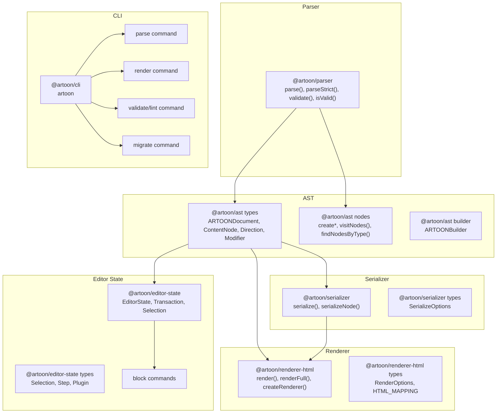
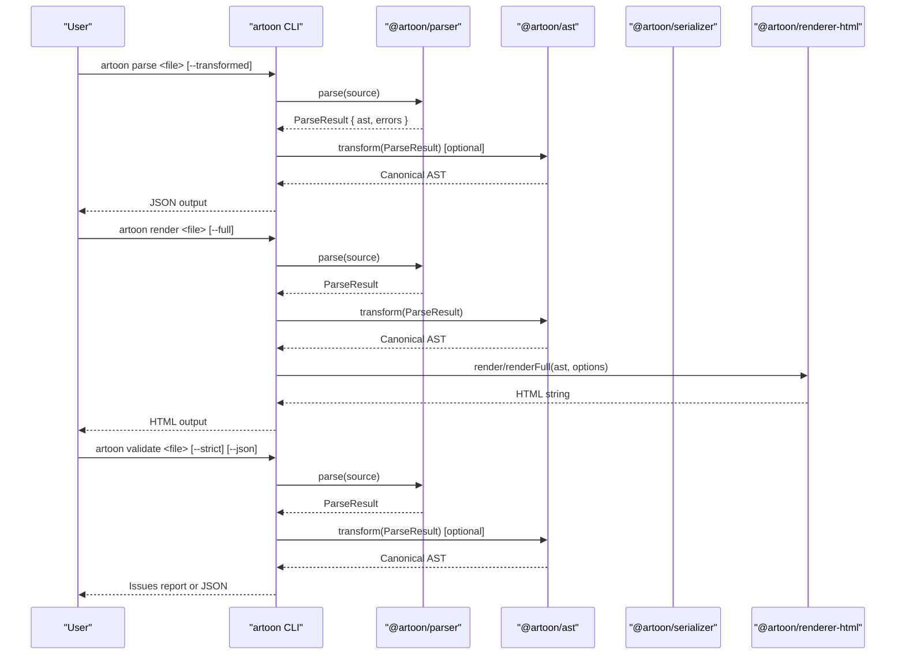
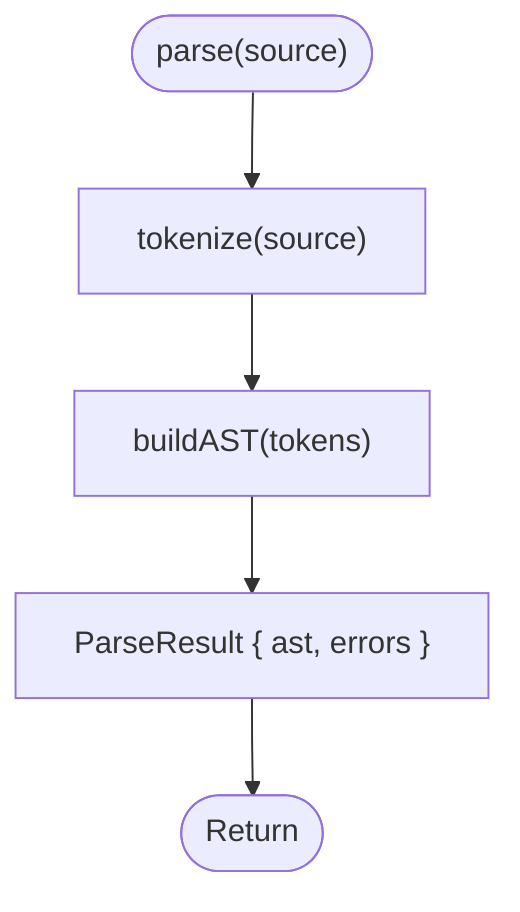
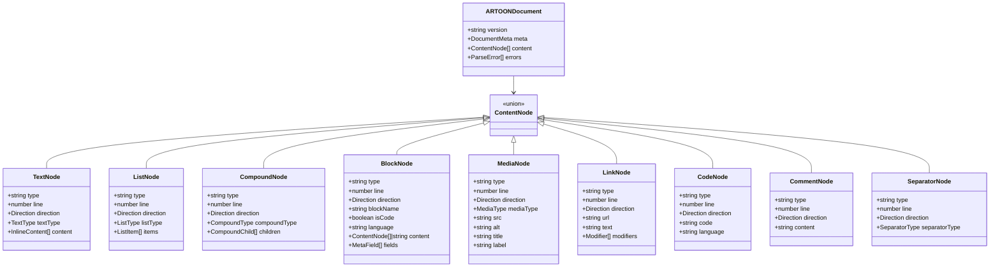
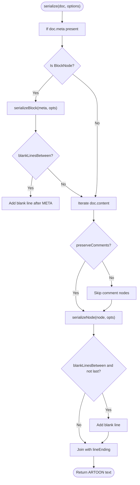
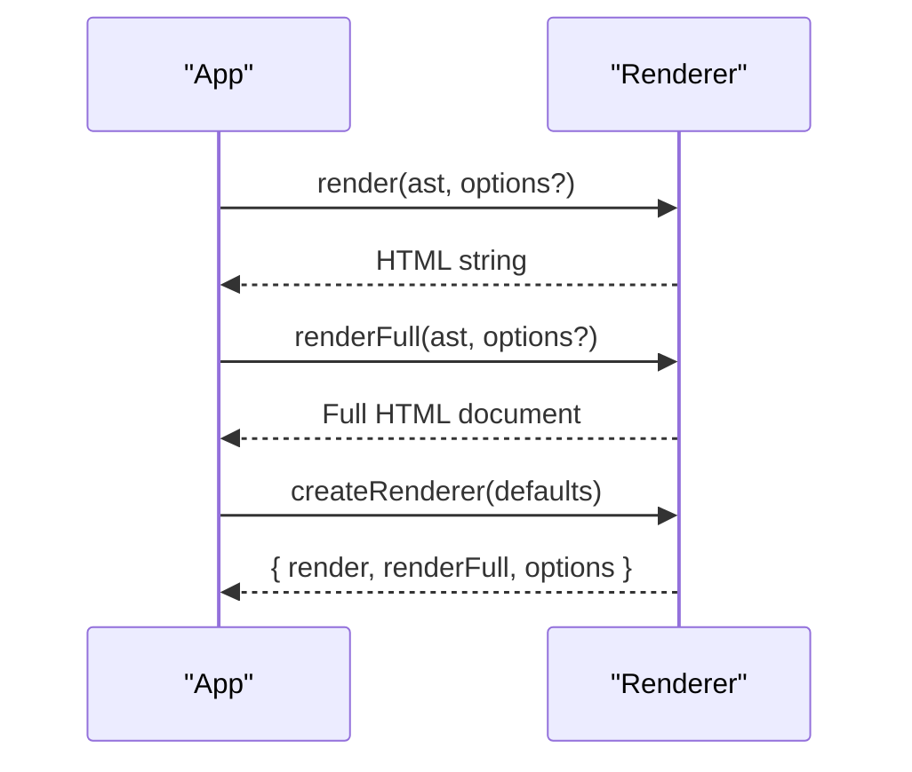
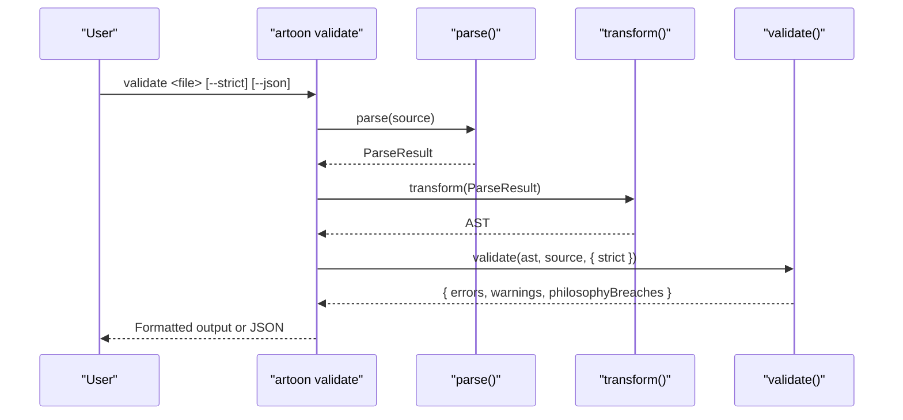
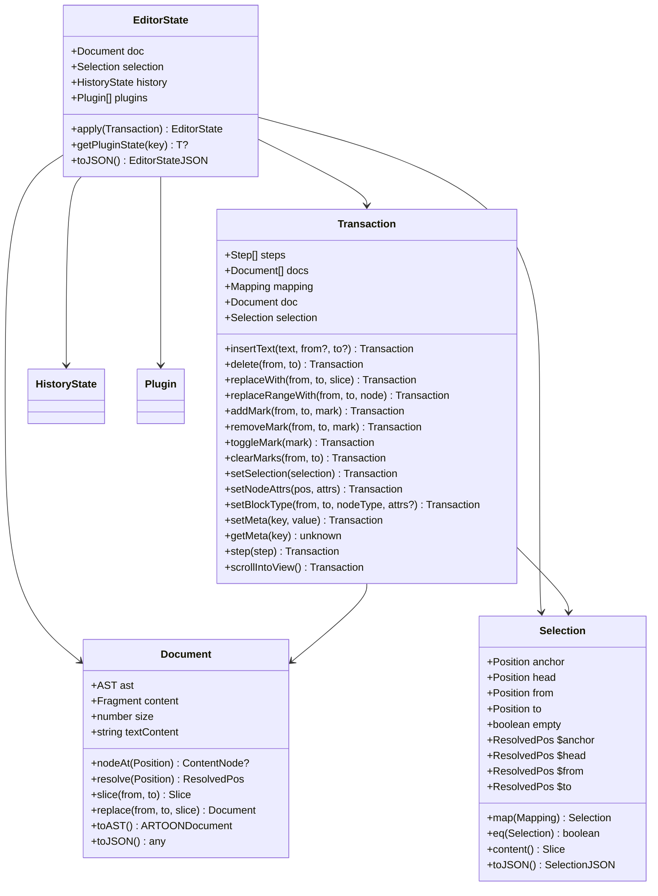
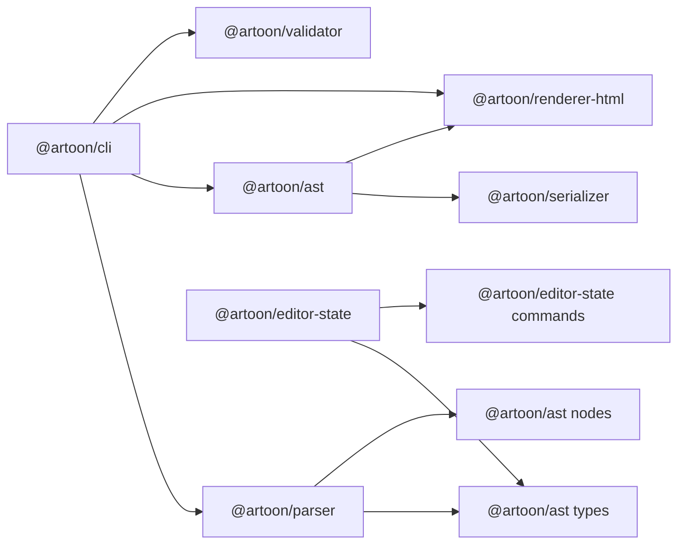

# API Reference

<cite>
**Referenced Files in This Document**
- [artoon-parser/src/index.ts](file://artoon-parser/src/index.ts)
- [artoon-parser/src/types.ts](file://artoon-parser/src/types.ts)
- [artoon-ast/src/index.ts](file://artoon-ast/src/index.ts)
- [artoon-ast/src/types.ts](file://artoon-ast/src/types.ts)
- [artoon-ast/src/nodes/index.ts](file://artoon-ast/src/nodes/index.ts)
- [artoon-ast/src/builder/ARTOONBuilder.ts](file://artoon-ast/src/builder/ARTOONBuilder.ts)
- [artoon-serializer/src/index.ts](file://artoon-serializer/src/index.ts)
- [artoon-serializer/src/types.ts](file://artoon-serializer/src/types.ts)
- [artoon-renderer-html/src/index.ts](file://artoon-renderer-html/src/index.ts)
- [artoon-renderer-html/src/types.ts](file://artoon-renderer-html/src/types.ts)
- [artoon-cli/src/index.ts](file://artoon-cli/src/index.ts)
- [artoon-cli/src/commands/parse.ts](file://artoon-cli/src/commands/parse.ts)
- [artoon-cli/src/commands/render.ts](file://artoon-cli/src/commands/render.ts)
- [artoon-cli/src/commands/validate.ts](file://artoon-cli/src/commands/validate.ts)
- [artoon-cli/src/commands/migrate.ts](file://artoon-cli/src/commands/migrate.ts)
- [artoon-editor-state/src/index.ts](file://artoon-editor-state/src/index.ts)
- [artoon-editor-state/src/types.ts](file://artoon-editor-state/src/types.ts)
- [artoon-editor-state/src/commands/block.ts](file://artoon-editor-state/src/commands/block.ts)
</cite>

## Table of Contents
1. [Introduction](#introduction)
2. [Project Structure](#project-structure)
3. [Core Components](#core-components)
4. [Architecture Overview](#architecture-overview)
5. [Detailed Component Analysis](#detailed-component-analysis)
6. [Dependency Analysis](#dependency-analysis)
7. [Performance Considerations](#performance-considerations)
8. [Troubleshooting Guide](#troubleshooting-guide)
9. [Conclusion](#conclusion)
10. [Appendices](#appendices)

## Introduction
This document provides a comprehensive API reference for ARTOON 2.0’s public interfaces across the parser, AST, serializer, renderer, CLI, and editor state modules. It covers function signatures, parameters, return values, error handling, and practical usage patterns. TypeScript type definitions and interface documentation are included to help developers integrate and extend the system.

## Project Structure
The ARTOON 2.0 ecosystem is organized into focused packages:
- Parser: Tokenization, AST construction, and validation helpers
- AST: Canonical AST types, utilities, and builder
- Serializer: Conversion of AST back to ARTOON text
- Renderer: HTML generation with customizable options
- CLI: Command-line tools for parse, render, validate, and migrate
- Editor State: Framework-agnostic state model and commands

**Diagram sources**
- [artoon-parser/src/index.ts:1-119](file://artoon-parser/src/index.ts#L1-L119)
- [artoon-ast/src/index.ts:1-51](file://artoon-ast/src/index.ts#L1-L51)
- [artoon-ast/src/types.ts:1-539](file://artoon-ast/src/types.ts#L1-L539)
- [artoon-ast/src/nodes/index.ts:1-258](file://artoon-ast/src/nodes/index.ts#L1-L258)
- [artoon-ast/src/builder/ARTOONBuilder.ts:1-147](file://artoon-ast/src/builder/ARTOONBuilder.ts#L1-L147)
- [artoon-serializer/src/index.ts:1-95](file://artoon-serializer/src/index.ts#L1-L95)
- [artoon-serializer/src/types.ts:1-32](file://artoon-serializer/src/types.ts#L1-L32)
- [artoon-renderer-html/src/index.ts:1-57](file://artoon-renderer-html/src/index.ts#L1-L57)
- [artoon-renderer-html/src/types.ts:1-187](file://artoon-renderer-html/src/types.ts#L1-L187)
- [artoon-cli/src/index.ts:1-61](file://artoon-cli/src/index.ts#L1-L61)
- [artoon-editor-state/src/index.ts:1-192](file://artoon-editor-state/src/index.ts#L1-L192)
- [artoon-editor-state/src/types.ts:1-516](file://artoon-editor-state/src/types.ts#L1-L516)
- [artoon-editor-state/src/commands/block.ts:1-315](file://artoon-editor-state/src/commands/block.ts#L1-L315)

**Section sources**
- [artoon-parser/src/index.ts:1-119](file://artoon-parser/src/index.ts#L1-L119)
- [artoon-ast/src/index.ts:1-51](file://artoon-ast/src/index.ts#L1-L51)
- [artoon-serializer/src/index.ts:1-95](file://artoon-serializer/src/index.ts#L1-L95)
- [artoon-renderer-html/src/index.ts:1-57](file://artoon-renderer-html/src/index.ts#L1-L57)
- [artoon-cli/src/index.ts:1-61](file://artoon-cli/src/index.ts#L1-L61)
- [artoon-editor-state/src/index.ts:1-192](file://artoon-editor-state/src/index.ts#L1-L192)

## Core Components
This section summarizes the primary APIs and their responsibilities.

- Parser API
  - parse(source): Produces a ParseResult containing AST and errors
  - parseStrict(source): Throws on parse errors; returns AST
  - validate(source): Returns parse-time errors
  - isValid(source): Boolean check for validity
  - tokenize, buildAST, parseInlineContent, ContextStack, converter utilities

- AST API
  - Types: ARTOONDocument, ContentNode, Direction, Modifier, and node-specific interfaces
  - Node utilities: createTextNode, createListNode, createSeparatorNode, visitNodes, findNodesByType, extractText, countByType, inlineToText, hasModifiers, getModifiers
  - Builder: ARTOONBuilder fluent API for constructing documents

- Serializer API
  - serialize(document, options?): Converts AST to ARTOON text
  - serializeNode, serializeInlineContent, and per-node serializers
  - Options: lineEnding, blankLinesBetween, preserveComments

- Renderer API
  - render(document, options?): Renders to HTML fragment
  - renderFull(document, options?): Renders to full HTML document
  - createRenderer(defaultOptions?): Returns a reusable renderer instance
  - Options: fullDocument, includeDirection, defaultDirection, indent, indentSize, includeComments, commentDisplay, metaHandling, customBlocks, defaultCustomBlockTag, classPrefix, addSemanticClasses

- CLI
  - artoon parse <file> [--output] [--compact] [--transformed]
  - artoon render <file> [--output] [--full] [--no-direction]
  - artoon validate <file> [--strict] [--quiet] [--json]
  - artoon lint <file> (alias for validate)
  - artoon migrate <path> [--dry-run]

- Editor State API
  - Types: Position, ResolvedPos, Selection, TextSelection, NodeSelection, AllSelection, Document, Slice, Fragment, Step, ReplaceStep, AddMarkStep, RemoveMarkStep, SetAttrsStep, Transaction, HistoryState, Plugin, PluginKey, EditorState, Command, Keymap
  - Commands: block commands (setParagraph, setHeadingN, setBlockquote, setPreformatted, setBlockType, toggleBlockquote, setDirectionRTL/LTR/toggleDirection, insertHorizontalRule/Break, liftBlock, sinkBlock, joinUp/Down, splitBlock)
  - Keymaps: blockKeymap

**Section sources**
- [artoon-parser/src/index.ts:39-100](file://artoon-parser/src/index.ts#L39-L100)
- [artoon-ast/src/index.ts:13-45](file://artoon-ast/src/index.ts#L13-L45)
- [artoon-ast/src/nodes/index.ts:29-258](file://artoon-ast/src/nodes/index.ts#L29-L258)
- [artoon-ast/src/builder/ARTOONBuilder.ts:34-146](file://artoon-ast/src/builder/ARTOONBuilder.ts#L34-L146)
- [artoon-serializer/src/index.ts:17-80](file://artoon-serializer/src/index.ts#L17-L80)
- [artoon-serializer/src/types.ts:6-32](file://artoon-serializer/src/types.ts#L6-L32)
- [artoon-renderer-html/src/index.ts:19-51](file://artoon-renderer-html/src/index.ts#L19-L51)
- [artoon-renderer-html/src/types.ts:37-117](file://artoon-renderer-html/src/types.ts#L37-L117)
- [artoon-cli/src/index.ts:17-58](file://artoon-cli/src/index.ts#L17-L58)
- [artoon-editor-state/src/index.ts:14-191](file://artoon-editor-state/src/index.ts#L14-L191)
- [artoon-editor-state/src/commands/block.ts:73-314](file://artoon-editor-state/src/commands/block.ts#L73-L314)

## Architecture Overview
The ARTOON 2.0 pipeline transforms ARTOON text into a canonical AST, supports serialization back to ARTOON, renders to HTML, and provides editor state primitives for manipulation.

**Diagram sources**
- [artoon-cli/src/commands/parse.ts:13-65](file://artoon-cli/src/commands/parse.ts#L13-L65)
- [artoon-cli/src/commands/render.ts:14-62](file://artoon-cli/src/commands/render.ts#L14-L62)
- [artoon-cli/src/commands/validate.ts:22-149](file://artoon-cli/src/commands/validate.ts#L22-L149)
- [artoon-parser/src/index.ts:56-100](file://artoon-parser/src/index.ts#L56-L100)
- [artoon-ast/src/index.ts:14](file://artoon-ast/src/index.ts#L14)
- [artoon-renderer-html/src/index.ts:19-34](file://artoon-renderer-html/src/index.ts#L19-L34)

## Detailed Component Analysis

### Parser API
- Purpose: Convert ARTOON text into a typed AST with error reporting.
- Functions:
  - parse(source: string): ParseResult
    - Parameters: source – ARTOON text
    - Returns: ParseResult with ast (DocumentNode) and errors (ParseError[])
    - Errors: None thrown; errors collected in result
    - Example usage: See [artoon-parser/src/index.ts:46-54](file://artoon-parser/src/index.ts#L46-L54)
  - parseStrict(source: string): DocumentNode
    - Parameters: source – ARTOON text
    - Returns: AST if valid
    - Throws: Error if parse errors exist
    - Example usage: See [artoon-parser/src/index.ts:68-79](file://artoon-parser/src/index.ts#L68-L79)
  - validate(source: string): ParseError[]
    - Parameters: source – ARTOON text
    - Returns: Array of parse-time errors
    - Example usage: See [artoon-parser/src/index.ts:87-90](file://artoon-parser/src/index.ts#L87-L90)
  - isValid(source: string): boolean
    - Parameters: source – ARTOON text
    - Returns: true if no parse errors
    - Example usage: See [artoon-parser/src/index.ts:98-100](file://artoon-parser/src/index.ts#L98-L100)
- Related exports: tokenize, tokenizeLine, parseInlineContent, ContextStack, buildAST, converter utilities
- Types: Direction, ComponentType, Modifier, and component sets (VALID_MODIFIERS, NO_MODIFIER_COMPONENTS, etc.)

**Diagram sources**
- [artoon-parser/src/index.ts:56-59](file://artoon-parser/src/index.ts#L56-L59)

**Section sources**
- [artoon-parser/src/index.ts:39-100](file://artoon-parser/src/index.ts#L39-L100)
- [artoon-parser/src/types.ts:1-123](file://artoon-parser/src/types.ts#L1-L123)

### AST API
- Purpose: Define canonical AST types and provide utilities for node creation, traversal, and manipulation.
- Types:
  - ARTOONDocument, ContentNode union, Direction, Modifier
  - Node-specific interfaces: TextNode, ListNode, TableNode, CompoundNode, BlockNode, MediaNode, LinkNode, CodeNode, CommentNode, SeparatorNode
  - Inline content: PlainText, InlineComponent, InlineContent
- Node utilities:
  - Creation: createTextNode, createListNode, createSeparatorNode, createPlainText, createInlineComponent
  - Traversal: visitNodes, findNodesByType, extractText, countByType
  - Inline helpers: inlineToText, hasModifiers, getModifiers
- Builder:
  - ARTOONBuilder: fluent API to construct documents with meta, paragraphs, headings, separators, lists, and custom blocks

**Diagram sources**
- [artoon-ast/src/types.ts:413-418](file://artoon-ast/src/types.ts#L413-L418)
- [artoon-ast/src/types.ts:132-137](file://artoon-ast/src/types.ts#L132-L137)
- [artoon-ast/src/types.ts:211-216](file://artoon-ast/src/types.ts#L211-L216)
- [artoon-ast/src/types.ts:267-272](file://artoon-ast/src/types.ts#L267-L272)
- [artoon-ast/src/types.ts:290-298](file://artoon-ast/src/types.ts#L290-L298)
- [artoon-ast/src/types.ts:307-315](file://artoon-ast/src/types.ts#L307-L315)
- [artoon-ast/src/types.ts:324-330](file://artoon-ast/src/types.ts#L324-L330)
- [artoon-ast/src/types.ts:339-344](file://artoon-ast/src/types.ts#L339-L344)
- [artoon-ast/src/types.ts:353-357](file://artoon-ast/src/types.ts#L353-L357)
- [artoon-ast/src/types.ts:150-165](file://artoon-ast/src/types.ts#L150-L165)

**Section sources**
- [artoon-ast/src/index.ts:13-45](file://artoon-ast/src/index.ts#L13-L45)
- [artoon-ast/src/types.ts:1-539](file://artoon-ast/src/types.ts#L1-L539)
- [artoon-ast/src/nodes/index.ts:29-258](file://artoon-ast/src/nodes/index.ts#L29-L258)
- [artoon-ast/src/builder/ARTOONBuilder.ts:34-146](file://artoon-ast/src/builder/ARTOONBuilder.ts#L34-L146)

### Serializer API
- Purpose: Convert AST back to ARTOON text with configurable formatting.
- serialize(document, options?): string
  - Parameters:
    - document: ARTOONDocument or compatible shape
    - options: SerializeOptions (lineEnding, blankLinesBetween, preserveComments)
  - Behavior: Serializes META block if present, iterates content, respects options
  - Returns: ARTOON text
- serializeNode, serializeInlineContent, and per-node serializers exported for advanced usage
- Options:
  - lineEnding: '\n' | '\r\n'
  - blankLinesBetween: boolean
  - preserveComments: boolean

**Diagram sources**
- [artoon-serializer/src/index.ts:17-59](file://artoon-serializer/src/index.ts#L17-L59)
- [artoon-serializer/src/types.ts:6-32](file://artoon-serializer/src/types.ts#L6-L32)

**Section sources**
- [artoon-serializer/src/index.ts:10-95](file://artoon-serializer/src/index.ts#L10-L95)
- [artoon-serializer/src/types.ts:1-32](file://artoon-serializer/src/types.ts#L1-L32)

### Renderer API
- Purpose: Render ARTOON AST to HTML with extensive customization.
- render(document, options?): string
  - Renders HTML fragment
- renderFull(document, options?): string
  - Renders full HTML document (html/head/body)
- createRenderer(defaultOptions?): RendererInstance
  - Returns { render, renderFull, options }
- Options (RenderOptions):
  - fullDocument: boolean
  - title: string
  - includeDirection: boolean
  - defaultDirection: 'rtl' | 'ltr'
  - indent: boolean
  - indentSize: number
  - includeComments: boolean
  - commentDisplay: 'hidden' | 'editor-only' | 'visible' | 'collapsible'
  - commentTag: 'div' | 'aside' | 'span' | 'section'
  - metaHandling: 'hide' | 'tags' | 'comment'
  - customBlocks: CustomBlockMapping[]
  - defaultCustomBlockTag: string
  - classPrefix: string
  - addSemanticClasses: boolean
- HTML mapping constants define component-to-tag mappings

**Diagram sources**
- [artoon-renderer-html/src/index.ts:19-51](file://artoon-renderer-html/src/index.ts#L19-L51)
- [artoon-renderer-html/src/types.ts:37-117](file://artoon-renderer-html/src/types.ts#L37-L117)

**Section sources**
- [artoon-renderer-html/src/index.ts:16-57](file://artoon-renderer-html/src/index.ts#L16-L57)
- [artoon-renderer-html/src/types.ts:1-187](file://artoon-renderer-html/src/types.ts#L1-L187)

### CLI Command Reference
- artoon parse <file> [options]
  - Options:
    - -o, --output <file>: Write JSON to file
    - -c, --compact: Compact JSON
    - -t, --transformed: Output canonical AST via transform
  - Behavior: Reads file, parses, validates, optionally transforms, prints or writes JSON
- artoon render <file> [options]
  - Options:
    - -o, --output <file>: Write HTML to file
    - -f, --full: Generate full HTML document
    - --no-direction: Disable direction attributes
  - Behavior: Parses, transforms, renders to HTML fragment or full document
- artoon validate <file> [options]
  - Aliases: lint
  - Options:
    - -s, --strict: Treat warnings as errors
    - -q, --quiet: Only show errors
    - --json: Output structured JSON
  - Behavior: Parses, transforms (if AST exists), runs validator, prints issues and exits with appropriate code
- artoon migrate <directory_or_file> [options]
  - Options:
    - --dry-run: Preview changes without writing
  - Behavior: Recursively processes .json files, migrates AST to v2.0 if needed

**Diagram sources**
- [artoon-cli/src/commands/validate.ts:22-149](file://artoon-cli/src/commands/validate.ts#L22-L149)

**Section sources**
- [artoon-cli/src/index.ts:17-58](file://artoon-cli/src/index.ts#L17-L58)
- [artoon-cli/src/commands/parse.ts:13-65](file://artoon-cli/src/commands/parse.ts#L13-L65)
- [artoon-cli/src/commands/render.ts:14-62](file://artoon-cli/src/commands/render.ts#L14-L62)
- [artoon-cli/src/commands/validate.ts:22-149](file://artoon-cli/src/commands/validate.ts#L22-L149)
- [artoon-cli/src/commands/migrate.ts:5-55](file://artoon-cli/src/commands/migrate.ts#L5-L55)

### Editor State API
- Purpose: Provide a framework-agnostic state model for editing ARTOON documents, inspired by ProseMirror-like architecture.
- Types:
  - Position, ResolvedPos, Selection, TextSelection, NodeSelection, AllSelection, Document, Slice, Fragment, Step, ReplaceStep, AddMarkStep, RemoveMarkStep, SetAttrsStep, Transaction, HistoryState, Plugin, PluginKey, EditorState, Command, Keymap
- Commands:
  - Block commands: setParagraph, setHeading1..6, setBlockquote, setPreformatted, setBlockType, toggleBlockquote, setDirectionRTL/LTR/toggleDirection, insertHorizontalRule/Break, liftBlock, sinkBlock, joinUp/Down, splitBlock
  - Keymaps: blockKeymap binds keys to commands
- Usage pattern:
  - Create EditorState with initial doc, selection, plugins
  - Compose transactions using Transaction methods
  - Apply transactions to update EditorState immutably
  - Dispatch commands via keymaps or UI actions

**Diagram sources**
- [artoon-editor-state/src/types.ts:441-462](file://artoon-editor-state/src/types.ts#L441-L462)
- [artoon-editor-state/src/types.ts:291-337](file://artoon-editor-state/src/types.ts#L291-L337)
- [artoon-editor-state/src/types.ts:82-141](file://artoon-editor-state/src/types.ts#L82-L141)
- [artoon-editor-state/src/types.ts:187-209](file://artoon-editor-state/src/types.ts#L187-L209)

**Section sources**
- [artoon-editor-state/src/index.ts:14-191](file://artoon-editor-state/src/index.ts#L14-L191)
- [artoon-editor-state/src/types.ts:1-516](file://artoon-editor-state/src/types.ts#L1-L516)
- [artoon-editor-state/src/commands/block.ts:73-314](file://artoon-editor-state/src/commands/block.ts#L73-L314)

## Dependency Analysis
- Parser depends on Lexer and AST builders; re-exports tokenizer and inline conversion utilities.
- AST provides types, compatibility layer, transform utilities, serialization helpers, node utilities, and builder.
- Serializer consumes AST types and node serializers; exposes per-node serializers for advanced usage.
- Renderer consumes AST types and node renderers; exposes utilities for escaping and HTML generation.
- CLI composes Parser, AST transform, Serializer, and Renderer; also integrates Validator for validation.
- Editor State consumes AST types and provides commands and state model.

**Diagram sources**
- [artoon-parser/src/index.ts:4-37](file://artoon-parser/src/index.ts#L4-L37)
- [artoon-ast/src/index.ts:5-45](file://artoon-ast/src/index.ts#L5-L45)
- [artoon-serializer/src/index.ts:4-8](file://artoon-serializer/src/index.ts#L4-L8)
- [artoon-renderer-html/src/index.ts:3-5](file://artoon-renderer-html/src/index.ts#L3-L5)
- [artoon-cli/src/index.ts:4-8](file://artoon-cli/src/index.ts#L4-L8)
- [artoon-editor-state/src/index.ts:58-76](file://artoon-editor-state/src/index.ts#L58-L76)

**Section sources**
- [artoon-parser/src/index.ts:4-37](file://artoon-parser/src/index.ts#L4-L37)
- [artoon-ast/src/index.ts:5-45](file://artoon-ast/src/index.ts#L5-L45)
- [artoon-serializer/src/index.ts:4-8](file://artoon-serializer/src/index.ts#L4-L8)
- [artoon-renderer-html/src/index.ts:3-5](file://artoon-renderer-html/src/index.ts#L3-L5)
- [artoon-cli/src/index.ts:4-8](file://artoon-cli/src/index.ts#L4-L8)
- [artoon-editor-state/src/index.ts:58-76](file://artoon-editor-state/src/index.ts#L58-L76)

## Performance Considerations
- Parser: Tokenization and AST building are linear in input length; avoid repeated parsing by caching ParseResult when possible.
- AST traversal: visitNodes performs a single pass over content; prefer targeted queries (findNodesByType) for specific node types.
- Serializer: blankLinesBetween and preserveComments add extra string operations; disable where not needed for minimal overhead.
- Renderer: indent and includeComments increase output size and processing time; disable for production builds.
- Editor State: Transactions compose steps; batch operations to minimize recomputation and re-renders.

[No sources needed since this section provides general guidance]

## Troubleshooting Guide
- Parser errors:
  - Use validate(source) or parseStrict(source) to detect syntax issues early.
  - parseStrict throws on errors; catch and inspect messages for line numbers.
- Serialization issues:
  - Ensure document.meta is handled; META blocks are serialized first when present.
  - Adjust preserveComments and blankLinesBetween to match expectations.
- Rendering issues:
  - Verify includeDirection and defaultDirection align with document directionality.
  - Use commentDisplay and metaHandling to control visibility of comments and META.
- CLI validation:
  - Use --strict to treat warnings as errors.
  - Use --json for machine-readable output and automated tooling.
- Migration:
  - Run migrate with --dry-run to preview changes before applying.

**Section sources**
- [artoon-parser/src/index.ts:68-100](file://artoon-parser/src/index.ts#L68-L100)
- [artoon-serializer/src/index.ts:17-59](file://artoon-serializer/src/index.ts#L17-L59)
- [artoon-renderer-html/src/index.ts:19-51](file://artoon-renderer-html/src/index.ts#L19-L51)
- [artoon-cli/src/commands/validate.ts:142-148](file://artoon-cli/src/commands/validate.ts#L142-L148)
- [artoon-cli/src/commands/migrate.ts:31-37](file://artoon-cli/src/commands/migrate.ts#L31-L37)

## Conclusion
ARTOON 2.0 offers a cohesive, extensible toolkit for parsing, transforming, serializing, and rendering ARTOON documents, along with a robust editor state model and CLI for automation. The APIs emphasize type safety, composability, and configurability, enabling both simple integrations and advanced customizations.

[No sources needed since this section summarizes without analyzing specific files]

## Appendices

### TypeScript Type Definitions and Interfaces

- Parser Types
  - Direction: 'rtl' | 'ltr'
  - ComponentType: union of text, semantic, media, separator, list, table, compound, compound child, code
  - Modifier: 's' | 'e' | 'u' | 'd' | 'mark' | 'sub' | 'sup'
  - Component sets: VALID_MODIFIERS, NO_MODIFIER_COMPONENTS, SEPARATOR_COMPONENTS, MODIFIER_ACCEPTING_COMPONENTS, VALID_COMPONENTS

- AST Types
  - Direction, Modifier, TextType, ListType, ListItemType, CompoundType, InlineComponentType, SeparatorType
  - BaseNode, InlineContent (PlainText, InlineComponent), ContentNode union, ARTOONDocument, DocumentMeta, ParseError
  - Node-specific interfaces: TextNode, ListNode, CompoundNode, BlockNode, MediaNode, LinkNode, CodeNode, CommentNode, SeparatorNode
  - Type guards: isTextNode, isListNode, isTableNode, isCompoundNode, isBlockNode, isMediaNode, isLinkNode, isCodeNode, isSeparatorNode, isCommentNode, isPlainText, isInlineComponent, plus helpers for time and abbr

- Serializer Types
  - SerializeOptions: lineEnding, blankLinesBetween, preserveComments
  - DEFAULT_OPTIONS
  - getDirectionMarker(direction): returns '>' | '<'

- Renderer Types
  - MetaHandlingMode: 'hide' | 'tags' | 'comment'
  - CommentDisplayMode: 'hidden' | 'editor-only' | 'visible' | 'collapsible'
  - CustomBlockMapping: name, tag, className?, attributes?
  - RenderOptions: fullDocument, title, includeDirection, defaultDirection, indent, indentSize, includeComments, commentDisplay, commentTag, metaHandling, customBlocks, defaultCustomBlockTag, classPrefix, addSemanticClasses
  - DEFAULT_OPTIONS, HTML_MAPPING

- Editor State Types
  - Position, ResolvedPos, MapResult, Mapping
  - Selection, TextSelection, NodeSelection, AllSelection, SelectionJSON
  - Slice, Fragment, Document
  - Step, ReplaceStep, AddMarkStep, RemoveMarkStep, SetAttrsStep, StepResult, StepJSON
  - Transaction (with methods for text, marks, selection, node ops, metadata)
  - HistoryState, HistoryItem
  - Plugin, PluginKey, PluginSpec
  - EditorState, EditorStateConfig, EditorStateJSON
  - Command, Dispatch, Keymap

**Section sources**
- [artoon-parser/src/types.ts:1-123](file://artoon-parser/src/types.ts#L1-L123)
- [artoon-ast/src/types.ts:17-539](file://artoon-ast/src/types.ts#L17-L539)
- [artoon-serializer/src/types.ts:6-32](file://artoon-serializer/src/types.ts#L6-L32)
- [artoon-renderer-html/src/types.ts:6-187](file://artoon-renderer-html/src/types.ts#L6-L187)
- [artoon-editor-state/src/types.ts:20-516](file://artoon-editor-state/src/types.ts#L20-L516)