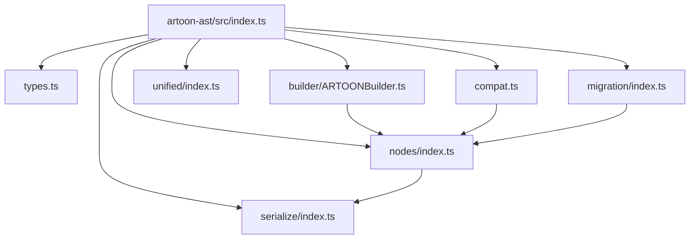
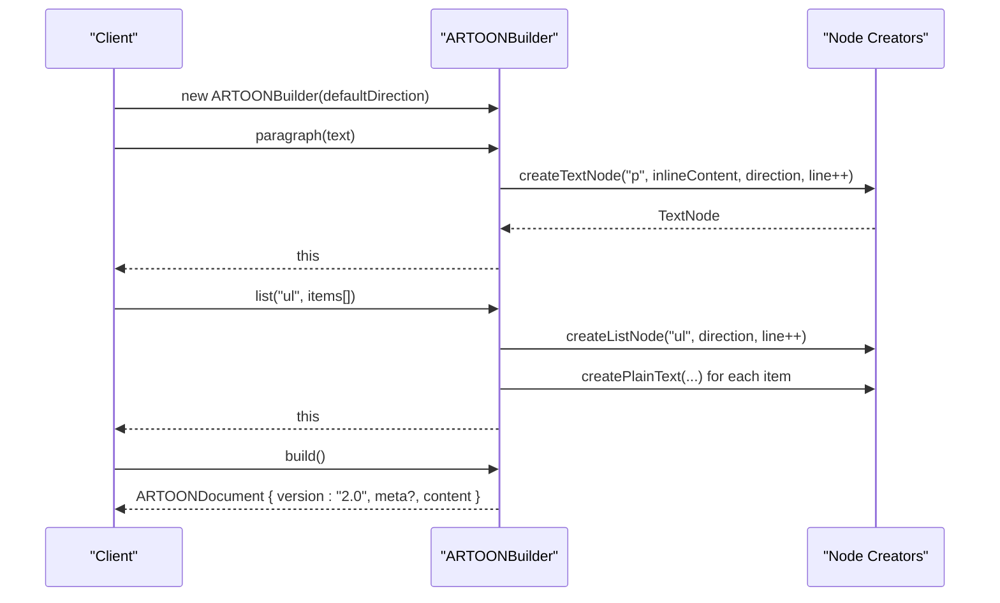
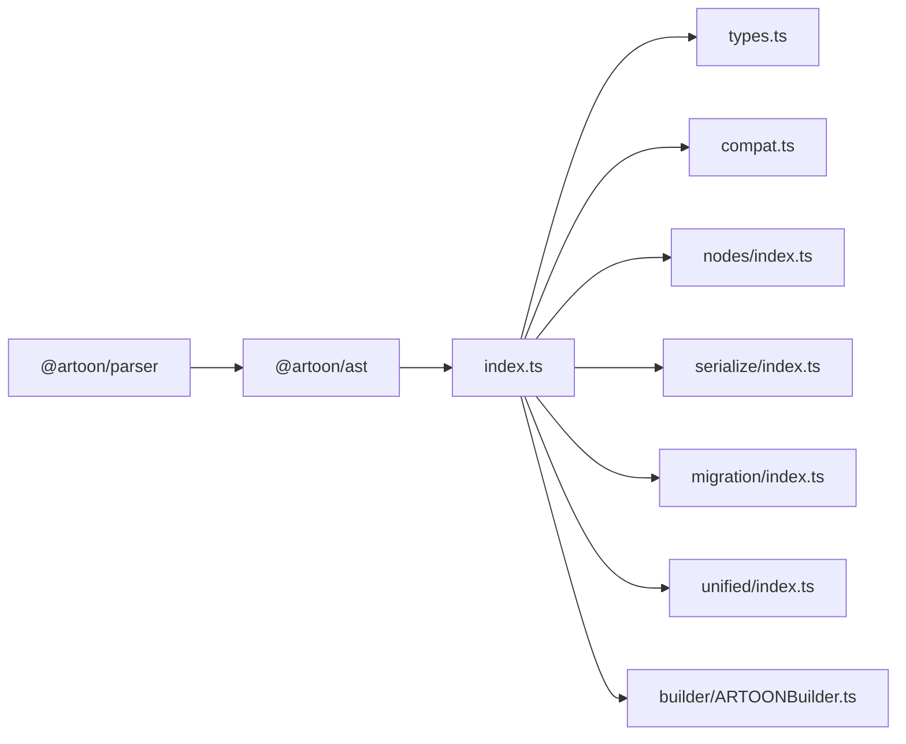

# AST API

<cite>
**Referenced Files in This Document**
- [index.ts](file://artoon-ast/src/index.ts)
- [types.ts](file://artoon-ast/src/types.ts)
- [compat.ts](file://artoon-ast/src/compat.ts)
- [nodes/index.ts](file://artoon-ast/src/nodes/index.ts)
- [serialize/index.ts](file://artoon-ast/src/serialize/index.ts)
- [migration/index.ts](file://artoon-ast/src/migration/index.ts)
- [unified/index.ts](file://artoon-ast/src/unified/index.ts)
- [builder/ARTOONBuilder.ts](file://artoon-ast/src/builder/ARTOONBuilder.ts)
- [builder/index.ts](file://artoon-ast/src/builder/index.ts)
- [package.json](file://artoon-ast/package.json)
</cite>

## Table of Contents
1. [Introduction](#introduction)
2. [Project Structure](#project-structure)
3. [Core Components](#core-components)
4. [Architecture Overview](#architecture-overview)
5. [Detailed Component Analysis](#detailed-component-analysis)
6. [Dependency Analysis](#dependency-analysis)
7. [Performance Considerations](#performance-considerations)
8. [Troubleshooting Guide](#troubleshooting-guide)
9. [Conclusion](#conclusion)
10. [Appendices](#appendices)

## Introduction
This document provides comprehensive API documentation for the ARTOON Abstract Syntax Tree (AST) package. It describes the canonical AST structure introduced in version 2.0, including the DocumentNode, ContentNode, BlockNode, and InlineContent interfaces. It also documents node creation utilities, traversal and querying functions, manipulation helpers, compatibility layer functions for migrating between AST versions, and unified types for cross-package interoperability. Utility functions for validation, transformation, and serialization preparation are covered, along with memory management and performance optimization guidance for large AST operations.

## Project Structure
The ARTOON AST package exposes a focused set of modules:
- Public exports via a central index that re-exports types, utilities, and builders.
- Canonical type definitions for the AST v2.0 model.
- Compatibility utilities for migration and format normalization.
- Node creation and traversal utilities.
- Serialization and statistics utilities.
- Migration tooling to convert legacy ASTs to v2.0.
- Unified types for cross-package contracts.

**Diagram sources**
- [index.ts:1-51](file://artoon-ast/src/index.ts#L1-L51)
- [types.ts:1-539](file://artoon-ast/src/types.ts#L1-L539)
- [compat.ts:1-283](file://artoon-ast/src/compat.ts#L1-L283)
- [nodes/index.ts:1-258](file://artoon-ast/src/nodes/index.ts#L1-L258)
- [serialize/index.ts:1-96](file://artoon-ast/src/serialize/index.ts#L1-L96)
- [migration/index.ts:1-76](file://artoon-ast/src/migration/index.ts#L1-L76)
- [unified/index.ts:1-338](file://artoon-ast/src/unified/index.ts#L1-L338)
- [builder/ARTOONBuilder.ts:1-147](file://artoon-ast/src/builder/ARTOONBuilder.ts#L1-L147)

**Section sources**
- [index.ts:1-51](file://artoon-ast/src/index.ts#L1-L51)
- [package.json:1-25](file://artoon-ast/package.json#L1-L25)

## Core Components
This section outlines the canonical AST structure and key interfaces.

- BaseNode: All nodes extend this base with a type discriminator, line number, direction, and optional id.
- InlineContent: Union of PlainText and InlineComponent used inside text nodes.
- ContentNode: Union of all block-level nodes including TextNode, SeparatorNode, ListNode, TableNode, CompoundNode, BlockNode, MediaNode, LinkNode, CodeNode, and CommentNode.
- ARTOONDocument: Root document with version, optional metadata, content array, and optional parse errors.

Key type guards are provided to check node types safely across both legacy and new formats.

**Section sources**
- [types.ts:67-95](file://artoon-ast/src/types.ts#L67-L95)
- [types.ts:101-123](file://artoon-ast/src/types.ts#L101-L123)
- [types.ts:129-137](file://artoon-ast/src/types.ts#L129-L137)
- [types.ts:143-165](file://artoon-ast/src/types.ts#L143-L165)
- [types.ts:171-216](file://artoon-ast/src/types.ts#L171-L216)
- [types.ts:222-245](file://artoon-ast/src/types.ts#L222-L245)
- [types.ts:251-272](file://artoon-ast/src/types.ts#L251-L272)
- [types.ts:287-298](file://artoon-ast/src/types.ts#L287-L298)
- [types.ts:304-315](file://artoon-ast/src/types.ts#L304-L315)
- [types.ts:321-330](file://artoon-ast/src/types.ts#L321-L330)
- [types.ts:336-344](file://artoon-ast/src/types.ts#L336-L344)
- [types.ts:350-357](file://artoon-ast/src/types.ts#L350-L357)
- [types.ts:363-376](file://artoon-ast/src/types.ts#L363-L376)
- [types.ts:410-418](file://artoon-ast/src/types.ts#L410-L418)
- [types.ts:424-539](file://artoon-ast/src/types.ts#L424-L539)

## Architecture Overview
The AST architecture centers around a canonical v2.0 model with a compatibility layer to support migration from legacy ASTs. The unified types define the target contract for all ARTOON packages. Builders and utilities encapsulate creation, traversal, and transformation tasks.

```mermaid
classDiagram
class BaseNode {
+string type
+string nodeType
+number line
+Direction direction
+string id
}
class InlineContent
class PlainText {
+string type
+string value
}
class InlineComponent {
+string type
+string component
+Modifier[] modifiers
+Record~string,string~ attributes
+string value
}
InlineContent <|.. PlainText
InlineContent <|.. InlineComponent
class TextNode {
+string type
+TextType textType
+InlineContent[] content
}
BaseNode <|-- TextNode
class SeparatorNode {
+string type
+SeparatorType separatorType
+SeparatorType[] separators
}
BaseNode <|-- SeparatorNode
class ListItem {
+string id
+ListItemType itemType
+ListType listType
+InlineContent[] content
+ListType childListType
+ListItem[] children
}
class ListNode {
+string type
+ListType listType
+ListItem[] items
}
BaseNode <|-- ListNode
class TableNode {
+string type
+TableRow headers
+TableRow[] rows
}
class TableRow {
+string rowType
+TableCell[] cells
}
class TableCell {
+InlineContent[] content
}
BaseNode <|-- TableNode
class CompoundNode {
+string type
+CompoundType compoundType
+CompoundChild[] children
}
class CompoundChild {
+CompoundChildRole role
+ContentNode|InlineComponent node
}
BaseNode <|-- CompoundNode
class BlockNode {
+string type
+string blockName
+boolean isCode
+string language
+ContentNode[]|string content
+MetaField[] fields
}
BaseNode <|-- BlockNode
class MediaNode {
+string type
+MediaType mediaType
+string src
+string alt
+string title
+string label
}
BaseNode <|-- MediaNode
class LinkNode {
+string type
+string url
+string text
+Modifier[] modifiers
}
BaseNode <|-- LinkNode
class CodeNode {
+string type
+string code
+string language
}
BaseNode <|-- CodeNode
class CommentNode {
+string type
+string content
}
BaseNode <|-- CommentNode
class ARTOONDocument {
+string version
+DocumentMeta meta
+ContentNode[] content
+ParseError[] errors
}
```

**Diagram sources**
- [types.ts:67-95](file://artoon-ast/src/types.ts#L67-L95)
- [types.ts:101-123](file://artoon-ast/src/types.ts#L101-L123)
- [types.ts:129-137](file://artoon-ast/src/types.ts#L129-L137)
- [types.ts:143-165](file://artoon-ast/src/types.ts#L143-L165)
- [types.ts:171-216](file://artoon-ast/src/types.ts#L171-L216)
- [types.ts:222-245](file://artoon-ast/src/types.ts#L222-L245)
- [types.ts:251-272](file://artoon-ast/src/types.ts#L251-L272)
- [types.ts:287-298](file://artoon-ast/src/types.ts#L287-L298)
- [types.ts:304-315](file://artoon-ast/src/types.ts#L304-L315)
- [types.ts:321-330](file://artoon-ast/src/types.ts#L321-L330)
- [types.ts:336-344](file://artoon-ast/src/types.ts#L336-L344)
- [types.ts:350-357](file://artoon-ast/src/types.ts#L350-L357)
- [types.ts:410-418](file://artoon-ast/src/types.ts#L410-L418)

## Detailed Component Analysis

### Canonical AST Types and Guards
- BaseNode: Provides the canonical type discriminator and shared metadata.
- InlineContent: Discriminated union for plain text and inline components.
- ContentNode: Union of all block-level nodes.
- Type guards: isTextNode, isListNode, isTableNode, isCompoundNode, isBlockNode, isMediaNode, isLinkNode, isCodeNode, isSeparatorNode, isCommentNode, isPlainText, isInlineComponent, plus specialized guards for time and abbreviation text nodes.

These guards support safe runtime checks across both legacy and new formats.

**Section sources**
- [types.ts:67-95](file://artoon-ast/src/types.ts#L67-L95)
- [types.ts:101-123](file://artoon-ast/src/types.ts#L101-L123)
- [types.ts:363-376](file://artoon-ast/src/types.ts#L363-L376)
- [types.ts:424-539](file://artoon-ast/src/types.ts#L424-L539)

### Node Creation Utilities
- createTextNode: Creates a text node with a given type, inline content, direction, and line number.
- createPlainText: Creates plain text content.
- createInlineComponent: Creates inline components with optional component type, modifiers, attributes, and value.
- createListNode: Creates a list node with initial empty items.
- createSeparatorNode: Creates a separator node with canonical separatorType and backward-compatible separators array.

These functions return nodes with both type and nodeType for compatibility.

**Section sources**
- [nodes/index.ts:29-109](file://artoon-ast/src/nodes/index.ts#L29-L109)

### Traversal and Querying Utilities
- visitNodes: Traverses content nodes and visits children for lists, compounds, and blocks.
- findNodesByType: Collects nodes matching a given type.
- extractText: Extracts concatenated text from text nodes.
- countByType: Counts nodes by type across the document.

These utilities leverage the compatibility layer to detect node types consistently.

**Section sources**
- [nodes/index.ts:115-218](file://artoon-ast/src/nodes/index.ts#L115-L218)

### Inline Content Utilities
- inlineToText: Converts inline content to a concatenated string.
- hasModifiers: Checks if inline content includes any modifiers.
- getModifiers: Returns unique modifiers used in inline content.

**Section sources**
- [nodes/index.ts:224-257](file://artoon-ast/src/nodes/index.ts#L224-L257)

### Serialization and Statistics
- toJSON/fromJSON: Serialize and parse documents to JSON with version validation.
- toCompactJSON: Compact JSON representation.
- clone: Deep clone a document.
- getStats: Computes document statistics including node counts and per-type breakdowns.

**Section sources**
- [serialize/index.ts:1-96](file://artoon-ast/src/serialize/index.ts#L1-L96)

### Migration Tooling
- migrateToV2: Deep-clones and transforms a legacy AST to v2.0 canonical format, converting nodeType to type, normalizing list items, and converting separators.

**Section sources**
- [migration/index.ts:1-76](file://artoon-ast/src/migration/index.ts#L1-L76)

### Compatibility Layer
- normalizeNode: Ensures nodes have the canonical type property.
- createCompatNode: Adds nodeType alongside type for compatibility.
- isLegacyNode/isNewFormatNode/getNodeType: Detects format and extracts type.
- normalizeSeparatorNode/createCompatSeparatorNode: Normalizes and creates separator nodes with both formats.
- normalizeListItemChildren/wrapItemsInListNode: Normalizes list item children and wraps new format items in legacy ListNode.
- normalizeContent: Normalizes content arrays to v2.0.
- needsMigration/getMigrationStats: Determines migration needs and computes statistics.

**Section sources**
- [compat.ts:24-282](file://artoon-ast/src/compat.ts#L24-L282)

### Unified Types
Defines the target v2.0 contract for cross-package interoperability:
- UnifiedBaseNode, UnifiedInlineContent, UnifiedTextNode, UnifiedListNode, UnifiedSeparatorNode, UnifiedTableNode, UnifiedCompoundNode, UnifiedBlockNode, UnifiedMediaNode, UnifiedLinkNode, UnifiedCodeNode, UnifiedCommentNode, UnifiedContentNode, UnifiedARTOONDocument.
- Type guards for unified nodes.
- Property migration map and node type constants.

**Section sources**
- [unified/index.ts:1-338](file://artoon-ast/src/unified/index.ts#L1-L338)

### Fluent Builder API
- ARTOONBuilder: Fluent API for constructing documents with paragraphs, headings, separators, lists, and custom blocks. Supports direction and line numbering.

**Diagram sources**
- [builder/ARTOONBuilder.ts:34-146](file://artoon-ast/src/builder/ARTOONBuilder.ts#L34-L146)
- [nodes/index.ts:29-109](file://artoon-ast/src/nodes/index.ts#L29-L109)

**Section sources**
- [builder/ARTOONBuilder.ts:1-147](file://artoon-ast/src/builder/ARTOONBuilder.ts#L1-L147)
- [builder/index.ts:1-2](file://artoon-ast/src/builder/index.ts#L1-L2)

## Dependency Analysis
The AST package depends on the parser package and exposes a cohesive API surface. The builder depends on node creators and compatibility utilities.

**Diagram sources**
- [package.json:14-16](file://artoon-ast/package.json#L14-L16)
- [index.ts:1-51](file://artoon-ast/src/index.ts#L1-L51)

**Section sources**
- [package.json:1-25](file://artoon-ast/package.json#L1-L25)
- [index.ts:1-51](file://artoon-ast/src/index.ts#L1-L51)

## Performance Considerations
- Prefer iterative traversal over deeply nested recursion to avoid stack pressure on very large documents.
- Use findNodesByType and countByType to filter workloads before applying heavy transformations.
- Leverage toCompactJSON for production serialization to reduce payload size.
- Clone documents sparingly; reuse nodes where possible and apply transformations in-place when feasible.
- Normalize content once during migration rather than repeatedly checking legacy formats during processing.
- For frequent queries, cache computed statistics (e.g., counts) and invalidate on mutations.

## Troubleshooting Guide
Common issues and remedies:
- Legacy vs. new format confusion: Use compatibility utilities to normalize nodes and type guards to check types safely.
- Separator normalization: Ensure separatorType is used; legacy separators arrays are converted automatically.
- List item children: v2.0 stores ListItem[] directly; legacy ListNode-wrapped children are normalized.
- Version validation: fromJSON validates supported versions and throws on unsupported versions.
- Migration completeness: Use needsMigration and getMigrationStats to assess migration status.

**Section sources**
- [compat.ts:24-282](file://artoon-ast/src/compat.ts#L24-L282)
- [serialize/index.ts:16-25](file://artoon-ast/src/serialize/index.ts#L16-L25)
- [migration/index.ts:14-75](file://artoon-ast/src/migration/index.ts#L14-L75)

## Conclusion
The ARTOON AST v2.0 package provides a robust, unified, and extensible model for representing ARTOON documents. Its compatibility layer ensures smooth migration from legacy ASTs, while the fluent builder, traversal utilities, and serialization functions enable efficient construction, inspection, and transformation of documents. By leveraging unified types, type guards, and migration helpers, developers can maintain forward compatibility and optimize performance for large-scale editing and rendering pipelines.

## Appendices

### API Reference Summary
- Exports (from index):
  - Types: canonical types and unified types.
  - Compatibility: normalizeNode, createCompatNode, format detection, migration helpers.
  - Nodes: createTextNode, createPlainText, createInlineComponent, createListNode, createSeparatorNode, visitNodes, findNodesByType, extractText, countByType, inlineToText, hasModifiers, getModifiers.
  - Serialize: toJSON, fromJSON, toCompactJSON, clone, getStats.
  - Transform: transform (exported from transform module).
  - Migration: migrateToV2.
  - Builder: ARTOONBuilder.

**Section sources**
- [index.ts:4-45](file://artoon-ast/src/index.ts#L4-L45)