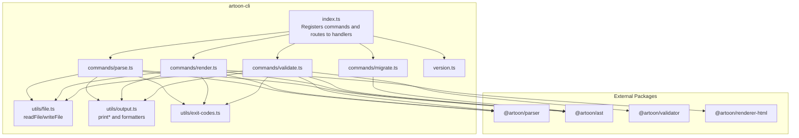
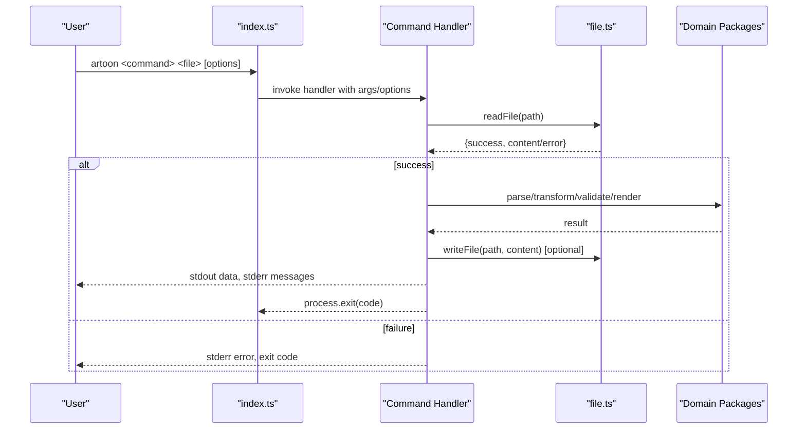
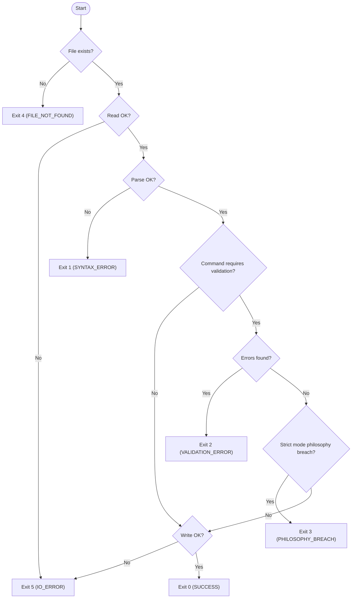
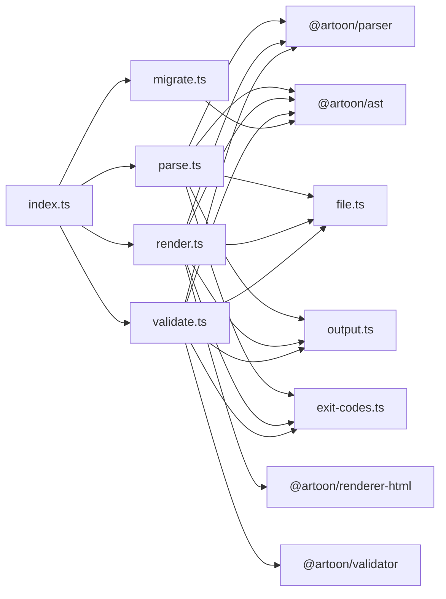

# CLI API

<cite>
**Referenced Files in This Document**
- [package.json](file://artoon-cli/package.json)
- [index.ts](file://artoon-cli/src/index.ts)
- [version.ts](file://artoon-cli/src/version.ts)
- [parse.ts](file://artoon-cli/src/commands/parse.ts)
- [render.ts](file://artoon-cli/src/commands/render.ts)
- [validate.ts](file://artoon-cli/src/commands/validate.ts)
- [migrate.ts](file://artoon-cli/src/commands/migrate.ts)
- [exit-codes.ts](file://artoon-cli/src/utils/exit-codes.ts)
- [file.ts](file://artoon-cli/src/utils/file.ts)
- [output.ts](file://artoon-cli/src/utils/output.ts)
- [04-COMMANDS.md](file://artoon-cli/inventory_artoon_cli/04-COMMANDS.md)
- [05-EXIT-CODES.md](file://artoon-cli/inventory_artoon_cli/05-EXIT-CODES.md)
- [06-OUTPUT-CONTRACTS.md](file://artoon-cli/inventory_artoon_cli/06-OUTPUT-CONTRACTS.md)
</cite>

## Table of Contents
1. [Introduction](#introduction)
2. [Project Structure](#project-structure)
3. [Core Components](#core-components)
4. [Architecture Overview](#architecture-overview)
5. [Detailed Component Analysis](#detailed-component-analysis)
6. [Dependency Analysis](#dependency-analysis)
7. [Performance Considerations](#performance-considerations)
8. [Troubleshooting Guide](#troubleshooting-guide)
9. [Conclusion](#conclusion)
10. [Appendices](#appendices)

## Introduction
This document provides comprehensive API documentation for the ARTOON Command Line Interface (CLI) package. It covers all available CLI commands (parse, render, validate, and migrate), their command-line options, flags, and usage patterns. It also documents the programmatic API for integrating CLI functionality into other applications, input/output handling, file system operations, error reporting, exit codes, logging, and practical examples for batch processing, automated validation pipelines, and CI/CD integration.

## Project Structure
The CLI package is organized around a central entry point that registers four commands and delegates to dedicated command modules. Shared utilities handle file I/O, output formatting, and exit codes. The package exposes a binary named artoon that invokes the CLI.

**Diagram sources**
- [index.ts:1-61](file://artoon-cli/src/index.ts#L1-L61)
- [parse.ts:1-66](file://artoon-cli/src/commands/parse.ts#L1-L66)
- [render.ts:1-63](file://artoon-cli/src/commands/render.ts#L1-L63)
- [validate.ts:1-150](file://artoon-cli/src/commands/validate.ts#L1-L150)
- [migrate.ts:1-56](file://artoon-cli/src/commands/migrate.ts#L1-L56)
- [file.ts:1-51](file://artoon-cli/src/utils/file.ts#L1-L51)
- [output.ts:1-69](file://artoon-cli/src/utils/output.ts#L1-L69)
- [exit-codes.ts:1-12](file://artoon-cli/src/utils/exit-codes.ts#L1-L12)
- [version.ts:1-2](file://artoon-cli/src/version.ts#L1-L2)

**Section sources**
- [package.json:1-34](file://artoon-cli/package.json#L1-L34)
- [index.ts:1-61](file://artoon-cli/src/index.ts#L1-L61)

## Core Components
- Command registration and routing: The CLI registers four commands (parse, render, validate, migrate) and an alias (lint) with shared options and behavior.
- Programmatic API: Each command is implemented as a standalone function exported from its module, enabling integration into other applications.
- Utilities:
  - File I/O: Safe read/write with error propagation and automatic directory creation.
  - Output formatting: Human-friendly messages and colorized logs; validation summaries and issue formatting.
  - Exit codes: Standardized exit codes for predictable scripting and CI/CD behavior.

**Section sources**
- [index.ts:10-60](file://artoon-cli/src/index.ts#L10-L60)
- [file.ts:10-41](file://artoon-cli/src/utils/file.ts#L10-L41)
- [output.ts:12-68](file://artoon-cli/src/utils/output.ts#L12-L68)
- [exit-codes.ts:1-12](file://artoon-cli/src/utils/exit-codes.ts#L1-L12)

## Architecture Overview
The CLI orchestrates parsing, transformation, validation, and rendering through modular command handlers. Each handler performs file I/O, delegates to domain packages, formats output, and exits with appropriate codes.

**Diagram sources**
- [index.ts:17-58](file://artoon-cli/src/index.ts#L17-L58)
- [parse.ts:13-65](file://artoon-cli/src/commands/parse.ts#L13-L65)
- [render.ts:14-62](file://artoon-cli/src/commands/render.ts#L14-L62)
- [validate.ts:22-149](file://artoon-cli/src/commands/validate.ts#L22-L149)
- [migrate.ts:5-55](file://artoon-cli/src/commands/migrate.ts#L5-L55)
- [file.ts:10-41](file://artoon-cli/src/utils/file.ts#L10-L41)

## Detailed Component Analysis

### Command: parse
Purpose: Parse an ARTOON file and output its AST as JSON. Supports compact JSON, canonical AST transformation, and file output.

Options and behavior:
- --output/-o: Write JSON to a file; otherwise emit to stdout.
- --compact/-c: Produce compact JSON (no indentation).
- --transformed/-t: Output canonical AST instead of parser AST.
- Exit codes: 0 (success), 1 (syntax error), 4 (file not found), 5 (I/O error).

Output contract:
- stdout: JSON AST (parser AST by default; canonical AST when --transformed is used).
- stderr: Success/failure messages and status updates.

Usage patterns:
- Parse to stdout, pipe to jq, or redirect to a file.
- Combine with --compact for smaller artifacts.
- Use --transformed for downstream tooling requiring canonical structure.

**Section sources**
- [index.ts:17-24](file://artoon-cli/src/index.ts#L17-L24)
- [parse.ts:7-65](file://artoon-cli/src/commands/parse.ts#L7-L65)
- [04-COMMANDS.md:25-90](file://artoon-cli/inventory_artoon_cli/04-COMMANDS.md#L25-L90)
- [06-OUTPUT-CONTRACTS.md:101-117](file://artoon-cli/inventory_artoon_cli/06-OUTPUT-CONTRACTS.md#L101-L117)

### Command: render
Purpose: Render an ARTOON file to HTML, either as a fragment or a full HTML document.

Options and behavior:
- --output/-o: Write HTML to a file; otherwise emit to stdout.
- --full/-f: Generate a full HTML document with head/body.
- --no-direction: Disable direction attributes in rendered output.
- Exit codes: 0 (success), 1 (syntax error), 4 (file not found), 5 (I/O error).

Output contract:
- stdout: HTML fragment or full document depending on flags.
- stderr: Status messages and errors.

Usage patterns:
- Render to stdout for piping to clipboard or further processing.
- Use --full to produce standalone HTML for previews or static sites.
- Disable direction attributes when locale-specific behavior is not desired.

**Section sources**
- [index.ts:26-33](file://artoon-cli/src/index.ts#L26-L33)
- [render.ts:8-62](file://artoon-cli/src/commands/render.ts#L8-L62)
- [04-COMMANDS.md:93-158](file://artoon-cli/inventory_artoon_cli/04-COMMANDS.md#L93-L158)
- [06-OUTPUT-CONTRACTS.md:119-135](file://artoon-cli/inventory_artoon_cli/06-OUTPUT-CONTRACTS.md#L119-L135)

### Command: validate
Purpose: Validate an ARTOON file and report issues. Includes strict mode and JSON output.

Options and behavior:
- --strict/-s: Treat warnings as errors.
- --quiet/-q: Show only errors, suppress summary.
- --json: Output validation result as JSON.
- Exit codes: 0 (valid), 1 (syntax error), 2 (validation error), 3 (philosophy breach in strict mode), 4 (file not found).

Output contract:
- Human-readable: Issues printed to stderr with colored prefixes and a summary line.
- JSON: Single JSON object printed to stdout with counts and issue list.
- stderr: Empty when --json is used.

Usage patterns:
- Use --strict in CI to enforce policy compliance.
- Pipe --json output to external analyzers or dashboards.
- Combine with --quiet for minimal noise in automation.

**Section sources**
- [index.ts:35-42](file://artoon-cli/src/index.ts#L35-L42)
- [validate.ts:16-149](file://artoon-cli/src/commands/validate.ts#L16-L149)
- [04-COMMANDS.md:161-239](file://artoon-cli/inventory_artoon_cli/04-COMMANDS.md#L161-L239)
- [06-OUTPUT-CONTRACTS.md:137-162](file://artoon-cli/inventory_artoon_cli/06-OUTPUT-CONTRACTS.md#L137-L162)

### Command: lint (alias)
Purpose: Alias for validate with identical options and behavior.

Notes:
- Equivalent to validate in all respects.
- Useful for teams familiar with linter conventions.

**Section sources**
- [index.ts:44-51](file://artoon-cli/src/index.ts#L44-L51)
- [04-COMMANDS.md:242-256](file://artoon-cli/inventory_artoon_cli/04-COMMANDS.md#L242-L256)

### Command: migrate
Purpose: Upgrade old ARTOON AST JSON documents to Version 2.0. Supports single files and directories, with optional dry-run preview.

Options and behavior:
- --dry-run: Preview changes without modifying files.
- Operates on .json files within the target path.
- Skips files already at version 2.0.
- Writes updated JSON with 2-space indentation.

Output:
- Console logs progress, skipped, and migrated files.
- Exits with non-zero status on invalid paths.

**Section sources**
- [index.ts:53-58](file://artoon-cli/src/index.ts#L53-L58)
- [migrate.ts:5-55](file://artoon-cli/src/commands/migrate.ts#L5-L55)
- [04-COMMANDS.md:25-90](file://artoon-cli/inventory_artoon_cli/04-COMMANDS.md#L25-L90)

### Programmatic API
Each command is exported as a function suitable for direct invocation from other Node.js applications. Typical integration patterns:
- Import the command function from its module.
- Call the function with the same arguments and options as the CLI.
- Capture stdout via redirection or capture stdout/stderr streams in your process.
- Handle exit codes by checking the process exit value or by wrapping the call to avoid process termination.

Integration examples:
- Build pipeline: Invoke validate with --strict and --json, then post-process the JSON for reports.
- Pre-commit hook: Run validate on staged .artoon files; fail the commit on non-zero exit.
- Batch processor: Iterate over a set of files and call parse or render programmatically.

**Section sources**
- [parse.ts:13-65](file://artoon-cli/src/commands/parse.ts#L13-L65)
- [render.ts:14-62](file://artoon-cli/src/commands/render.ts#L14-L62)
- [validate.ts:22-149](file://artoon-cli/src/commands/validate.ts#L22-L149)
- [migrate.ts:5-55](file://artoon-cli/src/commands/migrate.ts#L5-L55)

### Input/Output Handling and File System Operations
- Input: All commands read the specified file path via a safe reader that resolves absolute paths and returns structured results with success/error indicators.
- Output:
  - stdout: Pure data (JSON, HTML) for parse and render; JSON for validate when --json is used.
  - stderr: Human-readable messages, errors, and summaries for all commands except validate with --json.
- File writing: Automatic directory creation for output paths; failures return I/O errors.
- Extensions: Utility helpers support .artoon and .toon files and derive default output extensions.

**Section sources**
- [file.ts:10-50](file://artoon-cli/src/utils/file.ts#L10-L50)
- [output.ts:12-68](file://artoon-cli/src/utils/output.ts#L12-L68)
- [06-OUTPUT-CONTRACTS.md:14-45](file://artoon-cli/inventory_artoon_cli/06-OUTPUT-CONTRACTS.md#L14-L45)

### Error Reporting Mechanisms
- Colored prefixes for severity (success, error, warning, info).
- Structured validation issues with code, message, and line number.
- Summary lines indicating total errors and warnings.
- Strict mode promotes warnings to errors for policy enforcement.

**Section sources**
- [output.ts:39-68](file://artoon-cli/src/utils/output.ts#L39-L68)
- [validate.ts:44-103](file://artoon-cli/src/commands/validate.ts#L44-L103)
- [06-OUTPUT-CONTRACTS.md:88-96](file://artoon-cli/inventory_artoon_cli/06-OUTPUT-CONTRACTS.md#L88-L96)

### Exit Codes
- Universal: 0 (success), 1 (syntax error), 4 (file not found), 5 (I/O error).
- validate/lint: 2 (validation error), 3 (philosophy breach in strict mode).
- Additional: 99 (unknown/internal error) for unhandled exceptions.

Decision flow:

**Diagram sources**
- [05-EXIT-CODES.md:76-134](file://artoon-cli/inventory_artoon_cli/05-EXIT-CODES.md#L76-L134)

**Section sources**
- [exit-codes.ts:1-12](file://artoon-cli/src/utils/exit-codes.ts#L1-L12)
- [05-EXIT-CODES.md:14-73](file://artoon-cli/inventory_artoon_cli/05-EXIT-CODES.md#L14-L73)

### Logging Options
- Human-readable logs to stderr with colored prefixes and optional divider lines.
- JSON logs for machine consumption when using --json.
- Quiet mode suppresses summaries while still emitting issues.

**Section sources**
- [output.ts:12-68](file://artoon-cli/src/utils/output.ts#L12-L68)
- [validate.ts:125-139](file://artoon-cli/src/commands/validate.ts#L125-L139)
- [06-OUTPUT-CONTRACTS.md:65-96](file://artoon-cli/inventory_artoon_cli/06-OUTPUT-CONTRACTS.md#L65-L96)

### Examples and Workflows
- Batch processing: Loop over *.artoon files and run validate or render.
- Automated validation pipelines: Use --strict and --json for CI/CD integration.
- Integration with build systems: Invoke CLI as part of pre-build or post-build steps.
- CI/CD integration: Validate all documents in a PR and fail fast on errors.

**Section sources**
- [04-COMMANDS.md:288-293](file://artoon-cli/inventory_artoon_cli/04-COMMANDS.md#L288-L293)
- [05-EXIT-CODES.md:189-217](file://artoon-cli/inventory_artoon_cli/05-EXIT-CODES.md#L189-L217)

### Customization and Extending Functionality
- Adding a new command: Register a new command in the CLI entry point and implement a handler module similar to existing commands.
- Reusing utilities: Use file.ts for I/O and output.ts for consistent messaging.
- Extending validation: Integrate additional rulesets by composing with the validator package.
- Non-blocking integration: Wrap command invocations to capture results without terminating the host process.

**Section sources**
- [index.ts:10-60](file://artoon-cli/src/index.ts#L10-L60)
- [file.ts:10-41](file://artoon-cli/src/utils/file.ts#L10-L41)
- [output.ts:12-68](file://artoon-cli/src/utils/output.ts#L12-L68)

## Dependency Analysis
The CLI depends on internal command modules and shared utilities, and delegates core operations to domain packages.

**Diagram sources**
- [index.ts:3-8](file://artoon-cli/src/index.ts#L3-L8)
- [parse.ts:1-5](file://artoon-cli/src/commands/parse.ts#L1-L5)
- [render.ts:1-6](file://artoon-cli/src/commands/render.ts#L1-L6)
- [validate.ts:1-14](file://artoon-cli/src/commands/validate.ts#L1-L14)
- [migrate.ts:1-3](file://artoon-cli/src/commands/migrate.ts#L1-L3)

**Section sources**
- [package.json:18-25](file://artoon-cli/package.json#L18-L25)

## Performance Considerations
- Prefer compact JSON output for large ASTs to reduce I/O overhead.
- Use --quiet to minimize console output in automated environments.
- For batch operations, process files sequentially or in controlled concurrency to avoid filesystem contention.
- Avoid unnecessary transformations when only parsing is required.

## Troubleshooting Guide
Common issues and resolutions:
- File not found: Verify the path and permissions; use absolute paths when necessary.
- I/O errors: Ensure the destination directory exists and is writable.
- Syntax errors: Inspect stderr messages for line numbers and adjust the source file accordingly.
- Validation errors: Review the reported issues and fix according to the validator’s rules.
- Philosophy breaches in strict mode: Align content with policy guidelines or disable strict mode.

Scripting tips:
- Capture stdout and stderr separately for robust automation.
- Use exit codes to drive conditional logic in shell scripts or CI jobs.

**Section sources**
- [05-EXIT-CODES.md:138-217](file://artoon-cli/inventory_artoon_cli/05-EXIT-CODES.md#L138-L217)
- [06-OUTPUT-CONTRACTS.md:263-282](file://artoon-cli/inventory_artoon_cli/06-OUTPUT-CONTRACTS.md#L263-L282)

## Conclusion
The ARTOON CLI provides a robust, extensible toolkit for parsing, rendering, validating, and migrating ARTOON content. Its standardized exit codes, clear output contracts, and modular design enable seamless integration into scripts, build pipelines, and CI/CD systems. The programmatic API allows embedding CLI capabilities directly into applications while preserving consistent behavior and error handling.

## Appendices

### Command Reference Summary
- parse: Parse ARTOON to JSON AST; supports compact and transformed outputs; writes to file or stdout.
- render: Render ARTOON to HTML fragment or full document; controls direction attributes.
- validate/lint: Validate ARTOON with strict mode and JSON output; emits human-readable or JSON reports.
- migrate: Migrate legacy AST JSON to V2.0; supports dry-run and directory processing.

**Section sources**
- [04-COMMANDS.md:14-25](file://artoon-cli/inventory_artoon_cli/04-COMMANDS.md#L14-L25)

### Exit Code Contracts
- 0: Success
- 1: Syntax error
- 2: Validation error
- 3: Philosophy breach (strict mode)
- 4: File not found
- 5: I/O error
- 99: Unknown error

**Section sources**
- [05-EXIT-CODES.md:14-24](file://artoon-cli/inventory_artoon_cli/05-EXIT-CODES.md#L14-L24)

### Output Contracts
- stdout: Data-only (JSON/HTML); no decorations; parseable by other tools.
- stderr: Messages, errors, and summaries; can be suppressed.

**Section sources**
- [06-OUTPUT-CONTRACTS.md:14-45](file://artoon-cli/inventory_artoon_cli/06-OUTPUT-CONTRACTS.md#L14-L45)