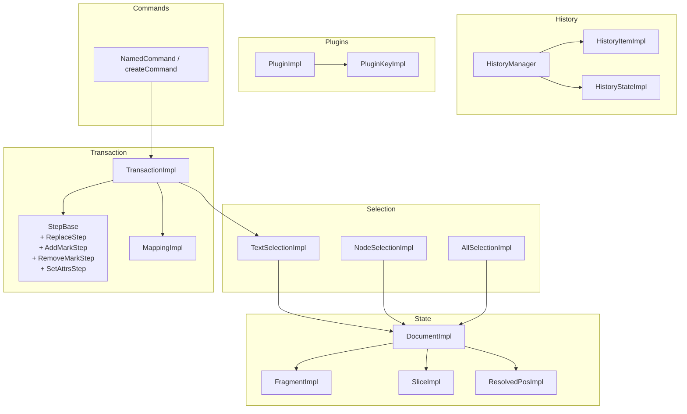
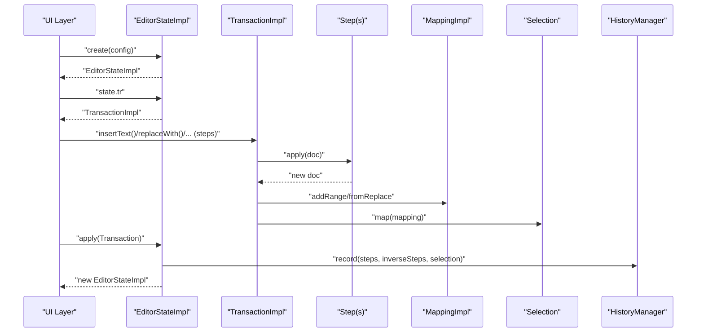
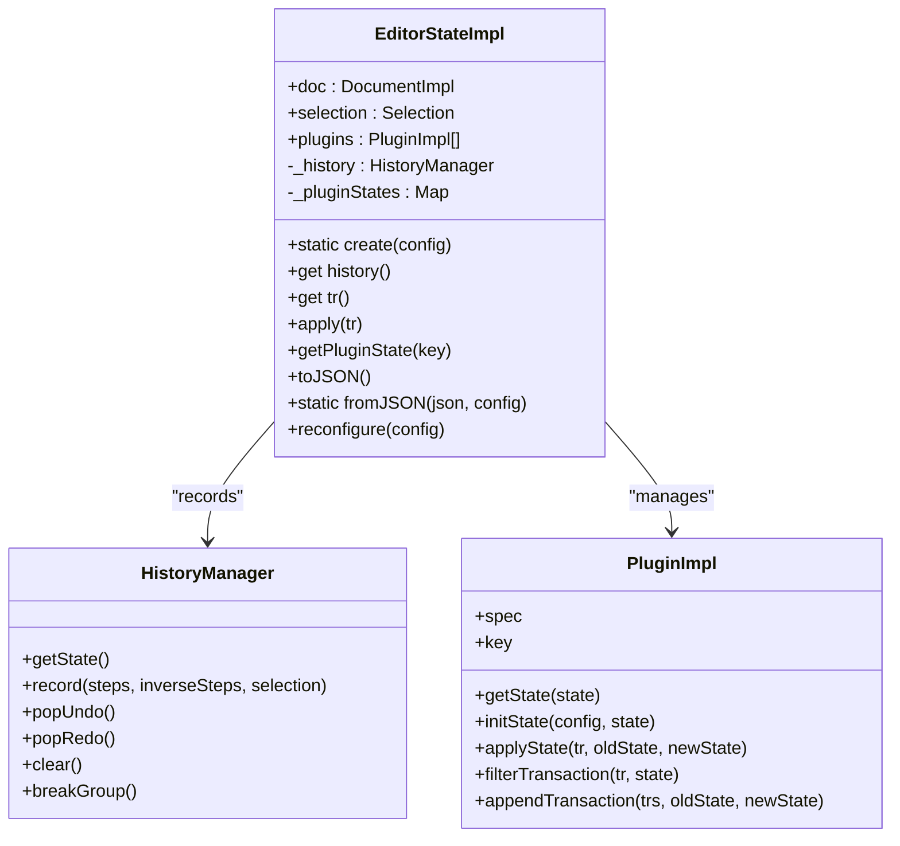
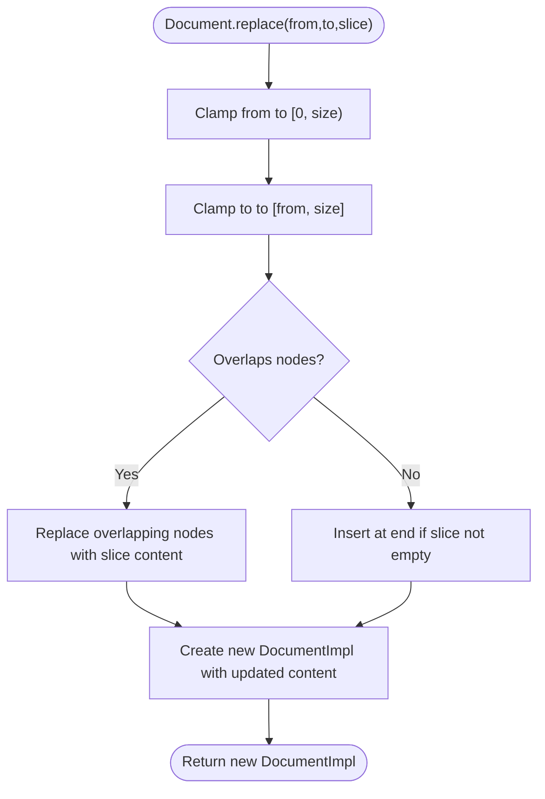
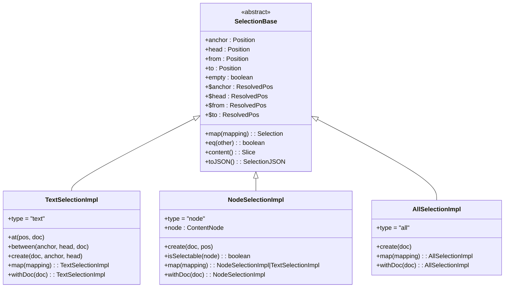
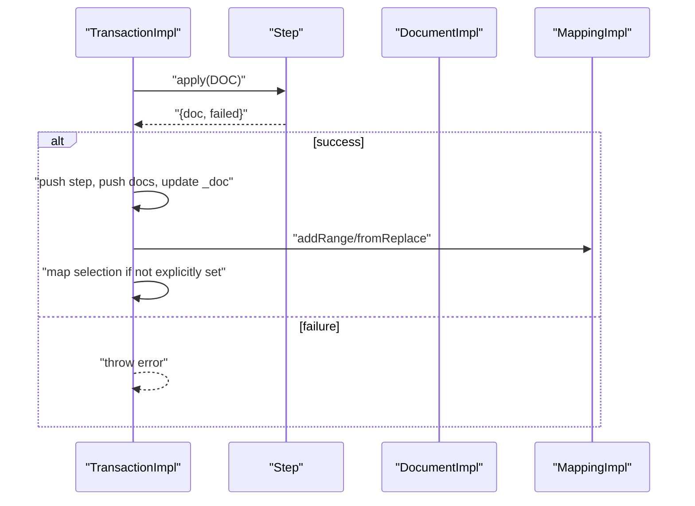
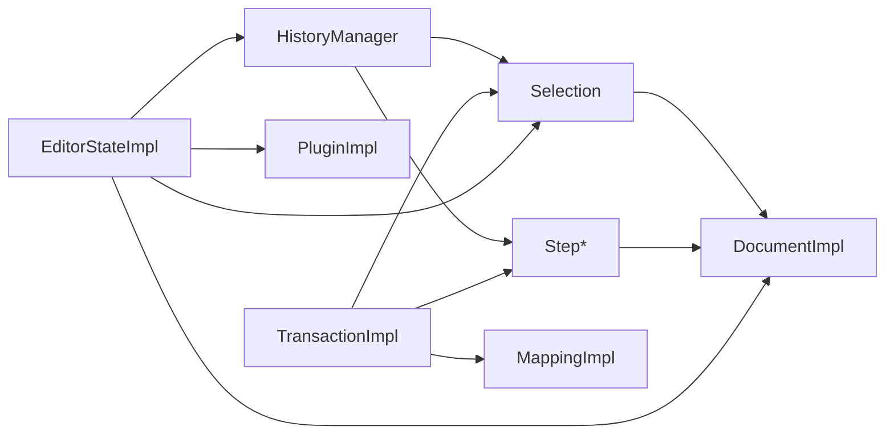

# Editor State API

<cite>
**Referenced Files in This Document**
- [index.ts](file://artoon-editor-state/src/index.ts)
- [types.ts](file://artoon-editor-state/src/types.ts)
- [EditorState.ts](file://artoon-editor-state/src/state/EditorState.ts)
- [Document.ts](file://artoon-editor-state/src/state/Document.ts)
- [Fragment.ts](file://artoon-editor-state/src/state/Fragment.ts)
- [Slice.ts](file://artoon-editor-state/src/state/Slice.ts)
- [Selection.ts](file://artoon-editor-state/src/selection/Selection.ts)
- [Transaction.ts](file://artoon-editor-state/src/transaction/Transaction.ts)
- [Step.ts](file://artoon-editor-state/src/transaction/Step.ts)
- [Mapping.ts](file://artoon-editor-state/src/transaction/Mapping.ts)
- [History.ts](file://artoon-editor-state/src/history/History.ts)
- [Plugin.ts](file://artoon-editor-state/src/plugins/Plugin.ts)
- [types.ts (commands)](file://artoon-editor-state/src/commands/types.ts)
- [Document.test.ts](file://artoon-editor-state/tests/state/Document.test.ts)
- [Fragment.test.ts](file://artoon-editor-state/tests/state/Fragment.test.ts)
- [package.json](file://artoon-editor-state/package.json)
</cite>

## Table of Contents
1. [Introduction](#introduction)
2. [Project Structure](#project-structure)
3. [Core Components](#core-components)
4. [Architecture Overview](#architecture-overview)
5. [Detailed Component Analysis](#detailed-component-analysis)
6. [Dependency Analysis](#dependency-analysis)
7. [Performance Considerations](#performance-considerations)
8. [Troubleshooting Guide](#troubleshooting-guide)
9. [Conclusion](#conclusion)
10. [Appendices](#appendices)

## Introduction
This document describes the Editor State API for ARTOON, a framework-agnostic editor state management library inspired by ProseMirror-style architectures. It provides:
- Immutable editor state with document, selection, and plugin support
- A robust transaction system for atomic, reversible changes
- Position mapping and selection models for accurate cursor and range handling
- History management for undo/redo
- A plugin system for extensibility
- A command framework for executing editor actions

The API is designed to integrate cleanly with ARTOON’s AST and supports RTL languages and complex block structures.

## Project Structure
The Editor State package organizes functionality into cohesive modules:
- State: Document, Fragment, Slice, ResolvedPos
- Selection: Text, Node, and All selections
- Transaction: Steps, Mapping, and Transaction
- History: History manager and items
- Plugins: Plugin and PluginKey abstractions
- Commands: Command types and helpers
- Types: Shared interfaces and type exports

**Diagram sources**
- [Document.ts:16-296](file://artoon-editor-state/src/state/Document.ts#L16-L296)
- [Fragment.ts:126-306](file://artoon-editor-state/src/state/Fragment.ts#L126-L306)
- [Slice.ts:11-85](file://artoon-editor-state/src/state/Slice.ts#L11-L85)
- [Selection.ts:24-248](file://artoon-editor-state/src/selection/Selection.ts#L24-L248)
- [Transaction.ts:17-348](file://artoon-editor-state/src/transaction/Transaction.ts#L17-L348)
- [Step.ts:15-285](file://artoon-editor-state/src/transaction/Step.ts#L15-L285)
- [Mapping.ts:20-134](file://artoon-editor-state/src/transaction/Mapping.ts#L20-L134)
- [History.ts:86-205](file://artoon-editor-state/src/history/History.ts#L86-L205)
- [Plugin.ts:34-120](file://artoon-editor-state/src/plugins/Plugin.ts#L34-L120)
- [types.ts (commands):37-69](file://artoon-editor-state/src/commands/types.ts#L37-L69)

**Section sources**
- [index.ts:14-192](file://artoon-editor-state/src/index.ts#L14-L192)
- [package.json:1-54](file://artoon-editor-state/package.json#L1-L54)

## Core Components
- EditorState: Immutable state container holding the document, selection, plugins, and history. Provides creation, transaction application, plugin state access, and JSON serialization.
- Document: Wraps ARTOONDocument with position-aware operations (nodeAt, resolve, slice, replace, insert, delete).
- Selection: Implements TextSelection, NodeSelection, and AllSelection with resolved positions and mapping.
- Transaction: Encapsulates a sequence of steps, maintains mapping, selection updates, and metadata.
- Step: Atomic change primitives (ReplaceStep, AddMarkStep, RemoveMarkStep, SetAttrsStep) with invert and map semantics.
- Mapping: Tracks position transformations across edits.
- History: Manages undo/redo stacks with grouping and depth limits.
- Plugin: Extensible system for stateful behaviors and transaction filtering/appending.
- Commands: Typed command signatures and helpers for composing and dispatching actions.

**Section sources**
- [EditorState.ts:26-258](file://artoon-editor-state/src/state/EditorState.ts#L26-L258)
- [Document.ts:16-296](file://artoon-editor-state/src/state/Document.ts#L16-L296)
- [Selection.ts:24-248](file://artoon-editor-state/src/selection/Selection.ts#L24-L248)
- [Transaction.ts:17-348](file://artoon-editor-state/src/transaction/Transaction.ts#L17-L348)
- [Step.ts:15-285](file://artoon-editor-state/src/transaction/Step.ts#L15-L285)
- [Mapping.ts:20-134](file://artoon-editor-state/src/transaction/Mapping.ts#L20-L134)
- [History.ts:86-205](file://artoon-editor-state/src/history/History.ts#L86-L205)
- [Plugin.ts:34-120](file://artoon-editor-state/src/plugins/Plugin.ts#L34-L120)
- [types.ts (commands):37-69](file://artoon-editor-state/src/commands/types.ts#L37-L69)

## Architecture Overview
The Editor State architecture follows an immutable update model:
- EditorState is created from an initial ARTOONDocument and optional selection/plugins.
- Transactions encapsulate a series of Steps applied atomically.
- Mapping tracks how positions shift due to edits.
- Selections map through the mapping to maintain correctness.
- History records inverse steps for undo/redo.
- Plugins can filter, augment, or react to transactions.

**Diagram sources**
- [EditorState.ts:49-211](file://artoon-editor-state/src/state/EditorState.ts#L49-L211)
- [Transaction.ts:60-89](file://artoon-editor-state/src/transaction/Transaction.ts#L60-L89)
- [Mapping.ts:30-82](file://artoon-editor-state/src/transaction/Mapping.ts#L30-L82)
- [History.ts:106-148](file://artoon-editor-state/src/history/History.ts#L106-L148)

## Detailed Component Analysis

### EditorState
- Responsibilities:
  - Construct initial state from AST or JSON
  - Provide transaction factory and apply method
  - Manage plugin lifecycle (init, applyState, filter, append)
  - Record history entries and handle undo/redo
  - Serialize/deserialize to/from JSON
- Key behaviors:
  - Creation with default empty paragraph if no doc provided
  - Selection defaults to start if none provided
  - Plugin state caching via WeakMap
  - Undo/redo applies inverse/original steps to reconstruct state
  - Appends transactions returned by plugins

**Diagram sources**
- [EditorState.ts:26-258](file://artoon-editor-state/src/state/EditorState.ts#L26-L258)
- [History.ts:86-205](file://artoon-editor-state/src/history/History.ts#L86-L205)
- [Plugin.ts:34-120](file://artoon-editor-state/src/plugins/Plugin.ts#L34-L120)

**Section sources**
- [EditorState.ts:49-258](file://artoon-editor-state/src/state/EditorState.ts#L49-L258)

### Document
- Responsibilities:
  - Wrap ARTOONDocument and expose position-aware operations
  - Compute sizes, resolve positions, slice ranges, and replace/insert/delete
- Notable features:
  - Position model: 0 is document open; 1-indexed content positions
  - nodeSize accounts for node open/close and inline content length
  - replace handles overlapping nodes and slice insertion

**Diagram sources**
- [Document.ts:111-158](file://artoon-editor-state/src/state/Document.ts#L111-L158)

**Section sources**
- [Document.ts:29-296](file://artoon-editor-state/src/state/Document.ts#L29-L296)

### Selection Model
- TextSelection: Cursor or range with resolved positions ($anchor, $head, $from, $to)
- NodeSelection: Entire node selection with boundary calculation
- AllSelection: Select entire document
- Mapping: Selections map through changes using MappingImpl

**Diagram sources**
- [Selection.ts:24-248](file://artoon-editor-state/src/selection/Selection.ts#L24-L248)

**Section sources**
- [Selection.ts:24-248](file://artoon-editor-state/src/selection/Selection.ts#L24-L248)

### Transaction and Steps
- TransactionImpl:
  - Maintains steps, docs, mapping, selection, metadata
  - Applies steps and updates mapping and selection
  - Provides convenience methods for text/mark/node operations
- Steps:
  - ReplaceStep: replaces a range with a Slice
  - AddMarkStep/RemoveMarkStep: placeholder implementations
  - SetAttrsStep: updates node attributes and stores old attrs for inversion

**Diagram sources**
- [Transaction.ts:60-89](file://artoon-editor-state/src/transaction/Transaction.ts#L60-L89)
- [Step.ts:44-51](file://artoon-editor-state/src/transaction/Step.ts#L44-L51)
- [Mapping.ts:30-82](file://artoon-editor-state/src/transaction/Mapping.ts#L30-L82)

**Section sources**
- [Transaction.ts:17-348](file://artoon-editor-state/src/transaction/Transaction.ts#L17-L348)
- [Step.ts:15-285](file://artoon-editor-state/src/transaction/Step.ts#L15-L285)

### Mapping
- Tracks replacement ranges to map positions through edits
- Supports bias-aware mapping, deletion detection, composition, and inversion

**Section sources**
- [Mapping.ts:20-134](file://artoon-editor-state/src/transaction/Mapping.ts#L20-L134)

### History
- Records groups of steps with inverse steps and selection snapshots
- Groups recent changes within a configurable time window
- Enforces maximum depth and clears redo stack on new changes

**Section sources**
- [History.ts:86-205](file://artoon-editor-state/src/history/History.ts#L86-L205)

### Plugins
- PluginImpl wraps PluginSpec with state caching and lifecycle hooks
- Supports filterTransaction, appendTransaction, and state.apply
- PluginKeyImpl provides stable keys for accessing plugin state

**Section sources**
- [Plugin.ts:34-120](file://artoon-editor-state/src/plugins/Plugin.ts#L34-L120)

### Commands
- Command signature: (state, dispatch?) => boolean
- Helpers: createCommand, chainCommands, canRun
- Dispatch type for applying transactions

**Section sources**
- [types.ts (commands):37-69](file://artoon-editor-state/src/commands/types.ts#L37-L69)
- [types.ts:473-487](file://artoon-editor-state/src/types.ts#L473-L487)

## Dependency Analysis
- EditorState depends on Document, Selection, Transaction, Mapping, History, and Plugin
- Transaction depends on Step and Mapping
- Selection depends on Document and Mapping
- History depends on Step and Selection
- Plugins depend on EditorState and Transaction

**Diagram sources**
- [EditorState.ts:16-21](file://artoon-editor-state/src/state/EditorState.ts#L16-L21)
- [Transaction.ts:7-12](file://artoon-editor-state/src/transaction/Transaction.ts#L7-L12)
- [Selection.ts:17-19](file://artoon-editor-state/src/selection/Selection.ts#L17-L19)
- [History.ts:10-26](file://artoon-editor-state/src/history/History.ts#L10-L26)

**Section sources**
- [types.ts:14-14](file://artoon-editor-state/src/types.ts#L14-L14)

## Performance Considerations
- Large documents:
  - Prefer batched transactions to minimize mapping recomputation
  - Use replaceWith/insert/delete sparingly; coalesce adjacent edits when possible
  - Leverage HistoryManager grouping to avoid excessive undo entries
- Collaborative editing:
  - Ensure Steps are serializable and invertible
  - Use MappingImpl to reconcile remote changes against local selections
  - Limit History depth to control memory usage
- Selection mapping:
  - Avoid frequent explicit selection updates; rely on automatic mapping during apply
- Equality checks:
  - Use DocumentImpl.eq and FragmentImpl.eq to detect unchanged subtrees and avoid unnecessary re-renders

[No sources needed since this section provides general guidance]

## Troubleshooting Guide
- Transaction step failures:
  - Steps return a failed message; Transaction throws on failure
  - Inspect StepResult.failed and handle gracefully
- Selection mapping edge cases:
  - Deleted ranges map to nearest boundary based on bias
  - NodeSelection maps to TextSelection if node is deleted
- History depth and grouping:
  - Exceeding depth trims stacks; adjust HistoryConfig.depth and groupingDelay
- Plugin interference:
  - filterTransaction can cancel transactions; ensure plugin filters are well-defined
- Serialization:
  - Use EditorStateImpl.toJSON/fromJSON and DocumentImpl.toJSON/fromJSON for persistence

**Section sources**
- [Transaction.ts:63-65](file://artoon-editor-state/src/transaction/Transaction.ts#L63-L65)
- [Selection.ts:180-190](file://artoon-editor-state/src/selection/Selection.ts#L180-L190)
- [History.ts:115-148](file://artoon-editor-state/src/history/History.ts#L115-L148)
- [Plugin.ts:85-90](file://artoon-editor-state/src/plugins/Plugin.ts#L85-L90)

## Conclusion
The Editor State API provides a robust, immutable foundation for ARTOON editors. Its transactional model, precise selection handling, and plugin architecture enable extensible, reliable editing experiences. By following the patterns outlined here—batching updates, leveraging mapping, and carefully managing history—you can build responsive editors that scale to large documents and support collaborative workflows.

[No sources needed since this section summarizes without analyzing specific files]

## Appendices

### API Reference Highlights
- EditorState
  - Creation: [EditorStateImpl.create:49-97](file://artoon-editor-state/src/state/EditorState.ts#L49-L97)
  - Application: [EditorStateImpl.apply:116-211](file://artoon-editor-state/src/state/EditorState.ts#L116-L211)
  - Serialization: [EditorStateImpl.toJSON/fromJSON:223-245](file://artoon-editor-state/src/state/EditorState.ts#L223-L245)
- Document
  - Creation: [DocumentImpl.create/empty:29-41](file://artoon-editor-state/src/state/Document.ts#L29-L41)
  - Operations: [DocumentImpl.replace/slice/insert/delete:111-181](file://artoon-editor-state/src/state/Document.ts#L111-L181)
- Selection
  - Implementations: [TextSelectionImpl/NodeSelectionImpl/AllSelectionImpl:97-228](file://artoon-editor-state/src/selection/Selection.ts#L97-L228)
  - Mapping: [SelectionBase.map:73-73](file://artoon-editor-state/src/selection/Selection.ts#L73-L73)
- Transaction
  - Steps: [TransactionImpl.step:60-89](file://artoon-editor-state/src/transaction/Transaction.ts#L60-L89)
  - Text ops: [insertText/delete/replaceWith:95-232](file://artoon-editor-state/src/transaction/Transaction.ts#L95-L232)
  - Node ops: [setNodeAttrs/setBlockType:290-310](file://artoon-editor-state/src/transaction/Transaction.ts#L290-L310)
- Steps
  - Replace: [ReplaceStep.apply/invert/map:44-68](file://artoon-editor-state/src/transaction/Step.ts#L44-L68)
  - Attributes: [SetAttrsStep.apply/invert:225-247](file://artoon-editor-state/src/transaction/Step.ts#L225-L247)
- Mapping
  - Ranges: [MappingImpl.addRange/map/mapResult:30-82](file://artoon-editor-state/src/transaction/Mapping.ts#L30-L82)
- History
  - Recording: [HistoryManager.record:106-148](file://artoon-editor-state/src/history/History.ts#L106-L148)
  - Undo/Redo: [popUndo/popRedo:153-180](file://artoon-editor-state/src/history/History.ts#L153-L180)
- Plugins
  - Lifecycle: [PluginImpl.initState/applyState/filter/append:54-104](file://artoon-editor-state/src/plugins/Plugin.ts#L54-L104)
- Commands
  - Composition: [chainCommands/canRun:52-68](file://artoon-editor-state/src/commands/types.ts#L52-L68)

### Examples and Patterns
- State initialization
  - Create from AST or default empty document: [EditorStateImpl.create:49-97](file://artoon-editor-state/src/state/EditorState.ts#L49-L97)
  - Deserialize from JSON: [EditorStateImpl.fromJSON:233-245](file://artoon-editor-state/src/state/EditorState.ts#L233-L245)
- Mutation handling
  - Batch edits via Transaction: [TransactionImpl.step:60-89](file://artoon-editor-state/src/transaction/Transaction.ts#L60-L89)
  - Replace range with nodes: [DocumentImpl.replaceWith:163-167](file://artoon-editor-state/src/state/Document.ts#L163-L167)
- Integration with UI
  - Use EditorState.tr to build transactions and dispatch via commands: [types.ts (commands):473-487](file://artoon-editor-state/src/commands/types.ts#L473-L487)
- Transaction mapping and selection synchronization
  - Mapping ranges and selection mapping: [MappingImpl.map/mapResult:37-82](file://artoon-editor-state/src/transaction/Mapping.ts#L37-L82), [SelectionBase.$anchor/$head:51-63](file://artoon-editor-state/src/selection/Selection.ts#L51-L63)
- State synchronization patterns
  - Apply transaction and receive new state: [EditorStateImpl.apply:116-211](file://artoon-editor-state/src/state/EditorState.ts#L116-L211)
  - Access plugin state: [EditorStateImpl.getPluginState:216-218](file://artoon-editor-state/src/state/EditorState.ts#L216-L218)

**Section sources**
- [Document.test.ts:22-205](file://artoon-editor-state/tests/state/Document.test.ts#L22-L205)
- [Fragment.test.ts:19-207](file://artoon-editor-state/tests/state/Fragment.test.ts#L19-L207)