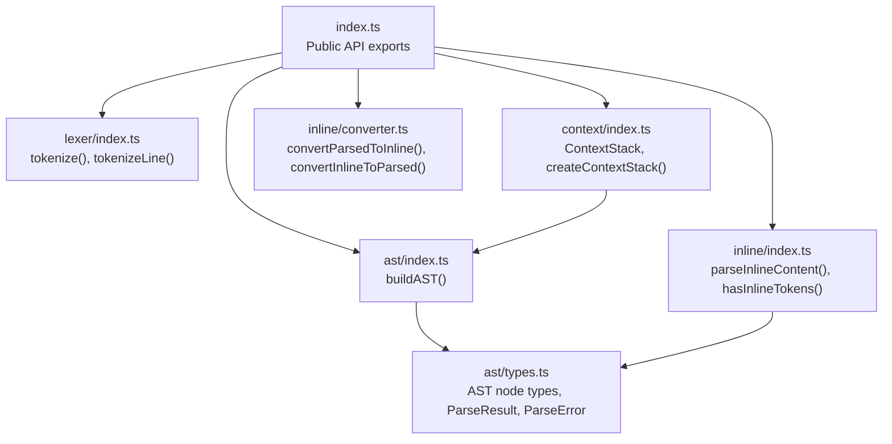
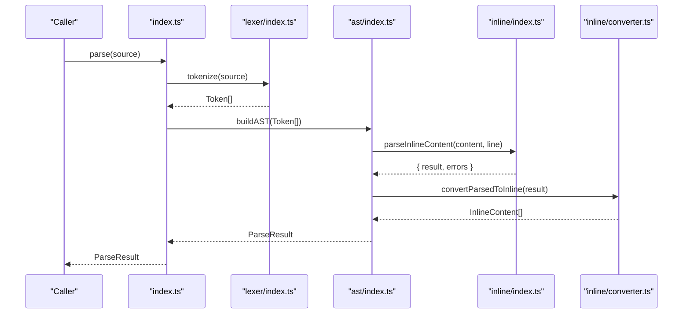
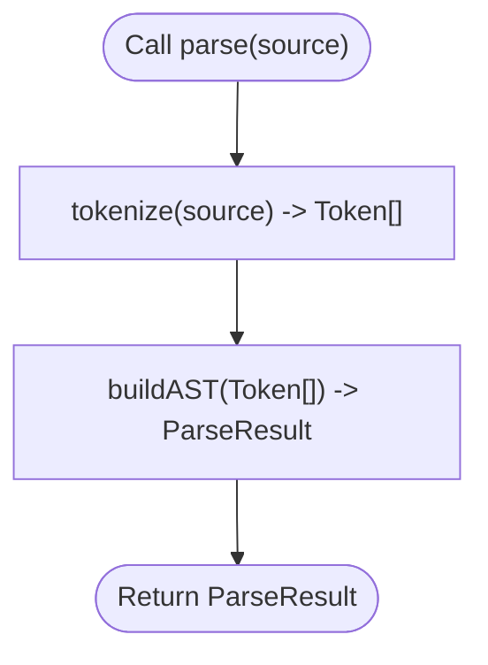
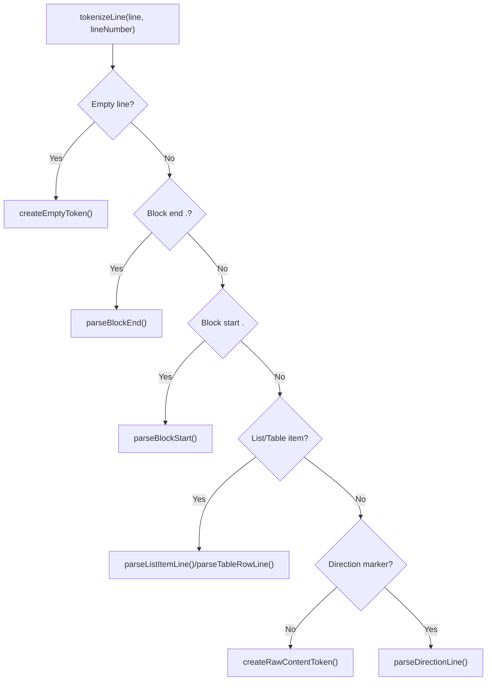
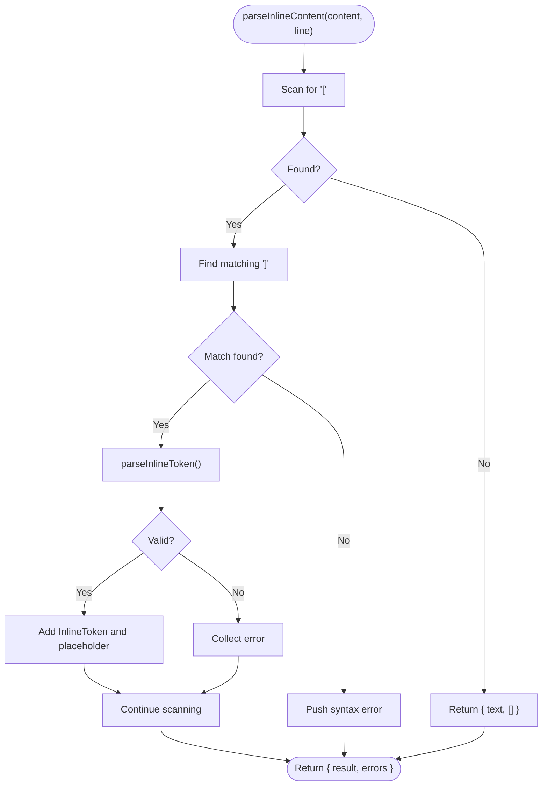
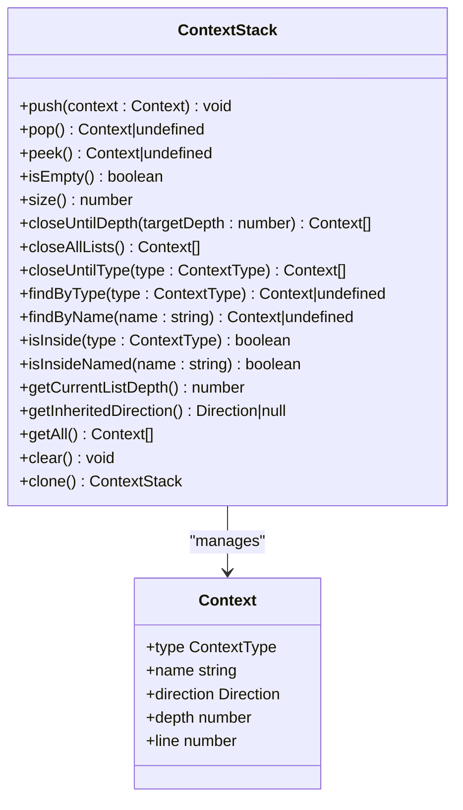
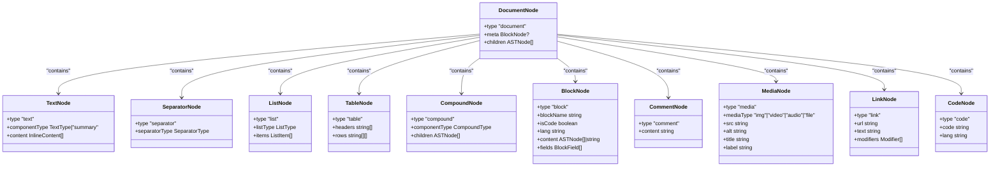
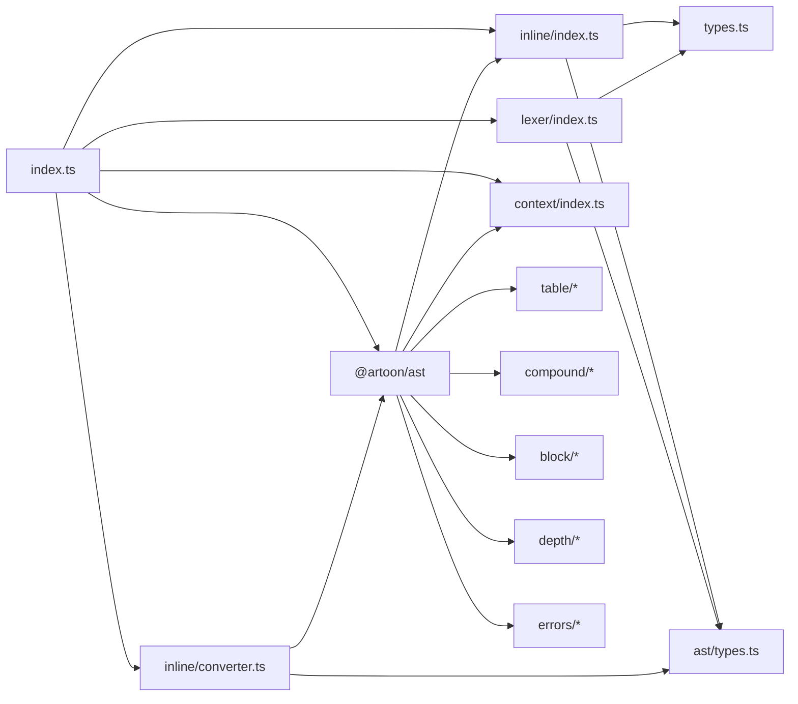

# Parser API

<cite>
**Referenced Files in This Document**
- [index.ts](file://artoon-parser/src/index.ts)
- [types.ts](file://artoon-parser/src/types.ts)
- [lexer/index.ts](file://artoon-parser/src/lexer/index.ts)
- [context/index.ts](file://artoon-parser/src/context/index.ts)
- [inline/index.ts](file://artoon-parser/src/inline/index.ts)
- [ast/index.ts](file://artoon-parser/src/ast/index.ts)
- [ast/types.ts](file://artoon-parser/src/ast/types.ts)
- [inline/converter.ts](file://artoon-parser/src/inline/converter.ts)
- [integration.test.ts](file://artoon-parser/tests/integration.test.ts)
- [package.json](file://artoon-parser/package.json)
</cite>

## Table of Contents
1. [Introduction](#introduction)
2. [Project Structure](#project-structure)
3. [Core Components](#core-components)
4. [Architecture Overview](#architecture-overview)
5. [Detailed Component Analysis](#detailed-component-analysis)
6. [Dependency Analysis](#dependency-analysis)
7. [Performance Considerations](#performance-considerations)
8. [Troubleshooting Guide](#troubleshooting-guide)
9. [Conclusion](#conclusion)
10. [Appendices](#appendices)

## Introduction
This document provides comprehensive API documentation for the ARTOON Parser package. It covers the main parsing functions, tokenization utilities, inline content parsing, context management, and exported types. Practical usage examples demonstrate parsing ARTOON documents, handling parse errors, and extracting AST information. TypeScript type definitions and error handling patterns are included to guide correct usage.

## Project Structure
The Parser package exposes a concise public API centered around four primary functions and supporting utilities:
- parse(): parses ARTOON text into a ParseResult containing AST and errors
- parseStrict(): parses ARTOON text and throws on errors
- validate(): validates ARTOON text and returns errors
- isValid(): checks validity without returning errors
- tokenize(): converts ARTOON text into tokens
- tokenizeLine(): converts a single line into a token
- parseInlineContent(): parses inline formatting within content
- hasInlineTokens(): checks for inline tokens
- ContextStack and createContextStack(): manage parsing context
- Additional utilities: convertParsedToInline, convertInlineToParsed

**Diagram sources**
- [index.ts:33-37](file://artoon-parser/src/index.ts#L33-L37)
- [lexer/index.ts:400-403](file://artoon-parser/src/lexer/index.ts#L400-L403)
- [ast/index.ts:70-84](file://artoon-parser/src/ast/index.ts#L70-L84)
- [inline/index.ts:10-13](file://artoon-parser/src/inline/index.ts#L10-L13)
- [context/index.ts:195-197](file://artoon-parser/src/context/index.ts#L195-L197)
- [inline/converter.ts:37-84](file://artoon-parser/src/inline/converter.ts#L37-L84)
- [ast/types.ts:231-257](file://artoon-parser/src/ast/types.ts#L231-L257)

**Section sources**
- [index.ts:1-119](file://artoon-parser/src/index.ts#L1-L119)
- [package.json:1-23](file://artoon-parser/package.json#L1-L23)

## Core Components
- parse(source: string): ParseResult
  - Purpose: Convert ARTOON text into a ParseResult with AST and collected errors
  - Parameters: source (string)
  - Returns: ParseResult with ast (DocumentNode) and errors (ParseError[])
  - Behavior: Tokenizes the entire source, then builds the AST
  - Example usage: See integration tests for typical patterns
  - Section sources
    - [index.ts:56-59](file://artoon-parser/src/index.ts#L56-L59)
    - [integration.test.ts:7-13](file://artoon-parser/tests/integration.test.ts#L7-L13)

- parseStrict(source: string): DocumentNode
  - Purpose: Parse ARTOON text and throw if any errors are found
  - Parameters: source (string)
  - Returns: DocumentNode (AST)
  - Behavior: Calls parse() and throws if errors exist
  - Error handling: Throws an Error with aggregated messages
  - Section sources
    - [index.ts:68-79](file://artoon-parser/src/index.ts#L68-L79)
    - [integration.test.ts:313-317](file://artoon-parser/tests/integration.test.ts#L313-L317)

- validate(source: string): ParseError[]
  - Purpose: Validate ARTOON text without building the full AST
  - Parameters: source (string)
  - Returns: Array of ParseError
  - Behavior: Delegates to parse() and returns errors
  - Section sources
    - [index.ts:87-89](file://artoon-parser/src/index.ts#L87-L89)
    - [integration.test.ts:302-307](file://artoon-parser/tests/integration.test.ts#L302-L307)

- isValid(source: string): boolean
  - Purpose: Check if ARTOON text is valid
  - Parameters: source (string)
  - Returns: boolean
  - Behavior: Delegates to validate() and checks length
  - Section sources
    - [index.ts:98-100](file://artoon-parser/src/index.ts#L98-L100)
    - [integration.test.ts:309-311](file://artoon-parser/tests/integration.test.ts#L309-L311)

- tokenize(source: string): Token[]
  - Purpose: Tokenize entire ARTOON document
  - Parameters: source (string)
  - Returns: Array of Token
  - Behavior: Splits by newlines and calls tokenizeLine() per line
  - Section sources
    - [lexer/index.ts:400-403](file://artoon-parser/src/lexer/index.ts#L400-L403)

- tokenizeLine(line: string, lineNumber: number): Token
  - Purpose: Tokenize a single line
  - Parameters: line (string), lineNumber (number)
  - Returns: Token
  - Behavior: Detects block starts/ends, comments, direction markers, list/table items, and component declarations
  - Section sources
    - [lexer/index.ts:10-77](file://artoon-parser/src/lexer/index.ts#L10-L77)

- parseInlineContent(content: string, lineNumber: number): { result: ParsedContent; errors: ParseError[] }
  - Purpose: Parse inline formatting within content
  - Parameters: content (string), lineNumber (number)
  - Returns: Object with result (ParsedContent) and errors (ParseError[])
  - Behavior: Scans for [...] inline tokens, validates syntax, collects errors
  - Section sources
    - [inline/index.ts:10-64](file://artoon-parser/src/inline/index.ts#L10-L64)

- hasInlineTokens(content: string): boolean
  - Purpose: Check if content contains inline tokens
  - Parameters: content (string)
  - Returns: boolean
  - Behavior: Lightweight check for presence of [ and ]
  - Section sources
    - [inline/index.ts:194-196](file://artoon-parser/src/inline/index.ts#L194-L196)

- ContextStack and createContextStack()
  - Purpose: Manage parsing context for blocks, lists, compounds, and tables
  - Methods: push(), pop(), peek(), isEmpty(), size(), closeUntilDepth(), closeAllLists(), closeUntilType(), findByType(), findByName(), isInside(), isInsideNamed(), getCurrentListDepth(), getInheritedDirection(), getAll(), clear(), clone()
  - Section sources
    - [context/index.ts:25-190](file://artoon-parser/src/context/index.ts#L25-L190)
    - [context/index.ts:195-197](file://artoon-parser/src/context/index.ts#L195-L197)

- convertParsedToInline(parsed: ParsedContent): InlineContent[]
  - Purpose: Convert internal ParsedContent to AST InlineContent[]
  - Parameters: parsed (ParsedContent)
  - Returns: InlineContent[]
  - Section sources
    - [inline/converter.ts:37-84](file://artoon-parser/src/inline/converter.ts#L37-L84)

- convertInlineToParsed(content: InlineContent[]): ParsedContent
  - Purpose: Convert InlineContent[] back to internal ParsedContent
  - Parameters: content (InlineContent[])
  - Returns: ParsedContent
  - Section sources
    - [inline/converter.ts:219-245](file://artoon-parser/src/inline/converter.ts#L219-L245)

**Section sources**
- [index.ts:56-100](file://artoon-parser/src/index.ts#L56-L100)
- [lexer/index.ts:10-77](file://artoon-parser/src/lexer/index.ts#L10-L77)
- [lexer/index.ts:400-403](file://artoon-parser/src/lexer/index.ts#L400-L403)
- [inline/index.ts:10-64](file://artoon-parser/src/inline/index.ts#L10-L64)
- [inline/index.ts:194-196](file://artoon-parser/src/inline/index.ts#L194-L196)
- [context/index.ts:25-190](file://artoon-parser/src/context/index.ts#L25-L190)
- [context/index.ts:195-197](file://artoon-parser/src/context/index.ts#L195-L197)
- [inline/converter.ts:37-84](file://artoon-parser/src/inline/converter.ts#L37-L84)
- [inline/converter.ts:219-245](file://artoon-parser/src/inline/converter.ts#L219-L245)

## Architecture Overview
The Parser follows a layered pipeline:
- Lexical Analysis: tokenize() and tokenizeLine() produce Tokens
- AST Construction: buildAST() consumes Tokens and constructs a typed AST
- Inline Processing: parseInlineContent() and convertParsedToInline() handle inline formatting
- Context Management: ContextStack tracks open contexts to enforce nesting rules
- Error Collection: Errors are accumulated during lexical, structural, and semantic phases

**Diagram sources**
- [index.ts:56-59](file://artoon-parser/src/index.ts#L56-L59)
- [lexer/index.ts:400-403](file://artoon-parser/src/lexer/index.ts#L400-L403)
- [ast/index.ts:70-84](file://artoon-parser/src/ast/index.ts#L70-L84)
- [inline/index.ts:10-64](file://artoon-parser/src/inline/index.ts#L10-L64)
- [inline/converter.ts:37-84](file://artoon-parser/src/inline/converter.ts#L37-L84)

## Detailed Component Analysis

### Main Parsing Functions
- parse(source: string): ParseResult
  - Tokenizes the entire source and builds the AST
  - Returns both AST and collected errors
  - Typical usage: inspect result.ast and result.errors
  - Section sources
    - [index.ts:56-59](file://artoon-parser/src/index.ts#L56-L59)
    - [integration.test.ts:7-13](file://artoon-parser/tests/integration.test.ts#L7-L13)

- parseStrict(source: string): DocumentNode
  - Throws if any errors are present
  - Useful when strict validation is required
  - Section sources
    - [index.ts:68-79](file://artoon-parser/src/index.ts#L68-L79)
    - [integration.test.ts:313-317](file://artoon-parser/tests/integration.test.ts#L313-L317)

- validate(source: string): ParseError[]
  - Validates without constructing AST
  - Returns collected errors
  - Section sources
    - [index.ts:87-89](file://artoon-parser/src/index.ts#L87-L89)
    - [integration.test.ts:302-307](file://artoon-parser/tests/integration.test.ts#L302-L307)

- isValid(source: string): boolean
  - Convenience wrapper around validate()
  - Section sources
    - [index.ts:98-100](file://artoon-parser/src/index.ts#L98-L100)
    - [integration.test.ts:309-311](file://artoon-parser/tests/integration.test.ts#L309-L311)

**Diagram sources**
- [index.ts:56-59](file://artoon-parser/src/index.ts#L56-L59)
- [lexer/index.ts:400-403](file://artoon-parser/src/lexer/index.ts#L400-L403)
- [ast/index.ts:70-84](file://artoon-parser/src/ast/index.ts#L70-L84)

**Section sources**
- [index.ts:56-100](file://artoon-parser/src/index.ts#L56-L100)
- [integration.test.ts:300-317](file://artoon-parser/tests/integration.test.ts#L300-L317)

### Tokenization Functions
- tokenize(source: string): Token[]
  - Splits source into lines and maps each to a Token via tokenizeLine()
  - Section sources
    - [lexer/index.ts:400-403](file://artoon-parser/src/lexer/index.ts#L400-L403)

- tokenizeLine(line: string, lineNumber: number): Token
  - Detects:
    - Empty lines
    - Block start/end markers
    - Child elements (.-, depth counting)
    - Comments (>:::)
    - Combined separators (e.g., br;hr;br)
    - Direction-prefixed lines (> or <)
    - List items and table rows without direction markers
  - Section sources
    - [lexer/index.ts:10-77](file://artoon-parser/src/lexer/index.ts#L10-L77)
    - [lexer/index.ts:282-344](file://artoon-parser/src/lexer/index.ts#L282-L344)
    - [lexer/index.ts:422-448](file://artoon-parser/src/lexer/index.ts#L422-L448)
    - [lexer/index.ts:461-482](file://artoon-parser/src/lexer/index.ts#L461-L482)

**Diagram sources**
- [lexer/index.ts:10-77](file://artoon-parser/src/lexer/index.ts#L10-L77)
- [lexer/index.ts:282-344](file://artoon-parser/src/lexer/index.ts#L282-L344)
- [lexer/index.ts:422-448](file://artoon-parser/src/lexer/index.ts#L422-L448)
- [lexer/index.ts:461-482](file://artoon-parser/src/lexer/index.ts#L461-L482)

**Section sources**
- [lexer/index.ts:10-77](file://artoon-parser/src/lexer/index.ts#L10-L77)
- [lexer/index.ts:282-344](file://artoon-parser/src/lexer/index.ts#L282-L344)
- [lexer/index.ts:422-448](file://artoon-parser/src/lexer/index.ts#L422-L448)
- [lexer/index.ts:461-482](file://artoon-parser/src/lexer/index.ts#L461-L482)

### Inline Content Parsing
- parseInlineContent(content: string, lineNumber: number): { result: ParsedContent; errors: ParseError[] }
  - Scans for [...] inline tokens
  - Validates presence of :: separator
  - Parses modifiers and component type
  - Validates modifier restrictions (e.g., no modifiers on img)
  - Returns ParsedContent with placeholders and InlineToken[]
  - Section sources
    - [inline/index.ts:10-64](file://artoon-parser/src/inline/index.ts#L10-L64)
    - [inline/index.ts:85-145](file://artoon-parser/src/inline/index.ts#L85-L145)
    - [inline/index.ts:151-189](file://artoon-parser/src/inline/index.ts#L151-L189)

- hasInlineTokens(content: string): boolean
  - Lightweight check for inline tokens
  - Section sources
    - [inline/index.ts:194-196](file://artoon-parser/src/inline/index.ts#L194-L196)

- convertParsedToInline(parsed: ParsedContent): InlineContent[]
  - Converts ParsedContent to InlineContent[] suitable for AST
  - Handles plain text segments and inline components
  - Section sources
    - [inline/converter.ts:37-84](file://artoon-parser/src/inline/converter.ts#L37-L84)
    - [inline/converter.ts:109-129](file://artoon-parser/src/inline/converter.ts#L109-L129)
    - [inline/converter.ts:143-210](file://artoon-parser/src/inline/converter.ts#L143-L210)

**Diagram sources**
- [inline/index.ts:10-64](file://artoon-parser/src/inline/index.ts#L10-L64)
- [inline/index.ts:85-145](file://artoon-parser/src/inline/index.ts#L85-L145)
- [inline/converter.ts:37-84](file://artoon-parser/src/inline/converter.ts#L37-L84)

**Section sources**
- [inline/index.ts:10-64](file://artoon-parser/src/inline/index.ts#L10-L64)
- [inline/index.ts:85-145](file://artoon-parser/src/inline/index.ts#L85-L145)
- [inline/index.ts:151-189](file://artoon-parser/src/inline/index.ts#L151-L189)
- [inline/index.ts:194-196](file://artoon-parser/src/inline/index.ts#L194-L196)
- [inline/converter.ts:37-84](file://artoon-parser/src/inline/converter.ts#L37-L84)
- [inline/converter.ts:109-129](file://artoon-parser/src/inline/converter.ts#L109-L129)
- [inline/converter.ts:143-210](file://artoon-parser/src/inline/converter.ts#L143-L210)

### ContextStack and createContextStack
- ContextStack
  - Manages open contexts: list, block, compound, table
  - Provides methods to push/pop, peek, close contexts, and query state
  - Supports depth-aware closing and type/name-based lookup
  - Section sources
    - [context/index.ts:25-190](file://artoon-parser/src/context/index.ts#L25-L190)

- createContextStack(): ContextStack
  - Factory function to create a new ContextStack
  - Section sources
    - [context/index.ts:195-197](file://artoon-parser/src/context/index.ts#L195-L197)

**Diagram sources**
- [context/index.ts:25-190](file://artoon-parser/src/context/index.ts#L25-L190)

**Section sources**
- [context/index.ts:25-190](file://artoon-parser/src/context/index.ts#L25-L190)
- [context/index.ts:195-197](file://artoon-parser/src/context/index.ts#L195-L197)

### AST Building and Node Types
- buildAST(tokens: Token[]): ParseResult
  - Processes tokens sequentially, manages context, handles blocks, lists, tables, compounds, and inline content
  - Finalizes state by closing any remaining contexts and collecting errors
  - Section sources
    - [ast/index.ts:70-84](file://artoon-parser/src/ast/index.ts#L70-L84)
    - [ast/index.ts:89-256](file://artoon-parser/src/ast/index.ts#L89-L256)
    - [ast/index.ts:261-280](file://artoon-parser/src/ast/index.ts#L261-L280)
    - [ast/index.ts:297-394](file://artoon-parser/src/ast/index.ts#L297-L394)
    - [ast/index.ts:449-539](file://artoon-parser/src/ast/index.ts#L449-L539)
    - [ast/index.ts:584-669](file://artoon-parser/src/ast/index.ts#L584-L669)
    - [ast/index.ts:766-793](file://artoon-parser/src/ast/index.ts#L766-L793)

- AST Node Types (from @artoon/ast, re-exported)
  - TextNode, SeparatorNode, ListNode, TableNode, CompoundNode, BlockNode, CommentNode, MediaNode, LinkNode, CodeNode
  - InlineContent union: PlainText and InlineComponent
  - Section sources
    - [ast/types.ts:14-55](file://artoon-parser/src/ast/types.ts#L14-L55)
    - [ast/types.ts:65-179](file://artoon-parser/src/ast/types.ts#L65-L179)
    - [ast/types.ts:234-257](file://artoon-parser/src/ast/types.ts#L234-L257)

**Diagram sources**
- [ast/types.ts:65-179](file://artoon-parser/src/ast/types.ts#L65-L179)
- [ast/types.ts:234-257](file://artoon-parser/src/ast/types.ts#L234-L257)

**Section sources**
- [ast/index.ts:70-84](file://artoon-parser/src/ast/index.ts#L70-L84)
- [ast/types.ts:65-179](file://artoon-parser/src/ast/types.ts#L65-L179)
- [ast/types.ts:234-257](file://artoon-parser/src/ast/types.ts#L234-L257)

### Exported Types and Interfaces
- Direction: 'rtl' | 'ltr'
- ComponentType unions: TextComponent, SemanticComponent, MediaComponent, SeparatorComponent, ListComponent, TableComponent, CompoundComponent, CompoundChildComponent, CodeComponent
- Modifier: 's' | 'e' | 'u' | 'd' | 'mark' | 'sub' | 'sup'
- Constants:
  - VALID_MODIFIERS
  - MODIFIER_ACCEPTING_COMPONENTS
  - NO_MODIFIER_COMPONENTS
  - SEPARATOR_COMPONENTS
  - VALID_COMPONENTS
- AST Node Types and InlineContent types are re-exported from @artoon/ast
- Section sources
  - [types.ts:8-123](file://artoon-parser/src/types.ts#L8-L123)
  - [ast/types.ts:14-55](file://artoon-parser/src/ast/types.ts#L14-L55)

## Dependency Analysis
The Parser’s public API re-exports core functionality from internal modules. The main dependencies are:
- index.ts depends on lexer, ast, inline, context, and inline/converter
- ast/index.ts depends on context, inline, table, compound, block, depth, and errors
- inline/index.ts depends on types and ast/types
- lexer/index.ts depends on types and ast/types
- inline/converter.ts depends on @artoon/ast and ast/types

**Diagram sources**
- [index.ts:4-37](file://artoon-parser/src/index.ts#L4-L37)
- [ast/index.ts:12-29](file://artoon-parser/src/ast/index.ts#L12-L29)
- [inline/index.ts:4-5](file://artoon-parser/src/inline/index.ts#L4-L5)
- [lexer/index.ts:4-5](file://artoon-parser/src/lexer/index.ts#L4-L5)
- [inline/converter.ts:14-21](file://artoon-parser/src/inline/converter.ts#L14-L21)

**Section sources**
- [index.ts:4-37](file://artoon-parser/src/index.ts#L4-L37)
- [ast/index.ts:12-29](file://artoon-parser/src/ast/index.ts#L12-L29)
- [inline/index.ts:4-5](file://artoon-parser/src/inline/index.ts#L4-L5)
- [lexer/index.ts:4-5](file://artoon-parser/src/lexer/index.ts#L4-L5)
- [inline/converter.ts:14-21](file://artoon-parser/src/inline/converter.ts#L14-L21)

## Performance Considerations
- Tokenization is linear in the number of characters and lines; avoid unnecessary repeated tokenization.
- Inline parsing performs a single pass with bracket matching; complexity is proportional to content length plus number of inline tokens.
- AST construction iterates tokens once; context operations are O(n) per token with small constant factors.
- Prefer validate() for quick checks when full AST is not needed.
- Use parseStrict() in environments requiring strict validation to fail fast.

## Troubleshooting Guide
Common issues and resolutions:
- Unclosed inline brackets: parseInlineContent reports syntax errors with suggestions
  - Section sources
    - [inline/index.ts:26-36](file://artoon-parser/src/inline/index.ts#L26-L36)

- Modifiers on disallowed components: semantic error when modifiers are used on img/audio/video/file
  - Section sources
    - [inline/index.ts:118-130](file://artoon-parser/src/inline/index.ts#L118-L130)

- Unexpected block end or mismatched block names: structure errors with guidance
  - Section sources
    - [ast/index.ts:108-115](file://artoon-parser/src/ast/index.ts#L108-L115)
    - [ast/index.ts:332-343](file://artoon-parser/src/ast/index.ts#L332-L343)

- Unclosed blocks, tables, compounds, or lists at document end: warnings or structure errors
  - Section sources
    - [ast/index.ts:768-793](file://artoon-parser/src/ast/index.ts#L768-L793)

- Handling parseStrict errors: catch thrown Error and inspect messages
  - Section sources
    - [index.ts:71-76](file://artoon-parser/src/index.ts#L71-L76)
    - [integration.test.ts:313-317](file://artoon-parser/tests/integration.test.ts#L313-L317)

**Section sources**
- [inline/index.ts:26-36](file://artoon-parser/src/inline/index.ts#L26-L36)
- [inline/index.ts:118-130](file://artoon-parser/src/inline/index.ts#L118-L130)
- [ast/index.ts:108-115](file://artoon-parser/src/ast/index.ts#L108-L115)
- [ast/index.ts:332-343](file://artoon-parser/src/ast/index.ts#L332-L343)
- [ast/index.ts:768-793](file://artoon-parser/src/ast/index.ts#L768-L793)
- [index.ts:71-76](file://artoon-parser/src/index.ts#L71-L76)
- [integration.test.ts:313-317](file://artoon-parser/tests/integration.test.ts#L313-L317)

## Conclusion
The ARTOON Parser provides a robust, modular API for converting ARTOON documents into a strongly-typed AST. Its public functions offer flexible parsing modes, comprehensive error reporting, and integrated inline formatting support. Context management ensures correct handling of nested structures, while converters bridge internal formats to AST-compatible InlineContent arrays. The included tests demonstrate typical usage patterns and expected behaviors.

## Appendices

### Practical Usage Examples
- Basic parsing and error inspection
  - Use parse() to get both AST and errors
  - Inspect result.errors for any issues
  - Section sources
    - [integration.test.ts:7-13](file://artoon-parser/tests/integration.test.ts#L7-L13)

- Strict parsing with error throwing
  - Use parseStrict() when strict validation is required
  - Catch and log thrown Error
  - Section sources
    - [integration.test.ts:313-317](file://artoon-parser/tests/integration.test.ts#L313-L317)

- Validating without building AST
  - Use validate() to quickly check syntax
  - Use isValid() for boolean checks
  - Section sources
    - [integration.test.ts:302-311](file://artoon-parser/tests/integration.test.ts#L302-L311)

- Parsing inline formatting
  - Use parseInlineContent() to extract InlineContent[]
  - Use convertParsedToInline() to finalize formatting
  - Section sources
    - [integration.test.ts:150-163](file://artoon-parser/tests/integration.test.ts#L150-L163)
    - [inline/converter.ts:37-84](file://artoon-parser/src/inline/converter.ts#L37-L84)

- Managing parsing context
  - Use createContextStack() to initialize a ContextStack
  - Push/pull contexts as blocks, lists, compounds, and tables open/close
  - Section sources
    - [context/index.ts:195-197](file://artoon-parser/src/context/index.ts#L195-L197)

### TypeScript Type Definitions
- Direction, ComponentType unions, Modifier, and constants are defined in types.ts
- AST node types and InlineContent types are re-exported from @artoon/ast
- Section sources
  - [types.ts:8-123](file://artoon-parser/src/types.ts#L8-L123)
  - [ast/types.ts:14-55](file://artoon-parser/src/ast/types.ts#L14-L55)