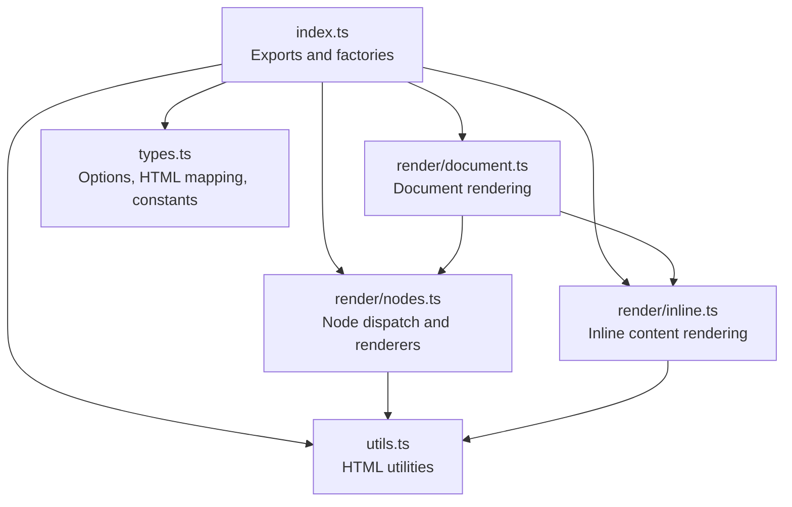
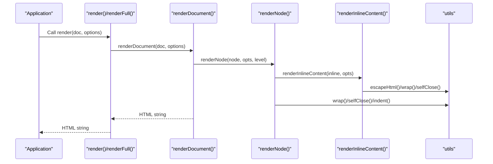
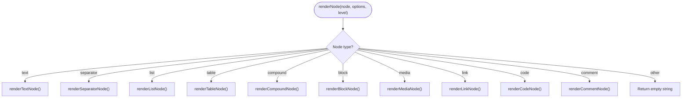
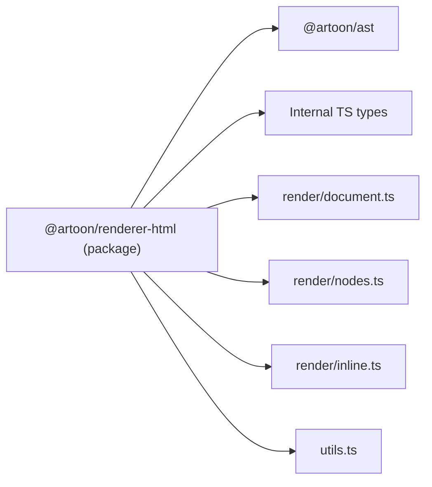

# Renderer API

<cite>
**Referenced Files in This Document**
- [index.ts](file://artoon-renderer-html/src/index.ts)
- [types.ts](file://artoon-renderer-html/src/types.ts)
- [document.ts](file://artoon-renderer-html/src/render/document.ts)
- [nodes.ts](file://artoon-renderer-html/src/render/nodes.ts)
- [inline.ts](file://artoon-renderer-html/src/render/inline.ts)
- [utils.ts](file://artoon-renderer-html/src/utils.ts)
- [README.md](file://artoon-renderer-html/README.md)
- [package.json](file://artoon-renderer-html/package.json)
- [custom-blocks.test.ts](file://artoon-renderer-html/tests/custom-blocks.test.ts)
- [meta-rendering.test.ts](file://artoon-renderer-html/tests/meta-rendering.test.ts)
- [test-render.ts](file://artoon-renderer-html/test-render.ts)
- [types.ts](file://artoon-ast/src/types.ts)
</cite>

## Table of Contents
1. [Introduction](#introduction)
2. [Project Structure](#project-structure)
3. [Core Components](#core-components)
4. [Architecture Overview](#architecture-overview)
5. [Detailed Component Analysis](#detailed-component-analysis)
6. [Dependency Analysis](#dependency-analysis)
7. [Performance Considerations](#performance-considerations)
8. [Security Considerations](#security-considerations)
9. [Integration Patterns](#integration-patterns)
10. [Examples and Recipes](#examples-and-recipes)
11. [Troubleshooting Guide](#troubleshooting-guide)
12. [Conclusion](#conclusion)

## Introduction
This document provides comprehensive API documentation for the ARTOON HTML Renderer package. It explains how the renderer transforms an ARTOON Abstract Syntax Tree (AST) into HTML, details configuration options, describes node renderer components for different ARTOON block types, and covers the theme-related configuration via CSS class prefixes and semantic classes. It also includes guidance on performance optimization, security hardening, and integration patterns for server-side, client-side, and hybrid applications.

## Project Structure
The renderer is organized into focused modules:
- Entry point exports and factory functions
- Rendering pipeline: document, nodes, inline content
- Shared utilities for HTML escaping and tag construction
- Types and constants for configuration and HTML mapping
- Tests validating custom blocks, meta handling, and rendering behavior
- Package metadata and documentation



**Diagram sources**
- [index.ts:1-57](file://artoon-renderer-html/src/index.ts#L1-L57)
- [document.ts:1-132](file://artoon-renderer-html/src/render/document.ts#L1-L132)
- [nodes.ts:1-755](file://artoon-renderer-html/src/render/nodes.ts#L1-L755)
- [inline.ts:1-324](file://artoon-renderer-html/src/render/inline.ts#L1-L324)
- [utils.ts:1-80](file://artoon-renderer-html/src/utils.ts#L1-L80)
- [types.ts:1-187](file://artoon-renderer-html/src/types.ts#L1-L187)

**Section sources**
- [index.ts:1-57](file://artoon-renderer-html/src/index.ts#L1-L57)
- [README.md:1-238](file://artoon-renderer-html/README.md#L1-L238)

## Core Components
- render(): Renders an ARTOONDocument to HTML string
- renderFull(): Renders an ARTOONDocument to a full HTML document with head/body/html
- createRenderer(): Returns a reusable renderer instance with preset options
- renderNode(), renderInlineContent(): Lower-level APIs for targeted rendering
- RenderOptions: Configuration surface for indentation, direction, comments, meta handling, custom blocks, and CSS class behavior
- HTML_MAPPING: Canonical mapping of ARTOON component types to HTML elements

Key behaviors:
- Direction handling: Adds dir attributes when needed and supported
- Comments: Controlled via includeComments and commentDisplay modes
- Meta blocks: Controlled via metaHandling modes (hide/tags/comment)
- Custom blocks: Flexible mapping of blockName to HTML tag/class/attributes
- Inline content: Supports both AST arrays and parser output formats

**Section sources**
- [index.ts:16-57](file://artoon-renderer-html/src/index.ts#L16-L57)
- [types.ts:37-117](file://artoon-renderer-html/src/types.ts#L37-L117)
- [types.ts:122-186](file://artoon-renderer-html/src/types.ts#L122-L186)
- [README.md:11-32](file://artoon-renderer-html/README.md#L11-L32)

## Architecture Overview
The rendering pipeline follows a layered approach:
- Document-level rendering aggregates top-level content and optional META block handling
- Node-level dispatch routes to specialized renderers for text, lists, tables, compounds, blocks, media, links, code, and comments
- Inline-level rendering handles plain text and inline components (links, media, abbreviations, time, inline code) with modifiers applied
- Utilities provide safe HTML escaping and tag construction



**Diagram sources**
- [index.ts:19-34](file://artoon-renderer-html/src/index.ts#L19-L34)
- [document.ts:11-52](file://artoon-renderer-html/src/render/document.ts#L11-L52)
- [nodes.ts:37-57](file://artoon-renderer-html/src/render/nodes.ts#L37-L57)
- [inline.ts:18-71](file://artoon-renderer-html/src/render/inline.ts#L18-L71)
- [utils.ts:6-80](file://artoon-renderer-html/src/utils.ts#L6-L80)

## Detailed Component Analysis

### Render Options and Configuration
RenderOptions define the behavior of the renderer:
- fullDocument: Wrap output in html/head/body
- title: Document title for full documents
- includeDirection: Add dir attributes when direction differs from default
- defaultDirection: Global default direction (rtl/ltr)
- indent: Pretty-print output with indentation
- indentSize: Number of spaces per indentation level
- includeComments: Whether to include comment nodes
- commentDisplay: Modes for comment rendering (hidden/editor-only/visible/collapsible)
- commentTag: HTML tag for visible comments
- metaHandling: How META blocks are handled (hide/tags/comment)
- customBlocks: Array of CustomBlockMapping entries
- defaultCustomBlockTag: Fallback tag for unmapped custom blocks
- classPrefix: Prefix for CSS classes
- addSemanticClasses: Toggle for adding semantic classes

DEFAULT_OPTIONS provides sensible defaults aligned with RTL/LTR expectations and pretty printing.

**Section sources**
- [types.ts:37-98](file://artoon-renderer-html/src/types.ts#L37-L98)
- [types.ts:103-117](file://artoon-renderer-html/src/types.ts#L103-L117)

### Document Rendering
- Aggregates content nodes and optionally handles a META block
- Supports both AST content and parser children
- Can produce a full HTML document with head/body and default styles
- Uses renderHead() and renderBody() for full document scaffolding

Behavior highlights:
- Skips empty nodes
- Applies indentation when enabled
- Full document mode sets lang/dir and injects minimal default styles

**Section sources**
- [document.ts:11-52](file://artoon-renderer-html/src/render/document.ts#L11-L52)
- [document.ts:57-131](file://artoon-renderer-html/src/render/document.ts#L57-L131)

### Node Renderer Components
The dispatcher renderNode() routes to specialized renderers based on node type. Supported ARTOON node types include text, separator, list, table, compound, block, media, link, code, and comment.

Highlights:
- Text nodes: Maps textType to HTML tags (p, h1-h6, blockquote, pre, time, abbr); special handling for time and abbr line components
- Separators: Maps separatorType to br/hr/wbr; supports legacy separators array
- Lists: Supports mixed-type items by grouping consecutive same-type items; nested lists are supported
- Tables: Handles both parser and AST formats; renders thead/tbody/tr/th/td
- Compounds: Renders figure/details with caption/summary semantics
- Blocks: Code, meta, figure, details, and custom blocks; custom blocks are highly configurable
- Media: img/audio/video/file with appropriate attributes
- Links: a with href and optional title; applies modifiers
- Inline code: code with optional language class
- Comments: Controlled by includeComments and commentDisplay



**Diagram sources**
- [nodes.ts:37-57](file://artoon-renderer-html/src/render/nodes.ts#L37-L57)

**Section sources**
- [nodes.ts:37-755](file://artoon-renderer-html/src/render/nodes.ts#L37-L755)

### Inline Content Rendering
- renderInlineContent() supports both AST arrays and parser output { text, inlines }
- Replaces placeholders with rendered inline components while escaping surrounding text
- Applies modifiers from inside out to maintain correct nesting
- Handles links, images, audio, video, abbreviations, time, and inline code

```mermaid
flowchart TD
IStart(["renderInlineContent(content, options)"]) --> Format{"Format?"}
Format --> |Parser {text,inlines}| Build["Split text by placeholders<br/>Insert rendered inlines<br/>Escape remaining text"]
Format --> |AST array| Join["Join items with empty separator"]
Build --> IEnd(["HTML string"])
Join --> IEnd
```

**Diagram sources**
- [inline.ts:18-71](file://artoon-renderer-html/src/render/inline.ts#L18-L71)

**Section sources**
- [inline.ts:18-324](file://artoon-renderer-html/src/render/inline.ts#L18-L324)

### Utilities
- escapeHtml(): Escapes &, <, >, ", '
- attr()/attrs(): Builds attribute strings safely
- openTag()/closeTag()/wrap(): Constructs opening/closing tags and wrapped content
- selfClose(): Self-closing tag helper
- indent(): Adds indentation to multi-line content

These utilities centralize HTML safety and formatting.

**Section sources**
- [utils.ts:6-80](file://artoon-renderer-html/src/utils.ts#L6-L80)

### HTML Mapping and Theme System
- HTML_MAPPING defines canonical ARTOON-to-HTML mappings for text, lists, list items, modifiers, inline components, separators, and compounds
- Theme customization is achieved via:
  - classPrefix: Prefix for CSS classes (default: "artoon-")
  - addSemanticClasses: Toggle for adding semantic classes
  - customBlocks: Map blockName to tag, className, and attributes for granular control
  - defaultCustomBlockTag: Fallback tag for unmapped custom blocks

Note: The renderer does not ship built-in CSS themes. Instead, it focuses on emitting semantic HTML and classes suitable for consuming application stylesheets.

**Section sources**
- [types.ts:122-186](file://artoon-renderer-html/src/types.ts#L122-L186)
- [types.ts:37-98](file://artoon-renderer-html/src/types.ts#L37-L98)

## Dependency Analysis
- Runtime dependency: @artoon/ast (AST types and node unions)
- Dev/test dependencies: @artoon/parser, Jest, TypeScript
- Internal dependencies: render/index re-exports renderDocument, renderNode, renderInlineContent; utils are shared across modules



**Diagram sources**
- [package.json:15-25](file://artoon-renderer-html/package.json#L15-L25)
- [index.ts:3-14](file://artoon-renderer-html/src/index.ts#L3-L14)

**Section sources**
- [package.json:1-27](file://artoon-renderer-html/package.json#L1-L27)

## Performance Considerations
- Prefer render() over renderFull() when embedding in existing pages to avoid redundant wrappers
- Disable indent when generating large documents to reduce memory and CPU overhead
- Use createRenderer() to reuse a configured instance and avoid repeated option merging
- Keep customBlocks mappings minimal and specific to avoid unnecessary condition checks
- For SSR, cache rendered HTML keyed by AST identity or a stable hash of the AST content
- Avoid excessive nested structures in custom blocks to minimize recursive rendering cost

## Security Considerations
- All user-provided content is HTML-escaped before insertion into tags
- Attribute values are escaped via attr()/attrs()
- Meta blocks can be hidden, emitted as meta tags, or rendered as comments; choose hide for sensitive data
- Inline content placeholders are replaced after escaping to prevent XSS
- When using customBlocks, sanitize any user-supplied attributes passed via attributes mapping

**Section sources**
- [utils.ts:6-31](file://artoon-renderer-html/src/utils.ts#L6-L31)
- [nodes.ts:519-554](file://artoon-renderer-html/src/render/nodes.ts#L519-L554)
- [inline.ts:76-135](file://artoon-renderer-html/src/render/inline.ts#L76-L135)

## Integration Patterns

### Server-Side Rendering (SSR)
- Transform ARTOON source to AST using @artoon/parser and @artoon/ast
- Render with render() for page fragments or renderFull() for standalone documents
- Set includeDirection and defaultDirection according to locale
- For full documents, set title and meta via options or DocumentMeta

**Section sources**
- [README.md:11-32](file://artoon-renderer-html/README.md#L11-L32)
- [document.ts:57-74](file://artoon-renderer-html/src/render/document.ts#L57-L74)

### Client-Side Rendering
- Use render() to generate HTML for injection into DOM
- For dynamic updates, re-render only changed subtrees and patch the DOM efficiently
- Consider using createRenderer() to share configuration across components

**Section sources**
- [index.ts:39-51](file://artoon-renderer-html/src/index.ts#L39-L51)

### Hybrid Applications
- Server generates initial HTML with renderFull() and includes metaHandling as needed
- Client hydrates with framework-specific hydration and continues rendering with render() for updates
- Maintain consistent classPrefix and addSemanticClasses across server and client

## Examples and Recipes

### Basic Rendering
- Render a simple document to HTML string
- Render a full HTML document with head/body

**Section sources**
- [README.md:11-32](file://artoon-renderer-html/README.md#L11-L32)

### Custom Block Mapping
- Map custom blockName to article/aside with custom className and attributes
- Use defaultCustomBlockTag for fallback
- Hidden fields inside blocks are emitted with hidden attribute and data-field

**Section sources**
- [custom-blocks.test.ts:80-167](file://artoon-renderer-html/tests/custom-blocks.test.ts#L80-L167)
- [custom-blocks.test.ts:317-448](file://artoon-renderer-html/tests/custom-blocks.test.ts#L317-L448)
- [nodes.ts:457-514](file://artoon-renderer-html/src/render/nodes.ts#L457-L514)

### META Block Handling
- Hide META by default
- Emit META as meta tags
- Emit META as HTML comments

**Section sources**
- [meta-rendering.test.ts:7-85](file://artoon-renderer-html/tests/meta-rendering.test.ts#L7-L85)
- [meta-rendering.test.ts:87-159](file://artoon-renderer-html/tests/meta-rendering.test.ts#L87-L159)
- [meta-rendering.test.ts:161-209](file://artoon-renderer-html/tests/meta-rendering.test.ts#L161-L209)

### Direction and Accessibility
- Control dir attributes via includeDirection and defaultDirection
- Combine with semantic classes and proper heading hierarchy for accessibility

**Section sources**
- [nodes.ts:744-754](file://artoon-renderer-html/src/render/nodes.ts#L744-L754)
- [types.ts:37-98](file://artoon-renderer-html/src/types.ts#L37-L98)

### Inline Content with Modifiers
- Render inline links, images, abbreviations, time, and inline code
- Modifiers are applied from inside out to preserve semantics

**Section sources**
- [inline.ts:18-71](file://artoon-renderer-html/src/render/inline.ts#L18-L71)
- [inline.ts:217-230](file://artoon-renderer-html/src/render/inline.ts#L217-L230)

## Troubleshooting Guide
Common issues and resolutions:
- Unexpected dir attributes: Verify includeDirection and defaultDirection; dir is only added when direction differs from default
- Missing comments in output: Ensure includeComments is true and commentDisplay is not hidden
- META still visible: Confirm metaHandling is set to hide/tags/comment appropriately
- Custom block not rendering as expected: Check customBlocks mapping and defaultCustomBlockTag; reserved blocks (code, meta, figure, details) are not affected by custom mappings
- Mixed-type lists not grouped: Ensure list items include listType when overriding parent listType

**Section sources**
- [nodes.ts:744-754](file://artoon-renderer-html/src/render/nodes.ts#L744-L754)
- [nodes.ts:519-554](file://artoon-renderer-html/src/render/nodes.ts#L519-L554)
- [custom-blocks.test.ts:450-559](file://artoon-renderer-html/tests/custom-blocks.test.ts#L450-L559)

## Conclusion
The ARTOON HTML Renderer provides a robust, extensible pipeline for converting ARTOON AST into semantic HTML. With flexible configuration for direction, comments, META handling, and custom blocks, it supports diverse application needs. By leveraging the provided utilities and options, developers can achieve secure, accessible, and performant HTML output for server-side, client-side, and hybrid scenarios.