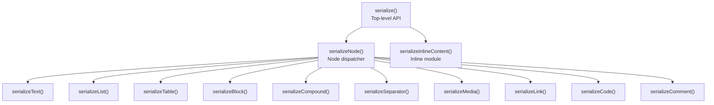
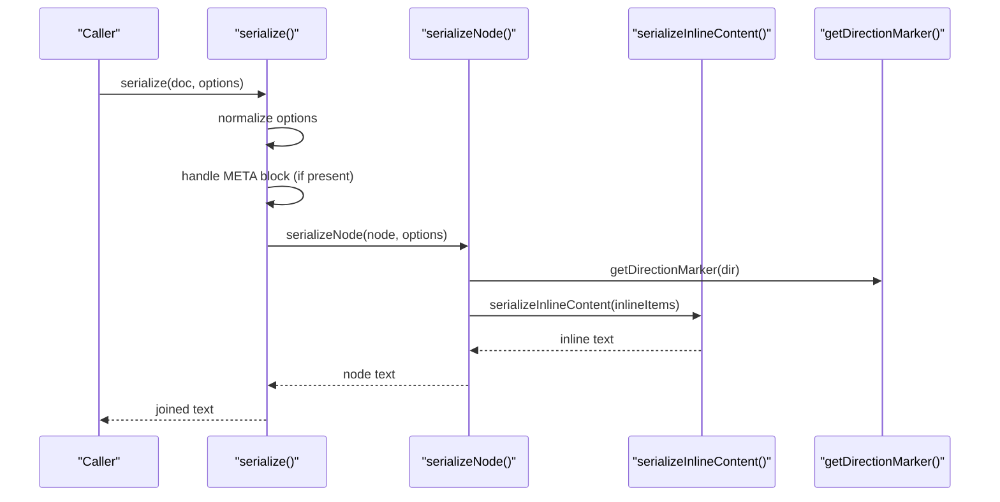
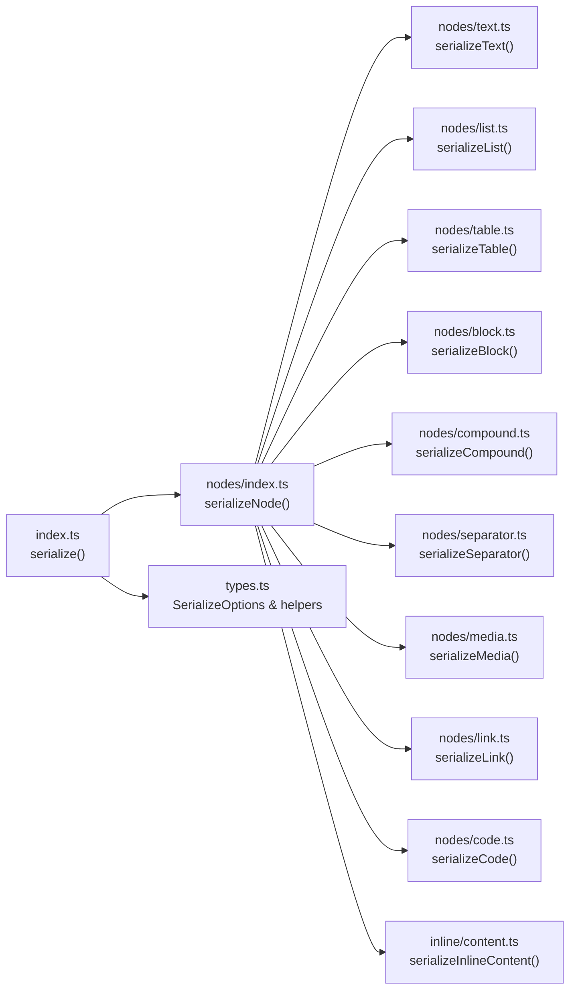

# Serializer API

<cite>
**Referenced Files in This Document**
- [index.ts](file://artoon-serializer/src/index.ts)
- [types.ts](file://artoon-serializer/src/types.ts)
- [nodes/index.ts](file://artoon-serializer/src/nodes/index.ts)
- [inline/index.ts](file://artoon-serializer/src/inline/index.ts)
- [inline/content.ts](file://artoon-serializer/src/inline/content.ts)
- [nodes/block.ts](file://artoon-serializer/src/nodes/block.ts)
- [nodes/text.ts](file://artoon-serializer/src/nodes/text.ts)
- [nodes/list.ts](file://artoon-serializer/src/nodes/list.ts)
- [nodes/table.ts](file://artoon-serializer/src/nodes/table.ts)
- [nodes/compound.ts](file://artoon-serializer/src/nodes/compound.ts)
- [nodes/media.ts](file://artoon-serializer/src/nodes/media.ts)
- [nodes/link.ts](file://artoon-serializer/src/nodes/link.ts)
- [nodes/code.ts](file://artoon-serializer/src/nodes/code.ts)
- [nodes/separator.ts](file://artoon-serializer/src/nodes/separator.ts)
- [serialize.test.ts](file://artoon-serializer/tests/serialize.test.ts)
</cite>

## Table of Contents
1. [Introduction](#introduction)
2. [Project Structure](#project-structure)
3. [Core Components](#core-components)
4. [Architecture Overview](#architecture-overview)
5. [Detailed Component Analysis](#detailed-component-analysis)
6. [Dependency Analysis](#dependency-analysis)
7. [Performance Considerations](#performance-considerations)
8. [Troubleshooting Guide](#troubleshooting-guide)
9. [Conclusion](#conclusion)
10. [Appendices](#appendices)

## Introduction
This document describes the Serializer API for converting an ARTOON Abstract Syntax Tree (AST) back into ARTOON text format. It covers the top-level serialization function, node serializers for blocks, inline content, and compound components, formatting options, error handling, performance characteristics, and guidance for extending the serializer with custom node types while maintaining backward compatibility.

## Project Structure
The Serializer package exposes a small, focused API surface:
- Top-level serializer and re-exports
- Node dispatcher that routes content nodes to specialized serializers
- Inline content serializer for bracketed inline components and plain text
- Individual serializers for each supported node type

**Diagram sources**
- [index.ts:17-59](file://artoon-serializer/src/index.ts#L17-L59)
- [nodes/index.ts:32-78](file://artoon-serializer/src/nodes/index.ts#L32-L78)
- [inline/index.ts:1-4](file://artoon-serializer/src/inline/index.ts#L1-L4)

**Section sources**
- [index.ts:17-95](file://artoon-serializer/src/index.ts#L17-L95)
- [nodes/index.ts:1-91](file://artoon-serializer/src/nodes/index.ts#L1-L91)
- [inline/index.ts:1-4](file://artoon-serializer/src/inline/index.ts#L1-L4)

## Core Components
- serialize(document, options?): Converts an ARTOONDocument AST to ARTOON text. Supports optional META block serialization and blank-line separation between elements. Honors options for line endings and comment preservation.
- serializeNode(node, options?): Dispatches to the appropriate node serializer based on node type.
- serializeInlineContent(items[]): Serializes inline content arrays into bracketed inline components and plain text.

Key options:
- lineEnding: Controls newline style ('\n' or '\r\n')
- blankLinesBetween: Adds blank lines between top-level elements
- preserveComments: Includes comment nodes in output

Direction marker helper:
- getDirectionMarker(direction): Returns '>' for RTL and '<' for LTR

**Section sources**
- [index.ts:17-59](file://artoon-serializer/src/index.ts#L17-L59)
- [types.ts:6-31](file://artoon-serializer/src/types.ts#L6-L31)

## Architecture Overview
The serialization pipeline follows a simple, extensible pattern:
- Top-level serialize() prepares the output buffer, optionally serializes META blocks, iterates content nodes, and joins with configured line endings.
- serializeNode() inspects nodeType and delegates to a specialized serializer.
- Inline content is handled via serializeInlineContent(), which formats bracketed inline components and plain text.

**Diagram sources**
- [index.ts:17-59](file://artoon-serializer/src/index.ts#L17-L59)
- [nodes/index.ts:32-78](file://artoon-serializer/src/nodes/index.ts#L32-L78)
- [inline/content.ts:8-10](file://artoon-serializer/src/inline/content.ts#L8-L10)
- [types.ts:29-31](file://artoon-serializer/src/types.ts#L29-L31)

## Detailed Component Analysis

### Top-Level API
- serialize(document, options?): Processes document.meta (supports BlockNode form) and document.content. Skips comment nodes when preserveComments is false. Applies blankLinesBetween between elements and uses configured lineEnding for final join.

Behavior highlights:
- META block handling: Accepts BlockNode with type 'block' and serializes it first, followed by a blank line if enabled.
- Comment filtering: Comments are skipped unless preserveComments is true.
- Blank-line spacing: Controlled by blankLinesBetween; no trailing blank line after the last element.

**Section sources**
- [index.ts:17-59](file://artoon-serializer/src/index.ts#L17-L59)

### Node Dispatcher
- serializeNode(node, options?): Routes to the correct serializer based on nodeType using type guards. Throws an error for unknown node types.

Supported node types:
- Text nodes: serializeText()
- Lists: serializeList()
- Tables: serializeTable()
- Blocks: serializeBlock()
- Compound components: serializeCompound()
- Separators: serializeSeparator()
- Media: serializeMedia()
- Links: serializeLink()
- Code: serializeCode()
- Comments: serializeComment()

**Section sources**
- [nodes/index.ts:32-78](file://artoon-serializer/src/nodes/index.ts#L32-L78)

### Inline Content Serialization
- serializeInlineContent(items[]): Iterates inline items and produces concatenated output. Plain text items are emitted as-is; inline components are bracketed with modifiers and type.

Inline component serialization:
- Modifiers: Joined with '+' and placed before component type
- Component type: Optional; appended after modifiers with leading '+'
- Value construction: Varies by component type (e.g., links, images, media, files, time, abbreviations, code)

**Section sources**
- [inline/content.ts:8-115](file://artoon-serializer/src/inline/content.ts#L8-L115)

### Block Serializers
- serializeBlock(node, options?): Handles block containers with start/end delimiters and content according to block type:
  - Code blocks: raw content only
  - META blocks: emit fields only
  - Other blocks: emit fields followed by content
- serializeField(field): Emits hidden fields with directional markers and field name/value

Output format:
- Start line: '<blockName>' or '<blockName:language>.'
- Content lines: fields and/or content
- End line: '.<blockName>'

**Section sources**
- [nodes/block.ts:15-71](file://artoon-serializer/src/nodes/block.ts#L15-L71)

### Text Nodes
- serializeText(node): Emits direction marker, text type, and inline content. Direction marker is resolved via getDirectionMarker().

**Section sources**
- [nodes/text.ts:12-19](file://artoon-serializer/src/nodes/text.ts#L12-L19)
- [types.ts:29-31](file://artoon-serializer/src/types.ts#L29-L31)

### List Nodes
- serializeList(node, options?): Emits flat per-item syntax with depth prefixes. Each item is prefixed with dashes equal to nesting depth and its list type.

Nested recursion:
- serializeListItem(item, depth, dir, parentListType, lines, options): Handles nested children and applies child list type when available.

**Section sources**
- [nodes/list.ts:17-59](file://artoon-serializer/src/nodes/list.ts#L17-L59)

### Table Nodes
- serializeTable(node, options?): Emits a table container line, followed by header rows (if present) and data rows. Cell content is serialized inline.

Row and cell serialization:
- serializeTableRow(row): Builds row lines with row type ('th' or 'tr')
- serializeTableCell(cell): Serializes cell content inline

**Section sources**
- [nodes/table.ts:16-56](file://artoon-serializer/src/nodes/table.ts#L16-L56)

### Compound Components
- serializeCompound(node, options?): Handles 'figure' and 'details' compound types:
  - Figure: Emits figure container and child elements (media and text)
  - Details: Emits inline summary and content children
- serializeCompoundChild(child, dir): Serializes child nodes based on role and type

**Section sources**
- [nodes/compound.ts:20-92](file://artoon-serializer/src/nodes/compound.ts#L20-L92)

### Media Nodes
- serializeMedia(node): Emits media directives with source and optional metadata depending on media type.

**Section sources**
- [nodes/media.ts:15-37](file://artoon-serializer/src/nodes/media.ts#L15-L37)

### Link Nodes
- serializeLink(node): Emits link directives with URL and optional text. Supports modifiers in bracketed form.

**Section sources**
- [nodes/link.ts:12-31](file://artoon-serializer/src/nodes/link.ts#L12-L31)

### Inline Code Nodes
- serializeCode(node): Emits inline code directive with code and optional language.

**Section sources**
- [nodes/code.ts:11-21](file://artoon-serializer/src/nodes/code.ts#L11-L21)

### Separator Nodes
- serializeSeparator(node): Emits separator directives using separatorType (fallback to legacy separators[0] for backward compatibility).

**Section sources**
- [nodes/separator.ts:14-23](file://artoon-serializer/src/nodes/separator.ts#L14-L23)

### Extending the Serializer with Custom Node Types
To add support for a new node type:
- Define a serializer function that accepts the node and options and returns a string
- Register it in the node dispatcher by adding a new type guard and branch
- Ensure the serializer handles direction markers and inline content where applicable
- Export the new serializer from the module’s index for advanced usage

Backward compatibility:
- For legacy nodes with multiple separators, use separatorType and fallback logic similar to separator nodes

**Section sources**
- [nodes/index.ts:32-78](file://artoon-serializer/src/nodes/index.ts#L32-L78)
- [nodes/separator.ts:14-23](file://artoon-serializer/src/nodes/separator.ts#L14-L23)

## Dependency Analysis
The serializer maintains low coupling and clear boundaries:
- Top-level serialize() depends on serializeNode() and serializeInlineContent()
- serializeNode() depends on individual node serializers and type guards
- Inline content serialization depends on AST inline types and component value builders
- Direction marker helper is shared across text/list/table/compound/media/link/separator serializers

**Diagram sources**
- [index.ts:17-76](file://artoon-serializer/src/index.ts#L17-L76)
- [nodes/index.ts:32-91](file://artoon-serializer/src/nodes/index.ts#L32-L91)
- [inline/content.ts:8-115](file://artoon-serializer/src/inline/content.ts#L8-L115)
- [types.ts:6-31](file://artoon-serializer/src/types.ts#L6-L31)

**Section sources**
- [index.ts:17-76](file://artoon-serializer/src/index.ts#L17-L76)
- [nodes/index.ts:32-91](file://artoon-serializer/src/nodes/index.ts#L32-L91)
- [inline/content.ts:8-115](file://artoon-serializer/src/inline/content.ts#L8-L115)
- [types.ts:6-31](file://artoon-serializer/src/types.ts#L6-L31)

## Performance Considerations
- Buffering strategy: serialize() accumulates lines in an array and joins once at the end, minimizing intermediate string allocations.
- Inline content: serializeInlineContent() maps and joins inline items efficiently; avoid excessive nested inline components to reduce overhead.
- Blank-line insertion: blankLinesBetween adds extra empty strings; disable for dense output when needed.
- Comment filtering: preserveComments=false avoids serializing comment nodes, reducing output size and processing time.
- Direction marker resolution: getDirectionMarker() is O(1); keep direction checks localized to minimize branching.

[No sources needed since this section provides general guidance]

## Troubleshooting Guide
Common issues and resolutions:
- Unknown node type error: Occurs when serializeNode() encounters an unsupported nodeType. Ensure the node type is registered in the dispatcher or extend the dispatcher with a new serializer.
- Unexpected blank lines: Verify blankLinesBetween option and META block presence; META blocks insert a blank line after themselves when followed by content.
- Missing comments: By default, comments are preserved. Set preserveComments=false to exclude them.
- Line ending mismatch: Configure lineEnding to match target platforms ('\n' for Unix-like, '\r\n' for Windows).
- Legacy separator nodes: If using legacy nodes with separators[], rely on separatorType fallback logic in separator serializer.

Validation and examples:
- Unit tests demonstrate expected behavior for empty documents, mixed content, blank-line spacing, comment filtering, and custom line endings.

**Section sources**
- [nodes/index.ts:76-78](file://artoon-serializer/src/nodes/index.ts#L76-L78)
- [serialize.test.ts:6-231](file://artoon-serializer/tests/serialize.test.ts#L6-L231)

## Conclusion
The Serializer API provides a concise, extensible pipeline for converting ARTOON ASTs back to text. Its modular design enables straightforward addition of new node types while maintaining backward compatibility. Formatting options offer flexibility for output customization, and the implementation emphasizes efficient buffering and predictable behavior.

[No sources needed since this section summarizes without analyzing specific files]

## Appendices

### API Reference

- serialize(document, options?): Converts an ARTOONDocument AST to ARTOON text
  - Options: lineEnding, blankLinesBetween, preserveComments
  - Returns: string

- serializeNode(node, options?): Dispatches to the appropriate node serializer
  - Returns: string

- serializeInlineContent(items[]): Serializes inline content arrays
  - Returns: string

- serializeText(node): Text node serializer
- serializeList(node, options): List serializer
- serializeTable(node, options): Table serializer
- serializeBlock(node, options): Block serializer
- serializeCompound(node, options): Compound component serializer
- serializeSeparator(node): Separator serializer
- serializeMedia(node): Media serializer
- serializeLink(node): Link serializer
- serializeCode(node): Inline code serializer
- serializeComment(node): Comment serializer

Formatting options:
- lineEnding: '\n' | '\r\n'
- blankLinesBetween: boolean
- preserveComments: boolean

Direction marker:
- getDirectionMarker(direction): '>' | '<'

**Section sources**
- [index.ts:17-95](file://artoon-serializer/src/index.ts#L17-L95)
- [types.ts:6-31](file://artoon-serializer/src/types.ts#L6-L31)

### Examples and Patterns

- Basic serialization: See [serialize.test.ts:16-33](file://artoon-serializer/tests/serialize.test.ts#L16-L33)
- Multiple paragraphs with blank lines: See [serialize.test.ts:35-61](file://artoon-serializer/tests/serialize.test.ts#L35-L61)
- Disable blank lines: See [serialize.test.ts:63-89](file://artoon-serializer/tests/serialize.test.ts#L63-L89)
- Skip comments: See [serialize.test.ts:91-125](file://artoon-serializer/tests/serialize.test.ts#L91-L125)
- Preserve comments by default: See [serialize.test.ts:127-152](file://artoon-serializer/tests/serialize.test.ts#L127-L152)
- Custom line endings: See [serialize.test.ts:154-180](file://artoon-serializer/tests/serialize.test.ts#L154-L180)
- Mixed content document: See [serialize.test.ts:182-229](file://artoon-serializer/tests/serialize.test.ts#L182-L229)

### Backward Compatibility Notes
- Separator nodes: Prefer separatorType; legacy separators[] is supported via fallback logic
- META blocks: Accepts BlockNode form for parser output

**Section sources**
- [nodes/separator.ts:14-23](file://artoon-serializer/src/nodes/separator.ts#L14-L23)
- [index.ts:26-38](file://artoon-serializer/src/index.ts#L26-L38)