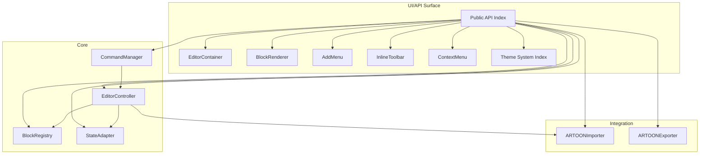
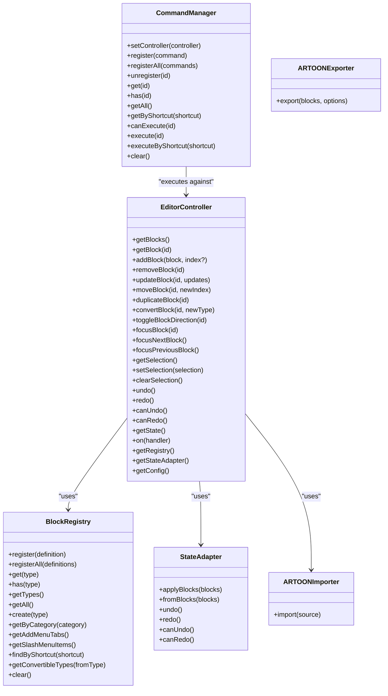
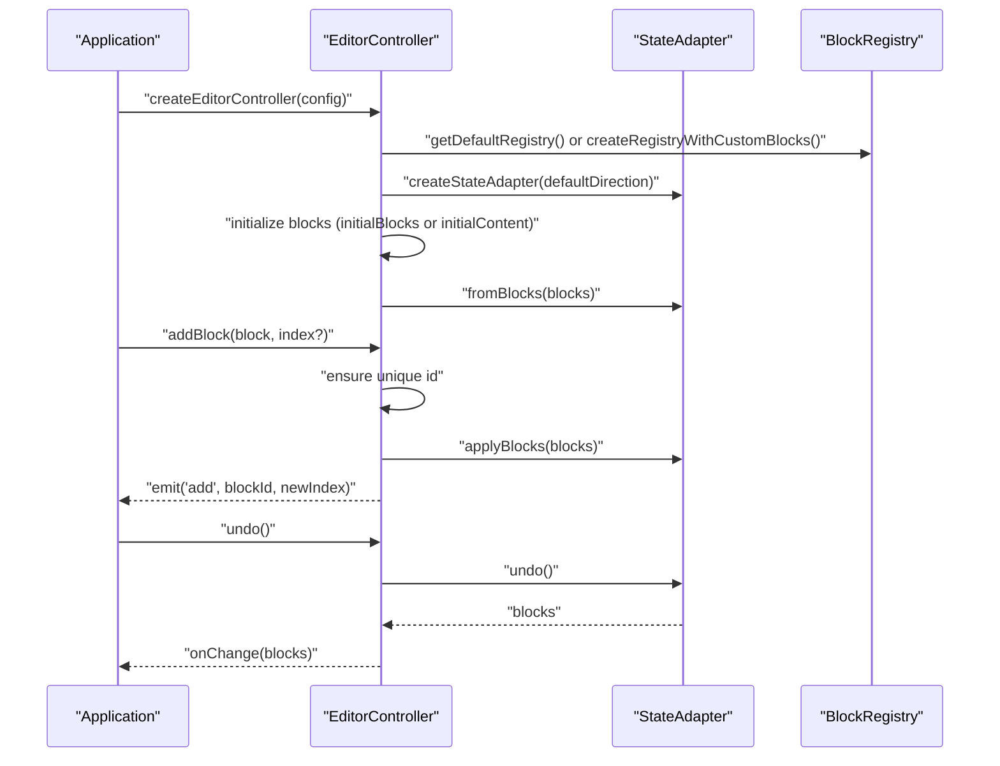
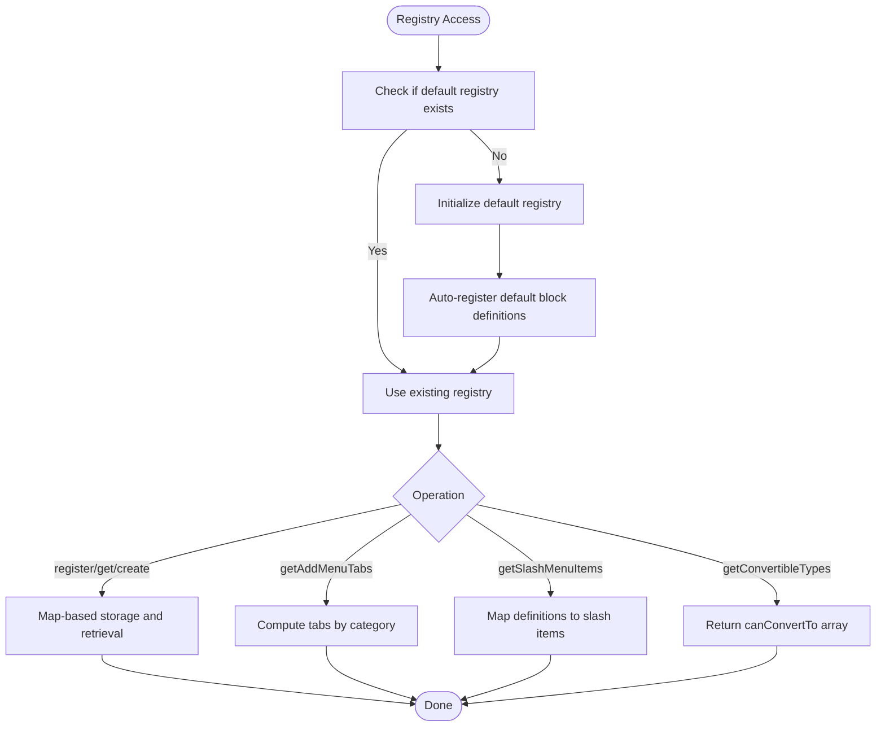
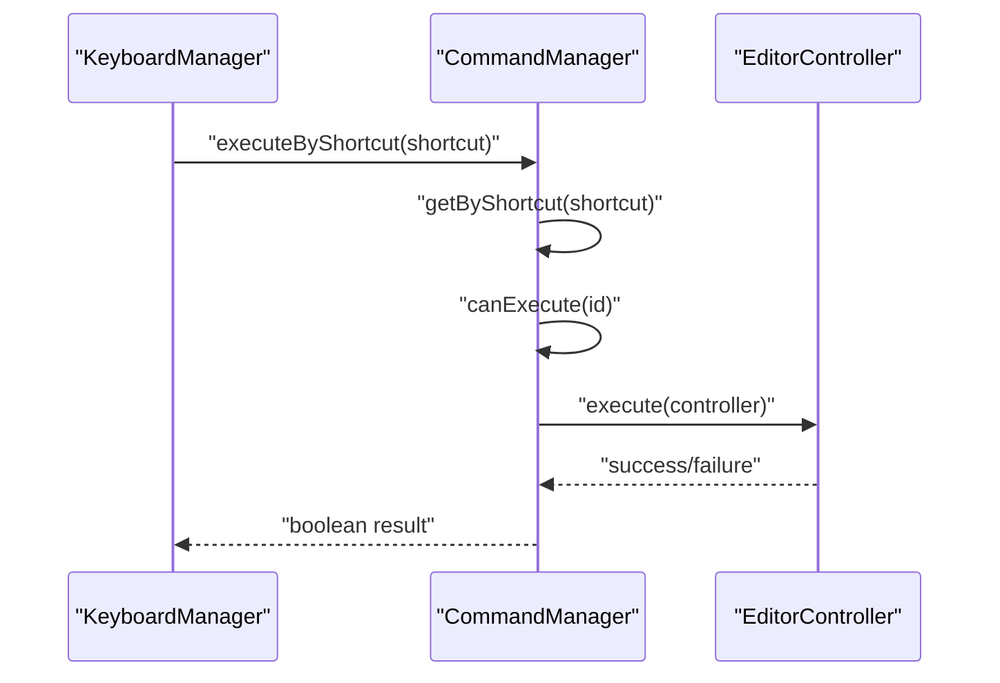
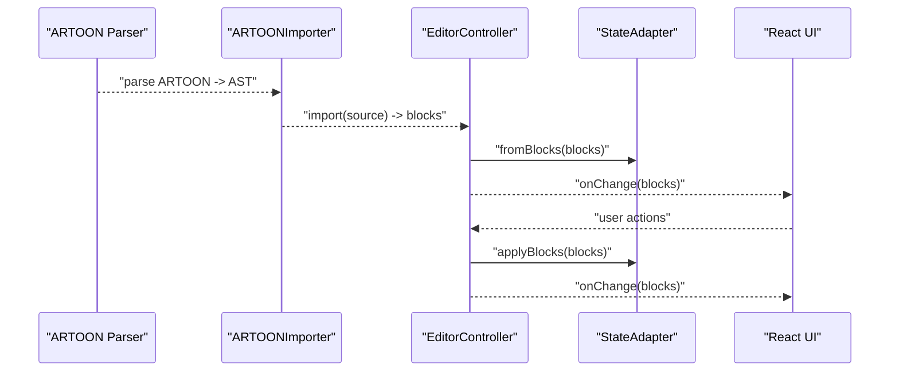
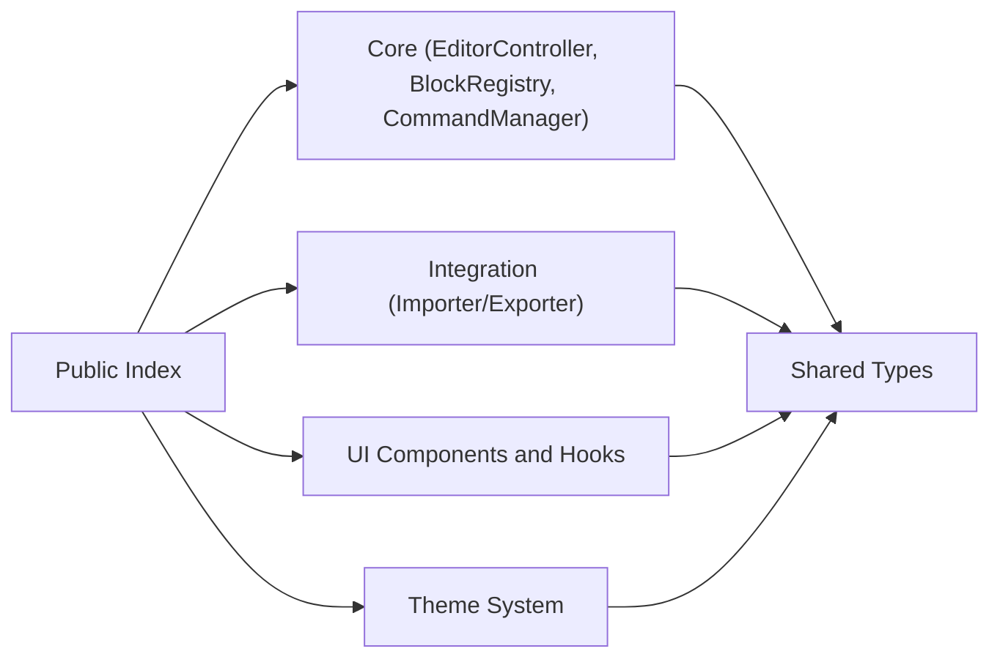

# Typer Editor API

<cite>
**Referenced Files in This Document**
- [EditorController.ts](file://artoon-typer/src/core/EditorController.ts)
- [BlockRegistry.ts](file://artoon-typer/src/core/BlockRegistry.ts)
- [CommandManager.ts](file://artoon-typer/src/core/CommandManager.ts)
- [index.ts](file://artoon-typer/src/index.ts)
- [types.ts](file://artoon-typer/src/types.ts)
- [README.md](file://artoon-typer/README.md)
- [index.ts](file://artoon-typer/src/themes/index.ts)
</cite>

## Table of Contents
1. [Introduction](#introduction)
2. [Project Structure](#project-structure)
3. [Core Components](#core-components)
4. [Architecture Overview](#architecture-overview)
5. [Detailed Component Analysis](#detailed-component-analysis)
6. [Dependency Analysis](#dependency-analysis)
7. [Performance Considerations](#performance-considerations)
8. [Troubleshooting Guide](#troubleshooting-guide)
9. [Conclusion](#conclusion)
10. [Appendices](#appendices)

## Introduction
This document provides comprehensive API documentation for the ARTOON Typer Editor package. It focuses on the EditorController for managing editor behavior, the block registry and command execution, the block system including registration and interaction handlers, the UI component API surface, the theme system integration, and the plugin architecture for extending functionality. It also includes guidance on editor initialization, block creation, event handling, integration with the underlying state management system, and performance optimization for large documents and real-time collaboration.

## Project Structure
The Typer Editor package exposes a cohesive API surface through a central index that re-exports core controllers, registries, managers, UI components, hooks, and theme utilities. The EditorController orchestrates block operations, selection, and integrates with the StateAdapter for undo/redo history. The BlockRegistry centralizes block definitions and conversion capabilities. The CommandManager provides a command pattern for keyboard shortcuts and actions. The UI components and hooks integrate with React-based applications via EditorContainer, BlockRenderer, and supporting UI primitives.

**Diagram sources**
- [index.ts:75-270](file://artoon-typer/src/index.ts#L75-L270)
- [EditorController.ts:27-67](file://artoon-typer/src/core/EditorController.ts#L27-L67)
- [BlockRegistry.ts:19-174](file://artoon-typer/src/core/BlockRegistry.ts#L19-L174)
- [CommandManager.ts:16-140](file://artoon-typer/src/core/CommandManager.ts#L16-L140)
- [index.ts:1-40](file://artoon-typer/src/themes/index.ts#L1-L40)

**Section sources**
- [index.ts:1-270](file://artoon-typer/src/index.ts#L1-L270)
- [README.md:1-219](file://artoon-typer/README.md#L1-L219)

## Core Components
This section outlines the primary building blocks of the editor runtime and their responsibilities.

- EditorController: Manages blocks, selection, focus, history, and emits block lifecycle events. Integrates with StateAdapter for undo/redo and with ARTOONImporter for content initialization.
- BlockRegistry: Central registry for block definitions, slash menu items, add menu tabs, and conversion rules.
- CommandManager: Registers and executes editor commands, supports shortcuts, and validates execution conditions.
- StateAdapter: Bridges the internal block model to a transactional history system for undo/redo.
- ARTOONImporter/Exporter: Converts between ARTOON text and internal block arrays.

Key exports and entry points are declared in the public index, enabling consumers to initialize editors, manage blocks, and integrate UI components.

**Section sources**
- [EditorController.ts:27-475](file://artoon-typer/src/core/EditorController.ts#L27-L475)
- [BlockRegistry.ts:19-174](file://artoon-typer/src/core/BlockRegistry.ts#L19-L174)
- [CommandManager.ts:16-304](file://artoon-typer/src/core/CommandManager.ts#L16-L304)
- [index.ts:75-270](file://artoon-typer/src/index.ts#L75-L270)
- [types.ts:407-461](file://artoon-typer/src/types.ts#L407-L461)

## Architecture Overview
The editor follows a layered architecture:
- Core Layer: Controllers and managers coordinate behavior.
- Registry Layer: Defines block types and their capabilities.
- Integration Layer: Converts between ARTOON and internal block models.
- UI Layer: React components and hooks expose the editor to applications.
- Theme Layer: Dual theme system for editor and preview modes.

**Diagram sources**
- [EditorController.ts:27-475](file://artoon-typer/src/core/EditorController.ts#L27-L475)
- [BlockRegistry.ts:19-174](file://artoon-typer/src/core/BlockRegistry.ts#L19-L174)
- [CommandManager.ts:16-304](file://artoon-typer/src/core/CommandManager.ts#L16-L304)
- [index.ts:1-200](file://artoon-typer/src/integration/StateAdapter.ts#L1-L200)
- [index.ts:1-200](file://artoon-typer/src/integration/ARTOONImporter.ts#L1-L200)
- [index.ts:1-200](file://artoon-typer/src/integration/ARTOONExporter.ts#L1-L200)

## Detailed Component Analysis

### EditorController API
The EditorController is the central orchestrator for block operations, selection, focus, and history. It initializes from either raw blocks or ARTOON content, maintains a focused block, and emits lifecycle events to subscribers.

Key capabilities:
- Block lifecycle: add, remove, update, move, duplicate, convert, toggle direction.
- Selection management: get/set/clear selection with offsets and collapsed state.
- Focus navigation: next/previous block focusing.
- History: undo/redo with canUndo/canRedo checks.
- Events: subscribe/unsubscribe to block lifecycle events.
- Registry and adapter accessors for advanced integrations.

Initialization options include default direction, placeholder, read-only mode, auto-focus, theme, enabled block types, custom block definitions, and onChange callbacks.

**Diagram sources**
- [EditorController.ts:36-67](file://artoon-typer/src/core/EditorController.ts#L36-L67)
- [EditorController.ts:120-131](file://artoon-typer/src/core/EditorController.ts#L120-L131)
- [EditorController.ts:366-383](file://artoon-typer/src/core/EditorController.ts#L366-L383)

**Section sources**
- [EditorController.ts:27-475](file://artoon-typer/src/core/EditorController.ts#L27-L475)
- [types.ts:407-461](file://artoon-typer/src/types.ts#L407-L461)

### Block Registry API
The BlockRegistry manages block definitions, categories, add menu tabs, slash menu items, and conversion rules. It auto-registers default block definitions on first access and supports custom block registration.

Highlights:
- Registration: single and bulk registration of block definitions.
- Lookup: get by type, existence check, list all types and definitions.
- Creation: instantiate a new block of a given type using its factory.
- Menus: compute add menu tabs and slash menu items for UI integration.
- Conversion: query convertible types for safe block type transitions.

**Diagram sources**
- [BlockRegistry.ts:159-166](file://artoon-typer/src/core/BlockRegistry.ts#L159-L166)
- [BlockRegistry.ts:25-78](file://artoon-typer/src/core/BlockRegistry.ts#L25-L78)
- [BlockRegistry.ts:89-124](file://artoon-typer/src/core/BlockRegistry.ts#L89-L124)
- [BlockRegistry.ts:136-139](file://artoon-typer/src/core/BlockRegistry.ts#L136-L139)

**Section sources**
- [BlockRegistry.ts:19-174](file://artoon-typer/src/core/BlockRegistry.ts#L19-L174)
- [types.ts:469-488](file://artoon-typer/src/types.ts#L469-L488)

### Command Manager API
The CommandManager provides a command pattern for editor actions. It registers commands with IDs, names, execution logic, optional canExecute predicates, and optional keyboard shortcuts. It supports execution by ID or by shortcut and validates controller availability and execution feasibility.

Built-in commands include undo, redo, delete block, duplicate block, move block up/down, and toggle direction.

**Diagram sources**
- [CommandManager.ts:77-132](file://artoon-typer/src/core/CommandManager.ts#L77-L132)
- [CommandManager.ts:149-292](file://artoon-typer/src/core/CommandManager.ts#L149-L292)

**Section sources**
- [CommandManager.ts:16-304](file://artoon-typer/src/core/CommandManager.ts#L16-L304)
- [types.ts:512-541](file://artoon-typer/src/types.ts#L512-L541)

### UI Component API Surface
The public index exports UI components and hooks intended for React-based integration. These include:
- EditorContainer: Top-level container for the editor UI.
- BlockRenderer: Renders individual blocks.
- BlockWrapper: Wraps block rendering with interaction affordances.
- AddMenu: Slash-command-style block insertion menu.
- InlineToolbar: Formatting toolbar for inline selections.
- ContextMenu: Block-specific context actions.
- useEditor: Hook exposing editor state and actions.
- useKeyboard: Hook for keyboard shortcuts.
- useDragDrop: Hook for drag-and-drop interactions.

These components are designed to work with the EditorController and StateAdapter under the hood, while the ThemeProvider and theme utilities enable dual-mode editor and preview themes.

**Section sources**
- [index.ts:192-249](file://artoon-typer/src/index.ts#L192-L249)
- [README.md:21-45](file://artoon-typer/README.md#L21-L45)

### Theme System Integration and Customization
The theme system supports:
- Editor themes: light, dark, and system preference-aware modes.
- Preview themes: multiple content presentation themes (minimal, blog, documentation, academic).
- Theme provider and hook: ThemeProvider and useTheme for React integration.
- Dual system: separate concerns for editor UI and content preview.

Consumers can configure default preferences and toggle themes at runtime.

**Section sources**
- [index.ts:1-40](file://artoon-typer/src/themes/index.ts#L1-L40)
- [README.md:158-171](file://artoon-typer/README.md#L158-L171)

### Plugin Architecture for Extending Functionality
The registry-based architecture enables extensibility:
- Custom block definitions: supply BlockDefinition objects with type, name, icon, category, shortcut, and create factory.
- Registration: use getDefaultRegistry() and registerAll(customDefs) to extend the default set.
- Conversion rules: define canConvertTo arrays to control safe transformations.
- Slash menu and add menu: automatically included via registry APIs.

This approach allows third-party plugins to contribute new block types and UI affordances without modifying core code.

**Section sources**
- [BlockRegistry.ts:69-124](file://artoon-typer/src/core/BlockRegistry.ts#L69-L124)
- [types.ts:469-488](file://artoon-typer/src/types.ts#L469-L488)

### Examples: Initialization, Block Creation, and Event Handling
Typical usage patterns:
- Editor initialization with ThemeProvider and EditorContainer.
- Using useEditor hook to manage blocks and actions.
- Listening to onChange for state synchronization.
- Converting between ARTOON text and blocks via import/export utilities.

Refer to the quick start and API sections in the package README for runnable examples.

**Section sources**
- [README.md:21-45](file://artoon-typer/README.md#L21-L45)
- [README.md:173-207](file://artoon-typer/README.md#L173-L207)

### Integration with State Management and Rendering Pipeline
The EditorController integrates with StateAdapter to maintain a transactional history for undo/redo. The rendering pipeline is UI-centric and relies on React components exposed via the public index. The integration layer includes ARTOONImporter and ARTOONExporter for serialization and deserialization.

**Diagram sources**
- [EditorController.ts:53-66](file://artoon-typer/src/core/EditorController.ts#L53-L66)
- [index.ts:1-200](file://artoon-typer/src/integration/ARTOONImporter.ts#L1-L200)
- [index.ts:1-200](file://artoon-typer/src/integration/StateAdapter.ts#L1-L200)

## Dependency Analysis
The public index consolidates exports across core, integration, UI, and theme modules. The EditorController depends on BlockRegistry and StateAdapter, while CommandManager depends on EditorController for execution. The UI components depend on the hooks and controllers exposed here.

**Diagram sources**
- [index.ts:14-270](file://artoon-typer/src/index.ts#L14-L270)
- [types.ts:1-654](file://artoon-typer/src/types.ts#L1-L654)

**Section sources**
- [index.ts:1-270](file://artoon-typer/src/index.ts#L1-L270)
- [types.ts:1-654](file://artoon-typer/src/types.ts#L1-L654)

## Performance Considerations
- Prefer batched updates: minimize frequent onChange triggers by grouping operations.
- Use shallow comparisons: avoid unnecessary re-renders by passing stable references where possible.
- Limit heavy block types: large tables or media blocks can impact rendering; consider lazy loading or virtualization strategies.
- History management: limit deep nesting and excessive undo/redo operations for very large documents.
- Real-time collaboration: synchronize via StateAdapter transactions and debounce user input to reduce churn.

[No sources needed since this section provides general guidance]

## Troubleshooting Guide
Common issues and remedies:
- Unknown block type: Ensure custom block definitions are registered before use; consult BlockRegistry.getConvertibleTypes and default definitions.
- Conversion failures: Verify canConvertTo arrays in definitions; EditorController.convertBlock logs warnings for invalid conversions.
- Undo/redo not working: Confirm StateAdapter is initialized and applyBlocks is called after mutations; check canUndo/canRedo.
- Events not firing: Ensure handlers are subscribed via EditorController.on and that blocks are mutated through controller methods.

**Section sources**
- [BlockRegistry.ts:136-139](file://artoon-typer/src/core/BlockRegistry.ts#L136-L139)
- [EditorController.ts:218-227](file://artoon-typer/src/core/EditorController.ts#L218-L227)
- [EditorController.ts:366-397](file://artoon-typer/src/core/EditorController.ts#L366-L397)

## Conclusion
The ARTOON Typer Editor provides a modular, extensible framework for building block-based rich text experiences with native RTL support. Its EditorController, BlockRegistry, CommandManager, and integration utilities form a cohesive system that supports robust editing workflows, theme customization, and plugin-driven extensibility. The public API surface simplifies React integration through UI components and hooks, while the dual theme system enables flexible editor and preview experiences.

[No sources needed since this section summarizes without analyzing specific files]

## Appendices

### API Reference Highlights
- EditorController: block CRUD, selection, focus, history, events, registry and adapter accessors.
- BlockRegistry: registration, lookup, creation, add menu tabs, slash menu items, conversion queries.
- CommandManager: registration, execution by ID or shortcut, execution validation.
- Public index exports: controllers, registries, managers, UI components, hooks, and theme utilities.

**Section sources**
- [index.ts:75-270](file://artoon-typer/src/index.ts#L75-L270)
- [types.ts:407-654](file://artoon-typer/src/types.ts#L407-L654)