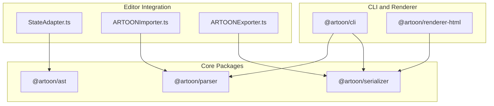
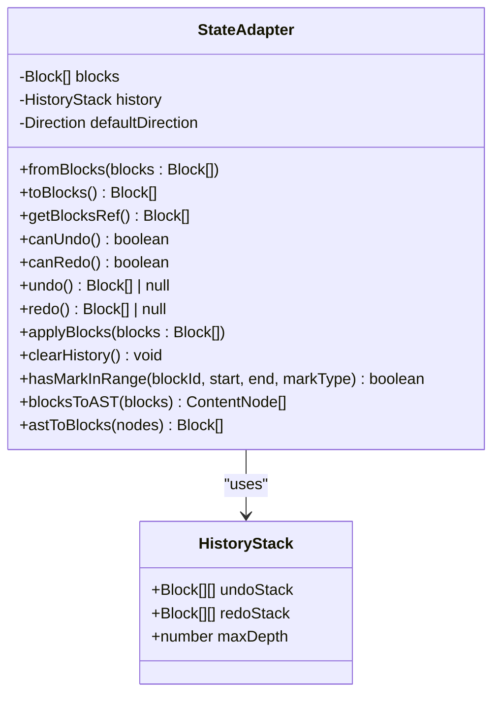
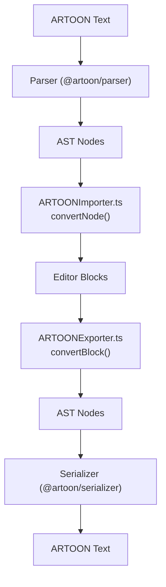
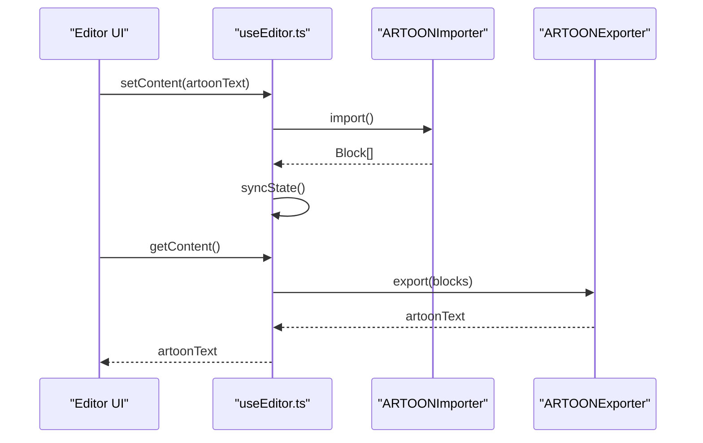
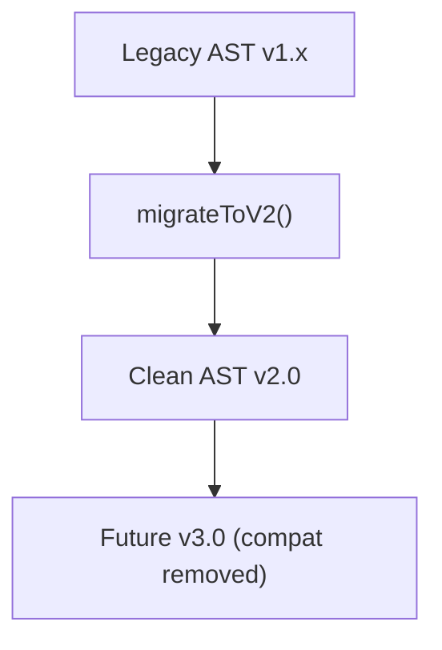
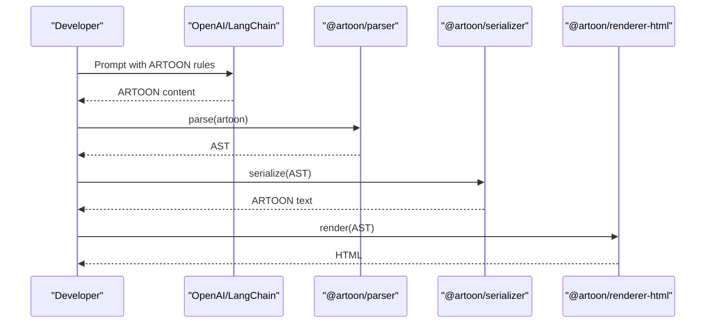
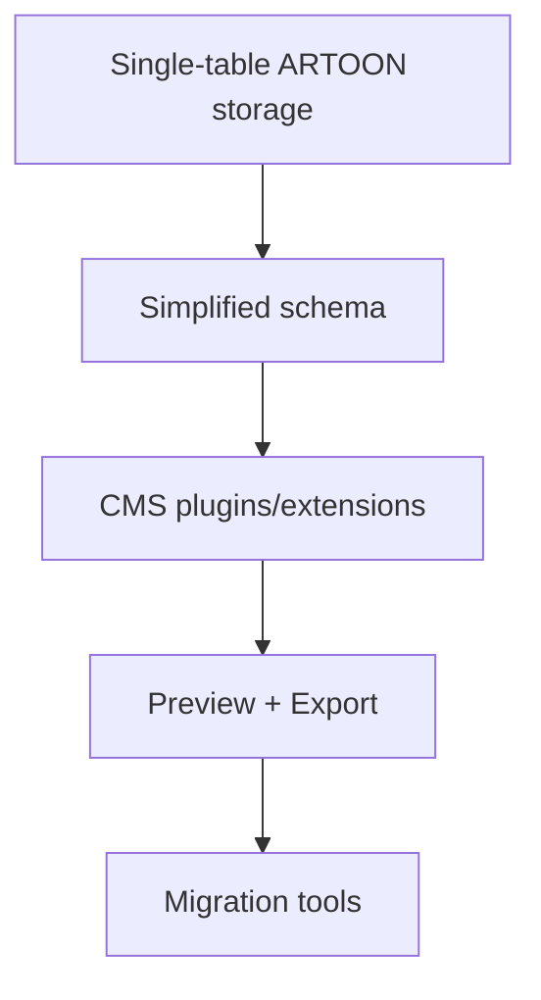
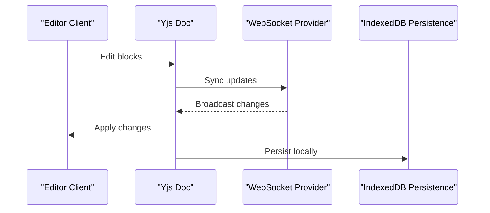
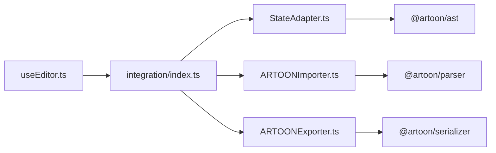

# Advanced Integration Patterns

<cite>
**Referenced Files in This Document**
- [artoon-typer/src/integration/index.ts](file://artoon-typer/src/integration/index.ts)
- [artoon-typer/src/integration/StateAdapter.ts](file://artoon-typer/src/integration/StateAdapter.ts)
- [artoon-typer/src/integration/ARTOONImporter.ts](file://artoon-typer/src/integration/ARTOONImporter.ts)
- [artoon-typer/src/integration/ARTOONExporter.ts](file://artoon-typer/src/integration/ARTOONExporter.ts)
- [artoon-typer/src/ui/hooks/useEditor.ts](file://artoon-typer/src/ui/hooks/useEditor.ts)
- [artoon-ast/src/migration/index.ts](file://artoon-ast/src/migration/index.ts)
- [artoon-ast/src/transform/index.ts](file://artoon-ast/src/transform/index.ts)
- [artoon-serializer/src/nodes/index.ts](file://artoon-serializer/src/nodes/index.ts)
- [artoon-parser/src/index.ts](file://artoon-parser/src/index.ts)
- [artoon-typer/tests/integration/StateAdapter.test.ts](file://artoon-typer/tests/integration/StateAdapter.test.ts)
- [artoon-typer/tests/integration/ARTOONImporter.test.ts](file://artoon-typer/tests/integration/ARTOONImporter.test.ts)
- [artoon-typer/tests/integration/ARTOONExporter.test.ts](file://artoon-typer/tests/integration/ARTOONExporter.test.ts)
- [AI-INTEGRATION-EXAMPLES.md](file://AI-INTEGRATION-EXAMPLES.md)
- [AI-NATIVE-POSITIONING-STRATEGY-AR.md](file://AI-NATIVE-POSITIONING-STRATEGY-AR.md)
- [START-HERE.md](file://START-HERE.md)
- [PROFESSIONAL-ANALYSIS-AR.md](file://PROFESSIONAL-ANALYSIS-AR.md)
</cite>

## Table of Contents
1. [Introduction](#introduction)
2. [Project Structure](#project-structure)
3. [Core Components](#core-components)
4. [Architecture Overview](#architecture-overview)
5. [Detailed Component Analysis](#detailed-component-analysis)
6. [Dependency Analysis](#dependency-analysis)
7. [Performance Considerations](#performance-considerations)
8. [Troubleshooting Guide](#troubleshooting-guide)
9. [Conclusion](#conclusion)
10. [Appendices](#appendices)

## Introduction
This document presents advanced integration patterns for ARTOON 2.0 across platforms and systems. It covers CMS integration, database strategies, content management workflows, importer/exporter architecture for ARTOON and other formats, StateAdapter patterns for external editors, API/webhook strategies, real-time synchronization, AI workflow integration, automated content processing pipelines, microservice architectures, migration strategies, data transformation patterns, and enterprise-grade deployment considerations.

## Project Structure
At a high level, ARTOON 2.0 is organized around a modular architecture:
- Parser and Serializer handle ARTOON text and AST interchange.
- Editor integration provides import/export adapters and state bridging.
- CLI and renderer packages orchestrate cross-format workflows.
- Tests validate integration correctness across formats and workflows.



**Diagram sources**
- [artoon-typer/src/integration/StateAdapter.ts:1-523](file://artoon-typer/src/integration/StateAdapter.ts#L1-L523)
- [artoon-typer/src/integration/ARTOONImporter.ts:1-779](file://artoon-typer/src/integration/ARTOONImporter.ts#L1-L779)
- [artoon-typer/src/integration/ARTOONExporter.ts:1-638](file://artoon-typer/src/integration/ARTOONExporter.ts#L1-L638)
- [artoon-parser/src/index.ts](file://artoon-parser/src/index.ts)
- [artoon-serializer/src/nodes/index.ts](file://artoon-serializer/src/nodes/index.ts)
- [artoon-cli/inventory_artoon_cli/03-NON-RESPONSIBILITIES.md:241-255](file://artoon-cli/inventory_artoon_cli/03-NON-RESPONSIBILITIES.md#L241-L255)

**Section sources**
- [artoon-typer/src/integration/index.ts:1-27](file://artoon-typer/src/integration/index.ts#L1-L27)
- [artoon-typer/src/integration/StateAdapter.ts:1-523](file://artoon-typer/src/integration/StateAdapter.ts#L1-L523)
- [artoon-typer/src/integration/ARTOONImporter.ts:1-779](file://artoon-typer/src/integration/ARTOONImporter.ts#L1-L779)
- [artoon-typer/src/integration/ARTOONExporter.ts:1-638](file://artoon-typer/src/integration/ARTOONExporter.ts#L1-L638)

## Core Components
- StateAdapter: Bridges ARTOON blocks to editor state and vice versa, with undo/redo and mark-range checks.
- ARTOONImporter: Parses ARTOON text into editor blocks using @artoon/parser.
- ARTOONExporter: Serializes editor blocks to ARTOON text using @artoon/serializer.
- Editor hook integration: Provides getContent/setContent using importer/exporter.
- Migration and transform utilities: Support v1.x to v2.x migrations and compatibility adjustments.

Key responsibilities and contracts are exported from the integration module and used by the editor UI.

**Section sources**
- [artoon-typer/src/integration/index.ts:1-27](file://artoon-typer/src/integration/index.ts#L1-L27)
- [artoon-typer/src/integration/StateAdapter.ts:52-148](file://artoon-typer/src/integration/StateAdapter.ts#L52-L148)
- [artoon-typer/src/integration/ARTOONImporter.ts:132-154](file://artoon-typer/src/integration/ARTOONImporter.ts#L132-L154)
- [artoon-typer/src/integration/ARTOONExporter.ts:72-94](file://artoon-typer/src/integration/ARTOONExporter.ts#L72-L94)
- [artoon-typer/src/ui/hooks/useEditor.ts:893-906](file://artoon-typer/src/ui/hooks/useEditor.ts#L893-L906)

## Architecture Overview
The integration architecture centers on three pillars:
- Import/Export pipeline: ARTOONImporter and ARTOONExporter convert between ARTOON text and internal blocks.
- State synchronization: StateAdapter bridges blocks to editor state and maintains history.
- Cross-format interoperability: Parser/Serializer enable conversion to/from other formats.

```mermaid
sequenceDiagram
participant UI as "Editor UI"
participant Hook as "useEditor.ts"
participant Imp as "ARTOONImporter.ts"
participant Exp as "ARTOONExporter.ts"
participant Ser as "@artoon/serializer"
participant Par as "@artoon/parser"
UI->>Hook : setContent(artoonText)
Hook->>Imp : import(artoonText)
Imp->>Par : parse()
Par-->>Imp : AST
Imp-->>Hook : Block[]
Hook->>Hook : apply blocks to editor
UI->>Hook : getContent()
Hook->>Exp : export(blocks)
Exp->>Ser : serialize(AST)
Ser-->>Exp : ARTOON text
Exp-->>Hook : ARTOON text
Hook-->>UI : ARTOON text
```

**Diagram sources**
- [artoon-typer/src/ui/hooks/useEditor.ts:893-906](file://artoon-typer/src/ui/hooks/useEditor.ts#L893-L906)
- [artoon-typer/src/integration/ARTOONImporter.ts:142-154](file://artoon-typer/src/integration/ARTOONImporter.ts#L142-L154)
- [artoon-typer/src/integration/ARTOONExporter.ts:83-94](file://artoon-typer/src/integration/ARTOONExporter.ts#L83-L94)
- [artoon-parser/src/index.ts](file://artoon-parser/src/index.ts)
- [artoon-serializer/src/nodes/index.ts](file://artoon-serializer/src/nodes/index.ts)

## Detailed Component Analysis

### StateAdapter Pattern
StateAdapter manages bidirectional conversion between ARTOON blocks and AST nodes, and maintains a lightweight history stack for undo/redo. It also exposes mark-range checks for inline formatting.



**Diagram sources**
- [artoon-typer/src/integration/StateAdapter.ts:52-148](file://artoon-typer/src/integration/StateAdapter.ts#L52-L148)

**Section sources**
- [artoon-typer/src/integration/StateAdapter.ts:52-148](file://artoon-typer/src/integration/StateAdapter.ts#L52-L148)
- [artoon-typer/tests/integration/StateAdapter.test.ts:1-277](file://artoon-typer/tests/integration/StateAdapter.test.ts#L1-L277)

### Importer/Exporter Architecture
The importer parses ARTOON text into blocks, handling text, lists, code, tables, media, dividers, and compound constructs. The exporter serializes blocks back to ARTOON text, preserving directionality and structure.



**Diagram sources**
- [artoon-typer/src/integration/ARTOONImporter.ts:142-182](file://artoon-typer/src/integration/ARTOONImporter.ts#L142-L182)
- [artoon-typer/src/integration/ARTOONExporter.ts:83-121](file://artoon-typer/src/integration/ARTOONExporter.ts#L83-L121)
- [artoon-parser/src/index.ts](file://artoon-parser/src/index.ts)
- [artoon-serializer/src/nodes/index.ts](file://artoon-serializer/src/nodes/index.ts)

**Section sources**
- [artoon-typer/src/integration/ARTOONImporter.ts:132-779](file://artoon-typer/src/integration/ARTOONImporter.ts#L132-L779)
- [artoon-typer/src/integration/ARTOONExporter.ts:72-638](file://artoon-typer/src/integration/ARTOONExporter.ts#L72-L638)
- [artoon-typer/tests/integration/ARTOONImporter.test.ts:1-284](file://artoon-typer/tests/integration/ARTOONImporter.test.ts#L1-L284)
- [artoon-typer/tests/integration/ARTOONExporter.test.ts:1-356](file://artoon-typer/tests/integration/ARTOONExporter.test.ts#L1-L356)

### Editor Integration Hooks
The editor hook wires import/export into the UI lifecycle, enabling seamless content exchange.



**Diagram sources**
- [artoon-typer/src/ui/hooks/useEditor.ts:893-906](file://artoon-typer/src/ui/hooks/useEditor.ts#L893-L906)
- [artoon-typer/src/integration/ARTOONImporter.ts:142-154](file://artoon-typer/src/integration/ARTOONImporter.ts#L142-L154)
- [artoon-typer/src/integration/ARTOONExporter.ts:83-94](file://artoon-typer/src/integration/ARTOONExporter.ts#L83-L94)

**Section sources**
- [artoon-typer/src/ui/hooks/useEditor.ts:893-906](file://artoon-typer/src/ui/hooks/useEditor.ts#L893-L906)

### Migration and Compatibility
Migration utilities transform legacy AST formats to the current v2.0 schema, preparing for v3.0 removal of compatibility layers. Transform logic adapts older node structures to new properties.



**Diagram sources**
- [artoon-ast/src/migration/index.ts:14-75](file://artoon-ast/src/migration/index.ts#L14-L75)
- [artoon-ast/src/transform/index.ts:151-199](file://artoon-ast/src/transform/index.ts#L151-L199)

**Section sources**
- [artoon-ast/src/migration/index.ts:1-76](file://artoon-ast/src/migration/index.ts#L1-L76)
- [artoon-ast/src/transform/index.ts:151-199](file://artoon-ast/src/transform/index.ts#L151-L199)

### AI Workflow Integration
Real-world AI integration examples demonstrate generating, validating, translating, optimizing, and orchestrating ARTOON content with AI models and libraries.



**Diagram sources**
- [AI-INTEGRATION-EXAMPLES.md:65-156](file://AI-INTEGRATION-EXAMPLES.md#L65-L156)
- [AI-INTEGRATION-EXAMPLES.md:189-276](file://AI-INTEGRATION-EXAMPLES.md#L189-L276)
- [AI-INTEGRATION-EXAMPLES.md:280-370](file://AI-INTEGRATION-EXAMPLES.md#L280-L370)
- [AI-INTEGRATION-EXAMPLES.md:449-581](file://AI-INTEGRATION-EXAMPLES.md#L449-L581)
- [AI-INTEGRATION-EXAMPLES.md:585-656](file://AI-INTEGRATION-EXAMPLES.md#L585-L656)

**Section sources**
- [AI-INTEGRATION-EXAMPLES.md:1-766](file://AI-INTEGRATION-EXAMPLES.md#L1-L766)

### CMS Integration Strategy
The strategy outlines single-table storage, simplified schemas, and plugin/extension development for CMS platforms like Strapi and Directus.



**Diagram sources**
- [AI-NATIVE-POSITIONING-STRATEGY-AR.md:90-135](file://AI-NATIVE-POSITIONING-STRATEGY-AR.md#L90-L135)
- [AI-NATIVE-POSITIONING-STRATEGY-AR.md:316-388](file://AI-NATIVE-POSITIONING-STRATEGY-AR.md#L316-L388)

**Section sources**
- [AI-NATIVE-POSITIONING-STRATEGY-AR.md:90-135](file://AI-NATIVE-POSITIONING-STRATEGY-AR.md#L90-L135)
- [AI-NATIVE-POSITIONING-STRATEGY-AR.md:316-388](file://AI-NATIVE-POSITIONING-STRATEGY-AR.md#L316-L388)

### Real-Time Synchronization
A Yjs-based collaboration pattern is proposed for real-time editing, including awareness, persistence, and conflict resolution.



**Diagram sources**
- [PROFESSIONAL-ANALYSIS-AR.md:1300-1350](file://PROFESSIONAL-ANALYSIS-AR.md#L1300-L1350)

**Section sources**
- [PROFESSIONAL-ANALYSIS-AR.md:1296-1353](file://PROFESSIONAL-ANALYSIS-AR.md#L1296-L1353)

## Dependency Analysis
The integration layer depends on parser and serializer packages, while the editor UI depends on the integration module.



**Diagram sources**
- [artoon-typer/src/integration/index.ts:1-27](file://artoon-typer/src/integration/index.ts#L1-L27)
- [artoon-typer/src/integration/StateAdapter.ts:1-523](file://artoon-typer/src/integration/StateAdapter.ts#L1-L523)
- [artoon-typer/src/integration/ARTOONImporter.ts:1-779](file://artoon-typer/src/integration/ARTOONImporter.ts#L1-L779)
- [artoon-typer/src/integration/ARTOONExporter.ts:1-638](file://artoon-typer/src/integration/ARTOONExporter.ts#L1-L638)
- [artoon-parser/src/index.ts](file://artoon-parser/src/index.ts)
- [artoon-serializer/src/nodes/index.ts](file://artoon-serializer/src/nodes/index.ts)

**Section sources**
- [artoon-typer/src/integration/index.ts:1-27](file://artoon-typer/src/integration/index.ts#L1-L27)

## Performance Considerations
- Parser/serializer are deterministic and fast; prefer streaming or chunked processing for large documents.
- Minimize repeated conversions; cache parsed ASTs when appropriate.
- Use diff-based updates in collaborative scenarios to reduce bandwidth.
- Keep direction and inline content structures minimal to avoid heavy reflows.

## Troubleshooting Guide
Common issues and resolutions:
- Empty or malformed input: Importer returns empty arrays; validate input before import.
- Round-trip fidelity: Ensure correct mapping of list item types and separator types.
- History stack overflow: The adapter caps undo/redo depth; clear history when needed.
- Migration errors: Use migration utilities to normalize legacy ASTs before processing.

**Section sources**
- [artoon-typer/src/integration/ARTOONImporter.ts:142-154](file://artoon-typer/src/integration/ARTOONImporter.ts#L142-L154)
- [artoon-typer/src/integration/ARTOONExporter.ts:250-270](file://artoon-typer/src/integration/ARTOONExporter.ts#L250-L270)
- [artoon-typer/src/integration/StateAdapter.ts:59-64](file://artoon-typer/src/integration/StateAdapter.ts#L59-L64)
- [artoon-ast/src/migration/index.ts:14-75](file://artoon-ast/src/migration/index.ts#L14-L75)

## Conclusion
ARTOON 2.0 provides a robust foundation for advanced integrations across platforms. Its importer/exporter pipeline, StateAdapter bridge, and migration tools enable seamless CMS and AI workflows, while real-time collaboration patterns and microservice-friendly formats support scalable deployments.

## Appendices

### API Integration Strategies
- REST endpoints: Expose import/export endpoints backed by ARTOONImporter/ARTOONExporter.
- Validation: Integrate @artoon/validator for content rules.
- Authentication: Use bearer tokens or session-based auth; enforce quotas and rate limits.

### Webhook and Real-Time Patterns
- Webhooks: Emit events on content changes; clients pull via importer/exporter.
- Real-time: Use WebSocket/Yjs for live collaboration; persist with IndexedDB.

### Microservice Architectures
- Parser service: Validates and normalizes ARTOON.
- Exporter service: Renders to HTML/PDF/other formats.
- Worker service: Processes AI pipelines asynchronously.

**Section sources**
- [START-HERE.md:144-212](file://START-HERE.md#L144-L212)
- [AI-NATIVE-POSITIONING-STRATEGY-AR.md:316-388](file://AI-NATIVE-POSITIONING-STRATEGY-AR.md#L316-L388)
- [PROFESSIONAL-ANALYSIS-AR.md:1300-1350](file://PROFESSIONAL-ANALYSIS-AR.md#L1300-L1350)