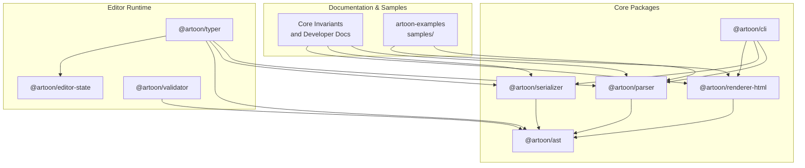
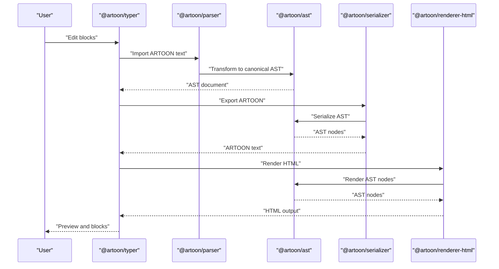
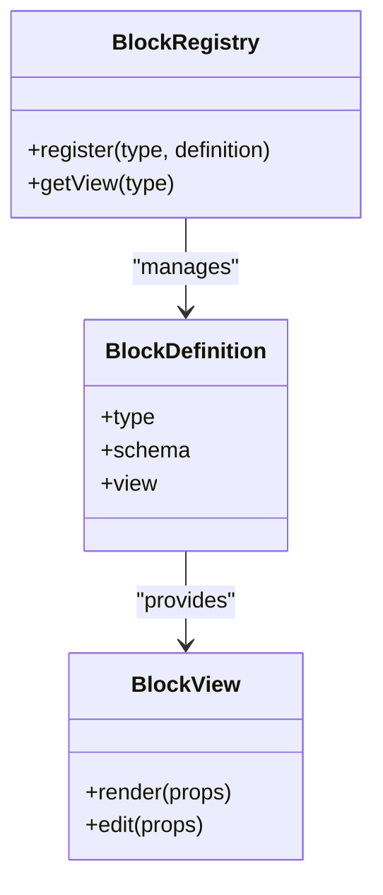
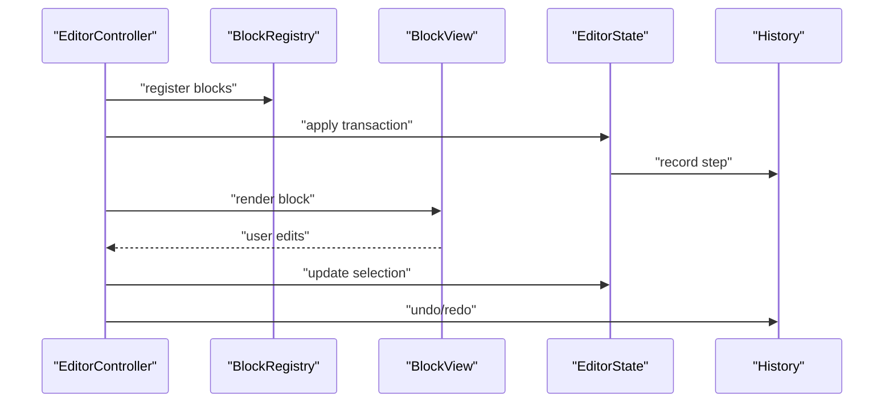
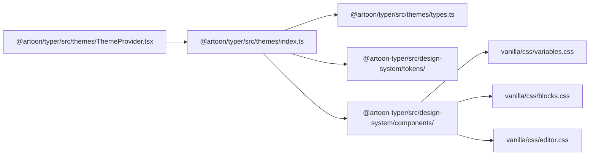
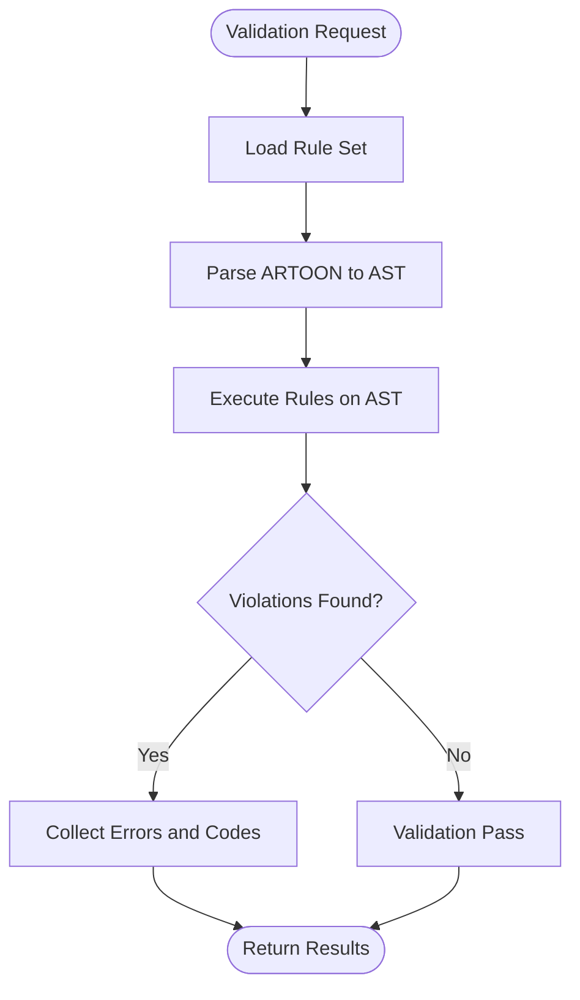
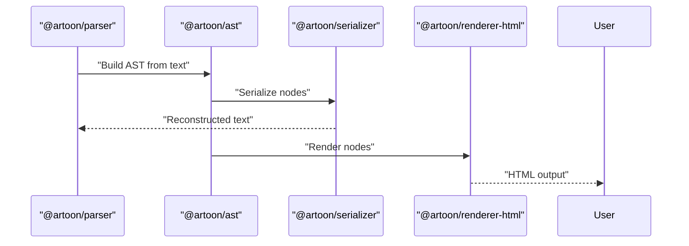
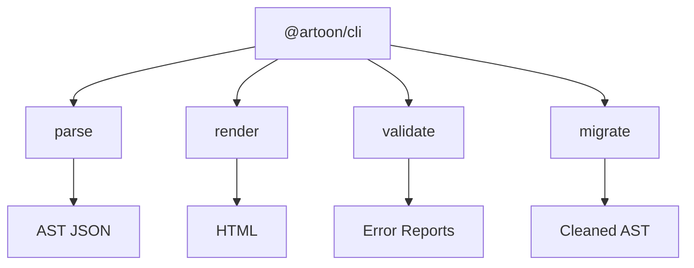
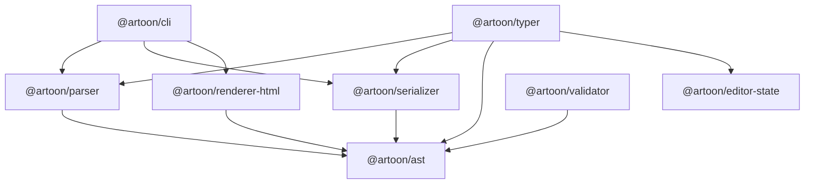

# Advanced Topics

<cite>
**Referenced Files in This Document**
- [README.md](file://README.md)
- [QUICK-REFERENCE-CARD.md](file://QUICK-REFERENCE-CARD.md)
- [docs/05-DEVELOPER-GUIDE.md](file://docs/05-DEVELOPER-GUIDE.md)
- [Core Invariants/SYNTAX-REFERENCE.md](file://Core Invariants/SYNTAX-REFERENCE.md)
- [artoon-typer/README.md](file://artoon-typer/README.md)
- [artoon-ast/README.md](file://artoon-ast/README.md)
- [artoon-typer/src/blocks/definitions.ts](file://artoon-typer/src/blocks/definitions.ts)
- [artoon-typer/src/blocks/views/](file://artoon-typer/src/blocks/views/)
- [artoon-typer/src/core/BlockRegistry.ts](file://artoon-typer/src/core/BlockRegistry.ts)
- [artoon-typer/src/themes/ThemeProvider.tsx](file://artoon-typer/src/themes/ThemeProvider.tsx)
- [artoon-typer/src/themes/index.ts](file://artoon-typer/src/themes/index.ts)
- [artoon-typer/src/themes/types.ts](file://artoon-typer/src/themes/types.ts)
- [artoon-typer/src/design-system/tokens/](file://artoon-typer/src/design-system/tokens/)
- [artoon-typer/src/design-system/components/](file://artoon-typer/src/design-system/components/)
- [artoon-typer/src/ui/components/](file://artoon-typer/src/ui/components/)
- [artoon-typer/src/ui/hooks/](file://artoon-typer/src/ui/hooks/)
- [artoon-typer/src/ui/helpers/](file://artoon-typer/src/ui/helpers/)
- [artoon-typer/src/integration/ARTOONImporter.ts](file://artoon-typer/src/integration/ARTOONImporter.ts)
- [artoon-typer/src/integration/ARTOONExporter.ts](file://artoon-typer/src/integration/ARTOONExporter.ts)
- [artoon-typer/src/integration/StateAdapter.ts](file://artoon-typer/src/integration/StateAdapter.ts)
- [artoon-typer/vanilla/css/variables.css](file://artoon-typer/vanilla/css/variables.css)
- [artoon-typer/vanilla/css/blocks.css](file://artoon-typer/vanilla/css/blocks.css)
- [artoon-typer/vanilla/css/editor.css](file://artoon-typer/vanilla/css/editor.css)
- [artoon-typer/vanilla/js/app.js](file://artoon-typer/vanilla/js/app.js)
- [artoon-typer/vanilla/demo/sample.artoon](file://artoon-typer/vanilla/demo/sample.artoon)
- [artoon-ast/src/types.ts](file://artoon-ast/src/types.ts)
- [artoon-ast/src/builder/ARTOONBuilder.ts](file://artoon-ast/src/builder/ARTOONBuilder.ts)
- [artoon-ast/src/serialize/index.ts](file://artoon-ast/src/serialize/index.ts)
- [artoon-ast/src/transform/index.ts](file://artoon-ast/src/transform/index.ts)
- [artoon-ast/src/schema/artoon-ast.schema.json](file://artoon-ast/src/schema/artoon-ast.schema.json)
- [artoon-parser/src/index.ts](file://artoon-parser/src/index.ts)
- [artoon-parser/src/lexer/index.ts](file://artoon-parser/src/lexer/index.ts)
- [artoon-parser/src/inline/index.ts](file://artoon-parser/src/inline/index.ts)
- [artoon-parser/src/table/index.ts](file://artoon-parser/src/table/index.ts)
- [artoon-serializer/src/index.ts](file://artoon-serializer/src/index.ts)
- [artoon-serializer/src/nodes/text.ts](file://artoon-serializer/src/nodes/text.ts)
- [artoon-serializer/src/nodes/code.ts](file://artoon-serializer/src/nodes/code.ts)
- [artoon-serializer/src/nodes/list.ts](file://artoon-serializer/src/nodes/list.ts)
- [artoon-serializer/src/nodes/table.ts](file://artoon-serializer/src/nodes/table.ts)
- [artoon-serializer/src/nodes/media.ts](file://artoon-serializer/src/nodes/media.ts)
- [artoon-serializer/src/inline/content.ts](file://artoon-serializer/src/inline/content.ts)
- [artoon-renderer-html/src/index.ts](file://artoon-renderer-html/src/index.ts)
- [artoon-renderer-html/src/render/nodes.ts](file://artoon-renderer-html/src/render/nodes.ts)
- [artoon-renderer-html/src/render/inline.ts](file://artoon-renderer-html/src/render/inline.ts)
- [artoon-renderer-html/src/utils.ts](file://artoon-renderer-html/src/utils.ts)
- [artoon-cli/src/index.ts](file://artoon-cli/src/index.ts)
- [artoon-cli/src/commands/parse.ts](file://artoon-cli/src/commands/parse.ts)
- [artoon-cli/src/commands/render.ts](file://artoon-cli/src/commands/render.ts)
- [artoon-cli/src/commands/validate.ts](file://artoon-cli/src/commands/validate.ts)
- [artoon-cli/src/commands/migrate.ts](file://artoon-cli/src/commands/migrate.ts)
- [artoon-validator/src/index.ts](file://artoon-validator/src/index.ts)
- [artoon-validator/src/rules/](file://artoon-validator/src/rules/)
- [artoon-editor-state/src/state/EditorState.ts](file://artoon-editor-state/src/state/EditorState.ts)
- [artoon-editor-state/src/transaction/Transaction.ts](file://artoon-editor-state/src/transaction/Transaction.ts)
- [artoon-editor-state/src/history/History.ts](file://artoon-editor-state/src/history/History.ts)
- [artoon-examples/test-blocks/](file://artoon-examples/test-blocks/)
- [samples/](file://samples/)
- [AI-INTEGRATION-EXAMPLES.md](file://AI-INTEGRATION-EXAMPLES.md)
- [AI-NATIVE-POSITIONING-STRATEGY-AR.md](file://AI-NATIVE-POSITIONING-STRATEGY-AR.md)
</cite>

## Table of Contents
1. [Introduction](#introduction)
2. [Project Structure](#project-structure)
3. [Core Components](#core-components)
4. [Architecture Overview](#architecture-overview)
5. [Detailed Component Analysis](#detailed-component-analysis)
6. [Dependency Analysis](#dependency-analysis)
7. [Performance Considerations](#performance-considerations)
8. [Security Considerations](#security-considerations)
9. [Advanced Integration Patterns](#advanced-integration-patterns)
10. [Troubleshooting Guide](#troubleshooting-guide)
11. [Conclusion](#conclusion)
12. [Appendices](#appendices)

## Introduction
This document provides expert-level guidance for extending and operating ARTOON 2.0. It covers advanced custom block development, theme creation and design system integration, validation rule extension, performance optimization, security hardening, advanced integrations with CMS and AI workflows, and robust troubleshooting and maintenance practices. The content is grounded in the repository’s authoritative syntax reference, developer guide, and the implementation of core packages such as the AST, parser, serializer, renderer, CLI, validator, editor state, and the visual editor (Typer).

## Project Structure
ARTOON 2.0 is organized as a monorepo of focused packages:
- Core parsing, serialization, rendering, and CLI packages form the foundation.
- The AST package defines canonical types and schema.
- The Typer package implements a visual editor with block registry, theme provider, design system, and UI components.
- Validator and Editor State packages are in progress but provide extension points for validation and state management.
- Examples and samples demonstrate usage and testing patterns.

**Diagram sources**
- [README.md:77-88](file://README.md#L77-L88)
- [artoon-ast/README.md:1-130](file://artoon-ast/README.md#L1-L130)
- [artoon-typer/README.md:1-219](file://artoon-typer/README.md#L1-L219)

**Section sources**
- [README.md:77-88](file://README.md#L77-L88)
- [QUICK-REFERENCE-CARD.md:56-63](file://QUICK-REFERENCE-CARD.md#L56-L63)

## Core Components
- AST: Canonical types and schema unify representation across packages. It supports transformation from parser output and JSON serialization for interoperability.
- Parser: Lexing, inline parsing, compound components, and table parsing produce a typed AST.
- Serializer: Converts AST nodes back to ARTOON text with correct separators and formatting.
- Renderer: Translates AST to HTML with semantic mapping and utilities.
- CLI: Provides commands for parse, render, validate, and migrate operations.
- Typer: Visual editor with block registry, theme provider, design system, and integration adapters.
- Validator: Extensible rule engine for content policy enforcement.
- Editor State: Transactional state model and history for editor operations.

**Section sources**
- [artoon-ast/README.md:71-130](file://artoon-ast/README.md#L71-L130)
- [docs/05-DEVELOPER-GUIDE.md:37-93](file://docs/05-DEVELOPER-GUIDE.md#L37-L93)
- [artoon-typer/README.md:159-219](file://artoon-typer/README.md#L159-L219)

## Architecture Overview
The ARTOON pipeline transforms ARTOON text into a canonical AST, then serializes or renders it. The visual editor integrates with the AST and exposes a block registry and theme provider for extensibility.

**Diagram sources**
- [artoon-typer/src/integration/ARTOONImporter.ts](file://artoon-typer/src/integration/ARTOONImporter.ts)
- [artoon-typer/src/integration/ARTOONExporter.ts](file://artoon-typer/src/integration/ARTOONExporter.ts)
- [artoon-ast/src/transform/index.ts](file://artoon-ast/src/transform/index.ts)
- [artoon-serializer/src/index.ts](file://artoon-serializer/src/index.ts)
- [artoon-renderer-html/src/index.ts](file://artoon-renderer-html/src/index.ts)

## Detailed Component Analysis

### Custom Block Development
Custom blocks are first-class citizens in ARTOON. The recommended approach is to extend the block ecosystem by adding definitions and corresponding view components, ensuring parity across parser, serializer, and renderer.

Key steps:
- Extend AST types and node definitions to include new block types.
- Register blocks via the block registry and implement view components for editing and rendering.
- Ensure serializers and renderers map new block types to appropriate ARTOON syntax and HTML semantics.
- Add tests for parsing, serialization, and rendering of the new block.

**Diagram sources**
- [artoon-typer/src/core/BlockRegistry.ts](file://artoon-typer/src/core/BlockRegistry.ts)
- [artoon-typer/src/blocks/definitions.ts](file://artoon-typer/src/blocks/definitions.ts)
- [artoon-typer/src/blocks/views/](file://artoon-typer/src/blocks/views/)

Implementation guidance:
- Define block metadata and schema in the block definitions module.
- Implement React view components under the views directory for rendering and editing.
- Integrate with the block registry so the editor can discover and render the block.
- Update serializer and renderer mappings to preserve round-trip fidelity.

**Section sources**
- [docs/05-DEVELOPER-GUIDE.md:37-93](file://docs/05-DEVELOPER-GUIDE.md#L37-L93)
- [Core Invariants/SYNTAX-REFERENCE.md:145-159](file://Core Invariants/SYNTAX-REFERENCE.md#L145-L159)
- [artoon-typer/src/core/BlockRegistry.ts](file://artoon-typer/src/core/BlockRegistry.ts)
- [artoon-typer/src/blocks/definitions.ts](file://artoon-typer/src/blocks/definitions.ts)

### View Components and State Management
The visual editor exposes hooks and helpers for managing block state, selection, and keyboard shortcuts. The state model supports transactions and history for undo/redo.

**Diagram sources**
- [artoon-typer/src/core/EditorController.ts](file://artoon-typer/src/core/EditorController.ts)
- [artoon-typer/src/core/BlockRegistry.ts](file://artoon-typer/src/core/BlockRegistry.ts)
- [artoon-editor-state/src/state/EditorState.ts](file://artoon-editor-state/src/state/EditorState.ts)
- [artoon-editor-state/src/transaction/Transaction.ts](file://artoon-editor-state/src/transaction/Transaction.ts)
- [artoon-editor-state/src/history/History.ts](file://artoon-editor-state/src/history/History.ts)

Best practices:
- Keep view components pure and delegate state mutations to the editor controller.
- Use transactional updates to batch changes and maintain consistency.
- Leverage hooks for drag-and-drop, keyboard shortcuts, and selection management.

**Section sources**
- [artoon-typer/README.md:173-219](file://artoon-typer/README.md#L173-L219)
- [artoon-editor-state/src/state/EditorState.ts](file://artoon-editor-state/src/state/EditorState.ts)
- [artoon-editor-state/src/transaction/Transaction.ts](file://artoon-editor-state/src/transaction/Transaction.ts)

### Theme Creation and Design System Integration
ARTOON’s theme system provides a ThemeProvider and modular CSS for editor and preview modes. Tokens and design system components enable consistent styling across the UI.

**Diagram sources**
- [artoon-typer/src/themes/ThemeProvider.tsx](file://artoon-typer/src/themes/ThemeProvider.tsx)
- [artoon-typer/src/themes/index.ts](file://artoon-typer/src/themes/index.ts)
- [artoon-typer/src/themes/types.ts](file://artoon-typer/src/themes/types.ts)
- [artoon-typer/src/design-system/tokens/](file://artoon-typer/src/design-system/tokens/)
- [artoon-typer/src/design-system/components/](file://artoon-typer/src/design-system/components/)
- [artoon-typer/vanilla/css/variables.css](file://artoon-typer/vanilla/css/variables.css)
- [artoon-typer/vanilla/css/blocks.css](file://artoon-typer/vanilla/css/blocks.css)
- [artoon-typer/vanilla/css/editor.css](file://artoon-typer/vanilla/css/editor.css)

Guidance:
- Define theme tokens and component styles under the design system.
- Use the ThemeProvider to switch between light/dark/system preferences.
- Maintain responsive breakpoints and layout tokens aligned with the design system.

**Section sources**
- [artoon-typer/README.md:158-172](file://artoon-typer/README.md#L158-L172)
- [artoon-typer/src/themes/ThemeProvider.tsx](file://artoon-typer/src/themes/ThemeProvider.tsx)
- [artoon-typer/src/design-system/tokens/](file://artoon-typer/src/design-system/tokens/)

### Validation Rule Extension
The validator package provides a framework for defining rules that enforce content policies and business logic. Extend it by adding new rulesets and integrating with the editor runtime.

**Diagram sources**
- [artoon-validator/src/index.ts](file://artoon-validator/src/index.ts)
- [artoon-validator/src/rules/](file://artoon-validator/src/rules/)
- [artoon-ast/src/serialize/index.ts](file://artoon-ast/src/serialize/index.ts)

Recommendations:
- Define granular rules for syntax correctness, content constraints, and policy checks.
- Use the AST schema to target specific node types and attributes.
- Integrate validation into editor workflows to surface feedback during editing.

**Section sources**
- [artoon-validator/src/index.ts](file://artoon-validator/src/index.ts)
- [artoon-validator/src/rules/](file://artoon-validator/src/rules/)
- [artoon-ast/src/schema/artoon-ast.schema.json](file://artoon-ast/src/schema/artoon-ast.schema.json)

### Advanced Rendering and Serialization
Serialization and rendering must remain symmetric to support round-trip fidelity. Ensure new block types are handled consistently across both directions.

**Diagram sources**
- [artoon-parser/src/index.ts](file://artoon-parser/src/index.ts)
- [artoon-ast/src/serialize/index.ts](file://artoon-ast/src/serialize/index.ts)
- [artoon-serializer/src/index.ts](file://artoon-serializer/src/index.ts)
- [artoon-renderer-html/src/index.ts](file://artoon-renderer-html/src/index.ts)

**Section sources**
- [docs/05-DEVELOPER-GUIDE.md:158-202](file://docs/05-DEVELOPER-GUIDE.md#L158-L202)
- [artoon-serializer/src/nodes/text.ts](file://artoon-serializer/src/nodes/text.ts)
- [artoon-serializer/src/nodes/code.ts](file://artoon-serializer/src/nodes/code.ts)
- [artoon-serializer/src/nodes/list.ts](file://artoon-serializer/src/nodes/list.ts)
- [artoon-serializer/src/nodes/table.ts](file://artoon-serializer/src/nodes/table.ts)
- [artoon-serializer/src/nodes/media.ts](file://artoon-serializer/src/nodes/media.ts)
- [artoon-serializer/src/inline/content.ts](file://artoon-serializer/src/inline/content.ts)
- [artoon-renderer-html/src/render/nodes.ts](file://artoon-renderer-html/src/render/nodes.ts)
- [artoon-renderer-html/src/render/inline.ts](file://artoon-renderer-html/src/render/inline.ts)

### CLI Workflows for Advanced Operations
The CLI supports parsing, rendering, validating, and migrating ARTOON documents. Use these commands to automate workflows and integrate with external tools.

**Diagram sources**
- [artoon-cli/src/index.ts](file://artoon-cli/src/index.ts)
- [artoon-cli/src/commands/parse.ts](file://artoon-cli/src/commands/parse.ts)
- [artoon-cli/src/commands/render.ts](file://artoon-cli/src/commands/render.ts)
- [artoon-cli/src/commands/validate.ts](file://artoon-cli/src/commands/validate.ts)
- [artoon-cli/src/commands/migrate.ts](file://artoon-cli/src/commands/migrate.ts)

**Section sources**
- [artoon-cli/src/index.ts](file://artoon-cli/src/index.ts)
- [artoon-cli/src/commands/parse.ts](file://artoon-cli/src/commands/parse.ts)
- [artoon-cli/src/commands/render.ts](file://artoon-cli/src/commands/render.ts)
- [artoon-cli/src/commands/validate.ts](file://artoon-cli/src/commands/validate.ts)
- [artoon-cli/src/commands/migrate.ts](file://artoon-cli/src/commands/migrate.ts)

## Dependency Analysis
ARTOON’s packages exhibit clear separation of concerns with explicit dependencies:
- Parser depends on AST for canonical types.
- Serializer and Renderer depend on AST for structural integrity.
- Typer depends on Parser, Serializer, AST, and Editor State for runtime editing.
- CLI depends on Parser, Serializer, and Renderer for command-line operations.
- Validator depends on AST for rule evaluation.

**Diagram sources**
- [README.md:77-88](file://README.md#L77-L88)
- [artoon-ast/README.md:17-21](file://artoon-ast/README.md#L17-L21)
- [artoon-typer/README.md:209-214](file://artoon-typer/README.md#L209-L214)

**Section sources**
- [README.md:77-88](file://README.md#L77-L88)
- [artoon-ast/README.md:17-21](file://artoon-ast/README.md#L17-L21)
- [artoon-typer/README.md:209-214](file://artoon-typer/README.md#L209-L214)

## Performance Considerations
- Prefer incremental updates and transaction batching to minimize re-renders and recomputation.
- Cache parsed inline content and AST transformations where safe to avoid redundant work.
- Use streaming or chunked processing for large documents to keep UI responsive.
- Optimize CSS selectors and avoid expensive layout thrashing in theme and component styles.
- Profile editor interactions and block rendering to identify hotspots.

[No sources needed since this section provides general guidance]

## Security Considerations
- Sanitize HTML output from the renderer to prevent XSS; escape attributes and content.
- Validate and constrain user-provided metadata and media URLs.
- Enforce strict content policies via the validator to block unsafe constructs.
- Restrict block nesting and child components according to the syntax reference to avoid ambiguous parsing.
- Use HTTPS for media assets and sanitize file paths.

**Section sources**
- [Core Invariants/SYNTAX-REFERENCE.md:374-387](file://Core Invariants/SYNTAX-REFERENCE.md#L374-L387)
- [artoon-validator/src/rules/](file://artoon-validator/src/rules/)

## Advanced Integration Patterns
- CMS platforms: Use the CLI to pre-process ARTOON content into HTML for rendering and store ARTOON text for editability.
- Database systems: Store ARTOON as a single text column; leverage the serializer for round-trip conversions.
- AI workflows: Use the parser to ingest AI-generated content and the validator to enforce quality gates before publishing.

**Section sources**
- [README.md:136-166](file://README.md#L136-L166)
- [AI-INTEGRATION-EXAMPLES.md](file://AI-INTEGRATION-EXAMPLES.md)
- [AI-NATIVE-POSITIONING-STRATEGY-AR.md](file://AI-NATIVE-POSITIONING-STRATEGY-AR.md)

## Troubleshooting Guide
Common issues and resolutions:
- Syntax errors: Consult the authoritative syntax reference and ensure correct separators and container syntax.
- Round-trip failures: Verify serializer mappings for new block types and confirm AST node shapes.
- Editor state inconsistencies: Use transactional updates and history to roll back problematic changes.
- Theme mismatches: Confirm theme tokens and CSS variable overrides align with the design system.

Diagnostic tools:
- Use the CLI to parse and render intermediate stages.
- Inspect AST JSON to validate node structure.
- Enable verbose logging in the editor for block lifecycle events.

**Section sources**
- [Core Invariants/SYNTAX-REFERENCE.md:453-485](file://Core Invariants/SYNTAX-REFERENCE.md#L453-L485)
- [docs/05-DEVELOPER-GUIDE.md:242-261](file://docs/05-DEVELOPER-GUIDE.md#L242-L261)

## Conclusion
ARTOON 2.0 offers a robust, extensible foundation for AI-native content authoring and processing. By following the patterns outlined here—custom block development, theme and design system integration, validation rule extension, performance optimization, security hardening, and advanced integrations—you can build scalable, maintainable solutions tailored to complex editorial and AI workflows.

[No sources needed since this section summarizes without analyzing specific files]

## Appendices

### Syntax Reference Quick Highlights
- Line components, separators, block syntax, inline marks, lists, tables, media, compound components, and special syntax are defined authoritatively.
- Pay close attention to separators and container syntax to avoid common mistakes.

**Section sources**
- [Core Invariants/SYNTAX-REFERENCE.md:45-493](file://Core Invariants/SYNTAX-REFERENCE.md#L45-L493)

### Examples and Samples
- Explore test blocks and complete showcases to understand block behavior and rendering.
- Use the vanilla demo to validate CSS and component styling in isolation.

**Section sources**
- [artoon-examples/test-blocks/](file://artoon-examples/test-blocks/)
- [samples/](file://samples/)
- [artoon-typer/vanilla/demo/sample.artoon](file://artoon-typer/vanilla/demo/sample.artoon)
- [artoon-typer/vanilla/js/app.js](file://artoon-typer/vanilla/js/app.js)