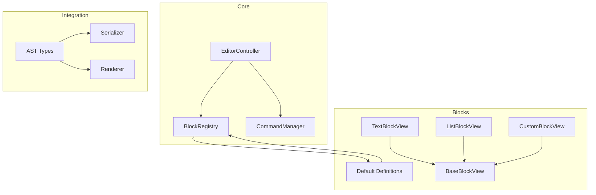
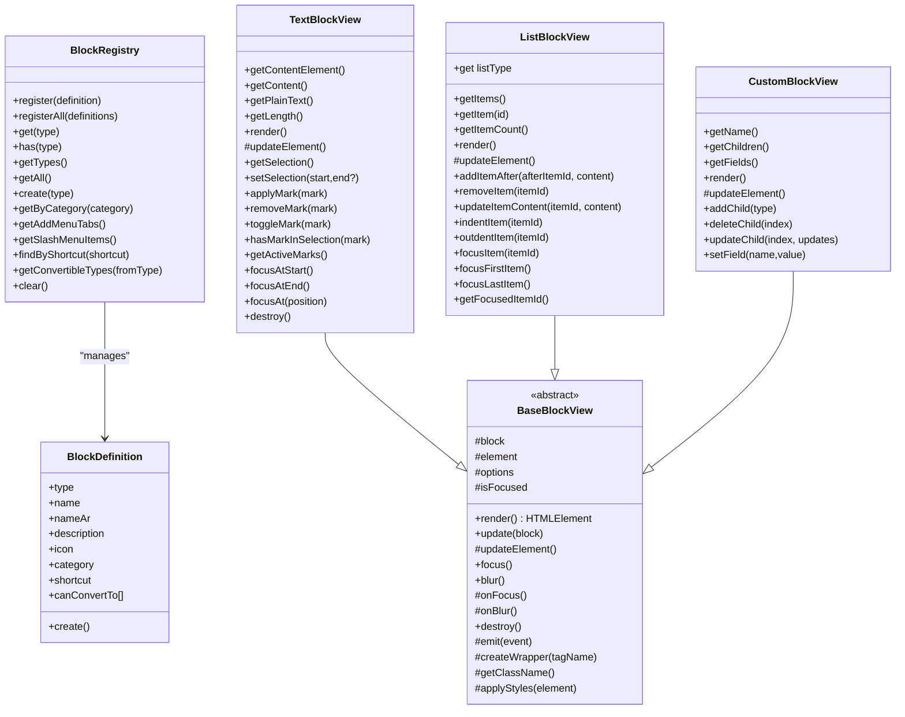
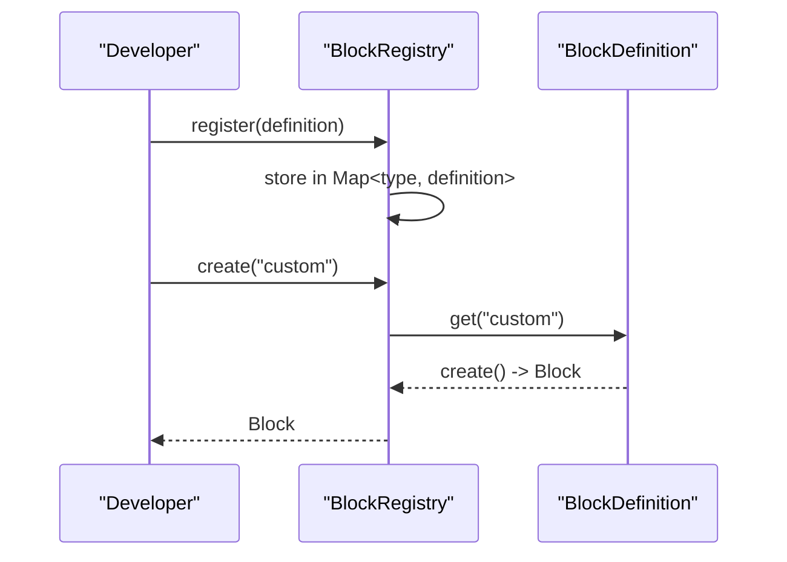
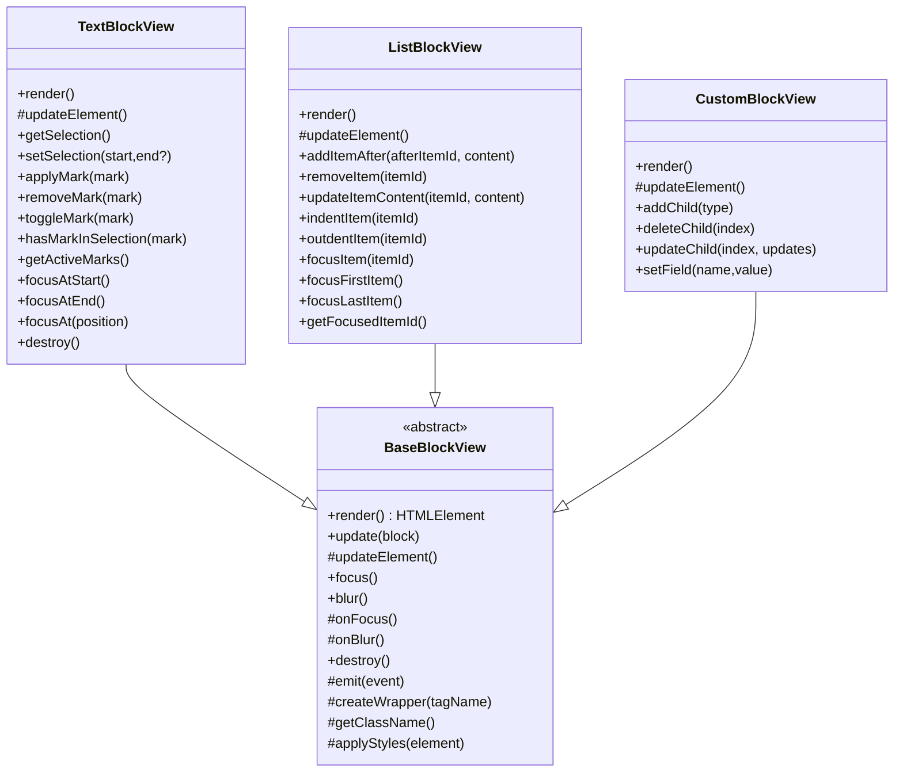
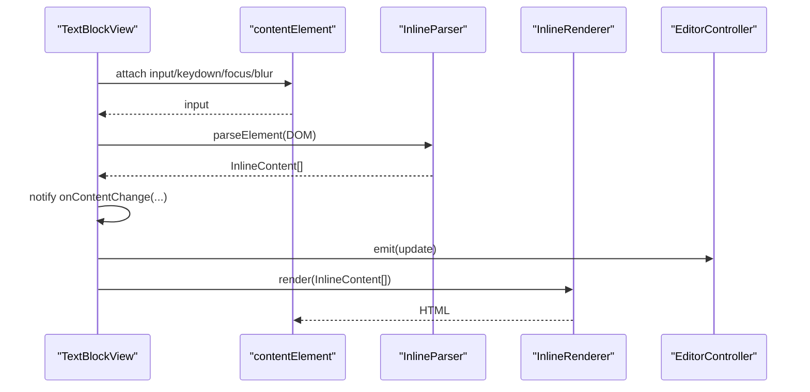
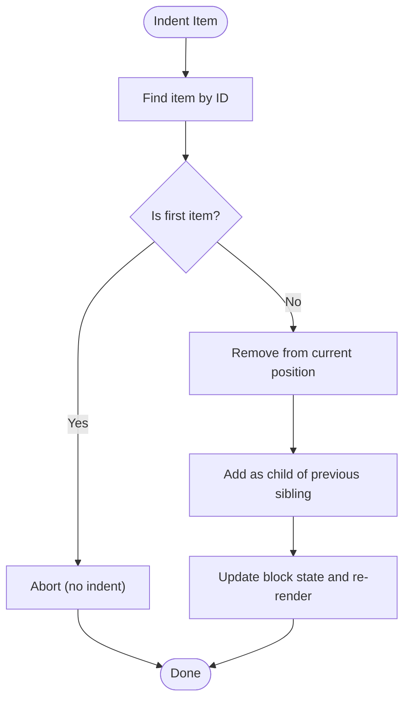
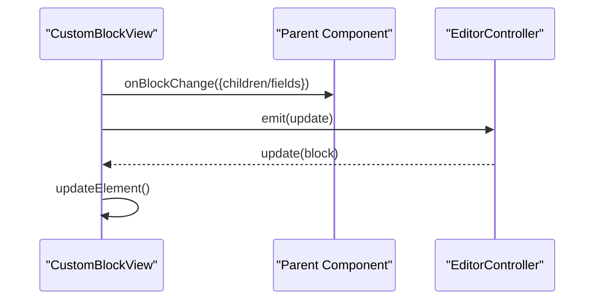
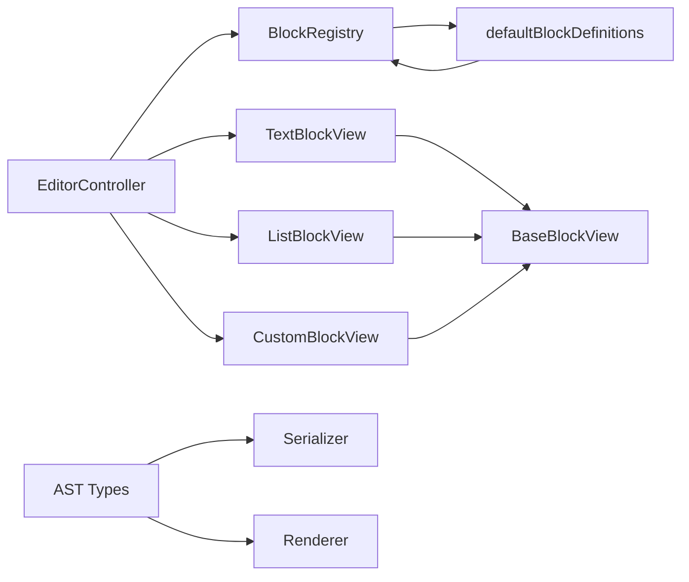

# Custom Block Development

<cite>
**Referenced Files in This Document**
- [BlockRegistry.ts](file://artoon-typer/src/core/BlockRegistry.ts)
- [definitions.ts](file://artoon-typer/src/blocks/definitions.ts)
- [BaseBlockView.ts](file://artoon-typer/src/blocks/views/BaseBlockView.ts)
- [CustomBlockView.ts](file://artoon-typer/src/blocks/views/CustomBlockView.ts)
- [TextBlockView.ts](file://artoon-typer/src/blocks/views/TextBlockView.ts)
- [ListBlockView.ts](file://artoon-typer/src/blocks/views/ListBlockView.ts)
- [types.ts](file://artoon-typer/src/types.ts)
- [index.ts](file://artoon-typer/src/core/index.ts)
</cite>

## Table of Contents
1. [Introduction](#introduction)
2. [Project Structure](#project-structure)
3. [Core Components](#core-components)
4. [Architecture Overview](#architecture-overview)
5. [Detailed Component Analysis](#detailed-component-analysis)
6. [Dependency Analysis](#dependency-analysis)
7. [Performance Considerations](#performance-considerations)
8. [Troubleshooting Guide](#troubleshooting-guide)
9. [Conclusion](#conclusion)
10. [Appendices](#appendices)

## Introduction
This document explains how to develop custom blocks in ARTOON 2.0. It covers the block registration system, the view component architecture, state management patterns, and integration with the AST and serializer. Practical examples demonstrate creating alert-like blocks, custom containers, and interactive components. Guidance is included for serialization, validation, performance, memory management, and debugging.

## Project Structure
ARToON 2.0 organizes block-related logic under the editor runtime module. Key areas:
- Core registry and orchestration: BlockRegistry, EditorController, CommandManager
- Block definitions: Built-in and extensible definitions
- View layer: BaseBlockView and specialized views (TextBlockView, ListBlockView, CustomBlockView)
- Types: Strongly typed block definitions, events, and editor state contracts
- Integration: Renderer and serializer modules consume the AST and editor state

**Diagram sources**
- [BlockRegistry.ts:19-147](file://artoon-typer/src/core/BlockRegistry.ts#L19-L147)
- [definitions.ts:539-581](file://artoon-typer/src/blocks/definitions.ts#L539-L581)
- [BaseBlockView.ts:27-204](file://artoon-typer/src/blocks/views/BaseBlockView.ts#L27-L204)
- [TextBlockView.ts:50-518](file://artoon-typer/src/blocks/views/TextBlockView.ts#L50-L518)
- [ListBlockView.ts:34-488](file://artoon-typer/src/blocks/views/ListBlockView.ts#L34-L488)
- [CustomBlockView.ts:24-278](file://artoon-typer/src/blocks/views/CustomBlockView.ts#L24-L278)
- [types.ts:468-488](file://artoon-typer/src/types.ts#L468-L488)

**Section sources**
- [index.ts:12-32](file://artoon-typer/src/core/index.ts#L12-L32)

## Core Components
- BlockRegistry: Central registry for block definitions, creation, and menu generation. Provides APIs to register, lookup, and enumerate block types, categories, and conversion targets.
- Block definitions: Typed factory functions that produce default blocks. They define metadata (name, icon, category, shortcut) and creation logic.
- BaseBlockView: Abstract base class for all block views. Handles DOM creation, focus/blur, event emission, and applying block metadata styles/data attributes.
- Specialized views: TextBlockView for inline content editing, ListBlockView for nested lists, and CustomBlockView for user-defined containers with dynamic children and fields.

**Section sources**
- [BlockRegistry.ts:19-147](file://artoon-typer/src/core/BlockRegistry.ts#L19-L147)
- [definitions.ts:539-581](file://artoon-typer/src/blocks/definitions.ts#L539-L581)
- [BaseBlockView.ts:27-204](file://artoon-typer/src/blocks/views/BaseBlockView.ts#L27-L204)
- [TextBlockView.ts:50-518](file://artoon-typer/src/blocks/views/TextBlockView.ts#L50-L518)
- [ListBlockView.ts:34-488](file://artoon-typer/src/blocks/views/ListBlockView.ts#L34-L488)
- [CustomBlockView.ts:24-278](file://artoon-typer/src/blocks/views/CustomBlockView.ts#L24-L278)

## Architecture Overview
The block system follows a layered pattern:
- Registry layer: Registers and resolves block definitions.
- Definition layer: Supplies default blocks and creation factories.
- View layer: Renders and edits block content via BaseBlockView and specialized views.
- Editor layer: Coordinates commands, selection, and state transitions.
- Integration layer: Serializer and renderer consume the AST and editor state.

**Diagram sources**
- [BlockRegistry.ts:19-147](file://artoon-typer/src/core/BlockRegistry.ts#L19-L147)
- [definitions.ts:539-581](file://artoon-typer/src/blocks/definitions.ts#L539-L581)
- [BaseBlockView.ts:27-204](file://artoon-typer/src/blocks/views/BaseBlockView.ts#L27-L204)
- [TextBlockView.ts:50-518](file://artoon-typer/src/blocks/views/TextBlockView.ts#L50-L518)
- [ListBlockView.ts:34-488](file://artoon-typer/src/blocks/views/ListBlockView.ts#L34-L488)
- [CustomBlockView.ts:24-278](file://artoon-typer/src/blocks/views/CustomBlockView.ts#L24-L278)

## Detailed Component Analysis

### Block Registration System
- Purpose: Centralize block type registration, retrieval, and menu generation.
- Key APIs:
  - register/ registerAll: Register new or multiple definitions.
  - get/ has/ getTypes/ getAll: Query definitions.
  - create: Instantiate a block from a type.
  - getCategory/getAddMenuTabs/getSlashMenuItems: Build UI menus.
  - findByShortcut: Resolve shortcuts to definitions.
  - getConvertibleTypes/clear: Manage conversions and lifecycle.

**Diagram sources**
- [BlockRegistry.ts:25-78](file://artoon-typer/src/core/BlockRegistry.ts#L25-L78)
- [definitions.ts:501-516](file://artoon-typer/src/blocks/definitions.ts#L501-L516)

**Section sources**
- [BlockRegistry.ts:19-147](file://artoon-typer/src/core/BlockRegistry.ts#L19-L147)
- [definitions.ts:539-581](file://artoon-typer/src/blocks/definitions.ts#L539-L581)

### BaseBlockView and Inheritance Patterns
- Responsibilities:
  - DOM lifecycle: createWrapper, render, updateElement, destroy.
  - Focus management: focus/blur with CSS classes and optional hooks.
  - Event emission: emit(BlockEvent) to notify editor/controller.
  - Style/data application: applyStyles from block meta.
- Inheritance pattern:
  - Specialized views override render/updateElement and implement domain-specific behaviors (inline editing, list operations, custom children).

**Diagram sources**
- [BaseBlockView.ts:27-204](file://artoon-typer/src/blocks/views/BaseBlockView.ts#L27-L204)
- [TextBlockView.ts:50-518](file://artoon-typer/src/blocks/views/TextBlockView.ts#L50-L518)
- [ListBlockView.ts:34-488](file://artoon-typer/src/blocks/views/ListBlockView.ts#L34-L488)
- [CustomBlockView.ts:24-278](file://artoon-typer/src/blocks/views/CustomBlockView.ts#L24-L278)

**Section sources**
- [BaseBlockView.ts:27-204](file://artoon-typer/src/blocks/views/BaseBlockView.ts#L27-L204)

### TextBlockView: Inline Editing and Selection
- Features:
  - contentEditable wrapper per text block type.
  - InlineRenderer/InlineParser bridge to convert DOM to/from AST InlineContent.
  - MarkManager for formatting toggles (bold, italic, underline, etc.).
  - Selection tracking and conversion between DOM offsets and inline content positions.
  - Keyboard handling for Enter/backspace/delete and formatting shortcuts.
- Lifecycle:
  - render creates wrapper and content element, attaches events.
  - updateElement refreshes content and direction.
  - destroy detaches global selection listener.

**Diagram sources**
- [TextBlockView.ts:158-282](file://artoon-typer/src/blocks/views/TextBlockView.ts#L158-L282)
- [TextBlockView.ts:458-466](file://artoon-typer/src/blocks/views/TextBlockView.ts#L458-L466)

**Section sources**
- [TextBlockView.ts:50-518](file://artoon-typer/src/blocks/views/TextBlockView.ts#L50-L518)

### ListBlockView: Nested Lists and Item Ops
- Features:
  - Renders nested lists with proper tags and classes.
  - Handles item addition, removal, indentation, and outdentation.
  - Maintains focused item state and supports programmatic focus.
  - Parses inline content per item and notifies changes.
- Algorithms:
  - Indent/outdent restructures items and children.
  - Search helpers traverse nested item trees.

**Diagram sources**
- [ListBlockView.ts:334-395](file://artoon-typer/src/blocks/views/ListBlockView.ts#L334-L395)

**Section sources**
- [ListBlockView.ts:34-488](file://artoon-typer/src/blocks/views/ListBlockView.ts#L34-L488)

### CustomBlockView: Custom Containers and Fields
- Features:
  - Renders a customizable container with a name, children, and fields.
  - Supports read-only mode with static display vs. editable inputs.
  - Adds/removes children, updates child content/type, sets fields.
  - Emits update events and notifies parent via onBlockChange.
- Interaction:
  - Name input, child type selectors, content inputs, delete buttons.
  - Focus handling to move focus to first input on focus.

**Diagram sources**
- [CustomBlockView.ts:250-260](file://artoon-typer/src/blocks/views/CustomBlockView.ts#L250-L260)

**Section sources**
- [CustomBlockView.ts:24-278](file://artoon-typer/src/blocks/views/CustomBlockView.ts#L24-L278)

### Block Lifecycle Management, Events, and Data Binding
- Lifecycle:
  - Creation: BlockRegistry.create(type) invokes definition.create().
  - Rendering: Views render DOM, attach events, and apply styles.
  - Updates: Views call updateElement and re-render content.
  - Destruction: Views remove DOM nodes and detach listeners.
- Events:
  - BlockEvent types: add, remove, update, move, focus.
  - Emission: Views emit via emit(event) to notify controller/editor.
- Data binding:
  - TextBlockView: inline content ↔ DOM via InlineRenderer/Parser.
  - ListBlockView: item content ↔ DOM via InlineRenderer/Parser.
  - CustomBlockView: fields/children ↔ DOM via inputs and mutation.

**Section sources**
- [BlockRegistry.ts:72-78](file://artoon-typer/src/core/BlockRegistry.ts#L72-L78)
- [BaseBlockView.ts:135-139](file://artoon-typer/src/blocks/views/BaseBlockView.ts#L135-L139)
- [TextBlockView.ts:189-194](file://artoon-typer/src/blocks/views/TextBlockView.ts#L189-L194)
- [ListBlockView.ts:183-187](file://artoon-typer/src/blocks/views/ListBlockView.ts#L183-L187)
- [CustomBlockView.ts:250-260](file://artoon-typer/src/blocks/views/CustomBlockView.ts#L250-L260)

### Serialization, Validation, and AST Integration
- AST integration:
  - Inline content uses AST InlineContent[] for compatibility.
  - Block types align with AST node semantics.
- Serialization:
  - Serializer consumes editor state and produces output formats.
  - AST serializer validates and transforms nodes consistently.
- Validation:
  - Validator enforces structural and semantic rules.
  - Editor state and commands coordinate validation feedback.

**Section sources**
- [types.ts:10-18](file://artoon-typer/src/types.ts#L10-L18)
- [types.ts:85-88](file://artoon-typer/src/types.ts#L85-L88)

### Practical Examples

#### Example 1: Creating an Alert Block
- Define a new block type with a BlockDefinition:
  - type, name, icon, category, shortcut (optional), and create() returning a block object.
- Implement a view extending BaseBlockView:
  - render creates a styled wrapper and inner content.
  - updateElement syncs direction and content.
  - Optional: add emit(update) on user actions.
- Register the definition:
  - Use getDefaultRegistry().register(definition) or pass customBlocks in editor config.

**Section sources**
- [BlockRegistry.ts:25-39](file://artoon-typer/src/core/BlockRegistry.ts#L25-L39)
- [definitions.ts:501-516](file://artoon-typer/src/blocks/definitions.ts#L501-L516)
- [BaseBlockView.ts:69-84](file://artoon-typer/src/blocks/views/BaseBlockView.ts#L69-L84)

#### Example 2: Building a Custom Container (CustomBlockView)
- Extend CustomBlockView for dynamic children and fields:
  - addChild/deleteChild/updateChild for content management.
  - setField for metadata-like storage.
  - onBlockChange to propagate updates to the editor state.
- Styling and interactivity:
  - Use applyStyles to apply block meta styles/data.
  - Implement onFocus to focus first input.

**Section sources**
- [CustomBlockView.ts:24-278](file://artoon-typer/src/blocks/views/CustomBlockView.ts#L24-L278)
- [BaseBlockView.ts:191-203](file://artoon-typer/src/blocks/views/BaseBlockView.ts#L191-L203)

#### Example 3: Interactive Component (TextBlockView)
- Use TextBlockView for inline editing with formatting:
  - applyMark/removeMark/toggleMark for quick formatting.
  - getActiveMarks and selection helpers for toolbar state.
- Integrate with editor commands for undo/redo and navigation.

**Section sources**
- [TextBlockView.ts:393-430](file://artoon-typer/src/blocks/views/TextBlockView.ts#L393-L430)
- [TextBlockView.ts:448-453](file://artoon-typer/src/blocks/views/TextBlockView.ts#L448-L453)

## Dependency Analysis
- Registry-to-definitions: getDefaultRegistry auto-registers defaultBlockDefinitions.
- Views-to-base: All views inherit from BaseBlockView and override lifecycle hooks.
- Editor-to-registry: EditorController coordinates block creation and updates via registry.
- Integration: AST types unify inline content; serializer/renderer consume editor state.

**Diagram sources**
- [BlockRegistry.ts:159-166](file://artoon-typer/src/core/BlockRegistry.ts#L159-L166)
- [definitions.ts:539-581](file://artoon-typer/src/blocks/definitions.ts#L539-L581)
- [BaseBlockView.ts:27-204](file://artoon-typer/src/blocks/views/BaseBlockView.ts#L27-L204)
- [TextBlockView.ts:50-518](file://artoon-typer/src/blocks/views/TextBlockView.ts#L50-L518)
- [ListBlockView.ts:34-488](file://artoon-typer/src/blocks/views/ListBlockView.ts#L34-L488)
- [CustomBlockView.ts:24-278](file://artoon-typer/src/blocks/views/CustomBlockView.ts#L24-L278)

**Section sources**
- [index.ts:12-32](file://artoon-typer/src/core/index.ts#L12-L32)

## Performance Considerations
- Minimize DOM updates:
  - Prefer targeted updateElement over full re-render where possible.
  - Batch view updates during complex operations (e.g., list indent/outdent).
- Efficient parsing:
  - Use InlineParser with mergeAdjacent to reduce DOM churn.
- Memory management:
  - Always call destroy on views to detach listeners and remove nodes.
  - Avoid retaining references to removed DOM nodes.
- Rendering:
  - Defer heavy computations until after input composition ends (isComposing guard in TextBlockView).
- Caching:
  - Cache computed selections and lengths when repeatedly accessed.

[No sources needed since this section provides general guidance]

## Troubleshooting Guide
- Unknown block type:
  - Symptom: Error when calling create(type).
  - Fix: Ensure the definition is registered via getDefaultRegistry().register(...) or included in customBlocks.
- Events not firing:
  - Verify onEvent handlers are passed to BaseBlockView options and emit is called in views.
- Inline formatting not applied:
  - Confirm selection offsets and InlineRenderer/Parser are used consistently.
- List indentation fails:
  - Check item IDs and ensure parent-child relationships are valid before indent/outdent.
- Styles not applied:
  - Ensure block.meta.style/data are present and applyStyles is invoked.

**Section sources**
- [BlockRegistry.ts:74-77](file://artoon-typer/src/core/BlockRegistry.ts#L74-L77)
- [BaseBlockView.ts:135-139](file://artoon-typer/src/blocks/views/BaseBlockView.ts#L135-L139)
- [TextBlockView.ts:178-194](file://artoon-typer/src/blocks/views/TextBlockView.ts#L178-L194)
- [ListBlockView.ts:334-395](file://artoon-typer/src/blocks/views/ListBlockView.ts#L334-L395)
- [BaseBlockView.ts:191-203](file://artoon-typer/src/blocks/views/BaseBlockView.ts#L191-L203)

## Conclusion
ARToON 2.0’s block system provides a robust foundation for extensibility. The BlockRegistry centralizes definitions, BaseBlockView standardizes view lifecycle, and specialized views encapsulate domain logic. By following the patterns documented here—registering definitions, inheriting from BaseBlockView, managing events and updates—you can build reliable custom blocks integrated with the AST, serializer, and editor state.

[No sources needed since this section summarizes without analyzing specific files]

## Appendices

### API Reference: BlockRegistry
- register/ registerAll: Register definitions.
- get/ has/ getTypes/ getAll: Query definitions.
- create: Instantiate a block by type.
- getCategory/getAddMenuTabs/getSlashMenuItems: Build UI menus.
- findByShortcut: Resolve shortcuts.
- getConvertibleTypes/clear: Manage conversions and lifecycle.

**Section sources**
- [BlockRegistry.ts:25-147](file://artoon-typer/src/core/BlockRegistry.ts#L25-L147)

### API Reference: BaseBlockView
- render/updateElement: DOM lifecycle.
- focus/blur/onFocus/onBlur: Focus management.
- emit: Event emission.
- createWrapper/getClassName/applyStyles: DOM and styling helpers.

**Section sources**
- [BaseBlockView.ts:69-204](file://artoon-typer/src/blocks/views/BaseBlockView.ts#L69-L204)

### Types Overview
- BlockType: Enumerated block identifiers.
- Block: Union of all block shapes.
- BlockDefinition: Factory and metadata for block creation.
- BlockEvent: Standardized event contract.

**Section sources**
- [types.ts:27-67](file://artoon-typer/src/types.ts#L27-L67)
- [types.ts:366-386](file://artoon-typer/src/types.ts#L366-L386)
- [types.ts:468-488](file://artoon-typer/src/types.ts#L468-L488)
- [types.ts:607-613](file://artoon-typer/src/types.ts#L607-L613)