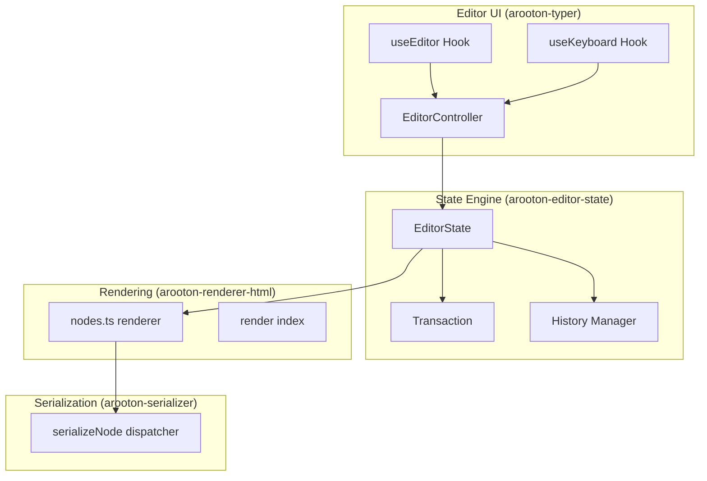
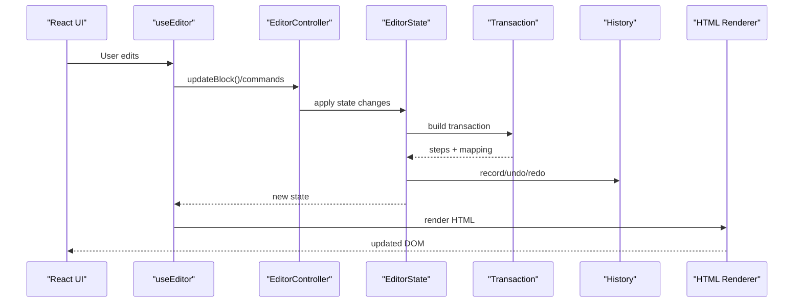
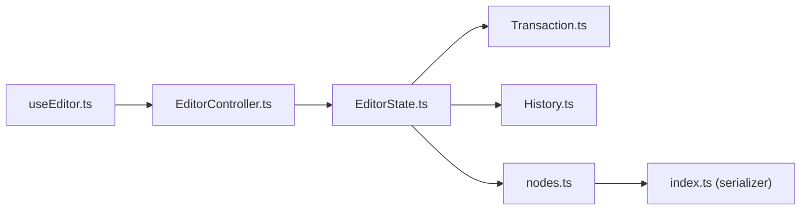

# Performance Optimization and Scalability

<cite>
**Referenced Files in This Document**
- [EditorController.ts](file://artoon-typer/src/core/EditorController.ts)
- [useEditor.ts](file://artoon-typer/src/ui/hooks/useEditor.ts)
- [useKeyboard.ts](file://artoon-typer/src/ui/hooks/useKeyboard.ts)
- [EditorState.ts](file://artoon-editor-state/src/state/EditorState.ts)
- [Transaction.ts](file://artoon-editor-state/src/transaction/Transaction.ts)
- [History.ts](file://artoon-editor-state/src/history/History.ts)
- [nodes.ts](file://artoon-renderer-html/src/render/nodes.ts)
- [index.ts](file://artoon-renderer-html/src/render/index.ts)
- [index.ts](file://artoon-serializer/src/nodes/index.ts)
- [PROFESSIONAL-ANALYSIS-AR.md](file://artoon-typer/PROFESSIONAL-ANALYSIS-AR.md)
- [01-state-management-analysis.md](file://artoon-editor-state/artoon-editor-dev/01-state-management-analysis.md)
- [02-transaction-update.md](file://artoon-editor-state/artoon-editor-dev/02-transaction-update.md)
- [EditorController.advanced.test.ts](file://artoon-typer/tests/core/EditorController.advanced.test.ts)
- [CommandManager.advanced.test.ts](file://artoon-typer/tests/core/CommandManager.advanced.test.ts)
</cite>

## Table of Contents
1. [Introduction](#introduction)
2. [Project Structure](#project-structure)
3. [Core Components](#core-components)
4. [Architecture Overview](#architecture-overview)
5. [Detailed Component Analysis](#detailed-component-analysis)
6. [Dependency Analysis](#dependency-analysis)
7. [Performance Considerations](#performance-considerations)
8. [Troubleshooting Guide](#troubleshooting-guide)
9. [Conclusion](#conclusion)
10. [Appendices](#appendices)

## Introduction
This document provides a comprehensive guide to performance optimization and scalability for ARTOON 2.0. It focuses on memory management, garbage collection optimization, efficient data structures for large documents, the EditorController architecture, state update optimization, rendering performance tuning, lazy loading, virtual scrolling, efficient AST traversal, serialization performance, HTML rendering batching, caching strategies, profiling and bottleneck identification, and scalability patterns for large documents and concurrent editing.

## Project Structure
AROON 2.0 is organized into modular packages:
- artoon-typer: React-based editor UI and orchestration (EditorController, hooks, managers)
- artoon-editor-state: Immutable editor state, transactions, history, and selection
- artoon-parser: ARTOON syntax parsing into AST
- artoon-ast: AST types and utilities
- artoon-renderer-html: HTML rendering pipeline
- artoon-serializer: Serialization back to ARTOON text
- artoon-validator: Validation rules
- artoon-cli: Command-line utilities

**Diagram sources**
- [EditorController.ts:27-475](file://artoon-typer/src/core/EditorController.ts#L27-L475)
- [useEditor.ts:170-996](file://artoon-typer/src/ui/hooks/useEditor.ts#L170-L996)
- [useKeyboard.ts:49-105](file://artoon-typer/src/ui/hooks/useKeyboard.ts#L49-L105)
- [EditorState.ts:26-258](file://artoon-editor-state/src/state/EditorState.ts#L26-L258)
- [Transaction.ts:17-348](file://artoon-editor-state/src/transaction/Transaction.ts#L17-L348)
- [History.ts:86-205](file://artoon-editor-state/src/history/History.ts#L86-L205)
- [nodes.ts:37-755](file://artoon-renderer-html/src/render/nodes.ts#L37-L755)
- [index.ts:1-5](file://artoon-renderer-html/src/render/index.ts#L1-L5)
- [index.ts:32-91](file://artoon-serializer/src/nodes/index.ts#L32-L91)

**Section sources**
- [EditorController.ts:27-475](file://artoon-typer/src/core/EditorController.ts#L27-L475)
- [useEditor.ts:170-996](file://artoon-typer/src/ui/hooks/useEditor.ts#L170-L996)
- [EditorState.ts:26-258](file://artoon-editor-state/src/state/EditorState.ts#L26-L258)
- [Transaction.ts:17-348](file://artoon-editor-state/src/transaction/Transaction.ts#L17-L348)
- [History.ts:86-205](file://artoon-editor-state/src/history/History.ts#L86-L205)
- [nodes.ts:37-755](file://artoon-renderer-html/src/render/nodes.ts#L37-L755)
- [index.ts:1-5](file://artoon-renderer-html/src/render/index.ts#L1-L5)
- [index.ts:32-91](file://artoon-serializer/src/nodes/index.ts#L32-L91)

## Core Components
- EditorController orchestrates block lifecycle, selection, and integrates with state adapters and importers/exporters.
- useEditor provides a React-friendly API, synchronizes state, and triggers onChange callbacks.
- EditorState manages immutable document state, selection, plugins, and history.
- Transaction encapsulates document edits as steps with mapping and metadata.
- History groups and trims undo stacks to limit memory growth.
- Renderer converts AST nodes to HTML with batching and indentation options.
- Serializer dispatches node types to specialized serializers.

Key performance-sensitive areas:
- State synchronization and re-rendering in useEditor
- Immutable updates and copy-on-write semantics
- History depth and grouping
- Renderer batching and virtualization readiness

**Section sources**
- [EditorController.ts:27-475](file://artoon-typer/src/core/EditorController.ts#L27-L475)
- [useEditor.ts:242-263](file://artoon-typer/src/ui/hooks/useEditor.ts#L242-L263)
- [EditorState.ts:116-211](file://artoon-editor-state/src/state/EditorState.ts#L116-L211)
- [Transaction.ts:60-89](file://artoon-editor-state/src/transaction/Transaction.ts#L60-L89)
- [History.ts:106-148](file://artoon-editor-state/src/history/History.ts#L106-L148)
- [nodes.ts:37-755](file://artoon-renderer-html/src/render/nodes.ts#L37-L755)
- [index.ts:32-91](file://artoon-serializer/src/nodes/index.ts#L32-L91)

## Architecture Overview
The editor follows a layered architecture with clear separation between UI hooks, orchestration (EditorController), state management (EditorState), and rendering/serialization.

**Diagram sources**
- [useEditor.ts:327-338](file://artoon-typer/src/ui/hooks/useEditor.ts#L327-L338)
- [EditorController.ts:161-170](file://artoon-typer/src/core/EditorController.ts#L161-L170)
- [EditorState.ts:116-211](file://artoon-editor-state/src/state/EditorState.ts#L116-L211)
- [Transaction.ts:60-89](file://artoon-editor-state/src/transaction/Transaction.ts#L60-L89)
- [History.ts:106-148](file://artoon-editor-state/src/history/History.ts#L106-L148)
- [nodes.ts:37-755](file://artoon-renderer-html/src/render/nodes.ts#L37-L755)

## Detailed Component Analysis

### EditorController Architecture and Memory Management
- Maintains an in-memory blocks array and emits events on mutations.
- Uses deepClone for safe reads to avoid accidental mutation.
- Ensures at least one block remains after removals.
- Integrates with StateAdapter for undo/redo and onChange callbacks.

Optimization opportunities:
- Replace deepClone with immutable snapshots for reads.
- Use WeakRefs for DOM refs to aid GC.
- Debounce rapid updates to coalesce changes.

**Section sources**
- [EditorController.ts:88-170](file://artoon-typer/src/core/EditorController.ts#L88-L170)
- [EditorController.ts:136-156](file://artoon-typer/src/core/EditorController.ts#L136-L156)
- [EditorController.ts:419-422](file://artoon-typer/src/core/EditorController.ts#L419-L422)

### State Update Optimization and Immutable Updates
- EditorState.apply filters transactions via plugins, maps selections, and records history.
- Transactions accumulate steps and maintain docs history for rollback.
- History groups recent changes and trims to configured depth.

Recommendations:
- Enforce readonly arrays from AST upstream to eliminate defensive copies.
- Use structural sharing and memoization for derived state.
- Batch plugin state updates to reduce churn.

**Section sources**
- [EditorState.ts:116-211](file://artoon-editor-state/src/state/EditorState.ts#L116-L211)
- [Transaction.ts:60-89](file://artoon-editor-state/src/transaction/Transaction.ts#L60-L89)
- [History.ts:106-148](file://artoon-editor-state/src/history/History.ts#L106-L148)

### Rendering Performance Tuning
- Renderer supports indentation and direction attributes, with dedicated handlers per node type.
- Inline content rendering composes modifiers and wraps content efficiently.

Optimization strategies:
- Implement virtual scrolling for long block lists.
- Use React.memo and shallow comparisons for block wrappers.
- Batch DOM writes and minimize reflows.

**Section sources**
- [nodes.ts:37-755](file://artoon-renderer-html/src/render/nodes.ts#L37-L755)
- [index.ts:1-5](file://artoon-renderer-html/src/render/index.ts#L1-L5)

### Serialization Performance Optimization
- Serializer dispatches to specialized serializers by node type.
- Avoids repeated string concatenations by composing fragments.

Recommendations:
- Stream large outputs to avoid memory spikes.
- Cache computed node templates when stable.

**Section sources**
- [index.ts:32-91](file://artoon-serializer/src/nodes/index.ts#L32-L91)

### Lazy Loading and Virtual Scrolling
- Current implementation synchronously renders all blocks.
- Recommended: Introduce virtualization for large documents.

Implementation outline:
- Track visible viewport indices.
- Render only visible blocks plus overscan.
- Defer heavy block rendering until scrolled into view.

[No sources needed since this section provides conceptual guidance]

### Efficient AST Traversal Algorithms
- Transactions resolve positions and apply steps with mapping.
- History maintains inverse steps for fast undo/redo.

Recommendations:
- Use breadth-first traversal for large nested structures.
- Cache resolved positions and node boundaries.

**Section sources**
- [Transaction.ts:100-217](file://artoon-editor-state/src/transaction/Transaction.ts#L100-L217)
- [History.ts:153-180](file://artoon-editor-state/src/history/History.ts#L153-L180)

### HTML Rendering Batching and Caching Strategies
- Renderer batches child nodes and applies modifiers in order.
- Consider caching tag/class generation for repeated nodes.

Recommendations:
- Use a small template cache keyed by node attributes.
- Batch DOM updates using requestAnimationFrame.

**Section sources**
- [nodes.ts:37-755](file://artoon-renderer-html/src/render/nodes.ts#L37-L755)

### Profiling Techniques and Bottleneck Identification
- useEditor logs sync cycles and export lengths.
- Tests simulate rapid updates and large histories.

Practical checks:
- Measure re-render time per block update.
- Profile memory growth during undo/redo.
- Identify hotspots in renderer and serializer.

**Section sources**
- [useEditor.ts:242-263](file://artoon-typer/src/ui/hooks/useEditor.ts#L242-L263)
- [EditorController.advanced.test.ts:185-193](file://artoon-typer/tests/core/EditorController.advanced.test.ts#L185-L193)
- [CommandManager.advanced.test.ts:362-385](file://artoon-typer/tests/core/CommandManager.advanced.test.ts#L362-L385)

### Scalability Patterns for Large Documents and Concurrent Editing
- Immutable updates and transactional history scale better than imperative edits.
- History grouping reduces memory footprint for frequent edits.
- Consider splitting documents into chunks and virtualizing content.

[No sources needed since this section provides conceptual guidance]

### Browser Performance Considerations and Mobile Optimization
- Prefer passive event listeners and throttled handlers.
- Optimize layout thrashing by batching DOM reads/writes.
- Use CSS containment for block wrappers on mobile.

[No sources needed since this section provides conceptual guidance]

## Dependency Analysis
The editor’s performance depends on tight coupling between UI hooks, EditorController, EditorState, and rendering/serialization modules. Loose coupling via interfaces and adapters enables testing and potential parallelization.

**Diagram sources**
- [useEditor.ts:170-996](file://artoon-typer/src/ui/hooks/useEditor.ts#L170-L996)
- [EditorController.ts:27-475](file://artoon-typer/src/core/EditorController.ts#L27-L475)
- [EditorState.ts:26-258](file://artoon-editor-state/src/state/EditorState.ts#L26-L258)
- [Transaction.ts:17-348](file://artoon-editor-state/src/transaction/Transaction.ts#L17-L348)
- [History.ts:86-205](file://artoon-editor-state/src/history/History.ts#L86-L205)
- [nodes.ts:37-755](file://artoon-renderer-html/src/render/nodes.ts#L37-L755)
- [index.ts:32-91](file://artoon-serializer/src/nodes/index.ts#L32-L91)

**Section sources**
- [useEditor.ts:170-996](file://artoon-typer/src/ui/hooks/useEditor.ts#L170-L996)
- [EditorController.ts:27-475](file://artoon-typer/src/core/EditorController.ts#L27-L475)
- [EditorState.ts:26-258](file://artoon-editor-state/src/state/EditorState.ts#L26-L258)
- [Transaction.ts:17-348](file://artoon-editor-state/src/transaction/Transaction.ts#L17-L348)
- [History.ts:86-205](file://artoon-editor-state/src/history/History.ts#L86-L205)
- [nodes.ts:37-755](file://artoon-renderer-html/src/render/nodes.ts#L37-L755)
- [index.ts:32-91](file://artoon-serializer/src/nodes/index.ts#L32-L91)

## Performance Considerations
- Prefer immutable data structures and structural sharing.
- Coalesce frequent updates into transactions and debounce UI events.
- Use virtualization for long lists and defer heavy rendering.
- Cache rendered templates and serialized fragments.
- Monitor memory growth and trim history depth.

[No sources needed since this section provides general guidance]

## Troubleshooting Guide
Common issues and remedies:
- Excessive re-renders: Wrap block components with React.memo and compare identity.
- Memory leaks: Ensure event listeners are cleaned up and DOM refs are not retained unnecessarily.
- Slow undo/redo: Reduce history depth and rely on grouping to merge micro-changes.
- Large document slowness: Implement virtual scrolling and lazy rendering.

**Section sources**
- [PROFESSIONAL-ANALYSIS-AR.md:186-231](file://artoon-typer/PROFESSIONAL-ANALYSIS-AR.md#L186-L231)
- [PROFESSIONAL-ANALYSIS-AR.md:532-578](file://artoon-typer/PROFESSIONAL-ANALYSIS-AR.md#L532-L578)
- [History.ts:140-148](file://artoon-editor-state/src/history/History.ts#L140-L148)

## Conclusion
AROON 2.0’s architecture supports strong immutability and modular rendering. To achieve optimal performance at scale, adopt virtualization, batching, and caching strategies; enforce immutable updates; and monitor memory and rendering costs. The outlined patterns and tests provide a foundation for measurable improvements.

[No sources needed since this section summarizes without analyzing specific files]

## Appendices

### Appendix A: Immutable Update Guidance
- Align AST upstream to readonly arrays and propagate immutability.
- Replace mutations with copy-on-write patterns in transactions.
- Use readonly types for inline content and content arrays.

**Section sources**
- [01-state-management-analysis.md:22-28](file://artoon-editor-state/artoon-editor-dev/01-state-management-analysis.md#L22-L28)
- [02-transaction-update.md:24-28](file://artoon-editor-state/artoon-editor-dev/02-transaction-update.md#L24-L28)

### Appendix B: UI Hooks and Controller Integration
- useEditor syncs state and triggers onChange; ensure minimal re-renders.
- EditorController emits events; subscribe selectively to avoid unnecessary updates.

**Section sources**
- [useEditor.ts:242-263](file://artoon-typer/src/ui/hooks/useEditor.ts#L242-L263)
- [EditorController.ts:439-441](file://artoon-typer/src/core/EditorController.ts#L439-L441)