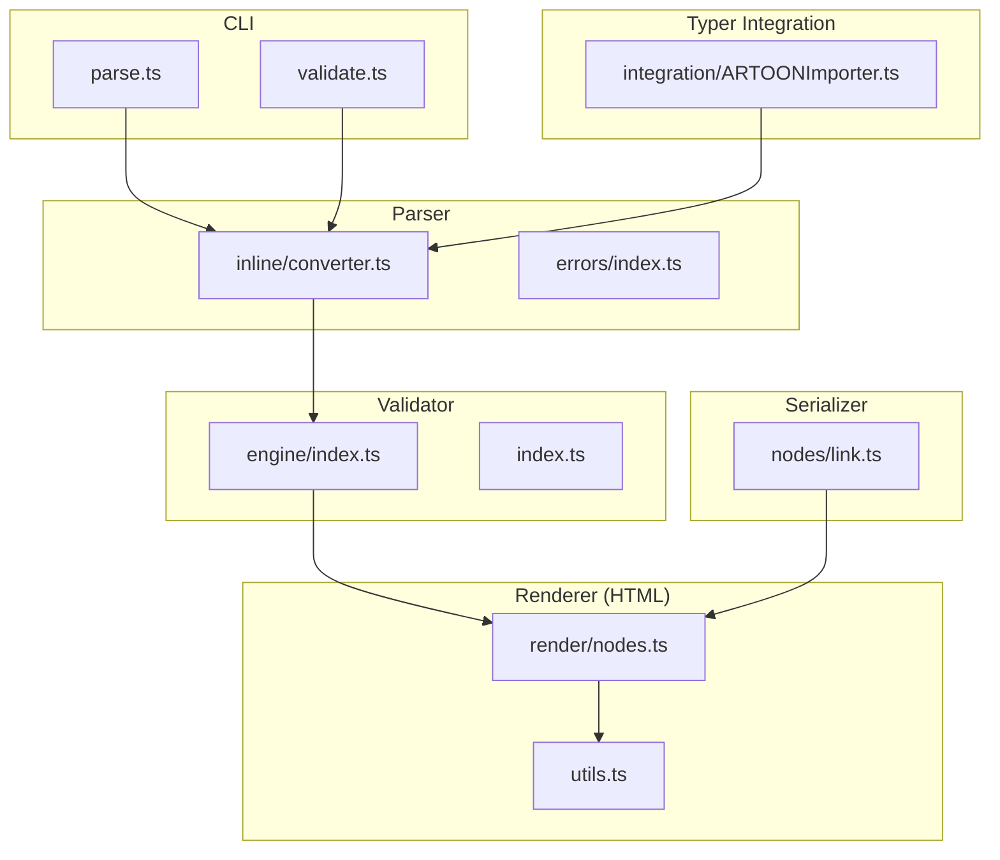
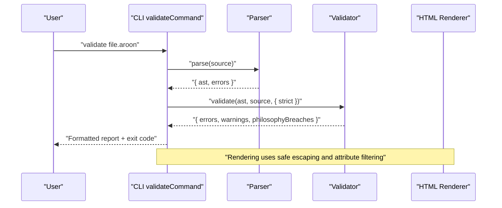
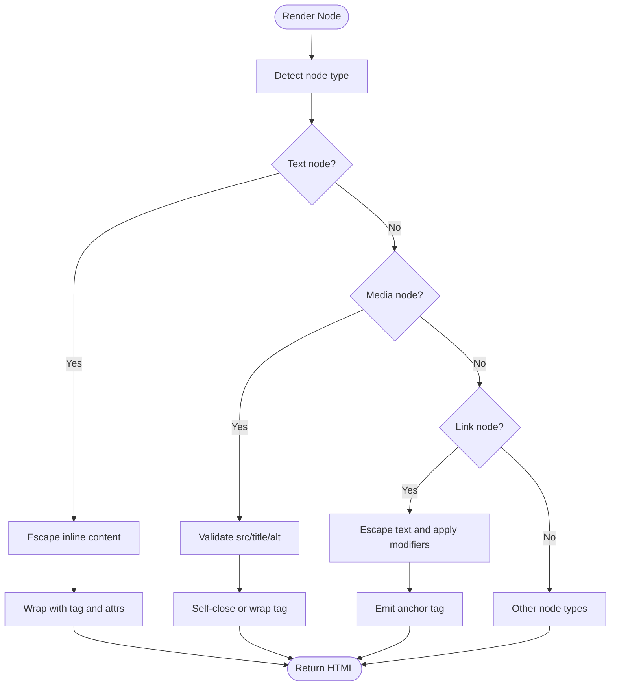
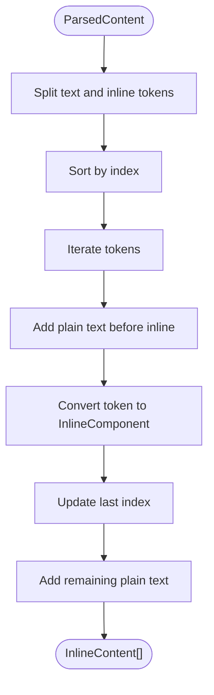
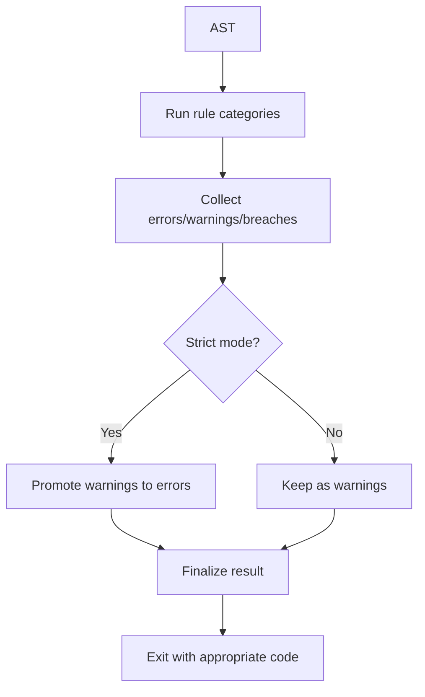
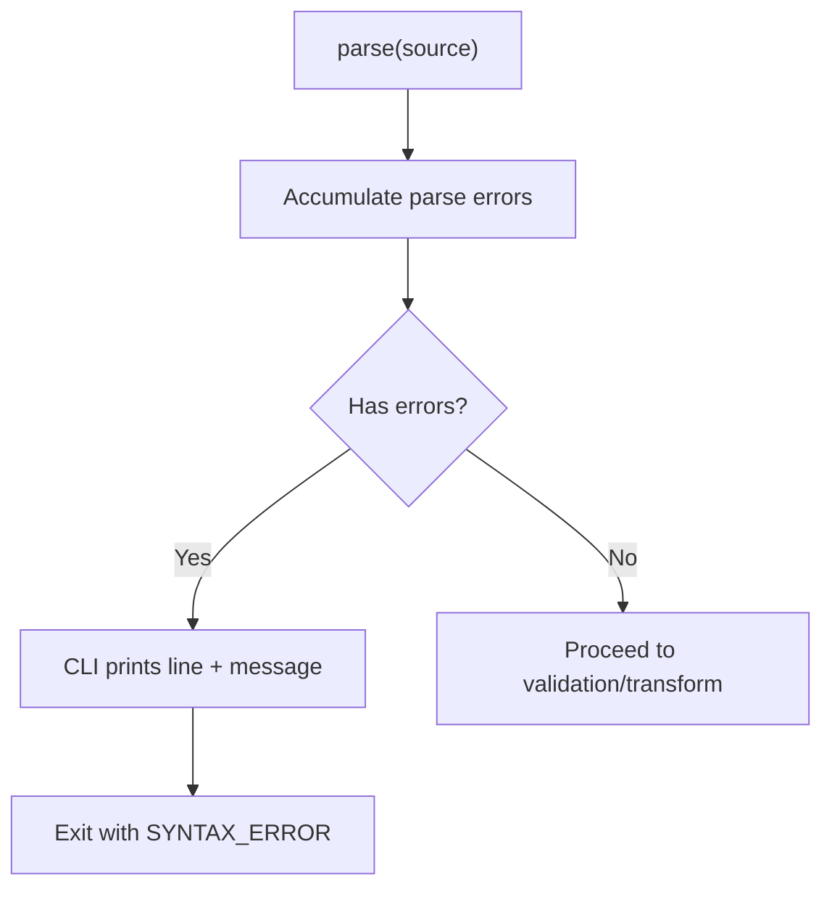
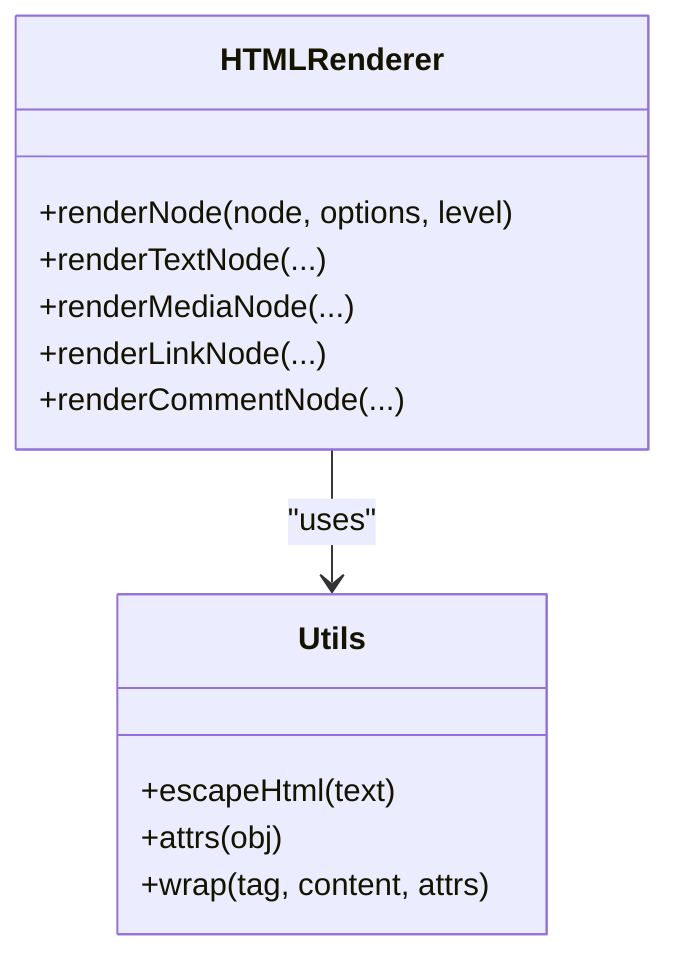
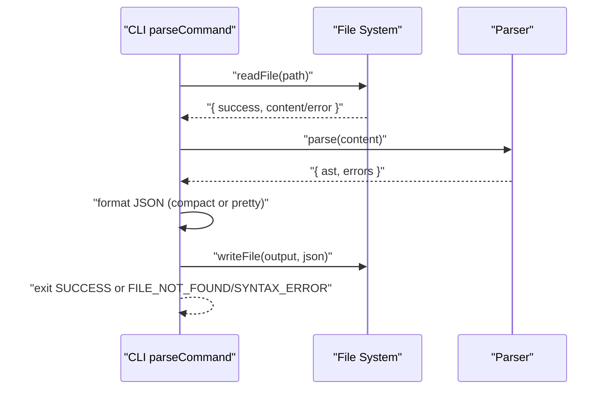
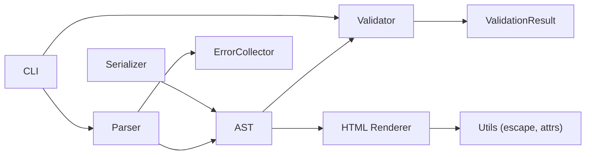

# Security and Safe Content Processing

<cite>
**Referenced Files in This Document**
- [artoon-renderer-html/src/render/nodes.ts](file://artoon-renderer-html/src/render/nodes.ts)
- [artoon-renderer-html/src/utils.ts](file://artoon-renderer-html/src/utils.ts)
- [artoon-parser/src/inline/converter.ts](file://artoon-parser/src/inline/converter.ts)
- [artoon-parser/src/errors/index.ts](file://artoon-parser/src/errors/index.ts)
- [artoon-validator/src/engine/index.ts](file://artoon-validator/src/engine/index.ts)
- [artoon-validator/src/index.ts](file://artoon-validator/src/index.ts)
- [artoon-cli/src/commands/parse.ts](file://artoon-cli/src/commands/parse.ts)
- [artoon-cli/src/commands/validate.ts](file://artoon-cli/src/commands/validate.ts)
- [artoon-serializer/src/nodes/link.ts](file://artoon-serializer/src/nodes/link.ts)
- [artoon-typer/src/integration/ARTOONImporter.ts](file://artoon-typer/src/integration/ARTOONImporter.ts)
- [artoon-typer/PROFESSIONAL-ANALYSIS-AR.md](file://artoon-typer/PROFESSIONAL-ANALYSIS-AR.md)
</cite>

## Table of Contents
1. [Introduction](#introduction)
2. [Project Structure](#project-structure)
3. [Core Components](#core-components)
4. [Architecture Overview](#architecture-overview)
5. [Detailed Component Analysis](#detailed-component-analysis)
6. [Dependency Analysis](#dependency-analysis)
7. [Performance Considerations](#performance-considerations)
8. [Troubleshooting Guide](#troubleshooting-guide)
9. [Conclusion](#conclusion)
10. [Appendices](#appendices)

## Introduction
This document provides comprehensive security guidance for ARTOON 2.0 content processing and safe content handling. It explains input sanitization techniques, XSS prevention, secure content rendering practices, and the validation philosophy embedded in the ARTOON format. It also documents secure parsing strategies, error handling for malformed content, protection against injection attacks, safe HTML rendering, attribute filtering, and content security policy integration. Finally, it covers guidelines for handling untrusted content, user-generated content moderation, content trust verification, CLI operations, file I/O, and external system integration, along with threat modeling, vulnerability assessment, and best practices for ARTOON-based applications.

## Project Structure
ARToON’s security posture spans several packages:
- Parser: Converts ARTOON text to an internal AST and performs syntax/structure/semantic/consistency checks.
- Validator: Enforces ARTOON rules and philosophy, categorizing issues by severity.
- Serializer: Outputs ARTOON text safely from AST nodes.
- Renderer (HTML): Produces safe HTML from AST nodes with escaping and attribute filtering.
- CLI: Provides commands to parse, validate, and render ARTOON content with robust error reporting and exit codes.
- Typer: Integrates ARTOON content into an editor, converting AST nodes to editor blocks while preserving safety.

**Diagram sources**
- [artoon-cli/src/commands/parse.ts:13-65](file://artoon-cli/src/commands/parse.ts#L13-L65)
- [artoon-cli/src/commands/validate.ts:22-149](file://artoon-cli/src/commands/validate.ts#L22-L149)
- [artoon-parser/src/inline/converter.ts:37-84](file://artoon-parser/src/inline/converter.ts#L37-L84)
- [artoon-parser/src/errors/index.ts:156-247](file://artoon-parser/src/errors/index.ts#L156-L247)
- [artoon-validator/src/engine/index.ts:27-100](file://artoon-validator/src/engine/index.ts#L27-L100)
- [artoon-validator/src/index.ts:1-30](file://artoon-validator/src/index.ts#L1-L30)
- [artoon-serializer/src/nodes/link.ts:12-30](file://artoon-serializer/src/nodes/link.ts#L12-L30)
- [artoon-renderer-html/src/render/nodes.ts:37-57](file://artoon-renderer-html/src/render/nodes.ts#L37-L57)
- [artoon-renderer-html/src/utils.ts:6-13](file://artoon-renderer-html/src/utils.ts#L6-L13)
- [artoon-typer/src/integration/ARTOONImporter.ts:142-154](file://artoon-typer/src/integration/ARTOONImporter.ts#L142-L154)

**Section sources**
- [artoon-cli/src/commands/parse.ts:13-65](file://artoon-cli/src/commands/parse.ts#L13-L65)
- [artoon-cli/src/commands/validate.ts:22-149](file://artoon-cli/src/commands/validate.ts#L22-L149)
- [artoon-parser/src/inline/converter.ts:37-84](file://artoon-parser/src/inline/converter.ts#L37-L84)
- [artoon-parser/src/errors/index.ts:156-247](file://artoon-parser/src/errors/index.ts#L156-L247)
- [artoon-validator/src/engine/index.ts:27-100](file://artoon-validator/src/engine/index.ts#L27-L100)
- [artoon-validator/src/index.ts:1-30](file://artoon-validator/src/index.ts#L1-L30)
- [artoon-serializer/src/nodes/link.ts:12-30](file://artoon-serializer/src/nodes/link.ts#L12-L30)
- [artoon-renderer-html/src/render/nodes.ts:37-57](file://artoon-renderer-html/src/render/nodes.ts#L37-L57)
- [artoon-renderer-html/src/utils.ts:6-13](file://artoon-renderer-html/src/utils.ts#L6-L13)
- [artoon-typer/src/integration/ARTOONImporter.ts:142-154](file://artoon-typer/src/integration/ARTOONImporter.ts#L142-L154)

## Core Components
- Secure HTML Rendering: The HTML renderer escapes all dynamic content and filters attributes to prevent XSS. It supports direction-aware attributes and configurable meta/comment rendering modes.
- Inline Content Conversion: The parser converts ARTOON’s internal parsed content into AST InlineContent arrays, enabling safe downstream processing.
- Validation Philosophy: The validator enforces syntax, structure, semantics, constraints, and philosophy rules, with strict mode elevating warnings to errors.
- CLI Safety: The CLI validates inputs, reports parse/validation errors with line numbers, and exits with distinct codes for different failure modes.
- Serializer Safety: The serializer writes ARTOON constructs with proper delimiters and modifiers, preventing accidental injection into downstream parsers.

Key security mechanisms:
- HTML escaping for all dynamic content.
- Attribute filtering and safe tag mapping.
- Strict validation with categorized issues and philosophy enforcement.
- Robust error collection and reporting.

**Section sources**
- [artoon-renderer-html/src/render/nodes.ts:63-113](file://artoon-renderer-html/src/render/nodes.ts#L63-L113)
- [artoon-renderer-html/src/render/nodes.ts:619-666](file://artoon-renderer-html/src/render/nodes.ts#L619-L666)
- [artoon-renderer-html/src/render/nodes.ts:712-739](file://artoon-renderer-html/src/render/nodes.ts#L712-L739)
- [artoon-renderer-html/src/utils.ts:6-13](file://artoon-renderer-html/src/utils.ts#L6-L13)
- [artoon-parser/src/inline/converter.ts:37-84](file://artoon-parser/src/inline/converter.ts#L37-L84)
- [artoon-validator/src/engine/index.ts:27-100](file://artoon-validator/src/engine/index.ts#L27-L100)
- [artoon-cli/src/commands/parse.ts:24-30](file://artoon-cli/src/commands/parse.ts#L24-L30)
- [artoon-cli/src/commands/validate.ts:43-52](file://artoon-cli/src/commands/validate.ts#L43-L52)
- [artoon-serializer/src/nodes/link.ts:12-30](file://artoon-serializer/src/nodes/link.ts#L12-L30)

## Architecture Overview
The ARTOON pipeline ensures safety from ingestion to output:
- Input ingestion: CLI reads files and invokes parser.
- Parsing: Parser produces AST with inline content conversion and collects structured errors.
- Validation: Validator runs rule sets and returns categorized issues.
- Rendering: Renderer emits safe HTML with escaping and attribute filtering.
- Serialization: Serializer writes ARTOON text safely for round-trip compatibility.

**Diagram sources**
- [artoon-cli/src/commands/validate.ts:22-149](file://artoon-cli/src/commands/validate.ts#L22-L149)
- [artoon-parser/src/inline/converter.ts:37-84](file://artoon-parser/src/inline/converter.ts#L37-L84)
- [artoon-validator/src/engine/index.ts:27-100](file://artoon-validator/src/engine/index.ts#L27-L100)
- [artoon-renderer-html/src/render/nodes.ts:37-57](file://artoon-renderer-html/src/render/nodes.ts#L37-L57)

## Detailed Component Analysis

### Secure HTML Rendering and XSS Prevention
- All dynamic content is HTML-escaped before insertion into tags.
- Attribute generation uses a safe builder that escapes values and omits empty attributes.
- Direction attributes are included only when meaningful, avoiding unnecessary exposure.
- Meta and comment rendering modes are configurable to hide or annotate sensitive metadata.
- Links and media nodes are mapped to safe tags with validated attributes.

**Diagram sources**
- [artoon-renderer-html/src/render/nodes.ts:63-113](file://artoon-renderer-html/src/render/nodes.ts#L63-L113)
- [artoon-renderer-html/src/render/nodes.ts:619-666](file://artoon-renderer-html/src/render/nodes.ts#L619-L666)
- [artoon-renderer-html/src/render/nodes.ts:671-690](file://artoon-renderer-html/src/render/nodes.ts#L671-L690)
- [artoon-renderer-html/src/utils.ts:6-13](file://artoon-renderer-html/src/utils.ts#L6-L13)

**Section sources**
- [artoon-renderer-html/src/render/nodes.ts:63-113](file://artoon-renderer-html/src/render/nodes.ts#L63-L113)
- [artoon-renderer-html/src/render/nodes.ts:619-666](file://artoon-renderer-html/src/render/nodes.ts#L619-L666)
- [artoon-renderer-html/src/render/nodes.ts:671-690](file://artoon-renderer-html/src/render/nodes.ts#L671-L690)
- [artoon-renderer-html/src/render/nodes.ts:712-739](file://artoon-renderer-html/src/render/nodes.ts#L712-L739)
- [artoon-renderer-html/src/utils.ts:6-13](file://artoon-renderer-html/src/utils.ts#L6-L13)

### Inline Content Conversion and Injection Risk Mitigation
- The converter transforms internal parsed content into AST InlineContent arrays, ensuring downstream components receive normalized, safe structures.
- Attribute parsing respects component-specific semantics and avoids arbitrary key-value injection.
- Placeholders are used to maintain text boundaries during conversion, preventing accidental concatenation of unsafe content.

**Diagram sources**
- [artoon-parser/src/inline/converter.ts:37-84](file://artoon-parser/src/inline/converter.ts#L37-L84)
- [artoon-parser/src/inline/converter.ts:109-129](file://artoon-parser/src/inline/converter.ts#L109-L129)
- [artoon-parser/src/inline/converter.ts:143-210](file://artoon-parser/src/inline/converter.ts#L143-L210)

**Section sources**
- [artoon-parser/src/inline/converter.ts:37-84](file://artoon-parser/src/inline/converter.ts#L37-L84)
- [artoon-parser/src/inline/converter.ts:109-129](file://artoon-parser/src/inline/converter.ts#L109-L129)
- [artoon-parser/src/inline/converter.ts:143-210](file://artoon-parser/src/inline/converter.ts#L143-L210)

### Validation Philosophy and Content Safety Mechanisms
- The validator runs five categories of rules: syntax, structure, semantics, constraints, and philosophy.
- Issues are categorized by severity; strict mode elevates warnings to errors.
- Philosophy breaches are tracked separately and can cause non-zero exit codes under strict validation.
- Parser errors are merged into the validation result for completeness.

**Diagram sources**
- [artoon-validator/src/engine/index.ts:27-100](file://artoon-validator/src/engine/index.ts#L27-L100)
- [artoon-validator/src/engine/index.ts:105-124](file://artoon-validator/src/engine/index.ts#L105-L124)
- [artoon-cli/src/commands/validate.ts:142-148](file://artoon-cli/src/commands/validate.ts#L142-L148)

**Section sources**
- [artoon-validator/src/engine/index.ts:27-100](file://artoon-validator/src/engine/index.ts#L27-L100)
- [artoon-validator/src/engine/index.ts:105-124](file://artoon-validator/src/engine/index.ts#L105-L124)
- [artoon-validator/src/index.ts:7-21](file://artoon-validator/src/index.ts#L7-L21)
- [artoon-cli/src/commands/validate.ts:142-148](file://artoon-cli/src/commands/validate.ts#L142-L148)

### Secure Parsing Strategies and Error Handling
- The parser uses an error collector to classify and accumulate errors by type and severity.
- Common error types include missing spaces, unclosed brackets, invalid direction/modifiers, mismatched blocks, orphan children, and inline/list constraints.
- The CLI surfaces parse errors with line numbers and exits with a dedicated code when syntax errors are detected.

**Diagram sources**
- [artoon-parser/src/errors/index.ts:156-247](file://artoon-parser/src/errors/index.ts#L156-L247)
- [artoon-parser/src/errors/index.ts:252-264](file://artoon-parser/src/errors/index.ts#L252-L264)
- [artoon-cli/src/commands/parse.ts:24-30](file://artoon-cli/src/commands/parse.ts#L24-L30)

**Section sources**
- [artoon-parser/src/errors/index.ts:156-247](file://artoon-parser/src/errors/index.ts#L156-L247)
- [artoon-parser/src/errors/index.ts:252-264](file://artoon-parser/src/errors/index.ts#L252-L264)
- [artoon-cli/src/commands/parse.ts:24-30](file://artoon-cli/src/commands/parse.ts#L24-L30)

### Safe HTML Rendering Details
- Text nodes: Inline content is escaped and wrapped with appropriate tags; special components like time and abbr are supported with safe attribute emission.
- Media nodes: img, audio, video, and file are rendered with validated attributes; alt/title are escaped; file nodes emit download links.
- Links: URL and text are escaped; modifiers are applied by wrapping inner content in tags; dangerous attributes are not introduced.
- Comments and meta: Configurable display modes allow hiding or annotating metadata to avoid leaking sensitive information.

**Diagram sources**
- [artoon-renderer-html/src/render/nodes.ts:37-57](file://artoon-renderer-html/src/render/nodes.ts#L37-L57)
- [artoon-renderer-html/src/render/nodes.ts:619-666](file://artoon-renderer-html/src/render/nodes.ts#L619-L666)
- [artoon-renderer-html/src/render/nodes.ts:671-690](file://artoon-renderer-html/src/render/nodes.ts#L671-L690)
- [artoon-renderer-html/src/utils.ts:6-13](file://artoon-renderer-html/src/utils.ts#L6-L13)

**Section sources**
- [artoon-renderer-html/src/render/nodes.ts:63-113](file://artoon-renderer-html/src/render/nodes.ts#L63-L113)
- [artoon-renderer-html/src/render/nodes.ts:619-666](file://artoon-renderer-html/src/render/nodes.ts#L619-L666)
- [artoon-renderer-html/src/render/nodes.ts:671-690](file://artoon-renderer-html/src/render/nodes.ts#L671-L690)
- [artoon-renderer-html/src/render/nodes.ts:712-739](file://artoon-renderer-html/src/render/nodes.ts#L712-L739)
- [artoon-renderer-html/src/utils.ts:6-13](file://artoon-renderer-html/src/utils.ts#L6-L13)

### Serializer Safety for Links
- The serializer writes links with direction markers, modifiers, and values in a controlled format.
- Values are joined with semicolons and escaped appropriately; modifiers are concatenated safely.

**Section sources**
- [artoon-serializer/src/nodes/link.ts:12-30](file://artoon-serializer/src/nodes/link.ts#L12-L30)

### CLI Operations, File I/O, and External Integration
- Parse command reads files, parses content, checks for parse errors, optionally transforms to AST, formats JSON, and writes output or logs to stdout.
- Validate command reads files, parses, validates with optional strict mode, aggregates issues, and exits with distinct codes for different failure conditions.
- Both commands rely on robust error reporting and exit codes to integrate safely with CI/CD and external systems.

**Diagram sources**
- [artoon-cli/src/commands/parse.ts:13-65](file://artoon-cli/src/commands/parse.ts#L13-L65)
- [artoon-cli/src/commands/validate.ts:22-149](file://artoon-cli/src/commands/validate.ts#L22-L149)

**Section sources**
- [artoon-cli/src/commands/parse.ts:13-65](file://artoon-cli/src/commands/parse.ts#L13-L65)
- [artoon-cli/src/commands/validate.ts:22-149](file://artoon-cli/src/commands/validate.ts#L22-L149)

### Typer Integration and Safety
- The importer converts ARTOON text to editor blocks using the parser’s AST.
- It preserves InlineContent arrays and adds deterministic IDs, ensuring safe round-trip fidelity.
- It avoids re-parsing string content within custom blocks to prevent accidental interpretation of ARTOON syntax as content.

**Section sources**
- [artoon-typer/src/integration/ARTOONImporter.ts:142-154](file://artoon-typer/src/integration/ARTOONImporter.ts#L142-L154)
- [artoon-typer/src/integration/ARTOONImporter.ts:526-535](file://artoon-typer/src/integration/ARTOONImporter.ts#L526-L535)

## Dependency Analysis
- Parser depends on inline conversion utilities and error collectors to produce a safe AST with structured diagnostics.
- Validator consumes the AST and merges parser errors, returning categorized results.
- Renderer depends on utilities for escaping and tag construction.
- CLI orchestrates parser and validator, surfacing errors and controlling exit codes.
- Serializer writes ARTOON constructs safely for round-trip compatibility.

**Diagram sources**
- [artoon-parser/src/inline/converter.ts:37-84](file://artoon-parser/src/inline/converter.ts#L37-L84)
- [artoon-parser/src/errors/index.ts:156-247](file://artoon-parser/src/errors/index.ts#L156-L247)
- [artoon-validator/src/engine/index.ts:27-100](file://artoon-validator/src/engine/index.ts#L27-L100)
- [artoon-renderer-html/src/utils.ts:6-13](file://artoon-renderer-html/src/utils.ts#L6-L13)
- [artoon-cli/src/commands/parse.ts:13-65](file://artoon-cli/src/commands/parse.ts#L13-L65)
- [artoon-cli/src/commands/validate.ts:22-149](file://artoon-cli/src/commands/validate.ts#L22-L149)
- [artoon-serializer/src/nodes/link.ts:12-30](file://artoon-serializer/src/nodes/link.ts#L12-L30)

**Section sources**
- [artoon-parser/src/inline/converter.ts:37-84](file://artoon-parser/src/inline/converter.ts#L37-L84)
- [artoon-parser/src/errors/index.ts:156-247](file://artoon-parser/src/errors/index.ts#L156-L247)
- [artoon-validator/src/engine/index.ts:27-100](file://artoon-validator/src/engine/index.ts#L27-L100)
- [artoon-renderer-html/src/utils.ts:6-13](file://artoon-renderer-html/src/utils.ts#L6-L13)
- [artoon-cli/src/commands/parse.ts:13-65](file://artoon-cli/src/commands/parse.ts#L13-L65)
- [artoon-cli/src/commands/validate.ts:22-149](file://artoon-cli/src/commands/validate.ts#L22-L149)
- [artoon-serializer/src/nodes/link.ts:12-30](file://artoon-serializer/src/nodes/link.ts#L12-L30)

## Performance Considerations
- Prefer compact JSON output in CLI when large ASTs are involved to reduce I/O overhead.
- Avoid unnecessary transformations when only validation is required.
- Use strict validation judiciously in CI to fail fast on philosophy breaches.
- Renderer performance benefits from minimal attribute churn and efficient escaping.

## Troubleshooting Guide
Common issues and resolutions:
- Parse errors: Review line numbers and messages; ensure spacing around delimiters and correct modifier usage.
- Validation failures: Fix syntax/structure/semantic/constraint violations; address philosophy breaches under strict mode.
- CLI exit codes: Use them to gate CI steps; differentiate between file not found, syntax errors, validation errors, and philosophy breaches.
- Unsafe content in custom blocks: Ensure string content is not re-parsed as ARTOON syntax.

**Section sources**
- [artoon-parser/src/errors/index.ts:252-264](file://artoon-parser/src/errors/index.ts#L252-L264)
- [artoon-validator/src/engine/index.ts:129-177](file://artoon-validator/src/engine/index.ts#L129-L177)
- [artoon-cli/src/commands/validate.ts:142-148](file://artoon-cli/src/commands/validate.ts#L142-L148)
- [artoon-typer/src/integration/ARTOONImporter.ts:526-535](file://artoon-typer/src/integration/ARTOONImporter.ts#L526-L535)

## Conclusion
ARToON 2.0 employs a layered security model: safe parsing with structured error reporting, strict validation enforcing both technical correctness and philosophical alignment, safe HTML rendering with comprehensive escaping and attribute filtering, and robust CLI operations with clear exit codes. These mechanisms collectively mitigate XSS, injection, and misuse risks while supporting flexible, extensible content authoring and rendering.

## Appendices

### Security Best Practices for ARTOON-Based Applications
- Always validate content with strict mode in CI environments.
- Use the HTML renderer’s direction-aware and configurable meta/comment modes to minimize information leakage.
- Avoid manual DOM manipulation of renderer output; rely on safe tag mapping and escaping.
- Treat user-generated content as untrusted; enforce policy-driven moderation before validation and rendering.
- Integrate Content Security Policy headers at the application layer to complement renderer protections.
- Monitor philosophy breach reports to maintain adherence to ARTOON’s design principles.

**Section sources**
- [artoon-typer/PROFESSIONAL-ANALYSIS-AR.md:636-695](file://artoon-typer/PROFESSIONAL-ANALYSIS-AR.md#L636-L695)