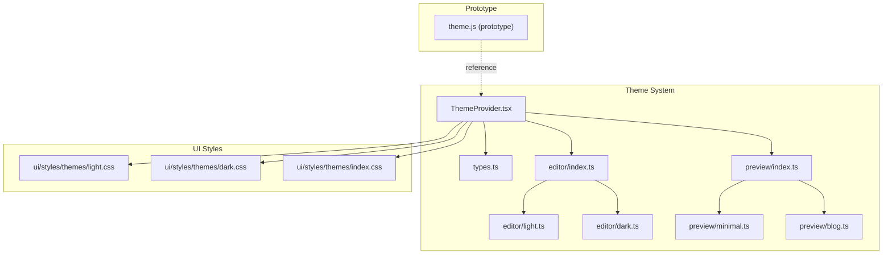
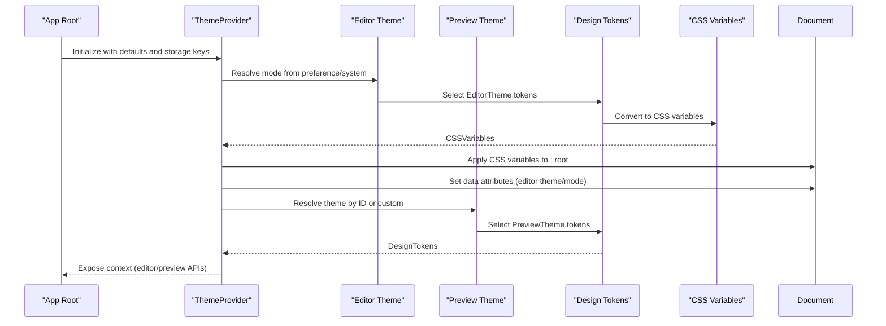
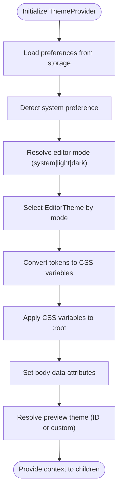
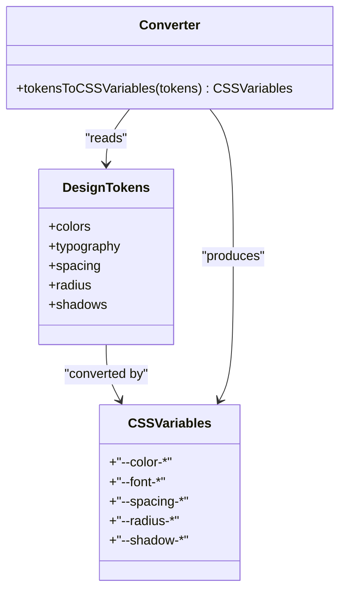
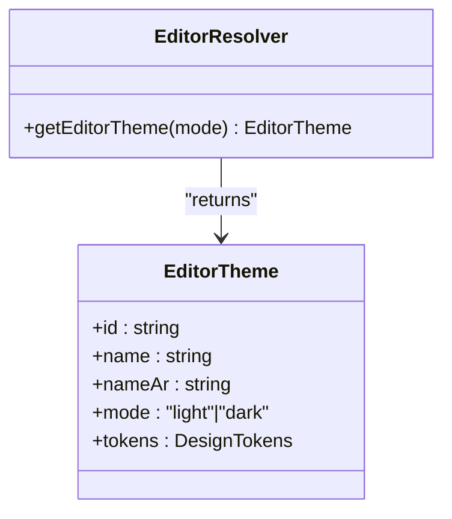
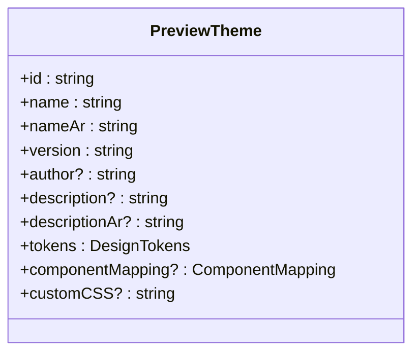
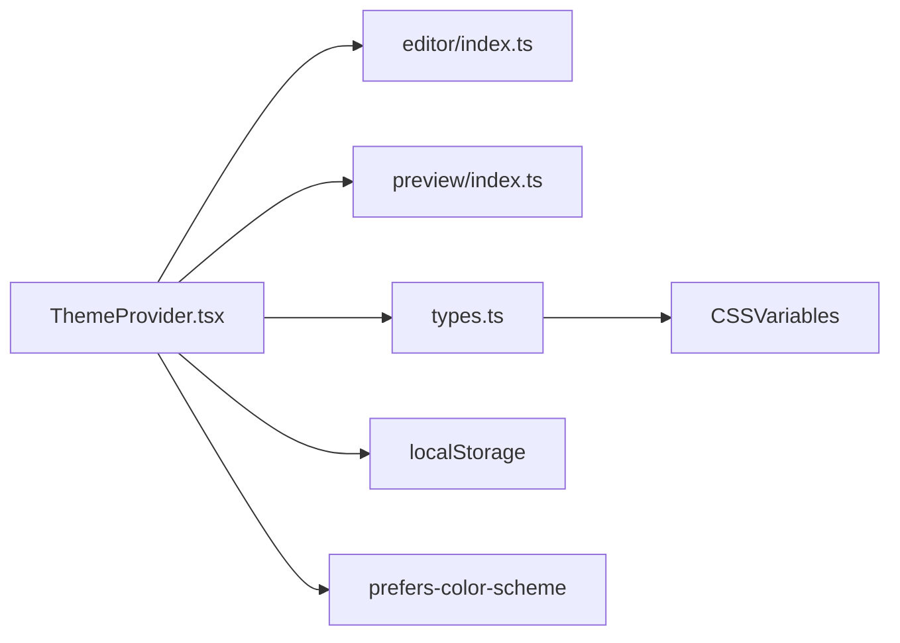

# Theme System and UI Customization

<cite>
**Referenced Files in This Document**
- [ThemeProvider.tsx](file://artoon-typer/src/themes/ThemeProvider.tsx)
- [types.ts](file://artoon-typer/src/themes/tokens/types.ts)
- [index.ts](file://artoon-typer/src/themes/index.ts)
- [README.md](file://artoon-typer/src/themes/README.md)
- [light.ts](file://artoon-typer/src/themes/editor/light.ts)
- [dark.ts](file://artoon-typer/src/themes/editor/dark.ts)
- [index.ts](file://artoon-typer/src/themes/editor/index.ts)
- [minimal.ts](file://artoon-typer/src/themes/preview/minimal.ts)
- [blog.ts](file://artoon-typer/src/themes/preview/blog.ts)
- [index.ts](file://artoon-typer/src/themes/preview/index.ts)
- [index.ts](file://artoon-typer/src/index.ts)
- [dark.css](file://artoon-typer/src/ui/styles/themes/dark.css)
- [light.css](file://artoon-typer/src/ui/styles/themes/light.css)
- [index.css](file://artoon-typer/src/ui/styles/themes/index.css)
- [theme.js](file://artoon-typer-prototype/js/features/theme.js)
</cite>

## Table of Contents
1. [Introduction](#introduction)
2. [Project Structure](#project-structure)
3. [Core Components](#core-components)
4. [Architecture Overview](#architecture-overview)
5. [Detailed Component Analysis](#detailed-component-analysis)
6. [Dependency Analysis](#dependency-analysis)
7. [Performance Considerations](#performance-considerations)
8. [Troubleshooting Guide](#troubleshooting-guide)
9. [Conclusion](#conclusion)
10. [Appendices](#appendices)

## Introduction
This document explains the ARTOON 2.0 theme system and UI customization capabilities. It covers the dual theme architecture (editor vs preview), the design token model, CSS variable injection, and the ThemeProvider React context. You will learn how to create custom color schemes, typography systems, and component styling; how to integrate CSS modules with design tokens; and how to implement theme switching, dynamic styling, and performance optimizations for theme rendering.

## Project Structure
The theme system is organized into:
- Shared types and conversion utilities for design tokens and CSS variables
- Editor themes (light/dark) for the editing interface
- Preview themes (minimal, blog, documentation, academic) for content presentation
- A ThemeProvider React context that manages dual themes, persistence, and CSS variable injection
- UI stylesheets for legacy or prototype integration

**Diagram sources**
- [ThemeProvider.tsx:106-250](file://artoon-typer/src/themes/ThemeProvider.tsx#L106-L250)
- [types.ts:14-112](file://artoon-typer/src/themes/tokens/types.ts#L14-L112)
- [index.ts:1-20](file://artoon-typer/src/themes/editor/index.ts#L1-L20)
- [index.ts:1-20](file://artoon-typer/src/themes/preview/index.ts#L1-L20)
- [light.ts:1-102](file://artoon-typer/src/themes/editor/light.ts#L1-L102)
- [dark.ts:1-102](file://artoon-typer/src/themes/editor/dark.ts#L1-L102)
- [minimal.ts:1-176](file://artoon-typer/src/themes/preview/minimal.ts#L1-L176)
- [blog.ts:1-254](file://artoon-typer/src/themes/preview/blog.ts#L1-L254)
- [dark.css:1-200](file://artoon-typer/src/ui/styles/themes/dark.css#L1-L200)
- [light.css:1-200](file://artoon-typer/src/ui/styles/themes/light.css#L1-L200)
- [index.css:1-200](file://artoon-typer/src/ui/styles/themes/index.css#L1-L200)
- [theme.js:1-9](file://artoon-typer-prototype/js/features/theme.js#L1-L9)

**Section sources**
- [README.md:11-30](file://artoon-typer/src/themes/README.md#L11-L30)
- [index.ts:1-40](file://artoon-typer/src/themes/index.ts#L1-L40)

## Core Components
- ThemeProvider: React context provider that manages dual themes, system preference detection, persistence, and CSS variable injection.
- Design tokens and CSS variables: A semantic token model mapped to CSS variables for consistent theming.
- Editor themes: Light and dark themes for the editor interface.
- Preview themes: Content presentation themes with optional custom CSS.
- UI styles: Legacy CSS files for editor light/dark themes.

Key responsibilities:
- Dual theme orchestration: resolve editor mode from preference and apply CSS variables; select preview theme by ID or custom theme.
- Persistence: store preferences in localStorage with configurable keys.
- System preference: listen to OS-level color-scheme changes and update automatically when preference is set to system.
- CSS variable injection: convert tokens to CSS variables and apply to document root for global styling.

**Section sources**
- [ThemeProvider.tsx:106-250](file://artoon-typer/src/themes/ThemeProvider.tsx#L106-L250)
- [types.ts:14-112](file://artoon-typer/src/themes/tokens/types.ts#L14-L112)
- [types.ts:314-382](file://artoon-typer/src/themes/tokens/types.ts#L314-L382)
- [index.ts:23-38](file://artoon-typer/src/themes/index.ts#L23-L38)

## Architecture Overview
The ThemeProvider composes two subsystems:
- Editor theme subsystem: resolves the current editor theme from user preference and system preference, converts tokens to CSS variables, and applies them to the document root. It also sets data attributes on the body element for downstream UI logic.
- Preview theme subsystem: selects a preview theme by ID or a custom theme object, optionally applying custom CSS.

**Diagram sources**
- [ThemeProvider.tsx:118-216](file://artoon-typer/src/themes/ThemeProvider.tsx#L118-L216)
- [types.ts:314-382](file://artoon-typer/src/themes/tokens/types.ts#L314-L382)
- [light.ts:9-102](file://artoon-typer/src/themes/editor/light.ts#L9-L102)
- [dark.ts:9-102](file://artoon-typer/src/themes/editor/dark.ts#L9-L102)
- [minimal.ts:10-103](file://artoon-typer/src/themes/preview/minimal.ts#L10-L103)
- [blog.ts:10-103](file://artoon-typer/src/themes/preview/blog.ts#L10-L103)

## Detailed Component Analysis

### ThemeProvider: Dual Theme Management
Responsibilities:
- Manage editor preference (light/dark/system) and system preference detection via media queries.
- Resolve effective editor mode and fetch the appropriate editor theme.
- Convert editor theme tokens to CSS variables and inject them into the document root.
- Persist preferences in localStorage and expose setters and toggles.
- Manage preview theme selection by ID or custom theme, with persistence.

Key behaviors:
- System preference listener updates the resolved editor mode when the OS changes.
- CSS variable injection ensures all CSS selectors can consume tokens via var(--token-name).
- Body attributes enable downstream UI logic to adapt visuals without re-rendering.

**Diagram sources**
- [ThemeProvider.tsx:118-216](file://artoon-typer/src/themes/ThemeProvider.tsx#L118-L216)

**Section sources**
- [ThemeProvider.tsx:106-250](file://artoon-typer/src/themes/ThemeProvider.tsx#L106-L250)

### Design Tokens and CSS Variables
Design tokens define semantic values for colors, typography, spacing, radius, and shadows. A dedicated function converts tokens to CSS variables for consumption by CSS and styled components.

Token categories:
- Colors: semantic, text, backgrounds, borders
- Typography: families, sizes, weights, line heights
- Spacing, radius, shadows

Conversion:
- tokensToCSSVariables maps each token category to a CSS variable name convention and assigns the token value.

**Diagram sources**
- [types.ts:18-112](file://artoon-typer/src/themes/tokens/types.ts#L18-L112)
- [types.ts:314-382](file://artoon-typer/src/themes/tokens/types.ts#L314-L382)

**Section sources**
- [types.ts:14-112](file://artoon-typer/src/themes/tokens/types.ts#L14-L112)
- [types.ts:314-382](file://artoon-typer/src/themes/tokens/types.ts#L314-L382)

### Editor Themes: Light and Dark
Editor themes are simple objects containing metadata and a DesignTokens payload. The editor index module exports both themes and a resolver function.

Highlights:
- Each theme defines semantic colors, typography scales, spacing units, radii, and shadows.
- The resolver returns the appropriate theme based on the resolved editor mode.

**Diagram sources**
- [light.ts:9-102](file://artoon-typer/src/themes/editor/light.ts#L9-L102)
- [dark.ts:9-102](file://artoon-typer/src/themes/editor/dark.ts#L9-L102)
- [index.ts:14-19](file://artoon-typer/src/themes/editor/index.ts#L14-L19)

**Section sources**
- [light.ts:1-102](file://artoon-typer/src/themes/editor/light.ts#L1-L102)
- [dark.ts:1-102](file://artoon-typer/src/themes/editor/dark.ts#L1-L102)
- [index.ts:1-20](file://artoon-typer/src/themes/editor/index.ts#L1-L20)

### Preview Themes: Minimal and Blog
Preview themes define content presentation with optional custom CSS. They include metadata, tokens, and an optional customCSS string.

Highlights:
- Minimal theme focuses on readability with basic styling and constrained widths.
- Blog theme emphasizes warm, readable typography and prose-friendly spacing.

**Diagram sources**
- [minimal.ts:10-103](file://artoon-typer/src/themes/preview/minimal.ts#L10-L103)
- [blog.ts:10-103](file://artoon-typer/src/themes/preview/blog.ts#L10-L103)

**Section sources**
- [minimal.ts:1-176](file://artoon-typer/src/themes/preview/minimal.ts#L1-L176)
- [blog.ts:1-254](file://artoon-typer/src/themes/preview/blog.ts#L1-L254)

### Integration with UI Styles and React Components
- ThemeProvider exposes a React context that React components can consume via a custom hook.
- The exported index re-exports ThemeProvider, useTheme, and theme-related types for easy integration.
- Legacy UI styles exist for editor light/dark themes and a shared index stylesheet.

Integration points:
- Use ThemeProvider at the application root to wrap UI components.
- Consume useTheme in components to access editor/preview state and setters.
- Use CSS variables in CSS modules or styled components to reflect tokens.

**Section sources**
- [index.ts:255-263](file://artoon-typer/src/index.ts#L255-L263)
- [ThemeProvider.tsx:259-267](file://artoon-typer/src/themes/ThemeProvider.tsx#L259-L267)
- [dark.css:1-200](file://artoon-typer/src/ui/styles/themes/dark.css#L1-L200)
- [light.css:1-200](file://artoon-typer/src/ui/styles/themes/light.css#L1-L200)
- [index.css:1-200](file://artoon-typer/src/ui/styles/themes/index.css#L1-L200)

### Prototype Theme Manager (Legacy)
A prototype theme manager exists for reference and incremental migration. It logs initialization and can be extended to coordinate with the modern ThemeProvider.

**Section sources**
- [theme.js:1-9](file://artoon-typer-prototype/js/features/theme.js#L1-L9)

## Dependency Analysis
The ThemeProvider depends on:
- Editor theme resolver to select the active editor theme
- Preview theme registry to select the active preview theme
- Token-to-CSS conversion utility
- Browser APIs for system preference and localStorage

**Diagram sources**
- [ThemeProvider.tsx:11-22](file://artoon-typer/src/themes/ThemeProvider.tsx#L11-L22)
- [index.ts:1-20](file://artoon-typer/src/themes/editor/index.ts#L1-L20)
- [index.ts:1-20](file://artoon-typer/src/themes/preview/index.ts#L1-L20)
- [types.ts:314-382](file://artoon-typer/src/themes/tokens/types.ts#L314-L382)

**Section sources**
- [ThemeProvider.tsx:11-22](file://artoon-typer/src/themes/ThemeProvider.tsx#L11-L22)

## Performance Considerations
- Minimize re-renders: memoize derived values (e.g., editorMode, previewTheme) to avoid unnecessary context updates.
- Efficient CSS variable updates: apply variables once per theme change rather than per component.
- Debounce system preference listeners if extending to frequent changes.
- Prefer CSS variables for dynamic theming to avoid costly DOM mutations.
- Lazy-load customCSS for preview themes only when needed.

## Troubleshooting Guide
Common issues and resolutions:
- Theme not switching after OS preference change:
  - Verify system preference listener is attached and media query event handlers are registered.
  - Confirm editorPreference is set to system.
- CSS variables not applied:
  - Ensure tokensToCSSVariables is invoked and applied to document.documentElement.
  - Check that CSS selectors reference the correct CSS variable names.
- Preferences not persisted:
  - Confirm localStorage availability and absence of storage errors.
  - Verify storage keys match expectations.
- Preview theme not reflected:
  - Ensure preview theme ID exists in the preview registry or set a custom theme.
  - Validate customCSS does not introduce selector conflicts.

**Section sources**
- [ThemeProvider.tsx:182-201](file://artoon-typer/src/themes/ThemeProvider.tsx#L182-L201)
- [ThemeProvider.tsx:207-216](file://artoon-typer/src/themes/ThemeProvider.tsx#L207-L216)
- [ThemeProvider.tsx:77-100](file://artoon-typer/src/themes/ThemeProvider.tsx#L77-L100)

## Conclusion
AROON 2.0’s dual theme system separates editor interface concerns from content presentation, enabling flexible combinations of editor modes and preview themes. The design token–driven approach with CSS variable injection ensures consistent, maintainable theming across components and pages. With ThemeProvider managing persistence, system preferences, and CSS variable application, developers can easily create custom themes, extend preview styles, and optimize performance.

## Appendices

### Step-by-Step: Creating a New Editor Theme
1. Define a new EditorTheme object with semantic tokens.
2. Export it from the editor index module.
3. Update the editor resolver to include the new theme.
4. Verify ThemeProvider resolves the new theme by mode.
5. Confirm CSS variables are applied to the document root.

**Section sources**
- [light.ts:9-102](file://artoon-typer/src/themes/editor/light.ts#L9-L102)
- [dark.ts:9-102](file://artoon-typer/src/themes/editor/dark.ts#L9-L102)
- [index.ts:14-19](file://artoon-typer/src/themes/editor/index.ts#L14-L19)
- [ThemeProvider.tsx:134-137](file://artoon-typer/src/themes/ThemeProvider.tsx#L134-L137)

### Step-by-Step: Creating a New Preview Theme
1. Define a new PreviewTheme object with tokens and optional customCSS.
2. Export it from the preview index module.
3. Add it to the preview registry array.
4. Use ThemeProvider to switch to the new theme by ID or set a custom theme.
5. Validate that the preview renders with the intended styles.

**Section sources**
- [minimal.ts:10-103](file://artoon-typer/src/themes/preview/minimal.ts#L10-L103)
- [blog.ts:10-103](file://artoon-typer/src/themes/preview/blog.ts#L10-L103)
- [index.ts:1-20](file://artoon-typer/src/themes/preview/index.ts#L1-L20)
- [ThemeProvider.tsx:162-168](file://artoon-typer/src/themes/ThemeProvider.tsx#L162-L168)

### Step-by-Step: Modifying an Existing Theme
1. Adjust tokens in the relevant theme file.
2. Re-run token-to-CSS conversion and CSS variable application.
3. Test in both editor and preview contexts.
4. Persist preferences if needed.

**Section sources**
- [types.ts:314-382](file://artoon-typer/src/themes/tokens/types.ts#L314-L382)
- [ThemeProvider.tsx:207-216](file://artoon-typer/src/themes/ThemeProvider.tsx#L207-L216)

### Step-by-Step: Implementing Brand-Specific Styling
1. Define brand tokens (colors, typography) aligned with brand guidelines.
2. Create a PreviewTheme with brand tokens and optional customCSS.
3. Provide a UI to switch to the brand theme via ThemeProvider.
4. Ensure customCSS targets content blocks and avoids interfering with the editor UI.

**Section sources**
- [minimal.ts:105-174](file://artoon-typer/src/themes/preview/minimal.ts#L105-L174)
- [blog.ts:105-252](file://artoon-typer/src/themes/preview/blog.ts#L105-L252)

### Responsive Design Patterns
- Use CSS container queries or viewport-based units in customCSS for adaptive layouts.
- Leverage spacing tokens consistently across breakpoints.
- Keep typography scales proportional to ensure readability across devices.

### Accessibility Compliance
- Maintain sufficient color contrast in both editor and preview themes.
- Provide focus indicators and keyboard navigation affordances in editor UI.
- Avoid relying solely on color to convey meaning; pair with text or icons.

### Cross-Browser Compatibility
- CSS variables are supported in modern browsers; ensure fallbacks for legacy environments if necessary.
- Test media query behavior across browsers for system preference detection.

### Theme Switching Mechanisms
- Use ThemeProvider setters to change editor preference or preview theme.
- Toggle editor mode programmatically or via UI controls.
- Persist selections to localStorage using configured keys.

**Section sources**
- [ThemeProvider.tsx:140-148](file://artoon-typer/src/themes/ThemeProvider.tsx#L140-L148)
- [ThemeProvider.tsx:171-175](file://artoon-typer/src/themes/ThemeProvider.tsx#L171-L175)
- [README.md:270-287](file://artoon-typer/src/themes/README.md#L270-L287)

### Dynamic Styling and Performance Optimization
- Inject CSS variables once per theme change; avoid per-component re-application.
- Memoize context values and derived theme objects.
- Defer heavy customCSS computations until theme activation.

**Section sources**
- [ThemeProvider.tsx:222-243](file://artoon-typer/src/themes/ThemeProvider.tsx#L222-L243)
- [types.ts:314-382](file://artoon-typer/src/themes/tokens/types.ts#L314-L382)