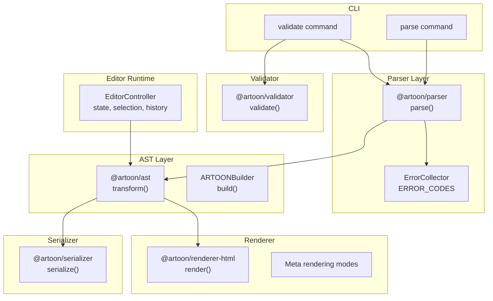
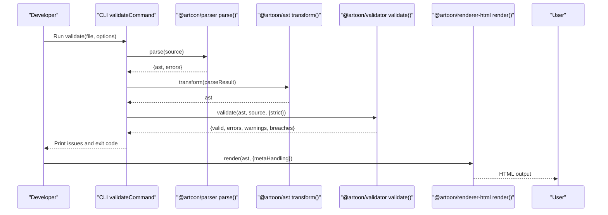
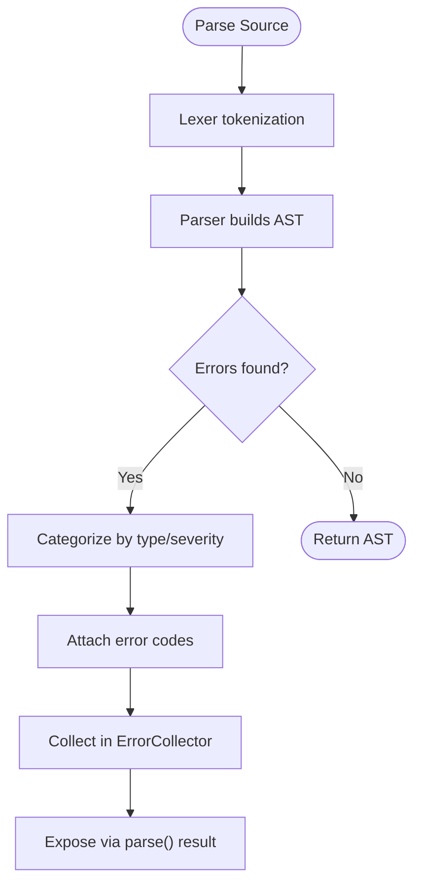
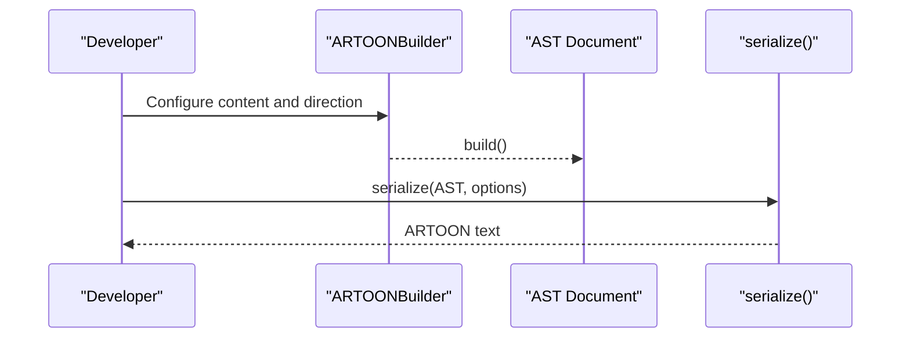
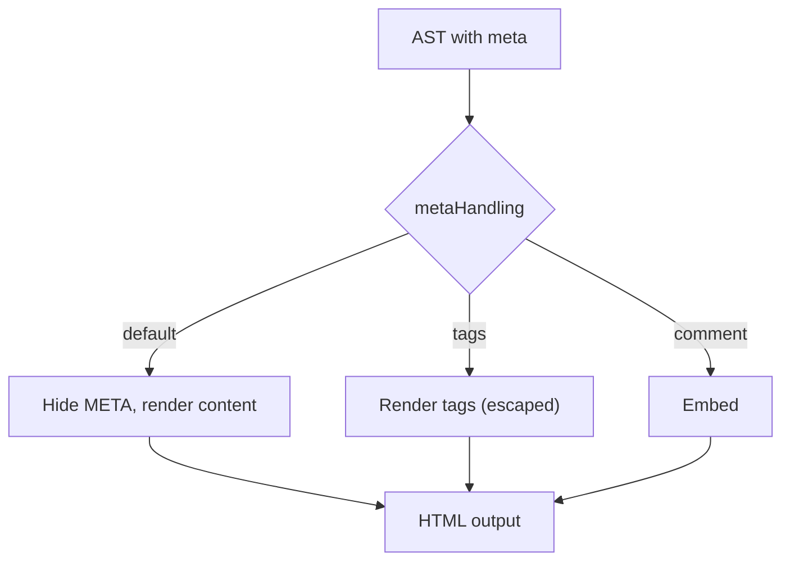
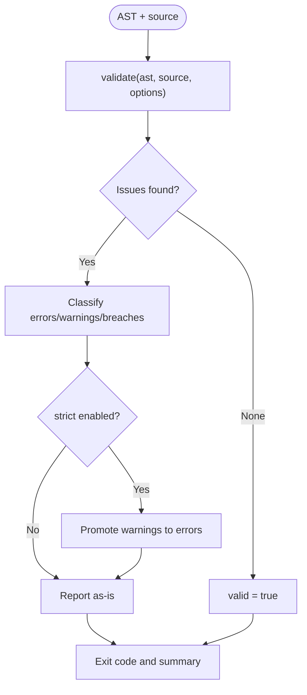
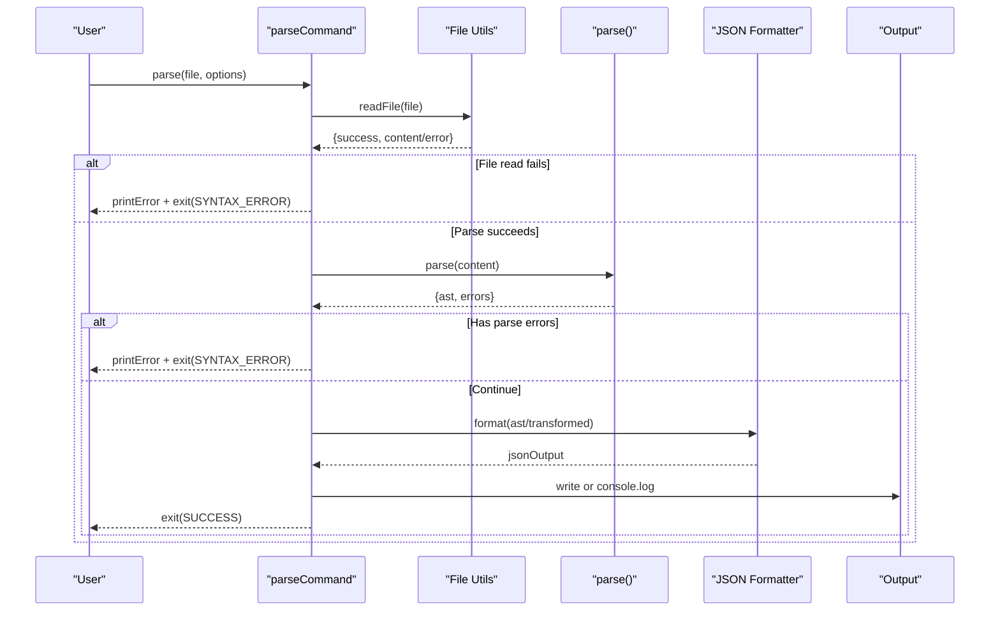
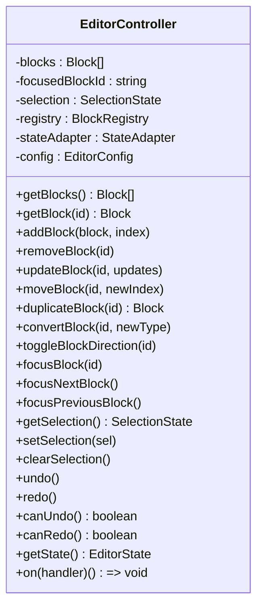
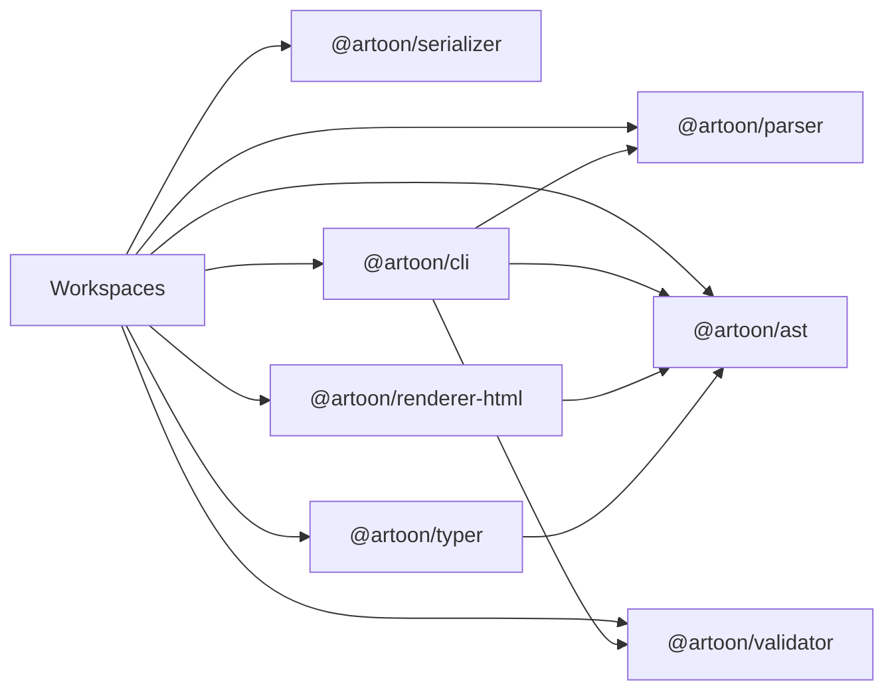

# Troubleshooting and Debugging

<cite>
**Referenced Files in This Document**
- [README.md](file://README.md)
- [package.json](file://package.json)
- [artoon-parser/src/errors/index.ts](file://artoon-parser/src/errors/index.ts)
- [artoon-parser/tests/integration.test.ts](file://artoon-parser/tests/integration.test.ts)
- [artoon-ast/tests/builder.test.ts](file://artoon-ast/tests/builder.test.ts)
- [artoon-serializer/tests/serialize.test.ts](file://artoon-serializer/tests/serialize.test.ts)
- [artoon-renderer-html/tests/meta-rendering.test.ts](file://artoon-renderer-html/tests/meta-rendering.test.ts)
- [artoon-validator/tests/integration.test.ts](file://artoon-validator/tests/integration.test.ts)
- [artoon-cli/src/commands/parse.ts](file://artoon-cli/src/commands/parse.ts)
- [artoon-cli/src/commands/validate.ts](file://artoon-cli/src/commands/validate.ts)
- [artoon-cli/src/utils/exit-codes.ts](file://artoon-cli/src/utils/exit-codes.ts)
- [artoon-typer/src/core/EditorController.ts](file://artoon-typer/src/core/EditorController.ts)
</cite>

## Table of Contents
1. [Introduction](#introduction)
2. [Project Structure](#project-structure)
3. [Core Components](#core-components)
4. [Architecture Overview](#architecture-overview)
5. [Detailed Component Analysis](#detailed-component-analysis)
6. [Dependency Analysis](#dependency-analysis)
7. [Performance Considerations](#performance-considerations)
8. [Troubleshooting Guide](#troubleshooting-guide)
9. [Conclusion](#conclusion)
10. [Appendices](#appendices)

## Introduction
This document provides a comprehensive troubleshooting and debugging guide for ARTOON 2.0 development and deployment. It focuses on systematic approaches to diagnosing parsing errors, validation failures, and rendering problems. It also covers diagnostic tools, logging strategies, error analysis techniques, performance debugging, memory leak detection, optimization problem identification, integration issues, theme conflicts, plugin compatibility, testing strategies, unit test debugging, end-to-end validation, and production debugging with error monitoring and incident response.

## Project Structure
The ARTOON monorepo is organized around core packages that implement parsing, AST transformation, serialization, validation, HTML rendering, CLI tooling, editor state management, and a visual editor. The structure supports layered diagnostics: CLI-level parsing and validation, AST correctness, serializer fidelity, renderer behavior, and editor runtime state.

**Diagram sources**
- [artoon-cli/src/commands/parse.ts:13-65](file://artoon-cli/src/commands/parse.ts#L13-L65)
- [artoon-cli/src/commands/validate.ts:22-149](file://artoon-cli/src/commands/validate.ts#L22-L149)
- [artoon-parser/src/errors/index.ts:156-247](file://artoon-parser/src/errors/index.ts#L156-L247)
- [artoon-ast/tests/builder.test.ts:1-71](file://artoon-ast/tests/builder.test.ts#L1-L71)
- [artoon-serializer/tests/serialize.test.ts:1-231](file://artoon-serializer/tests/serialize.test.ts#L1-L231)
- [artoon-renderer-html/tests/meta-rendering.test.ts:1-321](file://artoon-renderer-html/tests/meta-rendering.test.ts#L1-L321)
- [artoon-validator/tests/integration.test.ts:1-181](file://artoon-validator/tests/integration.test.ts#L1-L181)
- [artoon-typer/src/core/EditorController.ts:27-67](file://artoon-typer/src/core/EditorController.ts#L27-L67)

**Section sources**
- [README.md:77-88](file://README.md#L77-L88)
- [package.json:6-15](file://package.json#L6-L15)

## Core Components
- Parser and Error Handling: Provides parse() with error reporting and categorization via an error collector and standardized error codes. Integration tests demonstrate expected behaviors for syntax, structure, semantic, and constraint errors.
- AST Builder: Validates builder usage, direction handling, and line counting to ensure serialized output fidelity.
- Serializer: Converts AST documents to ARTOON text with configurable options (blank lines, comments, line endings).
- Renderer: Renders AST to HTML with configurable meta handling modes (hidden, tags, comments) and direction handling.
- Validator: Validates AST against ARTOON philosophy and rules, supporting strict mode and formatted reports.
- CLI: Exposes parse and validate commands with exit codes and JSON output for CI/automation.
- Editor Runtime: Manages blocks, selection, history, and state synchronization for the visual editor.

**Section sources**
- [artoon-parser/src/errors/index.ts:27-48](file://artoon-parser/src/errors/index.ts#L27-L48)
- [artoon-parser/src/errors/index.ts:156-247](file://artoon-parser/src/errors/index.ts#L156-L247)
- [artoon-parser/tests/integration.test.ts:1-364](file://artoon-parser/tests/integration.test.ts#L1-L364)
- [artoon-ast/tests/builder.test.ts:1-71](file://artoon-ast/tests/builder.test.ts#L1-L71)
- [artoon-serializer/tests/serialize.test.ts:1-231](file://artoon-serializer/tests/serialize.test.ts#L1-L231)
- [artoon-renderer-html/tests/meta-rendering.test.ts:1-321](file://artoon-renderer-html/tests/meta-rendering.test.ts#L1-L321)
- [artoon-validator/tests/integration.test.ts:1-181](file://artoon-validator/tests/integration.test.ts#L1-L181)
- [artoon-cli/src/commands/parse.ts:13-65](file://artoon-cli/src/commands/parse.ts#L13-L65)
- [artoon-cli/src/commands/validate.ts:22-149](file://artoon-cli/src/commands/validate.ts#L22-L149)
- [artoon-typer/src/core/EditorController.ts:27-67](file://artoon-typer/src/core/EditorController.ts#L27-L67)

## Architecture Overview
The ARTOON pipeline integrates CLI, parser, AST, serializer, validator, and renderer. Errors propagate through the pipeline with typed severity and codes, enabling targeted diagnostics.

**Diagram sources**
- [artoon-cli/src/commands/validate.ts:22-149](file://artoon-cli/src/commands/validate.ts#L22-L149)
- [artoon-parser/src/errors/index.ts:156-247](file://artoon-parser/src/errors/index.ts#L156-L247)
- [artoon-validator/tests/integration.test.ts:1-181](file://artoon-validator/tests/integration.test.ts#L1-L181)
- [artoon-renderer-html/tests/meta-rendering.test.ts:1-321](file://artoon-renderer-html/tests/meta-rendering.test.ts#L1-L321)

## Detailed Component Analysis

### Parser and Error Handling
- Error types and severity: syntax, structure, semantic, constraint with standardized codes and severity levels.
- Error collector: aggregates, filters, sorts, and formats errors for CLI and tests.
- Integration tests: verify correct error signaling for unclosed blocks, invalid modifiers, and inline constraints.

**Diagram sources**
- [artoon-parser/src/errors/index.ts:156-247](file://artoon-parser/src/errors/index.ts#L156-L247)
- [artoon-parser/tests/integration.test.ts:116-126](file://artoon-parser/tests/integration.test.ts#L116-L126)

**Section sources**
- [artoon-parser/src/errors/index.ts:27-48](file://artoon-parser/src/errors/index.ts#L27-L48)
- [artoon-parser/src/errors/index.ts:53-132](file://artoon-parser/src/errors/index.ts#L53-L132)
- [artoon-parser/src/errors/index.ts:252-265](file://artoon-parser/src/errors/index.ts#L252-L265)
- [artoon-parser/tests/integration.test.ts:116-126](file://artoon-parser/tests/integration.test.ts#L116-L126)

### AST Builder and Serialization Fidelity
- Builder tests validate direction switching, line numbering, and content shape.
- Serializer tests validate blank-line behavior, comment handling, and line endings.

**Diagram sources**
- [artoon-ast/tests/builder.test.ts:1-71](file://artoon-ast/tests/builder.test.ts#L1-L71)
- [artoon-serializer/tests/serialize.test.ts:1-231](file://artoon-serializer/tests/serialize.test.ts#L1-L231)

**Section sources**
- [artoon-ast/tests/builder.test.ts:13-36](file://artoon-ast/tests/builder.test.ts#L13-L36)
- [artoon-serializer/tests/serialize.test.ts:91-125](file://artoon-serializer/tests/serialize.test.ts#L91-L125)

### Renderer and Meta Handling Modes
- Default: META blocks hidden.
- Tags: Render META fields as HTML meta tags with escaping.
- Comment: Embed META as HTML comments.
- RTL/LTR direction handling preserved.

**Diagram sources**
- [artoon-renderer-html/tests/meta-rendering.test.ts:7-85](file://artoon-renderer-html/tests/meta-rendering.test.ts#L7-L85)
- [artoon-renderer-html/tests/meta-rendering.test.ts:87-159](file://artoon-renderer-html/tests/meta-rendering.test.ts#L87-L159)
- [artoon-renderer-html/tests/meta-rendering.test.ts:161-209](file://artoon-renderer-html/tests/meta-rendering.test.ts#L161-L209)

**Section sources**
- [artoon-renderer-html/tests/meta-rendering.test.ts:8-43](file://artoon-renderer-html/tests/meta-rendering.test.ts#L8-L43)
- [artoon-renderer-html/tests/meta-rendering.test.ts:106-133](file://artoon-renderer-html/tests/meta-rendering.test.ts#L106-L133)

### Validator and Strict Mode
- Validates AST against ARTOON philosophy and rules.
- Strict mode elevates warnings to errors.
- Options include philosophy checks and empty component allowances.

**Diagram sources**
- [artoon-validator/tests/integration.test.ts:1-181](file://artoon-validator/tests/integration.test.ts#L1-L181)
- [artoon-cli/src/commands/validate.ts:56-103](file://artoon-cli/src/commands/validate.ts#L56-L103)

**Section sources**
- [artoon-validator/tests/integration.test.ts:54-74](file://artoon-validator/tests/integration.test.ts#L54-L74)
- [artoon-cli/src/commands/validate.ts:16-21](file://artoon-cli/src/commands/validate.ts#L16-L21)

### CLI Commands and Exit Codes
- parse command: reads file, parses, transforms (optional), formats JSON, writes output or logs to stdout, exits with appropriate code.
- validate command: parses, transforms, validates, prints human-readable or JSON output, exits with success or failure codes.

**Diagram sources**
- [artoon-cli/src/commands/parse.ts:13-65](file://artoon-cli/src/commands/parse.ts#L13-L65)
- [artoon-cli/src/utils/exit-codes.ts:1-12](file://artoon-cli/src/utils/exit-codes.ts#L1-L12)

**Section sources**
- [artoon-cli/src/commands/parse.ts:13-65](file://artoon-cli/src/commands/parse.ts#L13-L65)
- [artoon-cli/src/commands/validate.ts:22-149](file://artoon-cli/src/commands/validate.ts#L22-L149)
- [artoon-cli/src/utils/exit-codes.ts:1-12](file://artoon-cli/src/utils/exit-codes.ts#L1-L12)

### Editor Runtime State Management
- EditorController manages blocks, selection, focus, history, and emits events.
- Ensures at least one block exists and maintains state via StateAdapter.

**Diagram sources**
- [artoon-typer/src/core/EditorController.ts:27-475](file://artoon-typer/src/core/EditorController.ts#L27-L475)

**Section sources**
- [artoon-typer/src/core/EditorController.ts:118-170](file://artoon-typer/src/core/EditorController.ts#L118-L170)
- [artoon-typer/src/core/EditorController.ts:362-397](file://artoon-typer/src/core/EditorController.ts#L362-L397)

## Dependency Analysis
- Workspaces define the monorepo layout and shared scripts for building and testing all packages.
- CLI depends on parser, AST, and validator for end-to-end validation.
- Renderer depends on AST for HTML output.
- Editor runtime depends on AST and state adapters for block management.

**Diagram sources**
- [package.json:6-15](file://package.json#L6-L15)

**Section sources**
- [package.json:16-32](file://package.json#L16-L32)

## Performance Considerations
- Prefer streaming or chunked processing for large documents to reduce peak memory usage during parsing and rendering.
- Minimize repeated AST transformations; cache transformed AST when serializing multiple formats.
- Use compact JSON output in CLI for reduced I/O overhead when validating large batches.
- Avoid unnecessary re-renders in the editor by batching block updates and debouncing state changes.
- Profile long-running operations with browser/devtools profiling and Node.js profilers to identify hotspots.

## Troubleshooting Guide

### Systematic Debugging Approaches
- Isolate the stage: Determine whether the issue occurs in parsing, AST transformation, serialization, validation, or rendering.
- Reproduce with minimal input: Create the smallest ARTOON snippet that triggers the issue.
- Enable verbose output: Use CLI JSON output for machine-readable logs and CI integration.
- Cross-check expectations: Compare actual vs expected AST shapes and serialized outputs.

### Parsing Errors
Common symptoms:
- Unclosed blocks, mismatched block terminators, invalid modifiers on media, inline constraints.

Resolution steps:
- Inspect parse() result for errors array and error codes.
- Use parseStrict() to fail fast on any error.
- Review integration tests for expected behaviors and error scenarios.

**Section sources**
- [artoon-parser/src/errors/index.ts:27-48](file://artoon-parser/src/errors/index.ts#L27-L48)
- [artoon-parser/src/errors/index.ts:252-265](file://artoon-parser/src/errors/index.ts#L252-L265)
- [artoon-parser/tests/integration.test.ts:116-126](file://artoon-parser/tests/integration.test.ts#L116-L126)

### Validation Failures
Common symptoms:
- Philosophy breaches (e.g., inline styles), warnings treated as errors in strict mode, empty components flagged.

Resolution steps:
- Run validate() and review stats and categorized issues.
- Use validateStrict() for CI gating.
- Adjust options (allowEmptyComponents, checkPhilosophy) to tailor validation.

**Section sources**
- [artoon-validator/tests/integration.test.ts:54-74](file://artoon-validator/tests/integration.test.ts#L54-L74)
- [artoon-cli/src/commands/validate.ts:56-103](file://artoon-cli/src/commands/validate.ts#L56-L103)

### Rendering Problems
Common symptoms:
- META visibility unexpected, HTML meta tags not generated, direction issues, comments not embedded.

Resolution steps:
- Verify metaHandling option in render().
- Confirm direction flags on nodes.
- Check renderer tests for expected behaviors under different modes.

**Section sources**
- [artoon-renderer-html/tests/meta-rendering.test.ts:8-43](file://artoon-renderer-html/tests/meta-rendering.test.ts#L8-L43)
- [artoon-renderer-html/tests/meta-rendering.test.ts:106-133](file://artoon-renderer-html/tests/meta-rendering.test.ts#L106-L133)

### State Management and Editor Runtime
Common symptoms:
- Lost focus after removing blocks, incorrect selection, history not updating.

Resolution steps:
- Ensure at least one block remains after removal.
- Use focusNextBlock()/focusPreviousBlock() to maintain focus.
- Verify stateAdapter undo/redo and onChange callbacks.

**Section sources**
- [artoon-typer/src/core/EditorController.ts:136-156](file://artoon-typer/src/core/EditorController.ts#L136-L156)
- [artoon-typer/src/core/EditorController.ts:312-336](file://artoon-typer/src/core/EditorController.ts#L312-L336)
- [artoon-typer/src/core/EditorController.ts:366-383](file://artoon-typer/src/core/EditorController.ts#L366-L383)

### Diagnostic Tools and Logging Strategies
- CLI JSON output: Use validate --json for machine-readable summaries.
- Error collector: Utilize sorted(), format(), and counts for automated reporting.
- Unit tests: Mirror real-world issues in tests to validate fixes.

**Section sources**
- [artoon-cli/src/commands/validate.ts:111-139](file://artoon-cli/src/commands/validate.ts#L111-L139)
- [artoon-parser/src/errors/index.ts:228-239](file://artoon-parser/src/errors/index.ts#L228-L239)
- [artoon-validator/tests/integration.test.ts:80-101](file://artoon-validator/tests/integration.test.ts#L80-L101)

### Performance Debugging and Memory Leak Detection
- Measure parsing/serialization/rendering durations with high-resolution timers.
- Monitor memory growth in long-running processes; use heap snapshots to detect leaks.
- Optimize by avoiding redundant AST cloning and minimizing DOM updates in the editor.

### Integration Issues, Theme Conflicts, and Plugin Compatibility
- Validate that custom blocks integrate with BlockRegistry and are registered before initialization.
- Ensure theme/theme provider compatibility with renderer meta handling and direction flags.
- Test plugin compatibility by importing initial content via ARTOONImporter and verifying block rendering.

**Section sources**
- [artoon-typer/src/core/EditorController.ts:46-73](file://artoon-typer/src/core/EditorController.ts#L46-L73)

### Testing Strategies, Unit Test Debugging, and End-to-End Validation
- Unit tests: Use existing test suites as templates for reproducing issues.
- Integration tests: Validate complete pipelines (parse → transform → validate → render).
- Round-trip tests: Serialize AST to ARTOON and re-parse to ensure fidelity.

**Section sources**
- [artoon-ast/tests/builder.test.ts:1-71](file://artoon-ast/tests/builder.test.ts#L1-L71)
- [artoon-serializer/tests/serialize.test.ts:1-231](file://artoon-serializer/tests/serialize.test.ts#L1-L231)
- [artoon-renderer-html/tests/meta-rendering.test.ts:1-321](file://artoon-renderer-html/tests/meta-rendering.test.ts#L1-L321)
- [artoon-validator/tests/integration.test.ts:103-152](file://artoon-validator/tests/integration.test.ts#L103-L152)

### Production Debugging, Error Monitoring, and Incident Response
- Exit codes: Use CLI exit codes to gate CI jobs and automate remediation.
- Error reporting: Aggregate parse/validation errors with codes and line numbers for triage.
- Incident response: Capture full pipeline artifacts (raw source, AST, validation report, HTML) for postmortems.

**Section sources**
- [artoon-cli/src/utils/exit-codes.ts:1-12](file://artoon-cli/src/utils/exit-codes.ts#L1-L12)
- [artoon-cli/src/commands/parse.ts:25-30](file://artoon-cli/src/commands/parse.ts#L25-L30)
- [artoon-cli/src/commands/validate.ts:142-148](file://artoon-cli/src/commands/validate.ts#L142-L148)

## Conclusion
By following the layered diagnostics outlined here—starting with CLI validation, progressing through parser and AST correctness, serializer fidelity, and renderer behavior—you can efficiently isolate and resolve ARTOON-related issues. Leverage standardized error codes, structured logging, and comprehensive test coverage to ensure robust development and deployment workflows.

## Appendices

### Quick Reference: Common Exit Codes
- 0: Success
- 1: Syntax error detected
- 2: Validation error present
- 3: Philosophy breach (strict mode)
- 4: File not found
- 5: IO error
- 99: Unknown error

**Section sources**
- [artoon-cli/src/utils/exit-codes.ts:1-12](file://artoon-cli/src/utils/exit-codes.ts#L1-L12)