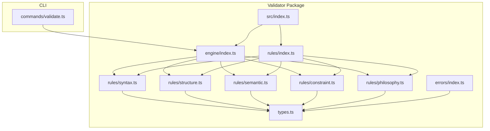
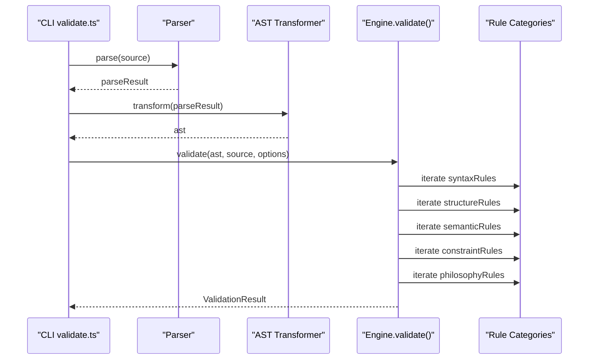
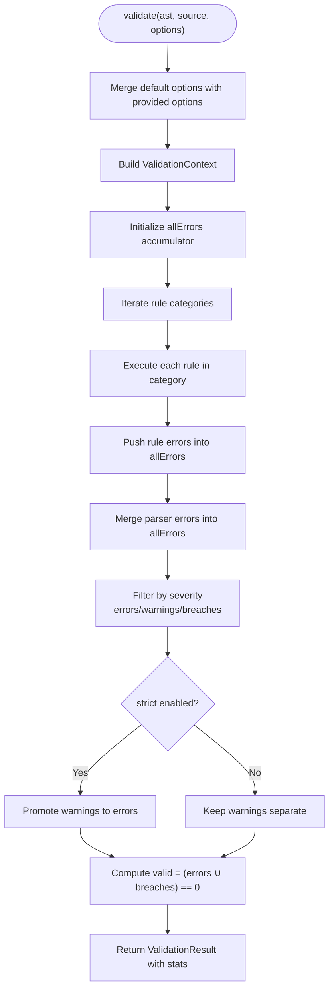
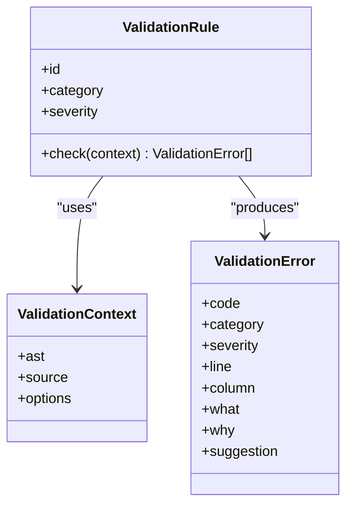
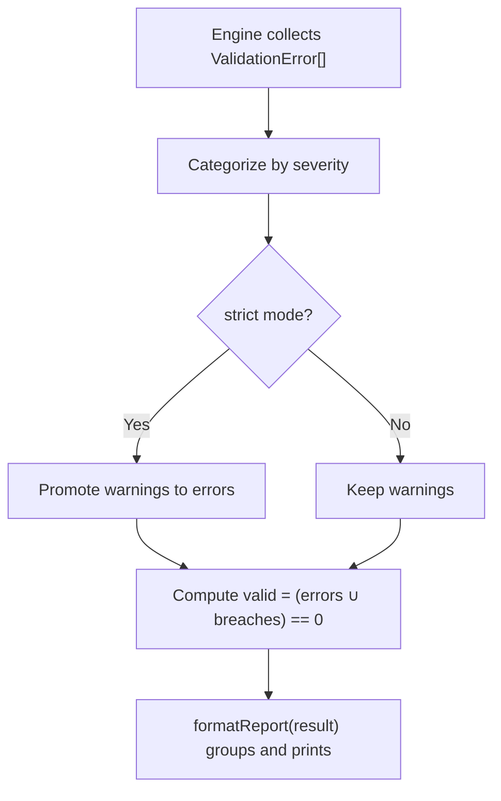
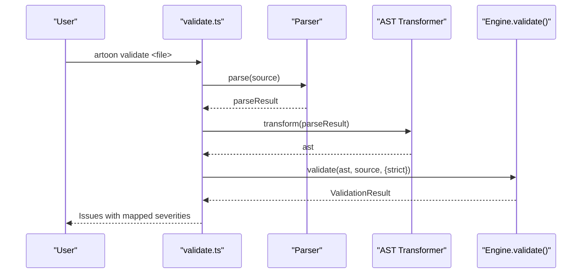
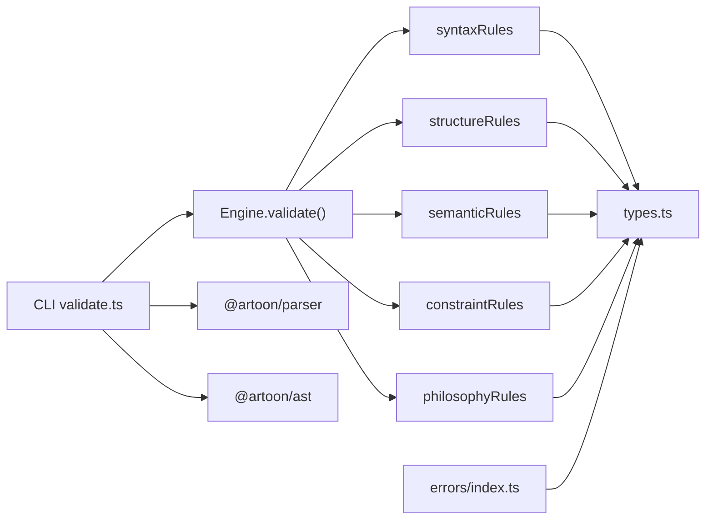

# Validation Rule Extension

<cite>
**Referenced Files in This Document**
- [index.ts](file://artoon-validator/src/index.ts)
- [types.ts](file://artoon-validator/src/types.ts)
- [engine/index.ts](file://artoon-validator/src/engine/index.ts)
- [rules/index.ts](file://artoon-validator/src/rules/index.ts)
- [rules/syntax.ts](file://artoon-validator/src/rules/syntax.ts)
- [rules/structure.ts](file://artoon-validator/src/rules/structure.ts)
- [rules/semantic.ts](file://artoon-validator/src/rules/semantic.ts)
- [rules/constraint.ts](file://artoon-validator/src/rules/constraint.ts)
- [rules/philosophy.ts](file://artoon-validator/src/rules/philosophy.ts)
- [errors/index.ts](file://artoon-validator/src/errors/index.ts)
- [validate.ts](file://artoon-cli/src/commands/validate.ts)
- [README.md](file://artoon-validator/README.md)
- [package.json](file://artoon-validator/package.json)
</cite>

## Table of Contents
1. [Introduction](#introduction)
2. [Project Structure](#project-structure)
3. [Core Components](#core-components)
4. [Architecture Overview](#architecture-overview)
5. [Detailed Component Analysis](#detailed-component-analysis)
6. [Dependency Analysis](#dependency-analysis)
7. [Performance Considerations](#performance-considerations)
8. [Troubleshooting Guide](#troubleshooting-guide)
9. [Conclusion](#conclusion)
10. [Appendices](#appendices)

## Introduction
This document explains how to extend ARTOON 2.0 validation rules and implement custom content policies. It covers the rule categorization system (syntax, structure, semantic, constraint, philosophy), the validation engine architecture, the rule execution pipeline, and error reporting mechanisms. It also provides step-by-step guidance for creating custom validation rules, handling parameters, generating error messages, enforcing business logic, integrating with the AST validation system, and optimizing performance and debugging.

## Project Structure
The validation subsystem is implemented in the artoon-validator package. Key areas:
- Engine: orchestrates rule execution and aggregates results.
- Rules: categorized rule sets for syntax, structure, semantic, constraint, and philosophy.
- Types: shared types, severity levels, categories, error codes, and constants.
- Errors: utilities for creating standardized validation errors.
- CLI integration: validate command consumes the validator and reports results.

**Diagram sources**
- [engine/index.ts:1-178](file://artoon-validator/src/engine/index.ts#L1-L178)
- [rules/index.ts:1-15](file://artoon-validator/src/rules/index.ts#L1-L15)
- [rules/syntax.ts:1-127](file://artoon-validator/src/rules/syntax.ts#L1-L127)
- [rules/structure.ts:1-195](file://artoon-validator/src/rules/structure.ts#L1-L195)
- [rules/semantic.ts:1-254](file://artoon-validator/src/rules/semantic.ts#L1-L254)
- [rules/constraint.ts:1-117](file://artoon-validator/src/rules/constraint.ts#L1-L117)
- [rules/philosophy.ts:1-158](file://artoon-validator/src/rules/philosophy.ts#L1-L158)
- [errors/index.ts:1-80](file://artoon-validator/src/errors/index.ts#L1-L80)
- [validate.ts:49-92](file://artoon-cli/src/commands/validate.ts#L49-L92)

**Section sources**
- [index.ts:1-30](file://artoon-validator/src/index.ts#L1-L30)
- [engine/index.ts:1-178](file://artoon-validator/src/engine/index.ts#L1-L178)
- [rules/index.ts:1-15](file://artoon-validator/src/rules/index.ts#L1-L15)
- [validate.ts:49-92](file://artoon-cli/src/commands/validate.ts#L49-L92)

## Core Components
- Validation engine: runs all rule categories against an AST and source, merges parser errors, categorizes outcomes, and produces a structured result.
- Rule categories: syntax, structure, semantic, constraint, philosophy, each exposing an array of rule functions.
- Types and constants: severity levels, categories, error codes, modifier and attribute rules, and philosophy keywords.
- Error utilities: standardized creation and templating of validation errors.
- CLI integration: parses and transforms input, invokes the validator, and formats results.

Key exports and entry points:
- Engine functions: validate, isValid, validateStrict, formatReport.
- Rule exports: syntaxRules, structureRules, semanticRules, constraintRules, philosophyRules.
- Error utilities: createError, getErrorTemplate, ERROR_CODES.

**Section sources**
- [index.ts:6-25](file://artoon-validator/src/index.ts#L6-L25)
- [engine/index.ts:27-100](file://artoon-validator/src/engine/index.ts#L27-L100)
- [types.ts:5-167](file://artoon-validator/src/types.ts#L5-L167)
- [errors/index.ts:8-79](file://artoon-validator/src/errors/index.ts#L8-L79)

## Architecture Overview
The validation pipeline:
1. Parse source to produce an AST and optional parser errors.
2. Transform parse result into the ARTOON AST.
3. Invoke the validator with AST and source, plus options.
4. Engine executes each rule category and collects errors.
5. Parser errors are merged into the error set.
6. Results are categorized and returned with statistics.

**Diagram sources**
- [validate.ts:54-92](file://artoon-cli/src/commands/validate.ts#L54-L92)
- [engine/index.ts:27-100](file://artoon-validator/src/engine/index.ts#L27-L100)
- [rules/index.ts:1-15](file://artoon-validator/src/rules/index.ts#L1-L15)

## Detailed Component Analysis

### Validation Engine
Responsibilities:
- Merge parser errors into the error set.
- Categorize errors by severity (error, warning, philosophy).
- Convert warnings to errors in strict mode.
- Compute validity and statistics.

Execution model:
- Iterates over rule categories in order.
- Each rule returns an array of errors for the given context.
- Aggregates all errors and computes counts.

**Diagram sources**
- [engine/index.ts:27-100](file://artoon-validator/src/engine/index.ts#L27-L100)

**Section sources**
- [engine/index.ts:18-100](file://artoon-validator/src/engine/index.ts#L18-L100)

### Rule Categories and Execution Pipeline
- Syntax rules: enforce source-level correctness (spacing, bracket balance, direction markers).
- Structure rules: enforce document structure (block pairing, list nesting, compound emptiness).
- Semantic rules: enforce component semantics (modifiers, required attributes).
- Constraint rules: anti-patterns (inline lists, nested inline, empty components).
- Philosophy rules: highest severity; enforce ARTOON’s philosophy (presentation/behavior leaks, semantic misuse).

Each category exports an array of rule functions. Rules receive a ValidationContext and return ValidationError arrays.

**Diagram sources**
- [types.ts:48-62](file://artoon-validator/src/types.ts#L48-L62)
- [types.ts:18-27](file://artoon-validator/src/types.ts#L18-L27)

**Section sources**
- [rules/index.ts:1-15](file://artoon-validator/src/rules/index.ts#L1-L15)
- [rules/syntax.ts:122-127](file://artoon-validator/src/rules/syntax.ts#L122-L127)
- [rules/structure.ts:190-195](file://artoon-validator/src/rules/structure.ts#L190-L195)
- [rules/semantic.ts:250-254](file://artoon-validator/src/rules/semantic.ts#L250-L254)
- [rules/constraint.ts:112-117](file://artoon-validator/src/rules/constraint.ts#L112-L117)
- [rules/philosophy.ts:153-158](file://artoon-validator/src/rules/philosophy.ts#L153-L158)

### Error Reporting and Formatting
- Standardized error shape with code, category, severity, position, human-readable messages, and suggestions.
- Error utilities support programmatic creation and template-based messages.
- Engine formats a human-readable report grouping philosophy breaches, errors, and warnings.

**Diagram sources**
- [engine/index.ts:74-100](file://artoon-validator/src/engine/index.ts#L74-L100)
- [engine/index.ts:129-178](file://artoon-validator/src/engine/index.ts#L129-L178)
- [errors/index.ts:8-28](file://artoon-validator/src/errors/index.ts#L8-L28)

**Section sources**
- [engine/index.ts:129-178](file://artoon-validator/src/engine/index.ts#L129-L178)
- [errors/index.ts:33-79](file://artoon-validator/src/errors/index.ts#L33-L79)

### CLI Integration
The CLI validate command:
- Parses source and transforms to AST.
- Invokes the validator with strict option support.
- Converts ValidationResult into issue entries with severity mapping.

**Diagram sources**
- [validate.ts:54-92](file://artoon-cli/src/commands/validate.ts#L54-L92)

**Section sources**
- [validate.ts:49-92](file://artoon-cli/src/commands/validate.ts#L49-L92)

## Dependency Analysis
- Validator depends on parser and AST packages for parsing and transformation.
- Engine imports rule categories and types.
- Rules depend on types for error codes and constants.
- Errors module depends on types for shared structures and codes.

**Diagram sources**
- [validate.ts:1-100](file://artoon-cli/src/commands/validate.ts#L1-L100)
- [engine/index.ts:1-50](file://artoon-validator/src/engine/index.ts#L1-L50)
- [package.json:14-17](file://artoon-validator/package.json#L14-L17)

**Section sources**
- [package.json:14-17](file://artoon-validator/package.json#L14-L17)
- [engine/index.ts:3-13](file://artoon-validator/src/engine/index.ts#L3-L13)

## Performance Considerations
- Rule execution order: keep rules efficient and early-return when possible.
- Source scanning vs AST traversal: prefer AST-based checks for semantic/structural rules to avoid redundant parsing.
- Strict mode: promotes warnings to errors; consider disabling for fast lint-like runs, enabling only for CI gatekeeping.
- Empty component allowance: use the option to reduce noise in early drafts.
- Philosophy checks: skip expensive checks when disabled via options.

[No sources needed since this section provides general guidance]

## Troubleshooting Guide
Common issues and resolutions:
- Missing spaces after separators: ensure proper spacing after :: in components and inline constructs.
- Unclosed brackets: verify balanced bracket pairs in inline content.
- Unclosed blocks: ensure every opening block has a matching closing block.
- Invalid list nesting: do not jump more than one nesting level in lists.
- Modifiers on non-text components: remove modifiers from media/code components.
- Required attributes: provide mandatory attributes for links and media.
- Inline lists and nested inline: avoid placing lists or nesting brackets inside inline content.
- Presentation/behavior leaks: remove style/behavior keywords outside code blocks.
- Philosophy violations: avoid misusing headings or embedding presentational hints.

Debugging tips:
- Use validateStrict to fail fast on philosophy breaches and errors.
- Enable strict mode in CI to surface warnings as failures.
- Inspect ValidationResult stats to gauge severity distribution.
- Review formatReport for categorized issues and suggested fixes.

**Section sources**
- [README.md:47-137](file://artoon-validator/README.md#L47-L137)
- [engine/index.ts:113-124](file://artoon-validator/src/engine/index.ts#L113-L124)
- [engine/index.ts:129-178](file://artoon-validator/src/engine/index.ts#L129-L178)

## Conclusion
ARTOON’s validator provides a robust, extensible framework for enforcing content quality and policy compliance. By leveraging the five rule categories, standardized error reporting, and CLI integration, teams can implement domain-specific validations while maintaining consistency with ARTOON’s philosophy. Extending the system involves adding new rules to existing categories or creating new categories with minimal boilerplate.

[No sources needed since this section summarizes without analyzing specific files]

## Appendices

### Creating Custom Validation Rules
Steps:
1. Define the rule function signature: it receives a ValidationContext and returns ValidationError[].
2. Choose a category:
   - Syntax: source-level checks (spacing, bracket balance).
   - Structure: document structure (blocks, nesting).
   - Semantic: component semantics (modifiers, attributes).
   - Constraint: anti-patterns (inline lists, nested inline).
   - Philosophy: policy enforcements (presentation/behavior leaks).
3. Use ERROR_CODES and constants from types for consistency.
4. Optionally use createError or templates from errors/index.ts.
5. Export the rule and add it to the appropriate category array.
6. Integrate with CLI or your own pipeline by invoking validate and formatReport.

Practical examples:
- Content quality: enforce minimum word count per paragraph or heading length.
- Formatting rules: ensure consistent indentation and blank-line usage around blocks.
- Domain-specific validations: enforce taxonomy terms or metadata presence.

Rule definition checklist:
- Clear error code and category.
- Accurate line/column positioning.
- Actionable why and suggestion.
- Respect options (e.g., allowEmptyComponents, checkPhilosophy).

**Section sources**
- [types.ts:76-167](file://artoon-validator/src/types.ts#L76-L167)
- [errors/index.ts:8-79](file://artoon-validator/src/errors/index.ts#L8-L79)
- [rules/index.ts:1-15](file://artoon-validator/src/rules/index.ts#L1-L15)

### Rule Configuration and Options
Key options:
- strict: treat warnings as errors.
- allowEmptyComponents: permit empty components.
- checkPhilosophy: enable/disable philosophy checks.

These influence categorization and strictness of the final result.

**Section sources**
- [types.ts:67-71](file://artoon-validator/src/types.ts#L67-L71)
- [engine/index.ts:18-22](file://artoon-validator/src/engine/index.ts#L18-L22)

### Integration with AST Validation System
- Parser errors are merged into the validator’s error set.
- AST traversal enables semantic and structural checks.
- Use ValidationContext.ast and ValidationContext.source to implement checks.

**Section sources**
- [engine/index.ts:58-72](file://artoon-validator/src/engine/index.ts#L58-L72)
- [rules/semantic.ts:137-245](file://artoon-validator/src/rules/semantic.ts#L137-L245)
- [rules/structure.ts:134-185](file://artoon-validator/src/rules/structure.ts#L134-L185)