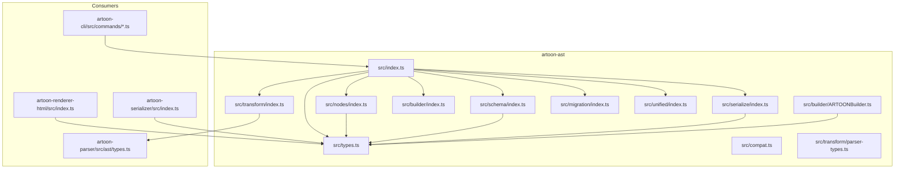
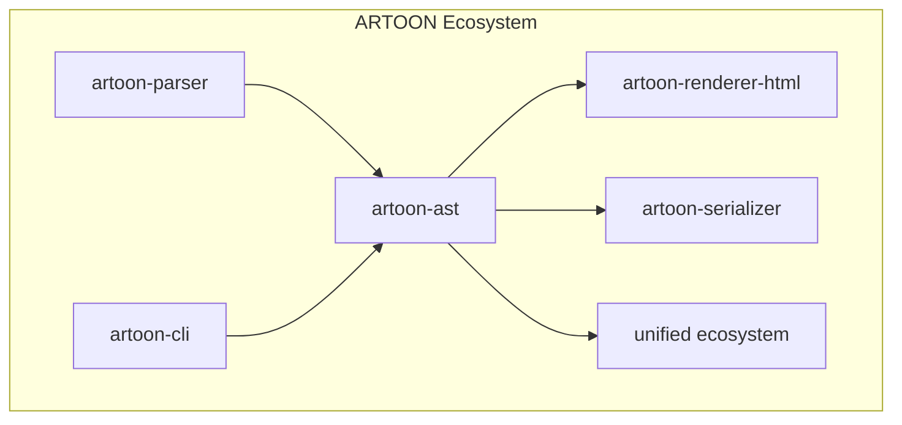
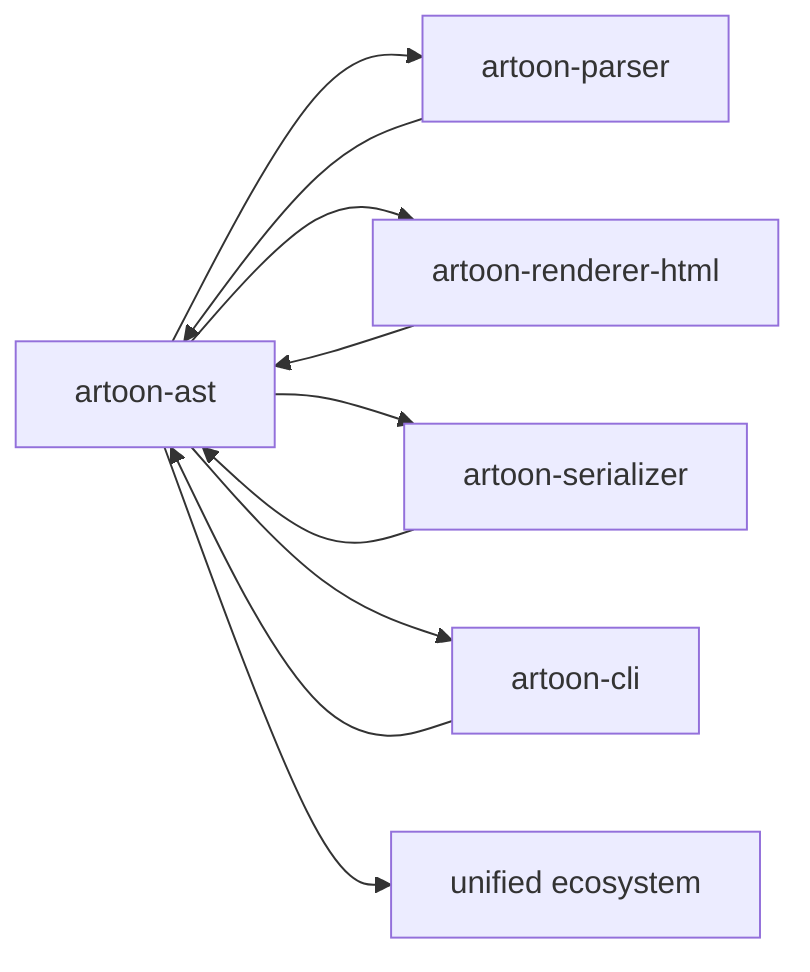

# AST Package

<cite>
**Referenced Files in This Document**
- [artoon-ast/src/index.ts](file://artoon-ast/src/index.ts)
- [artoon-ast/src/types.ts](file://artoon-ast/src/types.ts)
- [artoon-ast/src/compat.ts](file://artoon-ast/src/compat.ts)
- [artoon-ast/src/nodes/index.ts](file://artoon-ast/src/nodes/index.ts)
- [artoon-ast/src/schema/index.ts](file://artoon-ast/src/schema/index.ts)
- [artoon-ast/src/schema/artoon-ast.schema.json](file://artoon-ast/src/schema/artoon-ast.schema.json)
- [artoon-ast/src/serialize/index.ts](file://artoon-ast/src/serialize/index.ts)
- [artoon-ast/src/builder/index.ts](file://artoon-ast/src/builder/index.ts)
- [artoon-ast/src/builder/ARTOONBuilder.ts](file://artoon-ast/src/builder/ARTOONBuilder.ts)
- [artoon-ast/src/migration/index.ts](file://artoon-ast/src/migration/index.ts)
- [artoon-ast/src/unified/index.ts](file://artoon-ast/src/unified/index.ts)
- [artoon-ast/src/transform/index.ts](file://artoon-ast/src/transform/index.ts)
- [artoon-ast/src/transform/parser-types.ts](file://artoon-ast/src/transform/parser-types.ts)
- [artoon-ast/inventory_artoon_ast/README.md](file://artoon-ast/inventory_artoon_ast/README.md)
- [artoon-ast/inventory_artoon_ast/08-API-REFERENCE.md](file://artoon-ast/inventory_artoon_ast/08-API-REFERENCE.md)
- [artoon-ast/inventory_artoon_ast/09-EXAMPLES.md](file://artoon-ast/inventory_artoon_ast/09-EXAMPLES.md)
- [artoon-ast/inventory_artoon_ast/MIGRATION-GUIDE-V2.md](file://artoon-ast/inventory_artoon_ast/MIGRATION-GUIDE-V2.md)
- [artoon-ast/AST-DOCS/README.md](file://artoon-ast/AST-DOCS/README.md)
- [artoon-ast/AST-DOCS/04-EVOLUTION-STRATEGY.md](file://artoon-ast/AST-DOCS/04-EVOLUTION-STRATEGY.md)
- [artoon-ast/AST-DOCS/05-FAILURE-SURFACES.md](file://artoon-ast/AST-DOCS/05-FAILURE-SURFACES.md)
- [artoon-ast/AST-DOCS/06-EXTENSIBILITY.md](file://artoon-ast/AST-DOCS/06-EXTENSIBILITY.md)
- [artoon-ast/AST-DOCS/07-INTEROPERABILITY.md](file://artoon-ast/AST-DOCS/07-INTEROPERABILITY.md)
- [artoon-ast/AST-DOCS/08-GOVERNANCE-RULES.md](file://artoon-ast/AST-DOCS/08-GOVERNANCE-RULES.md)
- [artoon-ast/AST-DOCS/09-REFACTOR-OPPORTUNITIES.md](file://artoon-ast/AST-DOCS/09-REFACTOR-OPPORTUNITIES.md)
- [artoon-ast/AST-DOCS/QUICK-REFERENCE.md](file://artoon-ast/AST-DOCS/QUICK-REFERENCE.md)
- [artoon-ast/README.md](file://artoon-ast/README.md)
- [artoon-ast/package.json](file://artoon-ast/package.json)
- [artoon-ast/tests/nodes.test.ts](file://artoon-ast/tests/nodes.test.ts)
- [artoon-ast/tests/compat.test.ts](file://artoon-ast/tests/compat.test.ts)
- [artoon-ast/tests/serialize.test.ts](file://artoon-ast/tests/serialize.test.ts)
- [artoon-ast/tests/transform.test.ts](file://artoon-ast/tests/transform.test.ts)
- [artoon-ast/tests/types.test.ts](file://artoon-ast/tests/types.test.ts)
- [artoon-ast/tests/builder.test.ts](file://artoon-ast/tests/builder.test.ts)
- [artoon-parser/src/ast/types.ts](file://artoon-parser/src/ast/types.ts)
- [artoon-parser/src/types.ts](file://artoon-parser/src/types.ts)
- [artoon-renderer-html/src/index.ts](file://artoon-renderer-html/src/index.ts)
- [artoon-serializer/src/index.ts](file://artoon-serializer/src/index.ts)
- [artoon-cli/src/commands/migrate.ts](file://artoon-cli/src/commands/migrate.ts)
- [artoon-cli/src/commands/parse.ts](file://artoon-cli/src/commands/parse.ts)
- [artoon-cli/src/commands/render.ts](file://artoon-cli/src/commands/render.ts)
- [artoon-cli/src/commands/validate.ts](file://artoon-cli/src/commands/validate.ts)
</cite>

## Table of Contents
1. [Introduction](#introduction)
2. [Project Structure](#project-structure)
3. [Core Components](#core-components)
4. [Architecture Overview](#architecture-overview)
5. [Detailed Component Analysis](#detailed-component-analysis)
6. [Dependency Analysis](#dependency-analysis)
7. [Performance Considerations](#performance-considerations)
8. [Troubleshooting Guide](#troubleshooting-guide)
9. [Conclusion](#conclusion)
10. [Appendices](#appendices)

## Introduction
This document describes the ARTOON AST (Abstract Syntax Tree) package that defines the canonical AST structure, node types, and interfaces used across the ARTOON ecosystem. It explains how the AST supports version migrations, schema validation, serialization, and interoperability with parsing, rendering, and CLI tooling. It also documents the node hierarchy (DocumentNode, BlockNode, InlineContent, CompoundComponent), transformation utilities, and type safety mechanisms. Guidance is included for AST manipulation, traversal patterns, node creation, and backwards compatibility considerations.

## Project Structure
The ARTOON AST package is organized around core concerns:
- Types and interfaces define the canonical AST contract.
- Nodes module exports the node taxonomy and factories.
- Schema module provides JSON Schema validation and metadata.
- Serialize module handles AST serialization to various formats.
- Builder module offers a fluent API for constructing AST nodes.
- Migration module supports version upgrades and compatibility layers.
- Transform module bridges ASTs with parser types and other ecosystems.
- Unified module integrates with unified ecosystem tooling.
- Tests validate behavior across modules.

**Diagram sources**
- [artoon-ast/src/index.ts](file://artoon-ast/src/index.ts)
- [artoon-ast/src/types.ts](file://artoon-ast/src/types.ts)
- [artoon-ast/src/nodes/index.ts](file://artoon-ast/src/nodes/index.ts)
- [artoon-ast/src/schema/index.ts](file://artoon-ast/src/schema/index.ts)
- [artoon-ast/src/serialize/index.ts](file://artoon-ast/src/serialize/index.ts)
- [artoon-ast/src/builder/index.ts](file://artoon-ast/src/builder/index.ts)
- [artoon-ast/src/builder/ARTOONBuilder.ts](file://artoon-ast/src/builder/ARTOONBuilder.ts)
- [artoon-ast/src/migration/index.ts](file://artoon-ast/src/migration/index.ts)
- [artoon-ast/src/unified/index.ts](file://artoon-ast/src/unified/index.ts)
- [artoon-ast/src/transform/index.ts](file://artoon-ast/src/transform/index.ts)
- [artoon-ast/src/transform/parser-types.ts](file://artoon-ast/src/transform/parser-types.ts)
- [artoon-parser/src/ast/types.ts](file://artoon-parser/src/ast/types.ts)
- [artoon-renderer-html/src/index.ts](file://artoon-renderer-html/src/index.ts)
- [artoon-serializer/src/index.ts](file://artoon-serializer/src/index.ts)
- [artoon-cli/src/commands/migrate.ts](file://artoon-cli/src/commands/migrate.ts)
- [artoon-cli/src/commands/parse.ts](file://artoon-cli/src/commands/parse.ts)
- [artoon-cli/src/commands/render.ts](file://artoon-cli/src/commands/render.ts)
- [artoon-cli/src/commands/validate.ts](file://artoon-cli/src/commands/validate.ts)

**Section sources**
- [artoon-ast/src/index.ts](file://artoon-ast/src/index.ts)
- [artoon-ast/src/types.ts](file://artoon-ast/src/types.ts)
- [artoon-ast/src/nodes/index.ts](file://artoon-ast/src/nodes/index.ts)
- [artoon-ast/src/schema/index.ts](file://artoon-ast/src/schema/index.ts)
- [artoon-ast/src/serialize/index.ts](file://artoon-ast/src/serialize/index.ts)
- [artoon-ast/src/builder/index.ts](file://artoon-ast/src/builder/index.ts)
- [artoon-ast/src/builder/ARTOONBuilder.ts](file://artoon-ast/src/builder/ARTOONBuilder.ts)
- [artoon-ast/src/migration/index.ts](file://artoon-ast/src/migration/index.ts)
- [artoon-ast/src/unified/index.ts](file://artoon-ast/src/unified/index.ts)
- [artoon-ast/src/transform/index.ts](file://artoon-ast/src/transform/index.ts)
- [artoon-ast/src/transform/parser-types.ts](file://artoon-ast/src/transform/parser-types.ts)

## Core Components
- Canonical AST types and interfaces define the node taxonomy and relationships.
- Node factories and builders enable safe construction of AST nodes.
- Schema validation ensures ASTs conform to the published JSON Schema.
- Serialization converts ASTs to target formats.
- Migration utilities support evolving AST versions while preserving compatibility.
- Transformation utilities bridge ASTs with parser types and external ecosystems.
- Compatibility layer maintains backwards compatibility across versions.

Key responsibilities:
- Define and export the AST contract via types and factories.
- Enforce type safety and validation rules.
- Provide ergonomic APIs for AST creation and manipulation.
- Support schema-driven validation and serialization.
- Enable seamless integration with parser, renderer, serializer, and CLI.

**Section sources**
- [artoon-ast/src/types.ts](file://artoon-ast/src/types.ts)
- [artoon-ast/src/nodes/index.ts](file://artoon-ast/src/nodes/index.ts)
- [artoon-ast/src/builder/ARTOONBuilder.ts](file://artoon-ast/src/builder/ARTOONBuilder.ts)
- [artoon-ast/src/schema/index.ts](file://artoon-ast/src/schema/index.ts)
- [artoon-ast/src/serialize/index.ts](file://artoon-ast/src/serialize/index.ts)
- [artoon-ast/src/migration/index.ts](file://artoon-ast/src/migration/index.ts)
- [artoon-ast/src/compat.ts](file://artoon-ast/src/compat.ts)
- [artoon-ast/src/transform/index.ts](file://artoon-ast/src/transform/index.ts)

## Architecture Overview
The ARTOON AST package forms the central contract for the ARTOON ecosystem. It interacts with:
- Parser: Produces ASTs from source text.
- Renderer: Converts ASTs to HTML.
- Serializer: Serializes ASTs to other formats.
- CLI: Validates, migrates, parses, and renders documents.
- Unified: Integrates with unified ecosystem tooling.

**Diagram sources**
- [artoon-ast/src/index.ts](file://artoon-ast/src/index.ts)
- [artoon-parser/src/ast/types.ts](file://artoon-parser/src/ast/types.ts)
- [artoon-renderer-html/src/index.ts](file://artoon-renderer-html/src/index.ts)
- [artoon-serializer/src/index.ts](file://artoon-serializer/src/index.ts)
- [artoon-cli/src/commands/migrate.ts](file://artoon-cli/src/commands/migrate.ts)
- [artoon-cli/src/commands/parse.ts](file://artoon-cli/src/commands/parse.ts)
- [artoon-cli/src/commands/render.ts](file://artoon-cli/src/commands/render.ts)
- [artoon-cli/src/commands/validate.ts](file://artoon-cli/src/commands/validate.ts)
- [artoon-ast/src/unified/index.ts](file://artoon-ast/src/unified/index.ts)

## Detailed Component Analysis

### Canonical AST Types and Interfaces
The AST types define the node taxonomy and relationships. They include:
- DocumentNode: Root container for a document.
- BlockNode: Structural blocks (e.g., paragraphs, headings, lists).
- InlineContent: Inline-level content (e.g., text, links, marks).
- CompoundComponent: Composite structures that combine blocks and/or inline content.

Type safety features:
- Strict typing for node kinds and fields.
- Discriminated unions for node kinds.
- Validation rules enforced via schema and runtime checks.
- Immutable-like patterns where applicable.

Integration:
- Parser produces ASTs that conform to these types.
- Renderer consumes ASTs to produce HTML.
- Serializer transforms ASTs to other formats.
- CLI validates and migrates ASTs.

**Section sources**
- [artoon-ast/src/types.ts](file://artoon-ast/src/types.ts)
- [artoon-parser/src/ast/types.ts](file://artoon-parser/src/ast/types.ts)
- [artoon-renderer-html/src/index.ts](file://artoon-renderer-html/src/index.ts)
- [artoon-serializer/src/index.ts](file://artoon-serializer/src/index.ts)

### Node Hierarchy and Factories
The nodes module exports factories and enumerations for constructing nodes. It organizes nodes by kind and provides helpers for building hierarchical structures.

Node categories:
- DocumentNode: Top-level container.
- BlockNode: Paragraphs, headings, lists, tables, etc.
- InlineContent: Text runs, links, marks, separators.
- CompoundComponent: Containers combining blocks and inline content.

Traversal patterns:
- Depth-first traversal for recursive structures.
- Breadth-first traversal for level-wise processing.
- Visitor pattern for transformations and validations.

Examples of manipulation:
- Inserting a new block after a given position.
- Wrapping inline content in a mark.
- Splitting or merging blocks at boundaries.

**Section sources**
- [artoon-ast/src/nodes/index.ts](file://artoon-ast/src/nodes/index.ts)
- [artoon-ast/src/types.ts](file://artoon-ast/src/types.ts)

### Builder API
The builder module provides a fluent API for constructing AST nodes safely. The ARTOONBuilder centralizes creation logic, ensuring nodes adhere to type contracts and invariants.

Capabilities:
- Fluent chaining for nested node construction.
- Type-safe setters for required and optional fields.
- Validation during build to prevent malformed nodes.
- Convenience methods for common node combinations.

Usage patterns:
- Build a paragraph with inline content.
- Compose a compound component from blocks and inline elements.
- Construct a document with ordered blocks.

**Section sources**
- [artoon-ast/src/builder/index.ts](file://artoon-ast/src/builder/index.ts)
- [artoon-ast/src/builder/ARTOONBuilder.ts](file://artoon-ast/src/builder/ARTOONBuilder.ts)

### Schema Validation
The schema module publishes a JSON Schema that validates ASTs. It ensures:
- Correct node kinds and field presence.
- Proper nesting and containment rules.
- Data type correctness for all fields.

Validation pipeline:
- Load schema from JSON Schema file.
- Validate AST against schema before rendering or serialization.
- Report detailed errors for invalid structures.

Integration:
- CLI validate command leverages schema validation.
- Renderer and serializer can optionally validate prior to operation.

**Section sources**
- [artoon-ast/src/schema/index.ts](file://artoon-ast/src/schema/index.ts)
- [artoon-ast/src/schema/artoon-ast.schema.json](file://artoon-ast/src/schema/artoon-ast.schema.json)
- [artoon-cli/src/commands/validate.ts](file://artoon-cli/src/commands/validate.ts)

### Serialization
The serialize module converts ASTs into target formats. It includes serializers for:
- HTML (via renderer integration).
- Other structured formats (as supported by the serializer package).

Serialization pipeline:
- Traverse AST and map nodes to serialized form.
- Apply formatting rules and normalization.
- Produce output artifacts suitable for downstream consumers.

**Section sources**
- [artoon-ast/src/serialize/index.ts](file://artoon-ast/src/serialize/index.ts)
- [artoon-renderer-html/src/index.ts](file://artoon-renderer-html/src/index.ts)
- [artoon-serializer/src/index.ts](file://artoon-serializer/src/index.ts)

### Migration and Compatibility
The migration module supports evolving AST versions while maintaining backwards compatibility. It includes:
- Version detection and upgrade paths.
- Compatibility shims for legacy structures.
- Migration utilities invoked by CLI and tooling.

Compatibility layer:
- Detects legacy ASTs and applies transformations.
- Ensures new ASTs remain compatible with older consumers.
- Provides migration scripts and guidance.

**Section sources**
- [artoon-ast/src/migration/index.ts](file://artoon-ast/src/migration/index.ts)
- [artoon-ast/src/compat.ts](file://artoon-ast/src/compat.ts)
- [artoon-cli/src/commands/migrate.ts](file://artoon-cli/src/commands/migrate.ts)
- [artoon-ast/inventory_artoon_ast/MIGRATION-GUIDE-V2.md](file://artoon-ast/inventory_artoon_ast/MIGRATION-GUIDE-V2.md)

### Transform Utilities
The transform module bridges ASTs with parser types and other ecosystems. It includes:
- Type conversions between AST and parser representations.
- Parser-type compatibility for interoperability.

Use cases:
- Converting parsed tokens into AST nodes.
- Normalizing ASTs produced by different parsers.
- Supporting cross-ecosystem transformations.

**Section sources**
- [artoon-ast/src/transform/index.ts](file://artoon-ast/src/transform/index.ts)
- [artoon-ast/src/transform/parser-types.ts](file://artoon-ast/src/transform/parser-types.ts)
- [artoon-parser/src/types.ts](file://artoon-parser/src/types.ts)

### Unified Integration
The unified module integrates ASTs with the unified ecosystem, enabling:
- Pluggable processors and transformers.
- Standardized handling of ASTs across tools.

**Section sources**
- [artoon-ast/src/unified/index.ts](file://artoon-ast/src/unified/index.ts)

### Examples and Best Practices
Examples of AST manipulation and traversal are documented in the inventory and quick reference materials. Typical patterns include:
- Building documents with the builder API.
- Traversing nodes to apply transformations.
- Validating ASTs before rendering or serialization.
- Using migration utilities to update legacy ASTs.

**Section sources**
- [artoon-ast/inventory_artoon_ast/09-EXAMPLES.md](file://artoon-ast/inventory_artoon_ast/09-EXAMPLES.md)
- [artoon-ast/AST-DOCS/QUICK-REFERENCE.md](file://artoon-ast/AST-DOCS/QUICK-REFERENCE.md)

## Dependency Analysis
The ARTOON AST package depends on and integrates with several other packages in the ecosystem. The following diagram shows key dependencies and interactions.

**Diagram sources**
- [artoon-ast/src/index.ts](file://artoon-ast/src/index.ts)
- [artoon-parser/src/ast/types.ts](file://artoon-parser/src/ast/types.ts)
- [artoon-renderer-html/src/index.ts](file://artoon-renderer-html/src/index.ts)
- [artoon-serializer/src/index.ts](file://artoon-serializer/src/index.ts)
- [artoon-cli/src/commands/migrate.ts](file://artoon-cli/src/commands/migrate.ts)
- [artoon-cli/src/commands/parse.ts](file://artoon-cli/src/commands/parse.ts)
- [artoon-cli/src/commands/render.ts](file://artoon-cli/src/commands/render.ts)
- [artoon-cli/src/commands/validate.ts](file://artoon-cli/src/commands/validate.ts)
- [artoon-ast/src/unified/index.ts](file://artoon-ast/src/unified/index.ts)

**Section sources**
- [artoon-ast/src/index.ts](file://artoon-ast/src/index.ts)
- [artoon-ast/package.json](file://artoon-ast/package.json)

## Performance Considerations
- Prefer immutable-like patterns to minimize mutation overhead.
- Use targeted traversals (depth-first or breadth-first) appropriate to the task.
- Validate ASTs early to avoid expensive downstream failures.
- Cache computed properties or derived structures when beneficial.
- Keep transformations pure where possible to improve testability and performance.

## Troubleshooting Guide
Common issues and resolutions:
- Validation failures: Use the schema validator to identify invalid nodes and correct field types or missing required fields.
- Migration errors: Run the migration command to upgrade legacy ASTs to the current schema.
- Builder misuse: Ensure all required fields are set and types match expectations; use the builder API to construct nodes safely.
- Serialization problems: Verify ASTs are valid and normalized before serialization.

Diagnostic steps:
- Validate ASTs with the CLI validate command.
- Inspect ASTs with the CLI parse command to confirm structure.
- Review migration logs and apply recommended fixes.

**Section sources**
- [artoon-cli/src/commands/validate.ts](file://artoon-cli/src/commands/validate.ts)
- [artoon-cli/src/commands/migrate.ts](file://artoon-cli/src/commands/migrate.ts)
- [artoon-cli/src/commands/parse.ts](file://artoon-cli/src/commands/parse.ts)
- [artoon-ast/tests/compat.test.ts](file://artoon-ast/tests/compat.test.ts)
- [artoon-ast/tests/serialize.test.ts](file://artoon-ast/tests/serialize.test.ts)
- [artoon-ast/tests/transform.test.ts](file://artoon-ast/tests/transform.test.ts)
- [artoon-ast/tests/types.test.ts](file://artoon-ast/tests/types.test.ts)
- [artoon-ast/tests/builder.test.ts](file://artoon-ast/tests/builder.test.ts)

## Conclusion
The ARTOON AST package defines a robust, type-safe, and extensible canonical structure for representing ARTOON documents. It provides strong validation, serialization, migration, and transformation capabilities, and integrates seamlessly with the broader ARTOON ecosystem. By following the documented patterns and leveraging the provided utilities, developers can reliably manipulate, validate, and evolve ASTs across versions while maintaining compatibility and interoperability.

## Appendices

### Evolution Strategy and Backwards Compatibility
- Versioning: Maintain clear version identifiers and migration paths.
- Compatibility layer: Provide compatibility shims for legacy ASTs.
- Schema evolution: Extend schema with additive changes and deprecate fields gradually.
- Testing: Include comprehensive tests for migration and compatibility scenarios.

**Section sources**
- [artoon-ast/AST-DOCS/04-EVOLUTION-STRATEGY.md](file://artoon-ast/AST-DOCS/04-EVOLUTION-STRATEGY.md)
- [artoon-ast/AST-DOCS/05-FAILURE-SURFACES.md](file://artoon-ast/AST-DOCS/05-FAILURE-SURFACES.md)
- [artoon-ast/AST-DOCS/06-EXTENSIBILITY.md](file://artoon-ast/AST-DOCS/06-EXTENSIBILITY.md)
- [artoon-ast/AST-DOCS/07-INTEROPERABILITY.md](file://artoon-ast/AST-DOCS/07-INTEROPERABILITY.md)
- [artoon-ast/AST-DOCS/08-GOVERNANCE-RULES.md](file://artoon-ast/AST-DOCS/08-GOVERNANCE-RULES.md)
- [artoon-ast/AST-DOCS/09-REFACTOR-OPPORTUNITIES.md](file://artoon-ast/AST-DOCS/09-REFACTOR-OPPORTUNITIES.md)
- [artoon-ast/inventory_artoon_ast/MIGRATION-GUIDE-V2.md](file://artoon-ast/inventory_artoon_ast/MIGRATION-GUIDE-V2.md)

### API Reference and Quick Reference
- API reference and examples are available in the inventory and quick reference documents.

**Section sources**
- [artoon-ast/inventory_artoon_ast/08-API-REFERENCE.md](file://artoon-ast/inventory_artoon_ast/08-API-REFERENCE.md)
- [artoon-ast/inventory_artoon_ast/09-EXAMPLES.md](file://artoon-ast/inventory_artoon_ast/09-EXAMPLES.md)
- [artoon-ast/AST-DOCS/QUICK-REFERENCE.md](file://artoon-ast/AST-DOCS/QUICK-REFERENCE.md)