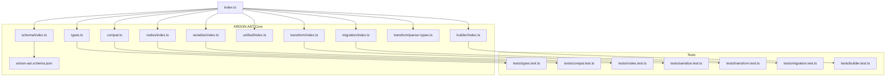
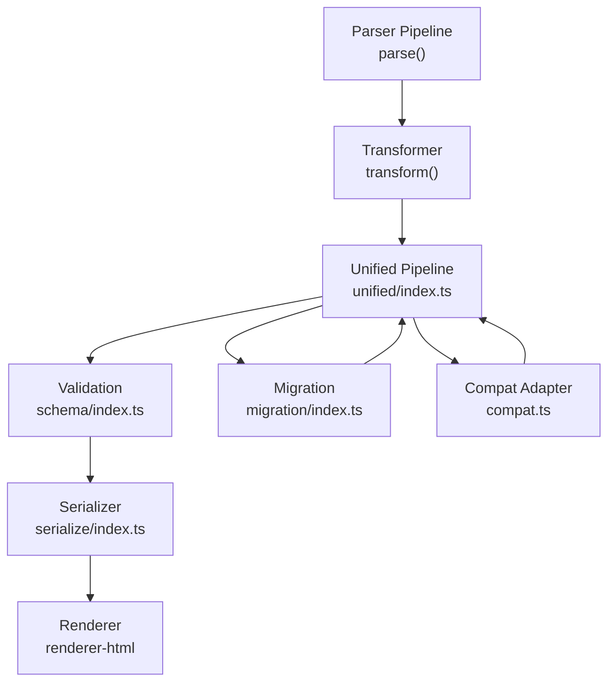
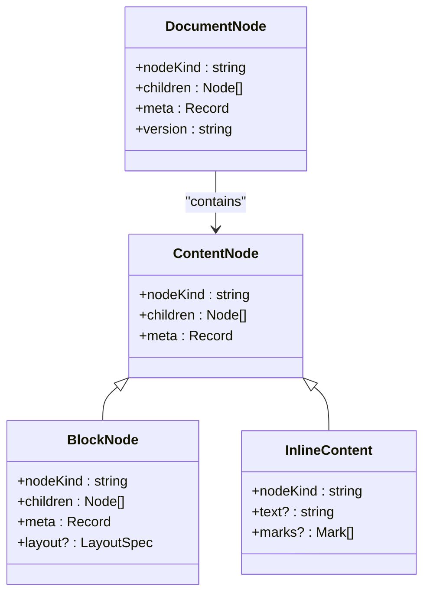
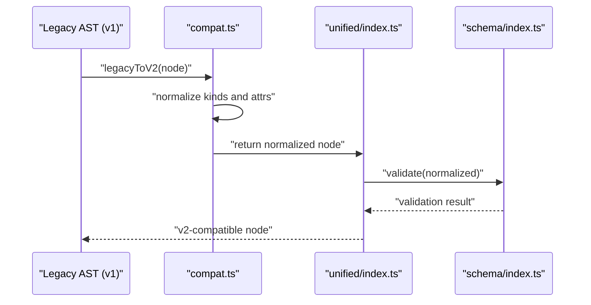
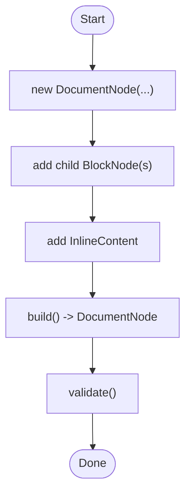
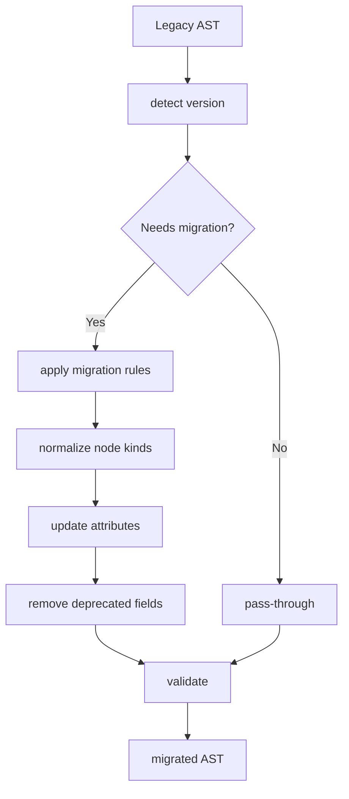
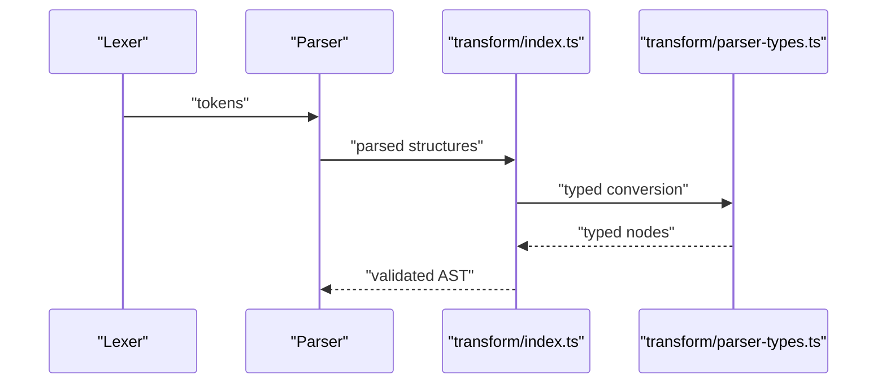
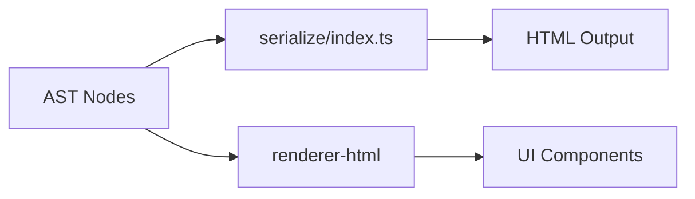
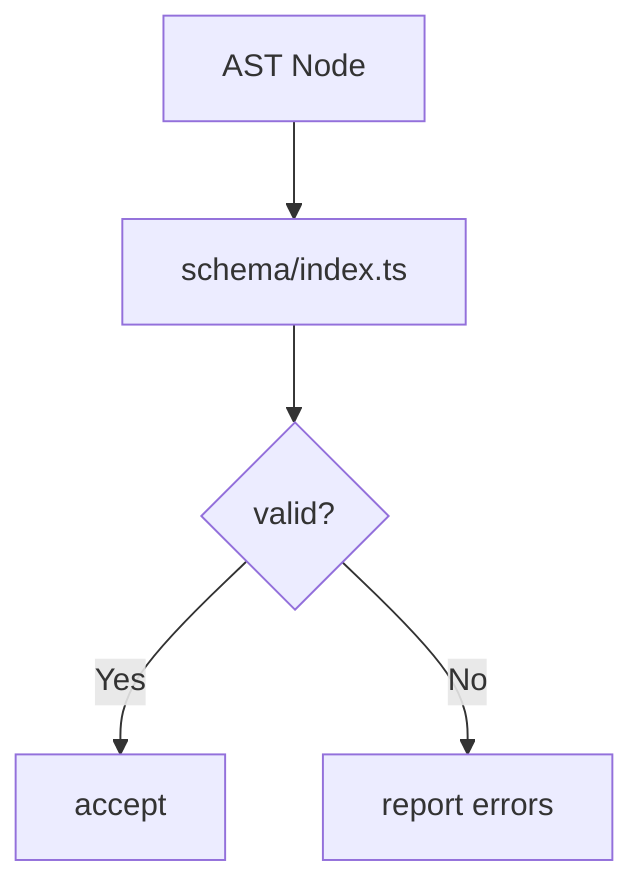
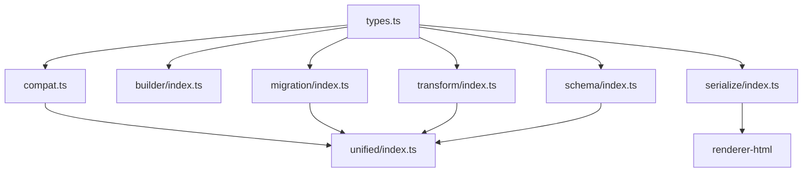

# AST Types and Interfaces

<cite>
**Referenced Files in This Document**
- [types.ts](file://artoon-ast/src/types.ts)
- [compat.ts](file://artoon-ast/src/compat.ts)
- [index.ts](file://artoon-ast/src/index.ts)
- [nodes/index.ts](file://artoon-ast/src/nodes/index.ts)
- [builder/index.ts](file://artoon-ast/src/builder/index.ts)
- [migration/index.ts](file://artoon-ast/src/migration/index.ts)
- [unified/index.ts](file://artoon-ast/src/unified/index.ts)
- [serialize/index.ts](file://artoon-ast/src/serialize/index.ts)
- [transform/index.ts](file://artoon-ast/src/transform/index.ts)
- [transform/parser-types.ts](file://artoon-ast/src/transform/parser-types.ts)
- [schema/index.ts](file://artoon-ast/src/schema/index.ts)
- [artoon-ast.schema.json](file://artoon-ast/src/schema/artoon-ast.schema.json)
- [inventory_artoon_ast/README.md](file://artoon-ast/inventory_artoon_ast/README.md)
- [inventory_artoon_ast/MIGRATION-GUIDE-V2.md](file://artoon-ast/inventory_artoon_ast/MIGRATION-GUIDE-V2.md)
- [inventory_artoon_ast/04-NODE-TYPES.md](file://artoon-ast/inventory_artoon_ast/04-NODE-TYPES.md)
- [inventory_artoon_ast/05-INVARIANTS.md](file://artoon-ast/inventory_artoon_ast/05-INVARIANTS.md)
- [inventory_artoon_ast/08-API-REFERENCE.md](file://artoon-ast/inventory_artoon_ast/08-API-REFERENCE.md)
- [inventory_artoon_ast/09-EXAMPLES.md](file://artoon-ast/inventory_artoon_ast/09-EXAMPLES.md)
- [AST-DOCS/01-STRUCTURAL-ROLE.md](file://artoon-ast/AST-DOCS/01-STRUCTURAL-ROLE.md)
- [AST-DOCS/02-CONTRACT-LAYER.md](file://artoon-ast/AST-DOCS/02-CONTRACT-LAYER.md)
- [AST-DOCS/03-DATA-SEMANTICS.md](file://artoon-ast/AST-DOCS/03-DATA-SEMANTICS.md)
- [AST-DOCS/04-EVOLUTION-STRATEGY.md](file://artoon-ast/AST-DOCS/04-EVOLUTION-STRATEGY.md)
- [AST-DOCS/05-FAILURE-SURFACES.md](file://artoon-ast/AST-DOCS/05-FAILURE-SURFACES.md)
- [AST-DOCS/06-EXTENSIBILITY.md](file://artoon-ast/AST-DOCS/06-EXTENSIBILITY.md)
- [AST-DOCS/07-INTEROPERABILITY.md](file://artoon-ast/AST-DOCS/07-INTEROPERABILITY.md)
- [AST-DOCS/08-GOVERNANCE-RULES.md](file://artoon-ast/AST-DOCS/08-GOVERNANCE-RULES.md)
- [AST-DOCS/09-REFACTOR-OPPORTUNITIES.md](file://artoon-ast/AST-DOCS/09-REFACTOR-OPPORTUNITIES.md)
- [AST-DOCS/10-FINAL-VERDICT.md](file://artoon-ast/AST-DOCS/10-FINAL-VERDICT.md)
- [artoon-ast-dev/01-remove-table-parsing-duplication.md](file://artoon-ast/artoon-ast-dev/01-remove-table-parsing-duplication.md)
- [artoon-ast-dev/03-eliminate-any-transform.md](file://artoon-ast/artoon-ast-dev/03-eliminate-any-transform.md)
- [artoon-ast-dev/04-fluent-builder-api.md](file://artoon-ast/artoon-ast-dev/04-fluent-builder-api.md)
- [artoon-ast-dev/05-v3-migration-tool.md](file://artoon-ast/artoon-ast-dev/05-v3-migration-tool.md)
- [tests/types.test.ts](file://artoon-ast/tests/types.test.ts)
- [tests/compat.test.ts](file://artoon-ast/tests/compat.test.ts)
- [tests/nodes.test.ts](file://artoon-ast/tests/nodes.test.ts)
- [tests/serialize.test.ts](file://artoon-ast/tests/serialize.test.ts)
- [tests/transform.test.ts](file://artoon-ast/tests/transform.test.ts)
- [tests/migration.test.ts](file://artoon-ast/tests/migration.test.ts)
- [tests/builder.test.ts](file://artoon-ast/tests/builder.test.ts)
</cite>

## Table of Contents
1. [Introduction](#introduction)
2. [Project Structure](#project-structure)
3. [Core Components](#core-components)
4. [Architecture Overview](#architecture-overview)
5. [Detailed Component Analysis](#detailed-component-analysis)
6. [Dependency Analysis](#dependency-analysis)
7. [Performance Considerations](#performance-considerations)
8. [Troubleshooting Guide](#troubleshooting-guide)
9. [Conclusion](#conclusion)
10. [Appendices](#appendices)

## Introduction
This document describes the ARTOON AST type system and interfaces that unify AST representations across v1 and v2, and bridge parsing, transformation, serialization, and rendering. It focuses on core node types (ContentNode, BlockNode, InlineContent, DocumentNode), their relationships, type safety mechanisms, interface contracts, validation rules, and migration strategies. It also documents evolution from legacy types to modern unified interfaces and provides guidance for compatibility and upgrades.

## Project Structure
The ARTOON AST package organizes type definitions, compatibility shims, builders, migrations, unified pipeline, schema, and tests under a cohesive module structure. Key areas:
- Type definitions and contracts: [types.ts](file://artoon-ast/src/types.ts)
- Compatibility layer for v1/v2 bridging: [compat.ts](file://artoon-ast/src/compat.ts)
- Public API surface and re-exports: [index.ts](file://artoon-ast/src/index.ts)
- Node type registry and helpers: [nodes/index.ts](file://artoon-ast/src/nodes/index.ts)
- Fluent builder API: [builder/index.ts](file://artoon-ast/src/builder/index.ts)
- Migration utilities: [migration/index.ts](file://artoon-ast/src/migration/index.ts)
- Unified pipeline entry: [unified/index.ts](file://artoon-ast/src/unified/index.ts)
- Serialization and transformation: [serialize/index.ts](file://artoon-ast/src/serialize/index.ts), [transform/index.ts](file://artoon-ast/src/transform/index.ts), [transform/parser-types.ts](file://artoon-ast/src/transform/parser-types.ts)
- Schema and JSON schema: [schema/index.ts](file://artoon-ast/src/schema/index.ts), [artoon-ast.schema.json](file://artoon-ast/src/schema/artoon-ast.schema.json)
- Developer and user documentation: [AST-DOCS](file://artoon-ast/AST-DOCS/README.md), [inventory_artoon_ast](file://artoon-ast/inventory_artoon_ast/README.md), [artoon-ast-dev](file://artoon-ast/artoon-ast-dev/roadmap.md)

**Diagram sources**
- [index.ts:1-200](file://artoon-ast/src/index.ts#L1-L200)
- [types.ts:1-200](file://artoon-ast/src/types.ts#L1-L200)
- [compat.ts:1-200](file://artoon-ast/src/compat.ts#L1-L200)
- [nodes/index.ts:1-200](file://artoon-ast/src/nodes/index.ts#L1-L200)
- [builder/index.ts:1-200](file://artoon-ast/src/builder/index.ts#L1-L200)
- [migration/index.ts:1-200](file://artoon-ast/src/migration/index.ts#L1-L200)
- [unified/index.ts:1-200](file://artoon-ast/src/unified/index.ts#L1-L200)
- [serialize/index.ts:1-200](file://artoon-ast/src/serialize/index.ts#L1-L200)
- [transform/index.ts:1-200](file://artoon-ast/src/transform/index.ts#L1-L200)
- [transform/parser-types.ts:1-200](file://artoon-ast/src/transform/parser-types.ts#L1-L200)
- [schema/index.ts:1-200](file://artoon-ast/src/schema/index.ts#L1-L200)
- [artoon-ast.schema.json:1-200](file://artoon-ast/src/schema/artoon-ast.schema.json#L1-L200)

**Section sources**
- [index.ts:1-200](file://artoon-ast/src/index.ts#L1-L200)
- [types.ts:1-200](file://artoon-ast/src/types.ts#L1-L200)

## Core Components
This section outlines the unified AST type system and key interfaces that define content, blocks, inline content, and documents, along with their relationships and contracts.

- ContentNode: A generic base for all content-bearing nodes in the AST. It defines structural and semantic anchors used across block and inline contexts.
- BlockNode: Represents block-level elements with metadata, children, and layout semantics. It extends ContentNode and adds block-specific constraints.
- InlineContent: Represents inline-level content such as text, marks, and links. It is embedded within block content and supports rich inline formatting.
- DocumentNode: Root container for a document tree, composed of top-level blocks and metadata. It enforces document-level invariants and traversal contracts.

Type safety mechanisms:
- Discriminated unions via nodeKind/type fields to enable safe narrowing.
- Strict property typing for children, attributes, and metadata.
- Validation rules enforced at construction and during transformations.

Interface contracts:
- All nodes implement a common shape for identity, kind, and metadata.
- Children arrays are typed to enforce parent-child relationships.
- InlineContent is constrained to appear only within appropriate block contexts.

Validation rules:
- Required fields per node kind are enforced.
- Structural constraints (e.g., block nesting, inline containment) are validated.
- Schema-backed validation ensures conformance to the ARTOON AST specification.

Examples of usage patterns:
- Constructing nodes via the fluent builder API.
- Casting and type guards for safe runtime checks.
- Transforming legacy v1 nodes into v2 unified nodes.

Migration strategies:
- Compatibility adapters translate v1 AST into v2 shapes.
- Migration utilities upgrade older node kinds and attributes.
- Schema validation ensures backward-compatible evolution.

**Section sources**
- [types.ts:1-200](file://artoon-ast/src/types.ts#L1-L200)
- [compat.ts:1-200](file://artoon-ast/src/compat.ts#L1-L200)
- [nodes/index.ts:1-200](file://artoon-ast/src/nodes/index.ts#L1-L200)
- [builder/index.ts:1-200](file://artoon-ast/src/builder/index.ts#L1-L200)
- [schema/index.ts:1-200](file://artoon-ast/src/schema/index.ts#L1-L200)
- [artoon-ast.schema.json:1-200](file://artoon-ast/src/schema/artoon-ast.schema.json#L1-L200)

## Architecture Overview
The unified AST architecture integrates parsing, transformation, serialization, and rendering through a cohesive pipeline. The compatibility layer bridges v1 and v2 representations, while the builder and migration utilities support ergonomic authoring and upgrades.

**Diagram sources**
- [unified/index.ts:1-200](file://artoon-ast/src/unified/index.ts#L1-L200)
- [transform/index.ts:1-200](file://artoon-ast/src/transform/index.ts#L1-L200)
- [serialize/index.ts:1-200](file://artoon-ast/src/serialize/index.ts#L1-L200)
- [schema/index.ts:1-200](file://artoon-ast/src/schema/index.ts#L1-L200)
- [compat.ts:1-200](file://artoon-ast/src/compat.ts#L1-L200)
- [migration/index.ts:1-200](file://artoon-ast/src/migration/index.ts#L1-L200)

## Detailed Component Analysis

### Type System and Contracts
The type system centers on a small set of core interfaces and discriminated unions that represent the AST. These types are defined in the core types module and enforced by tests and schema.

Key contracts:
- Identity and kind: Every node exposes a stable nodeKind for runtime identification.
- Children typing: Parent-child relationships are typed to prevent invalid compositions.
- Metadata: Arbitrary metadata is supported but validated against schema.
- Inline constraints: InlineContent is only valid within block content and respects mark boundaries.

Validation:
- Schema validation ensures structural and semantic correctness.
- Unit tests assert type safety and invariant preservation.

**Diagram sources**
- [types.ts:1-200](file://artoon-ast/src/types.ts#L1-L200)
- [schema/index.ts:1-200](file://artoon-ast/src/schema/index.ts#L1-L200)

**Section sources**
- [types.ts:1-200](file://artoon-ast/src/types.ts#L1-L200)
- [schema/index.ts:1-200](file://artoon-ast/src/schema/index.ts#L1-L200)
- [tests/types.test.ts:1-200](file://artoon-ast/tests/types.test.ts#L1-L200)

### Compatibility Layer (v1 to v2 Bridge)
The compatibility module translates legacy AST representations into the unified v2 model, preserving semantics while normalizing structure.

Compatibility strategies:
- Node kind normalization and attribute mapping.
- Structural adjustments to align with v2 invariants.
- Preserving user-authored metadata and content semantics.

**Diagram sources**
- [compat.ts:1-200](file://artoon-ast/src/compat.ts#L1-L200)
- [unified/index.ts:1-200](file://artoon-ast/src/unified/index.ts#L1-L200)
- [schema/index.ts:1-200](file://artoon-ast/src/schema/index.ts#L1-L200)

**Section sources**
- [compat.ts:1-200](file://artoon-ast/src/compat.ts#L1-L200)
- [tests/compat.test.ts:1-200](file://artoon-ast/tests/compat.test.ts#L1-L200)

### Fluent Builder API
The builder provides a fluent, type-safe way to construct AST nodes with minimal boilerplate.

Usage patterns:
- Chainable methods for adding blocks and inline content.
- Automatic type inference for node kinds and children.
- Validation at build time to catch structural errors early.

**Diagram sources**
- [builder/index.ts:1-200](file://artoon-ast/src/builder/index.ts#L1-L200)
- [tests/builder.test.ts:1-200](file://artoon-ast/tests/builder.test.ts#L1-L200)

**Section sources**
- [builder/index.ts:1-200](file://artoon-ast/src/builder/index.ts#L1-L200)
- [tests/builder.test.ts:1-200](file://artoon-ast/tests/builder.test.ts#L1-L200)

### Migration Utilities
Migration tools assist in upgrading older AST versions to the current unified schema, handling breaking changes and deprecated fields.

Migration strategies:
- Version detection and selective transformation.
- Attribute normalization and deprecation handling.
- Schema-aligned validation post-migration.

**Diagram sources**
- [migration/index.ts:1-200](file://artoon-ast/src/migration/index.ts#L1-L200)
- [tests/migration.test.ts:1-200](file://artoon-ast/tests/migration.test.ts#L1-L200)

**Section sources**
- [migration/index.ts:1-200](file://artoon-ast/src/migration/index.ts#L1-L200)
- [tests/migration.test.ts:1-200](file://artoon-ast/tests/migration.test.ts#L1-L200)

### Transformation and Parser Types
Transformation utilities convert parsed tokens and structures into typed AST nodes, ensuring consistent representation across the pipeline.

Parser types:
- Strongly-typed intermediate representations for blocks, inline, and compound structures.
- Conversion helpers to produce ContentNode/BlockNode/InlineContent variants.

**Diagram sources**
- [transform/index.ts:1-200](file://artoon-ast/src/transform/index.ts#L1-L200)
- [transform/parser-types.ts:1-200](file://artoon-ast/src/transform/parser-types.ts#L1-L200)

**Section sources**
- [transform/index.ts:1-200](file://artoon-ast/src/transform/index.ts#L1-L200)
- [transform/parser-types.ts:1-200](file://artoon-ast/src/transform/parser-types.ts#L1-L200)
- [tests/transform.test.ts:1-200](file://artoon-ast/tests/transform.test.ts#L1-L200)

### Serialization and Rendering
Serialization converts the AST into target formats (e.g., HTML), while rendering consumes the AST to produce UI components.

Serialization:
- Node-specific serializers for blocks, inline, and compound elements.
- Consistent output formatting and escaping.

Rendering:
- Renderer maps AST to UI components with proper semantics and accessibility.

**Diagram sources**
- [serialize/index.ts:1-200](file://artoon-ast/src/serialize/index.ts#L1-L200)
- [artoon-renderer-html/src/render/index.ts:1-200](file://artoon-renderer-html/src/render/index.ts#L1-L200)

**Section sources**
- [serialize/index.ts:1-200](file://artoon-ast/src/serialize/index.ts#L1-L200)
- [tests/serialize.test.ts:1-200](file://artoon-ast/tests/serialize.test.ts#L1-L200)

### Schema and Validation
Schema validation ensures ASTs conform to the ARTOON AST specification, catching structural and semantic violations early.

Schema:
- JSON schema definition for AST structures.
- Runtime validation in the unified pipeline.

**Diagram sources**
- [schema/index.ts:1-200](file://artoon-ast/src/schema/index.ts#L1-L200)
- [artoon-ast.schema.json:1-200](file://artoon-ast/src/schema/artoon-ast.schema.json#L1-L200)

**Section sources**
- [schema/index.ts:1-200](file://artoon-ast/src/schema/index.ts#L1-L200)
- [artoon-ast.schema.json:1-200](file://artoon-ast/src/schema/artoon-ast.schema.json#L1-L200)

## Dependency Analysis
The AST module exhibits low coupling and high cohesion around core types and contracts. Dependencies flow from types to compat, builder, migration, transform, serialize, and schema, with tests validating each layer.

**Diagram sources**
- [types.ts:1-200](file://artoon-ast/src/types.ts#L1-L200)
- [compat.ts:1-200](file://artoon-ast/src/compat.ts#L1-L200)
- [builder/index.ts:1-200](file://artoon-ast/src/builder/index.ts#L1-L200)
- [migration/index.ts:1-200](file://artoon-ast/src/migration/index.ts#L1-L200)
- [transform/index.ts:1-200](file://artoon-ast/src/transform/index.ts#L1-L200)
- [serialize/index.ts:1-200](file://artoon-ast/src/serialize/index.ts#L1-L200)
- [schema/index.ts:1-200](file://artoon-ast/src/schema/index.ts#L1-L200)
- [unified/index.ts:1-200](file://artoon-ast/src/unified/index.ts#L1-L200)

**Section sources**
- [index.ts:1-200](file://artoon-ast/src/index.ts#L1-L200)
- [types.ts:1-200](file://artoon-ast/src/types.ts#L1-L200)

## Performance Considerations
- Prefer batched transformations and validations to minimize repeated schema checks.
- Use builder APIs to construct nodes efficiently and avoid manual property churn.
- Cache compatibility and migration results when processing large documents.
- Keep inline content compact and avoid deeply nested structures to reduce rendering overhead.

## Troubleshooting Guide
Common issues and resolutions:
- Type mismatches: Verify nodeKind and children typing; use builder APIs to ensure correct composition.
- Validation failures: Review schema errors and adjust node attributes accordingly.
- Migration errors: Confirm version detection and apply migration rules in order.
- Compatibility problems: Normalize legacy nodes before further processing.

Diagnostic references:
- Type contract tests: [tests/types.test.ts:1-200](file://artoon-ast/tests/types.test.ts#L1-L200)
- Compatibility tests: [tests/compat.test.ts:1-200](file://artoon-ast/tests/compat.test.ts#L1-L200)
- Migration tests: [tests/migration.test.ts:1-200](file://artoon-ast/tests/migration.test.ts#L1-L200)
- Builder tests: [tests/builder.test.ts:1-200](file://artoon-ast/tests/builder.test.ts#L1-L200)
- Serialization tests: [tests/serialize.test.ts:1-200](file://artoon-ast/tests/serialize.test.ts#L1-L200)
- Transformation tests: [tests/transform.test.ts:1-200](file://artoon-ast/tests/transform.test.ts#L1-L200)

**Section sources**
- [tests/types.test.ts:1-200](file://artoon-ast/tests/types.test.ts#L1-L200)
- [tests/compat.test.ts:1-200](file://artoon-ast/tests/compat.test.ts#L1-L200)
- [tests/migration.test.ts:1-200](file://artoon-ast/tests/migration.test.ts#L1-L200)
- [tests/builder.test.ts:1-200](file://artoon-ast/tests/builder.test.ts#L1-L200)
- [tests/serialize.test.ts:1-200](file://artoon-ast/tests/serialize.test.ts#L1-L200)
- [tests/transform.test.ts:1-200](file://artoon-ast/tests/transform.test.ts#L1-L200)

## Conclusion
The ARTOON AST type system provides a robust, unified foundation for representing documents across versions. Through strict contracts, schema validation, and dedicated compatibility and migration utilities, it ensures type safety, extensibility, and smooth evolution from legacy formats. The builder and transformation layers offer ergonomic authoring and reliable conversions, while the schema guarantees interoperability and governance.

## Appendices

### Evolution from Legacy Types to Modern Unified Interfaces
- Legacy v1 types were fragmented and lacked strong typing for children and metadata.
- v2 introduces discriminated unions, strict children typing, and schema-backed validation.
- Compatibility adapters normalize legacy structures into v2 shapes.
- Migration tools automate upgrades and handle breaking changes.

**Section sources**
- [compat.ts:1-200](file://artoon-ast/src/compat.ts#L1-L200)
- [migration/index.ts:1-200](file://artoon-ast/src/migration/index.ts#L1-L200)
- [AST-DOCS/04-EVOLUTION-STRATEGY.md:1-200](file://artoon-ast/AST-DOCS/04-EVOLUTION-STRATEGY.md#L1-L200)

### Type Safety Mechanisms and Interface Contracts
- Discriminated unions via nodeKind/type fields.
- Strict children typing and metadata contracts.
- Schema-backed validation and runtime checks.
- Builder APIs enforce correct composition.

**Section sources**
- [types.ts:1-200](file://artoon-ast/src/types.ts#L1-L200)
- [schema/index.ts:1-200](file://artoon-ast/src/schema/index.ts#L1-L200)
- [builder/index.ts:1-200](file://artoon-ast/src/builder/index.ts#L1-L200)

### Examples of Type Usage, Casting Patterns, and Guards
- Use nodeKind to narrow types safely.
- Employ builder APIs for constructing nodes.
- Apply migration and compatibility utilities before validation.

**Section sources**
- [tests/types.test.ts:1-200](file://artoon-ast/tests/types.test.ts#L1-L200)
- [tests/builder.test.ts:1-200](file://artoon-ast/tests/builder.test.ts#L1-L200)
- [compat.ts:1-200](file://artoon-ast/src/compat.ts#L1-L200)
- [migration/index.ts:1-200](file://artoon-ast/src/migration/index.ts#L1-L200)

### Migration Strategies Between AST Versions
- Detect version and apply targeted migration rules.
- Normalize node kinds and attributes.
- Remove deprecated fields and validate post-upgrade.

**Section sources**
- [migration/index.ts:1-200](file://artoon-ast/src/migration/index.ts#L1-L200)
- [inventory_artoon_ast/MIGRATION-GUIDE-V2.md:1-200](file://artoon-ast/inventory_artoon_ast/MIGRATION-GUIDE-V2.md#L1-L200)