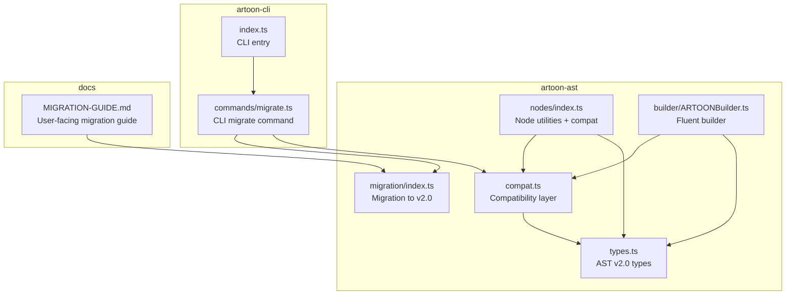
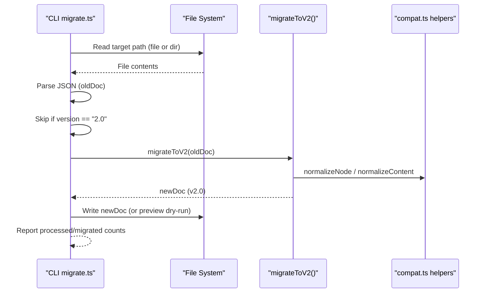
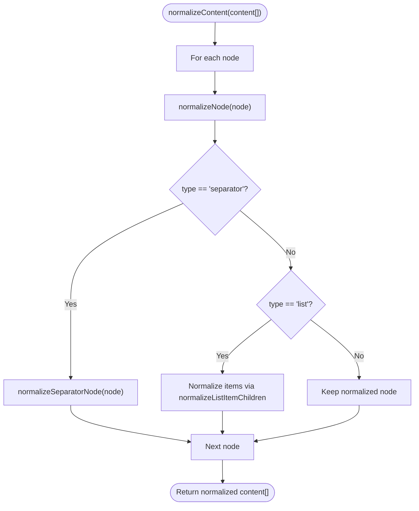
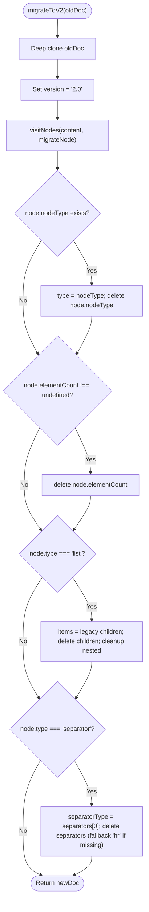
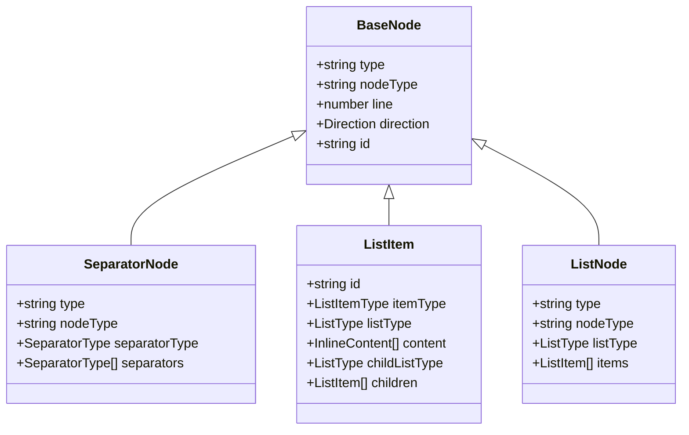
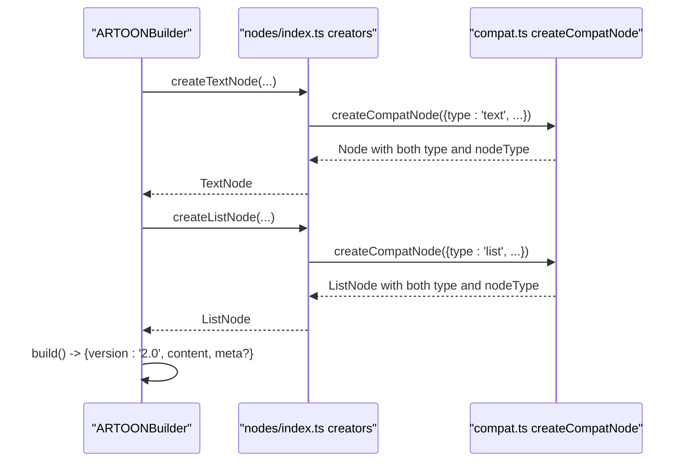
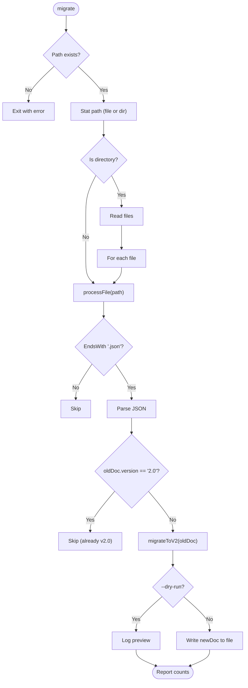
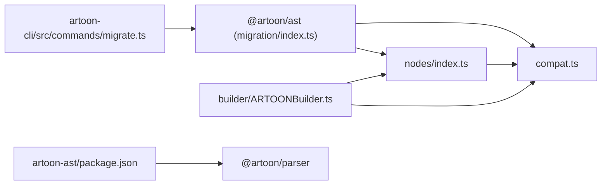

# Compatibility Layer and Migration

<cite>
**Referenced Files in This Document**
- [compat.ts](file://artoon-ast/src/compat.ts)
- [migration/index.ts](file://artoon-ast/src/migration/index.ts)
- [types.ts](file://artoon-ast/src/types.ts)
- [nodes/index.ts](file://artoon-ast/src/nodes/index.ts)
- [builder/ARTOONBuilder.ts](file://artoon-ast/src/builder/ARTOONBuilder.ts)
- [compat.test.ts](file://artoon-ast/tests/compat.test.ts)
- [migrate.ts](file://artoon-cli/src/commands/migrate.ts)
- [index.ts](file://artoon-cli/src/index.ts)
- [MIGRATION-GUIDE.md](file://docs/MIGRATION-GUIDE.md)
- [package.json](file://artoon-ast/package.json)
</cite>

## Table of Contents
1. [Introduction](#introduction)
2. [Project Structure](#project-structure)
3. [Core Components](#core-components)
4. [Architecture Overview](#architecture-overview)
5. [Detailed Component Analysis](#detailed-component-analysis)
6. [Dependency Analysis](#dependency-analysis)
7. [Performance Considerations](#performance-considerations)
8. [Troubleshooting Guide](#troubleshooting-guide)
9. [Conclusion](#conclusion)
10. [Appendices](#appendices)

## Introduction
This document explains the ARTOON AST compatibility layer and migration utilities that enable seamless upgrades from legacy AST formats to ARTOON v2.0. It covers:
- Compatibility functions that unify old (nodeType) and new (type) node formats
- Migration strategies and tooling for converting legacy AST documents to v2.0
- Version detection, automated conversion, and manual intervention requirements
- Examples of migration workflows, rollback procedures, and validation processes
- Breaking changes, deprecated features, and upgrade paths

## Project Structure
The compatibility and migration capabilities are centered in the ARTOON AST package with complementary CLI tooling for batch migration.

**Diagram sources**
- [compat.ts:1-283](file://artoon-ast/src/compat.ts#L1-L283)
- [migration/index.ts:1-76](file://artoon-ast/src/migration/index.ts#L1-L76)
- [types.ts:1-539](file://artoon-ast/src/types.ts#L1-L539)
- [nodes/index.ts:1-258](file://artoon-ast/src/nodes/index.ts#L1-L258)
- [builder/ARTOONBuilder.ts:1-147](file://artoon-ast/src/builder/ARTOONBuilder.ts#L1-L147)
- [migrate.ts:1-56](file://artoon-cli/src/commands/migrate.ts#L1-L56)
- [index.ts:1-61](file://artoon-cli/src/index.ts#L1-L61)
- [MIGRATION-GUIDE.md:1-437](file://docs/MIGRATION-GUIDE.md#L1-L437)

**Section sources**
- [compat.ts:1-283](file://artoon-ast/src/compat.ts#L1-L283)
- [migration/index.ts:1-76](file://artoon-ast/src/migration/index.ts#L1-L76)
- [types.ts:1-539](file://artoon-ast/src/types.ts#L1-L539)
- [nodes/index.ts:1-258](file://artoon-ast/src/nodes/index.ts#L1-L258)
- [builder/ARTOONBuilder.ts:1-147](file://artoon-ast/src/builder/ARTOONBuilder.ts#L1-L147)
- [migrate.ts:1-56](file://artoon-cli/src/commands/migrate.ts#L1-L56)
- [index.ts:1-61](file://artoon-cli/src/index.ts#L1-L61)
- [MIGRATION-GUIDE.md:1-437](file://docs/MIGRATION-GUIDE.md#L1-L437)

## Core Components
- Compatibility layer: Provides normalization and compatibility helpers for node formats, including dual-format support and migration statistics.
- Migration to v2.0: Performs deep mutation of legacy AST documents to canonical v2.0 format.
- Type system (v2.0): Defines canonical AST types, deprecating legacy fields while retaining compatibility.
- Node utilities: Traverse, find, and extract content with compatibility-aware helpers.
- Fluent builder: Creates v2.0 AST nodes with compatibility for consumers.
- CLI migration command: Automates migration of local JSON AST files to v2.0.

**Section sources**
- [compat.ts:24-283](file://artoon-ast/src/compat.ts#L24-L283)
- [migration/index.ts:14-75](file://artoon-ast/src/migration/index.ts#L14-L75)
- [types.ts:67-95](file://artoon-ast/src/types.ts#L67-L95)
- [nodes/index.ts:118-218](file://artoon-ast/src/nodes/index.ts#L118-L218)
- [builder/ARTOONBuilder.ts:34-146](file://artoon-ast/src/builder/ARTOONBuilder.ts#L34-L146)
- [migrate.ts:5-55](file://artoon-cli/src/commands/migrate.ts#L5-L55)

## Architecture Overview
The migration pipeline converts legacy AST documents to v2.0 by normalizing node types, restructuring list and separator nodes, and removing deprecated fields. The CLI orchestrates batch processing with optional dry runs.

**Diagram sources**
- [migrate.ts:5-55](file://artoon-cli/src/commands/migrate.ts#L5-L55)
- [migration/index.ts:14-75](file://artoon-ast/src/migration/index.ts#L14-L75)
- [compat.ts:24-230](file://artoon-ast/src/compat.ts#L24-L230)

**Section sources**
- [migrate.ts:1-56](file://artoon-cli/src/commands/migrate.ts#L1-L56)
- [migration/index.ts:1-76](file://artoon-ast/src/migration/index.ts#L1-L76)
- [compat.ts:1-283](file://artoon-ast/src/compat.ts#L1-L283)

## Detailed Component Analysis

### Compatibility Layer (compat.ts)
Purpose:
- Normalize nodes to use the canonical type property while preserving nodeType for backward compatibility.
- Provide helpers to detect legacy/new formats, convert separator and list structures, and compute migration statistics.

Key functions:
- normalizeNode: Ensures nodes have type, copying from nodeType when needed.
- createCompatNode: Adds nodeType alongside type for consumers requiring legacy shape.
- isLegacyNode / isNewFormatNode: Detect legacy vs new format.
- getNodeType: Retrieve type safely from either property.
- normalizeSeparatorNode: Converts separators[] to separatorType.
- normalizeListItemChildren: Converts ListNode children to ListItem[].
- wrapItemsInListNode: Wraps ListItem[] into legacy ListNode for compatibility.
- normalizeContent: Applies per-node normalization across content arrays.
- needsMigration / getMigrationStats: Determine migration necessity and quantify legacy usage.

**Diagram sources**
- [compat.ts:211-230](file://artoon-ast/src/compat.ts#L211-L230)

**Section sources**
- [compat.ts:24-283](file://artoon-ast/src/compat.ts#L24-L283)

### Migration to v2.0 (migration/index.ts)
Purpose:
- Deeply mutate legacy AST documents to canonical v2.0 format.
- Replace nodeType with type, remove deprecated fields, restructure lists and separators.

Target transformations:
- nodeType → type
- Remove nodeType and elementCount
- List children → items as ListItem[]
- Separator separators[] → separatorType

**Diagram sources**
- [migration/index.ts:14-75](file://artoon-ast/src/migration/index.ts#L14-L75)

**Section sources**
- [migration/index.ts:1-76](file://artoon-ast/src/migration/index.ts#L1-L76)

### Type System (types.ts) and Backward Compatibility
- BaseNode defines type as canonical and nodeType as deprecated but retained.
- Node-specific types reflect v2.0 semantics (e.g., SeparatorNode.separatorType, ListNode.items as ListItem[]).
- Type guards support both old and new formats via internal getTypeValue.

**Diagram sources**
- [types.ts:74-95](file://artoon-ast/src/types.ts#L74-L95)
- [types.ts:150-165](file://artoon-ast/src/types.ts#L150-L165)
- [types.ts:178-206](file://artoon-ast/src/types.ts#L178-L206)
- [types.ts:211-216](file://artoon-ast/src/types.ts#L211-L216)

**Section sources**
- [types.ts:67-95](file://artoon-ast/src/types.ts#L67-L95)
- [types.ts:140-165](file://artoon-ast/src/types.ts#L140-L165)
- [types.ts:168-216](file://artoon-ast/src/types.ts#L168-L216)

### Node Utilities and Builders (nodes/index.ts, builder/ARTOONBuilder.ts)
- Node utilities traverse content, find nodes by type, extract text, and count nodes, using compatibility helpers.
- ARTOONBuilder creates v2.0 nodes with compatibility wrappers and sets version to 2.0 on build.

**Diagram sources**
- [nodes/index.ts:32-90](file://artoon-ast/src/nodes/index.ts#L32-L90)
- [compat.ts:57-64](file://artoon-ast/src/compat.ts#L57-L64)
- [builder/ARTOONBuilder.ts:34-146](file://artoon-ast/src/builder/ARTOONBuilder.ts#L34-L146)

**Section sources**
- [nodes/index.ts:1-258](file://artoon-ast/src/nodes/index.ts#L1-L258)
- [builder/ARTOONBuilder.ts:1-147](file://artoon-ast/src/builder/ARTOONBuilder.ts#L1-L147)

### CLI Migration Command (artoon-cli)
- Supports migrating a single file or a directory recursively.
- Skips files already at version 2.0.
- Supports dry-run previews without writing changes.
- Reports processed and migrated counts.

**Diagram sources**
- [migrate.ts:5-55](file://artoon-cli/src/commands/migrate.ts#L5-L55)

**Section sources**
- [migrate.ts:1-56](file://artoon-cli/src/commands/migrate.ts#L1-L56)
- [index.ts:53-58](file://artoon-cli/src/index.ts#L53-L58)

## Dependency Analysis
- artoon-ast depends on @artoon/parser for parsing and integrates with downstream packages (renderer, serializer).
- CLI migrate command depends on @artoon/ast to perform migrations.
- Internal dependencies:
  - compat.ts is used by nodes/index.ts and builder/ARTOONBuilder.ts.
  - migration/index.ts uses nodes/index.ts visitNodes for traversal.

**Diagram sources**
- [migrate.ts](file://artoon-cli/src/commands/migrate.ts#L3)
- [migration/index.ts](file://artoon-ast/src/migration/index.ts#L1)
- [compat.ts:11-18](file://artoon-ast/src/compat.ts#L11-L18)
- [nodes/index.ts](file://artoon-ast/src/nodes/index.ts#L23)
- [builder/ARTOONBuilder.ts](file://artoon-ast/src/builder/ARTOONBuilder.ts#L29)
- [package.json:14-16](file://artoon-ast/package.json#L14-L16)

**Section sources**
- [package.json:1-25](file://artoon-ast/package.json#L1-L25)
- [migrate.ts:1-56](file://artoon-cli/src/commands/migrate.ts#L1-L56)
- [migration/index.ts:1-76](file://artoon-ast/src/migration/index.ts#L1-L76)
- [compat.ts:1-283](file://artoon-ast/src/compat.ts#L1-L283)
- [nodes/index.ts:1-258](file://artoon-ast/src/nodes/index.ts#L1-L258)
- [builder/ARTOONBuilder.ts:1-147](file://artoon-ast/src/builder/ARTOONBuilder.ts#L1-L147)

## Performance Considerations
- Migration performs a deep clone and a single pass traversal; complexity is O(N) in nodes.
- Compatibility helpers avoid heavy computations; prefer using type guards and normalized content to minimize repeated checks.
- Batch processing in CLI reduces overhead by consolidating IO operations.

[No sources needed since this section provides general guidance]

## Troubleshooting Guide
Common issues and resolutions:
- Legacy nodes detected: Use needsMigration and getMigrationStats to quantify and track migration progress.
- Parsing/validation errors after migration: Confirm that migrateToV2 was applied and that version is set to 2.0.
- Dry-run previews: Use CLI --dry-run to inspect changes before applying.
- Rollback: Keep backups of original files; CLI does not auto-backup.

Validation and testing:
- Unit tests cover compatibility helpers and normalization logic.
- Use roundtrip testing: parse → serialize → parse and compare ASTs.

**Section sources**
- [compat.ts:242-282](file://artoon-ast/src/compat.ts#L242-L282)
- [compat.test.ts:410-453](file://artoon-ast/tests/compat.test.ts#L410-L453)
- [migrate.ts:31-36](file://artoon-cli/src/commands/migrate.ts#L31-L36)

## Conclusion
The ARTOON AST compatibility layer and migration utilities provide a robust, backward-compatible pathway to v2.0. The compatibility helpers ensure smooth coexistence of old and new formats, while the migration tooling automates conversion and validation. Together with the CLI and comprehensive tests, teams can confidently upgrade legacy AST documents with minimal disruption.

[No sources needed since this section summarizes without analyzing specific files]

## Appendices

### Migration Strategies and Workflows
- Automated conversion:
  - Use CLI migrate command to process files or directories.
  - Dry-run to preview changes; apply to write transformed files.
- Manual intervention:
  - Update code that accesses AST fields expecting legacy shapes.
  - Adjust logic that relies on deprecated fields (e.g., nodeType, elementCount).
- Version detection:
  - Check document.version; skip migration for 2.0+.
- Rollback:
  - Restore from backups prior to migration.
- Validation:
  - Parse → serialize → parse roundtrip to confirm correctness.

**Section sources**
- [migrate.ts:5-55](file://artoon-cli/src/commands/migrate.ts#L5-L55)
- [migration/index.ts:14-75](file://artoon-ast/src/migration/index.ts#L14-L75)
- [MIGRATION-GUIDE.md:360-377](file://docs/MIGRATION-GUIDE.md#L360-L377)

### Breaking Changes and Upgrade Paths
- v2.0 breaking changes include META block reservation and hidden field restrictions.
- Upgrade path involves updating documents to use hidden fields within META and adjusting code to access document.meta.

**Section sources**
- [MIGRATION-GUIDE.md:11-17](file://docs/MIGRATION-GUIDE.md#L11-L17)
- [MIGRATION-GUIDE.md:154-175](file://docs/MIGRATION-GUIDE.md#L154-L175)