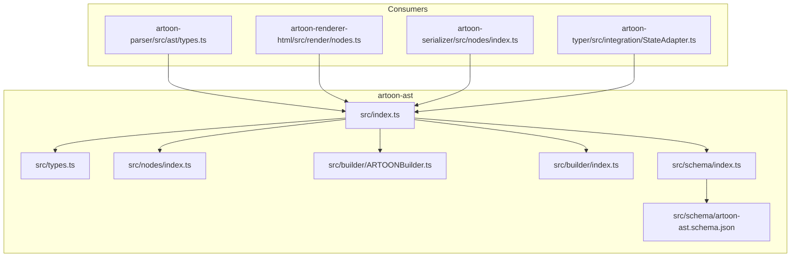
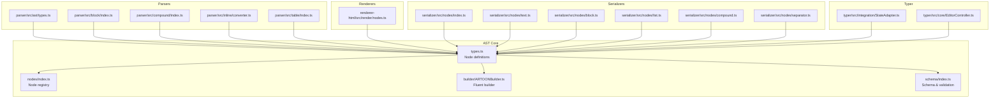
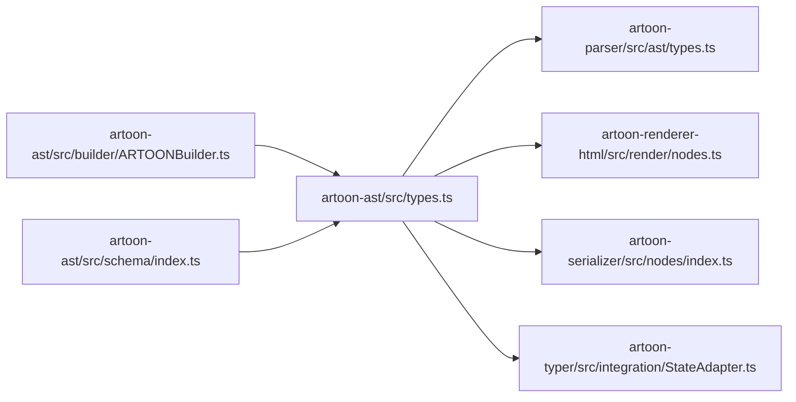

# Node Types and Operations

<cite>
**Referenced Files in This Document**
- [artoon-ast/src/index.ts](file://artoon-ast/src/index.ts)
- [artoon-ast/src/types.ts](file://artoon-ast/src/types.ts)
- [artoon-ast/src/nodes/index.ts](file://artoon-ast/src/nodes/index.ts)
- [artoon-ast/src/builder/ARTOONBuilder.ts](file://artoon-ast/src/builder/ARTOONBuilder.ts)
- [artoon-ast/src/builder/index.ts](file://artoon-ast/src/builder/index.ts)
- [artoon-ast/src/schema/index.ts](file://artoon-ast/src/schema/index.ts)
- [artoon-ast/src/schema/artoon-ast.schema.json](file://artoon-ast/src/schema/artoon-ast.schema.json)
- [artoon-ast/tests/nodes.test.ts](file://artoon-ast/tests/nodes.test.ts)
- [artoon-ast/tests/builder.test.ts](file://artoon-ast/tests/builder.test.ts)
- [artoon-ast/inventory_artoon_ast/04-NODE-TYPES.md](file://artoon-ast/inventory_artoon_ast/04-NODE-TYPES.md)
- [artoon-ast/inventory_artoon_ast/05-INVARIANTS.md](file://artoon-ast/inventory_artoon_ast/05-INVARIANTS.md)
- [artoon-ast/inventory_artoon_ast/08-API-REFERENCE.md](file://artoon-ast/inventory_artoon_ast/08-API-REFERENCE.md)
- [artoon-ast/inventory_artoon_ast/09-EXAMPLES.md](file://artoon-ast/inventory_artoon_ast/09-EXAMPLES.md)
- [artoon-ast/AST-DOCS/00-INDEX.md](file://artoon-ast/AST-DOCS/00-INDEX.md)
- [artoon-ast/AST-DOCS/01-STRUCTURAL-ROLE.md](file://artoon-ast/AST-DOCS/01-STRUCTURAL-ROLE.md)
- [artoon-ast/AST-DOCS/02-CONTRACT-LAYER.md](file://artoon-ast/AST-DOCS/02-CONTRACT-LAYER.md)
- [artoon-ast/AST-DOCS/03-DATA-SEMANTICS.md](file://artoon-ast/AST-DOCS/03-DATA-SEMANTICS.md)
- [artoon-ast/AST-DOCS/04-EVOLUTION-STRATEGY.md](file://artoon-ast/AST-DOCS/04-EVOLUTION-STRATEGY.md)
- [artoon-ast/AST-DOCS/05-FAILURE-SURFACES.md](file://artoon-ast/AST-DOCS/05-FAILURE-SURFACES.md)
- [artoon-ast/AST-DOCS/06-EXTENSIBILITY.md](file://artoon-ast/AST-DOCS/06-EXTENSIBILITY.md)
- [artoon-ast/AST-DOCS/07-INTEROPERABILITY.md](file://artoon-ast/AST-DOCS/07-INTEROPERABILITY.md)
- [artoon-ast/AST-DOCS/08-GOVERNANCE-RULES.md](file://artoon-ast/AST-DOCS/08-GOVERNANCE-RULES.md)
- [artoon-ast/AST-DOCS/09-REFACTOR-OPPORTUNITIES.md](file://artoon-ast/AST-DOCS/09-REFACTOR-OPPORTUNITIES.md)
- [artoon-ast/AST-DOCS/10-FINAL-VERDICT.md](file://artoon-ast/AST-DOCS/10-FINAL-VERDICT.md)
- [artoon-ast/AST-DOCS/QUICK-REFERENCE.md](file://artoon-ast/AST-DOCS/QUICK-REFERENCE.md)
- [artoon-ast/AST-DOCS/README.md](file://artoon-ast/AST-DOCS/README.md)
- [artoon-parser/src/ast/types.ts](file://artoon-parser/src/ast/types.ts)
- [artoon-parser/src/block/index.ts](file://artoon-parser/src/block/index.ts)
- [artoon-parser/src/compound/index.ts](file://artoon-parser/src/compound/index.ts)
- [artoon-parser/src/inline/converter.ts](file://artoon-parser/src/inline/converter.ts)
- [artoon-parser/src/table/index.ts](file://artoon-parser/src/table/index.ts)
- [artoon-renderer-html/src/render/nodes.ts](file://artoon-renderer-html/src/render/nodes.ts)
- [artoon-serializer/src/nodes/index.ts](file://artoon-serializer/src/nodes/index.ts)
- [artoon-serializer/src/nodes/text.ts](file://artoon-serializer/src/nodes/text.ts)
- [artoon-serializer/src/nodes/block.ts](file://artoon-serializer/src/nodes/block.ts)
- [artoon-serializer/src/nodes/list.ts](file://artoon-serializer/src/nodes/list.ts)
- [artoon-serializer/src/nodes/compound.ts](file://artoon-serializer/src/nodes/compound.ts)
- [artoon-serializer/src/nodes/separator.ts](file://artoon-serializer/src/nodes/separator.ts)
- [artoon-typer/src/integration/StateAdapter.ts](file://artoon-typer/src/integration/StateAdapter.ts)
- [artoon-typer/src/core/EditorController.ts](file://artoon-typer/src/core/EditorController.ts)
</cite>

## Table of Contents
1. [Introduction](#introduction)
2. [Project Structure](#project-structure)
3. [Core Components](#core-components)
4. [Architecture Overview](#architecture-overview)
5. [Detailed Component Analysis](#detailed-component-analysis)
6. [Dependency Analysis](#dependency-analysis)
7. [Performance Considerations](#performance-considerations)
8. [Troubleshooting Guide](#troubleshooting-guide)
9. [Conclusion](#conclusion)
10. [Appendices](#appendices)

## Introduction
This document provides comprehensive documentation for ARTOON AST node types and operations. It focuses on the core AST node categories used by the ARTOON ecosystem: TextNode, BlockNode, InlineComponent, ListNode, SeparatorNode, and CompoundComponent. The guide explains node creation, traversal utilities, manipulation methods, and the builder API for programmatic construction. It also covers validation, type checking, integrity verification, and node relationships including parent-child hierarchies and sibling positioning.

## Project Structure
The ARTOON AST package organizes AST-related concerns into focused modules:
- Core AST types and exports
- Node definitions and indices
- Fluent builder API for AST construction
- Schema and validation support
- Tests validating AST semantics and builder behavior

**Diagram sources**
- [artoon-ast/src/index.ts](file://artoon-ast/src/index.ts)
- [artoon-ast/src/types.ts](file://artoon-ast/src/types.ts)
- [artoon-ast/src/nodes/index.ts](file://artoon-ast/src/nodes/index.ts)
- [artoon-ast/src/builder/ARTOONBuilder.ts](file://artoon-ast/src/builder/ARTOONBuilder.ts)
- [artoon-ast/src/builder/index.ts](file://artoon-ast/src/builder/index.ts)
- [artoon-ast/src/schema/index.ts](file://artoon-ast/src/schema/index.ts)
- [artoon-ast/src/schema/artoon-ast.schema.json](file://artoon-ast/src/schema/artoon-ast.schema.json)
- [artoon-parser/src/ast/types.ts](file://artoon-parser/src/ast/types.ts)
- [artoon-renderer-html/src/render/nodes.ts](file://artoon-renderer-html/src/render/nodes.ts)
- [artoon-serializer/src/nodes/index.ts](file://artoon-serializer/src/nodes/index.ts)
- [artoon-typer/src/integration/StateAdapter.ts](file://artoon-typer/src/integration/StateAdapter.ts)

**Section sources**
- [artoon-ast/src/index.ts](file://artoon-ast/src/index.ts)
- [artoon-ast/src/types.ts](file://artoon-ast/src/types.ts)
- [artoon-ast/src/nodes/index.ts](file://artoon-ast/src/nodes/index.ts)
- [artoon-ast/src/builder/ARTOONBuilder.ts](file://artoon-ast/src/builder/ARTOONBuilder.ts)
- [artoon-ast/src/builder/index.ts](file://artoon-ast/src/builder/index.ts)
- [artoon-ast/src/schema/index.ts](file://artoon-ast/src/schema/index.ts)
- [artoon-ast/src/schema/artoon-ast.schema.json](file://artoon-ast/src/schema/artoon-ast.schema.json)

## Core Components
This section outlines the primary AST node types and their roles within the ARTOON system. It also describes the builder API and schema-driven validation.

- TextNode: Represents textual content within the AST. It supports immutable content and metadata fields.
- BlockNode: Represents block-level semantic units such as paragraphs, headings, and specialized blocks.
- InlineComponent: Represents inline semantic constructs (e.g., emphasis, links) embedded within text.
- ListNode: Represents ordered or unordered lists and their items.
- SeparatorNode: Represents thematic breaks or separators within the document.
- CompoundComponent: Represents composite structures composed of multiple child nodes.

Key capabilities:
- Builder API: Fluent construction of nodes and hierarchical structures.
- Schema Validation: JSON Schema-backed validation for AST integrity.
- Type Contracts: Strongly typed AST definitions ensuring consistency across consumers.

**Section sources**
- [artoon-ast/src/types.ts](file://artoon-ast/src/types.ts)
- [artoon-ast/src/builder/ARTOONBuilder.ts](file://artoon-ast/src/builder/ARTOONBuilder.ts)
- [artoon-ast/src/schema/index.ts](file://artoon-ast/src/schema/index.ts)
- [artoon-ast/src/schema/artoon-ast.schema.json](file://artoon-ast/src/schema/artoon-ast.schema.json)
- [artoon-ast/inventory_artoon_ast/04-NODE-TYPES.md](file://artoon-ast/inventory_artoon_ast/04-NODE-TYPES.md)
- [artoon-ast/inventory_artoon_ast/05-INVARIANTS.md](file://artoon-ast/inventory_artoon_ast/05-INVARIANTS.md)

## Architecture Overview
The ARTOON AST forms the central contract for document structure across parsing, rendering, serialization, and typing layers. The builder API enables programmatic construction, while schema validation ensures structural integrity.

**Diagram sources**
- [artoon-ast/src/types.ts](file://artoon-ast/src/types.ts)
- [artoon-ast/src/nodes/index.ts](file://artoon-ast/src/nodes/index.ts)
- [artoon-ast/src/builder/ARTOONBuilder.ts](file://artoon-ast/src/builder/ARTOONBuilder.ts)
- [artoon-ast/src/schema/index.ts](file://artoon-ast/src/schema/index.ts)
- [artoon-parser/src/ast/types.ts](file://artoon-parser/src/ast/types.ts)
- [artoon-parser/src/block/index.ts](file://artoon-parser/src/block/index.ts)
- [artoon-parser/src/compound/index.ts](file://artoon-parser/src/compound/index.ts)
- [artoon-parser/src/inline/converter.ts](file://artoon-parser/src/inline/converter.ts)
- [artoon-parser/src/table/index.ts](file://artoon-parser/src/table/index.ts)
- [artoon-renderer-html/src/render/nodes.ts](file://artoon-renderer-html/src/render/nodes.ts)
- [artoon-serializer/src/nodes/index.ts](file://artoon-serializer/src/nodes/index.ts)
- [artoon-serializer/src/nodes/text.ts](file://artoon-serializer/src/nodes/text.ts)
- [artoon-serializer/src/nodes/block.ts](file://artoon-serializer/src/nodes/block.ts)
- [artoon-serializer/src/nodes/list.ts](file://artoon-serializer/src/nodes/list.ts)
- [artoon-serializer/src/nodes/compound.ts](file://artoon-serializer/src/nodes/compound.ts)
- [artoon-serializer/src/nodes/separator.ts](file://artoon-serializer/src/nodes/separator.ts)
- [artoon-typer/src/integration/StateAdapter.ts](file://artoon-typer/src/integration/StateAdapter.ts)
- [artoon-typer/src/core/EditorController.ts](file://artoon-typer/src/core/EditorController.ts)

## Detailed Component Analysis

### AST Node Types and Semantics
- TextNode: Immutable text content with optional metadata. Supports concatenation and splitting operations via builder utilities.
- BlockNode: Top-level semantic container supporting children and attributes. Used for paragraphs, headings, and specialized blocks.
- InlineComponent: Inline semantic markers (e.g., emphasis, strong, link) embedded inside text nodes.
- ListNode: List container with ordered/unordered semantics and list item children.
- SeparatorNode: Structural separator (e.g., thematic break) with minimal payload.
- CompoundComponent: Composite node grouping multiple children with specific composition rules.

Validation and invariants:
- Each node type adheres to strict shape and field constraints enforced by the schema.
- Parent-child relationships must satisfy containment rules defined in the schema.
- Metadata fields are validated against allowed sets per node category.

**Section sources**
- [artoon-ast/src/types.ts](file://artoon-ast/src/types.ts)
- [artoon-ast/src/schema/artoon-ast.schema.json](file://artoon-ast/src/schema/artoon-ast.schema.json)
- [artoon-ast/inventory_artoon_ast/04-NODE-TYPES.md](file://artoon-ast/inventory_artoon_ast/04-NODE-TYPES.md)
- [artoon-ast/inventory_artoon_ast/05-INVARIANTS.md](file://artoon-ast/inventory_artoon_ast/05-INVARIANTS.md)

### Builder API: Programmatic Construction
The builder API provides a fluent interface for constructing AST nodes and assembling hierarchical documents. It includes:
- Node creation functions for each node type with parameterized configuration.
- Child attachment methods for building parent-child relationships.
- Sibling positioning helpers for ordering adjacent nodes.
- Structural validation during build to prevent invalid configurations.

Example capabilities (paths only):
- Fluent construction of TextNode, BlockNode, InlineComponent, ListNode, SeparatorNode, and CompoundComponent.
- Methods to append, prepend, insert, and replace children.
- Utility methods for traversing and querying node relationships.

**Section sources**
- [artoon-ast/src/builder/ARTOONBuilder.ts](file://artoon-ast/src/builder/ARTOONBuilder.ts)
- [artoon-ast/src/builder/index.ts](file://artoon-ast/src/builder/index.ts)
- [artoon-ast/tests/builder.test.ts](file://artoon-ast/tests/builder.test.ts)
- [artoon-ast/inventory_artoon_ast/08-API-REFERENCE.md](file://artoon-ast/inventory_artoon_ast/08-API-REFERENCE.md)
- [artoon-ast/inventory_artoon_ast/09-EXAMPLES.md](file://artoon-ast/inventory_artoon_ast/09-EXAMPLES.md)

### Traversal Utilities and Manipulation Methods
Traversal and manipulation utilities enable safe navigation and editing of AST structures:
- Depth-first traversal with pre/post-order hooks.
- Parent lookup and sibling enumeration.
- Insertion, removal, and replacement of nodes with automatic relationship updates.
- Structural change notifications for downstream consumers.

These utilities are implemented in the core AST module and exposed through the public API.

**Section sources**
- [artoon-ast/src/types.ts](file://artoon-ast/src/types.ts)
- [artoon-ast/tests/nodes.test.ts](file://artoon-ast/tests/nodes.test.ts)

### Node Relationships and Hierarchies
Parent-child and sibling relationships are fundamental to AST integrity:
- Parent pointers maintain upward references for efficient traversal.
- Sibling arrays preserve order and enable insertion/removal at arbitrary positions.
- Composition rules define which node types can be parents of which children.

Validation ensures that relationships adhere to schema-defined containment rules.

**Section sources**
- [artoon-ast/src/types.ts](file://artoon-ast/src/types.ts)
- [artoon-ast/src/schema/artoon-ast.schema.json](file://artoon-ast/src/schema/artoon-ast.schema.json)

### Examples: Creation, Modification, Deletion, Structural Operations
Concrete examples of AST operations are documented in the AST inventory and tests:
- Creating a TextNode and embedding InlineComponent within a BlockNode.
- Building a ListNode with multiple items and applying formatting.
- Constructing a CompoundComponent from multiple child nodes.
- Modifying node metadata and repositioning siblings.
- Deleting nodes while preserving structural validity.

Paths to examples:
- [artoon-ast/inventory_artoon_ast/09-EXAMPLES.md](file://artoon-ast/inventory_artoon_ast/09-EXAMPLES.md)
- [artoon-ast/tests/nodes.test.ts](file://artoon-ast/tests/nodes.test.ts)
- [artoon-ast/tests/builder.test.ts](file://artoon-ast/tests/builder.test.ts)

**Section sources**
- [artoon-ast/inventory_artoon_ast/09-EXAMPLES.md](file://artoon-ast/inventory_artoon_ast/09-EXAMPLES.md)
- [artoon-ast/tests/nodes.test.ts](file://artoon-ast/tests/nodes.test.ts)
- [artoon-ast/tests/builder.test.ts](file://artoon-ast/tests/builder.test.ts)

### Node Validation, Type Checking, and Integrity Verification
Validation is enforced through:
- JSON Schema: Defines allowed shapes, required fields, and value constraints for each node type.
- Runtime type checks: Ensures nodes conform to their declared types before processing.
- Integrity verification: Confirms parent-child and sibling relationships meet schema rules.

Schema and validation references:
- [artoon-ast/src/schema/index.ts](file://artoon-ast/src/schema/index.ts)
- [artoon-ast/src/schema/artoon-ast.schema.json](file://artoon-ast/src/schema/artoon-ast.schema.json)

**Section sources**
- [artoon-ast/src/schema/index.ts](file://artoon-ast/src/schema/index.ts)
- [artoon-ast/src/schema/artoon-ast.schema.json](file://artoon-ast/src/schema/artoon-ast.schema.json)

### Parser Integration and Node Types
The parser produces AST nodes that align with the core types. Integration points include:
- Block parsing producing BlockNode and ListNode structures.
- Inline conversion generating InlineComponent nodes embedded in text.
- Compound parsing forming CompoundComponent nodes.
- Table parsing producing specialized block-level structures.

**Section sources**
- [artoon-parser/src/ast/types.ts](file://artoon-parser/src/ast/types.ts)
- [artoon-parser/src/block/index.ts](file://artoon-parser/src/block/index.ts)
- [artoon-parser/src/compound/index.ts](file://artoon-parser/src/compound/index.ts)
- [artoon-parser/src/inline/converter.ts](file://artoon-parser/src/inline/converter.ts)
- [artoon-parser/src/table/index.ts](file://artoon-parser/src/table/index.ts)

### Renderer and Serializer Integration
Renderers and serializers consume AST nodes to produce output formats:
- HTML renderer maps AST nodes to HTML elements.
- Serializers convert AST nodes to various output formats (e.g., plain text, structured JSON).
- Specialized serializers handle text, block, list, compound, and separator nodes.

**Section sources**
- [artoon-renderer-html/src/render/nodes.ts](file://artoon-renderer-html/src/render/nodes.ts)
- [artoon-serializer/src/nodes/index.ts](file://artoon-serializer/src/nodes/index.ts)
- [artoon-serializer/src/nodes/text.ts](file://artoon-serializer/src/nodes/text.ts)
- [artoon-serializer/src/nodes/block.ts](file://artoon-serializer/src/nodes/block.ts)
- [artoon-serializer/src/nodes/list.ts](file://artoon-serializer/src/nodes/list.ts)
- [artoon-serializer/src/nodes/compound.ts](file://artoon-serializer/src/nodes/compound.ts)
- [artoon-serializer/src/nodes/separator.ts](file://artoon-serializer/src/nodes/separator.ts)

### Typer Integration and State Management
The typer integrates AST nodes into the editing state model:
- StateAdapter bridges AST nodes to the editor’s state representation.
- EditorController orchestrates editing operations using AST node semantics.

**Section sources**
- [artoon-typer/src/integration/StateAdapter.ts](file://artoon-typer/src/integration/StateAdapter.ts)
- [artoon-typer/src/core/EditorController.ts](file://artoon-typer/src/core/EditorController.ts)

## Dependency Analysis
The ARTOON AST package interacts with parsers, renderers, serializers, and the typer. Dependencies are intentionally decoupled through shared types and schema contracts.

**Diagram sources**
- [artoon-ast/src/types.ts](file://artoon-ast/src/types.ts)
- [artoon-ast/src/builder/ARTOONBuilder.ts](file://artoon-ast/src/builder/ARTOONBuilder.ts)
- [artoon-ast/src/schema/index.ts](file://artoon-ast/src/schema/index.ts)
- [artoon-parser/src/ast/types.ts](file://artoon-parser/src/ast/types.ts)
- [artoon-renderer-html/src/render/nodes.ts](file://artoon-renderer-html/src/render/nodes.ts)
- [artoon-serializer/src/nodes/index.ts](file://artoon-serializer/src/nodes/index.ts)
- [artoon-typer/src/integration/StateAdapter.ts](file://artoon-typer/src/integration/StateAdapter.ts)

**Section sources**
- [artoon-ast/src/types.ts](file://artoon-ast/src/types.ts)
- [artoon-ast/src/builder/ARTOONBuilder.ts](file://artoon-ast/src/builder/ARTOONBuilder.ts)
- [artoon-ast/src/schema/index.ts](file://artoon-ast/src/schema/index.ts)
- [artoon-parser/src/ast/types.ts](file://artoon-parser/src/ast/types.ts)
- [artoon-renderer-html/src/render/nodes.ts](file://artoon-renderer-html/src/render/nodes.ts)
- [artoon-serializer/src/nodes/index.ts](file://artoon-serializer/src/nodes/index.ts)
- [artoon-typer/src/integration/StateAdapter.ts](file://artoon-typer/src/integration/StateAdapter.ts)

## Performance Considerations
- Prefer batched structural changes to minimize recomputation and reflows.
- Use traversal utilities that avoid redundant scans of the tree.
- Keep InlineComponent nesting shallow to reduce rendering overhead.
- Validate early and often using schema validation to catch errors before heavy processing.

[No sources needed since this section provides general guidance]

## Troubleshooting Guide
Common issues and resolutions:
- Invalid node shapes: Ensure nodes match the schema; use builder APIs to construct valid structures.
- Incorrect parent-child relationships: Verify containment rules and use provided manipulation utilities.
- Type mismatches: Confirm node types align with expected categories before passing to consumers.
- Serialization/rendering failures: Validate AST integrity prior to serialization or rendering.

Diagnostic resources:
- [artoon-ast/tests/nodes.test.ts](file://artoon-ast/tests/nodes.test.ts)
- [artoon-ast/tests/builder.test.ts](file://artoon-ast/tests/builder.test.ts)
- [artoon-ast/src/schema/artoon-ast.schema.json](file://artoon-ast/src/schema/artoon-ast.schema.json)

**Section sources**
- [artoon-ast/tests/nodes.test.ts](file://artoon-ast/tests/nodes.test.ts)
- [artoon-ast/tests/builder.test.ts](file://artoon-ast/tests/builder.test.ts)
- [artoon-ast/src/schema/artoon-ast.schema.json](file://artoon-ast/src/schema/artoon-ast.schema.json)

## Conclusion
ARTOON AST provides a robust, schema-driven foundation for representing document structure across parsing, rendering, serialization, and typing. The builder API simplifies programmatic construction, while traversal and manipulation utilities enable safe editing. Strict validation and invariants ensure integrity and interoperability across the ecosystem.

[No sources needed since this section summarizes without analyzing specific files]

## Appendices

### Additional AST Documentation
- [AST-DOCS/README.md](file://artoon-ast/AST-DOCS/README.md)
- [AST-DOCS/00-INDEX.md](file://artoon-ast/AST-DOCS/00-INDEX.md)
- [AST-DOCS/01-STRUCTURAL-ROLE.md](file://artoon-ast/AST-DOCS/01-STRUCTURAL-ROLE.md)
- [AST-DOCS/02-CONTRACT-LAYER.md](file://artoon-ast/AST-DOCS/02-CONTRACT-LAYER.md)
- [AST-DOCS/03-DATA-SEMANTICS.md](file://artoon-ast/AST-DOCS/03-DATA-SEMANTICS.md)
- [AST-DOCS/04-EVOLUTION-STRATEGY.md](file://artoon-ast/AST-DOCS/04-EVOLUTION-STRATEGY.md)
- [AST-DOCS/05-FAILURE-SURFACES.md](file://artoon-ast/AST-DOCS/05-FAILURE-SURFACES.md)
- [AST-DOCS/06-EXTENSIBILITY.md](file://artoon-ast/AST-DOCS/06-EXTENSIBILITY.md)
- [AST-DOCS/07-INTEROPERABILITY.md](file://artoon-ast/AST-DOCS/07-INTEROPERABILITY.md)
- [AST-DOCS/08-GOVERNANCE-RULES.md](file://artoon-ast/AST-DOCS/08-GOVERNANCE-RULES.md)
- [AST-DOCS/09-REFACTOR-OPPORTUNITIES.md](file://artoon-ast/AST-DOCS/09-REFACTOR-OPPORTUNITIES.md)
- [AST-DOCS/10-FINAL-VERDICT.md](file://artoon-ast/AST-DOCS/10-FINAL-VERDICT.md)
- [AST-DOCS/QUICK-REFERENCE.md](file://artoon-ast/AST-DOCS/QUICK-REFERENCE.md)

**Section sources**
- [artoon-ast/AST-DOCS/README.md](file://artoon-ast/AST-DOCS/README.md)
- [artoon-ast/AST-DOCS/00-INDEX.md](file://artoon-ast/AST-DOCS/00-INDEX.md)
- [artoon-ast/AST-DOCS/01-STRUCTURAL-ROLE.md](file://artoon-ast/AST-DOCS/01-STRUCTURAL-ROLE.md)
- [artoon-ast/AST-DOCS/02-CONTRACT-LAYER.md](file://artoon-ast/AST-DOCS/02-CONTRACT-LAYER.md)
- [artoon-ast/AST-DOCS/03-DATA-SEMANTICS.md](file://artoon-ast/AST-DOCS/03-DATA-SEMANTICS.md)
- [artoon-ast/AST-DOCS/04-EVOLUTION-STRATEGY.md](file://artoon-ast/AST-DOCS/04-EVOLUTION-STRATEGY.md)
- [artoon-ast/AST-DOCS/05-FAILURE-SURFACES.md](file://artoon-ast/AST-DOCS/05-FAILURE-SURFACES.md)
- [artoon-ast/AST-DOCS/06-EXTENSIBILITY.md](file://artoon-ast/AST-DOCS/06-EXTENSIBILITY.md)
- [artoon-ast/AST-DOCS/07-INTEROPERABILITY.md](file://artoon-ast/AST-DOCS/07-INTEROPERABILITY.md)
- [artoon-ast/AST-DOCS/08-GOVERNANCE-RULES.md](file://artoon-ast/AST-DOCS/08-GOVERNANCE-RULES.md)
- [artoon-ast/AST-DOCS/09-REFACTOR-OPPORTUNITIES.md](file://artoon-ast/AST-DOCS/09-REFACTOR-OPPORTUNITIES.md)
- [artoon-ast/AST-DOCS/10-FINAL-VERDICT.md](file://artoon-ast/AST-DOCS/10-FINAL-VERDICT.md)
- [artoon-ast/AST-DOCS/QUICK-REFERENCE.md](file://artoon-ast/AST-DOCS/QUICK-REFERENCE.md)