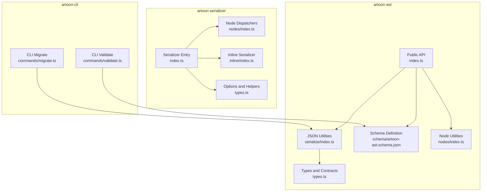
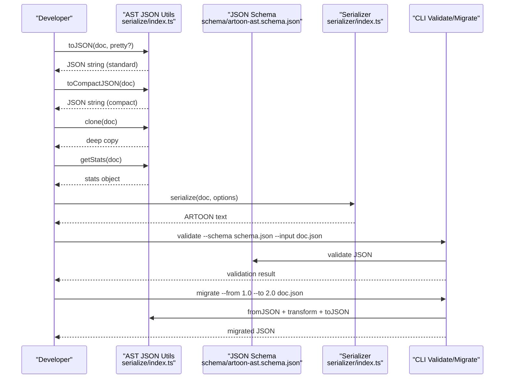
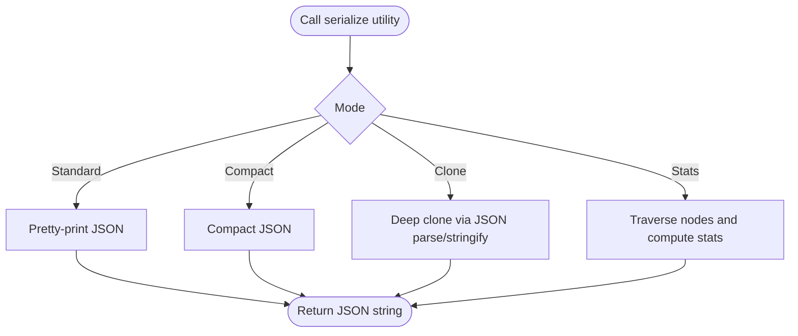
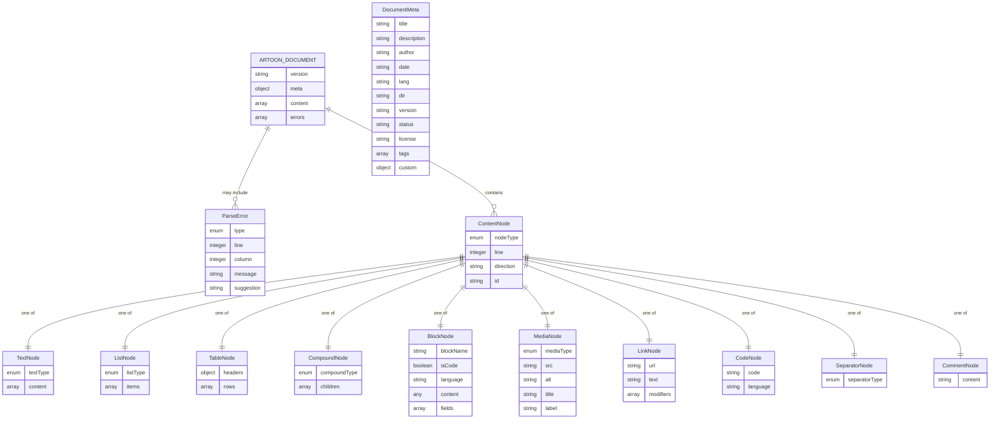
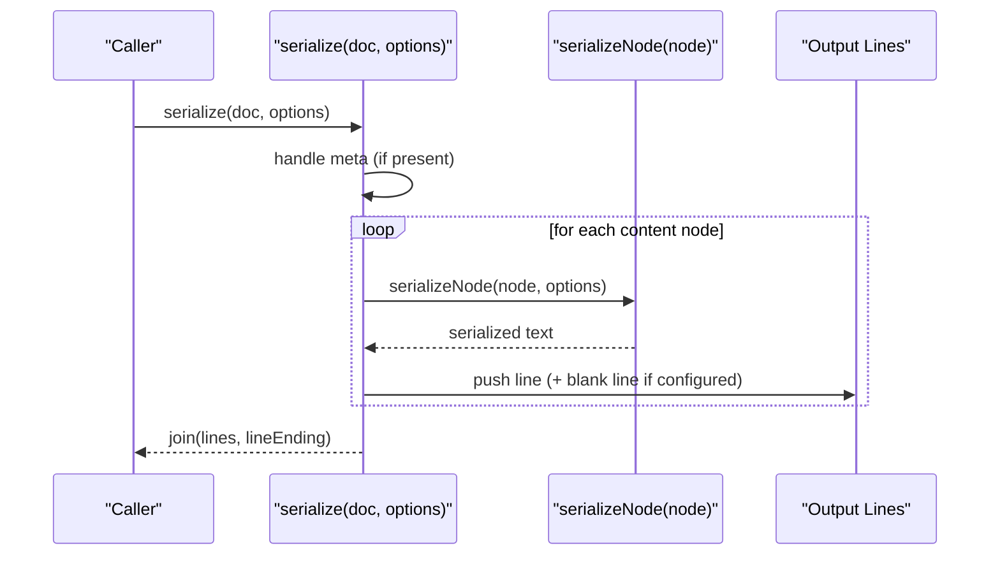
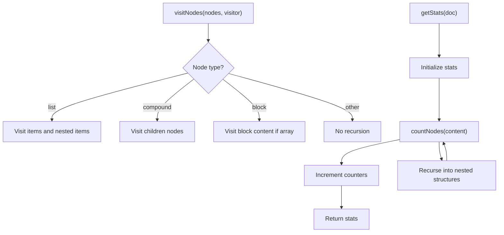
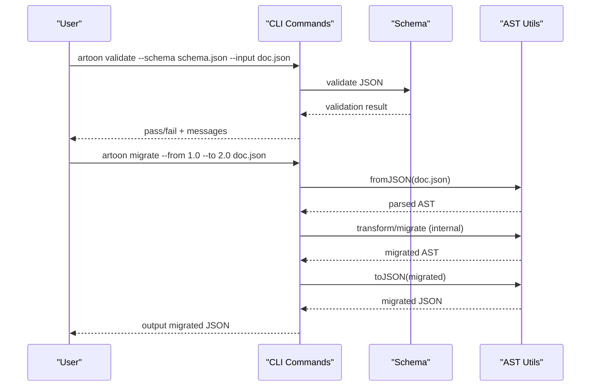
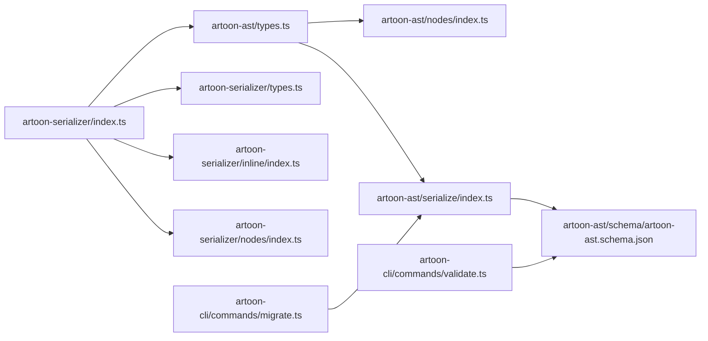

# Serialization and Schema

<cite>
**Referenced Files in This Document**
- [artoon-ast/src/index.ts](file://artoon-ast/src/index.ts)
- [artoon-ast/src/types.ts](file://artoon-ast/src/types.ts)
- [artoon-ast/src/serialize/index.ts](file://artoon-ast/src/serialize/index.ts)
- [artoon-ast/src/nodes/index.ts](file://artoon-ast/src/nodes/index.ts)
- [artoon-ast/src/schema/artoon-ast.schema.json](file://artoon-ast/src/schema/artoon-ast.schema.json)
- [artoon-serializer/src/index.ts](file://artoon-serializer/src/index.ts)
- [artoon-serializer/src/types.ts](file://artoon-serializer/src/types.ts)
- [artoon-serializer/src/nodes/index.ts](file://artoon-serializer/src/nodes/index.ts)
- [artoon-serializer/src/inline/index.ts](file://artoon-serializer/src/inline/index.ts)
- [artoon-cli/src/commands/validate.ts](file://artoon-cli/src/commands/validate.ts)
- [artoon-cli/src/commands/migrate.ts](file://artoon-cli/src/commands/migrate.ts)
- [tests/contracts/ast-contract.test.ts](file://tests/contracts/ast-contract.test.ts)
</cite>

## Table of Contents
1. [Introduction](#introduction)
2. [Project Structure](#project-structure)
3. [Core Components](#core-components)
4. [Architecture Overview](#architecture-overview)
5. [Detailed Component Analysis](#detailed-component-analysis)
6. [Dependency Analysis](#dependency-analysis)
7. [Performance Considerations](#performance-considerations)
8. [Troubleshooting Guide](#troubleshooting-guide)
9. [Conclusion](#conclusion)
10. [Appendices](#appendices)

## Introduction
This document explains the AST serialization and schema validation capabilities across the ARTOON ecosystem. It covers:
- JSON serialization formats: standard and compact representations
- Schema definition and validation rules for the canonical AST
- Data contract specifications and versioning
- Serialization utilities for converting AST to/from JSON, cloning nodes, and extracting statistics
- Examples of serialization workflows, schema validation, and data integrity checks
- Performance considerations, size optimization, and streaming serialization
- Schema evolution strategy and versioning approach

## Project Structure
The serialization and schema features span three packages:
- artoon-ast: Defines the canonical AST types, serialization utilities, and the JSON schema
- artoon-serializer: Converts AST to ARTOON text format
- artoon-cli: Provides command-line validation and migration utilities

**Diagram sources**
- [artoon-ast/src/index.ts:1-51](file://artoon-ast/src/index.ts#L1-L51)
- [artoon-ast/src/serialize/index.ts:1-96](file://artoon-ast/src/serialize/index.ts#L1-L96)
- [artoon-ast/src/schema/artoon-ast.schema.json:1-388](file://artoon-ast/src/schema/artoon-ast.schema.json#L1-L388)
- [artoon-ast/src/nodes/index.ts:1-258](file://artoon-ast/src/nodes/index.ts#L1-L258)
- [artoon-serializer/src/index.ts:1-95](file://artoon-serializer/src/index.ts#L1-L95)
- [artoon-serializer/src/types.ts:1-32](file://artoon-serializer/src/types.ts#L1-L32)
- [artoon-serializer/src/nodes/index.ts:1-91](file://artoon-serializer/src/nodes/index.ts#L1-L91)
- [artoon-serializer/src/inline/index.ts:1-4](file://artoon-serializer/src/inline/index.ts#L1-L4)
- [artoon-cli/src/commands/validate.ts](file://artoon-cli/src/commands/validate.ts)
- [artoon-cli/src/commands/migrate.ts](file://artoon-cli/src/commands/migrate.ts)

**Section sources**
- [artoon-ast/src/index.ts:1-51](file://artoon-ast/src/index.ts#L1-L51)
- [artoon-serializer/src/index.ts:1-95](file://artoon-serializer/src/index.ts#L1-L95)

## Core Components
- AST JSON utilities: provide JSON serialization, compact JSON, deep clone, and statistics extraction
- AST schema: defines the canonical JSON schema for ARTOON documents, including enums, unions, and references
- Serializer: converts AST to ARTOON text with configurable options
- CLI validation and migration: validate JSON against schema and migrate AST versions

Key exports and responsibilities:
- artoon-ast exports serialization utilities and node utilities for statistics and traversal
- artoon-serializer exports the serialize function and node dispatchers
- artoon-cli exposes validate and migrate commands

**Section sources**
- [artoon-ast/src/index.ts:16-42](file://artoon-ast/src/index.ts#L16-L42)
- [artoon-ast/src/serialize/index.ts:6-39](file://artoon-ast/src/serialize/index.ts#L6-L39)
- [artoon-ast/src/schema/artoon-ast.schema.json:1-30](file://artoon-ast/src/schema/artoon-ast.schema.json#L1-L30)
- [artoon-serializer/src/index.ts:10-59](file://artoon-serializer/src/index.ts#L10-L59)
- [artoon-cli/src/commands/validate.ts](file://artoon-cli/src/commands/validate.ts)
- [artoon-cli/src/commands/migrate.ts](file://artoon-cli/src/commands/migrate.ts)

## Architecture Overview
The serialization pipeline integrates AST types, JSON schema, and text serialization:

**Diagram sources**
- [artoon-ast/src/serialize/index.ts:6-39](file://artoon-ast/src/serialize/index.ts#L6-L39)
- [artoon-ast/src/schema/artoon-ast.schema.json:1-30](file://artoon-ast/src/schema/artoon-ast.schema.json#L1-L30)
- [artoon-serializer/src/index.ts:17-59](file://artoon-serializer/src/index.ts#L17-L59)
- [artoon-cli/src/commands/validate.ts](file://artoon-cli/src/commands/validate.ts)
- [artoon-cli/src/commands/migrate.ts](file://artoon-cli/src/commands/migrate.ts)

## Detailed Component Analysis

### JSON Serialization Utilities (AST)
The AST package provides four primary JSON utilities:
- Standard JSON serialization with optional indentation
- Compact JSON serialization with no whitespace
- Deep clone via JSON serialization/deserialization
- Statistics extraction across nodes and content

**Diagram sources**
- [artoon-ast/src/serialize/index.ts:6-96](file://artoon-ast/src/serialize/index.ts#L6-L96)

Implementation highlights:
- Version validation in parsing enforces supported versions
- Statistics traverse content arrays, compound children, and list items recursively
- Clone leverages native JSON APIs for deep copying

**Section sources**
- [artoon-ast/src/serialize/index.ts:6-96](file://artoon-ast/src/serialize/index.ts#L6-L96)

### AST Schema Definition and Validation Rules
The schema defines the canonical JSON contract for ARTOON documents:
- Document-level fields: version, meta, content, errors
- Enumerations for directions, modifiers, text/list/table/compound/separators, and inline component types
- Strong typing for nodes, unions for content, and references to definitions
- Required fields and constraints for robust validation

**Diagram sources**
- [artoon-ast/src/schema/artoon-ast.schema.json:1-388](file://artoon-ast/src/schema/artoon-ast.schema.json#L1-L388)
- [artoon-ast/src/types.ts:413-418](file://artoon-ast/src/types.ts#L413-L418)

Validation rules and constraints:
- Version must match supported values
- Required fields enforced per definition
- Enumerations constrain values for types and modifiers
- Unions ensure content conforms to allowed node types

**Section sources**
- [artoon-ast/src/schema/artoon-ast.schema.json:1-30](file://artoon-ast/src/schema/artoon-ast.schema.json#L1-L30)
- [artoon-ast/src/schema/artoon-ast.schema.json:372-385](file://artoon-ast/src/schema/artoon-ast.schema.json#L372-L385)

### Text Serialization Pipeline (Serializer)
The serializer converts AST to ARTOON text with configurable options:
- Options include line ending, blank lines between elements, and comment preservation
- META block handling supports both BlockNode and DocumentMeta forms
- Node dispatcher routes to specialized serializers for each node type
- Inline content serialization handled separately

**Diagram sources**
- [artoon-serializer/src/index.ts:17-59](file://artoon-serializer/src/index.ts#L17-L59)
- [artoon-serializer/src/nodes/index.ts:32-78](file://artoon-serializer/src/nodes/index.ts#L32-L78)

Options and defaults:
- Line endings configurable
- Blank lines between elements configurable
- Comments preserved by default

**Section sources**
- [artoon-serializer/src/index.ts:10-59](file://artoon-serializer/src/index.ts#L10-L59)
- [artoon-serializer/src/types.ts:6-24](file://artoon-serializer/src/types.ts#L6-L24)

### Node and Inline Serializers
The serializer’s node dispatcher selects the appropriate serializer based on node type. Inline content serialization is handled by a dedicated module.

```mermaid
classDiagram
class NodeDispatcher {
+serializeNode(node, options) string
}
class TextSerializer {
+serializeText(node) string
}
class ListSerializer {
+serializeList(node, options) string
}
class TableSerializer {
+serializeTable(node, options) string
}
class BlockSerializer {
+serializeBlock(node, options) string
}
class CompoundSerializer {
+serializeCompound(node, options) string
}
class SeparatorSerializer {
+serializeSeparator(node) string
}
class MediaSerializer {
+serializeMedia(node) string
}
class LinkSerializer {
+serializeLink(node) string
}
class CodeSerializer {
+serializeCode(node) string
}
class CommentSerializer {
+serializeComment(node) string
}
class InlineSerializer {
+serializeInlineContent(content) string
}
NodeDispatcher --> TextSerializer : "dispatch"
NodeDispatcher --> ListSerializer : "dispatch"
NodeDispatcher --> TableSerializer : "dispatch"
NodeDispatcher --> BlockSerializer : "dispatch"
NodeDispatcher --> CompoundSerializer : "dispatch"
NodeDispatcher --> SeparatorSerializer : "dispatch"
NodeDispatcher --> MediaSerializer : "dispatch"
NodeDispatcher --> LinkSerializer : "dispatch"
NodeDispatcher --> CodeSerializer : "dispatch"
NodeDispatcher --> CommentSerializer : "dispatch"
NodeDispatcher --> InlineSerializer : "serialize inline"
```

**Diagram sources**
- [artoon-serializer/src/nodes/index.ts:32-78](file://artoon-serializer/src/nodes/index.ts#L32-L78)
- [artoon-serializer/src/inline/index.ts:1-4](file://artoon-serializer/src/inline/index.ts#L1-L4)

**Section sources**
- [artoon-serializer/src/nodes/index.ts:1-91](file://artoon-serializer/src/nodes/index.ts#L1-L91)
- [artoon-serializer/src/inline/index.ts:1-4](file://artoon-serializer/src/inline/index.ts#L1-L4)

### Node Utilities and Statistics Extraction
The AST package provides utilities for traversing and analyzing nodes, including:
- Traversal helpers to visit nodes and recurse into nested structures
- Search by node type
- Text extraction and modifier analysis
- Statistics collection across node types and counts

**Diagram sources**
- [artoon-ast/src/nodes/index.ts:118-150](file://artoon-ast/src/nodes/index.ts#L118-L150)
- [artoon-ast/src/nodes/index.ts:209-218](file://artoon-ast/src/nodes/index.ts#L209-L218)
- [artoon-ast/src/serialize/index.ts:44-95](file://artoon-ast/src/serialize/index.ts#L44-L95)

**Section sources**
- [artoon-ast/src/nodes/index.ts:118-218](file://artoon-ast/src/nodes/index.ts#L118-L218)
- [artoon-ast/src/serialize/index.ts:44-95](file://artoon-ast/src/serialize/index.ts#L44-L95)

### CLI Validation and Migration
The CLI provides:
- Validation: load a JSON document and validate it against the schema
- Migration: convert AST between supported versions using serialization utilities

**Diagram sources**
- [artoon-cli/src/commands/validate.ts](file://artoon-cli/src/commands/validate.ts)
- [artoon-cli/src/commands/migrate.ts](file://artoon-cli/src/commands/migrate.ts)
- [artoon-ast/src/serialize/index.ts:16-25](file://artoon-ast/src/serialize/index.ts#L16-L25)

**Section sources**
- [artoon-cli/src/commands/validate.ts](file://artoon-cli/src/commands/validate.ts)
- [artoon-cli/src/commands/migrate.ts](file://artoon-cli/src/commands/migrate.ts)
- [artoon-ast/src/serialize/index.ts:16-25](file://artoon-ast/src/serialize/index.ts#L16-L25)

## Dependency Analysis
High-level dependencies:
- artoon-ast depends on its own types and schema for serialization and validation
- artoon-serializer depends on artoon-ast types and re-exports serializers
- artoon-cli depends on artoon-ast schema and serialization utilities

**Diagram sources**
- [artoon-ast/src/types.ts:1-539](file://artoon-ast/src/types.ts#L1-L539)
- [artoon-ast/src/serialize/index.ts:1-96](file://artoon-ast/src/serialize/index.ts#L1-L96)
- [artoon-ast/src/nodes/index.ts:1-258](file://artoon-ast/src/nodes/index.ts#L1-L258)
- [artoon-ast/src/schema/artoon-ast.schema.json:1-388](file://artoon-ast/src/schema/artoon-ast.schema.json#L1-L388)
- [artoon-serializer/src/index.ts:1-95](file://artoon-serializer/src/index.ts#L1-L95)
- [artoon-serializer/src/nodes/index.ts:1-91](file://artoon-serializer/src/nodes/index.ts#L1-L91)
- [artoon-serializer/src/inline/index.ts:1-4](file://artoon-serializer/src/inline/index.ts#L1-L4)
- [artoon-serializer/src/types.ts:1-32](file://artoon-serializer/src/types.ts#L1-L32)
- [artoon-cli/src/commands/validate.ts](file://artoon-cli/src/commands/validate.ts)
- [artoon-cli/src/commands/migrate.ts](file://artoon-cli/src/commands/migrate.ts)

**Section sources**
- [artoon-ast/src/index.ts:16-42](file://artoon-ast/src/index.ts#L16-L42)
- [artoon-serializer/src/index.ts:1-95](file://artoon-serializer/src/index.ts#L1-L95)

## Performance Considerations
- JSON serialization
  - Standard JSON includes indentation; use compact JSON for reduced size
  - Deep clone uses JSON parse/stringify; avoid frequent cloning in hot paths
- Statistics computation
  - Recursive traversal scales with node count; cache results when reused
- Text serialization
  - Blank lines and comment preservation add overhead; disable where not needed
  - Inline content serialization is efficient; keep content arrays shallow for performance
- Streaming serialization
  - Current implementation builds arrays and joins; for very large documents, consider streaming writers or incremental rendering in downstream consumers

[No sources needed since this section provides general guidance]

## Troubleshooting Guide
Common issues and resolutions:
- Unsupported AST version during parsing
  - Ensure the document version is supported; the parser enforces allowed values
- Unknown node type during serialization
  - Verify node type discriminators and that all node types are handled by the dispatcher
- Validation failures
  - Compare the JSON against the schema; check required fields and enumerations
- Migration errors
  - Confirm the input version and use the migrate command to transform to the target version

**Section sources**
- [artoon-ast/src/serialize/index.ts:16-25](file://artoon-ast/src/serialize/index.ts#L16-L25)
- [artoon-serializer/src/nodes/index.ts:76-78](file://artoon-serializer/src/nodes/index.ts#L76-L78)
- [artoon-ast/src/schema/artoon-ast.schema.json:8-28](file://artoon-ast/src/schema/artoon-ast.schema.json#L8-L28)
- [artoon-cli/src/commands/migrate.ts](file://artoon-cli/src/commands/migrate.ts)

## Conclusion
The ARTOON AST serialization and schema system provides:
- A canonical JSON schema with strict validation rules
- Practical JSON utilities for standard and compact serialization, cloning, and statistics
- A robust text serializer with configurable options and modular node dispatchers
- CLI tools for validation and migration across AST versions

These components work together to ensure data integrity, interoperability, and extensibility while enabling performance-conscious usage patterns.

[No sources needed since this section summarizes without analyzing specific files]

## Appendices

### Data Contract Specifications
- Document root fields: version, meta, content, errors
- Node unions and discriminated unions for content and inline content
- Enumerations for directions, modifiers, and node types
- Optional IDs for editor support

**Section sources**
- [artoon-ast/src/schema/artoon-ast.schema.json:1-30](file://artoon-ast/src/schema/artoon-ast.schema.json#L1-L30)
- [artoon-ast/src/schema/artoon-ast.schema.json:372-385](file://artoon-ast/src/schema/artoon-ast.schema.json#L372-L385)
- [artoon-ast/src/types.ts:413-418](file://artoon-ast/src/types.ts#L413-L418)

### Schema Evolution and Versioning Strategy
- Supported versions: 1.0 and 2.0
- Parser validates version and throws on unsupported values
- Migration utilities enable transforming between versions
- Compatibility layer preserves nodeType alongside the canonical type

**Section sources**
- [artoon-ast/src/serialize/index.ts:19-22](file://artoon-ast/src/serialize/index.ts#L19-L22)
- [artoon-ast/src/types.ts:5-11](file://artoon-ast/src/types.ts#L5-L11)
- [artoon-cli/src/commands/migrate.ts](file://artoon-cli/src/commands/migrate.ts)

### Example Workflows
- JSON serialization workflow
  - Serialize standard JSON for readability
  - Serialize compact JSON for storage or transport
- Schema validation workflow
  - Load JSON and validate against the schema using the CLI
- Data integrity checks
  - Compute statistics to verify counts and types
  - Traverse nodes to locate specific types or extract text

**Section sources**
- [artoon-ast/src/serialize/index.ts:9-32](file://artoon-ast/src/serialize/index.ts#L9-L32)
- [artoon-cli/src/commands/validate.ts](file://artoon-cli/src/commands/validate.ts)
- [artoon-ast/src/nodes/index.ts:169-182](file://artoon-ast/src/nodes/index.ts#L169-L182)
- [artoon-ast/src/nodes/index.ts:187-204](file://artoon-ast/src/nodes/index.ts#L187-L204)