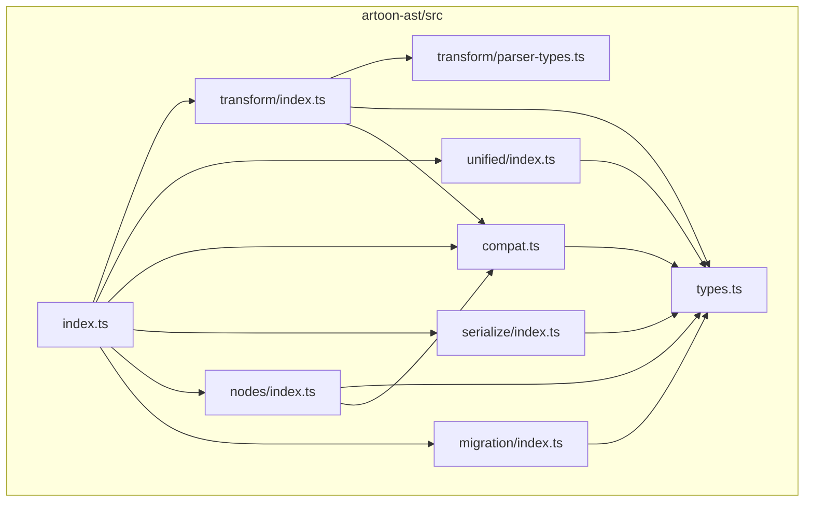
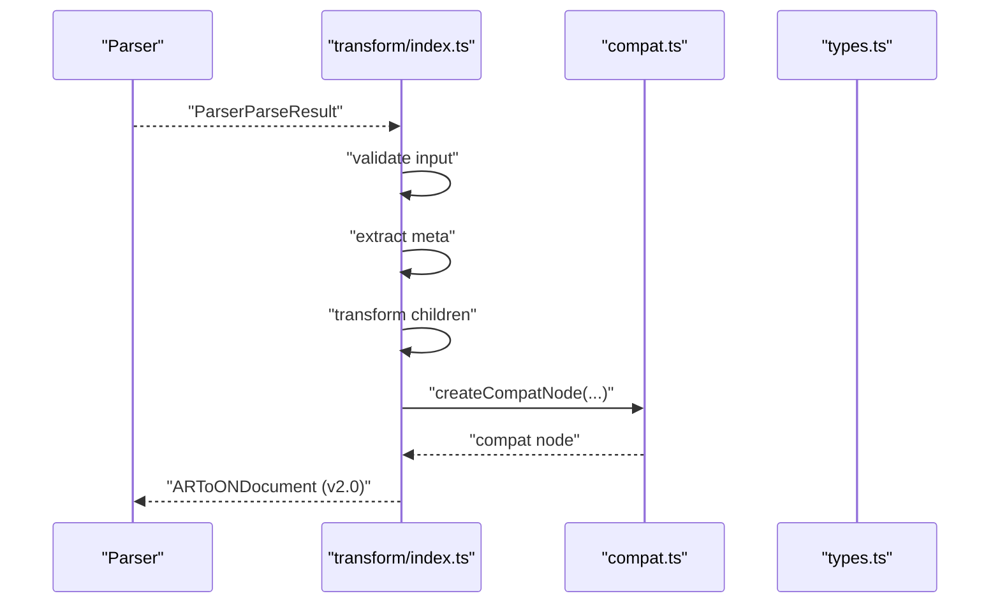
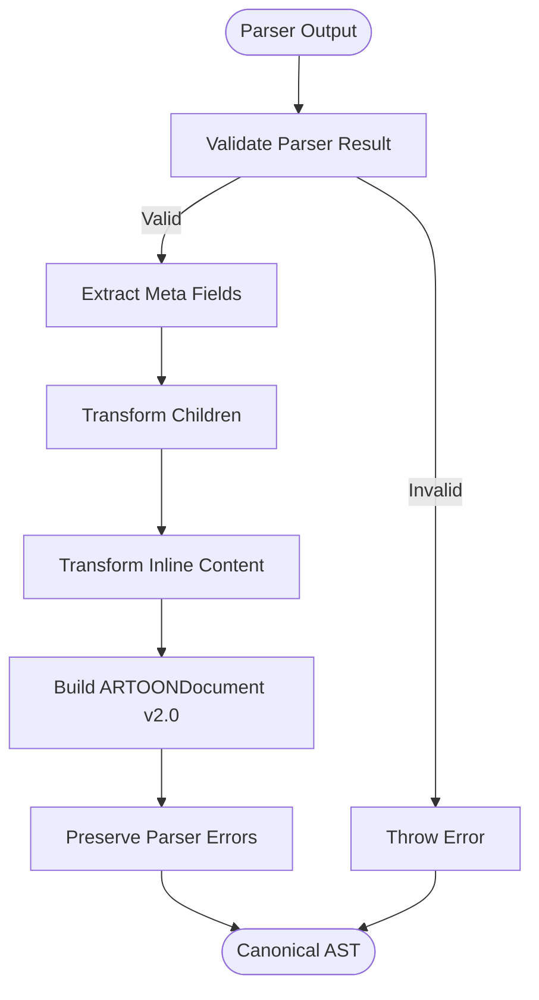
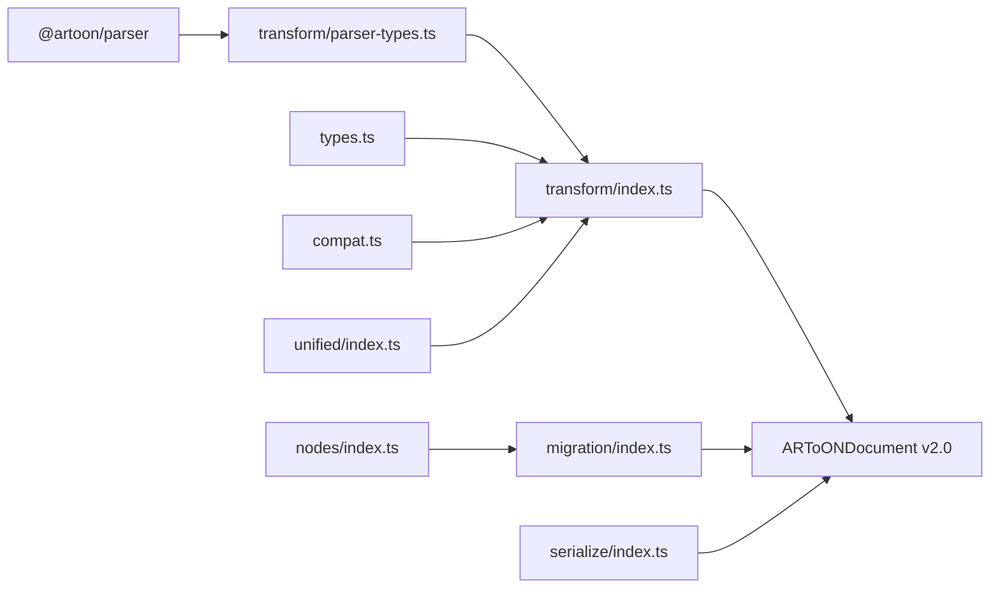

# Transformation Utilities

<cite>
**Referenced Files in This Document**
- [index.ts](file://artoon-ast/src/index.ts)
- [transform/index.ts](file://artoon-ast/src/transform/index.ts)
- [transform/parser-types.ts](file://artoon-ast/src/transform/parser-types.ts)
- [unified/index.ts](file://artoon-ast/src/unified/index.ts)
- [types.ts](file://artoon-ast/src/types.ts)
- [compat.ts](file://artoon-ast/src/compat.ts)
- [nodes/index.ts](file://artoon-ast/src/nodes/index.ts)
- [serialize/index.ts](file://artoon-ast/src/serialize/index.ts)
- [migration/index.ts](file://artoon-ast/src/migration/index.ts)
- [transform.test.ts](file://artoon-ast/tests/transform.test.ts)
</cite>

## Table of Contents
1. [Introduction](#introduction)
2. [Project Structure](#project-structure)
3. [Core Components](#core-components)
4. [Architecture Overview](#architecture-overview)
5. [Detailed Component Analysis](#detailed-component-analysis)
6. [Dependency Analysis](#dependency-analysis)
7. [Performance Considerations](#performance-considerations)
8. [Troubleshooting Guide](#troubleshooting-guide)
9. [Conclusion](#conclusion)
10. [Appendices](#appendices)

## Introduction
This document explains the AST transformation utilities and conversion pipelines in the ARTOON project. It focuses on how parser results are transformed into the canonical ARTOON AST (v2.0), including parser-type transformations, type coercion utilities, and format conversion tools. It also documents transformation rules, validation during conversion, error handling strategies, and how these transformations integrate with the broader ARTOON processing pipeline.

## Project Structure
The transformation utilities live primarily under artoon-ast/src and are complemented by related modules for types, compatibility, serialization, and migration. The key areas are:
- Transform: converts parser AST to canonical AST
- Types: defines canonical AST shapes and guards
- Compatibility: bridges old and new formats during migration
- Unified: target types for migration and interoperability
- Nodes: builders and traversal utilities
- Serialize: JSON conversion and statistics
- Migration: V1.x to V2.0 migration tooling

**Diagram sources**
- [index.ts:1-51](file://artoon-ast/src/index.ts#L1-L51)
- [transform/index.ts:1-511](file://artoon-ast/src/transform/index.ts#L1-L511)
- [transform/parser-types.ts:1-127](file://artoon-ast/src/transform/parser-types.ts#L1-L127)
- [unified/index.ts:1-338](file://artoon-ast/src/unified/index.ts#L1-L338)
- [types.ts:1-539](file://artoon-ast/src/types.ts#L1-L539)
- [compat.ts:1-283](file://artoon-ast/src/compat.ts#L1-L283)
- [nodes/index.ts:1-258](file://artoon-ast/src/nodes/index.ts#L1-L258)
- [serialize/index.ts:1-96](file://artoon-ast/src/serialize/index.ts#L1-L96)
- [migration/index.ts:1-76](file://artoon-ast/src/migration/index.ts#L1-L76)

**Section sources**
- [index.ts:1-51](file://artoon-ast/src/index.ts#L1-L51)

## Core Components
- Transform: Orchestrates conversion from parser AST to canonical AST v2.0, including meta extraction, node mapping, inline content transformation, and error propagation.
- Parser Types: Defines the parser’s AST shape to guide transformations safely.
- Types: Canonical AST types and runtime type guards for content and inline content.
- Compatibility: Provides normalization and compatibility helpers for migration and dual-format support.
- Unified: Defines the target migration types and type guards for interoperability.
- Nodes: Builders and traversal utilities for constructing and inspecting ASTs.
- Serialize: JSON serialization, deserialization, cloning, and statistics.
- Migration: Deep migration tool to convert legacy V1.x ASTs to V2.0 canonical form.

**Section sources**
- [transform/index.ts:64-77](file://artoon-ast/src/transform/index.ts#L64-L77)
- [transform/parser-types.ts:123-127](file://artoon-ast/src/transform/parser-types.ts#L123-L127)
- [types.ts:413-418](file://artoon-ast/src/types.ts#L413-L418)
- [compat.ts:35-64](file://artoon-ast/src/compat.ts#L35-L64)
- [unified/index.ts:248-253](file://artoon-ast/src/unified/index.ts#L248-L253)
- [nodes/index.ts:29-109](file://artoon-ast/src/nodes/index.ts#L29-L109)
- [serialize/index.ts:9-32](file://artoon-ast/src/serialize/index.ts#L9-L32)
- [migration/index.ts:14-75](file://artoon-ast/src/migration/index.ts#L14-L75)

## Architecture Overview
The transformation pipeline converts a parser result into a canonical ARTOON AST v2.0. It validates the input, extracts metadata, transforms children, and preserves parser errors. The pipeline avoids circular dependencies by deferring inline parsing for table cells and normalizing nodes via compatibility helpers.

**Diagram sources**
- [transform/index.ts:64-77](file://artoon-ast/src/transform/index.ts#L64-L77)
- [compat.ts:57-64](file://artoon-ast/src/compat.ts#L57-L64)
- [types.ts:413-418](file://artoon-ast/src/types.ts#L413-L418)

## Detailed Component Analysis

### Transform Module
Responsibilities:
- Validate parser result and extract AST and errors
- Transform meta block to DocumentMeta
- Map parser nodes to canonical ContentNode variants
- Transform inline content arrays and tokens
- Preserve and propagate parser errors

Key transformation rules:
- Meta fields mapped to standardized keys; unknown fields go to custom
- List items normalized to direct ListItem[] (v2.0)
- Separators become single separatorType (v2.0)
- Table cell content stored as plain text placeholders to avoid circular dependency
- Inline content supports both old (text + inlines) and new (InlineContent[]) formats

Validation and error handling:
- Throws on invalid parser result
- Propagates parser errors into the AST
- Inline content fallback ensures robustness

Examples of common scenarios:
- Simple paragraph to text node
- Headings to text nodes with appropriate textType
- Lists to list nodes with normalized items
- Tables with headers and rows
- Code blocks to block nodes with isCode and language
- Compound nodes with roles derived from componentType
- Separators as distinct nodes (v2.0)

Custom transformation development:
- Extend node mapping in transformNode
- Add new inline token mappings in transformInlineToken
- Introduce new parser node types via parser-types.ts and update ParserNode union

Performance considerations:
- Avoid deep parsing inside table cells; defer to higher-level consumers
- Use direct ListItem[] for nested lists to reduce indirection
- Minimize repeated conversions by leveraging compatibility helpers

**Section sources**
- [transform/index.ts:64-77](file://artoon-ast/src/transform/index.ts#L64-L77)
- [transform/index.ts:82-133](file://artoon-ast/src/transform/index.ts#L82-L133)
- [transform/index.ts:138-170](file://artoon-ast/src/transform/index.ts#L138-L170)
- [transform/index.ts:175-183](file://artoon-ast/src/transform/index.ts#L175-L183)
- [transform/index.ts:190-204](file://artoon-ast/src/transform/index.ts#L190-L204)
- [transform/index.ts:209-217](file://artoon-ast/src/transform/index.ts#L209-L217)
- [transform/index.ts:224-244](file://artoon-ast/src/transform/index.ts#L224-L244)
- [transform/index.ts:249-277](file://artoon-ast/src/transform/index.ts#L249-L277)
- [transform/index.ts:282-287](file://artoon-ast/src/transform/index.ts#L282-L287)
- [transform/index.ts:292-321](file://artoon-ast/src/transform/index.ts#L292-L321)
- [transform/index.ts:326-347](file://artoon-ast/src/transform/index.ts#L326-L347)
- [transform/index.ts:352-363](file://artoon-ast/src/transform/index.ts#L352-L363)
- [transform/index.ts:368-377](file://artoon-ast/src/transform/index.ts#L368-L377)
- [transform/index.ts:382-390](file://artoon-ast/src/transform/index.ts#L382-L390)
- [transform/index.ts:395-402](file://artoon-ast/src/transform/index.ts#L395-L402)
- [transform/index.ts:408-455](file://artoon-ast/src/transform/index.ts#L408-L455)
- [transform/index.ts:460-510](file://artoon-ast/src/transform/index.ts#L460-L510)

#### Parser Types
Defines the parser AST shape used by the transform module. Includes base node, inline token, and document node interfaces. This prevents circular dependencies by avoiding importing the parser’s inline parser directly.

**Section sources**
- [transform/parser-types.ts:12-127](file://artoon-ast/src/transform/parser-types.ts#L12-L127)

#### Types
Defines the canonical ARTOON AST v2.0 types and runtime type guards. It also includes deprecated nodeType compatibility and migration-related notes.

**Section sources**
- [types.ts:413-418](file://artoon-ast/src/types.ts#L413-L418)
- [types.ts:424-539](file://artoon-ast/src/types.ts#L424-L539)

#### Compatibility
Provides helpers to normalize nodes and maintain compatibility between old and new formats during migration. Includes createCompatNode, normalizeNode, and migration utilities.

**Section sources**
- [compat.ts:35-64](file://artoon-ast/src/compat.ts#L35-L64)
- [compat.ts:106-141](file://artoon-ast/src/compat.ts#L106-L141)
- [compat.ts:153-199](file://artoon-ast/src/compat.ts#L153-L199)
- [compat.ts:211-230](file://artoon-ast/src/compat.ts#L211-L230)
- [compat.ts:242-282](file://artoon-ast/src/compat.ts#L242-L282)

#### Unified Types
Defines the target migration types and type guards for interoperability across ARTOON packages. Highlights key v2.0 changes such as nodeType → type, list children normalization, and separatorType simplification.

**Section sources**
- [unified/index.ts:57-66](file://artoon-ast/src/unified/index.ts#L57-L66)
- [unified/index.ts:113-125](file://artoon-ast/src/unified/index.ts#L113-L125)
- [unified/index.ts:143-150](file://artoon-ast/src/unified/index.ts#L143-L150)
- [unified/index.ts:259-305](file://artoon-ast/src/unified/index.ts#L259-L305)
- [unified/index.ts:315-337](file://artoon-ast/src/unified/index.ts#L315-L337)

#### Nodes Utilities
Provides builders for creating nodes and traversal utilities for visiting nodes, finding nodes by type, extracting text, counting nodes, and inline content utilities.

**Section sources**
- [nodes/index.ts:29-45](file://artoon-ast/src/nodes/index.ts#L29-L45)
- [nodes/index.ts:78-90](file://artoon-ast/src/nodes/index.ts#L78-L90)
- [nodes/index.ts:97-109](file://artoon-ast/src/nodes/index.ts#L97-L109)
- [nodes/index.ts:118-150](file://artoon-ast/src/nodes/index.ts#L118-L150)
- [nodes/index.ts:169-182](file://artoon-ast/src/nodes/index.ts#L169-L182)
- [nodes/index.ts:187-204](file://artoon-ast/src/nodes/index.ts#L187-L204)
- [nodes/index.ts:209-218](file://artoon-ast/src/nodes/index.ts#L209-L218)
- [nodes/index.ts:227-231](file://artoon-ast/src/nodes/index.ts#L227-L231)
- [nodes/index.ts:236-257](file://artoon-ast/src/nodes/index.ts#L236-L257)

#### Serialization
Provides JSON serialization, deserialization, compact JSON, cloning, and statistics collection. Deserialization validates the AST version.

**Section sources**
- [serialize/index.ts:9-25](file://artoon-ast/src/serialize/index.ts#L9-L25)
- [serialize/index.ts:30-32](file://artoon-ast/src/serialize/index.ts#L30-L32)
- [serialize/index.ts:37-39](file://artoon-ast/src/serialize/index.ts#L37-L39)
- [serialize/index.ts:44-56](file://artoon-ast/src/serialize/index.ts#L44-L56)
- [serialize/index.ts:66-95](file://artoon-ast/src/serialize/index.ts#L66-L95)

#### Migration
Deep migrates legacy V1.x ASTs to V2.0 canonical format, converting nodeType → type, list children normalization, and separatorType migration.

**Section sources**
- [migration/index.ts:14-75](file://artoon-ast/src/migration/index.ts#L14-L75)

### Conceptual Overview
The transformation pipeline integrates with the broader ARTOON processing chain by converting parser outputs into a stable, versioned AST that downstream modules (renderer, validator, serializer) consume. Compatibility helpers ensure smooth migration, while unified types standardize interfaces across packages.

[No sources needed since this diagram shows conceptual workflow, not actual code structure]

## Dependency Analysis
The transform module depends on parser types, canonical types, and compatibility helpers. It avoids circular dependencies by deferring inline parsing for table cells and using compatibility wrappers. The migration tool depends on nodes traversal utilities.

**Diagram sources**
- [transform/index.ts:5-59](file://artoon-ast/src/transform/index.ts#L5-L59)
- [transform/parser-types.ts:1-10](file://artoon-ast/src/transform/parser-types.ts#L1-L10)
- [types.ts:1-11](file://artoon-ast/src/types.ts#L1-L11)
- [compat.ts:1-18](file://artoon-ast/src/compat.ts#L1-L18)
- [nodes/index.ts:1-23](file://artoon-ast/src/nodes/index.ts#L1-L23)
- [migration/index.ts:1-2](file://artoon-ast/src/migration/index.ts#L1-L2)
- [serialize/index.ts:1-4](file://artoon-ast/src/serialize/index.ts#L1-L4)
- [unified/index.ts:15-29](file://artoon-ast/src/unified/index.ts#L15-L29)

**Section sources**
- [transform/index.ts:5-59](file://artoon-ast/src/transform/index.ts#L5-L59)
- [migration/index.ts:1-2](file://artoon-ast/src/migration/index.ts#L1-L2)

## Performance Considerations
- Prefer direct ListItem[] for nested lists to reduce indirection and simplify traversal.
- Avoid deep inline parsing inside table cells; store plain text and defer parsing to higher-level consumers.
- Use compatibility helpers sparingly; rely on canonical types for new code.
- Leverage serialization utilities for efficient cloning and compact JSON output.
- Use type guards and unified types to minimize runtime checks and improve type safety.

[No sources needed since this section provides general guidance]

## Troubleshooting Guide
Common issues and strategies:
- Invalid parser result: The transform function throws when the parser result lacks an AST. Ensure the parser returns a valid result before calling transform.
- Unsupported inline content format: The transformInlineContent function handles both old and new inline formats; if encountering unexpected tokens, verify the parser’s inline token structure.
- Legacy format nodes: Use compatibility helpers to normalize nodes or migration tool to convert to v2.0 canonical format.
- Parser errors: Errors from the parser are preserved in the AST; inspect the errors array for diagnostics.
- Version mismatch: Serialization’s fromJSON validates the AST version; ensure the document is v1.0 or v2.0.

**Section sources**
- [transform/index.ts:66-68](file://artoon-ast/src/transform/index.ts#L66-L68)
- [transform/index.ts:408-455](file://artoon-ast/src/transform/index.ts#L408-L455)
- [compat.ts:242-282](file://artoon-ast/src/compat.ts#L242-L282)
- [serialize/index.ts:19-22](file://artoon-ast/src/serialize/index.ts#L19-L22)
- [transform.test.ts:35-42](file://artoon-ast/tests/transform.test.ts#L35-L42)

## Conclusion
The ARTOON AST transformation utilities provide a robust, versioned pipeline for converting parser outputs into a canonical AST v2.0. They incorporate compatibility helpers, unified types, and migration tools to support smooth transitions and interoperability. By following the documented transformation rules, validation, and error handling strategies, developers can extend the pipeline with confidence and optimize performance for real-world usage.

## Appendices

### Example Scenarios and Test References
- Simple paragraph transformation and meta handling are covered by tests.
- Inline content with modifiers and links is validated in tests.
- Lists, tables, code blocks, and compound nodes are exercised in tests.
- Separator transformations and combined separators behavior are verified in tests.

**Section sources**
- [transform.test.ts:10-18](file://artoon-ast/tests/transform.test.ts#L10-L18)
- [transform.test.ts:20-33](file://artoon-ast/tests/transform.test.ts#L20-L33)
- [transform.test.ts:60-73](file://artoon-ast/tests/transform.test.ts#L60-L73)
- [transform.test.ts:79-91](file://artoon-ast/tests/transform.test.ts#L79-L91)
- [transform.test.ts:97-113](file://artoon-ast/tests/transform.test.ts#L97-L113)
- [transform.test.ts:118-133](file://artoon-ast/tests/transform.test.ts#L118-L133)
- [transform.test.ts:139-151](file://artoon-ast/tests/transform.test.ts#L139-L151)
- [transform.test.ts:157-176](file://artoon-ast/tests/transform.test.ts#L157-L176)