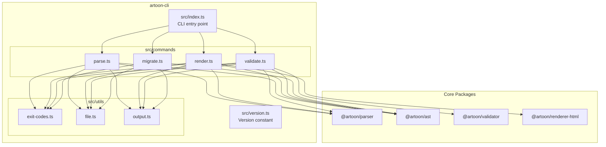
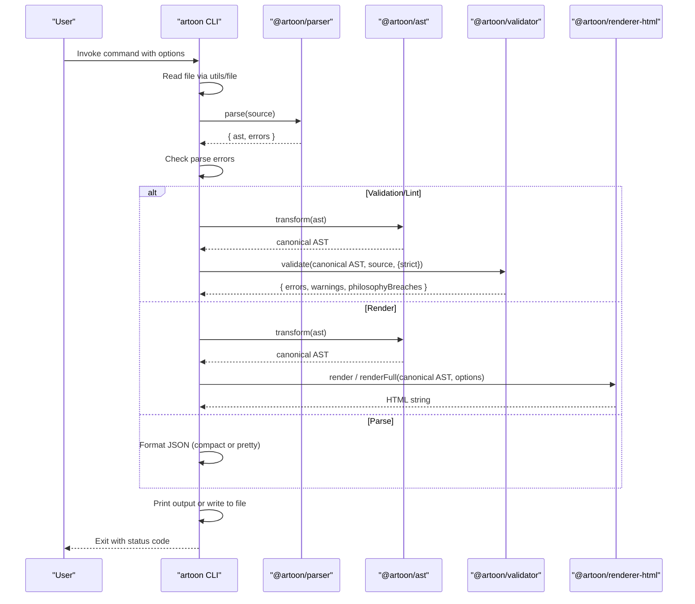
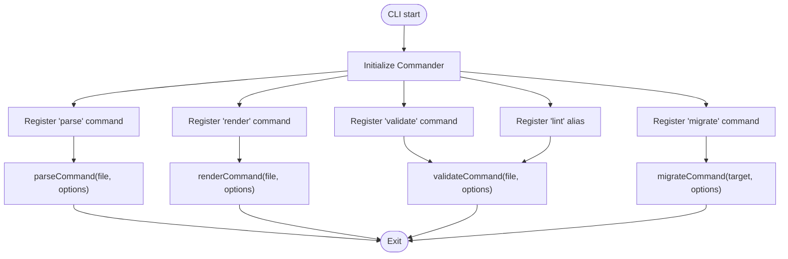
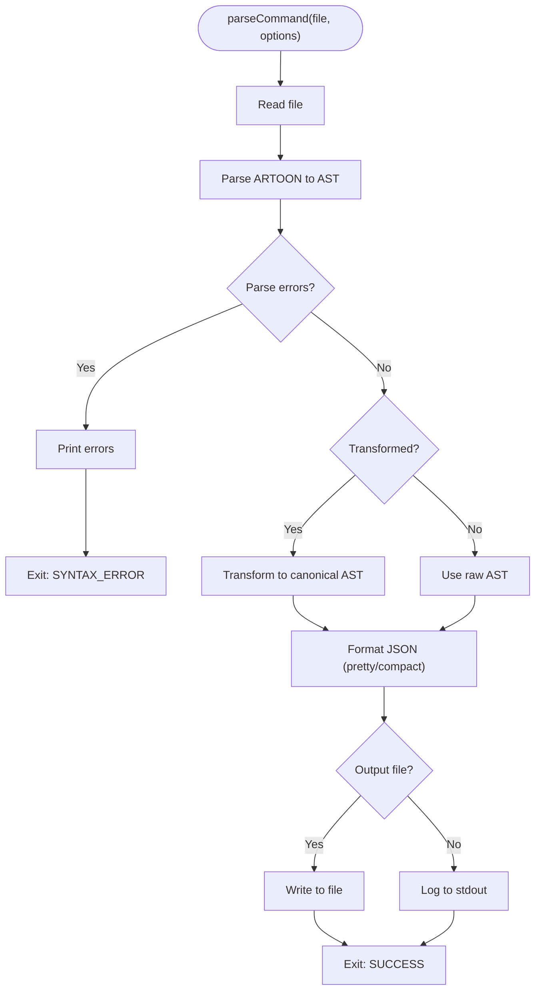
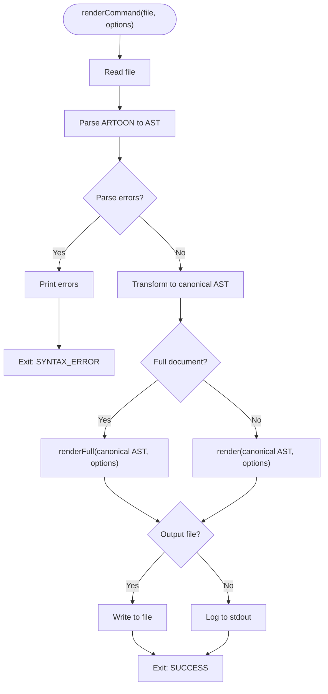
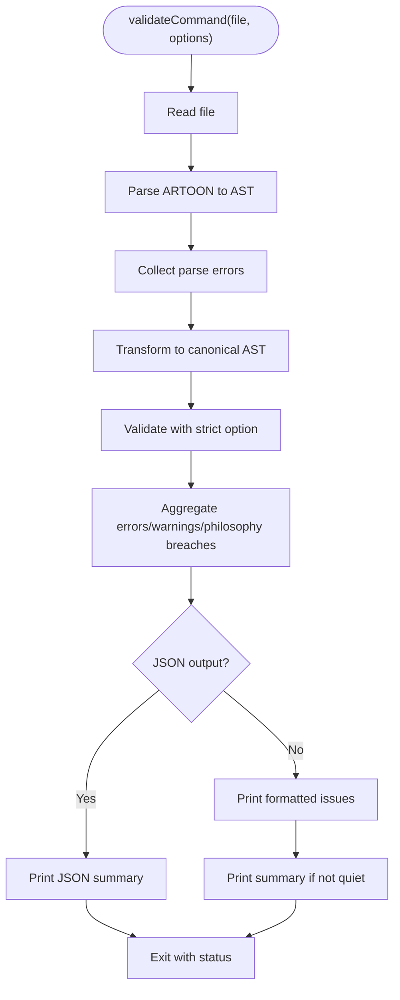
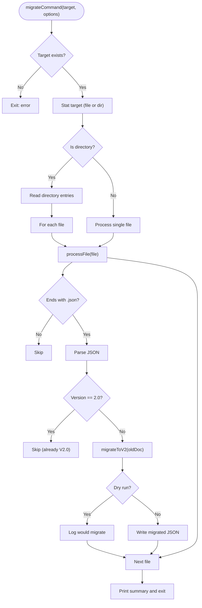
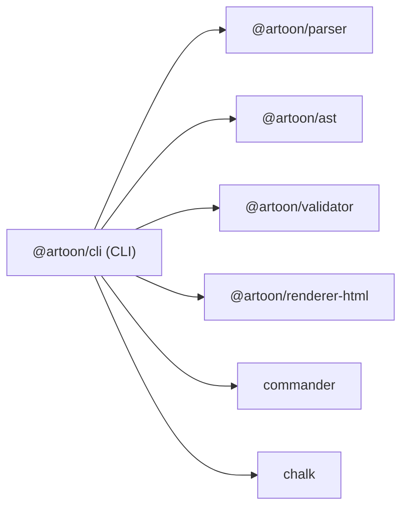

# CLI Overview

<cite>
**Referenced Files in This Document**
- [package.json](file://artoon-cli/package.json)
- [index.ts](file://artoon-cli/src/index.ts)
- [version.ts](file://artoon-cli/src/version.ts)
- [parse.ts](file://artoon-cli/src/commands/parse.ts)
- [render.ts](file://artoon-cli/src/commands/render.ts)
- [validate.ts](file://artoon-cli/src/commands/validate.ts)
- [migrate.ts](file://artoon-cli/src/commands/migrate.ts)
- [exit-codes.ts](file://artoon-cli/src/utils/exit-codes.ts)
- [file.ts](file://artoon-cli/src/utils/file.ts)
- [output.ts](file://artoon-cli/src/utils/output.ts)
</cite>

## Table of Contents
1. [Introduction](#introduction)
2. [Project Structure](#project-structure)
3. [Core Components](#core-components)
4. [Architecture Overview](#architecture-overview)
5. [Detailed Component Analysis](#detailed-component-analysis)
6. [Dependency Analysis](#dependency-analysis)
7. [Performance Considerations](#performance-considerations)
8. [Troubleshooting Guide](#troubleshooting-guide)
9. [Conclusion](#conclusion)
10. [Appendices](#appendices)

## Introduction
This document provides a comprehensive overview of the ARTOON CLI package. It explains the CLI architecture, command structure, and version management, and describes how the CLI integrates with core ARTOON packages to support parsing, rendering, validating, linting, and migrating ARTOON documents. It also covers installation, usage patterns, integration with build systems, and troubleshooting guidance.

## Project Structure
The ARTOON CLI is organized around a central entry point that registers commands via the Commander library. Each command encapsulates a focused workflow and delegates to core ARTOON packages for parsing, AST transformation, validation, and HTML rendering. Utility modules handle file I/O, exit codes, and formatted output.

**Diagram sources**
- [index.ts:1-61](file://artoon-cli/src/index.ts#L1-L61)
- [parse.ts:1-66](file://artoon-cli/src/commands/parse.ts#L1-L66)
- [render.ts:1-63](file://artoon-cli/src/commands/render.ts#L1-L63)
- [validate.ts:1-150](file://artoon-cli/src/commands/validate.ts#L1-L150)
- [migrate.ts:1-56](file://artoon-cli/src/commands/migrate.ts#L1-L56)
- [file.ts:1-51](file://artoon-cli/src/utils/file.ts#L1-L51)
- [output.ts:1-69](file://artoon-cli/src/utils/output.ts#L1-L69)
- [exit-codes.ts:1-12](file://artoon-cli/src/utils/exit-codes.ts#L1-L12)

**Section sources**
- [package.json:1-34](file://artoon-cli/package.json#L1-L34)
- [index.ts:1-61](file://artoon-cli/src/index.ts#L1-L61)

## Core Components
- CLI entry point: Initializes Commander, sets name/description/version, and registers commands with their options/actions.
- Commands:
  - parse: Reads an ARTOON file, parses to AST, optionally transforms to canonical form, formats JSON, and writes to file or stdout.
  - render: Parses an ARTOON file, transforms to canonical AST, renders to HTML (partial or full document), and writes to file or stdout.
  - validate/lint: Parses an ARTOON file, validates against semantic rules, and prints human-readable or JSON-formatted reports with counts and exit codes.
  - migrate: Scans a target path (file or directory), migrates legacy ARTOON AST JSON to V2.0, supports dry-run preview.
- Utilities:
  - exit-codes: Standardized exit codes for success, syntax errors, validation failures, philosophy breaches, file not found, IO errors, and unknown errors.
  - file: Robust file read/write with automatic directory creation and path resolution.
  - output: Colored console output helpers and formatting for validation issues and summaries.

**Section sources**
- [index.ts:10-61](file://artoon-cli/src/index.ts#L10-L61)
- [parse.ts:13-66](file://artoon-cli/src/commands/parse.ts#L13-L66)
- [render.ts:14-63](file://artoon-cli/src/commands/render.ts#L14-L63)
- [validate.ts:22-150](file://artoon-cli/src/commands/validate.ts#L22-L150)
- [migrate.ts:5-56](file://artoon-cli/src/commands/migrate.ts#L5-L56)
- [exit-codes.ts:1-12](file://artoon-cli/src/utils/exit-codes.ts#L1-L12)
- [file.ts:10-51](file://artoon-cli/src/utils/file.ts#L10-L51)
- [output.ts:12-69](file://artoon-cli/src/utils/output.ts#L12-L69)

## Architecture Overview
The CLI acts as a thin orchestration layer around core ARTOON packages. Each command follows a consistent flow:
- Read input file
- Parse ARTOON content
- Validate parse results
- Transform to canonical AST when needed
- Apply domain-specific processing (validation or rendering)
- Write output or print to stdout
- Exit with appropriate status code

**Diagram sources**
- [index.ts:17-58](file://artoon-cli/src/index.ts#L17-L58)
- [parse.ts:13-66](file://artoon-cli/src/commands/parse.ts#L13-L66)
- [render.ts:14-63](file://artoon-cli/src/commands/render.ts#L14-L63)
- [validate.ts:22-150](file://artoon-cli/src/commands/validate.ts#L22-L150)
- [file.ts:10-41](file://artoon-cli/src/utils/file.ts#L10-L41)
- [output.ts:12-69](file://artoon-cli/src/utils/output.ts#L12-L69)

## Detailed Component Analysis

### CLI Entry Point and Command Registration
- Sets CLI name, description, and version.
- Registers commands with descriptions and options.
- Provides an alias for validate as lint.
- Parses arguments and routes to the appropriate action.

**Diagram sources**
- [index.ts:10-61](file://artoon-cli/src/index.ts#L10-L61)

**Section sources**
- [index.ts:10-61](file://artoon-cli/src/index.ts#L10-L61)
- [version.ts:1-2](file://artoon-cli/src/version.ts#L1-L2)

### Parse Command
- Reads file content.
- Parses to produce AST and collects parse errors.
- Optionally transforms to canonical AST and formats JSON (pretty or compact).
- Writes to output file or logs to stdout.
- Exits with standardized status codes.

**Diagram sources**
- [parse.ts:13-66](file://artoon-cli/src/commands/parse.ts#L13-L66)
- [file.ts:10-41](file://artoon-cli/src/utils/file.ts#L10-L41)
- [output.ts:12-30](file://artoon-cli/src/utils/output.ts#L12-L30)
- [exit-codes.ts:1-12](file://artoon-cli/src/utils/exit-codes.ts#L1-L12)

**Section sources**
- [parse.ts:13-66](file://artoon-cli/src/commands/parse.ts#L13-L66)

### Render Command
- Reads file content.
- Parses to AST and transforms to canonical AST.
- Renders HTML (partial or full document) with optional direction attributes.
- Writes to output file or logs to stdout.
- Exits with standardized status codes.

**Diagram sources**
- [render.ts:14-63](file://artoon-cli/src/commands/render.ts#L14-L63)
- [file.ts:10-41](file://artoon-cli/src/utils/file.ts#L10-L41)
- [output.ts:12-30](file://artoon-cli/src/utils/output.ts#L12-L30)
- [exit-codes.ts:1-12](file://artoon-cli/src/utils/exit-codes.ts#L1-L12)

**Section sources**
- [render.ts:14-63](file://artoon-cli/src/commands/render.ts#L14-L63)

### Validate/Lint Command
- Reads file content.
- Parses to AST and collects parse errors.
- Transforms to canonical AST and validates with optional strict mode.
- Aggregates validation errors, warnings, and philosophy breaches.
- Prints human-readable report or JSON output with counts.
- Exits with SUCCESS, VALIDATION_ERROR, or PHILOSOPHY_BREACH depending on severity and options.

**Diagram sources**
- [validate.ts:22-150](file://artoon-cli/src/commands/validate.ts#L22-L150)
- [file.ts:10-24](file://artoon-cli/src/utils/file.ts#L10-L24)
- [output.ts:39-69](file://artoon-cli/src/utils/output.ts#L39-L69)
- [exit-codes.ts:1-12](file://artoon-cli/src/utils/exit-codes.ts#L1-L12)

**Section sources**
- [validate.ts:22-150](file://artoon-cli/src/commands/validate.ts#L22-L150)

### Migrate Command
- Validates target path exists.
- Recursively processes files in a directory or a single file.
- Skips non-JSON files and files already at V2.0.
- Migrates legacy ARTOON AST JSON to V2.0, supports dry-run preview.
- Reports processed and migrated counts.

**Diagram sources**
- [migrate.ts:5-56](file://artoon-cli/src/commands/migrate.ts#L5-L56)

**Section sources**
- [migrate.ts:5-56](file://artoon-cli/src/commands/migrate.ts#L5-L56)

## Dependency Analysis
The CLI depends on core ARTOON packages and standard utilities:
- @artoon/parser: Parses ARTOON source into AST and collects parse errors.
- @artoon/ast: Provides AST transformation to canonical form and serialization utilities.
- @artoon/validator: Validates canonical AST against semantic rules and philosophy guidelines.
- @artoon/renderer-html: Renders canonical AST to HTML (partial or full document).
- commander: CLI framework for command definition and argument parsing.
- chalk: Terminal styling for colored output.

**Diagram sources**
- [package.json:18-25](file://artoon-cli/package.json#L18-L25)

**Section sources**
- [package.json:18-25](file://artoon-cli/package.json#L18-L25)

## Performance Considerations
- Parsing and transforming are CPU-bound; avoid unnecessary repeated transformations by using the transformed flag only when needed.
- Rendering HTML is I/O bound; prefer writing to files for large outputs to reduce memory overhead.
- Validation with strict mode increases runtime due to additional checks; enable only when required.
- Batch migration operations traverse directories recursively; limit scope to targeted folders to reduce I/O.

## Troubleshooting Guide
Common issues and resolutions:
- File not found or unreadable:
  - Symptom: Error printed and exit code indicates FILE_NOT_FOUND.
  - Resolution: Verify file path and permissions; use absolute paths if necessary.
- Syntax errors during parse:
  - Symptom: Parse errors reported with line numbers; exit code indicates SYNTAX_ERROR.
  - Resolution: Fix ARTOON syntax near indicated lines; validate incrementally.
- IO errors while writing:
  - Symptom: Error printed and exit code indicates IO_ERROR.
  - Resolution: Ensure output directory exists or is writable; check disk space.
- Validation failures:
  - Symptom: Errors and/or warnings reported; exit code indicates VALIDATION_ERROR.
  - Resolution: Address validation messages; use strict mode to treat warnings as errors.
- Philosophy breaches (strict mode):
  - Symptom: Warnings treated as errors; exit code indicates PHILOSOPHY_BREACH.
  - Resolution: Align content with ARTOON philosophy guidelines.
- Migration dry-run:
  - Symptom: Files listed as would be migrated without changes.
  - Resolution: Run without dry-run to apply migrations.

**Section sources**
- [file.ts:10-41](file://artoon-cli/src/utils/file.ts#L10-L41)
- [output.ts:12-30](file://artoon-cli/src/utils/output.ts#L12-L30)
- [exit-codes.ts:1-12](file://artoon-cli/src/utils/exit-codes.ts#L1-L12)
- [validate.ts:141-149](file://artoon-cli/src/commands/validate.ts#L141-L149)

## Conclusion
The ARTOON CLI provides a streamlined interface to ARTOON’s core capabilities: parsing to AST, transforming to canonical form, validating with strict and philosophy-aware modes, rendering to HTML, and migrating legacy AST JSON. Its modular design, consistent exit codes, and robust file handling make it suitable for integration into automated workflows and CI/CD pipelines.

## Appendices

### Installation and Setup
- Install globally or locally in a project:
  - npm install -g @artoon/cli
  - npm install @artoon/cli --save-dev
- Build from source (if needed):
  - npm run build (TypeScript compilation)
  - npm run start (run built binary)

**Section sources**
- [package.json:10-14](file://artoon-cli/package.json#L10-L14)

### Basic Usage Patterns
- Show help and version:
  - artoon --help
  - artoon -v
- Parse to AST:
  - artoon parse <file> [-o <output>] [--compact] [--transformed]
- Render to HTML:
  - artoon render <file> [-o <output>] [--full] [--no-direction]
- Validate/Lint:
  - artoon validate <file> [--strict] [--quiet] [--json]
  - artoon lint <file> [--strict] [--quiet] [--json]
- Migrate legacy AST:
  - artoon migrate <directory_or_file> [--dry-run]

**Section sources**
- [index.ts:17-58](file://artoon-cli/src/index.ts#L17-L58)
- [parse.ts:13-24](file://artoon-cli/src/commands/parse.ts#L13-L24)
- [render.ts:14-33](file://artoon-cli/src/commands/render.ts#L14-L33)
- [validate.ts:22-42](file://artoon-cli/src/commands/validate.ts#L22-L42)
- [migrate.ts:5-56](file://artoon-cli/src/commands/migrate.ts#L5-L56)

### Integration Examples with Build Systems
- Pre-commit hook:
  - Run artoon validate on staged .artoon/.toon files.
- CI pipeline:
  - Validate PR diffs; fail on validation errors or philosophy breaches in strict mode.
- Build artifacts:
  - Render HTML outputs for documentation sites; write to dist/ or docs/ directories.
- Migration step:
  - Run artoon migrate on legacy AST JSON before publishing or merging.

**Section sources**
- [validate.ts:141-149](file://artoon-cli/src/commands/validate.ts#L141-L149)
- [render.ts:49-61](file://artoon-cli/src/commands/render.ts#L49-L61)
- [migrate.ts:43-56](file://artoon-cli/src/commands/migrate.ts#L43-L56)

### Version Management
- CLI version is defined in the version module and exposed via the CLI.
- Core package versions are pinned in package.json to ensure compatibility.

**Section sources**
- [version.ts:1-2](file://artoon-cli/src/version.ts#L1-L2)
- [package.json:3-3](file://artoon-cli/package.json#L3-L3)