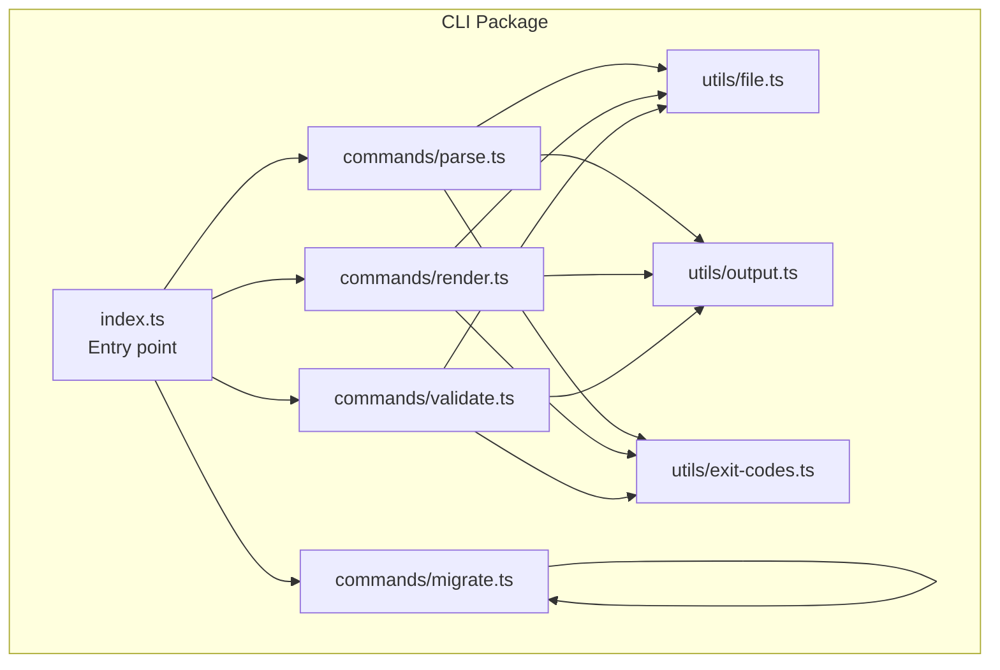
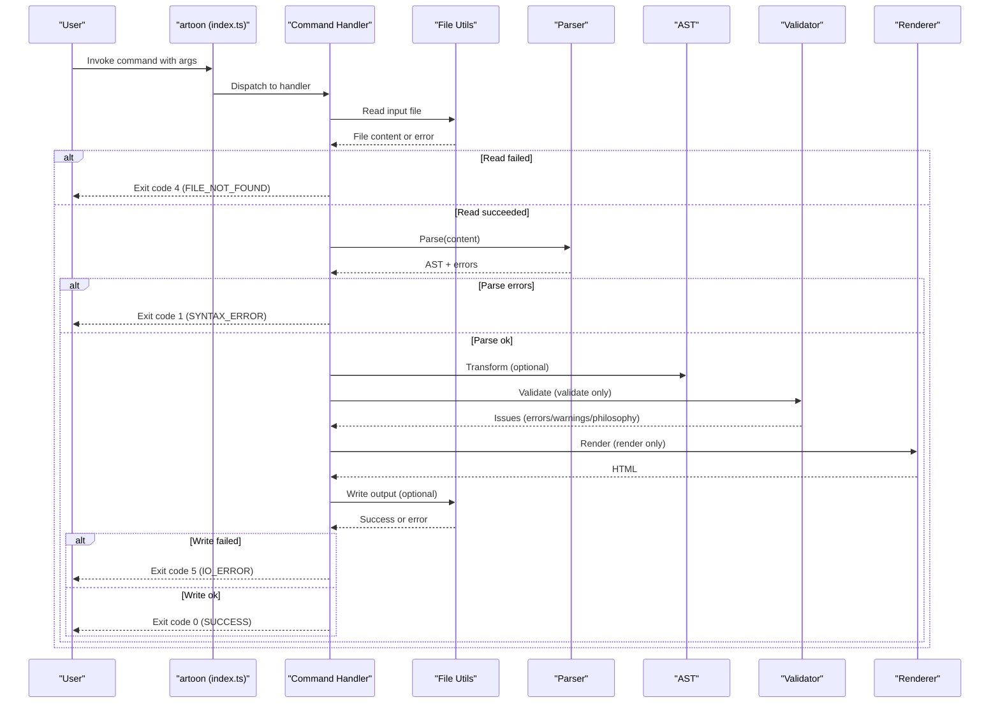
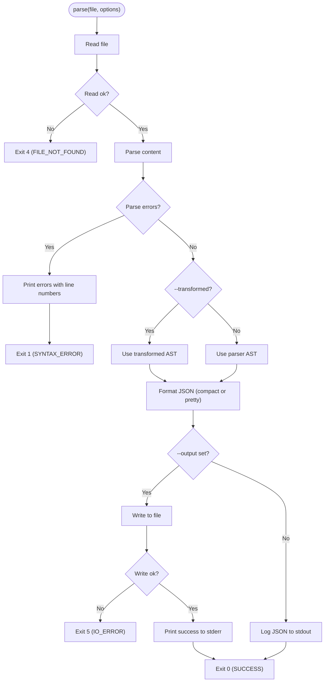
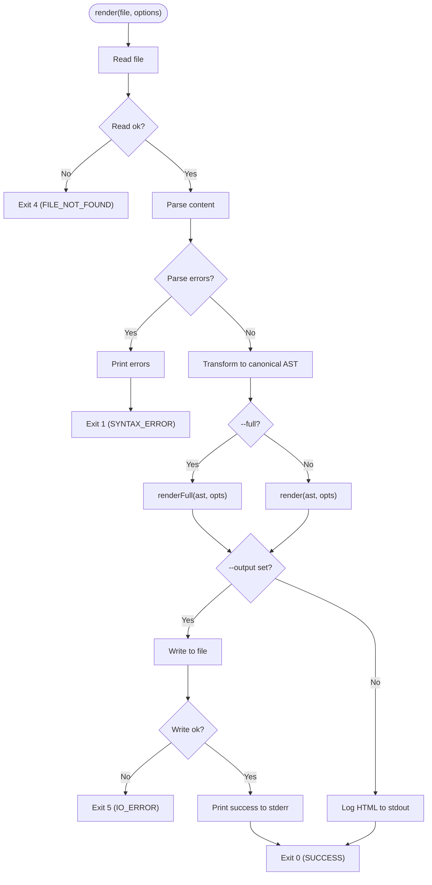
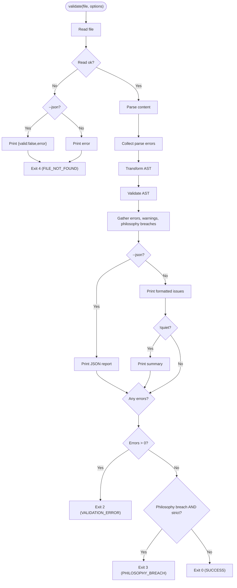
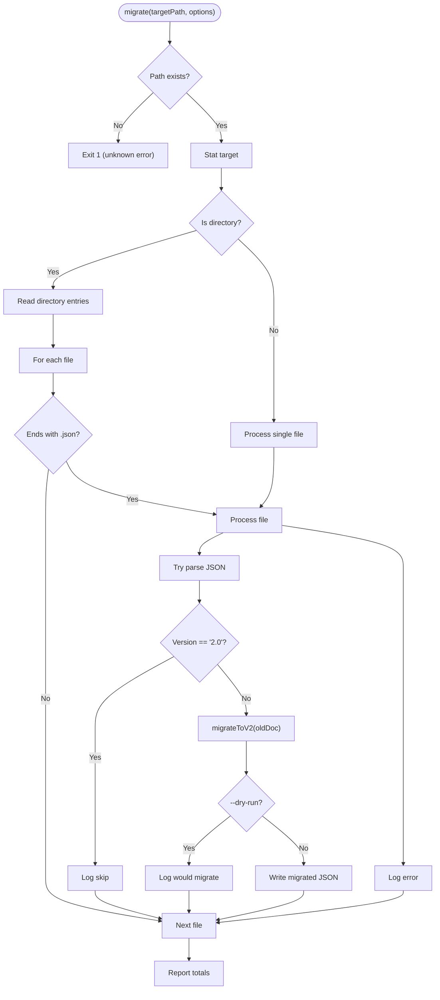
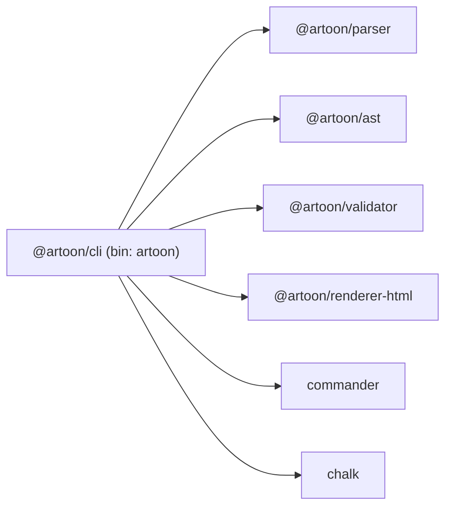

# CLI Package

<cite>
**Referenced Files in This Document**
- [package.json](file://artoon-cli/package.json)
- [index.ts](file://artoon-cli/src/index.ts)
- [version.ts](file://artoon-cli/src/version.ts)
- [parse.ts](file://artoon-cli/src/commands/parse.ts)
- [render.ts](file://artoon-cli/src/commands/render.ts)
- [validate.ts](file://artoon-cli/src/commands/validate.ts)
- [migrate.ts](file://artoon-cli/src/commands/migrate.ts)
- [exit-codes.ts](file://artoon-cli/src/utils/exit-codes.ts)
- [file.ts](file://artoon-cli/src/utils/file.ts)
- [output.ts](file://artoon-cli/src/utils/output.ts)
- [04-COMMANDS.md](file://artoon-cli/inventory_artoon_cli/04-COMMANDS.md)
- [05-EXIT-CODES.md](file://artoon-cli/inventory_artoon_cli/05-EXIT-CODES.md)
- [06-OUTPUT-CONTRACTS.md](file://artoon-cli/inventory_artoon_cli/06-OUTPUT-CONTRACTS.md)
- [08-EXAMPLES.md](file://artoon-cli/inventory_artoon_cli/08-EXAMPLES.md)
- [integration.test.ts](file://artoon-cli/tests/integration.test.ts)
</cite>

## Table of Contents
1. [Introduction](#introduction)
2. [Project Structure](#project-structure)
3. [Core Components](#core-components)
4. [Architecture Overview](#architecture-overview)
5. [Detailed Component Analysis](#detailed-component-analysis)
6. [Dependency Analysis](#dependency-analysis)
7. [Performance Considerations](#performance-considerations)
8. [Troubleshooting Guide](#troubleshooting-guide)
9. [Conclusion](#conclusion)
10. [Appendices](#appendices)

## Introduction
This document provides comprehensive documentation for the ARTOON CLI package. It explains the command-line interface, available commands (parse, render, validate, and migrate), argument parsing, file handling utilities, output formatting, exit codes, error reporting, and batch processing capabilities. It also includes practical examples for workflows, automation scripts, and CI/CD integration, along with configuration options, input/output handling, performance considerations, and troubleshooting guidance.

## Project Structure
The CLI package exposes a single executable named artoon and organizes functionality into commands and shared utilities. The main entry point defines the CLI surface, while commands orchestrate parsing, transformation, rendering, and validation via shared utilities.

**Diagram sources**
- [index.ts:10-60](file://artoon-cli/src/index.ts#L10-L60)
- [parse.ts:1-66](file://artoon-cli/src/commands/parse.ts#L1-L66)
- [render.ts:1-63](file://artoon-cli/src/commands/render.ts#L1-L63)
- [validate.ts:1-150](file://artoon-cli/src/commands/validate.ts#L1-L150)
- [migrate.ts:1-56](file://artoon-cli/src/commands/migrate.ts#L1-L56)
- [file.ts:1-51](file://artoon-cli/src/utils/file.ts#L1-L51)
- [output.ts:1-69](file://artoon-cli/src/utils/output.ts#L1-L69)
- [exit-codes.ts:1-12](file://artoon-cli/src/utils/exit-codes.ts#L1-L12)

**Section sources**
- [package.json:1-34](file://artoon-cli/package.json#L1-L34)
- [index.ts:1-61](file://artoon-cli/src/index.ts#L1-L61)

## Core Components
- Command registration and help/version:
  - Registers four commands: parse, render, validate, and migrate.
  - Provides --version and global description.
- Command options:
  - parse: output file, compact JSON, transformed AST.
  - render: output file, full HTML document, direction attribute toggle.
  - validate/lint: strict mode, quiet mode, JSON output.
  - migrate: dry-run flag for previewing changes.
- Shared utilities:
  - File I/O with safe read/write and directory creation.
  - Output formatting with colored messages and standardized formats.
  - Exit codes for deterministic shell scripting and CI/CD.

**Section sources**
- [index.ts:10-60](file://artoon-cli/src/index.ts#L10-L60)
- [04-COMMANDS.md:14-294](file://artoon-cli/inventory_artoon_cli/04-COMMANDS.md#L14-L294)

## Architecture Overview
The CLI composes a pipeline per command: read input -> parse -> transform (where applicable) -> validate (where applicable) -> render -> write output. Exit codes and output channels are standardized across commands.

**Diagram sources**
- [index.ts:17-58](file://artoon-cli/src/index.ts#L17-L58)
- [parse.ts:13-65](file://artoon-cli/src/commands/parse.ts#L13-L65)
- [render.ts:14-62](file://artoon-cli/src/commands/render.ts#L14-L62)
- [validate.ts:22-149](file://artoon-cli/src/commands/validate.ts#L22-L149)
- [file.ts:10-41](file://artoon-cli/src/utils/file.ts#L10-L41)

## Detailed Component Analysis

### Command: parse
- Purpose: Convert an ARTOON file to JSON AST (parser AST or canonical AST).
- Options:
  - --output/-o: Write JSON to a file; otherwise print to stdout.
  - --compact/-c: Produce compact JSON without indentation.
  - --transformed/-t: Output canonical AST produced by transformation.
- Behavior:
  - Reads file; exits with code 4 if not found or code 5 on write failure.
  - Parses content; prints parse errors with line numbers and exits with code 1.
  - Transforms AST if requested; formats JSON accordingly; writes to file or logs to stdout.
  - Exits with code 0 on success.
- Output contract:
  - stdout: JSON AST; stderr: success message when writing to file.

**Diagram sources**
- [parse.ts:13-65](file://artoon-cli/src/commands/parse.ts#L13-L65)
- [file.ts:10-41](file://artoon-cli/src/utils/file.ts#L10-L41)
- [output.ts:12-30](file://artoon-cli/src/utils/output.ts#L12-L30)
- [exit-codes.ts:1-12](file://artoon-cli/src/utils/exit-codes.ts#L1-L12)

**Section sources**
- [parse.ts:1-66](file://artoon-cli/src/commands/parse.ts#L1-L66)
- [04-COMMANDS.md:25-90](file://artoon-cli/inventory_artoon_cli/04-COMMANDS.md#L25-L90)
- [06-OUTPUT-CONTRACTS.md:101-117](file://artoon-cli/inventory_artoon_cli/06-OUTPUT-CONTRACTS.md#L101-L117)

### Command: render
- Purpose: Render an ARTOON file to HTML (fragment or full document).
- Options:
  - --output/-o: Write HTML to a file; otherwise print to stdout.
  - --full/-f: Generate a complete HTML document with head/body.
  - --no-direction: Disable direction attributes.
- Behavior:
  - Reads file; exits with code 4 if not found or code 5 on write failure.
  - Parses content; prints parse errors and exits with code 1.
  - Transforms to canonical AST; renders either fragment or full document; applies direction option.
  - Writes to file or logs to stdout; exits with code 0 on success.
- Output contract:
  - stdout: HTML fragment or full document; stderr: success message when writing to file.

**Diagram sources**
- [render.ts:14-62](file://artoon-cli/src/commands/render.ts#L14-L62)
- [file.ts:10-41](file://artoon-cli/src/utils/file.ts#L10-L41)
- [output.ts:12-30](file://artoon-cli/src/utils/output.ts#L12-L30)
- [exit-codes.ts:1-12](file://artoon-cli/src/utils/exit-codes.ts#L1-L12)

**Section sources**
- [render.ts:1-63](file://artoon-cli/src/commands/render.ts#L1-L63)
- [04-COMMANDS.md:93-158](file://artoon-cli/inventory_artoon_cli/04-COMMANDS.md#L93-L158)
- [06-OUTPUT-CONTRACTS.md:119-135](file://artoon-cli/inventory_artoon_cli/06-OUTPUT-CONTRACTS.md#L119-L135)

### Command: validate (and lint alias)
- Purpose: Validate ARTOON files and report issues.
- Options:
  - --strict/-s: Treat warnings as errors.
  - --quiet/-q: Show only errors, suppress summary.
  - --json: Output machine-readable JSON.
- Behavior:
  - Reads file; prints JSON or message and exits with code 4 if not found.
  - Parses content; collects parse errors.
  - Transforms AST and validates; collects validation errors, warnings, and philosophy breaches.
  - In strict mode, philosophy breaches elevate to errors.
  - Outputs human-readable or JSON; exits with code 0 (valid), 1 (syntax error), 2 (validation error), 3 (philosophy breach), or 4 (file not found).
- Output contract:
  - stdout: JSON when --json; stderr: formatted issues and summary (unless quiet).

**Diagram sources**
- [validate.ts:22-149](file://artoon-cli/src/commands/validate.ts#L22-L149)
- [file.ts:10-24](file://artoon-cli/src/utils/file.ts#L10-L24)
- [output.ts:39-68](file://artoon-cli/src/utils/output.ts#L39-L68)
- [exit-codes.ts:1-12](file://artoon-cli/src/utils/exit-codes.ts#L1-L12)

**Section sources**
- [validate.ts:1-150](file://artoon-cli/src/commands/validate.ts#L1-L150)
- [04-COMMANDS.md:161-240](file://artoon-cli/inventory_artoon_cli/04-COMMANDS.md#L161-L240)
- [06-OUTPUT-CONTRACTS.md:137-162](file://artoon-cli/inventory_artoon_cli/06-OUTPUT-CONTRACTS.md#L137-L162)
- [05-EXIT-CODES.md:64-73](file://artoon-cli/inventory_artoon_cli/05-EXIT-CODES.md#L64-L73)

### Command: migrate
- Purpose: Upgrade ARTOON AST documents (JSON) from older versions to Version 2.0.
- Options:
  - --dry-run: Preview changes without modifying files.
- Behavior:
  - Validates target path; exits with code 1 if path does not exist.
  - Recursively processes .json files; skips files already at version 2.0.
  - Applies migration; writes back unless --dry-run.
  - Reports counts of processed and migrated files.

**Diagram sources**
- [migrate.ts:5-55](file://artoon-cli/src/commands/migrate.ts#L5-L55)

**Section sources**
- [migrate.ts:1-56](file://artoon-cli/src/commands/migrate.ts#L1-L56)
- [04-COMMANDS.md:258-258](file://artoon-cli/inventory_artoon_cli/04-COMMANDS.md#L258-L258)

### Utilities: File I/O
- readFile(filePath):
  - Returns success with content or error message.
  - Converts relative paths to absolute; handles missing files and read exceptions.
- writeFile(filePath, content):
  - Ensures parent directory exists; writes UTF-8; returns success or error.
- Helpers:
  - isArtoonFile(filePath): checks .artoon or .toon extensions.
  - getOutputPath(inputPath, extension): builds output filename with replacement extension.

**Section sources**
- [file.ts:1-51](file://artoon-cli/src/utils/file.ts#L1-L51)

### Utilities: Output Formatting
- Colored logging:
  - Success, error, warning, info, dim, bold.
- ValidationIssue format and formatters:
  - formatIssue(issue): human-readable with severity and optional line/code.
  - formatSummary(errors, warnings): concise summary.
- printDivider(): horizontal rule for readability.

**Section sources**
- [output.ts:1-69](file://artoon-cli/src/utils/output.ts#L1-L69)

### Utilities: Exit Codes
- Standardized exit codes:
  - SUCCESS, SYNTAX_ERROR, VALIDATION_ERROR, PHILOSOPHY_BREACH, FILE_NOT_FOUND, IO_ERROR, UNKNOWN_ERROR.
- Deterministic contracts for scripting and CI/CD.

**Section sources**
- [exit-codes.ts:1-12](file://artoon-cli/src/utils/exit-codes.ts#L1-L12)
- [05-EXIT-CODES.md:14-25](file://artoon-cli/inventory_artoon_cli/05-EXIT-CODES.md#L14-L25)

## Dependency Analysis
The CLI depends on internal packages for parsing, AST transformation, validation, and HTML rendering, plus external libraries for CLI parsing and terminal coloring.

**Diagram sources**
- [package.json:18-25](file://artoon-cli/package.json#L18-L25)

**Section sources**
- [package.json:1-34](file://artoon-cli/package.json#L1-L34)

## Performance Considerations
- Prefer compact JSON output for large ASTs when piping to downstream tools.
- Use --transformed for canonical AST when downstream consumers require normalized structure.
- Avoid unnecessary file writes by using stdout for piping and redirection.
- For batch processing, leverage shell loops and parallelization strategies appropriate to your platform.
- The migrate command processes .json files; ensure target directories are not excessively large to avoid long-running operations.

## Troubleshooting Guide
Common issues and resolutions:
- File not found:
  - Symptom: Exit code 4 or error printed to stderr.
  - Resolution: Verify path correctness and permissions; use absolute paths if needed.
- Syntax errors:
  - Symptom: Parse errors reported with line numbers; exit code 1.
  - Resolution: Fix ARTOON syntax; use validate to identify issues.
- Validation errors:
  - Symptom: Errors reported; exit code 2.
  - Resolution: Address validation failures; review validator rules.
- Philosophy breaches (strict mode):
  - Symptom: Exit code 3 when --strict is used and philosophy violations occur.
  - Resolution: Adjust content to align with philosophy guidelines.
- I/O errors:
  - Symptom: Exit code 5; write failures.
  - Resolution: Check disk space, permissions, and destination directory existence.
- Unexpected errors:
  - Symptom: Exit code 99.
  - Resolution: Re-run with verbose logging and inspect stderr; file a bug report.

Integration tips:
- Use exit codes in scripts to branch logic.
- For CI/CD, enable --strict and --json for machine-readable reports.
- Suppress stderr when only data is needed using platform-specific redirection.

**Section sources**
- [05-EXIT-CODES.md:138-239](file://artoon-cli/inventory_artoon_cli/05-EXIT-CODES.md#L138-L239)
- [06-OUTPUT-CONTRACTS.md:65-96](file://artoon-cli/inventory_artoon_cli/06-OUTPUT-CONTRACTS.md#L65-L96)

## Conclusion
The ARTOON CLI provides a robust, scriptable interface for parsing, rendering, validating, and migrating ARTOON documents. Its standardized exit codes, output contracts, and utilities enable seamless integration into automation and CI/CD pipelines. By following the documented commands, options, and examples, users can efficiently incorporate ARTOON processing into diverse workflows.

## Appendices

### Command Reference Summary
- parse: Parse ARTOON to JSON AST; supports compact output and canonical AST.
- render: Render ARTOON to HTML fragment or full document; supports direction toggling.
- validate/lint: Validate ARTOON with strict mode and JSON output.
- migrate: Migrate ARTOON AST JSON to Version 2.0 with dry-run preview.

**Section sources**
- [04-COMMANDS.md:14-294](file://artoon-cli/inventory_artoon_cli/04-COMMANDS.md#L14-L294)

### Exit Codes Reference
- 0: Success
- 1: Syntax error
- 2: Validation error
- 3: Philosophy breach (strict mode)
- 4: File not found
- 5: I/O error
- 99: Unknown error

**Section sources**
- [05-EXIT-CODES.md:14-25](file://artoon-cli/inventory_artoon_cli/05-EXIT-CODES.md#L14-L25)

### Output Contracts Reference
- stdout: Data only (JSON for parse, HTML for render, JSON for validate --json).
- stderr: Status messages, errors, and warnings; human-readable summaries.

**Section sources**
- [06-OUTPUT-CONTRACTS.md:14-21](file://artoon-cli/inventory_artoon_cli/06-OUTPUT-CONTRACTS.md#L14-L21)

### Practical Examples
- Basic usage, piping with jq/grep, build scripts, CI/CD workflows, and integration with Node.js/Python.

**Section sources**
- [08-EXAMPLES.md:14-374](file://artoon-cli/inventory_artoon_cli/08-EXAMPLES.md#L14-L374)

### Integration Tests Highlights
- End-to-end verification of parse, render, validate, and help/version behaviors.
- Validates exit codes and output formats for success and error scenarios.

**Section sources**
- [integration.test.ts:1-177](file://artoon-cli/tests/integration.test.ts#L1-L177)