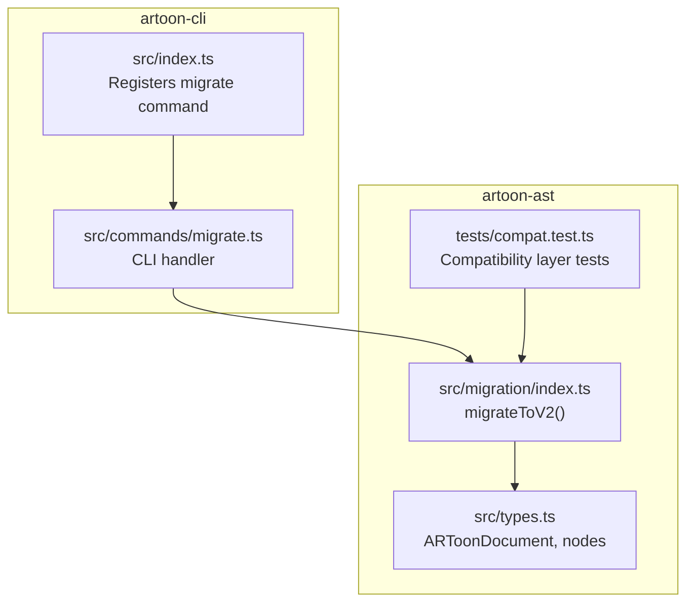
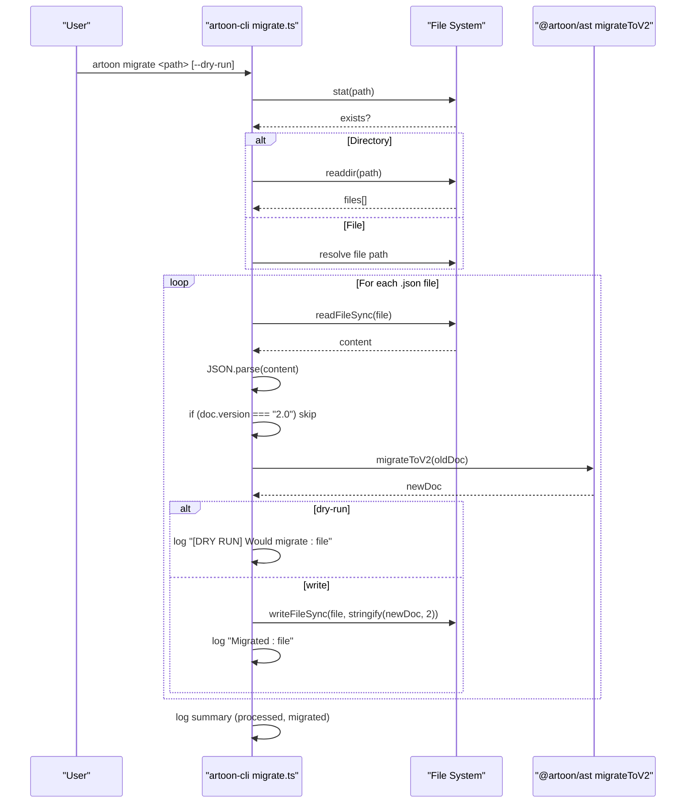
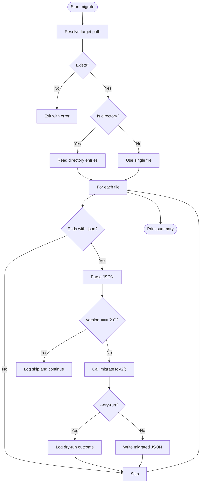
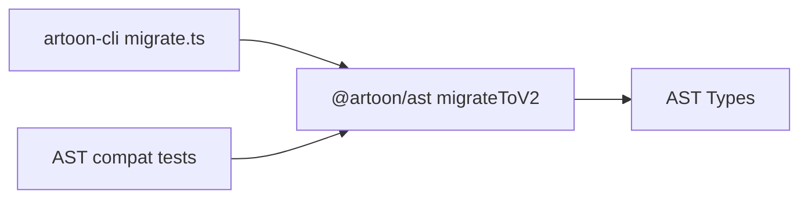

# Migrate Command

<cite>
**Referenced Files in This Document**
- [migrate.ts](file://artoon-cli/src/commands/migrate.ts)
- [index.ts](file://artoon-cli/src/index.ts)
- [index.ts](file://artoon-ast/src/migration/index.ts)
- [MIGRATION-GUIDE.md](file://docs/MIGRATION-GUIDE.md)
- [compat.test.ts](file://artoon-ast/tests/compat.test.ts)
- [package.json](file://artoon-ast/package.json)
</cite>

## Table of Contents
1. [Introduction](#introduction)
2. [Project Structure](#project-structure)
3. [Core Components](#core-components)
4. [Architecture Overview](#architecture-overview)
5. [Detailed Component Analysis](#detailed-component-analysis)
6. [Dependency Analysis](#dependency-analysis)
7. [Performance Considerations](#performance-considerations)
8. [Troubleshooting Guide](#troubleshooting-guide)
9. [Conclusion](#conclusion)
10. [Appendices](#appendices)

## Introduction
This document explains the ARTOON CLI migrate command that upgrades old ARTOON AST JSON documents to Version 2.0. It covers command syntax, directory and file processing, dry-run behavior, migration mechanics, backward compatibility considerations, safety mechanisms, and practical workflows. It also clarifies the relationship between migration and version management, and provides troubleshooting guidance for common failure scenarios.

## Project Structure
The migrate command is implemented in the CLI package and delegates migration logic to the AST package. The CLI registers the migrate command and wires it to the AST migration function. The AST package provides the deep migration logic and related compatibility utilities.

**Diagram sources**
- [index.ts:53-58](file://artoon-cli/src/index.ts#L53-L58)
- [migrate.ts:1-56](file://artoon-cli/src/commands/migrate.ts#L1-L56)
- [index.ts:1-76](file://artoon-ast/src/migration/index.ts#L1-L76)
- [compat.test.ts:1-455](file://artoon-ast/tests/compat.test.ts#L1-L455)

**Section sources**
- [index.ts:53-58](file://artoon-cli/src/index.ts#L53-L58)
- [migrate.ts:1-56](file://artoon-cli/src/commands/migrate.ts#L1-L56)
- [index.ts:1-76](file://artoon-ast/src/migration/index.ts#L1-L76)
- [compat.test.ts:1-455](file://artoon-ast/tests/compat.test.ts#L1-L455)

## Core Components
- CLI migrate command: Parses user input, validates the target path, and iterates files to migrate. Supports a dry-run option to preview changes without writing files.
- Migration function: Performs deep cloning and transforms legacy AST nodes to the V2.0 format, including renaming nodeType to type, removing deprecated fields, normalizing lists and separators, and setting the document version to 2.0.
- Version management: The AST package targets version 2.0 and prepares for future removal of compatibility types in version 3.0.

Key behaviors:
- Only processes files ending with .json.
- Skips files already at version 2.0.
- Uses a deep traversal to apply node-level migrations.
- Provides dry-run logging and actual write-back in non-dry-run mode.

**Section sources**
- [migrate.ts:5-56](file://artoon-cli/src/commands/migrate.ts#L5-L56)
- [index.ts:4-76](file://artoon-ast/src/migration/index.ts#L4-L76)
- [package.json:1-25](file://artoon-ast/package.json#L1-L25)

## Architecture Overview
The migrate command follows a straightforward pipeline: CLI entrypoint registers the command, the handler resolves the target path, enumerates files, parses JSON, checks version, migrates via AST, and either logs or writes the migrated document.

**Diagram sources**
- [index.ts:53-58](file://artoon-cli/src/index.ts#L53-L58)
- [migrate.ts:5-56](file://artoon-cli/src/commands/migrate.ts#L5-L56)
- [index.ts:14-76](file://artoon-ast/src/migration/index.ts#L14-L76)

## Detailed Component Analysis

### CLI Command Registration and Behavior
- Registers the migrate command with a description and a --dry-run option.
- The action handler accepts a path argument and an options object containing dryRun.
- Validates existence of the path and determines whether it is a file or directory.
- Iterates files, filters for .json, and applies migration.

Dry-run behavior:
- Logs what would be migrated without modifying files.
- Useful for auditing and validating migration outcomes before applying changes.

Safety mechanisms:
- Exits with an error if the path does not exist.
- Catches exceptions per file and logs errors while continuing processing.

Practical usage:
- Migrate a single JSON file.
- Migrate an entire directory of JSON files.
- Use dry-run to preview changes prior to committing.

**Section sources**
- [index.ts:53-58](file://artoon-cli/src/index.ts#L53-L58)
- [migrate.ts:5-56](file://artoon-cli/src/commands/migrate.ts#L5-L56)

### Migration Function Implementation
The migrateToV2 function performs deep cloning and targeted transformations:
- Sets document.version to "2.0".
- Renames nodeType to type and removes deprecated elementCount.
- Normalizes list nodes by converting legacy children structures to pure ListItem arrays.
- Normalizes separator nodes by converting separators[] to separatorType, defaulting to hr if missing.

Deep traversal:
- Uses a visitor pattern to traverse content nodes and apply transformations recursively.

Version targeting:
- Prepares for V3.0 by removing compatibility shims and ensuring clean V2.0 structure.

**Section sources**
- [index.ts:4-76](file://artoon-ast/src/migration/index.ts#L4-L76)

### Backward Compatibility and Version Management
- Compatibility layer tests demonstrate support for legacy nodeType and other legacy shapes during migration.
- The AST package targets version 2.0 and lays groundwork for removing compatibility types in version 3.0.
- Migration is designed to unify node typing and remove deprecated fields, aligning with evolving version semantics.

**Section sources**
- [compat.test.ts:1-455](file://artoon-ast/tests/compat.test.ts#L1-L455)
- [package.json:1-25](file://artoon-ast/package.json#L1-L25)

### Relationship Between Migration and Version Management
- The migrate command updates documents to version 2.0, which is the canonical target for the current release.
- Version 3.0 plans involve removing compatibility types; migration to 2.0 is a prerequisite for that future cleanup.
- The AST package’s version field reflects the current target (2.0), while migration logic ensures documents conform to that schema.

**Section sources**
- [index.ts:18-19](file://artoon-ast/src/migration/index.ts#L18-L19)
- [package.json:1-25](file://artoon-ast/package.json#L1-L25)

## Architecture Overview

**Diagram sources**
- [migrate.ts:5-56](file://artoon-cli/src/commands/migrate.ts#L5-L56)
- [index.ts:14-76](file://artoon-ast/src/migration/index.ts#L14-L76)

## Detailed Component Analysis

### Migration Mechanics and Transformations
- Node-level unification: nodeType -> type, elementCount removal.
- List normalization: legacy children arrays converted to items as ListItem[].
- Separator normalization: separators[] -> separatorType, default hr fallback.
- Version stamping: sets version to "2.0".

These transformations ensure documents conform to the V2.0 canonical AST schema.

**Section sources**
- [index.ts:22-67](file://artoon-ast/src/migration/index.ts#L22-L67)

### Dry-Run and Safety Mechanisms
- Dry-run logs what would be changed without writing files.
- Error handling per file prevents single-file failures from halting the entire process.
- Existence checks and explicit skipping of already-migrated files reduce risk.

**Section sources**
- [migrate.ts:31-40](file://artoon-cli/src/commands/migrate.ts#L31-L40)
- [migrate.ts:24-27](file://artoon-cli/src/commands/migrate.ts#L24-L27)

### Practical Workflows and Examples
- Entire project migration:
  - Run migrate against a docs directory to process all .json files.
  - Use dry-run first to review changes, then re-run without dry-run to apply.
- Batch processing:
  - Combine migrate with shell loops or CI steps to process multiple directories.
- Rollback procedures:
  - Keep backups of original files before running migration.
  - If issues arise, restore from backup and adjust documents accordingly.

Note: The CLI documentation inventory includes general usage patterns and examples for other commands; the migrate command follows similar scripting patterns.

**Section sources**
- [index.ts:53-58](file://artoon-cli/src/index.ts#L53-L58)
- [migrate.ts:5-56](file://artoon-cli/src/commands/migrate.ts#L5-L56)

### Common Migration Scenarios and Guidance
- Documents already at version 2.0 are skipped automatically.
- Lists and separators are normalized to V2.0 structures.
- Hidden fields and meta handling are governed by the broader 2.0 migration guide; ensure compliance with meta block rules before or alongside migration.

**Section sources**
- [migrate.ts:23-27](file://artoon-cli/src/commands/migrate.ts#L23-L27)
- [index.ts:35-67](file://artoon-ast/src/migration/index.ts#L35-L67)
- [MIGRATION-GUIDE.md:1-437](file://docs/MIGRATION-GUIDE.md#L1-L437)

## Dependency Analysis
The migrate command depends on the AST migration function. The AST package targets version 2.0 and includes compatibility tests to support legacy formats during migration.

**Diagram sources**
- [migrate.ts](file://artoon-cli/src/commands/migrate.ts#L3)
- [index.ts:1-2](file://artoon-ast/src/migration/index.ts#L1-L2)
- [compat.test.ts:10-22](file://artoon-ast/tests/compat.test.ts#L10-L22)

**Section sources**
- [migrate.ts](file://artoon-cli/src/commands/migrate.ts#L3)
- [index.ts:1-2](file://artoon-ast/src/migration/index.ts#L1-L2)
- [compat.test.ts:10-22](file://artoon-ast/tests/compat.test.ts#L10-L22)

## Performance Considerations
- File enumeration and JSON parsing occur per .json file; performance scales linearly with file count.
- Deep traversal of content nodes is efficient for typical document sizes.
- Dry-run avoids disk writes, making it suitable for large-scale previews.

## Troubleshooting Guide
Common issues and resolutions:
- Path does not exist:
  - Ensure the provided path exists; the command exits with an error if not found.
- Non-.json files:
  - Only .json files are processed; ensure target files have the correct extension.
- Already migrated documents:
  - Documents with version 2.0 are skipped automatically; no further action is needed.
- Migration errors per file:
  - Errors are logged per file and do not stop processing; inspect logs and fix problematic files individually.
- Unexpected behavior after migration:
  - Verify documents conform to V2.0 schema and meta block rules.
  - Re-run validation or parser tests to confirm correctness.

Rollback:
- Restore from backups taken before migration.
- Revert individual files as needed.

**Section sources**
- [migrate.ts:6-9](file://artoon-cli/src/commands/migrate.ts#L6-L9)
- [migrate.ts:15-41](file://artoon-cli/src/commands/migrate.ts#L15-L41)
- [migrate.ts:24-27](file://artoon-cli/src/commands/migrate.ts#L24-L27)

## Conclusion
The ARTOON CLI migrate command provides a safe, auditable way to upgrade ARTOON AST JSON documents to Version 2.0. With dry-run support, per-file error handling, and clear version targeting, it enables reliable batch processing and integration into automated workflows. Combined with the broader 2.0 migration guidance, teams can confidently modernize their documents and prepare for future version 3.0 improvements.

## Appendices

### Command Reference
- Command: migrate
- Syntax: artoon migrate <directory_or_file> [--dry-run]
- Options:
  - --dry-run: Preview changes without overwriting files

Behavior:
- Processes .json files in a directory or a single file.
- Skips files already at version 2.0.
- Applies AST-level transformations and writes migrated JSON (unless dry-run).

**Section sources**
- [index.ts:53-58](file://artoon-cli/src/index.ts#L53-L58)
- [migrate.ts:5-56](file://artoon-cli/src/commands/migrate.ts#L5-L56)