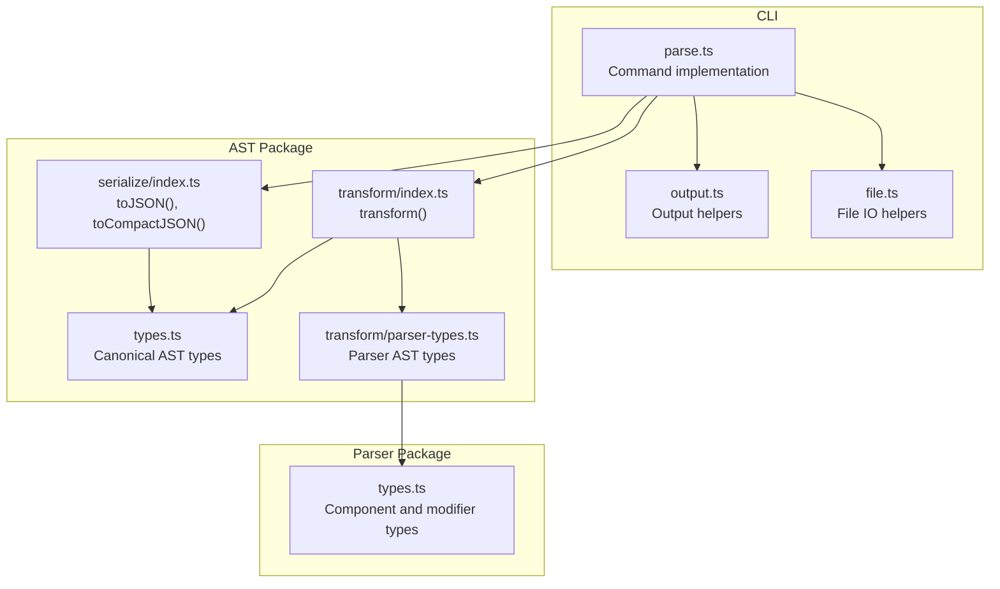
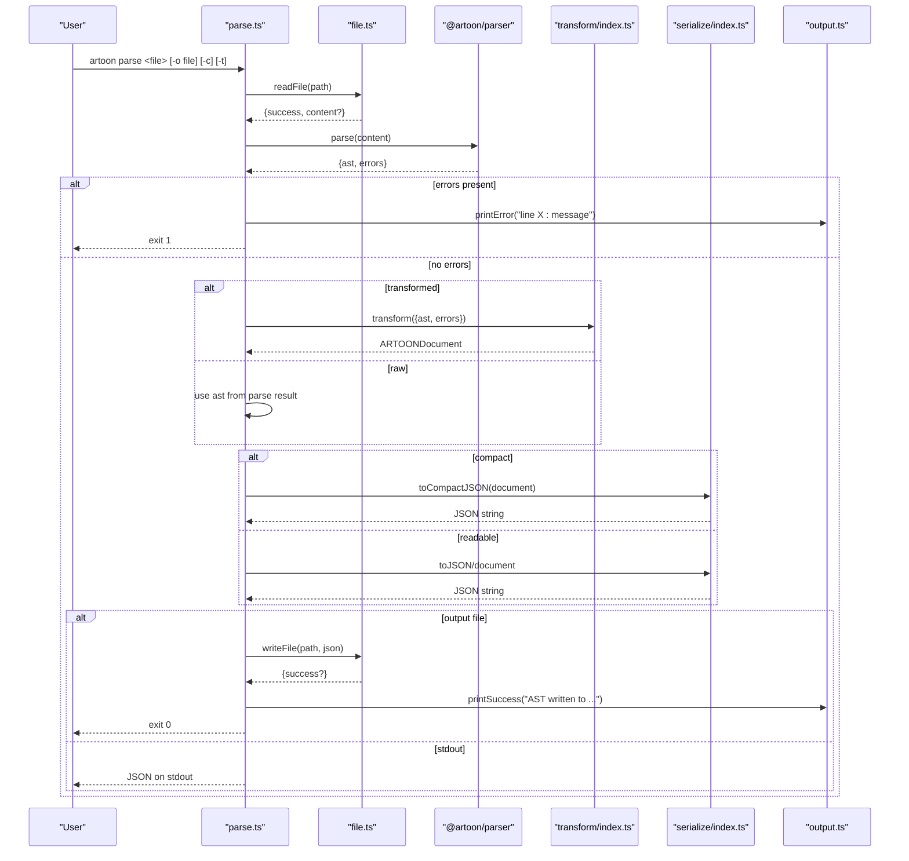
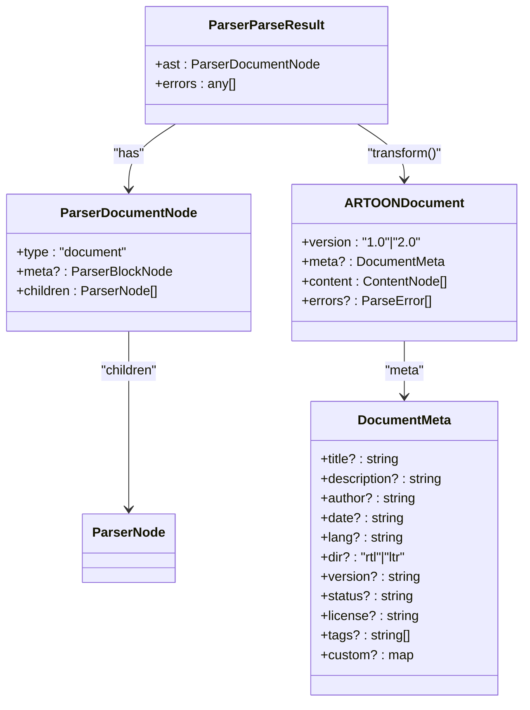
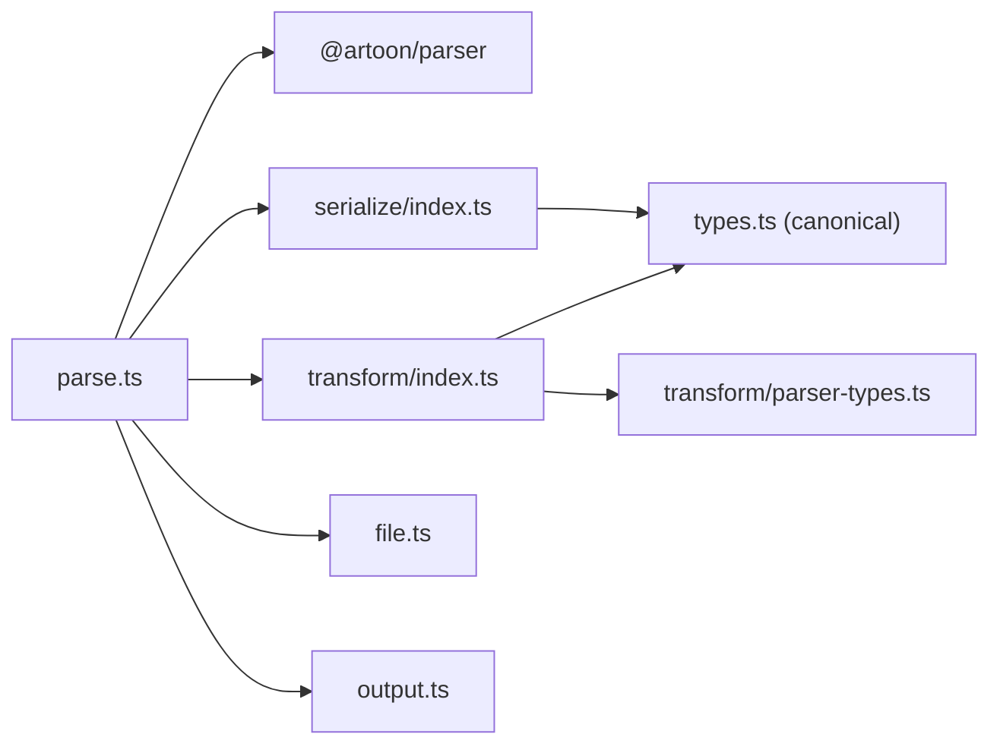

# Parse Command

<cite>
**Referenced Files in This Document**
- [parse.ts](file://artoon-cli/src/commands/parse.ts)
- [04-COMMANDS.md](file://artoon-cli/inventory_artoon_cli/04-COMMANDS.md)
- [06-OUTPUT-CONTRACTS.md](file://artoon-cli/inventory_artoon_cli/06-OUTPUT-CONTRACTS.md)
- [output.ts](file://artoon-cli/src/utils/output.ts)
- [file.ts](file://artoon-cli/src/utils/file.ts)
- [index.ts](file://artoon-ast/src/transform/index.ts)
- [index.ts](file://artoon-ast/src/serialize/index.ts)
- [types.ts](file://artoon-ast/src/types.ts)
- [parser-types.ts](file://artoon-ast/src/transform/parser-types.ts)
- [types.ts](file://artoon-parser/src/types.ts)
</cite>

## Table of Contents
1. [Introduction](#introduction)
2. [Project Structure](#project-structure)
3. [Core Components](#core-components)
4. [Architecture Overview](#architecture-overview)
5. [Detailed Component Analysis](#detailed-component-analysis)
6. [Dependency Analysis](#dependency-analysis)
7. [Performance Considerations](#performance-considerations)
8. [Troubleshooting Guide](#troubleshooting-guide)
9. [Conclusion](#conclusion)

## Introduction
This document explains the ARTOON CLI parse command: how to convert ARTOON files to AST (JSON) format, the command syntax, available options, and output formatting. It clarifies the difference between raw and canonical AST outputs, compact versus readable JSON, and file handling behavior. Practical examples, batch processing workflows, and integration with other CLI commands are included, along with error handling and performance considerations for large documents.

## Project Structure
The parse command is implemented in the CLI package and orchestrates parsing, optional transformation, and JSON serialization. The AST transformation and serialization utilities live in the AST package, while the parser types define the internal representation.

**Diagram sources**
- [parse.ts:1-66](file://artoon-cli/src/commands/parse.ts#L1-L66)
- [output.ts:1-69](file://artoon-cli/src/utils/output.ts#L1-L69)
- [file.ts:1-51](file://artoon-cli/src/utils/file.ts#L1-L51)
- [index.ts:1-511](file://artoon-ast/src/transform/index.ts#L1-L511)
- [index.ts:1-96](file://artoon-ast/src/serialize/index.ts#L1-L96)
- [types.ts:1-539](file://artoon-ast/src/types.ts#L1-L539)
- [parser-types.ts:1-127](file://artoon-ast/src/transform/parser-types.ts#L1-L127)
- [types.ts:1-123](file://artoon-parser/src/types.ts#L1-L123)

**Section sources**
- [parse.ts:1-66](file://artoon-cli/src/commands/parse.ts#L1-L66)
- [04-COMMANDS.md:25-91](file://artoon-cli/inventory_artoon_cli/04-COMMANDS.md#L25-L91)

## Core Components
- Command entrypoint: parseCommand(file, options) reads the file, parses ARTOON, optionally transforms to canonical AST, formats JSON, and writes to stdout or a file.
- Transformation: transform converts the parser AST into the canonical AST with standardized fields and metadata.
- Serialization: toJSON produces indented JSON; toCompactJSON produces compact JSON without whitespace.
- Output contract: stdout carries pure JSON data; stderr carries status and error messages.

Key behaviors:
- Raw AST: Parser AST returned by the parser, structured with parser-specific node types and fields.
- Canonical AST: Transformed AST with a stable schema, including version, meta, content, and optional errors.
- Formatting: -c produces compact JSON; without -c, JSON is indented for readability.
- File handling: -o writes JSON to a file; when writing to a file, stdout remains empty and success is reported on stderr.

**Section sources**
- [parse.ts:13-65](file://artoon-cli/src/commands/parse.ts#L13-L65)
- [index.ts:64-77](file://artoon-ast/src/transform/index.ts#L64-L77)
- [index.ts:9-32](file://artoon-ast/src/serialize/index.ts#L9-L32)
- [06-OUTPUT-CONTRACTS.md:101-117](file://artoon-cli/inventory_artoon_cli/06-OUTPUT-CONTRACTS.md#L101-L117)

## Architecture Overview
The parse pipeline follows a clear flow: file I/O → parse → optional transform → JSON serialization → output.

**Diagram sources**
- [parse.ts:13-65](file://artoon-cli/src/commands/parse.ts#L13-L65)
- [file.ts:10-41](file://artoon-cli/src/utils/file.ts#L10-L41)
- [index.ts:64-77](file://artoon-ast/src/transform/index.ts#L64-L77)
- [index.ts:9-32](file://artoon-ast/src/serialize/index.ts#L9-L32)
- [output.ts:12-26](file://artoon-cli/src/utils/output.ts#L12-L26)

## Detailed Component Analysis

### Command Syntax and Options
- Syntax: artoon parse <file> [options]
- Options:
  - -o, --output <file>: Write JSON to a file instead of stdout.
  - -c, --compact: Produce compact JSON (no extra whitespace).
  - -t, --transformed: Output canonical AST instead of raw parser AST.

Examples:
- Parse to stdout: artoon parse document.artoon
- Parse to file: artoon parse document.artoon -o ast.json
- Compact JSON: artoon parse document.artoon -c
- Canonical AST: artoon parse document.artoon -t
- Compact canonical AST to file: artoon parse document.artoon -t -c -o ast.json

Exit codes:
- 0: Success
- 1: Syntax error during parsing
- 4: File not found
- 5: I/O error when writing to file

**Section sources**
- [04-COMMANDS.md:27-60](file://artoon-cli/inventory_artoon_cli/04-COMMANDS.md#L27-L60)
- [04-COMMANDS.md:82-89](file://artoon-cli/inventory_artoon_cli/04-COMMANDS.md#L82-L89)

### Raw vs Canonical AST Output
- Raw AST (without --transformed):
  - Structure: { ast: ParserDocumentNode, errors: [...] }
  - ParserDocumentNode includes meta and children typed according to parser AST.
  - Parser AST types are defined in parser-types.ts and include node unions for text, separator, list, table, compound, block, media, link, code, and comment.
- Canonical AST (with --transformed):
  - Structure: ARTOONDocument with version, meta, content, and optional errors.
  - Version is "2.0".
  - Meta fields are normalized (e.g., title, description, author, date, lang, dir, version, status, license, tags, custom).
  - Content nodes conform to canonical types with standardized fields and deprecations handled via compatibility helpers.

**Diagram sources**
- [parser-types.ts:123-127](file://artoon-ast/src/transform/parser-types.ts#L123-L127)
- [index.ts:64-77](file://artoon-ast/src/transform/index.ts#L64-L77)
- [types.ts:413-418](file://artoon-ast/src/types.ts#L413-L418)
- [types.ts:385-397](file://artoon-ast/src/types.ts#L385-L397)

**Section sources**
- [04-COMMANDS.md:64-80](file://artoon-cli/inventory_artoon_cli/04-COMMANDS.md#L64-L80)
- [index.ts:64-77](file://artoon-ast/src/transform/index.ts#L64-L77)
- [parser-types.ts:123-127](file://artoon-ast/src/transform/parser-types.ts#L123-L127)
- [types.ts:413-418](file://artoon-ast/src/types.ts#L413-L418)

### JSON Formatting Behavior
- Readable JSON (default): Indented with two-space indentation.
- Compact JSON (-c): Single-line JSON with no extra whitespace.
- When --transformed is used, the serializer chooses between toJSON and toCompactJSON accordingly.

**Section sources**
- [parse.ts:40-50](file://artoon-cli/src/commands/parse.ts#L40-L50)
- [index.ts:9-32](file://artoon-ast/src/serialize/index.ts#L9-L32)

### File Handling Behavior
- Reading: If the file does not exist or cannot be read, the command exits with code 4 and prints an error to stderr.
- Writing: If writing to the target file fails, the command exits with code 5 and prints an error to stderr.
- Success: When writing to a file, a success message is printed to stderr; stdout remains empty.

**Section sources**
- [parse.ts:14-19](file://artoon-cli/src/commands/parse.ts#L14-L19)
- [parse.ts:53-59](file://artoon-cli/src/commands/parse.ts#L53-L59)
- [file.ts:10-24](file://artoon-cli/src/utils/file.ts#L10-L24)
- [file.ts:26-41](file://artoon-cli/src/utils/file.ts#L26-L41)
- [06-OUTPUT-CONTRACTS.md:108-117](file://artoon-cli/inventory_artoon_cli/06-OUTPUT-CONTRACTS.md#L108-L117)

### Practical Examples
- Parsing a simple ARTOON document to stdout:
  - artoon parse samples/01-text-components.artoon
- Writing canonical AST to a file:
  - artoon parse samples/11-complete-document.artoon -t -o ast-canonical.json
- Producing compact JSON for machine consumption:
  - artoon parse samples/05-lists.artoon -c
- Combining options:
  - artoon parse samples/09-compound-components.artoon -t -c -o ast.json

Batch processing:
- Validate and parse all documents in a folder:
  - for f in *.artoon; do artoon validate "$f" && artoon parse "$f" -t -o "${f%.artoon}.json"; done

Integration with other CLI commands:
- Pipe parsed AST to jq for inspection:
  - artoon parse doc.artoon | jq '.content[0]'
- Chain with render to compare outputs:
  - artoon parse doc.artoon -t | artoon render -o rendered.html

**Section sources**
- [04-COMMANDS.md:43-60](file://artoon-cli/inventory_artoon_cli/04-COMMANDS.md#L43-L60)
- [04-COMMANDS.md:288-293](file://artoon-cli/inventory_artoon_cli/04-COMMANDS.md#L288-L293)

## Dependency Analysis
The parse command depends on:
- Parser: to produce the initial AST and collect errors.
- Transform: to normalize the AST into canonical form.
- Serializer: to stringify the AST into JSON.
- File utilities: to read/write files.
- Output utilities: to print messages to stderr.

**Diagram sources**
- [parse.ts:1-5](file://artoon-cli/src/commands/parse.ts#L1-L5)
- [index.ts:1-511](file://artoon-ast/src/transform/index.ts#L1-L511)
- [index.ts:1-96](file://artoon-ast/src/serialize/index.ts#L1-L96)
- [types.ts:1-539](file://artoon-ast/src/types.ts#L1-L539)
- [parser-types.ts:1-127](file://artoon-ast/src/transform/parser-types.ts#L1-L127)
- [file.ts:1-51](file://artoon-cli/src/utils/file.ts#L1-L51)
- [output.ts:1-69](file://artoon-cli/src/utils/output.ts#L1-L69)

**Section sources**
- [parse.ts:1-5](file://artoon-cli/src/commands/parse.ts#L1-L5)
- [index.ts:1-511](file://artoon-ast/src/transform/index.ts#L1-L511)
- [index.ts:1-96](file://artoon-ast/src/serialize/index.ts#L1-L96)
- [types.ts:1-539](file://artoon-ast/src/types.ts#L1-L539)
- [parser-types.ts:1-127](file://artoon-ast/src/transform/parser-types.ts#L1-L127)
- [file.ts:1-51](file://artoon-cli/src/utils/file.ts#L1-L51)
- [output.ts:1-69](file://artoon-cli/src/utils/output.ts#L1-L69)

## Performance Considerations
- Large documents: Prefer compact JSON (-c) to reduce output size and improve downstream processing speed.
- Streaming: When piping to tools like jq, compact JSON reduces memory overhead.
- Batch processing: Use shell loops to process multiple files; consider parallelization with tools like xargs for CPU-bound tasks.
- Error early exit: The command exits immediately upon encountering parse errors, avoiding unnecessary work on malformed inputs.

[No sources needed since this section provides general guidance]

## Troubleshooting Guide
Common issues and resolutions:
- File not found:
  - Symptom: Exit code 4 with an error message on stderr.
  - Resolution: Verify the file path and permissions.
- Syntax errors:
  - Symptom: Exit code 1; stderr shows one or more "line X: message" entries.
  - Resolution: Fix ARTOON syntax errors indicated by the parser.
- Write failures:
  - Symptom: Exit code 5; stderr reports a failure to write the file.
  - Resolution: Ensure the destination directory exists and is writable; check disk space.
- Empty stdout:
  - Explanation: When using -o, stdout is intentionally empty per the output contract; capture stderr for success messages.
- Unexpected differences between raw and canonical AST:
  - Explanation: Canonical AST normalizes fields and metadata; refer to the transform behavior and canonical types.

**Section sources**
- [parse.ts:16-30](file://artoon-cli/src/commands/parse.ts#L16-L30)
- [parse.ts:55-58](file://artoon-cli/src/commands/parse.ts#L55-L58)
- [06-OUTPUT-CONTRACTS.md:101-117](file://artoon-cli/inventory_artoon_cli/06-OUTPUT-CONTRACTS.md#L101-L117)

## Conclusion
The parse command provides a reliable way to convert ARTOON documents into JSON AST. Choose raw AST for parser-level fidelity or canonical AST for a stable, schema-aligned representation. Use compact JSON for performance and readability for debugging. Integrate with other CLI commands and external tools for robust workflows, and leverage the documented exit codes and output contracts for automation.