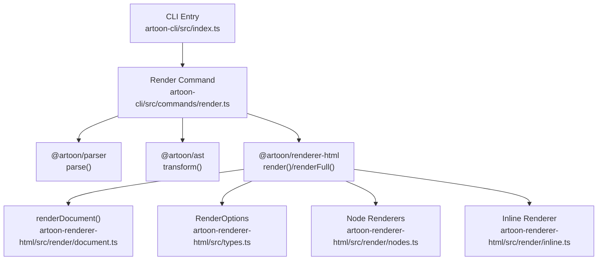
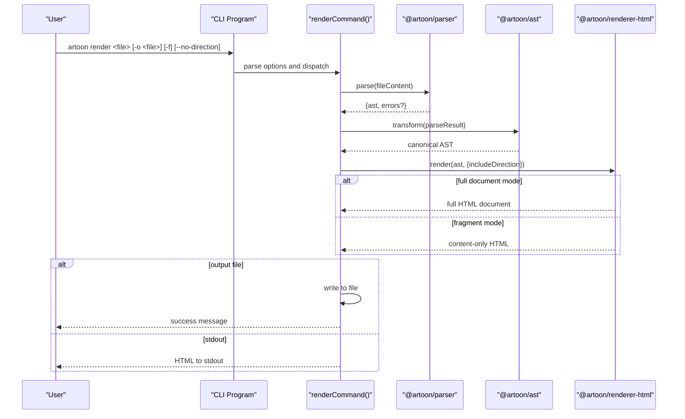
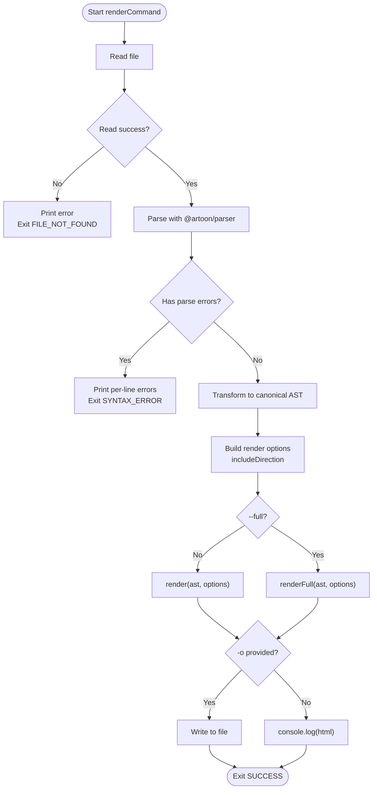
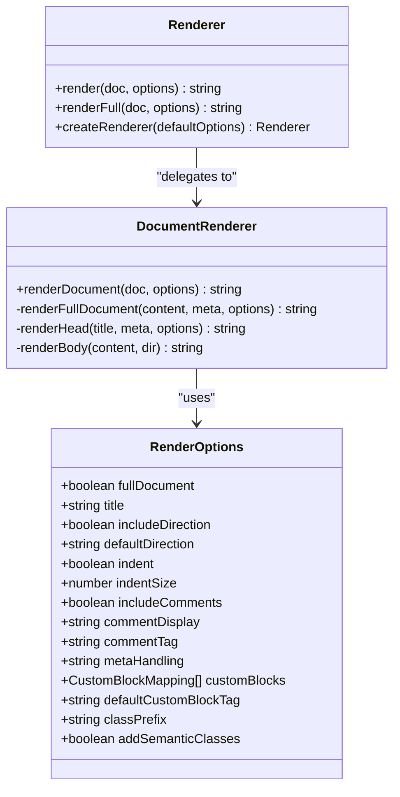
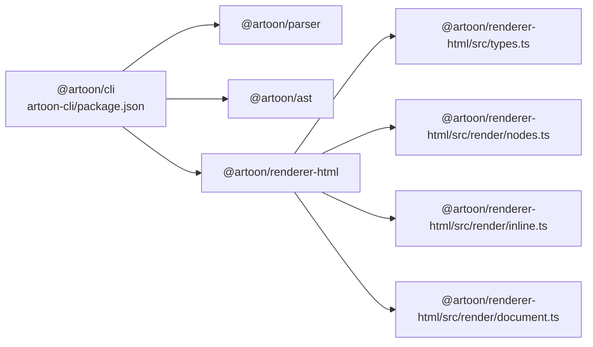

# Render Command

<cite>
**Referenced Files in This Document**
- [render.ts](file://artoon-cli/src/commands/render.ts)
- [index.ts](file://artoon-cli/src/index.ts)
- [README.md](file://artoon-cli/README.md)
- [04-COMMANDS.md](file://artoon-cli/inventory_artoon_cli/04-COMMANDS.md)
- [06-OUTPUT-CONTRACTS.md](file://artoon-cli/inventory_artoon_cli/06-OUTPUT-CONTRACTS.md)
- [index.ts](file://artoon-renderer-html/src/index.ts)
- [document.ts](file://artoon-renderer-html/src/render/document.ts)
- [types.ts](file://artoon-renderer-html/src/types.ts)
- [README.md](file://artoon-renderer-html/README.md)
- [nodes.ts](file://artoon-renderer-html/src/render/nodes.ts)
- [inline.ts](file://artoon-renderer-html/src/render/inline.ts)
- [package.json](file://artoon-cli/package.json)
</cite>

## Table of Contents
1. [Introduction](#introduction)
2. [Project Structure](#project-structure)
3. [Core Components](#core-components)
4. [Architecture Overview](#architecture-overview)
5. [Detailed Component Analysis](#detailed-component-analysis)
6. [Dependency Analysis](#dependency-analysis)
7. [Performance Considerations](#performance-considerations)
8. [Troubleshooting Guide](#troubleshooting-guide)
9. [Conclusion](#conclusion)
10. [Appendices](#appendices)

## Introduction
This document explains the ARTOON CLI render command for converting ARTOON files into HTML. It covers command syntax, available options, HTML generation modes (fragment vs full document), direction attribute handling, customization options, and practical workflows for web publishing, static site generation, and previews. It also provides styling considerations, theme integration guidance, and performance tips for bulk rendering.

## Project Structure
The render command is part of the ARTOON CLI package and delegates to the HTML renderer module. The CLI registers the command and parses options, while the renderer handles conversion to HTML fragments or full documents.

**Diagram sources**
- [index.ts:10-33](file://artoon-cli/src/index.ts#L10-L33)
- [render.ts:14-62](file://artoon-cli/src/commands/render.ts#L14-L62)
- [index.ts:19-34](file://artoon-renderer-html/src/index.ts#L19-L34)
- [document.ts:11-52](file://artoon-renderer-html/src/render/document.ts#L11-L52)
- [types.ts:37-98](file://artoon-renderer-html/src/types.ts#L37-L98)
- [nodes.ts:37-57](file://artoon-renderer-html/src/render/nodes.ts#L37-L57)
- [inline.ts:40-71](file://artoon-renderer-html/src/render/inline.ts#L40-L71)

**Section sources**
- [index.ts:10-33](file://artoon-cli/src/index.ts#L10-L33)
- [README.md:29-43](file://artoon-cli/README.md#L29-L43)
- [package.json:18-24](file://artoon-cli/package.json#L18-L24)

## Core Components
- CLI command registration defines the render command with options for output file, full document mode, and direction attribute control.
- The render command orchestrates parsing, transformation, rendering, and output handling.
- The HTML renderer supports two modes:
  - Fragment mode: renders only the document content.
  - Full document mode: wraps content in html/head/body with default metadata and styles.

Key options:
- -o/--output: write HTML to a file or print to stdout.
- -f/--full: generate a full HTML document with head and body.
- --no-direction: disable direction attributes on elements.

**Section sources**
- [index.ts:26-33](file://artoon-cli/src/index.ts#L26-L33)
- [render.ts:8-12](file://artoon-cli/src/commands/render.ts#L8-L12)
- [04-COMMANDS.md:93-128](file://artoon-cli/inventory_artoon_cli/04-COMMANDS.md#L93-L128)
- [06-OUTPUT-CONTRACTS.md:119-135](file://artoon-cli/inventory_artoon_cli/06-OUTPUT-CONTRACTS.md#L119-L135)
- [index.ts:19-34](file://artoon-renderer-html/src/index.ts#L19-L34)
- [document.ts:42-74](file://artoon-renderer-html/src/render/document.ts#L42-L74)

## Architecture Overview
The render pipeline transforms an ARTOON file into HTML via three stages: parse, transform, and render. Direction handling is controlled by the renderer options derived from CLI flags.

**Diagram sources**
- [index.ts:26-33](file://artoon-cli/src/index.ts#L26-L33)
- [render.ts:14-62](file://artoon-cli/src/commands/render.ts#L14-L62)
- [index.ts:19-34](file://artoon-renderer-html/src/index.ts#L19-L34)
- [document.ts:11-52](file://artoon-renderer-html/src/render/document.ts#L11-L52)

## Detailed Component Analysis

### CLI Render Command
- Parses ARTOON file content and exits early on file read failures.
- Invokes the parser; on parse errors, prints per-line errors and exits with a syntax error code.
- Transforms the parsed AST into canonical form.
- Builds renderer options from CLI flags:
  - includeDirection is enabled unless --no-direction is specified.
- Chooses render vs renderFull based on -f/--full.
- Writes to file if -o/--output is provided; otherwise logs HTML to stdout.
- Uses exit codes for success and error conditions.

**Diagram sources**
- [render.ts:14-62](file://artoon-cli/src/commands/render.ts#L14-L62)

**Section sources**
- [render.ts:14-62](file://artoon-cli/src/commands/render.ts#L14-L62)
- [04-COMMANDS.md:93-128](file://artoon-cli/inventory_artoon_cli/04-COMMANDS.md#L93-L128)
- [06-OUTPUT-CONTRACTS.md:119-135](file://artoon-cli/inventory_artoon_cli/06-OUTPUT-CONTRACTS.md#L119-L135)

### HTML Generation Modes
- Fragment mode (default): returns content-only HTML suitable for embedding.
- Full document mode (--full): returns a complete HTML document with html, head, and body, including default metadata and minimal styles.

Default head content includes charset, viewport, title, and basic styles for RTL/LTR alignment and common elements.

**Section sources**
- [index.ts:19-34](file://artoon-renderer-html/src/index.ts#L19-L34)
- [document.ts:42-74](file://artoon-renderer-html/src/render/document.ts#L42-L74)
- [document.ts:79-122](file://artoon-renderer-html/src/render/document.ts#L79-L122)

### Direction Attribute Handling
- Direction attributes are included by default unless disabled via --no-direction.
- The renderer determines direction per node and applies dir attributes accordingly.
- Full document mode sets html and body dir attributes based on meta/lang or defaults.

Practical effect:
- Elements with RTL direction gain dir="rtl".
- Full document mode adds lang and dir at the html/body level.

**Section sources**
- [render.ts:37-47](file://artoon-cli/src/commands/render.ts#L37-L47)
- [document.ts:62-67](file://artoon-renderer-html/src/render/document.ts#L62-L67)
- [nodes.ts:63-73](file://artoon-renderer-html/src/render/nodes.ts#L63-L73)

### Customization Options
The HTML renderer exposes extensive options via RenderOptions:
- fullDocument: enable full HTML document wrapper.
- title: set document title for full document mode.
- includeDirection: toggle dir attributes.
- defaultDirection: default direction fallback.
- indent/indentSize: formatting control.
- includeComments/commentDisplay/commentTag: comment rendering modes.
- metaHandling: hide/tags/comment META block handling.
- customBlocks/defaultCustomBlockTag: custom block mapping.
- classPrefix/addSemanticClasses: CSS class control.

These options can be passed to render() or renderFull(), or used to create a renderer instance with presets.

**Section sources**
- [types.ts:37-98](file://artoon-renderer-html/src/types.ts#L37-L98)
- [types.ts:103-117](file://artoon-renderer-html/src/types.ts#L103-L117)
- [README.md:34-51](file://artoon-renderer-html/README.md#L34-L51)
- [README.md:140-150](file://artoon-renderer-html/README.md#L140-L150)

### Node and Inline Rendering Behavior
- renderNode supports multiple node types (text, separator, list, table, compound, block, media, link, code, comment) and applies direction attributes where applicable.
- renderInlineContent reconstructs inline markup and escapes plain text safely.
- Direction attributes are applied to text and compound nodes based on node direction and renderer options.

**Section sources**
- [nodes.ts:37-57](file://artoon-renderer-html/src/render/nodes.ts#L37-L57)
- [nodes.ts:63-73](file://artoon-renderer-html/src/render/nodes.ts#L63-L73)
- [inline.ts:40-71](file://artoon-renderer-html/src/render/inline.ts#L40-L71)

## Architecture Overview
The CLI integrates with the renderer through exported functions. The renderer’s renderDocument orchestrates content rendering and optional full document wrapping.

**Diagram sources**
- [types.ts:37-98](file://artoon-renderer-html/src/types.ts#L37-L98)
- [index.ts:19-51](file://artoon-renderer-html/src/index.ts#L19-L51)
- [document.ts:11-74](file://artoon-renderer-html/src/render/document.ts#L11-L74)

## Detailed Component Analysis

### Command Registration and Options
- The CLI registers the render command with -o/--output, -f/--full, and --no-direction.
- These options are mapped to internal render options and passed to the renderer.

**Section sources**
- [index.ts:26-33](file://artoon-cli/src/index.ts#L26-L33)
- [04-COMMANDS.md:103-128](file://artoon-cli/inventory_artoon_cli/04-COMMANDS.md#L103-L128)

### Practical Examples and Workflows
- Web publishing: render a single document to a standalone HTML file using --full and -o.
- Static site generation: batch render multiple ARTOON files, optionally disabling direction attributes for uniformity.
- Preview workflows: render to stdout for quick viewing or piping to a browser.

Example usages are documented in the CLI inventory and README.

**Section sources**
- [README.md:78-98](file://artoon-cli/README.md#L78-L98)
- [04-COMMANDS.md:111-128](file://artoon-cli/inventory_artoon_cli/04-COMMANDS.md#L111-L128)

### Styling Considerations and Theme Integration
- Full document mode injects basic CSS for RTL/LTR alignment and common elements.
- For advanced styling, integrate with external CSS by supplying a custom stylesheet in the head section or linking externally.
- Use custom block mappings and semantic classes to align with existing design systems.

Renderer capabilities and defaults are described in the renderer README and types.

**Section sources**
- [document.ts:104-117](file://artoon-renderer-html/src/render/document.ts#L104-L117)
- [types.ts:23-32](file://artoon-renderer-html/src/types.ts#L23-L32)
- [types.ts:93-98](file://artoon-renderer-html/src/types.ts#L93-L98)
- [README.md:140-150](file://artoon-renderer-html/README.md#L140-L150)

## Dependency Analysis
The CLI depends on the parser, AST transformer, and HTML renderer. The renderer depends on AST types and exposes renderDocument, render, renderFull, and createRenderer.

**Diagram sources**
- [package.json:18-24](file://artoon-cli/package.json#L18-L24)
- [index.ts:1-8](file://artoon-cli/src/index.ts#L1-L8)
- [index.ts:1-14](file://artoon-renderer-html/src/index.ts#L1-L14)

**Section sources**
- [package.json:18-24](file://artoon-cli/package.json#L18-L24)

## Performance Considerations
- Prefer fragment mode for embedding content to reduce overhead.
- Use --full only when generating complete pages.
- For bulk rendering, iterate files in parallel where appropriate and avoid unnecessary transformations.
- Minimize repeated parsing by caching transformed ASTs when integrating with build pipelines.

[No sources needed since this section provides general guidance]

## Troubleshooting Guide
Common issues and resolutions:
- File not found: ensure the input path exists and is readable.
- Parse errors: review stderr for line-specific messages and fix syntax issues.
- I/O errors: verify write permissions for the target output path.
- Unexpected direction attributes: confirm whether --no-direction was used.

Exit codes and error reporting are standardized across the CLI.

**Section sources**
- [render.ts:17-31](file://artoon-cli/src/commands/render.ts#L17-L31)
- [06-OUTPUT-CONTRACTS.md:119-135](file://artoon-cli/inventory_artoon_cli/06-OUTPUT-CONTRACTS.md#L119-L135)

## Conclusion
The ARTOON CLI render command provides a straightforward path from ARTOON to HTML with flexible output modes and direction handling. By combining fragment and full document modes with renderer options, teams can tailor output for web publishing, static site generation, and preview workflows while maintaining control over styling and semantics.

[No sources needed since this section summarizes without analyzing specific files]

## Appendices

### Command Syntax and Options
- Syntax: artoon render <file> [-o <file>] [-f] [--no-direction]
- Options:
  - -o/--output <file>: write HTML to a file.
  - -f/--full: generate a full HTML document.
  - --no-direction: disable direction attributes.

**Section sources**
- [04-COMMANDS.md:93-128](file://artoon-cli/inventory_artoon_cli/04-COMMANDS.md#L93-L128)
- [README.md:29-43](file://artoon-cli/README.md#L29-L43)

### Output Contracts
- stdout: HTML content (clean, parseable).
- stderr: status and error messages.

**Section sources**
- [06-OUTPUT-CONTRACTS.md:23-86](file://artoon-cli/inventory_artoon_cli/06-OUTPUT-CONTRACTS.md#L23-L86)