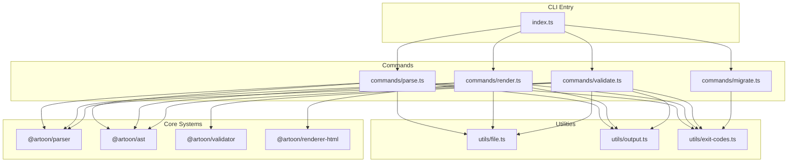
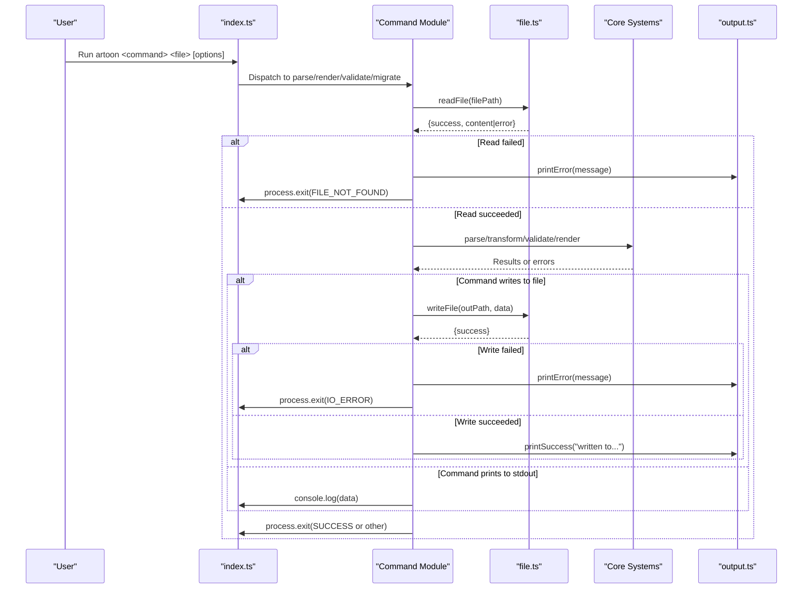
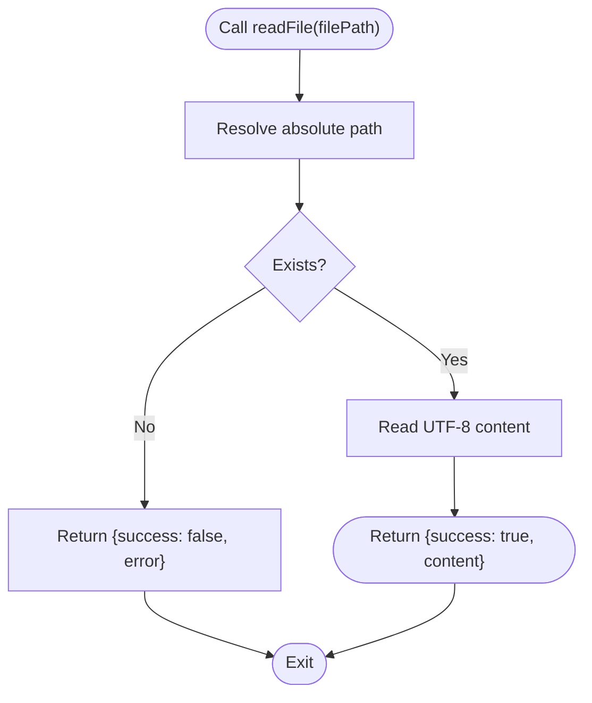
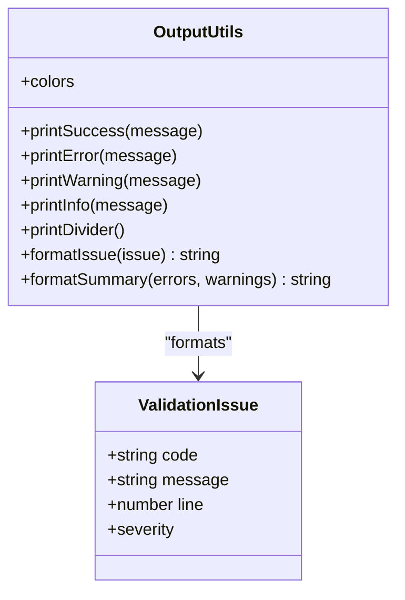
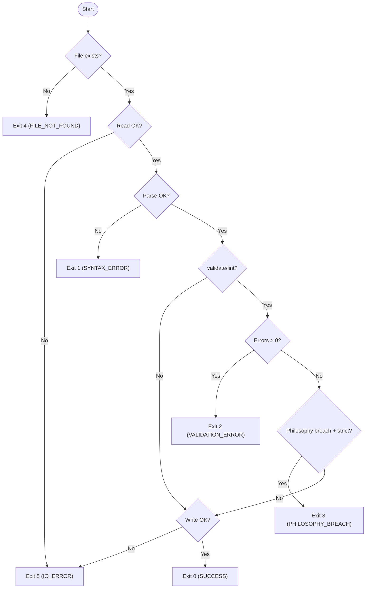
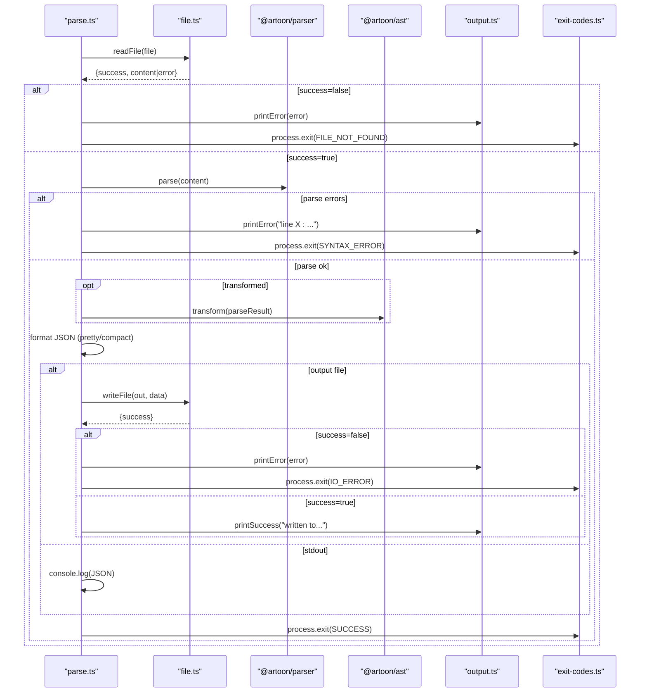
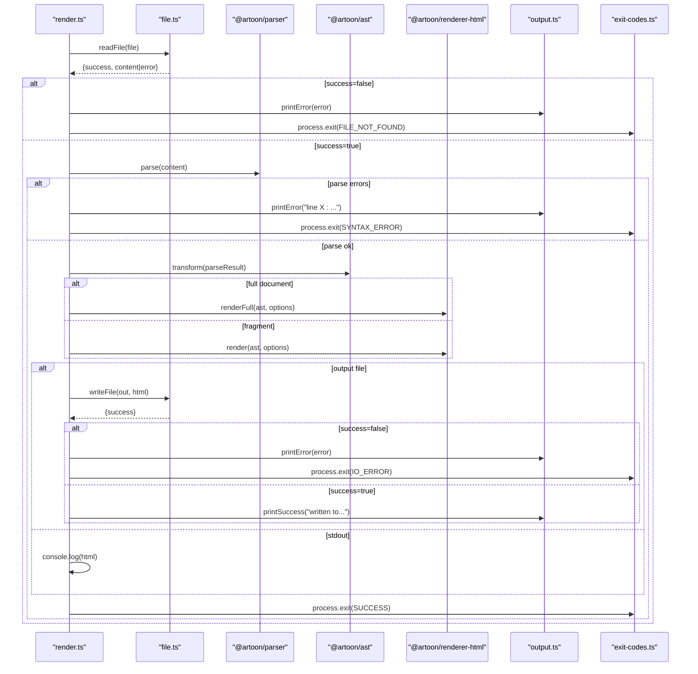
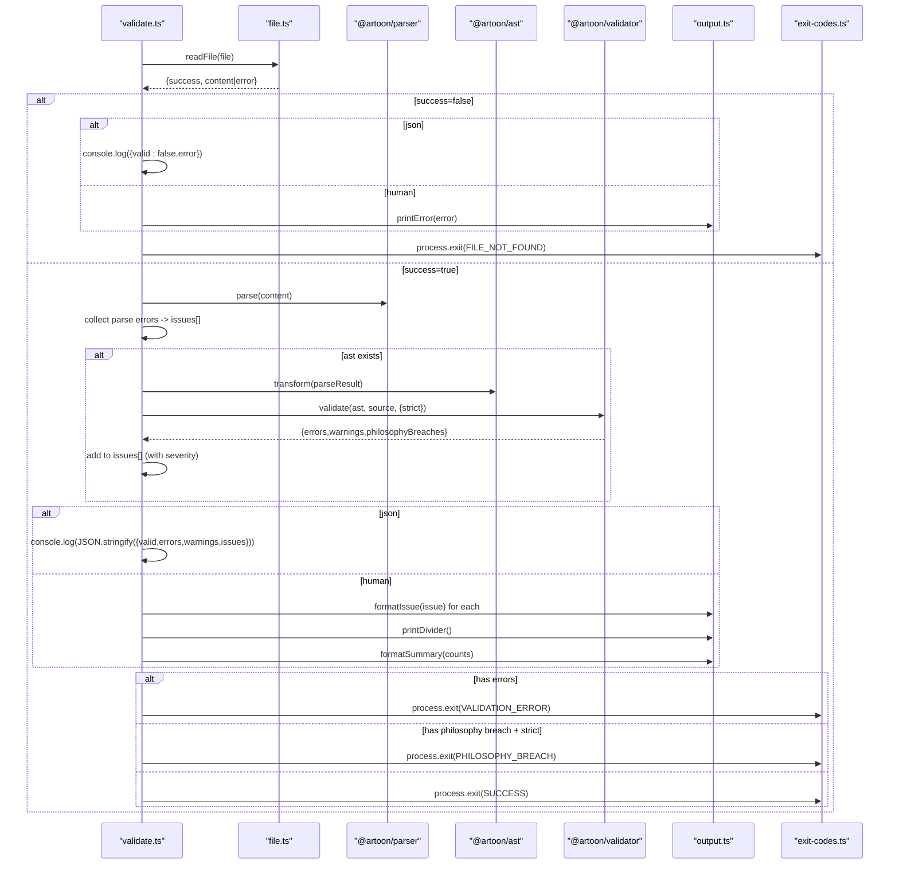
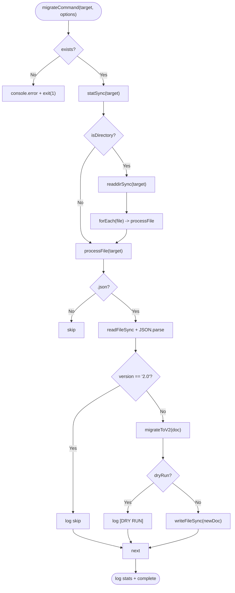
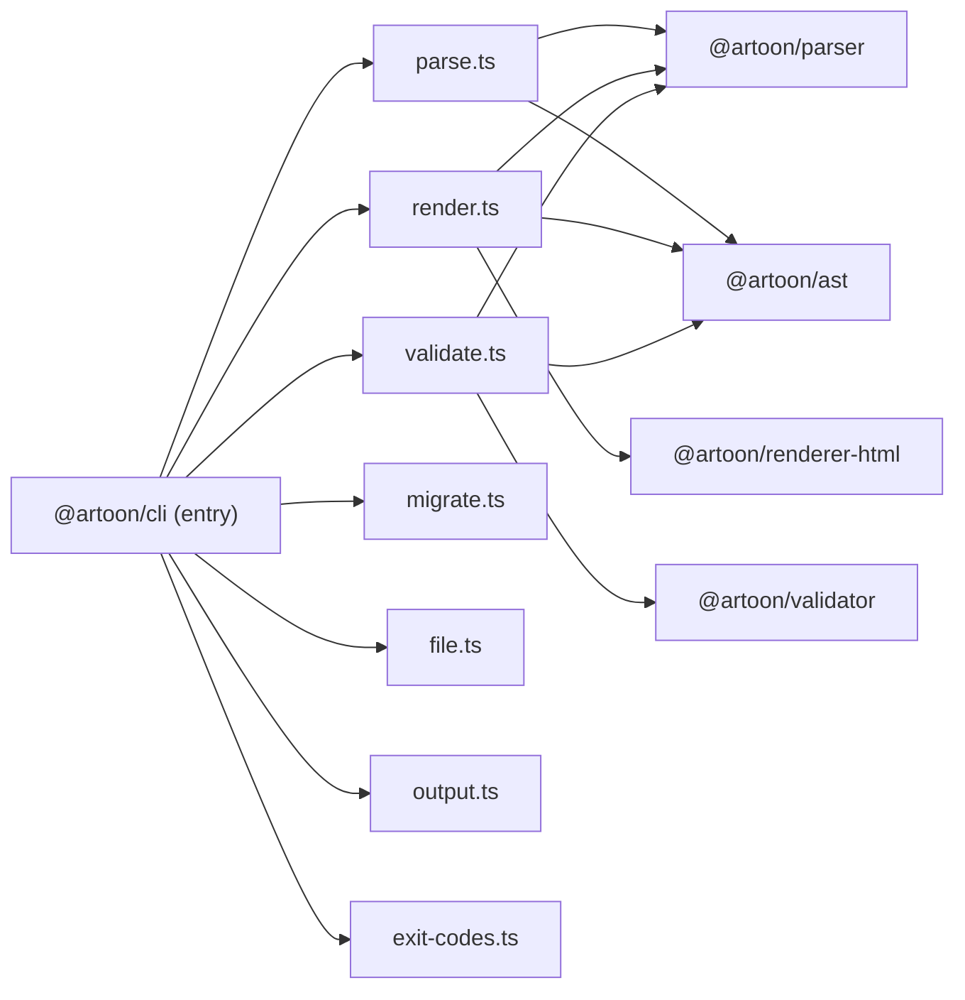

# Utility Functions

<cite>
**Referenced Files in This Document**
- [index.ts](file://artoon-cli/src/index.ts)
- [parse.ts](file://artoon-cli/src/commands/parse.ts)
- [render.ts](file://artoon-cli/src/commands/render.ts)
- [validate.ts](file://artoon-cli/src/commands/validate.ts)
- [migrate.ts](file://artoon-cli/src/commands/migrate.ts)
- [file.ts](file://artoon-cli/src/utils/file.ts)
- [output.ts](file://artoon-cli/src/utils/output.ts)
- [exit-codes.ts](file://artoon-cli/src/utils/exit-codes.ts)
- [package.json](file://artoon-cli/package.json)
- [05-EXIT-CODES.md](file://artoon-cli/inventory_artoon_cli/05-EXIT-CODES.md)
- [06-OUTPUT-CONTRACTS.md](file://artoon-cli/inventory_artoon_cli/06-OUTPUT-CONTRACTS.md)
- [07-API-REFERENCE.md](file://artoon-cli/inventory_artoon_cli/07-API-REFERENCE.md)
- [utils.test.ts](file://artoon-cli/tests/utils.test.ts)
- [integration.test.ts](file://artoon-cli/tests/integration.test.ts)
</cite>

## Table of Contents
1. [Introduction](#introduction)
2. [Project Structure](#project-structure)
3. [Core Components](#core-components)
4. [Architecture Overview](#architecture-overview)
5. [Detailed Component Analysis](#detailed-component-analysis)
6. [Dependency Analysis](#dependency-analysis)
7. [Performance Considerations](#performance-considerations)
8. [Troubleshooting Guide](#troubleshooting-guide)
9. [Conclusion](#conclusion)
10. [Appendices](#appendices)

## Introduction
This document focuses on the ARTOON CLI utility functions that power file handling, output formatting, and exit code management. These utilities are used across the CLI’s commands to orchestrate parsing, validation, and rendering while maintaining predictable contracts for stdout, stderr, and exit codes. The goal is to explain how these utilities work, how they integrate into the CLI commands, and how to extend or customize them for custom scripts and processing pipelines.

## Project Structure
The ARTOON CLI is organized around a small set of utilities and commands:
- Entry point registers commands and options.
- Commands implement the core workflows for parse, render, validate, and migrate.
- Utilities encapsulate file I/O, output formatting, and exit code semantics.

**Diagram sources**
- [index.ts:10-60](file://artoon-cli/src/index.ts#L10-L60)
- [parse.ts:1-66](file://artoon-cli/src/commands/parse.ts#L1-L66)
- [render.ts:1-63](file://artoon-cli/src/commands/render.ts#L1-L63)
- [validate.ts:1-150](file://artoon-cli/src/commands/validate.ts#L1-L150)
- [migrate.ts:1-56](file://artoon-cli/src/commands/migrate.ts#L1-L56)
- [file.ts:1-51](file://artoon-cli/src/utils/file.ts#L1-L51)
- [output.ts:1-69](file://artoon-cli/src/utils/output.ts#L1-L69)
- [exit-codes.ts:1-12](file://artoon-cli/src/utils/exit-codes.ts#L1-L12)

**Section sources**
- [index.ts:1-61](file://artoon-cli/src/index.ts#L1-L61)
- [07-API-REFERENCE.md:14-28](file://artoon-cli/inventory_artoon_cli/07-API-REFERENCE.md#L14-L28)

## Core Components
This section documents the three primary utility modules and their roles.

- File utilities: Provide safe file read/write, path manipulation, and ARTOON file detection.
- Output utilities: Provide colorized console logging, structured issue formatting, and summary formatting.
- Exit codes: Define stable exit code semantics for all commands.

Key responsibilities:
- File utilities centralize filesystem operations with consistent error reporting.
- Output utilities separate data output (stdout) from status/error messages (stderr) and provide standardized formatting.
- Exit codes define deterministic outcomes for automation and CI/CD.

**Section sources**
- [file.ts:1-51](file://artoon-cli/src/utils/file.ts#L1-L51)
- [output.ts:1-69](file://artoon-cli/src/utils/output.ts#L1-L69)
- [exit-codes.ts:1-12](file://artoon-cli/src/utils/exit-codes.ts#L1-L12)
- [06-OUTPUT-CONTRACTS.md:14-309](file://artoon-cli/inventory_artoon_cli/06-OUTPUT-CONTRACTS.md#L14-L309)
- [05-EXIT-CODES.md:14-239](file://artoon-cli/inventory_artoon_cli/05-EXIT-CODES.md#L14-L239)

## Architecture Overview
The CLI follows a facade plus command pattern. The entry point sets up commands and delegates to command modules. Each command orchestrates core system calls, uses file utilities for I/O, output utilities for console messaging, and exit codes for deterministic outcomes.

**Diagram sources**
- [index.ts:10-60](file://artoon-cli/src/index.ts#L10-L60)
- [parse.ts:13-65](file://artoon-cli/src/commands/parse.ts#L13-L65)
- [render.ts:14-61](file://artoon-cli/src/commands/render.ts#L14-L61)
- [validate.ts:22-149](file://artoon-cli/src/commands/validate.ts#L22-L149)
- [file.ts:10-41](file://artoon-cli/src/utils/file.ts#L10-L41)
- [output.ts:12-30](file://artoon-cli/src/utils/output.ts#L12-L30)
- [exit-codes.ts:1-12](file://artoon-cli/src/utils/exit-codes.ts#L1-L12)

## Detailed Component Analysis

### File Utilities
Purpose:
- Read files safely with consistent error reporting.
- Write files, ensuring target directories exist.
- Detect ARTOON file extensions.
- Derive output paths from input paths.

Implementation highlights:
- readFile returns a discriminated union with success flag and either content or error message.
- writeFile ensures parent directories exist before writing.
- isArtoonFile checks for .artoon and .toon suffixes.
- getOutputPath replaces the filename extension while preserving directory and basename.

Usage in commands:
- parse and render use readFile to load ARTOON content.
- parse and render use writeFile to persist outputs when requested.
- validate uses readFile to load content for parsing and validation.

**Diagram sources**
- [file.ts:10-24](file://artoon-cli/src/utils/file.ts#L10-L24)

Practical examples:
- Reading a file and handling errors in a custom script:
  - Use readFile to load content.
  - On failure, log the error and exit with FILE_NOT_FOUND.
- Writing transformed AST to a file:
  - Use writeFile to persist JSON output.
  - On failure, log the error and exit with IO_ERROR.

Best practices:
- Always resolve absolute paths to avoid ambiguous paths.
- Prefer explicit error handling and early exits for invalid states.
- Ensure target directories exist before writing.

**Section sources**
- [file.ts:1-51](file://artoon-cli/src/utils/file.ts#L1-L51)
- [parse.ts:14-19](file://artoon-cli/src/commands/parse.ts#L14-L19)
- [render.ts:15-20](file://artoon-cli/src/commands/render.ts#L15-L20)
- [utils.test.ts:23-49](file://artoon-cli/tests/utils.test.ts#L23-L49)

### Output Utilities
Purpose:
- Provide colorized console logging for success, error, warning, and info.
- Format validation issues consistently with severity, optional line numbers, and optional codes.
- Summarize counts of errors and warnings.
- Maintain separation of concerns: stdout for data, stderr for messages.

Implementation highlights:
- Colors map defines symbols and colors for different message types.
- formatIssue constructs a single formatted line per issue.
- formatSummary aggregates counts into a concise sentence.
- printDivider draws a horizontal rule for readability.

Usage in commands:
- validate prints human-readable issues and summaries to stderr.
- parse and render print success/warn/info messages to stderr when writing to files.
- validate can emit JSON to stdout when --json is used.

**Diagram sources**
- [output.ts:3-68](file://artoon-cli/src/utils/output.ts#L3-L68)

Practical examples:
- Formatting validation issues for a linter-like pipeline:
  - Build an array of ValidationIssue entries.
  - Iterate and format each with formatIssue.
  - Print a summary with formatSummary.
- Emitting structured JSON for machine consumption:
  - Use --json in validate to output a JSON object to stdout.

Best practices:
- Keep stdout free of decorations and status messages.
- Use stderr for progress, warnings, and summaries.
- Maintain consistent formatting for cross-tool compatibility.

**Section sources**
- [output.ts:1-69](file://artoon-cli/src/utils/output.ts#L1-L69)
- [validate.ts:111-139](file://artoon-cli/src/commands/validate.ts#L111-L139)
- [06-OUTPUT-CONTRACTS.md:23-309](file://artoon-cli/inventory_artoon_cli/06-OUTPUT-CONTRACTS.md#L23-L309)

### Exit Code Management
Purpose:
- Provide stable, documented exit codes for automation and CI/CD.
- Enforce deterministic outcomes across commands and modes.

Definition:
- SUCCESS, SYNTAX_ERROR, VALIDATION_ERROR, PHILOSOPHY_BREACH, FILE_NOT_FOUND, IO_ERROR, UNKNOWN_ERROR.

Decision flow:
- Start with file existence and readability.
- Parse content; on failures, exit with SYNTAX_ERROR.
- For validate, collect validation and philosophy issues; decide VALIDATION_ERROR or PHILOSOPHY_BREACH under strict mode.
- On successful write, exit SUCCESS; on write failure, exit IO_ERROR.

**Diagram sources**
- [05-EXIT-CODES.md:76-134](file://artoon-cli/inventory_artoon_cli/05-EXIT-CODES.md#L76-L134)
- [validate.ts:141-149](file://artoon-cli/src/commands/validate.ts#L141-L149)
- [parse.ts:52-64](file://artoon-cli/src/commands/parse.ts#L52-L64)
- [render.ts:49-61](file://artoon-cli/src/commands/render.ts#L49-L61)

Practical examples:
- Bash/CiCd scripts can branch on exit codes to drive workflows.
- Node.js scripts can inspect error.status to handle failures programmatically.

Best practices:
- Always exit with a documented code.
- Avoid mixing data and status messages on stdout.
- Keep exit code contracts stable across versions.

**Section sources**
- [exit-codes.ts:1-12](file://artoon-cli/src/utils/exit-codes.ts#L1-L12)
- [05-EXIT-CODES.md:14-239](file://artoon-cli/inventory_artoon_cli/05-EXIT-CODES.md#L14-L239)
- [validate.ts:141-149](file://artoon-cli/src/commands/validate.ts#L141-L149)
- [parse.ts:52-64](file://artoon-cli/src/commands/parse.ts#L52-L64)
- [render.ts:49-61](file://artoon-cli/src/commands/render.ts#L49-L61)

### Command Workflows Using Utilities

#### Parse Workflow
- Read file via file utilities.
- Parse content; on errors, print line-numbered messages and exit with SYNTAX_ERROR.
- Optionally transform to canonical AST.
- Format JSON (pretty or compact).
- If output file provided, write via file utilities; otherwise print to stdout.
- Exit with SUCCESS or IO_ERROR depending on write outcome.

**Diagram sources**
- [parse.ts:13-65](file://artoon-cli/src/commands/parse.ts#L13-L65)
- [file.ts:10-41](file://artoon-cli/src/utils/file.ts#L10-L41)
- [output.ts:12-30](file://artoon-cli/src/utils/output.ts#L12-L30)
- [exit-codes.ts:1-12](file://artoon-cli/src/utils/exit-codes.ts#L1-L12)

**Section sources**
- [parse.ts:1-66](file://artoon-cli/src/commands/parse.ts#L1-L66)
- [06-OUTPUT-CONTRACTS.md:101-117](file://artoon-cli/inventory_artoon_cli/06-OUTPUT-CONTRACTS.md#L101-L117)

#### Render Workflow
- Read file via file utilities.
- Parse content; on errors, print line-numbered messages and exit with SYNTAX_ERROR.
- Transform to canonical AST.
- Render HTML (fragment or full document).
- If output file provided, write via file utilities; otherwise print to stdout.
- Exit with SUCCESS or IO_ERROR depending on write outcome.

**Diagram sources**
- [render.ts:14-61](file://artoon-cli/src/commands/render.ts#L14-L61)
- [file.ts:10-41](file://artoon-cli/src/utils/file.ts#L10-L41)
- [output.ts:12-30](file://artoon-cli/src/utils/output.ts#L12-L30)
- [exit-codes.ts:1-12](file://artoon-cli/src/utils/exit-codes.ts#L1-L12)

**Section sources**
- [render.ts:1-63](file://artoon-cli/src/commands/render.ts#L1-L63)
- [06-OUTPUT-CONTRACTS.md:119-135](file://artoon-cli/inventory_artoon_cli/06-OUTPUT-CONTRACTS.md#L119-L135)

#### Validate Workflow
- Read file via file utilities.
- Parse content; collect parse errors and add to issues.
- Transform to canonical AST and validate; add validation errors and warnings.
- Optionally treat warnings as errors in strict mode.
- Emit human-readable output to stderr or JSON to stdout.
- Exit with SUCCESS, VALIDATION_ERROR, or PHILOSOPHY_BREACH depending on collected issues.

**Diagram sources**
- [validate.ts:22-149](file://artoon-cli/src/commands/validate.ts#L22-L149)
- [file.ts:10-24](file://artoon-cli/src/utils/file.ts#L10-L24)
- [output.ts:39-68](file://artoon-cli/src/utils/output.ts#L39-L68)
- [exit-codes.ts:1-12](file://artoon-cli/src/utils/exit-codes.ts#L1-L12)

**Section sources**
- [validate.ts:1-150](file://artoon-cli/src/commands/validate.ts#L1-L150)
- [06-OUTPUT-CONTRACTS.md:137-162](file://artoon-cli/inventory_artoon_cli/06-OUTPUT-CONTRACTS.md#L137-L162)
- [05-EXIT-CODES.md:64-74](file://artoon-cli/inventory_artoon_cli/05-EXIT-CODES.md#L64-L74)

#### Migration Workflow (migrate command)
- Validates target path existence.
- Walks directory or processes single file.
- Skips non-JSON files.
- Skips already V2.0 documents.
- Migrates JSON documents to V2.0 (dry-run or write).
- Logs counts and completion status.

**Diagram sources**
- [migrate.ts:5-55](file://artoon-cli/src/commands/migrate.ts#L5-L55)

**Section sources**
- [migrate.ts:1-56](file://artoon-cli/src/commands/migrate.ts#L1-L56)

### Extending CLI Functionality and Building Pipelines
- Adding a new command:
  - Register a new command in the entry point with options and action.
  - Use file utilities for I/O, output utilities for messages, and exit codes for outcomes.
- Building custom processing pipelines:
  - Use parse to produce JSON AST and pipe to jq or other tools.
  - Use render to produce HTML and redirect to files or further processors.
  - Use validate with --json to integrate into automated quality gates.

Integration patterns:
- Shell pipelines: artoon parse file.artoon | jq '.content[]'
- CI/CD: artoon validate "$file" --strict; job fails on non-zero exit.
- Node.js: spawn or execSync with capture and switch on exit status.

**Section sources**
- [index.ts:17-58](file://artoon-cli/src/index.ts#L17-L58)
- [06-OUTPUT-CONTRACTS.md:263-282](file://artoon-cli/inventory_artoon_cli/06-OUTPUT-CONTRACTS.md#L263-L282)
- [05-EXIT-CODES.md:138-217](file://artoon-cli/inventory_artoon_cli/05-EXIT-CODES.md#L138-L217)

## Dependency Analysis
Runtime dependencies:
- Core systems: @artoon/parser, @artoon/ast, @artoon/validator, @artoon/renderer-html
- CLI framework: commander
- Terminal formatting: chalk

These dependencies are consumed by the CLI entry point and commands, which delegate all processing to the core systems while keeping the CLI minimal and focused on orchestration.

**Diagram sources**
- [package.json:18-25](file://artoon-cli/package.json#L18-L25)
- [index.ts:3-8](file://artoon-cli/src/index.ts#L3-L8)

**Section sources**
- [package.json:1-34](file://artoon-cli/package.json#L1-L34)
- [index.ts:1-61](file://artoon-cli/src/index.ts#L1-L61)

## Performance Considerations
- Memory and streaming:
  - Current file utilities read entire files synchronously. For very large ARTOON files, consider asynchronous streams or chunked processing to reduce peak memory usage.
- Concurrency:
  - Commands currently process files sequentially. For batch operations, consider parallel processing with bounded concurrency to improve throughput.
- I/O:
  - Ensure target directories exist before writing to avoid repeated mkdir attempts.
- Rendering:
  - HTML rendering is delegated to the renderer; keep output formatting minimal to reduce overhead.
- Validation:
  - Validation runs after transformation; keep transformations efficient and avoid redundant passes.

[No sources needed since this section provides general guidance]

## Troubleshooting Guide
Common issues and resolutions:
- File not found:
  - Symptom: Exit code 4.
  - Resolution: Verify path correctness and permissions; use absolute paths.
- I/O errors:
  - Symptom: Exit code 5.
  - Resolution: Check write permissions and available disk space; ensure target directories exist.
- Syntax errors:
  - Symptom: Exit code 1; parse errors printed to stderr.
  - Resolution: Fix ARTOON syntax; use validate to locate issues.
- Validation errors:
  - Symptom: Exit code 2; issues printed to stderr or JSON to stdout.
  - Resolution: Address validation errors; use --strict to treat warnings as errors.
- Philosophy breaches:
  - Symptom: Exit code 3 in strict mode.
  - Resolution: Adjust document to align with philosophy rules.

Testing and verification:
- Unit tests validate file I/O, output formatting, and exit code definitions.
- Integration tests verify end-to-end behavior for parse, render, and validate.

**Section sources**
- [utils.test.ts:1-99](file://artoon-cli/tests/utils.test.ts#L1-L99)
- [integration.test.ts:1-177](file://artoon-cli/tests/integration.test.ts#L1-L177)
- [05-EXIT-CODES.md:14-239](file://artoon-cli/inventory_artoon_cli/05-EXIT-CODES.md#L14-L239)

## Conclusion
The ARTOON CLI’s utility functions provide a robust foundation for file handling, output formatting, and exit code management. By adhering to the documented contracts for stdout/stderr and exit codes, developers can integrate the CLI into scripts, pipelines, and CI/CD workflows reliably. Extending the CLI involves adding new commands that reuse these utilities, ensuring consistent behavior and predictable outcomes.

[No sources needed since this section summarizes without analyzing specific files]

## Appendices

### Practical Scripting Examples
- Bash:
  - Conditional execution: artoon validate doc.artoon && artoon render doc.artoon -o out.html
  - Case-based handling of exit codes for reporting.
- PowerShell:
  - Switch on $LASTEXITCODE to branch behavior.
- GitHub Actions:
  - Loop over docs/*.artoon and fail the job on any non-zero exit.
- Node.js:
  - execSync with capture and switch on error.status.

**Section sources**
- [05-EXIT-CODES.md:138-217](file://artoon-cli/inventory_artoon_cli/05-EXIT-CODES.md#L138-L217)

### API Reference Highlights
- Commands:
  - parseCommand(file, options), renderCommand(file, options), validateCommand(file, options)
- Utilities:
  - readFile, writeFile, isArtoonFile, getOutputPath
  - printSuccess, printError, printWarning, printInfo, printDivider, formatIssue, formatSummary
  - ExitCodes constants and type

**Section sources**
- [07-API-REFERENCE.md:32-138](file://artoon-cli/inventory_artoon_cli/07-API-REFERENCE.md#L32-L138)