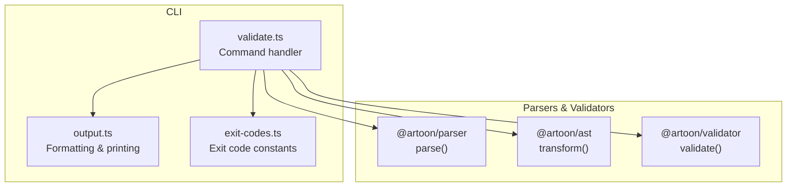
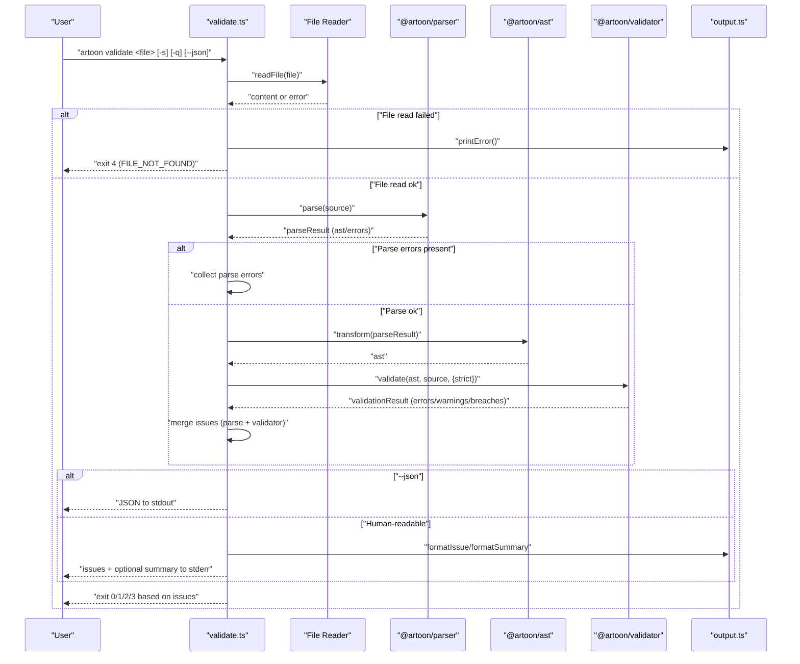
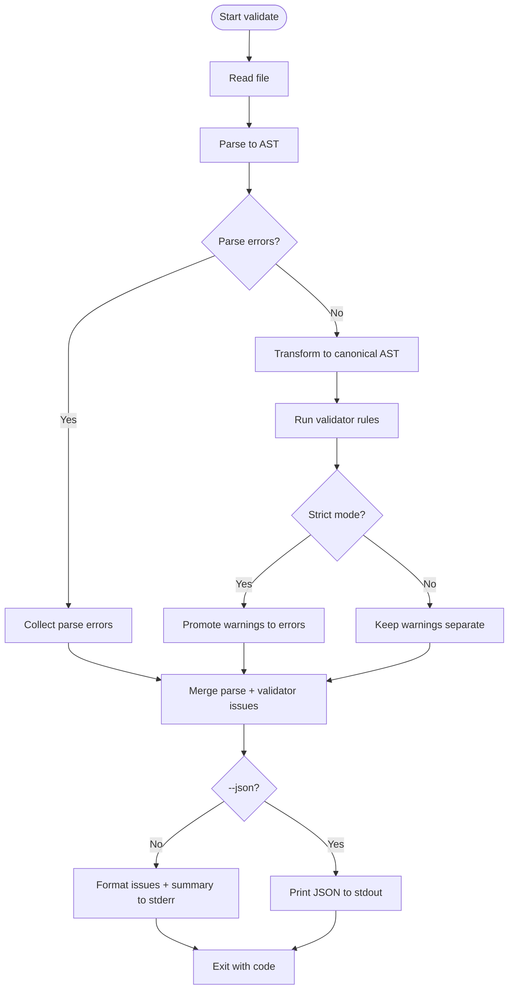
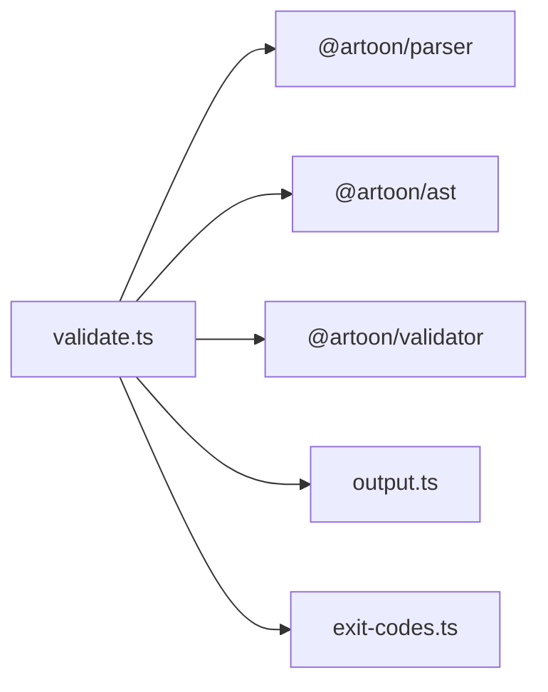

# Validate Command

<cite>
**Referenced Files in This Document**
- [validate.ts](file://artoon-cli/src/commands/validate.ts)
- [output.ts](file://artoon-cli/src/utils/output.ts)
- [exit-codes.ts](file://artoon-cli/src/utils/exit-codes.ts)
- [index.ts](file://artoon-validator/src/engine/index.ts)
- [index.ts](file://artoon-cli/inventory_artoon_cli/04-COMMANDS.md)
- [06-OUTPUT-CONTRACTS.md](file://artoon-cli/inventory_artoon_cli/06-OUTPUT-CONTRACTS.md)
- [05-EXIT-CODES.md](file://artoon-cli/inventory_artoon_cli/05-EXIT-CODES.md)
</cite>

## Table of Contents
1. [Introduction](#introduction)
2. [Project Structure](#project-structure)
3. [Core Components](#core-components)
4. [Architecture Overview](#architecture-overview)
5. [Detailed Component Analysis](#detailed-component-analysis)
6. [Dependency Analysis](#dependency-analysis)
7. [Performance Considerations](#performance-considerations)
8. [Troubleshooting Guide](#troubleshooting-guide)
9. [Conclusion](#conclusion)
10. [Appendices](#appendices)

## Introduction
This document explains the ARTOON CLI validate command, which checks ARTOON files for syntax correctness and semantic compliance. It covers command syntax, options, validation modes, error reporting, quiet mode, and integration into CI/CD and automated QA. It also clarifies the relationship between validation and linting, and provides guidance for resolving common validation errors.

## Project Structure
The validate command is part of the ARTOON CLI package and orchestrates parsing, transformation, and validation via dedicated libraries. The CLI handles file I/O, error formatting, and exit codes, while the validator enforces rule categories and supports strict mode.

**Diagram sources**
- [validate.ts:1-150](file://artoon-cli/src/commands/validate.ts#L1-L150)
- [output.ts:1-69](file://artoon-cli/src/utils/output.ts#L1-L69)
- [index.ts:1-178](file://artoon-validator/src/engine/index.ts#L1-L178)

**Section sources**
- [validate.ts:1-150](file://artoon-cli/src/commands/validate.ts#L1-L150)
- [index.ts:161-240](file://artoon-cli/inventory_artoon_cli/04-COMMANDS.md#L161-L240)

## Core Components
- Command handler: Reads the file, parses ARTOON, transforms to canonical AST, validates, formats output, and exits with appropriate codes.
- Output utilities: Human-readable formatting for issues and summaries; JSON output for machine processing.
- Validator engine: Applies rule categories (syntax, structure, semantics, constraints, philosophy), supports strict mode, and categorizes issues.

Key behaviors:
- Strict mode: Promotes warnings to errors.
- Quiet mode: Suppresses summary lines; still prints all issues to stderr.
- JSON mode: Emits structured validation results to stdout; suppresses human-readable output.

**Section sources**
- [validate.ts:22-149](file://artoon-cli/src/commands/validate.ts#L22-L149)
- [output.ts:32-68](file://artoon-cli/src/utils/output.ts#L32-L68)
- [index.ts:27-100](file://artoon-validator/src/engine/index.ts#L27-L100)

## Architecture Overview
The validate pipeline reads a file, parses it into an AST, transforms it into canonical form, and runs validation rules. Issues are collected and emitted either as human-readable messages or as JSON.

**Diagram sources**
- [validate.ts:22-149](file://artoon-cli/src/commands/validate.ts#L22-L149)
- [output.ts:39-68](file://artoon-cli/src/utils/output.ts#L39-L68)
- [index.ts:27-100](file://artoon-validator/src/engine/index.ts#L27-L100)

## Detailed Component Analysis

### Command Syntax and Options
- Syntax: artoon validate <file> [options]
- Options:
  - -s, --strict: Treat warnings as errors.
  - -q, --quiet: Print only issues; suppress summary line.
  - --json: Emit JSON validation report to stdout.

Examples and expected outputs are documented in the CLI inventory.

**Section sources**
- [index.ts:161-196](file://artoon-cli/inventory_artoon_cli/04-COMMANDS.md#L161-L196)
- [06-OUTPUT-CONTRACTS.md:137-162](file://artoon-cli/inventory_artoon_cli/06-OUTPUT-CONTRACTS.md#L137-L162)

### Validation Modes and Behavior
- Normal mode: Collects errors and warnings; philosophy breaches are warnings.
- Strict mode (-s): Converts warnings into errors; philosophy breaches remain warnings but influence exit codes.

The validator engine applies rule categories and supports strict evaluation.

**Section sources**
- [validate.ts:74-83](file://artoon-cli/src/commands/validate.ts#L74-L83)
- [index.ts:79-83](file://artoon-validator/src/engine/index.ts#L79-L83)

### Error Reporting Formats
- Human-readable:
  - Issues printed to stderr with severity prefixes and optional line numbers.
  - Optional summary line indicating counts of errors and warnings.
- JSON:
  - Printed to stdout with fields: valid, file, errors, warnings, issues array.
  - Issues include severity, code, message, and line.

Output contracts specify channels and guarantees.

**Section sources**
- [output.ts:39-68](file://artoon-cli/src/utils/output.ts#L39-L68)
- [validate.ts:111-139](file://artoon-cli/src/commands/validate.ts#L111-L139)
- [06-OUTPUT-CONTRACTS.md:137-162](file://artoon-cli/inventory_artoon_cli/06-OUTPUT-CONTRACTS.md#L137-L162)

### Quiet Mode Usage
Quiet mode (-q) suppresses the summary line after issues. It still prints all issues to stderr and does not change the exit code behavior.

**Section sources**
- [validate.ts:132-138](file://artoon-cli/src/commands/validate.ts#L132-L138)
- [06-OUTPUT-CONTRACTS.md:157-161](file://artoon-cli/inventory_artoon_cli/06-OUTPUT-CONTRACTS.md#L157-L161)

### Exit Codes
- 0: Success (no validation errors).
- 1: Parse/syntax error.
- 2: Validation error found.
- 3: Philosophy breach detected under strict mode.
- 4: File not found.
- 5: I/O error.

Decision flow is documented and stable across versions.

**Section sources**
- [05-EXIT-CODES.md:64-73](file://artoon-cli/inventory_artoon_cli/05-EXIT-CODES.md#L64-L73)
- [05-EXIT-CODES.md:107-131](file://artoon-cli/inventory_artoon_cli/05-EXIT-CODES.md#L107-L131)

### Relationship Between Validation and Linting
- lint is an alias for validate and shares identical options and behavior.
- Both commands use the same pipeline and exit codes.

**Section sources**
- [index.ts:242-256](file://artoon-cli/inventory_artoon_cli/04-COMMANDS.md#L242-L256)

## Architecture Overview
The validate command integrates three layers:
- CLI orchestration: file I/O, parsing, transformation, validation, output formatting, and exit code selection.
- Parser: converts ARTOON text to a parse tree with potential syntax errors.
- Validator: applies rule categories and strict mode logic to produce categorized issues.

**Diagram sources**
- [validate.ts:22-149](file://artoon-cli/src/commands/validate.ts#L22-L149)
- [index.ts:27-100](file://artoon-validator/src/engine/index.ts#L27-L100)

## Detailed Component Analysis

### Command Handler: validateCommand
Responsibilities:
- Read file content.
- Parse ARTOON to AST.
- Transform AST for validation.
- Run validator with strict option.
- Aggregate parse errors, validation errors, warnings, and philosophy breaches.
- Format output (human-readable or JSON).
- Compute exit code based on severity and mode.

Key implementation points:
- Uses exit codes module for consistent exit behavior.
- Uses output utilities for formatting and printing.
- Supports quiet mode by suppressing summary lines.

**Section sources**
- [validate.ts:22-149](file://artoon-cli/src/commands/validate.ts#L22-L149)
- [exit-codes.ts:1-99](file://artoon-cli/src/utils/exit-codes.ts#L1-L99)
- [output.ts:32-68](file://artoon-cli/src/utils/output.ts#L32-L68)

### Validator Engine
Responsibilities:
- Apply rule categories: syntax, structure, semantics, constraints, philosophy.
- Collate and categorize issues.
- Support strict mode to promote warnings to errors.
- Provide quick validity check and formatted report utilities.

Behavioral notes:
- Parser errors are included in the validation result.
- Strict mode merges warnings into errors for validity determination.

**Section sources**
- [index.ts:27-100](file://artoon-validator/src/engine/index.ts#L27-L100)

### Output Formatting Utilities
Responsibilities:
- Define severity colors and formatting helpers.
- Format individual issues with severity, line, and code.
- Produce human-readable summaries.

Usage:
- validate command uses these helpers for stderr output.
- JSON mode bypasses these helpers and prints structured data.

**Section sources**
- [output.ts:39-68](file://artoon-cli/src/utils/output.ts#L39-L68)

## Dependency Analysis
The validate command depends on:
- Parser for syntax-level detection.
- AST transformer for canonicalization.
- Validator for semantic and policy checks.
- Output utilities for formatting.
- Exit codes for deterministic shell integration.

**Diagram sources**
- [validate.ts:1-14](file://artoon-cli/src/commands/validate.ts#L1-L14)
- [output.ts:1-10](file://artoon-cli/src/utils/output.ts#L1-L10)
- [index.ts:1-14](file://artoon-validator/src/engine/index.ts#L1-L14)

**Section sources**
- [validate.ts:1-14](file://artoon-cli/src/commands/validate.ts#L1-L14)
- [index.ts:1-14](file://artoon-validator/src/engine/index.ts#L1-L14)

## Performance Considerations
- Parsing and transforming are lightweight for typical ARTOON documents.
- Strict mode adds minimal overhead by merging warnings into errors.
- JSON output avoids extra formatting loops, making it suitable for tooling pipelines.
- For batch validation, consider parallelizing across files at the shell level.

## Troubleshooting Guide
Common scenarios and resolutions:
- Parse/syntax errors (exit code 1):
  - Cause: Invalid ARTOON syntax.
  - Resolution: Fix syntax near reported line numbers; re-run validation.
- Validation errors (exit code 2):
  - Cause: Structural or semantic violations.
  - Resolution: Review suggestions in JSON output; adjust content accordingly.
- Philosophy breaches (exit code 3 in strict mode):
  - Cause: Policy violations (e.g., discouraged constructs).
  - Resolution: Remove or replace violating constructs; optionally disable strict mode for warnings-only feedback.
- File not found (exit code 4):
  - Cause: Incorrect path or missing file.
  - Resolution: Verify file path and permissions.
- I/O errors (exit code 5):
  - Cause: Read/write failures.
  - Resolution: Check disk space, permissions, and target paths.

Scripting tips:
- Use exit codes to gate downstream steps (e.g., render only after validation succeeds).
- In CI/CD, run validate with --strict and --json to capture machine-readable reports.

**Section sources**
- [05-EXIT-CODES.md:64-73](file://artoon-cli/inventory_artoon_cli/05-EXIT-CODES.md#L64-L73)
- [05-EXIT-CODES.md:189-198](file://artoon-cli/inventory_artoon_cli/05-EXIT-CODES.md#L189-L198)
- [validate.ts:141-148](file://artoon-cli/src/commands/validate.ts#L141-L148)

## Conclusion
The validate command provides a robust, deterministic way to ensure ARTOON files meet syntax and semantic standards. With options for strictness, quiet operation, and JSON output, it integrates cleanly into development workflows and CI/CD systems. Understanding the distinction between warnings and philosophy breaches, and how strict mode affects outcomes, helps teams adopt consistent quality practices.

## Appendices

### Practical Workflows and CI/CD Integration
- Local pre-commit checks:
  - artoon validate <file> --strict
- Batch validation:
  - for file in docs/*.artoon; do artoon validate "$file" --strict; done
- CI/CD (GitHub Actions):
  - Run artoon validate with --strict; job fails on any non-zero exit code.
- Machine-readable reports:
  - artoon validate <file> --json > report.json

**Section sources**
- [index.ts:289-293](file://artoon-cli/inventory_artoon_cli/04-COMMANDS.md#L289-L293)
- [05-EXIT-CODES.md:189-198](file://artoon-cli/inventory_artoon_cli/05-EXIT-CODES.md#L189-L198)

### Validation vs Linting
- lint is an alias for validate with identical behavior and exit codes.
- Use lint when aligning with common tooling conventions.

**Section sources**
- [index.ts:242-256](file://artoon-cli/inventory_artoon_cli/04-COMMANDS.md#L242-L256)