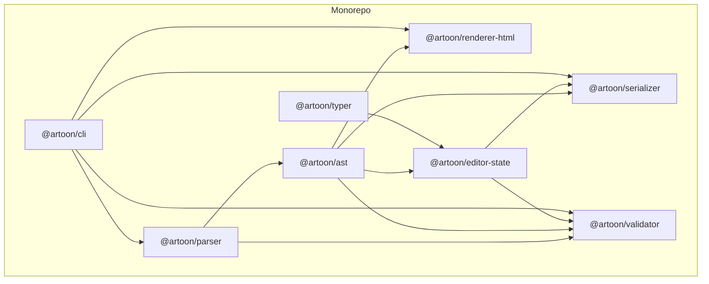
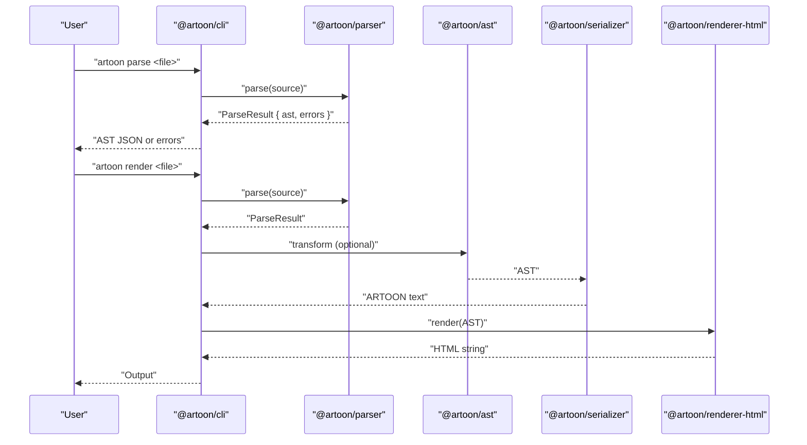
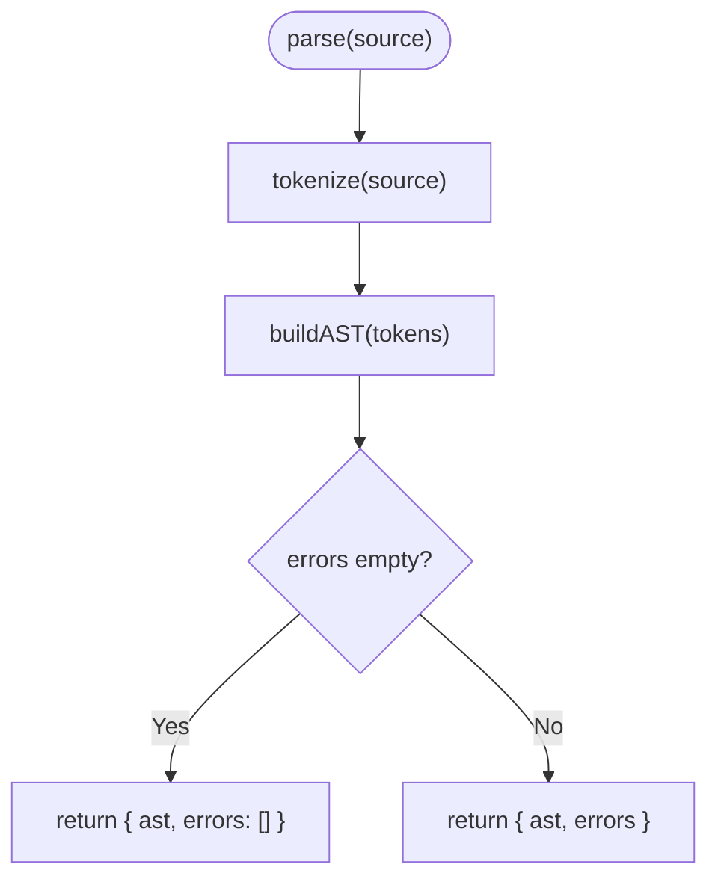
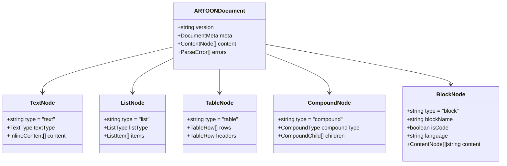
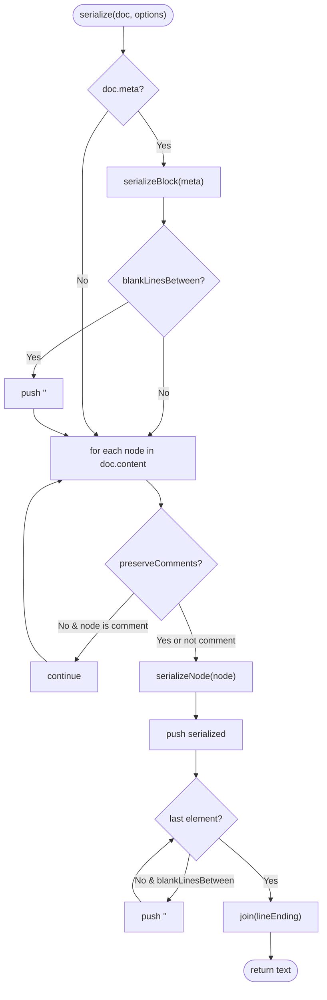
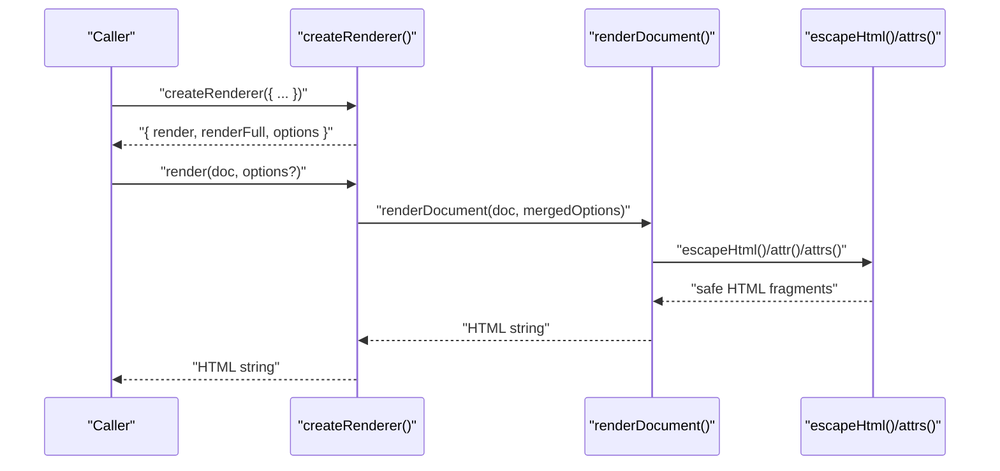
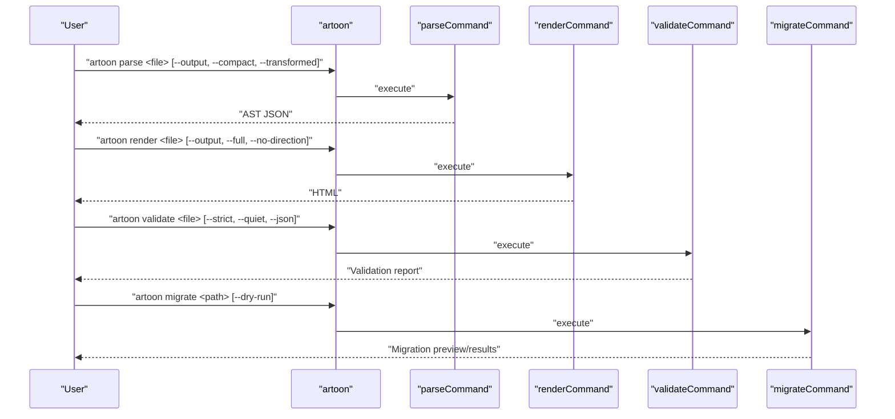
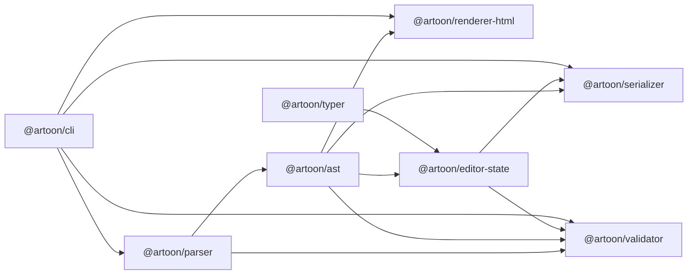

# Core Packages Architecture

<cite>
**Referenced Files in This Document**
- [package.json](file://package.json)
- [artoon-parser/src/index.ts](file://artoon-parser/src/index.ts)
- [artoon-parser/src/types.ts](file://artoon-parser/src/types.ts)
- [artoon-ast/src/index.ts](file://artoon-ast/src/index.ts)
- [artoon-ast/src/types.ts](file://artoon-ast/src/types.ts)
- [artoon-serializer/src/index.ts](file://artoon-serializer/src/index.ts)
- [artoon-renderer-html/src/index.ts](file://artoon-renderer-html/src/index.ts)
- [artoon-cli/src/index.ts](file://artoon-cli/src/index.ts)
- [artoon-validator/package.json](file://artoon-validator/package.json)
- [artoon-editor-state/package.json](file://artoon-editor-state/package.json)
- [artoon-typer/package.json](file://artoon-typer/package.json)
</cite>

## Table of Contents
1. [Introduction](#introduction)
2. [Project Structure](#project-structure)
3. [Core Components](#core-components)
4. [Architecture Overview](#architecture-overview)
5. [Detailed Component Analysis](#detailed-component-analysis)
6. [Dependency Analysis](#dependency-analysis)
7. [Performance Considerations](#performance-considerations)
8. [Troubleshooting Guide](#troubleshooting-guide)
9. [Conclusion](#conclusion)

## Introduction
This document describes the core package system of ARTOON 2.0, a monorepo composed of nine specialized packages that implement a complete pipeline for parsing ARTOON documents, constructing a canonical AST, serializing back to text, and rendering to HTML. It also covers the CLI, validator, editor state manager, and the block-based editor (Typer). The focus is on modular design, shared interfaces, and integration patterns that enable extensibility and customization.

## Project Structure
The monorepo is organized around a workspaces configuration that groups related packages. The core pipeline spans four primary packages: parser, AST, serializer, and renderer. Supporting packages include the CLI, validator, editor state, and Typer editor.

**Diagram sources**
- [package.json:6-16](file://package.json#L6-L16)
- [artoon-parser/package.json:14-16](file://artoon-parser/package.json#L14-L16)
- [artoon-ast/package.json:14-16](file://artoon-ast/package.json#L14-L16)
- [artoon-serializer/package.json:14-16](file://artoon-serializer/package.json#L14-L16)
- [artoon-renderer-html/package.json:15-17](file://artoon-renderer-html/package.json#L15-L17)
- [artoon-validator/package.json:14-17](file://artoon-validator/package.json#L14-L17)
- [artoon-editor-state/package.json:30-32](file://artoon-editor-state/package.json#L30-L32)
- [artoon-typer/package.json:29-45](file://artoon-typer/package.json#L29-L45)
- [artoon-cli/src/index.ts:3-8](file://artoon-cli/src/index.ts#L3-L8)

**Section sources**
- [package.json:1-39](file://package.json#L1-L39)

## Core Components
This section outlines the responsibilities and key exports of each core package.

- Parser (@artoon/parser)
  - Parses ARTOON source into tokens, builds an initial AST, and exposes validation utilities.
  - Exports parsing functions, tokenization utilities, and type re-exports for downstream consumers.
  - Provides strict parsing that throws on errors and convenience validators.

- AST (@artoon/ast)
  - Defines the canonical AST types and utilities for node creation, traversal, and transformation.
  - Offers migration helpers, compatibility shims, and serialization helpers for JSON interchange.

- Serializer (@artoon/serializer)
  - Converts AST documents back to ARTOON text, honoring options such as blank-line separation and comment preservation.
  - Exposes per-node serializers for advanced customization.

- Renderer (HTML) (@artoon/renderer-html)
  - Renders ARTOON documents to HTML strings or full HTML documents.
  - Provides a factory to create renderer instances with preset options.

- CLI (@artoon/cli)
  - Command-line interface exposing parse, render, validate, lint, and migrate commands.
  - Integrates with the parser, serializer, and renderer to provide end-to-end workflows.

- Validator (@artoon/validator)
  - Validates ARTOON documents against semantic and structural rules.
  - Depends on parser and AST types for rule evaluation.

- Editor State (@artoon/editor-state)
  - Framework-agnostic state management for ARTOON documents with transactions and history.
  - Depends on AST and optionally integrates with serializer and validator.

- Typer Editor (@artoon/typer)
  - A block-based rich text editor built on React and UI primitives.
  - Integrates with editor-state and provides a cohesive editing experience.

**Section sources**
- [artoon-parser/src/index.ts:1-119](file://artoon-parser/src/index.ts#L1-L119)
- [artoon-ast/src/index.ts:1-51](file://artoon-ast/src/index.ts#L1-L51)
- [artoon-serializer/src/index.ts:1-95](file://artoon-serializer/src/index.ts#L1-L95)
- [artoon-renderer-html/src/index.ts:1-57](file://artoon-renderer-html/src/index.ts#L1-L57)
- [artoon-cli/src/index.ts:1-61](file://artoon-cli/src/index.ts#L1-L61)
- [artoon-validator/package.json:1-26](file://artoon-validator/package.json#L1-L26)
- [artoon-editor-state/package.json:1-54](file://artoon-editor-state/package.json#L1-L54)
- [artoon-typer/package.json:1-66](file://artoon-typer/package.json#L1-L66)

## Architecture Overview
The pipeline follows a linear flow: input ARTOON text → parser → canonical AST → serializer or renderer. The AST acts as the central contract enabling interchangeable serializers and renderers.

**Diagram sources**
- [artoon-cli/src/index.ts:17-58](file://artoon-cli/src/index.ts#L17-L58)
- [artoon-parser/src/index.ts:56-100](file://artoon-parser/src/index.ts#L56-L100)
- [artoon-ast/src/index.ts:13-45](file://artoon-ast/src/index.ts#L13-L45)
- [artoon-serializer/src/index.ts:17-59](file://artoon-serializer/src/index.ts#L17-L59)
- [artoon-renderer-html/src/index.ts:19-34](file://artoon-renderer-html/src/index.ts#L19-L34)

## Detailed Component Analysis

### Parser Package
Responsibilities:
- Tokenization and lexical analysis
- AST construction from tokens
- Inline content conversion
- Validation and strict parsing utilities

Key exports:
- parse, parseStrict, validate, isValid
- tokenize, tokenizeLine
- ContextStack utilities
- Inline conversion helpers

**Diagram sources**
- [artoon-parser/src/index.ts:56-100](file://artoon-parser/src/index.ts#L56-L100)

**Section sources**
- [artoon-parser/src/index.ts:1-119](file://artoon-parser/src/index.ts#L1-L119)
- [artoon-parser/src/types.ts:1-123](file://artoon-parser/src/types.ts#L1-L123)

### AST Package
Responsibilities:
- Canonical type definitions for all node kinds
- Utilities for node creation, traversal, and inspection
- Migration and compatibility helpers
- Serialization helpers for JSON interchange

Key exports:
- All type definitions and guards
- Node utilities (create, visit, find, extract)
- Transform and migration APIs
- Serialization helpers (toJSON, fromJSON, clone)

**Diagram sources**
- [artoon-ast/src/types.ts:413-418](file://artoon-ast/src/types.ts#L413-L418)
- [artoon-ast/src/types.ts:132-137](file://artoon-ast/src/types.ts#L132-L137)
- [artoon-ast/src/types.ts:211-216](file://artoon-ast/src/types.ts#L211-L216)
- [artoon-ast/src/types.ts:240-245](file://artoon-ast/src/types.ts#L240-L245)
- [artoon-ast/src/types.ts:267-272](file://artoon-ast/src/types.ts#L267-L272)
- [artoon-ast/src/types.ts:290-298](file://artoon-ast/src/types.ts#L290-L298)

**Section sources**
- [artoon-ast/src/index.ts:1-51](file://artoon-ast/src/index.ts#L1-L51)
- [artoon-ast/src/types.ts:1-539](file://artoon-ast/src/types.ts#L1-L539)

### Serializer Package
Responsibilities:
- Convert AST documents back to ARTOON text
- Respect options such as blank-line separation and comment preservation
- Provide per-node serializers for advanced customization

Key exports:
- serialize(document, options)
- serializeNode, serializeInlineContent
- Per-node serializers (serializeText, serializeList, serializeTable, etc.)

**Diagram sources**
- [artoon-serializer/src/index.ts:17-59](file://artoon-serializer/src/index.ts#L17-L59)

**Section sources**
- [artoon-serializer/src/index.ts:1-95](file://artoon-serializer/src/index.ts#L1-L95)

### Renderer Package (HTML)
Responsibilities:
- Render ARTOON documents to HTML strings or full HTML documents
- Provide utilities for HTML escaping and tag generation
- Offer a factory to create renderer instances with preset options

Key exports:
- render(doc, options)
- renderFull(doc, options)
- createRenderer(defaultOptions)
- Utilities (escapeHtml, wrap, selfClose, attr, attrs)

**Diagram sources**
- [artoon-renderer-html/src/index.ts:19-51](file://artoon-renderer-html/src/index.ts#L19-L51)

**Section sources**
- [artoon-renderer-html/src/index.ts:1-57](file://artoon-renderer-html/src/index.ts#L1-L57)

### CLI Package
Responsibilities:
- Provide command-line commands for parse, render, validate, lint, and migrate
- Integrate with parser, serializer, renderer, and validator
- Support output redirection and option flags

Commands:
- parse: Parse ARTOON file to AST (JSON)
- render: Render ARTOON file to HTML
- validate/lint: Validate ARTOON file with optional strict mode and JSON output
- migrate: Upgrade old ARTOON documents to Version 2.0

**Diagram sources**
- [artoon-cli/src/index.ts:17-58](file://artoon-cli/src/index.ts#L17-L58)

**Section sources**
- [artoon-cli/src/index.ts:1-61](file://artoon-cli/src/index.ts#L1-L61)

### Validator Package
Responsibilities:
- Validate ARTOON documents against semantic and structural rules
- Provide categorized errors and suggestions
- Integrate with parser and AST types for rule evaluation

Integration:
- Depends on @artoon/parser and @artoon/ast
- Consumes AST types and parser outputs for validation

**Section sources**
- [artoon-validator/package.json:1-26](file://artoon-validator/package.json#L1-L26)

### Editor State Package
Responsibilities:
- Manage ARTOON document state with immutable updates and transactions
- Provide selection, history, and plugin mechanisms
- Integrate with serializer and validator via peer dependencies

Integration:
- Depends on @artoon/ast
- Optionally depends on @artoon/serializer and @artoon/validator

**Section sources**
- [artoon-editor-state/package.json:1-54](file://artoon-editor-state/package.json#L1-L54)

### Typer Editor Package
Responsibilities:
- Provide a block-based rich text editor for ARTOON documents
- Offer UI components, keyboard handling, drag-and-drop, and theming
- Integrate with editor-state for state management

Integration:
- Uses @artoon/editor-state for state
- Built with React and UI libraries

**Section sources**
- [artoon-typer/package.json:1-66](file://artoon-typer/package.json#L1-L66)

## Dependency Analysis
The dependency relationships among core packages define the pipeline and integration points.

**Diagram sources**
- [artoon-parser/package.json:14-16](file://artoon-parser/package.json#L14-L16)
- [artoon-ast/package.json:14-16](file://artoon-ast/package.json#L14-L16)
- [artoon-serializer/package.json:14-16](file://artoon-serializer/package.json#L14-L16)
- [artoon-renderer-html/package.json:15-17](file://artoon-renderer-html/package.json#L15-L17)
- [artoon-validator/package.json:14-17](file://artoon-validator/package.json#L14-L17)
- [artoon-editor-state/package.json:30-32](file://artoon-editor-state/package.json#L30-L32)
- [artoon-typer/package.json:29-45](file://artoon-typer/package.json#L29-L45)
- [artoon-cli/src/index.ts:3-8](file://artoon-cli/src/index.ts#L3-L8)

**Section sources**
- [package.json:6-16](file://package.json#L6-L16)

## Performance Considerations
- Parsing and AST construction: Keep input sizes reasonable; use streaming or chunked processing for very large documents.
- Serialization: Disable blank-line insertion when not needed; avoid unnecessary transformations.
- Rendering: Minimize DOM operations by batching; leverage memoization in UI layers.
- CLI: Parallelize independent validations and renders when processing multiple files.

## Troubleshooting Guide
Common issues and resolutions:
- Parse errors: Use validate or parseStrict to surface detailed errors and fix syntax or structural violations.
- Directionality: Ensure direction markers are correctly applied; renderer supports disabling direction attributes via CLI flags.
- Migration: Use migrate command to upgrade legacy documents to Version 2.0.
- Editor integration: Verify AST compatibility and ensure editor-state is initialized with a compatible AST version.

**Section sources**
- [artoon-parser/src/index.ts:68-100](file://artoon-parser/src/index.ts#L68-L100)
- [artoon-cli/src/index.ts:53-58](file://artoon-cli/src/index.ts#L53-L58)

## Conclusion
ARTOON 2.0’s core package system provides a robust, modular pipeline for ARTOON document processing. The canonical AST serves as the central contract, enabling interchangeable serializers and renderers while supporting validation, CLI workflows, editor state management, and a rich block-based editor. The design emphasizes extensibility, interoperability, and clear integration points across packages.