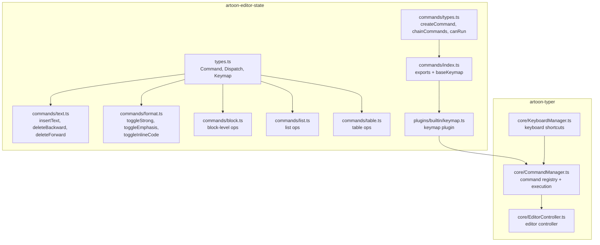
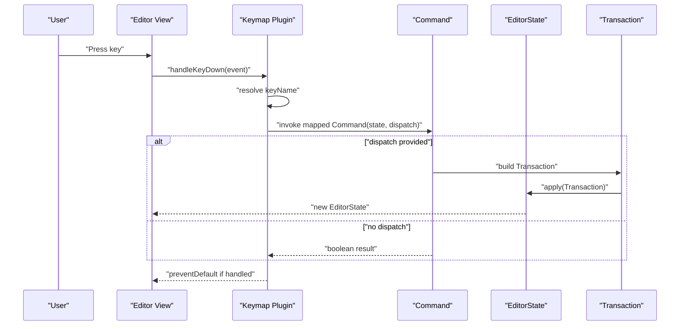
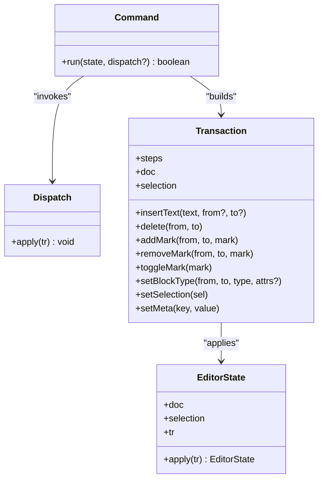
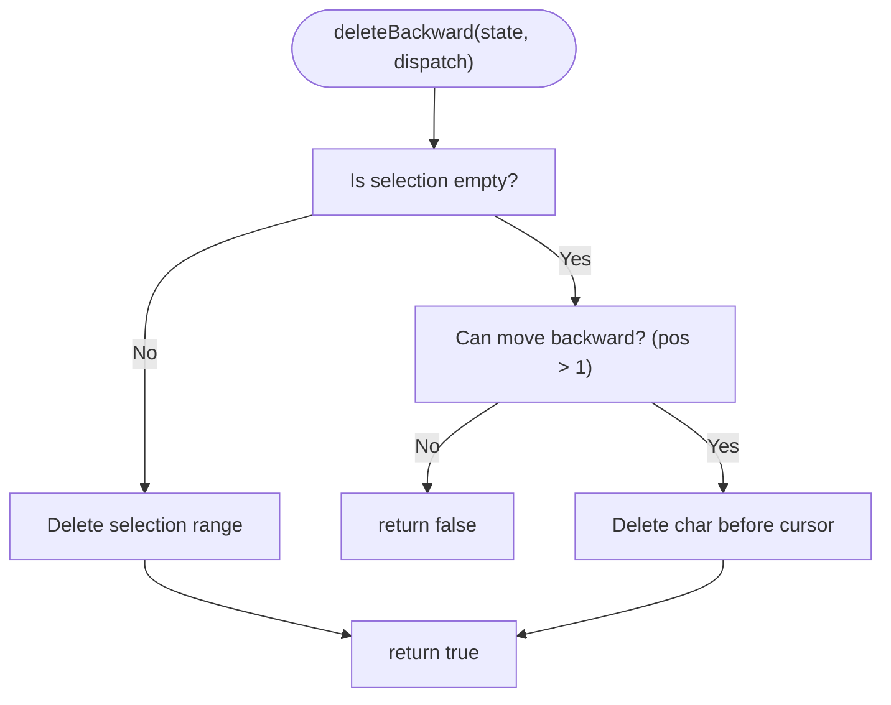
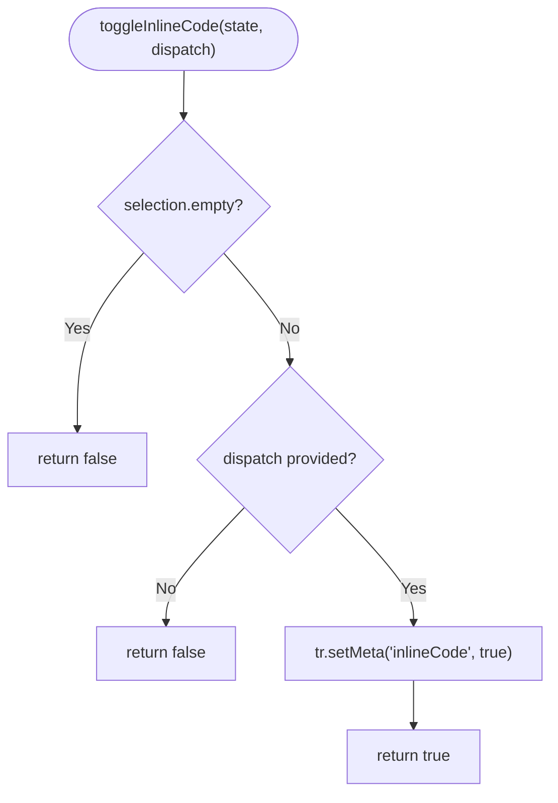
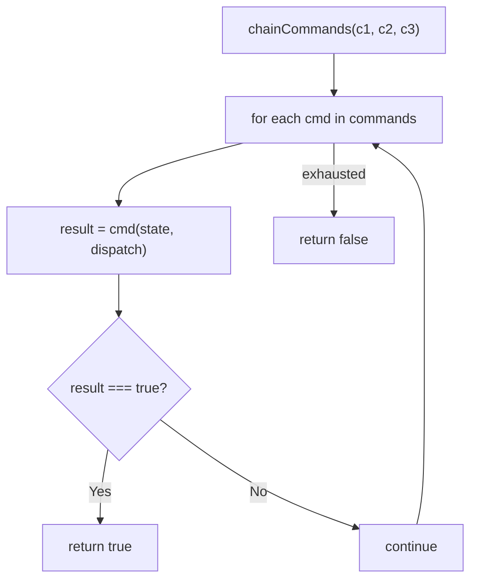
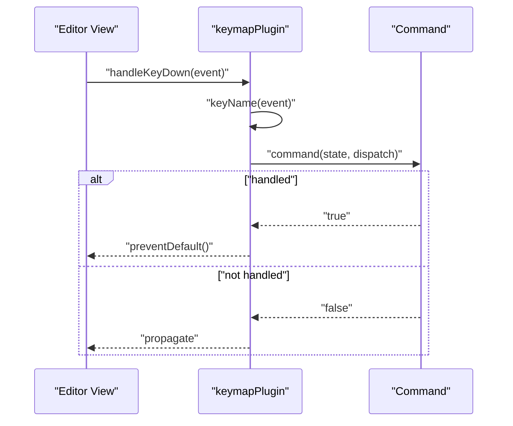
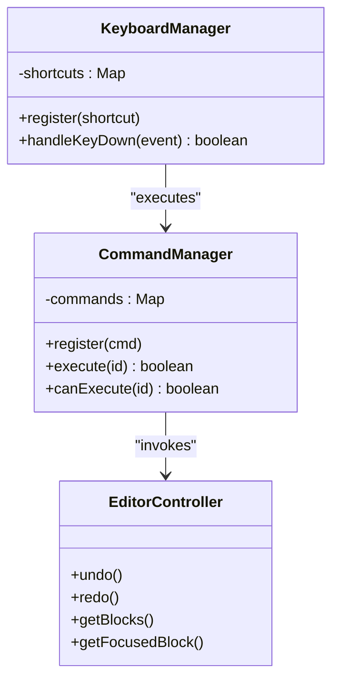
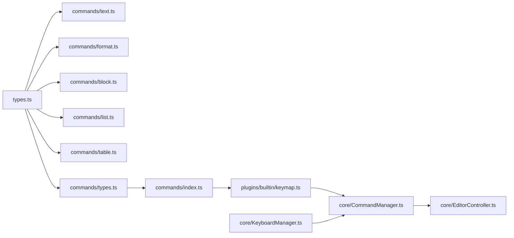

# Command System

<cite>
**Referenced Files in This Document**
- [types.ts](file://artoon-editor-state/src/types.ts)
- [text.ts](file://artoon-editor-state/src/commands/text.ts)
- [format.ts](file://artoon-editor-state/src/commands/format.ts)
- [block.ts](file://artoon-editor-state/src/commands/block.ts)
- [list.ts](file://artoon-editor-state/src/commands/list.ts)
- [table.ts](file://artoon-editor-state/src/commands/table.ts)
- [types.ts](file://artoon-editor-state/src/commands/types.ts)
- [index.ts](file://artoon-editor-state/src/commands/index.ts)
- [keymap.ts](file://artoon-editor-state/src/plugins/builtin/keymap.ts)
- [CommandManager.ts](file://artoon-typer/src/core/CommandManager.ts)
- [KeyboardManager.ts](file://artoon-typer/src/core/KeyboardManager.ts)
- [EditorController.ts](file://artoon-typer/src/core/EditorController.ts)
</cite>

## Table of Contents
1. [Introduction](#introduction)
2. [Project Structure](#project-structure)
3. [Core Components](#core-components)
4. [Architecture Overview](#architecture-overview)
5. [Detailed Component Analysis](#detailed-component-analysis)
6. [Dependency Analysis](#dependency-analysis)
7. [Performance Considerations](#performance-considerations)
8. [Troubleshooting Guide](#troubleshooting-guide)
9. [Conclusion](#conclusion)

## Introduction
This document explains the ARTOON Command System: the Command type, dispatch mechanism, and the command composition utilities. It covers text commands (insertText, deleteBackward, deleteForward), formatting commands (toggleStrong, toggleEmphasis, toggleInlineCode), and the keymap integration for keyboard shortcuts. It also provides guidance on implementing custom commands, chaining, conditional execution, validation, error handling, and performance optimization for command-heavy workflows.

## Project Structure
The command system spans two packages:
- artoon-editor-state: Core command definitions, types, and keymap plugin
- artoon-typer: UI integration via CommandManager and KeyboardManager

**Diagram sources**
- [types.ts:473-491](file://artoon-editor-state/src/types.ts#L473-L491)
- [text.ts:12-74](file://artoon-editor-state/src/commands/text.ts#L12-L74)
- [format.ts:10-76](file://artoon-editor-state/src/commands/format.ts#L10-L76)
- [block.ts:10-88](file://artoon-editor-state/src/commands/block.ts#L10-L88)
- [list.ts:10-50](file://artoon-editor-state/src/commands/list.ts#L10-L50)
- [table.ts:15-28](file://artoon-editor-state/src/commands/table.ts#L15-L28)
- [types.ts:37-68](file://artoon-editor-state/src/commands/types.ts#L37-L68)
- [index.ts:107-121](file://artoon-editor-state/src/commands/index.ts#L107-L121)
- [keymap.ts:23-55](file://artoon-editor-state/src/plugins/builtin/keymap.ts#L23-L55)
- [CommandManager.ts:16-140](file://artoon-typer/src/core/CommandManager.ts#L16-L140)
- [KeyboardManager.ts:65-425](file://artoon-typer/src/core/KeyboardManager.ts#L65-L425)
- [EditorController.ts:27-67](file://artoon-typer/src/core/EditorController.ts#L27-L67)

**Section sources**
- [types.ts:473-491](file://artoon-editor-state/src/types.ts#L473-L491)
- [index.ts:107-121](file://artoon-editor-state/src/commands/index.ts#L107-L121)
- [keymap.ts:23-55](file://artoon-editor-state/src/plugins/builtin/keymap.ts#L23-L55)
- [CommandManager.ts:16-140](file://artoon-typer/src/core/CommandManager.ts#L16-L140)
- [KeyboardManager.ts:65-425](file://artoon-typer/src/core/KeyboardManager.ts#L65-L425)
- [EditorController.ts:27-67](file://artoon-typer/src/core/EditorController.ts#L27-L67)

## Core Components
- Command type: A function that takes EditorState and an optional Dispatch, returning a boolean indicating whether the command can run.
- Dispatch: A function that applies a Transaction to the editor state.
- Keymap: A record mapping key combinations to Command functions.
- Command composition utilities:
  - createCommand: Wraps a Command with metadata (name, description, shortcut, icon).
  - chainCommands: Returns a Command that tries a sequence of commands until one succeeds.
  - canRun: Returns a predicate that evaluates command applicability without dispatching.

These utilities enable modular, composable, and discoverable command construction.

**Section sources**
- [types.ts:473-491](file://artoon-editor-state/src/types.ts#L473-L491)
- [types.ts:37-68](file://artoon-editor-state/src/commands/types.ts#L37-L68)

## Architecture Overview
The command pipeline integrates editor state commands with keyboard handling and UI command execution:

**Diagram sources**
- [keymap.ts:38-51](file://artoon-editor-state/src/plugins/builtin/keymap.ts#L38-L51)
- [types.ts:473-491](file://artoon-editor-state/src/types.ts#L473-L491)

## Detailed Component Analysis

### Command Type and Dispatch Mechanism
- Command signature: Receives EditorState and optionally Dispatch; returns boolean.
- Dispatch: Applies a Transaction to update EditorState immutably.
- Transactions encapsulate atomic changes (insert/delete/marks/node attrs) and are the unit of execution for commands.

**Diagram sources**
- [types.ts:473-491](file://artoon-editor-state/src/types.ts#L473-L491)
- [types.ts:291-337](file://artoon-editor-state/src/types.ts#L291-L337)
- [types.ts:441-462](file://artoon-editor-state/src/types.ts#L441-L462)

**Section sources**
- [types.ts:473-491](file://artoon-editor-state/src/types.ts#L473-L491)
- [types.ts:291-337](file://artoon-editor-state/src/types.ts#L291-L337)
- [types.ts:441-462](file://artoon-editor-state/src/types.ts#L441-L462)

### Text Commands
- insertText: Inserts text at selection.
- deleteBackward: Deletes selection or one character backward; supports word boundaries via helper.
- deleteForward: Deletes selection or one character forward.
- Additional helpers: deleteWordBackward, deleteWordForward, selectAll, insertLineBreak, insertParagraph, joinBackward, joinForward.

**Diagram sources**
- [text.ts:25-47](file://artoon-editor-state/src/commands/text.ts#L25-L47)

**Section sources**
- [text.ts:12-74](file://artoon-editor-state/src/commands/text.ts#L12-L74)
- [text.ts:79-122](file://artoon-editor-state/src/commands/text.ts#L79-L122)

### Formatting Commands
- toggleStrong, toggleEmphasis, toggleUnderline, toggleStrikethrough, toggleHighlight, toggleSubscript, toggleSuperscript.
- toggleInlineCode: Requires non-empty selection; sets metadata to mark inline code intent.
- Utility toggles: toggleMark, addMark, removeMark, clearMarks, isMarkActive.

**Diagram sources**
- [format.ts:60-76](file://artoon-editor-state/src/commands/format.ts#L60-L76)

**Section sources**
- [format.ts:10-76](file://artoon-editor-state/src/commands/format.ts#L10-L76)
- [format.ts:81-98](file://artoon-editor-state/src/commands/format.ts#L81-L98)
- [format.ts:103-138](file://artoon-editor-state/src/commands/format.ts#L103-L138)
- [format.ts:143-156](file://artoon-editor-state/src/commands/format.ts#L143-L156)

### Command Composition Utilities
- createCommand: Attaches metadata to a Command for discovery and UI rendering.
- chainCommands: Tries commands in order; returns true on first success.
- canRun: Returns a pure predicate to test applicability without side effects.

**Diagram sources**
- [types.ts:52-61](file://artoon-editor-state/src/commands/types.ts#L52-L61)

**Section sources**
- [types.ts:37-68](file://artoon-editor-state/src/commands/types.ts#L37-L68)

### Keymap Integration and Keyboard Shortcuts
- Keymap plugin maps normalized key names to Command functions and prevents default when handled.
- Base keymap aggregates textKeymap, formatKeymap, blockKeymap, listKeymap, tableKeymap.
- UI KeyboardManager defines shortcuts and contexts; many formatting shortcuts reuse format commands.

**Diagram sources**
- [keymap.ts:38-51](file://artoon-editor-state/src/plugins/builtin/keymap.ts#L38-L51)
- [index.ts:107-121](file://artoon-editor-state/src/commands/index.ts#L107-L121)

**Section sources**
- [keymap.ts:23-105](file://artoon-editor-state/src/plugins/builtin/keymap.ts#L23-L105)
- [index.ts:107-121](file://artoon-editor-state/src/commands/index.ts#L107-L121)
- [format.ts:177-184](file://artoon-editor-state/src/commands/format.ts#L177-L184)
- [text.ts:224-232](file://artoon-editor-state/src/commands/text.ts#L224-L232)
- [block.ts:276-286](file://artoon-editor-state/src/commands/block.ts#L276-L286)
- [list.ts:297-302](file://artoon-editor-state/src/commands/list.ts#L297-L302)
- [table.ts:358-361](file://artoon-editor-state/src/commands/table.ts#L358-L361)

### Implementing Custom Commands
- Define a Command using the Command signature.
- Use EditorState.tr to build transactions for state changes.
- Export the command and include it in baseKeymap or a custom keymap.
- Optionally wrap with createCommand to attach metadata.

Example patterns:
- Pure evaluation: use canRun to check applicability before UI updates.
- Chaining: compose multiple commands with chainCommands to support fallbacks.
- Conditional execution: gate commands on selection emptiness or node types.

**Section sources**
- [types.ts:473-491](file://artoon-editor-state/src/types.ts#L473-L491)
- [types.ts:37-68](file://artoon-editor-state/src/commands/types.ts#L37-L68)
- [index.ts:107-121](file://artoon-editor-state/src/commands/index.ts#L107-L121)

### Command Execution in UI
- CommandManager registers and executes commands, with safety checks and error logging.
- KeyboardManager binds keyboard shortcuts to commands and enforces context gating.
- EditorController coordinates block-level operations and maintains state for history.

**Diagram sources**
- [CommandManager.ts:16-140](file://artoon-typer/src/core/CommandManager.ts#L16-L140)
- [KeyboardManager.ts:65-425](file://artoon-typer/src/core/KeyboardManager.ts#L65-L425)
- [EditorController.ts:27-67](file://artoon-typer/src/core/EditorController.ts#L27-L67)

**Section sources**
- [CommandManager.ts:16-140](file://artoon-typer/src/core/CommandManager.ts#L16-L140)
- [KeyboardManager.ts:65-425](file://artoon-typer/src/core/KeyboardManager.ts#L65-L425)
- [EditorController.ts:27-67](file://artoon-typer/src/core/EditorController.ts#L27-L67)

## Dependency Analysis
- Commands depend on EditorState and Transaction abstractions.
- Keymap plugin depends on normalized key names and Command functions.
- UI managers depend on command registries and controller APIs.

**Diagram sources**
- [types.ts:473-491](file://artoon-editor-state/src/types.ts#L473-L491)
- [text.ts:12-74](file://artoon-editor-state/src/commands/text.ts#L12-L74)
- [format.ts:10-76](file://artoon-editor-state/src/commands/format.ts#L10-L76)
- [block.ts:10-88](file://artoon-editor-state/src/commands/block.ts#L10-L88)
- [list.ts:10-50](file://artoon-editor-state/src/commands/list.ts#L10-L50)
- [table.ts:15-28](file://artoon-editor-state/src/commands/table.ts#L15-L28)
- [types.ts:37-68](file://artoon-editor-state/src/commands/types.ts#L37-L68)
- [index.ts:107-121](file://artoon-editor-state/src/commands/index.ts#L107-L121)
- [keymap.ts:23-55](file://artoon-editor-state/src/plugins/builtin/keymap.ts#L23-L55)
- [CommandManager.ts:16-140](file://artoon-typer/src/core/CommandManager.ts#L16-L140)
- [KeyboardManager.ts:65-425](file://artoon-typer/src/core/KeyboardManager.ts#L65-L425)
- [EditorController.ts:27-67](file://artoon-typer/src/core/EditorController.ts#L27-L67)

**Section sources**
- [index.ts:107-121](file://artoon-editor-state/src/commands/index.ts#L107-L121)
- [keymap.ts:23-105](file://artoon-editor-state/src/plugins/builtin/keymap.ts#L23-L105)
- [CommandManager.ts:16-140](file://artoon-typer/src/core/CommandManager.ts#L16-L140)
- [KeyboardManager.ts:65-425](file://artoon-typer/src/core/KeyboardManager.ts#L65-L425)
- [EditorController.ts:27-67](file://artoon-typer/src/core/EditorController.ts#L27-L67)

## Performance Considerations
- Prefer minimal transaction building: batch operations when possible to reduce step count.
- Use canRun for early exits to avoid unnecessary work.
- Keep keymaps concise and avoid overlapping handlers that require expensive context checks.
- For heavy command sequences, consider debouncing or throttling UI updates.

## Troubleshooting Guide
- Command does not execute:
  - Verify the key combination resolves to the expected Command via keyName normalization.
  - Ensure the Command returns true when dispatch is provided; otherwise, the keymap will not prevent default.
- Selection-dependent commands fail:
  - Confirm selection emptiness and bounds before invoking commands like deleteBackward/deleteForward.
- Formatting commands appear unresponsive:
  - toggleInlineCode requires a non-empty selection; ensure selection is present.
- Error handling:
  - CommandManager wraps execution in try/catch and logs errors; inspect console for command-specific failures.

**Section sources**
- [keymap.ts:61-82](file://artoon-editor-state/src/plugins/builtin/keymap.ts#L61-L82)
- [text.ts:25-47](file://artoon-editor-state/src/commands/text.ts#L25-L47)
- [format.ts:60-76](file://artoon-editor-state/src/commands/format.ts#L60-L76)
- [CommandManager.ts:116-123](file://artoon-typer/src/core/CommandManager.ts#L116-L123)

## Conclusion
The ARTOON Command System provides a robust, composable foundation for editor actions. Commands are pure functions over EditorState, executed via Transactions, and orchestrated by a keymap plugin and UI managers. With createCommand, chainCommands, and canRun, developers can implement custom commands, chain them safely, and gate execution conditionally. Proper validation, error handling, and performance-aware design ensure reliable behavior in command-heavy workflows.