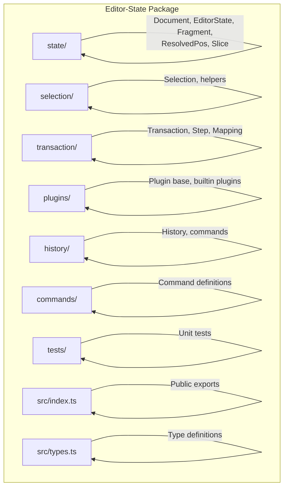
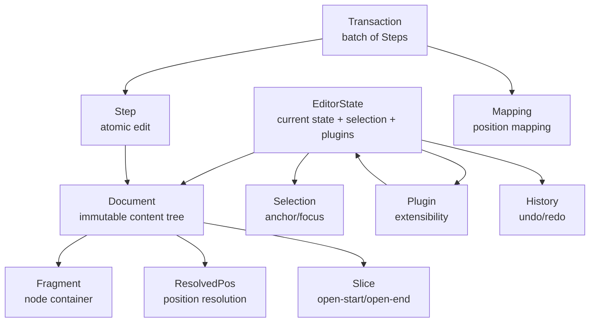
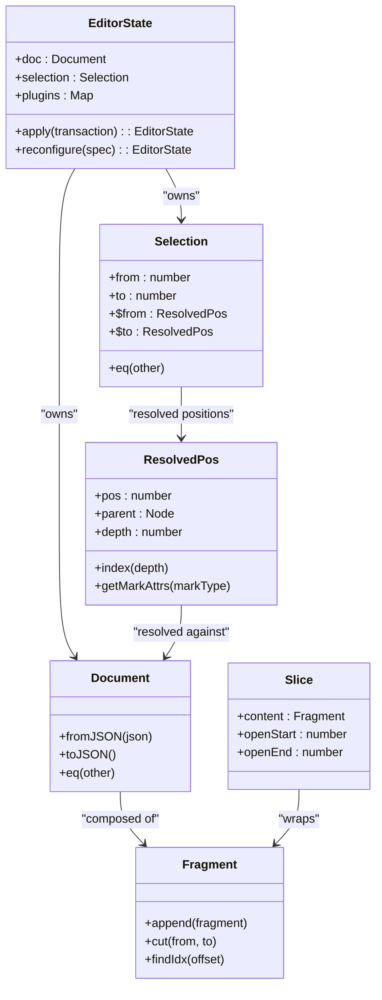
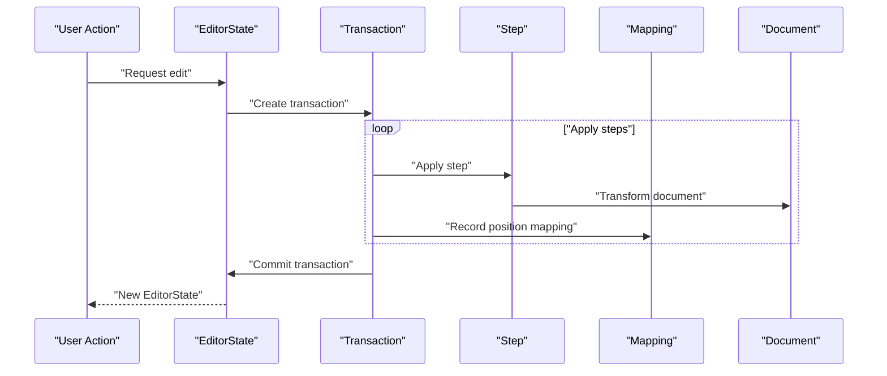
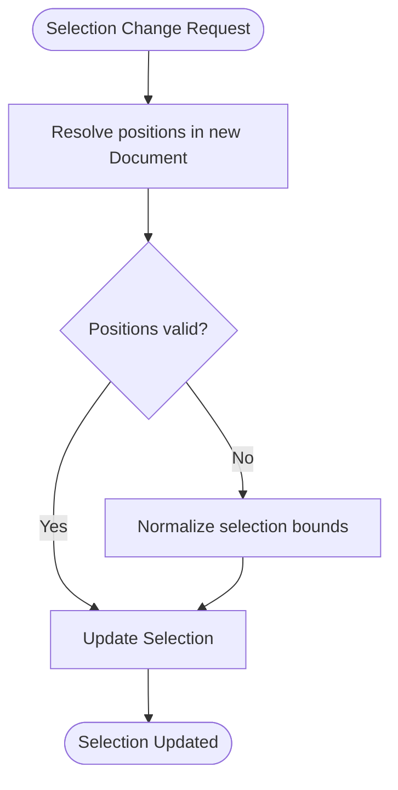
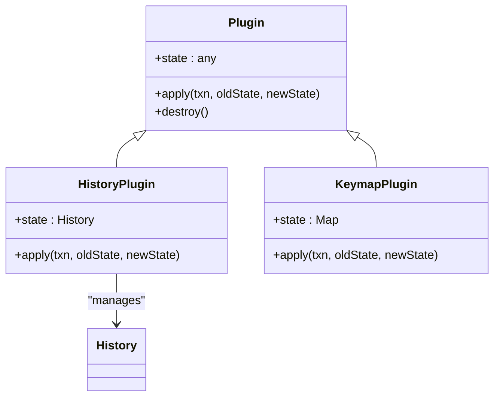
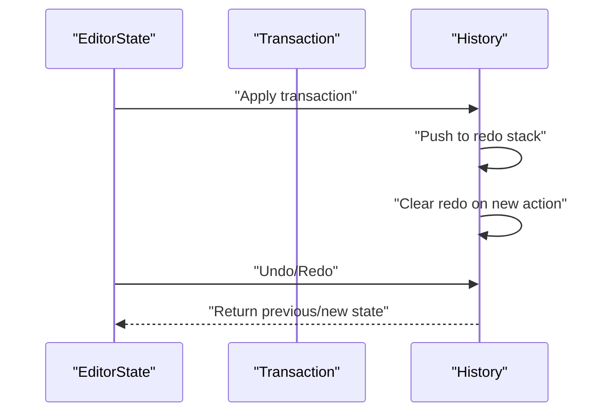
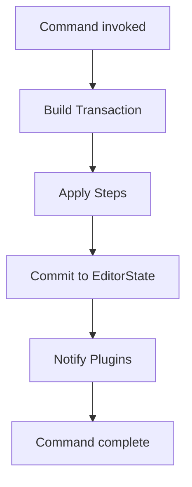
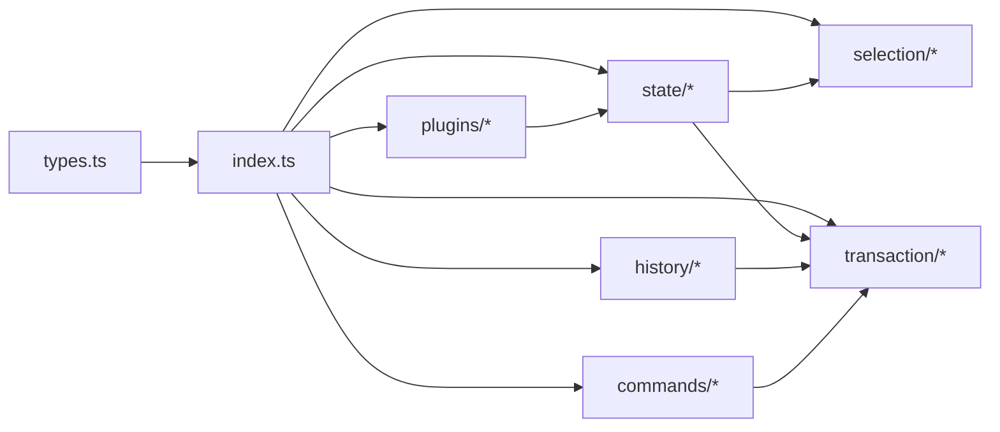

# Editor-State Package

<cite>
**Referenced Files in This Document**
- [README.md](file://artoon-editor-state/README.md)
- [index.ts](file://artoon-editor-state/src/index.ts)
- [types.ts](file://artoon-editor-state/src/types.ts)
- [Document.ts](file://artoon-editor-state/src/state/Document.ts)
- [EditorState.ts](file://artoon-editor-state/src/state/EditorState.ts)
- [Fragment.ts](file://artoon-editor-state/src/state/Fragment.ts)
- [ResolvedPos.ts](file://artoon-editor-state/src/state/ResolvedPos.ts)
- [Slice.ts](file://artoon-editor-state/src/state/Slice.ts)
- [Selection.ts](file://artoon-editor-state/src/selection/Selection.ts)
- [helpers.ts](file://artoon-editor-state/src/selection/helpers.ts)
- [Plugin.ts](file://artoon-editor-state/src/plugins/Plugin.ts)
- [History.ts](file://artoon-editor-state/src/history/History.ts)
- [Transaction.ts](file://artoon-editor-state/src/transaction/Transaction.ts)
- [Step.ts](file://artoon-editor-state/src/transaction/Step.ts)
- [Mapping.ts](file://artoon-editor-state/src/transaction/Mapping.ts)
- [commands.ts](file://artoon-editor-state/src/history/commands.ts)
- [keymap.ts](file://artoon-editor-state/src/plugins/builtin/keymap.ts)
- [history.ts](file://artoon-editor-state/src/plugins/builtin/history.ts)
- [Document.test.ts](file://artoon-editor-state/tests/state/Document.test.ts)
- [Fragment.test.ts](file://artoon-editor-state/tests/state/Fragment.test.ts)
</cite>

## Table of Contents
1. [Introduction](#introduction)
2. [Project Structure](#project-structure)
3. [Core Components](#core-components)
4. [Architecture Overview](#architecture-overview)
5. [Detailed Component Analysis](#detailed-component-analysis)
6. [Dependency Analysis](#dependency-analysis)
7. [Performance Considerations](#performance-considerations)
8. [Troubleshooting Guide](#troubleshooting-guide)
9. [Conclusion](#conclusion)
10. [Appendices](#appendices)

## Introduction
The Editor-State package provides the foundational state model and update mechanics for the ARTOON editor runtime. It defines the immutable document model, the mutable editor state, selection representation, and the transaction system that safely applies edits while maintaining history and mapping positions across changes. It also exposes a plugin architecture to extend editor capabilities and integrates with the broader ARTOON ecosystem via the Typer editor runtime and related packages.

## Project Structure
The package is organized by domain areas:
- state: Immutable document model and editor state
- selection: Selection model and helpers
- transaction: Steps, mapping, and transactions
- plugins: Plugin base and built-in plugins
- history: Undo/redo history and commands
- commands: Command definitions for editing operations
- tests: Unit tests for state and selection

**Diagram sources**
- [index.ts](file://artoon-editor-state/src/index.ts)
- [types.ts](file://artoon-editor-state/src/types.ts)

**Section sources**
- [README.md](file://artoon-editor-state/README.md)
- [index.ts](file://artoon-editor-state/src/index.ts)

## Core Components
This section introduces the primary building blocks of the editor state model and update pipeline.

- Document: Immutable representation of the editor’s content tree.
- EditorState: Mutable container holding the current Document, selection, and plugin state.
- Fragment: Lightweight node container used to compose parts of the document.
- ResolvedPos: Position resolver that provides contextual access to nodes and offsets within the document.
- Slice: A fragment of content with associated open-start/open-end markers for insertion semantics.
- Selection: Encapsulates the user’s selection state (text range, anchor/focus, etc.).
- Transaction: A batch of Steps applied atomically to produce a new EditorState.
- Step: An atomic operation that transforms the document.
- Mapping: Tracks position changes across Steps to keep selections and marks consistent.
- Plugin: Extensible mechanism to attach behavior to EditorState.
- History: Manages undo/redo stacks and integrates with the transaction system.

**Section sources**
- [Document.ts](file://artoon-editor-state/src/state/Document.ts)
- [EditorState.ts](file://artoon-editor-state/src/state/EditorState.ts)
- [Fragment.ts](file://artoon-editor-state/src/state/Fragment.ts)
- [ResolvedPos.ts](file://artoon-editor-state/src/state/ResolvedPos.ts)
- [Slice.ts](file://artoon-editor-state/src/state/Slice.ts)
- [Selection.ts](file://artoon-editor-state/src/selection/Selection.ts)
- [Transaction.ts](file://artoon-editor-state/src/transaction/Transaction.ts)
- [Step.ts](file://artoon-editor-state/src/transaction/Step.ts)
- [Mapping.ts](file://artoon-editor-state/src/transaction/Mapping.ts)
- [Plugin.ts](file://artoon-editor-state/src/plugins/Plugin.ts)
- [History.ts](file://artoon-editor-state/src/history/History.ts)

## Architecture Overview
The editor state architecture centers on immutability for the document and mutability for the editor state. Updates are expressed as Steps and applied via Transactions. Selections and positions are resolved against the current Document to remain accurate after transformations. Plugins can observe and modify state transitions.

**Diagram sources**
- [EditorState.ts](file://artoon-editor-state/src/state/EditorState.ts)
- [Document.ts](file://artoon-editor-state/src/state/Document.ts)
- [Selection.ts](file://artoon-editor-state/src/selection/Selection.ts)
- [Fragment.ts](file://artoon-editor-state/src/state/Fragment.ts)
- [ResolvedPos.ts](file://artoon-editor-state/src/state/ResolvedPos.ts)
- [Slice.ts](file://artoon-editor-state/src/state/Slice.ts)
- [Transaction.ts](file://artoon-editor-state/src/transaction/Transaction.ts)
- [Step.ts](file://artoon-editor-state/src/transaction/Step.ts)
- [Mapping.ts](file://artoon-editor-state/src/transaction/Mapping.ts)
- [Plugin.ts](file://artoon-editor-state/src/plugins/Plugin.ts)
- [History.ts](file://artoon-editor-state/src/history/History.ts)

## Detailed Component Analysis

### State Model
The state model defines how content and selection are represented and manipulated.

**Diagram sources**
- [Document.ts](file://artoon-editor-state/src/state/Document.ts)
- [EditorState.ts](file://artoon-editor-state/src/state/EditorState.ts)
- [Fragment.ts](file://artoon-editor-state/src/state/Fragment.ts)
- [ResolvedPos.ts](file://artoon-editor-state/src/state/ResolvedPos.ts)
- [Slice.ts](file://artoon-editor-state/src/state/Slice.ts)
- [Selection.ts](file://artoon-editor-state/src/selection/Selection.ts)

**Section sources**
- [Document.ts](file://artoon-editor-state/src/state/Document.ts)
- [EditorState.ts](file://artoon-editor-state/src/state/EditorState.ts)
- [Fragment.ts](file://artoon-editor-state/src/state/Fragment.ts)
- [ResolvedPos.ts](file://artoon-editor-state/src/state/ResolvedPos.ts)
- [Slice.ts](file://artoon-editor-state/src/state/Slice.ts)
- [Selection.ts](file://artoon-editor-state/src/selection/Selection.ts)

### Transaction System
Transactions apply a sequence of Steps atomically, using Mapping to track how positions change across edits.

**Diagram sources**
- [Transaction.ts](file://artoon-editor-state/src/transaction/Transaction.ts)
- [Step.ts](file://artoon-editor-state/src/transaction/Step.ts)
- [Mapping.ts](file://artoon-editor-state/src/transaction/Mapping.ts)
- [EditorState.ts](file://artoon-editor-state/src/state/EditorState.ts)
- [Document.ts](file://artoon-editor-state/src/state/Document.ts)

**Section sources**
- [Transaction.ts](file://artoon-editor-state/src/transaction/Transaction.ts)
- [Step.ts](file://artoon-editor-state/src/transaction/Step.ts)
- [Mapping.ts](file://artoon-editor-state/src/transaction/Mapping.ts)

### Selection Handling
Selections are resolved against the current document to maintain correctness after edits.

**Diagram sources**
- [Selection.ts](file://artoon-editor-state/src/selection/Selection.ts)
- [ResolvedPos.ts](file://artoon-editor-state/src/state/ResolvedPos.ts)
- [Document.ts](file://artoon-editor-state/src/state/Document.ts)

**Section sources**
- [Selection.ts](file://artoon-editor-state/src/selection/Selection.ts)
- [ResolvedPos.ts](file://artoon-editor-state/src/state/ResolvedPos.ts)

### Plugin Architecture
Plugins can observe and modify EditorState transitions. Built-in plugins demonstrate history and keymap behaviors.

**Diagram sources**
- [Plugin.ts](file://artoon-editor-state/src/plugins/Plugin.ts)
- [history.ts](file://artoon-editor-state/src/plugins/builtin/history.ts)
- [keymap.ts](file://artoon-editor-state/src/plugins/builtin/keymap.ts)
- [History.ts](file://artoon-editor-state/src/history/History.ts)

**Section sources**
- [Plugin.ts](file://artoon-editor-state/src/plugins/Plugin.ts)
- [history.ts](file://artoon-editor-state/src/plugins/builtin/history.ts)
- [keymap.ts](file://artoon-editor-state/src/plugins/builtin/keymap.ts)
- [History.ts](file://artoon-editor-state/src/history/History.ts)

### History Management
History maintains stacks of transactions for undo/redo and integrates with the transaction system.

**Diagram sources**
- [History.ts](file://artoon-editor-state/src/history/History.ts)
- [commands.ts](file://artoon-editor-state/src/history/commands.ts)
- [Transaction.ts](file://artoon-editor-state/src/transaction/Transaction.ts)

**Section sources**
- [History.ts](file://artoon-editor-state/src/history/History.ts)
- [commands.ts](file://artoon-editor-state/src/history/commands.ts)

### Commands and Editing Operations
Commands encapsulate editing actions and can be bound to keys or UI triggers.

**Diagram sources**
- [commands.ts](file://artoon-editor-state/src/history/commands.ts)
- [Transaction.ts](file://artoon-editor-state/src/transaction/Transaction.ts)
- [EditorState.ts](file://artoon-editor-state/src/state/EditorState.ts)

**Section sources**
- [commands.ts](file://artoon-editor-state/src/history/commands.ts)

## Dependency Analysis
The package exhibits clear separation of concerns:
- state depends on selection and transaction primitives
- transaction depends on mapping and step definitions
- plugins depend on EditorState lifecycle hooks
- history depends on transaction commit semantics
- public exports centralize re-exports for consumers

**Diagram sources**
- [index.ts](file://artoon-editor-state/src/index.ts)
- [types.ts](file://artoon-editor-state/src/types.ts)

**Section sources**
- [index.ts](file://artoon-editor-state/src/index.ts)
- [types.ts](file://artoon-editor-state/src/types.ts)

## Performance Considerations
- Prefer immutable Document operations and shallow copies where possible to minimize recomputation.
- Use Mapping to avoid recalculating positions after each Step; batch position updates when feasible.
- Keep plugin apply logic efficient; avoid heavy computations during state transitions.
- Normalize selection early to prevent repeated resolution work.
- Use Fragment composition carefully to avoid deep nesting that increases traversal cost.
- Limit transaction size to reduce mapping overhead and rollback complexity.

## Troubleshooting Guide
Common issues and remedies:
- Selection becomes invalid after edits: Ensure positions are resolved against the new Document and normalized.
- Mapping errors after complex edits: Verify each Step records correct mappings and that Mapping is updated consistently.
- Plugin conflicts: Isolate plugin apply logic and ensure idempotent behavior.
- History inconsistencies: Confirm transactions are committed in order and redo stack is cleared on new actions.
- Test coverage: Use existing unit tests as references for expected behavior and edge cases.

**Section sources**
- [Document.test.ts](file://artoon-editor-state/tests/state/Document.test.ts)
- [Fragment.test.ts](file://artoon-editor-state/tests/state/Fragment.test.ts)

## Conclusion
The Editor-State package establishes a robust, extensible foundation for ARTOON’s editor runtime. Its immutable document model, transactional update system, and plugin architecture enable safe, predictable editing experiences. By following the patterns documented here, developers can implement custom editing operations, integrate with the UI layer, and extend functionality without compromising state integrity.

## Appendices

### API Surface and Exports
Key exports provide a concise interface for consumers to construct and manipulate editor state.

**Section sources**
- [index.ts](file://artoon-editor-state/src/index.ts)
- [types.ts](file://artoon-editor-state/src/types.ts)