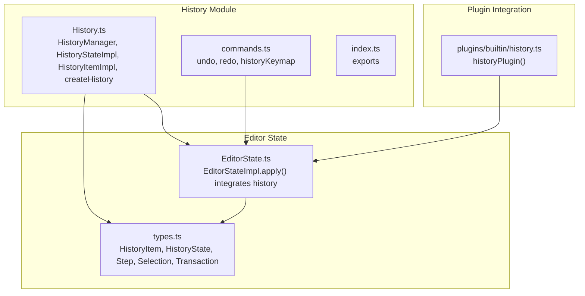
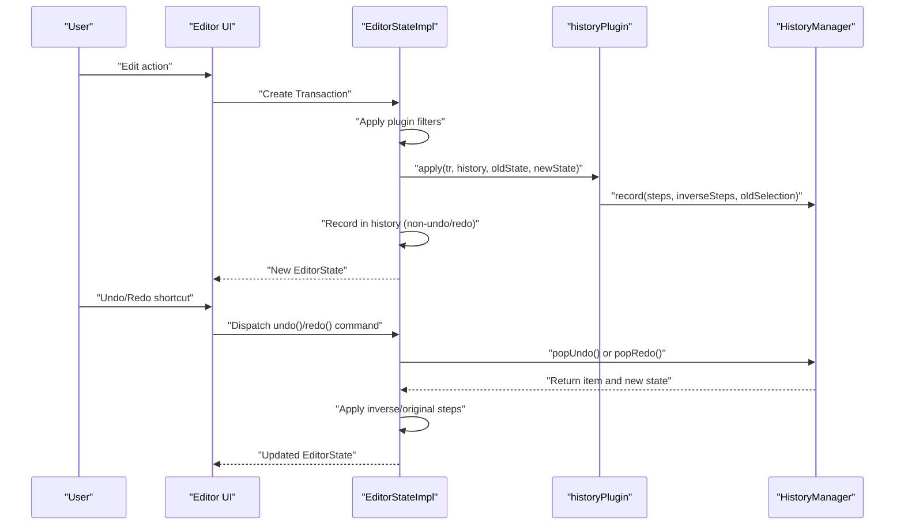
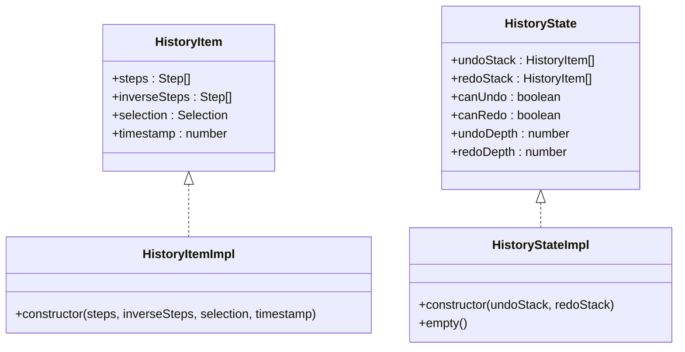
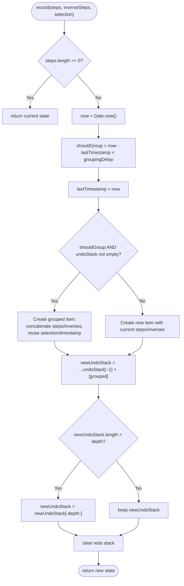
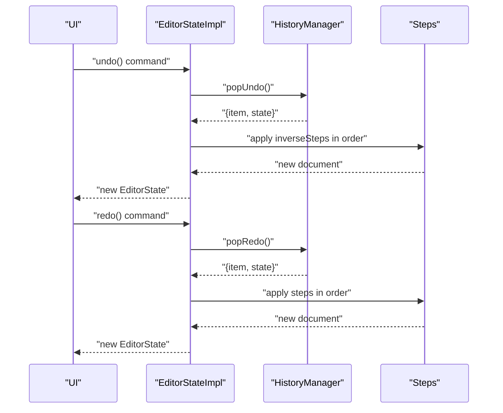
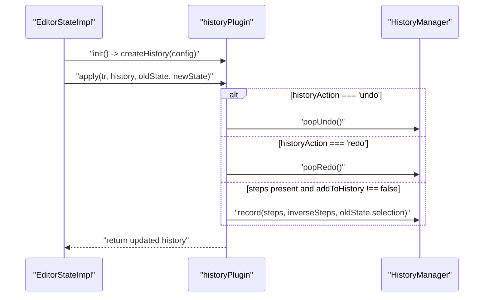
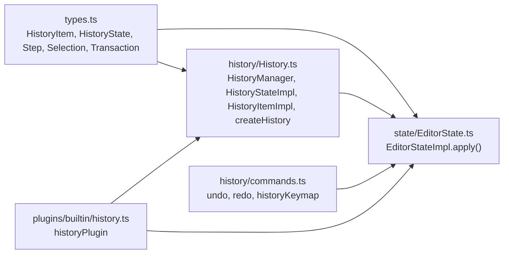

# History System

<cite>
**Referenced Files in This Document**
- [History.ts](file://artoon-editor-state/src/history/History.ts)
- [commands.ts](file://artoon-editor-state/src/history/commands.ts)
- [index.ts](file://artoon-editor-state/src/history/index.ts)
- [types.ts](file://artoon-editor-state/src/types.ts)
- [EditorState.ts](file://artoon-editor-state/src/state/EditorState.ts)
- [history.ts](file://artoon-editor-state/src/plugins/builtin/history.ts)
- [index.ts](file://artoon-editor-state/src/index.ts)
</cite>

## Table of Contents
1. [Introduction](#introduction)
2. [Project Structure](#project-structure)
3. [Core Components](#core-components)
4. [Architecture Overview](#architecture-overview)
5. [Detailed Component Analysis](#detailed-component-analysis)
6. [Dependency Analysis](#dependency-analysis)
7. [Performance Considerations](#performance-considerations)
8. [Troubleshooting Guide](#troubleshooting-guide)
9. [Conclusion](#conclusion)

## Introduction
This document explains the ARTOON History System responsible for undo/redo functionality. It covers the HistoryManager, HistoryState, and HistoryItem implementations, how transactions are recorded and grouped, and how undo/redo navigation works. It also documents the createHistory function and HistoryConfig options, and provides practical guidance for integrating undo/redo in editor applications, handling complex transactions, and managing history size limits. Finally, it addresses performance considerations for large documents and memory-efficient strategies.

## Project Structure
The History System resides in the artoon-editor-state package and integrates with the editor’s state machine and plugins. Key files:
- History implementation and configuration
- Commands for undo/redo and keymaps
- Plugin integration for automatic recording and navigation
- Types shared across the editor state system

**Diagram sources**
- [History.ts:1-205](file://artoon-editor-state/src/history/History.ts#L1-L205)
- [commands.ts:1-47](file://artoon-editor-state/src/history/commands.ts#L1-L47)
- [index.ts:1-15](file://artoon-editor-state/src/history/index.ts#L1-L15)
- [types.ts:340-373](file://artoon-editor-state/src/types.ts#L340-L373)
- [EditorState.ts:1-258](file://artoon-editor-state/src/state/EditorState.ts#L1-L258)
- [history.ts:1-58](file://artoon-editor-state/src/plugins/builtin/history.ts#L1-L58)

**Section sources**
- [History.ts:1-205](file://artoon-editor-state/src/history/History.ts#L1-L205)
- [commands.ts:1-47](file://artoon-editor-state/src/history/commands.ts#L1-L47)
- [index.ts:1-15](file://artoon-editor-state/src/history/index.ts#L1-L15)
- [types.ts:340-373](file://artoon-editor-state/src/types.ts#L340-L373)
- [EditorState.ts:1-258](file://artoon-editor-state/src/state/EditorState.ts#L1-L258)
- [history.ts:1-58](file://artoon-editor-state/src/plugins/builtin/history.ts#L1-L58)

## Core Components
- HistoryItem: Encapsulates a set of applied steps, their inverses for undo, the selection at the time, and a timestamp.
- HistoryState: Immutable container holding undo and redo stacks and exposing canUndo/canRedo/depth getters.
- HistoryManager: Records transactions, groups recent changes, enforces depth limits, and supports undo/redo navigation.
- createHistory: Factory to instantiate a HistoryManager with optional configuration.
- Commands: undo, redo commands and a keymap for keyboard shortcuts.
- Plugin integration: historyPlugin wires the manager into the editor lifecycle and records transactions automatically.

**Section sources**
- [History.ts:10-66](file://artoon-editor-state/src/history/History.ts#L10-L66)
- [History.ts:86-197](file://artoon-editor-state/src/history/History.ts#L86-L197)
- [History.ts:202-204](file://artoon-editor-state/src/history/History.ts#L202-L204)
- [commands.ts:10-37](file://artoon-editor-state/src/history/commands.ts#L10-L37)
- [commands.ts:42-46](file://artoon-editor-state/src/history/commands.ts#L42-L46)
- [history.ts:27-57](file://artoon-editor-state/src/plugins/builtin/history.ts#L27-L57)
- [types.ts:346-373](file://artoon-editor-state/src/types.ts#L346-L373)

## Architecture Overview
The History System participates in two complementary flows:
- Automatic recording via a plugin during normal editing
- Explicit navigation via commands that trigger undo/redo

**Diagram sources**
- [EditorState.ts:149-211](file://artoon-editor-state/src/state/EditorState.ts#L149-L211)
- [history.ts:36-53](file://artoon-editor-state/src/plugins/builtin/history.ts#L36-L53)
- [History.ts:106-148](file://artoon-editor-state/src/history/History.ts#L106-L148)
- [History.ts:153-180](file://artoon-editor-state/src/history/History.ts#L153-L180)
- [commands.ts:10-37](file://artoon-editor-state/src/history/commands.ts#L10-L37)

## Detailed Component Analysis

### HistoryItem and HistoryState
- HistoryItemImpl stores:
  - steps: the steps applied to reach this state
  - inverseSteps: steps to reverse the change (inverted and reversed order)
  - selection: the selection at the time of the change
  - timestamp: creation time for grouping decisions
- HistoryStateImpl exposes:
  - undoStack and redoStack arrays
  - canUndo/canRedo booleans
  - undoDepth/redoDepth numbers
  - empty factory method

**Diagram sources**
- [History.ts:10-66](file://artoon-editor-state/src/history/History.ts#L10-L66)
- [types.ts:346-373](file://artoon-editor-state/src/types.ts#L346-L373)

**Section sources**
- [History.ts:10-66](file://artoon-editor-state/src/history/History.ts#L10-L66)
- [types.ts:346-373](file://artoon-editor-state/src/types.ts#L346-L373)

### HistoryManager
Responsibilities:
- Configuration: depth (maximum undo items) and groupingDelay (milliseconds to group recent changes)
- Recording: transforms a Transaction’s steps into a HistoryItem, computes inverseSteps, and decides grouping vs. new item
- Navigation: popUndo and popRedo move items between stacks and update state
- Lifecycle: clear and breakGroup utilities

Key behaviors:
- Grouping: Recent changes within groupingDelay are merged into the last item by concatenating steps and inverses, preserving the original selection and timestamp
- Depth trimming: undoStack is sliced to keep at most depth items
- Redo clearing: new changes invalidate redo stack
- Inversion: inverseSteps are computed by inverting each step against the document it was applied to and reversing the order

**Diagram sources**
- [History.ts:106-148](file://artoon-editor-state/src/history/History.ts#L106-L148)

**Section sources**
- [History.ts:86-197](file://artoon-editor-state/src/history/History.ts#L86-L197)

### Commands and Keymap
- undo: checks canUndo, sets transaction metadata to signal undo, and returns true/false
- redo: checks canRedo, sets transaction metadata to signal redo, and returns true/false
- historyKeymap: binds undo/redo to platform-appropriate keyboard shortcuts

These commands integrate with EditorState.apply to execute navigation by applying inverse steps for undo or original steps for redo.

**Diagram sources**
- [commands.ts:10-37](file://artoon-editor-state/src/history/commands.ts#L10-L37)
- [EditorState.ts:164-200](file://artoon-editor-state/src/state/EditorState.ts#L164-L200)
- [History.ts:153-180](file://artoon-editor-state/src/history/History.ts#L153-L180)

**Section sources**
- [commands.ts:10-37](file://artoon-editor-state/src/history/commands.ts#L10-L37)
- [EditorState.ts:164-200](file://artoon-editor-state/src/state/EditorState.ts#L164-L200)

### Plugin Integration (historyPlugin)
- Initializes a HistoryManager with optional depth and groupingDelay
- During apply:
  - On undo/redo metadata, invokes popUndo/popRedo
  - On regular transactions, computes inverseSteps and records them with the old selection
- Exposes historyPluginKey for retrieving the manager from EditorState

**Diagram sources**
- [history.ts:27-57](file://artoon-editor-state/src/plugins/builtin/history.ts#L27-L57)
- [History.ts:106-148](file://artoon-editor-state/src/history/History.ts#L106-L148)

**Section sources**
- [history.ts:1-58](file://artoon-editor-state/src/plugins/builtin/history.ts#L1-L58)

### Types and Interfaces
- HistoryItem and HistoryState define the contract for history entries and state
- Step and Transaction define atomic document changes and multi-step operations
- Selection defines the editor selection model used to capture state snapshots

These types are used across the HistoryManager, EditorState, and plugin integration.

**Section sources**
- [types.ts:346-373](file://artoon-editor-state/src/types.ts#L346-L373)
- [types.ts:228-337](file://artoon-editor-state/src/types.ts#L228-L337)
- [types.ts:82-112](file://artoon-editor-state/src/types.ts#L82-L112)

## Dependency Analysis
The History System depends on:
- Step and Selection types for state snapshots and inversion
- Transaction metadata to coordinate undo/redo actions
- Plugin infrastructure to hook into EditorState lifecycle

**Diagram sources**
- [types.ts:346-373](file://artoon-editor-state/src/types.ts#L346-L373)
- [History.ts:5-204](file://artoon-editor-state/src/history/History.ts#L5-L204)
- [commands.ts:1-47](file://artoon-editor-state/src/history/commands.ts#L1-L47)
- [history.ts:1-58](file://artoon-editor-state/src/plugins/builtin/history.ts#L1-L58)
- [EditorState.ts:1-258](file://artoon-editor-state/src/state/EditorState.ts#L1-L258)

**Section sources**
- [types.ts:346-373](file://artoon-editor-state/src/types.ts#L346-L373)
- [History.ts:5-204](file://artoon-editor-state/src/history/History.ts#L5-L204)
- [commands.ts:1-47](file://artoon-editor-state/src/history/commands.ts#L1-L47)
- [history.ts:1-58](file://artoon-editor-state/src/plugins/builtin/history.ts#L1-L58)
- [EditorState.ts:1-258](file://artoon-editor-state/src/state/EditorState.ts#L1-L258)

## Performance Considerations
- Memory footprint
  - Each HistoryItem holds steps, inverseSteps, a selection, and a timestamp. For large documents, steps can be substantial.
  - Limit history depth via HistoryConfig.depth to cap memory growth.
- Grouping behavior
  - Grouping recent changes reduces item count but increases per-item step counts. Tune groupingDelay to balance responsiveness and memory.
- Inversion cost
  - Computing inverseSteps requires inverting each step against the document it was applied to. This can be expensive for complex transactions.
- Large document edits
  - Prefer coarse-grained transactions where possible to reduce the number of items recorded.
- Selection snapshots
  - Selection is captured per item. While lightweight, avoid unnecessary frequent captures by relying on grouping.
- Practical tips
  - Use addToHistory metadata to skip recording trivial or transient changes.
  - Periodically clear history with clear() when appropriate (e.g., after save operations).
  - Consider breaking groups with breakGroup() to segment long editing sessions.

[No sources needed since this section provides general guidance]

## Troubleshooting Guide
Common issues and remedies:
- Undo/Redo does nothing
  - Verify canUndo/canRedo checks in commands and ensure transactions have steps and are not marked to skip history.
  - Confirm historyPlugin is attached and its apply handler runs.
- Redo becomes available unexpectedly
  - New operations clear the redo stack. Ensure you are not inadvertently triggering new transactions.
- History grows too large
  - Adjust HistoryConfig.depth to a smaller value or enable groupingDelay to merge frequent changes.
- Inverse steps mismatch
  - Ensure steps implement invert correctly and are applied against the correct document instances referenced by Transaction.docs.
- Selection not restored
  - Selection is captured at the time of the change. If selection changes between recording and undo/redo, the restored selection reflects the recorded state.

**Section sources**
- [commands.ts:10-37](file://artoon-editor-state/src/history/commands.ts#L10-L37)
- [history.ts:36-53](file://artoon-editor-state/src/plugins/builtin/history.ts#L36-L53)
- [History.ts:106-148](file://artoon-editor-state/src/history/History.ts#L106-L148)
- [EditorState.ts:164-200](file://artoon-editor-state/src/state/EditorState.ts#L164-L200)

## Conclusion
The ARTOON History System provides a robust, extensible foundation for undo/redo. Its HistoryManager efficiently records and navigates through state changes, grouping recent edits and enforcing configurable depth limits. Through commands and a dedicated plugin, it integrates seamlessly with the editor’s state machine, enabling reliable navigation while maintaining performance and memory efficiency. By tuning HistoryConfig and leveraging addToHistory metadata, developers can tailor the system to diverse editing scenarios, from simple text edits to complex document transformations.