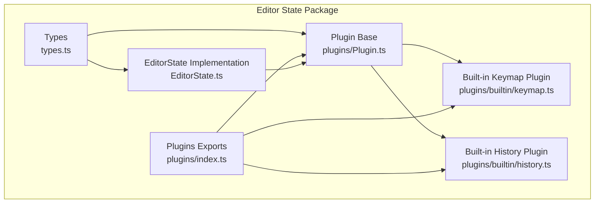
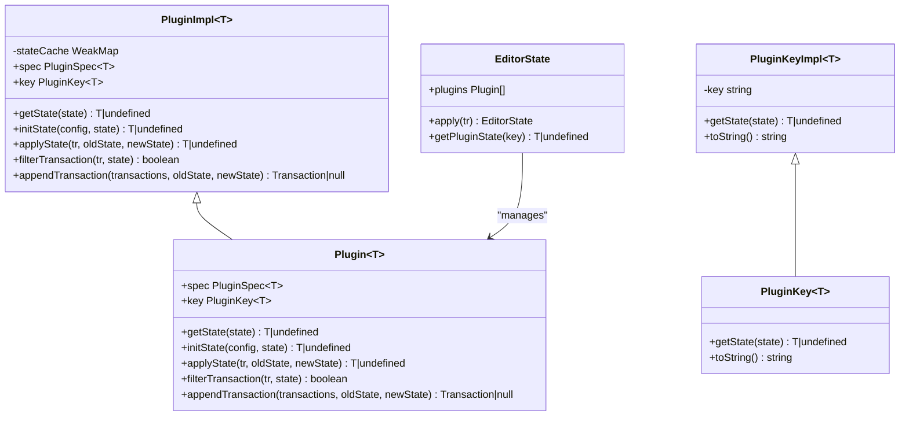
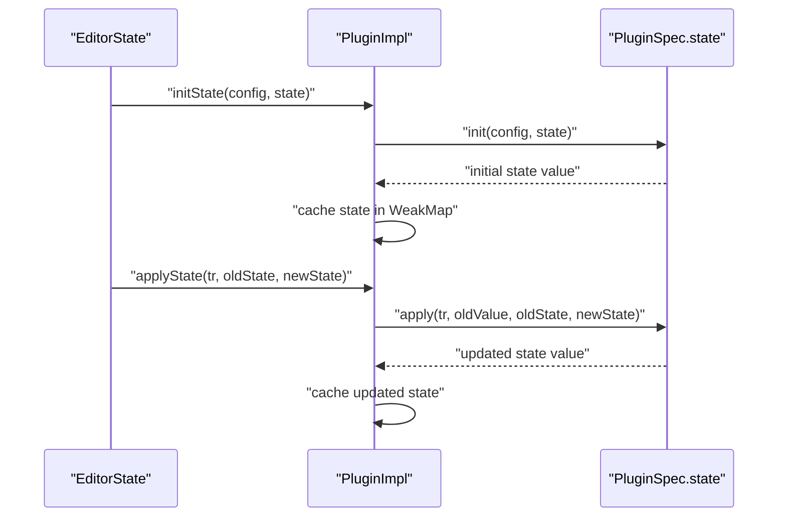
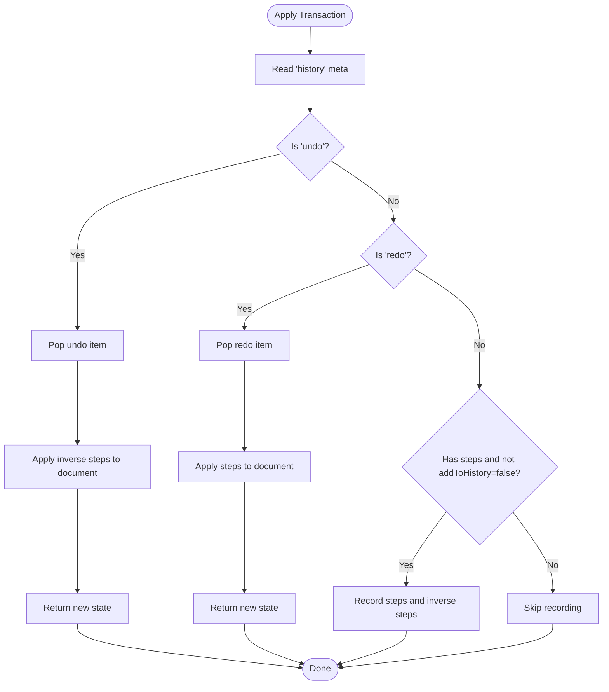
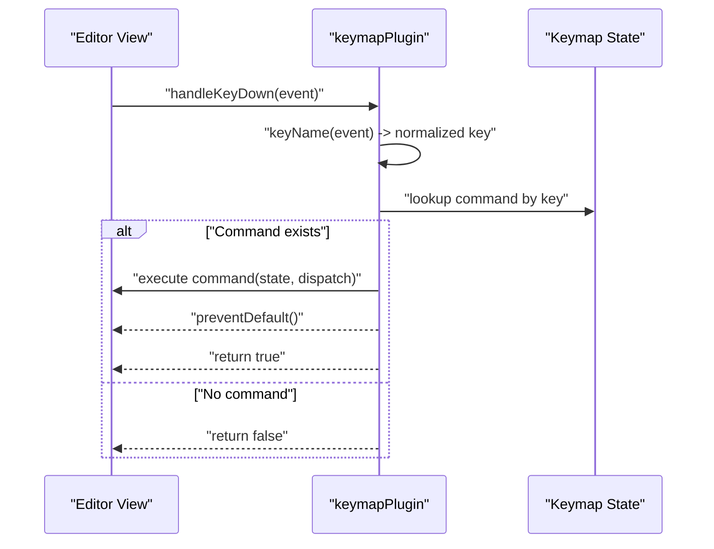
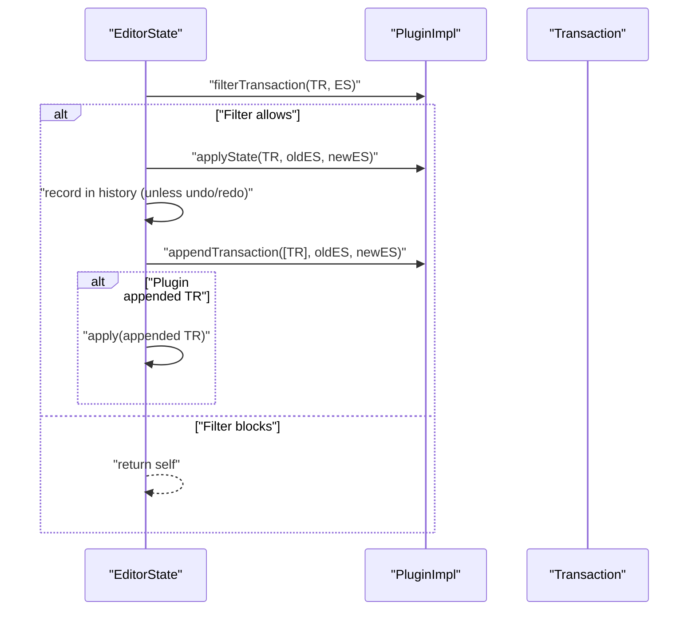
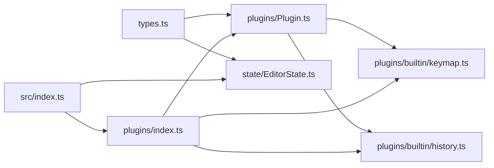

# Plugin Architecture

<cite>
**Referenced Files in This Document**
- [Plugin.ts](file://artoon-editor-state/src/plugins/Plugin.ts)
- [index.ts](file://artoon-editor-state/src/plugins/index.ts)
- [keymap.ts](file://artoon-editor-state/src/plugins/builtin/keymap.ts)
- [history.ts](file://artoon-editor-state/src/plugins/builtin/history.ts)
- [types.ts](file://artoon-editor-state/src/types.ts)
- [EditorState.ts](file://artoon-editor-state/src/state/EditorState.ts)
- [index.ts](file://artoon-editor-state/src/index.ts)
</cite>

## Table of Contents
1. [Introduction](#introduction)
2. [Project Structure](#project-structure)
3. [Core Components](#core-components)
4. [Architecture Overview](#architecture-overview)
5. [Detailed Component Analysis](#detailed-component-analysis)
6. [Dependency Analysis](#dependency-analysis)
7. [Performance Considerations](#performance-considerations)
8. [Troubleshooting Guide](#troubleshooting-guide)
9. [Conclusion](#conclusion)
10. [Appendices](#appendices)

## Introduction
This document explains the ARTOON Plugin Architecture, focusing on the Plugin base class and PluginKey system that enable extensibility in the editor state. It covers built-in plugins (historyPlugin and keymapPlugin), their configuration and usage, plugin lifecycle (initialization and teardown), and how plugins integrate with the editor state. It also provides guidance on creating custom plugins, managing plugin interactions and state, resolving conflicts, and optimizing performance in plugin-heavy configurations.

## Project Structure
The plugin system resides in the editor state package and is composed of:
- A generic Plugin base class and PluginKey system
- Built-in plugins (history and keymap)
- Type definitions for plugins and editor state
- EditorState integration that initializes, applies, and manages plugin state

**Diagram sources**
- [types.ts:376-462](file://artoon-editor-state/src/types.ts#L376-L462)
- [EditorState.ts:26-258](file://artoon-editor-state/src/state/EditorState.ts#L26-L258)
- [index.ts:1-8](file://artoon-editor-state/src/plugins/index.ts#L1-L8)
- [Plugin.ts:10-119](file://artoon-editor-state/src/plugins/Plugin.ts#L10-L119)
- [keymap.ts:1-106](file://artoon-editor-state/src/plugins/builtin/keymap.ts#L1-L106)
- [history.ts:1-59](file://artoon-editor-state/src/plugins/builtin/history.ts#L1-L59)

**Section sources**
- [index.ts:1-8](file://artoon-editor-state/src/plugins/index.ts#L1-L8)
- [types.ts:376-462](file://artoon-editor-state/src/types.ts#L376-L462)

## Core Components
- Plugin base class and key system
  - Provides a typed PluginKey and Plugin implementation with state caching and lifecycle hooks.
  - Supports transaction filtering, appending, and state initialization/apply.
- Built-in plugins
  - historyPlugin: Adds undo/redo capabilities with configurable depth and grouping delay.
  - keymapPlugin: Handles keyboard shortcuts by mapping key combinations to commands.

Key responsibilities:
- PluginKey: Unique identity for accessing plugin state from EditorState.
- PluginImpl: Manages plugin state per EditorState, caches state, and integrates with transactions.
- EditorState: Initializes plugin states during creation, applies plugin state updates, and supports plugin transaction filtering/appending.

**Section sources**
- [Plugin.ts:10-119](file://artoon-editor-state/src/plugins/Plugin.ts#L10-L119)
- [types.ts:382-420](file://artoon-editor-state/src/types.ts#L382-L420)
- [EditorState.ts:49-96](file://artoon-editor-state/src/state/EditorState.ts#L49-L96)
- [EditorState.ts:116-211](file://artoon-editor-state/src/state/EditorState.ts#L116-L211)

## Architecture Overview
The plugin architecture follows a layered design:
- Types define the contracts for plugins, editor state, transactions, and commands.
- PluginImpl encapsulates plugin behavior and state.
- EditorState orchestrates plugin initialization and updates during transaction application.
- Built-in plugins demonstrate practical extensions (keyboard handling and history).

**Diagram sources**
- [Plugin.ts:34-105](file://artoon-editor-state/src/plugins/Plugin.ts#L34-L105)
- [Plugin.ts:10-29](file://artoon-editor-state/src/plugins/Plugin.ts#L10-L29)
- [types.ts:382-420](file://artoon-editor-state/src/types.ts#L382-L420)
- [EditorState.ts:26-258](file://artoon-editor-state/src/state/EditorState.ts#L26-L258)

## Detailed Component Analysis

### Plugin Base Class and PluginKey System
- PluginKeyImpl
  - Generates a unique key string and retrieves plugin state from EditorState by iterating active plugins.
- PluginImpl
  - Stores PluginSpec and optional key; maintains a WeakMap cache of plugin state per EditorState.
  - Provides:
    - getState(state): fetch cached state for a given EditorState.
    - initState(config, state): initialize state via spec.state.init and cache it.
    - applyState(tr, oldState, newState): update state via spec.state.apply and cache the new value.
    - filterTransaction(tr, state): delegate to spec.filterTransaction if provided.
    - appendTransaction(transactions, oldState, newState): delegate to spec.appendTransaction if provided.

**Diagram sources**
- [Plugin.ts:54-80](file://artoon-editor-state/src/plugins/Plugin.ts#L54-L80)
- [EditorState.ts:89-94](file://artoon-editor-state/src/state/EditorState.ts#L89-L94)
- [EditorState.ts:142-147](file://artoon-editor-state/src/state/EditorState.ts#L142-L147)

**Section sources**
- [Plugin.ts:10-29](file://artoon-editor-state/src/plugins/Plugin.ts#L10-L29)
- [Plugin.ts:34-105](file://artoon-editor-state/src/plugins/Plugin.ts#L34-L105)
- [EditorState.ts:89-94](file://artoon-editor-state/src/state/EditorState.ts#L89-L94)
- [EditorState.ts:142-147](file://artoon-editor-state/src/state/EditorState.ts#L142-L147)

### Built-in Plugins

#### historyPlugin
- Purpose: Provides undo/redo history with configurable depth and grouping delay.
- Configuration:
  - depth: Maximum undo/redo entries.
  - groupingDelay: Time window (ms) to group related changes.
- Behavior:
  - Initializes a HistoryManager via spec.state.init.
  - Applies history updates on transactions:
    - Processes explicit history actions ("undo", "redo").
    - Records new changes unless explicitly excluded by metadata.
  - Integrates with EditorState history for global undo/redo.

**Diagram sources**
- [history.ts:27-58](file://artoon-editor-state/src/plugins/builtin/history.ts#L27-L58)
- [EditorState.ts:149-161](file://artoon-editor-state/src/state/EditorState.ts#L149-L161)

**Section sources**
- [history.ts:17-58](file://artoon-editor-state/src/plugins/builtin/history.ts#L17-L58)
- [EditorState.ts:149-161](file://artoon-editor-state/src/state/EditorState.ts#L149-L161)

#### keymapPlugin
- Purpose: Handles keyboard shortcuts by mapping key combinations to commands.
- Key combination normalization:
  - Builds a normalized key string from modifiers (Ctrl, Alt, Shift, Meta) and the pressed key.
  - Normalizes space and lowercase single-character keys.
- Behavior:
  - Initializes plugin state with the provided keymap.
  - Intercepts keydown events via props.handleKeyDown and executes the mapped command if found.
  - Prevents default browser behavior when a command handles the key.

**Diagram sources**
- [keymap.ts:23-56](file://artoon-editor-state/src/plugins/builtin/keymap.ts#L23-L56)
- [keymap.ts:61-82](file://artoon-editor-state/src/plugins/builtin/keymap.ts#L61-L82)

**Section sources**
- [keymap.ts:11-56](file://artoon-editor-state/src/plugins/builtin/keymap.ts#L11-L56)
- [keymap.ts:61-82](file://artoon-editor-state/src/plugins/builtin/keymap.ts#L61-L82)

### Plugin Lifecycle, Initialization, and Teardown
- Initialization
  - During EditorState.create, each plugin’s initState is called with the initial config and state.
  - Plugin state values are cached and stored in a Map keyed by the plugin’s key.
- Transaction Application
  - EditorState.apply runs plugins through three stages:
    1) Transaction filtering via filterTransaction.
    2) Applying plugin state updates via applyState.
    3) Optional transaction appending via appendTransaction.
  - After applying plugin updates, EditorState records the transaction in global history unless it is an undo/redo action.
- Teardown
  - There is no explicit teardown method in the current design. Plugin state is held in a WeakMap keyed by EditorState instances, so memory is reclaimed when states are garbage collected.

**Diagram sources**
- [EditorState.ts:116-211](file://artoon-editor-state/src/state/EditorState.ts#L116-L211)
- [Plugin.ts:85-104](file://artoon-editor-state/src/plugins/Plugin.ts#L85-L104)

**Section sources**
- [EditorState.ts:49-96](file://artoon-editor-state/src/state/EditorState.ts#L49-L96)
- [EditorState.ts:116-211](file://artoon-editor-state/src/state/EditorState.ts#L116-L211)
- [Plugin.ts:54-80](file://artoon-editor-state/src/plugins/Plugin.ts#L54-L80)

### Creating Custom Plugins
Guidelines:
- Define a PluginSpec with:
  - key: optional PluginKey (default is a generated PluginKeyImpl).
  - state: init and apply functions to manage persistent state per EditorState.
  - filterTransaction: optional predicate to block or modify transactions.
  - appendTransaction: optional callback to inject additional transactions.
  - props: optional view handlers (e.g., handleKeyDown).
- Instantiate with createPlugin(spec) or directly with new PluginImpl(spec).
- Access plugin state via EditorState.getPluginState(key) or PluginKeyImpl.getState(state).

Integration tips:
- Use PluginKeyImpl to uniquely identify your plugin state.
- Keep state immutable and return new values from apply to maintain consistency.
- Avoid heavy synchronous work inside filterTransaction and applyState to preserve responsiveness.

**Section sources**
- [Plugin.ts:110-119](file://artoon-editor-state/src/plugins/Plugin.ts#L110-L119)
- [types.ts:390-408](file://artoon-editor-state/src/types.ts#L390-L408)
- [EditorState.ts:216-218](file://artoon-editor-state/src/state/EditorState.ts#L216-L218)

### Managing Plugin Interactions and State
- Ordering
  - Plugins are processed in the order they appear in EditorState.plugins.
  - Transaction filtering occurs first; then state updates; finally appended transactions.
- Conflict Resolution
  - For keymaps, combineKeymaps merges multiple keymaps and chains conflicting bindings to preserve behavior.
  - For transactions, earlier plugins can prevent later ones from seeing filtered transactions.
- State Access
  - Retrieve plugin state using the plugin’s key from EditorState.getPluginState or PluginKeyImpl.getState.

**Section sources**
- [EditorState.ts:118-119](file://artoon-editor-state/src/state/EditorState.ts#L118-L119)
- [EditorState.ts:142-147](file://artoon-editor-state/src/state/EditorState.ts#L142-L147)
- [keymap.ts:87-105](file://artoon-editor-state/src/plugins/builtin/keymap.ts#L87-L105)

### Integration with Editor State
- Registration
  - Pass an array of Plugin instances in EditorStateConfig.plugins when creating the editor state.
- Accessors
  - EditorState exposes getPluginState(key) to retrieve plugin-managed state.
- Transaction Hooks
  - Plugins can intercept and augment transactions to implement behaviors like keyboard handling or history management.

**Section sources**
- [types.ts:429-436](file://artoon-editor-state/src/types.ts#L429-L436)
- [EditorState.ts:49-96](file://artoon-editor-state/src/state/EditorState.ts#L49-L96)
- [EditorState.ts:216-218](file://artoon-editor-state/src/state/EditorState.ts#L216-L218)

## Dependency Analysis
- Internal dependencies
  - types.ts defines contracts used by Plugin.ts, EditorState.ts, and built-in plugins.
  - EditorState.ts depends on PluginImpl and HistoryManager to orchestrate plugin lifecycle.
  - Built-in plugins depend on PluginImpl and PluginKeyImpl.
- Export surface
  - plugins/index.ts re-exports PluginImpl, PluginKeyImpl, and built-in plugins for external consumption.
  - src/index.ts re-exports plugin-related APIs for library users.

**Diagram sources**
- [types.ts:376-462](file://artoon-editor-state/src/types.ts#L376-L462)
- [Plugin.ts:10-119](file://artoon-editor-state/src/plugins/Plugin.ts#L10-L119)
- [EditorState.ts:26-258](file://artoon-editor-state/src/state/EditorState.ts#L26-L258)
- [index.ts:1-8](file://artoon-editor-state/src/plugins/index.ts#L1-L8)
- [index.ts:183-185](file://artoon-editor-state/src/index.ts#L183-L185)

**Section sources**
- [index.ts:1-8](file://artoon-editor-state/src/plugins/index.ts#L1-L8)
- [index.ts:183-185](file://artoon-editor-state/src/index.ts#L183-L185)

## Performance Considerations
- State caching
  - PluginImpl uses a WeakMap to cache state per EditorState, minimizing recomputation and avoiding unnecessary allocations.
- Transaction filtering
  - Prefer lightweight filters in filterTransaction to avoid blocking legitimate transactions.
- History management
  - Configure depth and groupingDelay appropriately to balance memory usage and usability.
- Event handling
  - Keep keymap handlers fast; avoid heavy work inside handleKeyDown to prevent UI jank.
- Plugin ordering
  - Place heavier plugins later in the pipeline to reduce repeated work on filtered transactions.

[No sources needed since this section provides general guidance]

## Troubleshooting Guide
Common issues and resolutions:
- Plugin state not updating
  - Ensure applyState returns a new state value when changed; EditorState only caches returned values.
- Keymap not responding
  - Verify key combination normalization and that the key exists in the keymap.
  - Confirm handleKeyDown is attached via props and that the event is not prematurely prevented elsewhere.
- Undo/redo not working
  - Check that historyPlugin is registered and that transactions are not marked to skip history recording.
- Conflicting keymaps
  - Use combineKeymaps to chain commands and preserve behavior of multiple keymaps.

**Section sources**
- [Plugin.ts:74-76](file://artoon-editor-state/src/plugins/Plugin.ts#L74-L76)
- [keymap.ts:38-51](file://artoon-editor-state/src/plugins/builtin/keymap.ts#L38-L51)
- [history.ts:37-50](file://artoon-editor-state/src/plugins/builtin/history.ts#L37-L50)
- [keymap.ts:87-105](file://artoon-editor-state/src/plugins/builtin/keymap.ts#L87-L105)

## Conclusion
The ARTOON Plugin Architecture provides a robust, extensible foundation for editor functionality. The Plugin base class and PluginKey system offer predictable state management and integration with EditorState. Built-in plugins (history and keymap) illustrate core patterns for transaction filtering, state updates, and event handling. By following the guidelines here—careful state management, judicious plugin ordering, and conflict resolution—you can build reliable, performant custom plugins that integrate seamlessly with the editor.

[No sources needed since this section summarizes without analyzing specific files]

## Appendices

### API Reference Summary
- PluginKey
  - Methods: getState(state), toString()
- Plugin
  - Properties: spec, key
  - Methods: getState(state), initState(config, state), applyState(tr, oldState, newState), filterTransaction(tr, state), appendTransaction(transactions, oldState, newState)
- EditorState
  - Methods: create(config), apply(tr), getPluginState(key), reconfigure(config)
- Built-in Plugins
  - historyPlugin(config): returns PluginImpl<HistoryManager>
  - keymapPlugin(keymap): returns PluginImpl<{ keymap: Keymap }>
  - combineKeymaps(...keymaps): merges keymaps with chaining for conflicts

**Section sources**
- [types.ts:382-420](file://artoon-editor-state/src/types.ts#L382-L420)
- [EditorState.ts:49-96](file://artoon-editor-state/src/state/EditorState.ts#L49-L96)
- [EditorState.ts:116-211](file://artoon-editor-state/src/state/EditorState.ts#L116-L211)
- [history.ts:27-58](file://artoon-editor-state/src/plugins/builtin/history.ts#L27-L58)
- [keymap.ts:23-56](file://artoon-editor-state/src/plugins/builtin/keymap.ts#L23-L56)
- [keymap.ts:87-105](file://artoon-editor-state/src/plugins/builtin/keymap.ts#L87-L105)