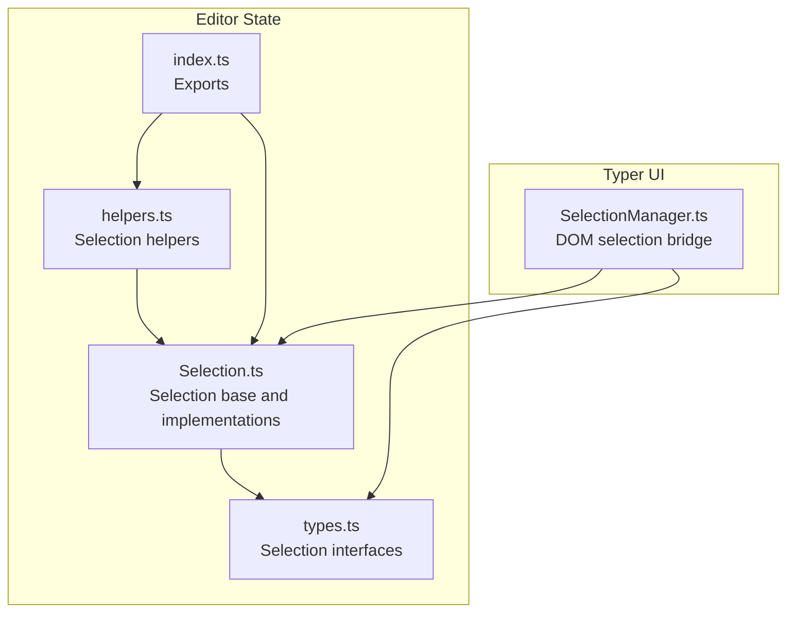
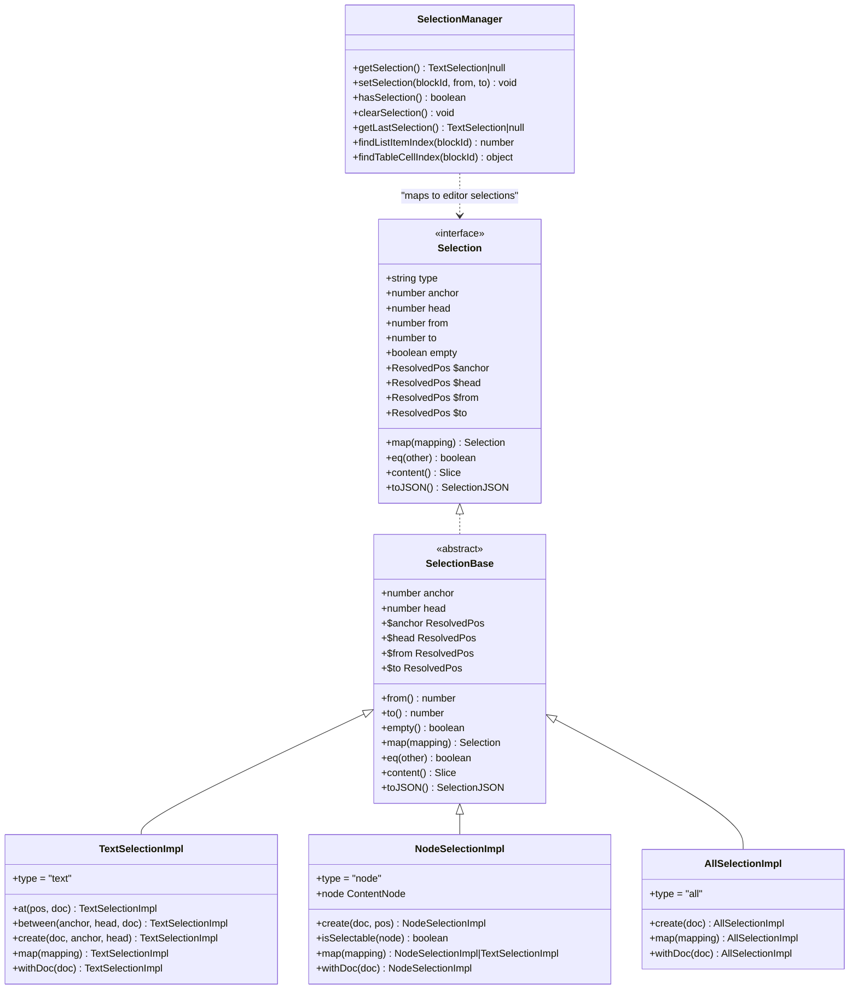
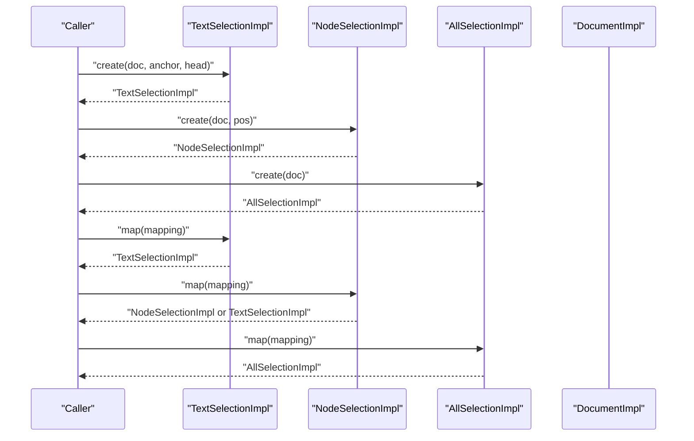
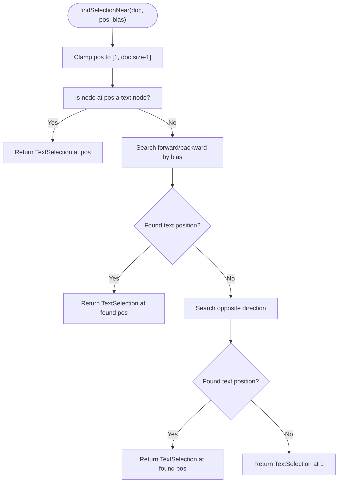
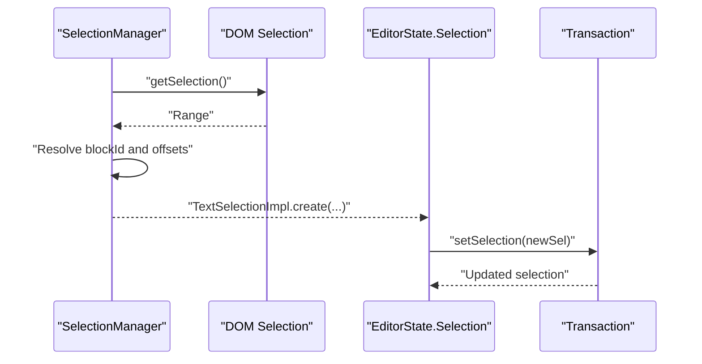
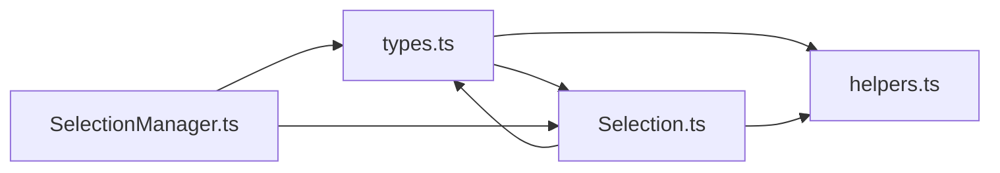

# Selection Management

<cite>
**Referenced Files in This Document**
- [Selection.ts](file://artoon-editor-state/src/selection/Selection.ts)
- [helpers.ts](file://artoon-editor-state/src/selection/helpers.ts)
- [index.ts](file://artoon-editor-state/src/selection/index.ts)
- [types.ts](file://artoon-editor-state/src/types.ts)
- [SelectionManager.ts](file://artoon-typer/src/core/SelectionManager.ts)
- [rtl-ltr.test.ts](file://artoon-typer/tests/e2e/rtl-ltr.test.ts)
</cite>

## Table of Contents
1. [Introduction](#introduction)
2. [Project Structure](#project-structure)
3. [Core Components](#core-components)
4. [Architecture Overview](#architecture-overview)
5. [Detailed Component Analysis](#detailed-component-analysis)
6. [Dependency Analysis](#dependency-analysis)
7. [Performance Considerations](#performance-considerations)
8. [Troubleshooting Guide](#troubleshooting-guide)
9. [Conclusion](#conclusion)

## Introduction
This document describes the ARTOON Selection Management system. It explains the Selection base class and its implementations (TextSelection, NodeSelection, AllSelection), selection creation and manipulation methods, and helper utilities for finding and positioning selections. It also covers integration with user interactions via the Selection Manager and addresses RTL/LTR direction handling and edge cases.

## Project Structure
The selection system is implemented in the editor state package and integrated with the UI layer for user interactions.

**Diagram sources**
- [Selection.ts:1-248](file://artoon-editor-state/src/selection/Selection.ts#L1-L248)
- [helpers.ts:1-169](file://artoon-editor-state/src/selection/helpers.ts#L1-L169)
- [index.ts:1-20](file://artoon-editor-state/src/selection/index.ts#L1-L20)
- [types.ts:75-142](file://artoon-editor-state/src/types.ts#L75-L142)
- [SelectionManager.ts:1-322](file://artoon-typer/src/core/SelectionManager.ts#L1-L322)

**Section sources**
- [Selection.ts:1-248](file://artoon-editor-state/src/selection/Selection.ts#L1-L248)
- [helpers.ts:1-169](file://artoon-editor-state/src/selection/helpers.ts#L1-L169)
- [index.ts:1-20](file://artoon-editor-state/src/selection/index.ts#L1-L20)
- [types.ts:75-142](file://artoon-editor-state/src/types.ts#L75-L142)
- [SelectionManager.ts:1-322](file://artoon-typer/src/core/SelectionManager.ts#L1-L322)

## Core Components
- Selection base class and implementations:
  - TextSelectionImpl: cursor or text range
  - NodeSelectionImpl: entire selectable node
  - AllSelectionImpl: entire document
- Helper functions for selection creation and positioning:
  - findSelectionNear, findSelectionAtStart, findSelectionAtEnd, findSelectionIn
  - atBlockBoundary, selectionDepth
- Exported factory and helpers for external use

Key capabilities:
- Creation: constructors and static factories for each selection type
- Mapping: map through document changes preserving semantics
- Querying: resolved positions, bounds, emptiness, content extraction
- Serialization: convert to/from JSON

**Section sources**
- [Selection.ts:24-92](file://artoon-editor-state/src/selection/Selection.ts#L24-L92)
- [Selection.ts:97-141](file://artoon-editor-state/src/selection/Selection.ts#L97-L141)
- [Selection.ts:146-198](file://artoon-editor-state/src/selection/Selection.ts#L146-L198)
- [Selection.ts:203-228](file://artoon-editor-state/src/selection/Selection.ts#L203-L228)
- [Selection.ts:233-247](file://artoon-editor-state/src/selection/Selection.ts#L233-L247)
- [helpers.ts:14-48](file://artoon-editor-state/src/selection/helpers.ts#L14-L48)
- [helpers.ts:53-62](file://artoon-editor-state/src/selection/helpers.ts#L53-L62)
- [helpers.ts:67-85](file://artoon-editor-state/src/selection/helpers.ts#L67-L85)
- [helpers.ts:131-145](file://artoon-editor-state/src/selection/helpers.ts#L131-L145)
- [helpers.ts:150-168](file://artoon-editor-state/src/selection/helpers.ts#L150-L168)
- [index.ts:5-19](file://artoon-editor-state/src/selection/index.ts#L5-L19)

## Architecture Overview
The selection model is framework-agnostic and integrates with the editor state. The UI layer bridges DOM selections to editor selections.

**Diagram sources**
- [types.ts:82-112](file://artoon-editor-state/src/types.ts#L82-L112)
- [Selection.ts:24-92](file://artoon-editor-state/src/selection/Selection.ts#L24-L92)
- [Selection.ts:97-141](file://artoon-editor-state/src/selection/Selection.ts#L97-L141)
- [Selection.ts:146-198](file://artoon-editor-state/src/selection/Selection.ts#L146-L198)
- [Selection.ts:203-228](file://artoon-editor-state/src/selection/Selection.ts#L203-L228)
- [SelectionManager.ts:15-322](file://artoon-typer/src/core/SelectionManager.ts#L15-L322)

## Detailed Component Analysis

### Selection Base and Implementations
- SelectionBase encapsulates shared behavior: anchor/head positions, computed from/to, resolved positions ($from/$to), equality, content extraction, and JSON serialization. It requires subclasses to implement mapping semantics.
- TextSelectionImpl represents a cursor or text range. It exposes convenience factories for creating selections at a position, between positions, or from resolved positions. It maps positions through edits and supports updating the document reference.
- NodeSelectionImpl selects an entire node. It validates that a node exists at the given position, computes the end position from node size, and determines selectability by node type. Mapping handles deletions by falling back to a text selection at the mapped position.
- AllSelectionImpl selects the entire document and maps trivially to a new AllSelection over the updated document.

**Diagram sources**
- [Selection.ts:107-141](file://artoon-editor-state/src/selection/Selection.ts#L107-L141)
- [Selection.ts:166-198](file://artoon-editor-state/src/selection/Selection.ts#L166-L198)
- [Selection.ts:213-228](file://artoon-editor-state/src/selection/Selection.ts#L213-L228)

**Section sources**
- [Selection.ts:24-92](file://artoon-editor-state/src/selection/Selection.ts#L24-L92)
- [Selection.ts:97-141](file://artoon-editor-state/src/selection/Selection.ts#L97-L141)
- [Selection.ts:146-198](file://artoon-editor-state/src/selection/Selection.ts#L146-L198)
- [Selection.ts:203-228](file://artoon-editor-state/src/selection/Selection.ts#L203-L228)

### Selection Helpers
- findSelectionNear: Clamps a position, checks if it is inside a text node, searches forward/backward with bias, then opposite direction, and falls back to the document start if needed.
- findSelectionAtStart/findSelectionAtEnd: Convenience wrappers around findSelectionNear.
- findSelectionIn: Given a node and position, returns a text selection at the start/end (based on bias) for text nodes or a node selection for selectable nodes; returns null otherwise.
- atBlockBoundary: Checks whether a position is at a block boundary in a given direction by inspecting resolved positions’ adjacent nodes.
- selectionDepth: Computes the depth at which two positions diverge by walking up the resolved position hierarchy.

**Diagram sources**
- [helpers.ts:14-48](file://artoon-editor-state/src/selection/helpers.ts#L14-L48)

**Section sources**
- [helpers.ts:14-48](file://artoon-editor-state/src/selection/helpers.ts#L14-L48)
- [helpers.ts:53-62](file://artoon-editor-state/src/selection/helpers.ts#L53-L62)
- [helpers.ts:67-85](file://artoon-editor-state/src/selection/helpers.ts#L67-L85)
- [helpers.ts:131-145](file://artoon-editor-state/src/selection/helpers.ts#L131-L145)
- [helpers.ts:150-168](file://artoon-editor-state/src/selection/helpers.ts#L150-L168)

### Programmatic Selection Control and Integration
- Programmatic control: Use TextSelectionImpl factories to create cursors or ranges, then map selections through document changes using map. After applying transactions, update internal document references with withDoc.
- Selection-based command execution: Commands receive EditorState and can set a new selection via Transaction.setSelection. This ensures subsequent operations operate on the intended range.
- UI integration: SelectionManager bridges DOM selections to editor selections. It extracts a TextSelection-like object from window.getSelection, resolves block boundaries, and supports setting selections programmatically within a block.

**Diagram sources**
- [SelectionManager.ts:21-64](file://artoon-typer/src/core/SelectionManager.ts#L21-L64)
- [Selection.ts:121-127](file://artoon-editor-state/src/selection/Selection.ts#L121-L127)

**Section sources**
- [Selection.ts:121-141](file://artoon-editor-state/src/selection/Selection.ts#L121-L141)
- [SelectionManager.ts:21-64](file://artoon-typer/src/core/SelectionManager.ts#L21-L64)

### RTL/LTR Direction Handling and Edge Cases
- Direction detection and defaults: The Typer layer detects direction from input markers and applies defaults per block type. Tests confirm RTL as default for most blocks and LTR for code blocks.
- Mixed-direction documents: The system preserves direction markers when importing/exporting and maintains direction within structured blocks (lists, tables).
- Selection edge cases:
  - Node deletion during mapping: NodeSelectionImpl maps to a TextSelection at the mapped position when the node is deleted.
  - Empty selections: SelectionBase.empty is derived from from/to equality.
  - Boundary conditions: atBlockBoundary checks adjacent nodes to determine boundaries; selectionDepth helps compute divergence depth for nested structures.

**Section sources**
- [rtl-ltr.test.ts:14-66](file://artoon-typer/tests/e2e/rtl-ltr.test.ts#L14-L66)
- [rtl-ltr.test.ts:126-146](file://artoon-typer/tests/e2e/rtl-ltr.test.ts#L126-L146)
- [Selection.ts:180-190](file://artoon-editor-state/src/selection/Selection.ts#L180-L190)
- [helpers.ts:131-145](file://artoon-editor-state/src/selection/helpers.ts#L131-L145)
- [helpers.ts:150-168](file://artoon-editor-state/src/selection/helpers.ts#L150-L168)

## Dependency Analysis
- Selection depends on DocumentImpl for node lookup, resolved positions, and slicing content.
- Helpers depend on Selection implementations and DocumentImpl’s nodeAt and resolve.
- SelectionManager depends on DOM APIs and maps DOM ranges to editor selections.

**Diagram sources**
- [types.ts:75-142](file://artoon-editor-state/src/types.ts#L75-L142)
- [Selection.ts:5-19](file://artoon-editor-state/src/selection/Selection.ts#L5-L19)
- [helpers.ts:5-9](file://artoon-editor-state/src/selection/helpers.ts#L5-L9)
- [SelectionManager.ts:1-6](file://artoon-typer/src/core/SelectionManager.ts#L1-L6)

**Section sources**
- [types.ts:75-142](file://artoon-editor-state/src/types.ts#L75-L142)
- [Selection.ts:5-19](file://artoon-editor-state/src/selection/Selection.ts#L5-L19)
- [helpers.ts:5-9](file://artoon-editor-state/src/selection/helpers.ts#L5-L9)
- [SelectionManager.ts:1-6](file://artoon-typer/src/core/SelectionManager.ts#L1-L6)

## Performance Considerations
- SelectionBase caches resolved positions to avoid repeated resolution work.
- Mapping operations are O(1) per selection; node selection mapping may fall back to text selection when nodes are deleted.
- Helpers traverse nodes linearly; worst-case O(n) in document size for forward/backward searches.

## Troubleshooting Guide
- Node not found at position: NodeSelectionImpl throws when no node exists at the given position; ensure the position corresponds to a valid node boundary.
- Mapping deletes a node: NodeSelectionImpl.map returns a TextSelection at the mapped position; verify your mapping includes deletion handling.
- Selection near invalid positions: findSelectionNear clamps to valid bounds and falls back to the document start; ensure positions are within [1, doc.size-1].
- Boundary queries: atBlockBoundary relies on resolved positions; ensure the document is resolved at the queried positions.
- Direction mismatches: Verify direction markers and defaults align with expectations; tests demonstrate precedence of markers over defaults.

**Section sources**
- [Selection.ts:150-155](file://artoon-editor-state/src/selection/Selection.ts#L150-L155)
- [Selection.ts:180-190](file://artoon-editor-state/src/selection/Selection.ts#L180-L190)
- [helpers.ts:19-20](file://artoon-editor-state/src/selection/helpers.ts#L19-L20)
- [helpers.ts:136-144](file://artoon-editor-state/src/selection/helpers.ts#L136-L144)
- [rtl-ltr.test.ts:14-27](file://artoon-typer/tests/e2e/rtl-ltr.test.ts#L14-L27)

## Conclusion
The ARTOON Selection Management system provides a robust, framework-agnostic model for text, node, and document-wide selections. It offers safe creation, mapping through edits, and helpful utilities for finding and positioning selections. Integration with the UI layer enables seamless programmatic control and user-driven interactions, while RTL/LTR direction handling is consistently supported across the pipeline.