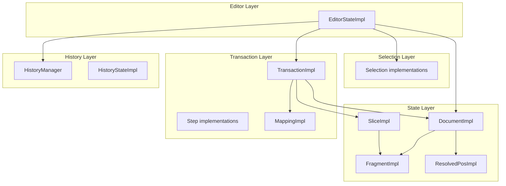
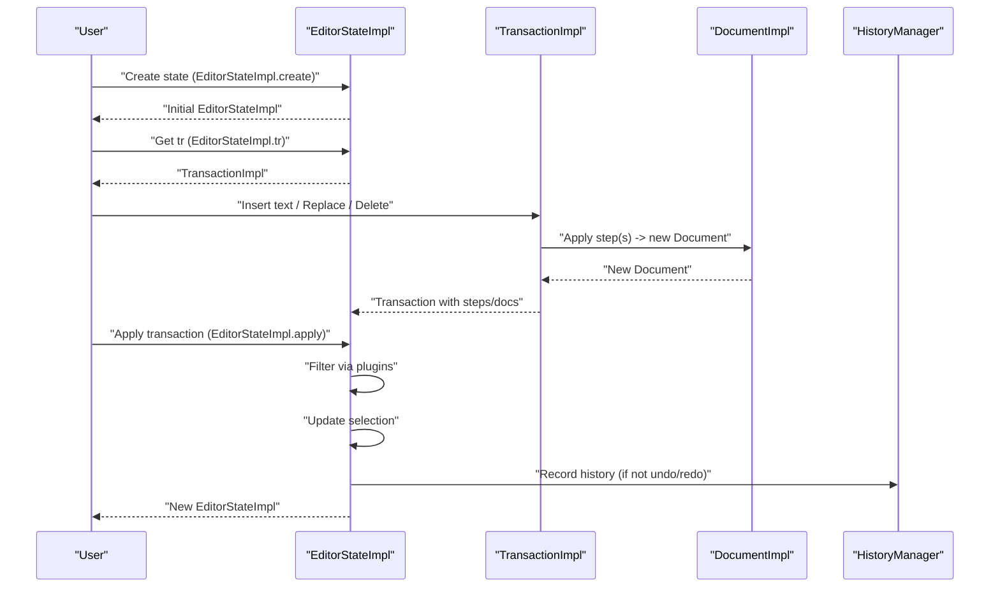
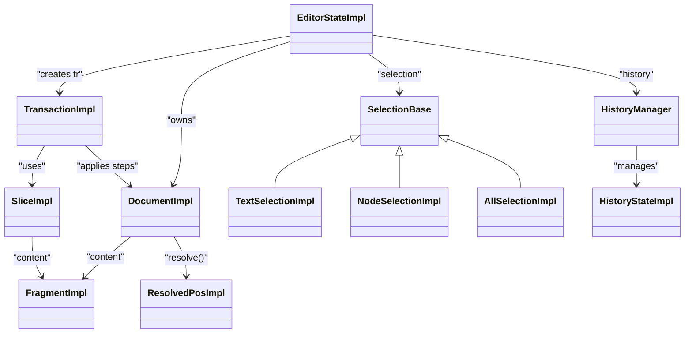
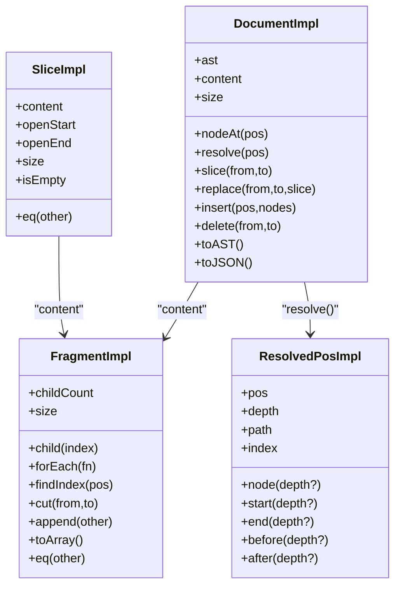

# State Models

<cite>
**Referenced Files in This Document**
- [Document.ts](file://artoon-editor-state/src/state/Document.ts)
- [EditorState.ts](file://artoon-editor-state/src/state/EditorState.ts)
- [Fragment.ts](file://artoon-editor-state/src/state/Fragment.ts)
- [ResolvedPos.ts](file://artoon-editor-state/src/state/ResolvedPos.ts)
- [Slice.ts](file://artoon-editor-state/src/state/Slice.ts)
- [types.ts](file://artoon-editor-state/src/types.ts)
- [Selection.ts](file://artoon-editor-state/src/selection/Selection.ts)
- [Transaction.ts](file://artoon-editor-state/src/transaction/Transaction.ts)
- [History.ts](file://artoon-editor-state/src/history/History.ts)
- [Document.test.ts](file://artoon-editor-state/tests/state/Document.test.ts)
- [Fragment.test.ts](file://artoon-editor-state/tests/state/Fragment.test.ts)
</cite>

## Table of Contents
1. [Introduction](#introduction)
2. [Project Structure](#project-structure)
3. [Core Components](#core-components)
4. [Architecture Overview](#architecture-overview)
5. [Detailed Component Analysis](#detailed-component-analysis)
6. [Dependency Analysis](#dependency-analysis)
7. [Performance Considerations](#performance-considerations)
8. [Troubleshooting Guide](#troubleshooting-guide)
9. [Conclusion](#conclusion)
10. [Appendices](#appendices)

## Introduction
This document explains the ARTOON Editor State models that underpin document editing and state management. It focuses on:
- Document: Root container for ARTOON documents, including metadata handling and content organization.
- EditorState: Central immutable state container, covering initialization, configuration, and state queries.
- Fragment: Efficient composition and manipulation of content nodes.
- ResolvedPos: Position resolution and navigation within the document structure.
- Slice: Content extraction and insertion operations.

It also provides practical examples of state creation, manipulation, and querying, along with performance considerations and memory management strategies.

## Project Structure
The state models live in the artoon-editor-state package. The relevant modules are organized by domain:
- state: Core state models (Document, EditorState, Fragment, ResolvedPos, Slice)
- selection: Selection abstractions and implementations
- transaction: Transaction pipeline and step management
- history: Undo/redo history management
- types: Shared type definitions for the state system

**Diagram sources**
- [Document.ts:16-296](file://artoon-editor-state/src/state/Document.ts#L16-L296)
- [EditorState.ts:26-258](file://artoon-editor-state/src/state/EditorState.ts#L26-L258)
- [Fragment.ts:126-306](file://artoon-editor-state/src/state/Fragment.ts#L126-L306)
- [ResolvedPos.ts:21-296](file://artoon-editor-state/src/state/ResolvedPos.ts#L21-L296)
- [Slice.ts:11-85](file://artoon-editor-state/src/state/Slice.ts#L11-L85)
- [Selection.ts:24-248](file://artoon-editor-state/src/selection/Selection.ts#L24-L248)
- [Transaction.ts:17-348](file://artoon-editor-state/src/transaction/Transaction.ts#L17-L348)
- [History.ts:86-205](file://artoon-editor-state/src/history/History.ts#L86-L205)

**Section sources**
- [types.ts:1-516](file://artoon-editor-state/src/types.ts#L1-L516)

## Core Components
This section introduces each model’s role and responsibilities.

- DocumentImpl
  - Wraps an ARTOONDocument and exposes position-aware operations.
  - Provides node access, slicing, replacement, insertion, deletion, and conversion to/from AST.
  - Maintains a Fragment of top-level content and caches computed size.

- EditorStateImpl
  - Immutable editor state holding the current Document, Selection, Plugins, and History.
  - Creates transactions, applies them, updates plugin states, and manages history entries.
  - Supports JSON serialization/deserialization and plugin state retrieval.

- FragmentImpl
  - A lightweight, position-aware collection of ContentNode items.
  - Computes sizes per node type and supports iteration, indexing, cutting, and appending.

- ResolvedPosImpl
  - A resolved position with contextual information: depth, path, indices, parent, and boundary positions.
  - Enables navigation and boundary checks within nested content.

- SliceImpl
  - A piece of content with open-start/open-end depths, used for insertions and replacements.
  - Supports equality and JSON serialization.

**Section sources**
- [Document.ts:16-296](file://artoon-editor-state/src/state/Document.ts#L16-L296)
- [EditorState.ts:26-258](file://artoon-editor-state/src/state/EditorState.ts#L26-L258)
- [Fragment.ts:126-306](file://artoon-editor-state/src/state/Fragment.ts#L126-L306)
- [ResolvedPos.ts:21-296](file://artoon-editor-state/src/state/ResolvedPos.ts#L21-L296)
- [Slice.ts:11-85](file://artoon-editor-state/src/state/Slice.ts#L11-L85)

## Architecture Overview
The EditorState orchestrates Document, Selection, Transactions, and History. Transactions operate on Documents and produce new Documents, which become part of EditorState. Selections are resolved against the Document to provide contextual navigation.

**Diagram sources**
- [EditorState.ts:116-211](file://artoon-editor-state/src/state/EditorState.ts#L116-L211)
- [Transaction.ts:60-89](file://artoon-editor-state/src/transaction/Transaction.ts#L60-L89)
- [History.ts:106-148](file://artoon-editor-state/src/history/History.ts#L106-L148)

## Detailed Component Analysis

### Document Model
DocumentImpl encapsulates an ARTOONDocument and provides:
- Creation from AST or empty document.
- Size computation including document open/close markers.
- Node access by position and content iteration.
- Position resolution to ResolvedPos.
- Slicing and replacement operations using SliceImpl.
- Insertion/deletion convenience methods.
- Equality and conversion to/from AST and JSON.

Key behaviors:
- Position model: Position 0 is document open; positions 1+ align with content nodes.
- Replacement merges Slice content into overlapping nodes and inserts at the first overlapping boundary.
- Slicing adjusts for document boundaries and returns a Slice with openStart/openEnd semantics.

Practical examples (paths):
- Creating a document from AST: [DocumentImpl.create:29-31](file://artoon-editor-state/src/state/Document.ts#L29-L31)
- Creating an empty document: [DocumentImpl.empty:36-41](file://artoon-editor-state/src/state/Document.ts#L36-L41)
- Getting a node at position: [DocumentImpl.nodeAt:57-63](file://artoon-editor-state/src/state/Document.ts#L57-L63)
- Resolving a position: [DocumentImpl.resolve:68-72](file://artoon-editor-state/src/state/Document.ts#L68-L72)
- Extracting a slice: [DocumentImpl.slice:77-94](file://artoon-editor-state/src/state/Document.ts#L77-L94)
- Replacing a range: [DocumentImpl.replace:111-158](file://artoon-editor-state/src/state/Document.ts#L111-L158)
- Inserting nodes: [DocumentImpl.insert:172-174](file://artoon-editor-state/src/state/Document.ts#L172-L174)
- Deleting a range: [DocumentImpl.delete:179-181](file://artoon-editor-state/src/state/Document.ts#L179-L181)
- Converting to AST: [DocumentImpl.toAST:238-243](file://artoon-editor-state/src/state/Document.ts#L238-L243)
- JSON serialization: [DocumentImpl.toJSON/fromJSON:248-257](file://artoon-editor-state/src/state/Document.ts#L248-L257)

Validation and tests:
- [Document.test.ts:22-204](file://artoon-editor-state/tests/state/Document.test.ts#L22-L204)

**Section sources**
- [Document.ts:16-296](file://artoon-editor-state/src/state/Document.ts#L16-L296)
- [Document.test.ts:1-205](file://artoon-editor-state/tests/state/Document.test.ts#L1-L205)

### EditorState Model
EditorStateImpl is the immutable container for the editor’s state:
- Initialization: Creates DocumentImpl, resolves initial Selection, sets up plugins and HistoryManager.
- Transaction application: Filters via plugins, maps selection to new document, updates plugin states, records history, handles undo/redo, and allows plugin-provided appended transactions.
- Queries: Exposes current Document, Selection, History, and plugin states.
- Serialization: Converts to/from JSON with Document and Selection.

Initialization and configuration:
- [EditorStateImpl.create:49-97](file://artoon-editor-state/src/state/EditorState.ts#L49-L97)
- Config options: doc, selection, plugins.

State application:
- [EditorStateImpl.apply:116-211](file://artoon-editor-state/src/state/EditorState.ts#L116-L211)
- History recording and undo/redo: [HistoryManager.record/popUndo/popRedo:106-180](file://artoon-editor-state/src/history/History.ts#L106-L180)

Selection integration:
- [Selection implementations:97-228](file://artoon-editor-state/src/selection/Selection.ts#L97-L228)

Practical examples (paths):
- Creating state with defaults: [EditorStateImpl.create:49-97](file://artoon-editor-state/src/state/EditorState.ts#L49-L97)
- Applying a transaction: [EditorStateImpl.apply:116-211](file://artoon-editor-state/src/state/EditorState.ts#L116-L211)
- Getting plugin state: [EditorStateImpl.getPluginState:216-218](file://artoon-editor-state/src/state/EditorState.ts#L216-L218)
- JSON serialization: [EditorStateImpl.toJSON/fromJSON:223-245](file://artoon-editor-state/src/state/EditorState.ts#L223-L245)

**Section sources**
- [EditorState.ts:26-258](file://artoon-editor-state/src/state/EditorState.ts#L26-L258)
- [History.ts:86-205](file://artoon-editor-state/src/history/History.ts#L86-L205)
- [Selection.ts:24-248](file://artoon-editor-state/src/selection/Selection.ts#L24-L248)

### Fragment Model
FragmentImpl provides efficient composition and manipulation of content:
- Construction from single node, array, or null.
- Size computation via nodeSize, which accounts for node types and inline content lengths.
- Iteration with positional offsets, child access, and boundary finding.
- Cutting and appending fragments.
- Equality and JSON serialization.

Key helpers:
- [nodeSize:11-73](file://artoon-editor-state/src/state/Fragment.ts#L11-L73) computes per-node size considering content length and nested structures.
- [FragmentImpl.findFirstIndex:187-202](file://artoon-editor-state/src/state/Fragment.ts#L187-L202) locates the node at a given position.
- [FragmentImpl.cut:241-285](file://artoon-editor-state/src/state/Fragment.ts#L241-L285) extracts a sub-range of nodes.

Practical examples (paths):
- Creating fragments: [FragmentImpl.from:137-145](file://artoon-editor-state/src/state/Fragment.ts#L137-L145)
- Calculating node size: [nodeSize:11-73](file://artoon-editor-state/src/state/Fragment.ts#L11-L73)
- Cutting a fragment: [FragmentImpl.cut:241-285](file://artoon-editor-state/src/state/Fragment.ts#L241-L285)
- Appending fragments: [FragmentImpl.append:232-236](file://artoon-editor-state/src/state/Fragment.ts#L232-L236)
- Equality: [FragmentImpl.eq:294-300](file://artoon-editor-state/src/state/Fragment.ts#L294-L300)

Validation and tests:
- [Fragment.test.ts:19-207](file://artoon-editor-state/tests/state/Fragment.test.ts#L19-L207)

**Section sources**
- [Fragment.ts:126-306](file://artoon-editor-state/src/state/Fragment.ts#L126-L306)
- [Fragment.test.ts:1-207](file://artoon-editor-state/tests/state/Fragment.test.ts#L1-L207)

### ResolvedPos Model
ResolvedPosImpl resolves a position into a path within the document:
- Stores absolute position, depth, path nodes, and indices.
- Provides start/end positions per depth, parent node, and sibling accessors.
- Offers textOffset for text nodes and boundary helpers (before/after).
- Supports sharedDepth and sameParent comparisons.

Resolution algorithm:
- [resolvePos:227-276](file://artoon-editor-state/src/state/ResolvedPos.ts#L227-L276) walks the content tree to build the path and locate the position.

Practical examples (paths):
- Resolving a position: [resolvePos:227-276](file://artoon-editor-state/src/state/ResolvedPos.ts#L227-L276)
- Accessing node and index at depth: [ResolvedPosImpl.node/indexAt:46-63](file://artoon-editor-state/src/state/ResolvedPos.ts#L46-L63)
- Getting start/end positions: [ResolvedPosImpl.start/end:68-90](file://artoon-editor-state/src/state/ResolvedPos.ts#L68-L90)
- Node siblings: [ResolvedPosImpl.nodeBefore/nodeAfter:95-125](file://artoon-editor-state/src/state/ResolvedPos.ts#L95-L125)
- Boundary helpers: [ResolvedPosImpl.before/after:204-221](file://artoon-editor-state/src/state/ResolvedPos.ts#L204-L221)

**Section sources**
- [ResolvedPos.ts:21-296](file://artoon-editor-state/src/state/ResolvedPos.ts#L21-L296)

### Slice Model
SliceImpl represents a piece of content with open-start/open-end depths:
- Construction from Fragment or empty singleton.
- Size calculation excludes openStart/openEnd boundaries.
- Equality and JSON serialization.

Practical examples (paths):
- Creating a slice: [SliceImpl.from:41-46](file://artoon-editor-state/src/state/Slice.ts#L41-L46)
- Empty slice: [SliceImpl.empty](file://artoon-editor-state/src/state/Slice.ts#L36)
- Size calculation: [SliceImpl.size:29-31](file://artoon-editor-state/src/state/Slice.ts#L29-L31)
- Equality: [SliceImpl.eq:58-64](file://artoon-editor-state/src/state/Slice.ts#L58-L64)

**Section sources**
- [Slice.ts:11-85](file://artoon-editor-state/src/state/Slice.ts#L11-L85)

### Selection and Transaction Integration
Selections are resolved against the Document to provide contextual navigation:
- [SelectionBase.$anchor/$head/$from/$to:51-71](file://artoon-editor-state/src/selection/Selection.ts#L51-L71) compute resolved positions.
- [TextSelectionImpl.map/withDoc:129-140](file://artoon-editor-state/src/selection/Selection.ts#L129-L140) update selections after changes.
- [NodeSelectionImpl.create/isSelectable:166-178](file://artoon-editor-state/src/selection/Selection.ts#L166-L178) manage node-level selections.

Transactions drive state changes:
- [TransactionImpl.insertText:95-217](file://artoon-editor-state/src/transaction/Transaction.ts#L95-L217) resolves position, finds text node, splits/merges inline content, and replaces the node via a ReplaceStep.
- [TransactionImpl.replaceWith/delete/setNodeAttrs:224-310](file://artoon-editor-state/src/transaction/Transaction.ts#L224-L310) apply slice-based replacements.
- [TransactionImpl.step:60-89](file://artoon-editor-state/src/transaction/Transaction.ts#L60-L89) applies steps and updates mapping and selection.

**Section sources**
- [Selection.ts:24-248](file://artoon-editor-state/src/selection/Selection.ts#L24-L248)
- [Transaction.ts:17-348](file://artoon-editor-state/src/transaction/Transaction.ts#L17-L348)

## Dependency Analysis
The models form a layered dependency graph:
- EditorStateImpl depends on DocumentImpl, Selection implementations, HistoryManager, and TransactionImpl.
- DocumentImpl depends on FragmentImpl and ResolvedPosImpl.
- SliceImpl depends on FragmentImpl.
- TransactionImpl depends on DocumentImpl, SliceImpl, FragmentImpl, Selection implementations, and MappingImpl.
- HistoryManager maintains HistoryStateImpl and coordinates undo/redo stacks.

**Diagram sources**
- [EditorState.ts:26-97](file://artoon-editor-state/src/state/EditorState.ts#L26-L97)
- [Document.ts:16-72](file://artoon-editor-state/src/state/Document.ts#L16-L72)
- [Fragment.ts:126-150](file://artoon-editor-state/src/state/Fragment.ts#L126-L150)
- [ResolvedPos.ts:21-41](file://artoon-editor-state/src/state/ResolvedPos.ts#L21-L41)
- [Slice.ts:11-24](file://artoon-editor-state/src/state/Slice.ts#L11-L24)
- [Selection.ts:24-92](file://artoon-editor-state/src/selection/Selection.ts#L24-L92)
- [Transaction.ts:17-34](file://artoon-editor-state/src/transaction/Transaction.ts#L17-L34)
- [History.ts:86-101](file://artoon-editor-state/src/history/History.ts#L86-L101)

**Section sources**
- [types.ts:28-210](file://artoon-editor-state/src/types.ts#L28-L210)

## Performance Considerations
- Size caching
  - DocumentImpl caches computed size to avoid repeated traversal. [DocumentImpl.size:47-52](file://artoon-editor-state/src/state/Document.ts#L47-L52)
  - FragmentImpl caches computed size. [FragmentImpl.size:156-161](file://artoon-editor-state/src/state/Fragment.ts#L156-L161)
  - Consider invalidating caches when underlying content changes (e.g., after replacements).

- Position resolution
  - ResolvedPosImpl builds a path during resolve; reuse resolved positions when performing multiple operations at the same location. [resolvePos:227-276](file://artoon-editor-state/src/state/ResolvedPos.ts#L227-L276)

- Node size computation
  - nodeSize traverses content arrays and nested structures; cache results when repeatedly computing sizes for the same nodes. [nodeSize:11-73](file://artoon-editor-state/src/state/Fragment.ts#L11-L73)

- Memory management
  - Prefer immutable operations (new instances) to minimize mutation overhead and simplify undo/redo. [EditorStateImpl.apply:116-211](file://artoon-editor-state/src/state/EditorState.ts#L116-L211)
  - Use FragmentImpl.empty and SliceImpl.empty singletons to reduce allocations. [FragmentImpl.empty](file://artoon-editor-state/src/state/Fragment.ts#L150), [SliceImpl.empty](file://artoon-editor-state/src/state/Slice.ts#L36)

- History depth
  - Limit undo depth to balance memory usage and responsiveness. [HistoryManager.record:134-147](file://artoon-editor-state/src/history/History.ts#L134-L147)

[No sources needed since this section provides general guidance]

## Troubleshooting Guide
Common issues and remedies:
- Out-of-bounds positions
  - Document.nodeAt returns null for invalid positions. Ensure clamping before calling. [DocumentImpl.nodeAt:57-63](file://artoon-editor-state/src/state/Document.ts#L57-L63)
  - Fragment.child throws RangeError for invalid indices. Validate index before access. [FragmentImpl.child:171-177](file://artoon-editor-state/src/state/Fragment.ts#L171-L177)

- Incorrect node boundaries
  - When replacing text, ensure you target the correct node boundaries. Use ResolvedPos.start/end to compute exact positions. [ResolvedPosImpl.start/end:68-90](file://artoon-editor-state/src/state/ResolvedPos.ts#L68-L90)

- Selection drift after edits
  - Transactions map selections through MappingImpl; ensure selectionSet flag is respected when manually setting selection. [TransactionImpl.setSelection:280-284](file://artoon-editor-state/src/transaction/Transaction.ts#L280-L284)

- Undo/redo not recorded
  - History recording is skipped for undo/redo actions; verify meta keys and step count. [EditorStateImpl.apply:150-161](file://artoon-editor-state/src/state/EditorState.ts#L150-L161)

**Section sources**
- [Document.ts:57-63](file://artoon-editor-state/src/state/Document.ts#L57-L63)
- [Fragment.ts:171-177](file://artoon-editor-state/src/state/Fragment.ts#L171-L177)
- [ResolvedPos.ts:68-90](file://artoon-editor-state/src/state/ResolvedPos.ts#L68-L90)
- [Transaction.ts:280-284](file://artoon-editor-state/src/transaction/Transaction.ts#L280-L284)
- [EditorState.ts:150-161](file://artoon-editor-state/src/state/EditorState.ts#L150-L161)

## Conclusion
The ARTOON Editor State models provide a robust, immutable foundation for document editing:
- DocumentImpl offers position-aware content operations.
- EditorStateImpl coordinates state transitions via transactions and plugins.
- FragmentImpl and SliceImpl enable efficient composition and manipulation.
- ResolvedPosImpl powers precise navigation and boundary calculations.

Adhering to immutability, leveraging cached sizes, and carefully managing selection mapping ensures predictable behavior and strong performance.

[No sources needed since this section summarizes without analyzing specific files]

## Appendices

### Practical Examples (Paths)
- Create an EditorState with default content:
  - [EditorStateImpl.create:49-97](file://artoon-editor-state/src/state/EditorState.ts#L49-L97)
- Create a Document from AST:
  - [DocumentImpl.create:29-31](file://artoon-editor-state/src/state/Document.ts#L29-L31)
- Insert text at a position:
  - [TransactionImpl.insertText:95-217](file://artoon-editor-state/src/transaction/Transaction.ts#L95-L217)
- Replace a range with nodes:
  - [DocumentImpl.replaceWith:163-167](file://artoon-editor-state/src/state/Document.ts#L163-L167)
- Resolve a position to context:
  - [DocumentImpl.resolve:68-72](file://artoon-editor-state/src/state/Document.ts#L68-L72)
  - [resolvePos:227-276](file://artoon-editor-state/src/state/ResolvedPos.ts#L227-L276)
- Extract a slice:
  - [DocumentImpl.slice:77-94](file://artoon-editor-state/src/state/Document.ts#L77-L94)
- Serialize state:
  - [EditorStateImpl.toJSON:223-228](file://artoon-editor-state/src/state/EditorState.ts#L223-L228)
  - [DocumentImpl.toJSON:248-250](file://artoon-editor-state/src/state/Document.ts#L248-L250)

### Class Relationships Diagram

**Diagram sources**
- [Document.ts:16-296](file://artoon-editor-state/src/state/Document.ts#L16-L296)
- [Fragment.ts:126-306](file://artoon-editor-state/src/state/Fragment.ts#L126-L306)
- [ResolvedPos.ts:21-296](file://artoon-editor-state/src/state/ResolvedPos.ts#L21-L296)
- [Slice.ts:11-85](file://artoon-editor-state/src/state/Slice.ts#L11-L85)