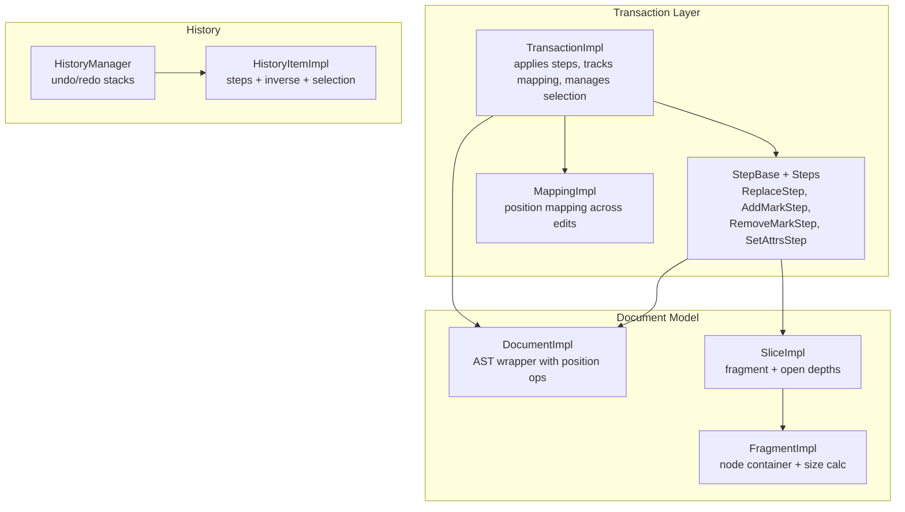
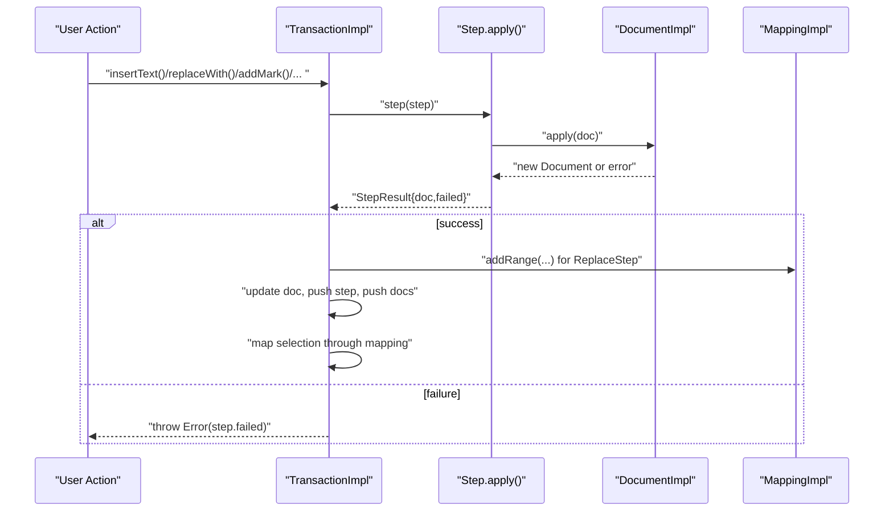
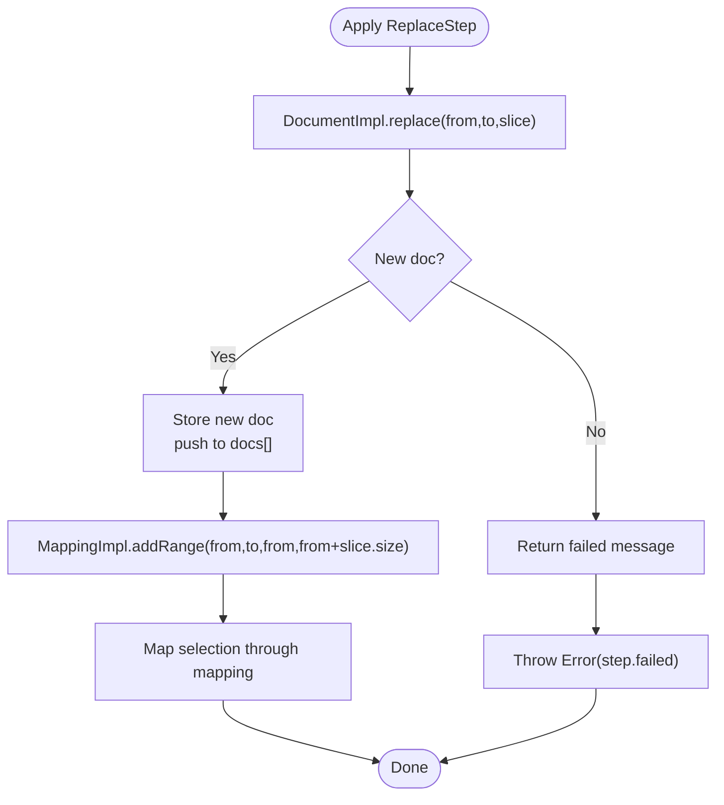
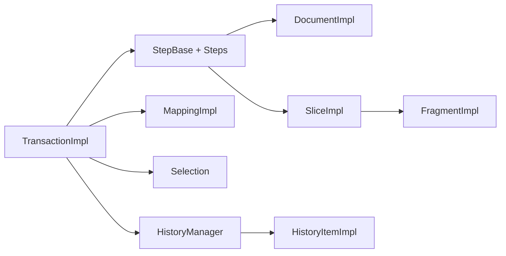

# Transaction System

<cite>
**Referenced Files in This Document**
- [Transaction.ts](file://artoon-editor-state/src/transaction/Transaction.ts)
- [Step.ts](file://artoon-editor-state/src/transaction/Step.ts)
- [Mapping.ts](file://artoon-editor-state/src/transaction/Mapping.ts)
- [types.ts](file://artoon-editor-state/src/types.ts)
- [History.ts](file://artoon-editor-state/src/history/History.ts)
- [Document.ts](file://artoon-editor-state/src/state/Document.ts)
- [Slice.ts](file://artoon-editor-state/src/state/Slice.ts)
- [Fragment.ts](file://artoon-editor-state/src/state/Fragment.ts)
- [index.ts](file://artoon-editor-state/src/transaction/index.ts)
</cite>

## Table of Contents
1. [Introduction](#introduction)
2. [Project Structure](#project-structure)
3. [Core Components](#core-components)
4. [Architecture Overview](#architecture-overview)
5. [Detailed Component Analysis](#detailed-component-analysis)
6. [Dependency Analysis](#dependency-analysis)
7. [Performance Considerations](#performance-considerations)
8. [Troubleshooting Guide](#troubleshooting-guide)
9. [Conclusion](#conclusion)

## Introduction
This document explains the ARTOON Transaction System, focusing on how state changes are modeled and applied atomically via the Transaction and Step abstractions. It covers:
- Transaction creation and step application
- The four Step types: ReplaceStep, AddMarkStep, RemoveMarkStep, and SetAttrsStep
- The Mapping system for tracking position changes across transformations
- Undo/redo integration and history management
- Examples of complex transaction scenarios, error handling, rollback, and performance optimization strategies

## Project Structure
The transaction system resides in the editor state package and integrates with the document model, selection system, and history subsystem.



**Diagram sources**
- [Transaction.ts:17-348](file://artoon-editor-state/src/transaction/Transaction.ts#L17-L348)
- [Step.ts:15-285](file://artoon-editor-state/src/transaction/Step.ts#L15-L285)
- [Mapping.ts:20-134](file://artoon-editor-state/src/transaction/Mapping.ts#L20-L134)
- [Document.ts:16-296](file://artoon-editor-state/src/state/Document.ts#L16-L296)
- [Slice.ts:11-85](file://artoon-editor-state/src/state/Slice.ts#L11-L85)
- [Fragment.ts:126-306](file://artoon-editor-state/src/state/Fragment.ts#L126-L306)
- [History.ts:86-205](file://artoon-editor-state/src/history/History.ts#L86-L205)

**Section sources**
- [index.ts:5-13](file://artoon-editor-state/src/transaction/index.ts#L5-L13)

## Core Components
- TransactionImpl: Orchestrates a sequence of atomic steps, maintains the evolving document, selection, and mapping, and exposes convenience operations for text, marks, and attributes.
- StepBase and concrete Steps: Define atomic changes with apply/invert/map/merge semantics and JSON serialization.
- MappingImpl: Tracks how positions shift due to edits, enabling safe selection mapping and step remapping.
- DocumentImpl, SliceImpl, FragmentImpl: Provide the underlying document representation and position-aware operations used by steps.

**Section sources**
- [Transaction.ts:17-348](file://artoon-editor-state/src/transaction/Transaction.ts#L17-L348)
- [Step.ts:15-285](file://artoon-editor-state/src/transaction/Step.ts#L15-L285)
- [Mapping.ts:20-134](file://artoon-editor-state/src/transaction/Mapping.ts#L20-L134)
- [Document.ts:16-296](file://artoon-editor-state/src/state/Document.ts#L16-L296)
- [Slice.ts:11-85](file://artoon-editor-state/src/state/Slice.ts#L11-L85)
- [Fragment.ts:126-306](file://artoon-editor-state/src/state/Fragment.ts#L126-L306)

## Architecture Overview
The transaction pipeline applies steps atomically, updates the document and mapping, and maps the selection accordingly. Undo/redo history captures step sequences and their inverses.



**Diagram sources**
- [Transaction.ts:60-89](file://artoon-editor-state/src/transaction/Transaction.ts#L60-L89)
- [Step.ts:44-51](file://artoon-editor-state/src/transaction/Step.ts#L44-L51)
- [Document.ts:111-158](file://artoon-editor-state/src/state/Document.ts#L111-L158)
- [Mapping.ts:30-82](file://artoon-editor-state/src/transaction/Mapping.ts#L30-L82)

## Detailed Component Analysis

### TransactionImpl
Responsibilities:
- Maintain a stack of steps and pre/post documents for rollback and history.
- Track a cumulative MappingImpl to map positions across edits.
- Expose high-level operations: insertText, delete, replaceWith, addMark/removeMark/toggle/clearMarks, setNodeAttrs, setBlockType, setSelection, metadata, and scrolling hints.
- On successful step application, update mapping ranges and map the selection unless explicitly overridden.

Key behaviors:
- Step application validates success and throws on failure.
- ReplaceStep triggers mapping range updates to reflect replacement spans.
- Selection mapping is deferred until explicitly set.

Usage patterns:
- Fluent chaining: call multiple operations to build a transaction, then apply.
- Explicit selection setting to override automatic mapping.

**Section sources**
- [Transaction.ts:17-348](file://artoon-editor-state/src/transaction/Transaction.ts#L17-L348)

### Step System

#### ReplaceStep
Purpose: Replace a document range with a Slice.
Parameters: from, to, slice.
Behavior:
- apply: delegates to DocumentImpl.replace.
- invert: captures the replaced content and returns a new ReplaceStep inserting it at the original location.
- map: remaps bounds using MappingImpl; collapses invalid ranges.
- merge: combines consecutive insertions into a single ReplaceStep with merged slice content.
- JSON: supports serialization/deserialization.

**Section sources**
- [Step.ts:31-103](file://artoon-editor-state/src/transaction/Step.ts#L31-L103)
- [Document.ts:111-158](file://artoon-editor-state/src/state/Document.ts#L111-L158)
- [Slice.ts:11-85](file://artoon-editor-state/src/state/Slice.ts#L11-L85)

#### AddMarkStep
Purpose: Add formatting (marks) to a range.
Parameters: from, to, mark.
Behavior:
- apply: currently returns the document unchanged (placeholder).
- invert: returns RemoveMarkStep for the same range and mark.
- map: remaps bounds; invalidates if order collapses.
- JSON: supports serialization/deserialization.

Note: Full inline content mutation is not implemented in this placeholder.

**Section sources**
- [Step.ts:108-157](file://artoon-editor-state/src/transaction/Step.ts#L108-L157)

#### RemoveMarkStep
Purpose: Remove formatting (marks) from a range.
Parameters: from, to, mark.
Behavior:
- apply: placeholder (returns unchanged).
- invert: returns AddMarkStep.
- map: remaps bounds; invalidates if order collapses.
- JSON: supports serialization/deserialization.

**Section sources**
- [Step.ts:162-208](file://artoon-editor-state/src/transaction/Step.ts#L162-L208)

#### SetAttrsStep
Purpose: Change attributes of a node at a position.
Parameters: pos, attrs.
Behavior:
- apply: reads node at pos, stores old attributes, creates a new node with attrs merged, replaces at pos via DocumentImpl.replaceWith.
- invert: restores old attributes.
- map: maps the position; deletes if target node was removed.
- JSON: supports serialization/deserialization.

**Section sources**
- [Step.ts:213-266](file://artoon-editor-state/src/transaction/Step.ts#L213-L266)
- [Document.ts:163-167](file://artoon-editor-state/src/state/Document.ts#L163-L167)

#### StepBase and JSON Utilities
- Base contract defines apply, invert, map, merge, toJSON, with a default no-op merge.
- stepFromJSON factory routes deserialization to the appropriate step type.

**Section sources**
- [Step.ts:15-27](file://artoon-editor-state/src/transaction/Step.ts#L15-L27)
- [Step.ts:271-285](file://artoon-editor-state/src/transaction/Step.ts#L271-L285)

### Mapping System
MappingImpl tracks replacement ranges to map positions through edits:
- addRange: records a deleted span and its replacement span.
- map/mapResult: shifts positions by net delta; signals deletion with bias-aware mapping to start/end of replacement.
- invert/compose: invert reverses recorded ranges; compose merges two mappings.
- Static helpers: empty and fromReplace for convenience.

Integration:
- TransactionImpl updates mapping for ReplaceStep ranges and maps selection unless explicitly set.

**Section sources**
- [Mapping.ts:20-134](file://artoon-editor-state/src/transaction/Mapping.ts#L20-L134)
- [Transaction.ts:73-85](file://artoon-editor-state/src/transaction/Transaction.ts#L73-L85)

### Undo/Redo and History
HistoryManager maintains:
- Undo stack: most recent at end.
- Redo stack: restored items moved here on undo.
- Grouping: recent changes within a time window are merged into a single history item.
- Limits: configurable depth trimming.

HistoryItemImpl captures:
- steps: applied steps.
- inverseSteps: inverse steps for undo.
- selection: selection at the time of the change.
- timestamp: creation time.

Integration with transactions:
- After applying a transaction, collect steps and their inverses, capture selection, and record via HistoryManager.record.

**Section sources**
- [History.ts:86-205](file://artoon-editor-state/src/history/History.ts#L86-L205)
- [types.ts:346-373](file://artoon-editor-state/src/types.ts#L346-L373)

### Document, Slice, and Fragment
- DocumentImpl: wraps ARTOONDocument, provides nodeAt, resolve, slice, replace, replaceWith, insert, delete, and positionOf.
- SliceImpl: holds a Fragment plus openStart/openEnd; size excludes open depths.
- FragmentImpl: node container with size computation, findIndex, nodeAt, append, cut, and equality.

These types underpin step operations and position arithmetic.

**Section sources**
- [Document.ts:16-296](file://artoon-editor-state/src/state/Document.ts#L16-L296)
- [Slice.ts:11-85](file://artoon-editor-state/src/state/Slice.ts#L11-L85)
- [Fragment.ts:126-306](file://artoon-editor-state/src/state/Fragment.ts#L126-L306)

## Architecture Overview

```mermaid
classDiagram
class TransactionImpl {
+steps : Step[]
+docs : DocumentImpl[]
+mapping : MappingImpl
+doc : DocumentImpl
+selection : Selection
+meta : Map
+time : number
+step(step)
+insertText(text, from?, to?)
+delete(from, to)
+replaceWith(from, to, content)
+addMark(from, to, mark)
+removeMark(from, to, mark)
+toggleMark(mark)
+clearMarks(from, to)
+setNodeAttrs(pos, attrs)
+setBlockType(from, to, nodeType, attrs?)
+setSelection(selection)
+setMeta(key, value)
+scrollIntoView()
}
class StepBase {
<<abstract>>
+type : string
+apply(doc) : StepResult
+invert(doc) : Step
+map(mapping) : Step|null
+merge(other) : Step|null
+toJSON() : StepJSON
}
class ReplaceStep {
+from : number
+to : number
+slice : SliceImpl
+apply(doc) : StepResult
+invert(doc) : ReplaceStep
+map(mapping) : ReplaceStep|null
+merge(other) : Step|null
+toJSON() : StepJSON
}
class AddMarkStep {
+from : number
+to : number
+mark : Modifier
+apply(doc) : StepResult
+invert(doc) : RemoveMarkStep
+map(mapping) : AddMarkStep|null
+toJSON() : StepJSON
}
class RemoveMarkStep {
+from : number
+to : number
+mark : Modifier
+apply(doc) : StepResult
+invert(doc) : AddMarkStep
+map(mapping) : RemoveMarkStep|null
+toJSON() : StepJSON
}
class SetAttrsStep {
+pos : number
+attrs : Record
+apply(doc) : StepResult
+invert(doc) : SetAttrsStep
+map(mapping) : SetAttrsStep|null
+toJSON() : StepJSON
}
class MappingImpl {
+addRange(from, to, newFrom, newTo)
+map(pos, bias?) : number
+mapResult(pos, bias?) : MapResult
+invert() : MappingImpl
+compose(other) : MappingImpl
+static empty() : MappingImpl
+static fromReplace(from, to, size) : MappingImpl
}
class DocumentImpl {
+ast : ARTOONDocument
+content : FragmentImpl
+size : number
+nodeAt(pos) : ContentNode|null
+resolve(pos) : ResolvedPos
+slice(from, to) : SliceImpl
+replace(from, to, slice) : DocumentImpl
+replaceWith(from, to, nodes) : DocumentImpl
+insert(pos, nodes) : DocumentImpl
+delete(from, to) : DocumentImpl
+positionOf(node) : number|null
+toAST() : ARTOONDocument
+toJSON() : any
}
class SliceImpl {
+content : FragmentImpl
+openStart : number
+openEnd : number
+size : number
+isEmpty : boolean
+eq(other) : boolean
+toJSON() : any
+static from(content) : SliceImpl
+static empty : SliceImpl
}
class FragmentImpl {
+childCount : number
+size : number
+child(index) : ContentNode
+firstChild : ContentNode|null
+lastChild : ContentNode|null
+forEach(fn)
+findIndex(pos) : {index, offset}
+nodeAt(pos) : ContentNode|null
+replaceChild(index, node) : FragmentImpl
+append(other) : FragmentImpl
+cut(from, to) : FragmentImpl
+toArray() : ContentNode[]
+eq(other) : boolean
+toJSON() : ContentNode[]
}
TransactionImpl --> StepBase : "applies"
StepBase <|-- ReplaceStep
StepBase <|-- AddMarkStep
StepBase <|-- RemoveMarkStep
StepBase <|-- SetAttrsStep
ReplaceStep --> DocumentImpl : "apply/revert"
ReplaceStep --> SliceImpl : "uses"
SetAttrsStep --> DocumentImpl : "apply/revert"
TransactionImpl --> MappingImpl : "updates"
DocumentImpl --> FragmentImpl : "wraps"
SliceImpl --> FragmentImpl : "contains"
```

**Diagram sources**
- [Transaction.ts:17-348](file://artoon-editor-state/src/transaction/Transaction.ts#L17-L348)
- [Step.ts:15-285](file://artoon-editor-state/src/transaction/Step.ts#L15-L285)
- [Mapping.ts:20-134](file://artoon-editor-state/src/transaction/Mapping.ts#L20-L134)
- [Document.ts:16-296](file://artoon-editor-state/src/state/Document.ts#L16-L296)
- [Slice.ts:11-85](file://artoon-editor-state/src/state/Slice.ts#L11-L85)
- [Fragment.ts:126-306](file://artoon-editor-state/src/state/Fragment.ts#L126-L306)

## Detailed Component Analysis

### Transaction Creation and Step Application
- Construct a TransactionImpl with initial DocumentImpl and Selection.
- Chain operations (insertText, replaceWith, addMark, removeMark, setNodeAttrs, setBlockType).
- Call step(step) to apply a custom Step; TransactionImpl validates success and updates mapping and docs.
- Selection mapping occurs automatically unless explicitly set via setSelection.

Complexity:
- Each step application is O(D) where D is the number of nodes overlapping the affected range (in DocumentImpl.replace).
- Mapping mapResult is O(R) where R is the number of recorded ranges.

**Section sources**
- [Transaction.ts:28-89](file://artoon-editor-state/src/transaction/Transaction.ts#L28-L89)
- [Document.ts:111-158](file://artoon-editor-state/src/state/Document.ts#L111-L158)
- [Mapping.ts:44-82](file://artoon-editor-state/src/transaction/Mapping.ts#L44-L82)

### ReplaceStep Application Flow


**Diagram sources**
- [Step.ts:44-51](file://artoon-editor-state/src/transaction/Step.ts#L44-L51)
- [Document.ts:111-158](file://artoon-editor-state/src/state/Document.ts#L111-L158)
- [Transaction.ts:73-85](file://artoon-editor-state/src/transaction/Transaction.ts#L73-L85)

### Mapping Position Updates
MappingImpl tracks deletions and insertions to compute new positions:
- mapResult iterates ranges, computes offset deltas, and handles deletion with bias (-1 to start, +1 to end).
- invert swaps newFrom/newTo with from/to to reverse mapping.
- compose merges ranges by mapping other’s ranges through this mapping.

**Section sources**
- [Mapping.ts:44-116](file://artoon-editor-state/src/transaction/Mapping.ts#L44-L116)

### Undo/Redo Integration
- Collect applied steps and their inverses during transaction application.
- Capture selection at the time of change.
- Use HistoryManager.record to group recent changes and enforce depth limits.
- On undo: pop from undoStack, push to redoStack, and apply inverse steps.
- On redo: mirror operation.

**Section sources**
- [History.ts:106-197](file://artoon-editor-state/src/history/History.ts#L106-L197)
- [types.ts:346-373](file://artoon-editor-state/src/types.ts#L346-L373)

### Complex Transaction Scenarios

#### Scenario 1: Text Insertion Inside a Text Node
- Resolve position to locate the text node.
- Compute character offset within inline content.
- Split or insert plain text items in the node’s content array.
- Wrap the modified text node in a Slice and apply ReplaceStep.
- Update selection to the end of inserted text.

Outcome: Atomic insertion with correct inline content updates and position mapping.

**Section sources**
- [Transaction.ts:95-217](file://artoon-editor-state/src/transaction/Transaction.ts#L95-L217)
- [Document.ts:111-158](file://artoon-editor-state/src/state/Document.ts#L111-L158)

#### Scenario 2: Batched Replacements with Merge
- Multiple ReplaceStep instances representing consecutive insertions.
- merge checks if one ReplaceStep follows another and combines slices.
- Result: fewer steps stored, smaller history footprint.

**Section sources**
- [Step.ts:70-85](file://artoon-editor-state/src/transaction/Step.ts#L70-L85)

#### Scenario 3: Attribute Updates Across a Range
- Use SetAttrsStep to change node attributes at a specific position.
- invert restores previous attributes.
- map handles deletion if the node was removed.

**Section sources**
- [Step.ts:225-247](file://artoon-editor-state/src/transaction/Step.ts#L225-L247)

#### Scenario 4: Formatting Toggle
- toggleMark checks whether a mark is active in the current selection.
- Adds or removes marks accordingly using AddMarkStep/RemoveMarkStep.
- Selection remains consistent through mapping.

**Section sources**
- [Transaction.ts:250-261](file://artoon-editor-state/src/transaction/Transaction.ts#L250-L261)
- [Step.ts:132-134](file://artoon-editor-state/src/transaction/Step.ts#L132-L134)

### Error Handling and Rollback
- StepResult indicates failure with a message; TransactionImpl throws immediately upon failure.
- Rollback is achieved by storing pre-change documents in docs[] and computing inverse steps for history.
- For ReplaceStep, invert captures the replaced content; for SetAttrsStep, invert restores old attributes.

**Section sources**
- [Step.ts:44-51](file://artoon-editor-state/src/transaction/Step.ts#L44-L51)
- [Transaction.ts:63-65](file://artoon-editor-state/src/transaction/Transaction.ts#L63-L65)
- [History.ts:106-148](file://artoon-editor-state/src/history/History.ts#L106-L148)

## Dependency Analysis



**Diagram sources**
- [Transaction.ts:17-348](file://artoon-editor-state/src/transaction/Transaction.ts#L17-L348)
- [Step.ts:15-285](file://artoon-editor-state/src/transaction/Step.ts#L15-L285)
- [Mapping.ts:20-134](file://artoon-editor-state/src/transaction/Mapping.ts#L20-L134)
- [Document.ts:16-296](file://artoon-editor-state/src/state/Document.ts#L16-L296)
- [Slice.ts:11-85](file://artoon-editor-state/src/state/Slice.ts#L11-L85)
- [Fragment.ts:126-306](file://artoon-editor-state/src/state/Fragment.ts#L126-L306)
- [History.ts:86-205](file://artoon-editor-state/src/history/History.ts#L86-L205)

**Section sources**
- [types.ts:215-337](file://artoon-editor-state/src/types.ts#L215-L337)

## Performance Considerations
- Minimize step count: combine adjacent insertions using ReplaceStep.merge to reduce history entries and mapping overhead.
- Prefer targeted operations: use SetAttrsStep for precise attribute changes rather than broad replacements.
- Limit history depth: configure HistoryManager depth to cap memory usage.
- Avoid unnecessary selection mapping: setSelection explicitly when you need to preserve a specific selection, preventing repeated mapping computations.
- Batch operations: construct a single transaction with multiple steps to reduce intermediate document recomputation.

[No sources needed since this section provides general guidance]

## Troubleshooting Guide
Common issues and resolutions:
- Step failures: Inspect step.failed messages returned by StepResult; TransactionImpl throws on failure to prevent inconsistent state.
- Incorrect selections after edits: Ensure selection is not automatically mapped by calling setSelection to override mapping behavior.
- Deleted positions: Use MappingImpl.mapResult to detect deletion and adjust UI focus accordingly.
- History overflow: Configure HistoryManager depth to trim older entries; grouping recent changes reduces stack growth.

**Section sources**
- [Transaction.ts:63-65](file://artoon-editor-state/src/transaction/Transaction.ts#L63-L65)
- [Mapping.ts:44-82](file://artoon-editor-state/src/transaction/Mapping.ts#L44-L82)
- [History.ts:140-147](file://artoon-editor-state/src/history/History.ts#L140-L147)

## Conclusion
The ARTOON Transaction System provides a robust, extensible foundation for editing ARTOON documents. Transactions encapsulate atomic changes via Steps, track position mappings for safe selection updates, and integrate seamlessly with an undo/redo history. By leveraging step merging, explicit selection control, and careful history configuration, applications can achieve predictable behavior, strong error handling, and efficient performance.