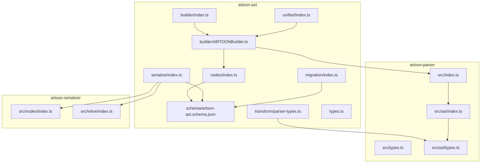
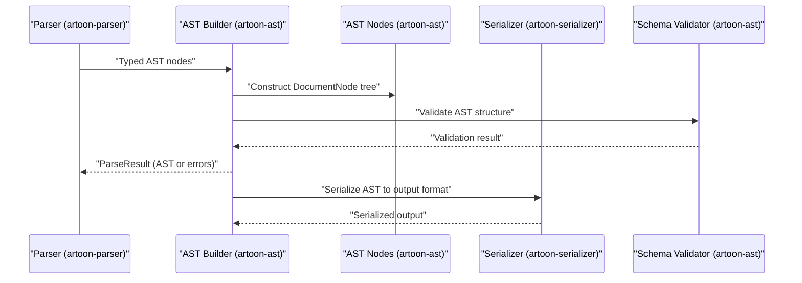
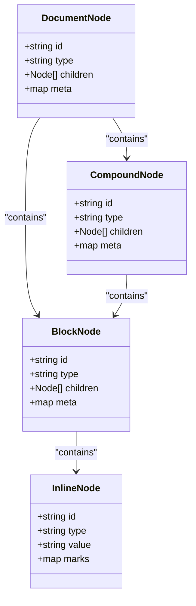
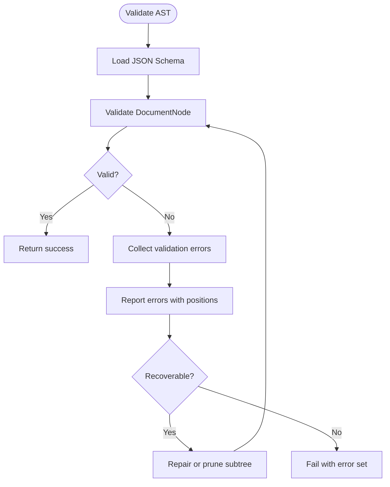
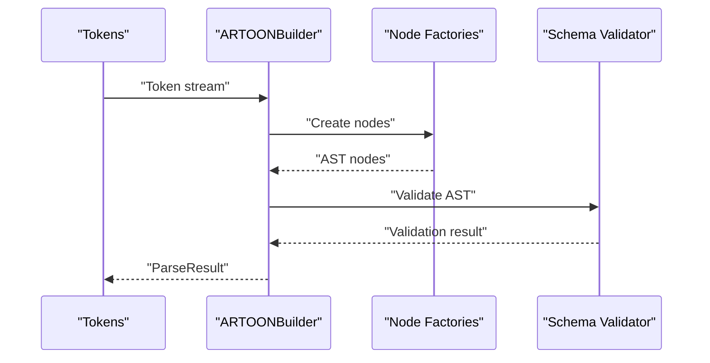
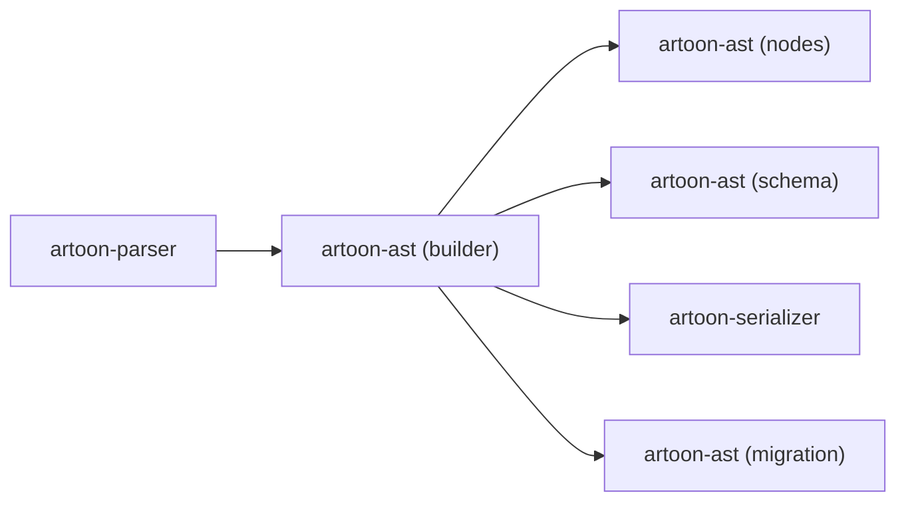

# AST Builder

<cite>
**Referenced Files in This Document**
- [ARTOONBuilder.ts](file://artoon-ast/src/builder/ARTOONBuilder.ts)
- [index.ts](file://artoon-ast/src/builder/index.ts)
- [types.ts](file://artoon-ast/src/types.ts)
- [index.ts](file://artoon-ast/src/nodes/index.ts)
- [index.ts](file://artoon-ast/src/schema/index.ts)
- [artoon-ast.schema.json](file://artoon-ast/src/schema/artoon-ast.schema.json)
- [index.ts](file://artoon-ast/src/serialize/index.ts)
- [index.ts](file://artoon-ast/src/unified/index.ts)
- [index.ts](file://artoon-ast/src/migration/index.ts)
- [builder.test.ts](file://artoon-ast/tests/builder.test.ts)
- [nodes.test.ts](file://artoon-ast/tests/nodes.test.ts)
- [serialize.test.ts](file://artoon-ast/tests/serialize.test.ts)
- [transform.test.ts](file://artoon-ast/tests/transform.test.ts)
- [compat.test.ts](file://artoon-ast/tests/compat.test.ts)
- [types.test.ts](file://artoon-ast/tests/types.test.ts)
- [parser-types.ts](file://artoon-ast/src/transform/parser-types.ts)
- [index.ts](file://artoon-parser/src/ast/index.ts)
- [types.ts](file://artoon-parser/src/ast/types.ts)
- [index.ts](file://artoon-parser/src/index.ts)
- [index.ts](file://artoon-parser/src/types.ts)
- [index.ts](file://artoon-parser/src/context/index.ts)
- [index.ts](file://artoon-parser/src/block/index.ts)
- [index.ts](file://artoon-parser/src/compound/index.ts)
- [index.ts](file://artoon-parser/src/table/index.ts)
- [index.ts](file://artoon-parser/src/inline/converter.ts)
- [index.ts](file://artoon-parser/src/lexer/index.ts)
- [index.ts](file://artoon-parser/src/errors/index.ts)
- [index.ts](file://artoon-parser/src/depth/index.ts)
- [index.ts](file://artoon-parser/src/inline/index.ts)
- [index.ts](file://artoon-parser/src/inline/converter.ts)
- [index.ts](file://artoon-parser/src/table/index.ts)
- [index.ts](file://artoon-parser/src/compound/index.ts)
- [index.ts](file://artoon-parser/src/block/index.ts)
- [index.ts](file://artoon-parser/src/context/index.ts)
- [index.ts](file://artoon-parser/src/depth/index.ts)
- [index.ts](file://artoon-parser/src/errors/index.ts)
- [index.ts](file://artoon-parser/src/inline/index.ts)
- [index.ts](file://artoon-parser/src/lexer/index.ts)
- [index.ts](file://artoon-parser/src/types.ts)
- [index.ts](file://artoon-parser/src/index.ts)
- [index.ts](file://artoon-serializer/src/nodes/index.ts)
- [index.ts](file://artoon-serializer/src/inline/index.ts)
- [index.ts](file://artoon-serializer/src/nodes/block.ts)
- [index.ts](file://artoon-serializer/src/nodes/code.ts)
- [index.ts](file://artoon-serializer/src/nodes/comment.ts)
- [index.ts](file://artoon-serializer/src/nodes/compound.ts)
- [index.ts](file://artoon-serializer/src/nodes/link.ts)
- [index.ts](file://artoon-serializer/src/nodes/list.ts)
- [index.ts](file://artoon-serializer/src/nodes/media.ts)
- [index.ts](file://artoon-serializer/src/nodes/separator.ts)
- [index.ts](file://artoon-serializer/src/nodes/table.ts)
- [index.ts](file://artoon-serializer/src/nodes/text.ts)
- [index.ts](file://artoon-serializer/src/index.ts)
- [index.ts](file://artoon-serializer/src/types.ts)
- [index.ts](file://artoon-serializer/src/inline/content.ts)
- [index.ts](file://artoon-serializer/src/nodes/index.ts)
- [index.ts](file://artoon-serializer/src/inline/index.ts)
- [index.ts](file://artoon-serializer/src/nodes/block.ts)
- [index.ts](file://artoon-serializer/src/nodes/code.ts)
- [index.ts](file://artoon-serializer/src/nodes/comment.ts)
- [index.ts](file://artoon-serializer/src/nodes/compound.ts)
- [index.ts](file://artoon-serializer/src/nodes/link.ts)
- [index.ts](file://artoon-serializer/src/nodes/list.ts)
- [index.ts](file://artoon-serializer/src/nodes/media.ts)
- [index.ts](file://artoon-serializer/src/nodes/separator.ts)
- [index.ts](file://artoon-serializer/src/nodes/table.ts)
- [index.ts](file://artoon-serializer/src/nodes/text.ts)
- [index.ts](file://artoon-serializer/src/index.ts)
- [index.ts](file://artoon-serializer/src/types.ts)
- [index.ts](file://artoon-serializer/src/inline/content.ts)
- [index.ts](file://artoon-serializer/src/nodes/index.ts)
- [index.ts](file://artoon-serializer/src/inline/index.ts)
- [index.ts](file://artoon-serializer/src/nodes/block.ts)
- [index.ts](file://artoon-serializer/src/nodes/code.ts)
- [index.ts](file://artoon-serializer/src/nodes/comment.ts)
- [index.ts](file://artoon-serializer/src/nodes/compound.ts)
- [index.ts](file://artoon-serializer/src/nodes/link.ts)
- [index.ts](file://artoon-serializer/src/nodes/list.ts)
- [index.ts](file://artoon-serializer/src/nodes/media.ts)
- [index.ts](file://artoon-serializer/src/nodes/separator.ts)
- [index.ts](file://artoon-serializer/src/nodes/table.ts)
- [index.ts](file://artoon-serializer/src/nodes/text.ts)
- [index.ts](file://artoon-serializer/src/index.ts)
- [index.ts](file://artoon-serializer/src/types.ts)
- [index.ts](file://artoon-serializer/src/inline/content.ts)
- [index.ts](file://artoon-serializer/src/nodes/index.ts)
- [index.ts](file://artoon-serializer/src/inline/index.ts)
- [index.ts](file://artoon-serializer/src/nodes/block.ts)
- [index.ts](file://artoon-serializer/src/nodes/code.ts)
- [index.ts](file://artoon-serializer/src/nodes/comment.ts)
- [index.ts](file://artoon-serializer/src/nodes/compound.ts)
- [index.ts](file://artoon-serializer/src/nodes/link.ts)
- [index.ts](file://artoon-serializer/src/nodes/list.ts)
- [index.ts](file://artoon-serializer/src/nodes/media.ts)
- [index.ts](file://artoon-serializer/src/nodes/separator.ts)
- [index.ts](file://artoon-serializer/src/nodes/table.ts)
- [index.ts](file://artoon-serializer/src/nodes/text.ts)
- [index.ts](file://artoon-serializer/src/index.ts)
- [index.ts](file://artoon-serializer/src/types.ts)
- [index.ts](file://artoon-serializer/src/inline/content.ts)
- [index.ts](file://artoon-serializer/src/nodes/index.ts)
- [index.ts](file://artoon-serializer/src/inline/index.ts)
- [index.ts](file://artoon-serializer/src/nodes/block.ts)
- [index.ts](file://artoon-serializer/src/nodes/code.ts)
- [index.ts](file://artoon-serializer/src/nodes/comment.ts)
- [index.ts](file://artoon-serializer/src/nodes/compound.ts)
- [index.ts](file://artoon-serializer/src/nodes/link.ts)
- [index.ts](file://artoon-serializer/src/nodes/list.ts)
- [index.ts](file://artoon-serializer/src/nodes/media.ts)
- [index.ts](file://artoon-serializer/src/nodes/separator.ts)
- [index.ts](file://artoon-serializer/src/nodes/table.ts)
- [index.ts](file://artoon-serializer/src/nodes/text.ts)
- [index.ts](file://artoon-serializer/src/index.ts)
- [index.ts](file://artoon-serializer/src/types.ts)
- [index.ts](file://artoon-serializer/src/inline/content.ts)
- [index.ts](file://artoon-serializer/src/nodes/index.ts)
- [index.ts](file://artoon-serializer/src/inline/index.ts)
- [index.ts](file://artoon-serializer/src/nodes/block.ts)
- [index.ts](file://artoon-serializer/src/nodes/code.ts)
- [index.ts](file://artoon-serializer/src/nodes/comment.ts)
- [index.ts](file://artoon-serializer/src/nodes/compound.ts)
- [index.ts](file://artoon-serializer/src/nodes/link.ts)
- [index.ts](file://artoon-serializer/src/nodes/list.ts)
- [index.ts](file://artoon-serializer/src/nodes/media.ts)
- [index.ts](file://artoon-serializer/src/nodes/separator.ts)
- [index.ts](file://artoon-serializer/src/nodes/table.ts)
- [index.ts](file://artoon-serializer/src/nodes/text.ts)
- [index.ts](file://artoon-serializer/src/index.ts)
- [index.ts](file://artoon-serializer/src/types.ts)
- [index.ts](file://artoon-serializer/src/inline/content.ts)
- [index.ts](file://artoon-serializer/src/nodes/index.ts)
- [index.ts](file://artoon-serializer/src/inline/index.ts)
- [index.ts](file://artoon-serializer/src/nodes/block.ts)
- [index.ts](file://artoon-serializer/src/nodes/code.ts)
- [index.ts](file://artoon-serializer/src/nodes/comment.ts)
- [index.ts](file://artoon-serializer/src/nodes/compound.ts)
- [index.ts](file://artoon-serializer/src/nodes/link.ts)
- [index.ts](file://artoon-serializer/src/nodes/list.ts)
- [index.ts](file://artoon-serializer......)
</cite>

## Table of Contents
1. [Introduction](#introduction)
2. [Project Structure](#project-structure)
3. [Core Components](#core-components)
4. [Architecture Overview](#architecture-overview)
5. [Detailed Component Analysis](#detailed-component-analysis)
6. [Dependency Analysis](#dependency-analysis)
7. [Performance Considerations](#performance-considerations)
8. [Troubleshooting Guide](#troubleshooting-guide)
9. [Conclusion](#conclusion)
10. [Appendices](#appendices)

## Introduction
This document explains the ARTOON AST Builder module and its role in constructing canonical Abstract Syntax Tree nodes from parsed tokens. It focuses on the AST construction pipeline, the buildAST() function, the ParseResult structure, and the DocumentNode interface. It also documents AST node types, their properties and relationships, validation and error reporting, recovery strategies, serialization compatibility, traversal patterns, and practical guidance for extending the AST structure.

## Project Structure
The ARTOON AST Builder resides in the artoon-ast package. Its primary responsibilities include:
- Building AST nodes from parser outputs
- Providing typed AST node definitions and contracts
- Supporting serialization and interoperability
- Enabling transformations and migrations

Key areas:
- builder: AST construction and fluent builder APIs
- nodes: AST node type definitions and factories
- schema: JSON Schema for AST structure and validation
- serialize: serialization adapters and serializers
- transform: parser-type conversions and bridging
- unified: integration with unified ecosystem
- migration: migration utilities for evolving AST formats
- tests: unit tests validating AST behavior

**Diagram sources**
- [ARTOONBuilder.ts](file://artoon-ast/src/builder/ARTOONBuilder.ts)
- [index.ts](file://artoon-ast/src/builder/index.ts)
- [index.ts](file://artoon-ast/src/nodes/index.ts)
- [artoon-ast.schema.json](file://artoon-ast/src/schema/artoon-ast.schema.json)
- [index.ts](file://artoon-ast/src/serialize/index.ts)
- [parser-types.ts](file://artoon-ast/src/transform/parser-types.ts)
- [index.ts](file://artoon-ast/src/unified/index.ts)
- [index.ts](file://artoon-ast/src/migration/index.ts)
- [types.ts](file://artoon-ast/src/types.ts)
- [index.ts](file://artoon-parser/src/index.ts)
- [index.ts](file://artoon-parser/src/types.ts)
- [index.ts](file://artoon-parser/src/ast/index.ts)
- [types.ts](file://artoon-parser/src/ast/types.ts)
- [index.ts](file://artoon-serializer/src/nodes/index.ts)
- [index.ts](file://artoon-serializer/src/inline/index.ts)

**Section sources**
- [index.ts](file://artoon-ast/src/builder/index.ts)
- [ARTOONBuilder.ts](file://artoon-ast/src/builder/ARTOONBuilder.ts)
- [index.ts](file://artoon-ast/src/nodes/index.ts)
- [index.ts](file://artoon-ast/src/schema/index.ts)
- [artoon-ast.schema.json](file://artoon-ast/src/schema/artoon-ast.schema.json)
- [index.ts](file://artoon-ast/src/serialize/index.ts)
- [index.ts](file://artoon-ast/src/unified/index.ts)
- [index.ts](file://artoon-ast/src/migration/index.ts)
- [types.ts](file://artoon-ast/src/types.ts)
- [parser-types.ts](file://artoon-ast/src/transform/parser-types.ts)
- [index.ts](file://artoon-parser/src/index.ts)
- [index.ts](file://artoon-parser/src/types.ts)
- [index.ts](file://artoon-parser/src/ast/index.ts)
- [types.ts](file://artoon-parser/src/ast/types.ts)
- [index.ts](file://artoon-serializer/src/nodes/index.ts)
- [index.ts](file://artoon-serializer/src/inline/index.ts)

## Core Components
- AST Construction Pipeline
  - The pipeline consumes tokens and parser outputs and produces canonical AST nodes via the builder.
  - The builder exposes a fluent API to construct nodes and assemble a DocumentNode tree.
- Build Function
  - The buildAST() function orchestrates the construction process, mapping parser tokens to AST nodes and wiring parent-child relationships.
- ParseResult
  - A typed container capturing either a successful AST or a list of errors encountered during parsing/building.
- DocumentNode Interface
  - The root interface representing the canonical AST, defining node identity, type, children, and metadata.

Key artifacts:
- AST node types and factories are defined under nodes/index.ts.
- The builder implementation is in builder/ARTOONBuilder.ts.
- Typed AST contracts and shared types live in types.ts.
- JSON Schema for AST validation is provided by schema/artoon-ast.schema.json.
- Serialization and interoperability are handled by serialize/index.ts and serializer adapters.

**Section sources**
- [ARTOONBuilder.ts](file://artoon-ast/src/builder/ARTOONBuilder.ts)
- [index.ts](file://artoon-ast/src/builder/index.ts)
- [index.ts](file://artoon-ast/src/nodes/index.ts)
- [types.ts](file://artoon-ast/src/types.ts)
- [artoon-ast.schema.json](file://artoon-ast/src/schema/artoon-ast.schema.json)
- [index.ts](file://artoon-ast/src/serialize/index.ts)

## Architecture Overview
The AST Builder integrates tightly with the parser and serializer ecosystems. The parser emits typed AST nodes; the builder composes them into a canonical DocumentNode tree; the serializer renders them to target formats; and the schema validates structural correctness.

**Diagram sources**
- [index.ts](file://artoon-parser/src/index.ts)
- [types.ts](file://artoon-parser/src/types.ts)
- [index.ts](file://artoon-parser/src/ast/index.ts)
- [types.ts](file://artoon-parser/src/ast/types.ts)
- [ARTOONBuilder.ts](file://artoon-ast/src/builder/ARTOONBuilder.ts)
- [index.ts](file://artoon-ast/src/nodes/index.ts)
- [index.ts](file://artoon-ast/src/schema/index.ts)
- [artoon-ast.schema.json](file://artoon-ast/src/schema/artoon-ast.schema.json)
- [index.ts](file://artoon-ast/src/serialize/index.ts)
- [index.ts](file://artoon-serializer/src/nodes/index.ts)
- [index.ts](file://artoon-serializer/src/inline/index.ts)

## Detailed Component Analysis

### AST Node Types and Properties
AST nodes represent ARTOON syntax constructs. They share common characteristics:
- Identity: unique identifiers per node
- Type: discriminant indicating node kind
- Children: ordered child nodes forming a tree
- Metadata: optional attributes such as alignment, language, or flags

Representative node kinds include:
- DocumentNode: root node
- Block nodes: paragraphs, headings, lists, code blocks, tables, comments, separators
- Compound nodes: nested or grouped constructs
- Inline nodes: text, links, marks, and inline semantics

Node factories and type definitions are exported from nodes/index.ts. These define shapes and relationships used by the builder.

**Diagram sources**
- [index.ts](file://artoon-ast/src/nodes/index.ts)

**Section sources**
- [index.ts](file://artoon-ast/src/nodes/index.ts)

### AST Validation and Error Reporting
Validation ensures ASTs conform to the canonical schema:
- JSON Schema validation checks structural integrity and required fields.
- Error reporting aggregates validation failures with contextual positions.
- Recovery strategies include skipping invalid subtrees, substituting safe defaults, or truncating malformed branches.

The schema is defined in schema/artoon-ast.schema.json and consumed by the builder and tests.

**Diagram sources**
- [artoon-ast.schema.json](file://artoon-ast/src/schema/artoon-ast.schema.json)
- [index.ts](file://artoon-ast/src/schema/index.ts)

**Section sources**
- [artoon-ast.schema.json](file://artoon-ast/src/schema/artoon-ast.schema.json)
- [index.ts](file://artoon-ast/src/schema/index.ts)

### AST Construction Pipeline and buildAST()
The buildAST() function orchestrates construction:
- Accepts parser outputs and tokens
- Creates nodes via node factories
- Wires parent-child relationships
- Applies validation and error reporting
- Returns a ParseResult containing either the AST or a list of errors

**Diagram sources**
- [ARTOONBuilder.ts](file://artoon-ast/src/builder/ARTOONBuilder.ts)
- [index.ts](file://artoon-ast/src/nodes/index.ts)
- [index.ts](file://artoon-ast/src/schema/index.ts)

**Section sources**
- [ARTOONBuilder.ts](file://artoon-ast/src/builder/ARTOONBuilder.ts)
- [index.ts](file://artoon-ast/src/builder/index.ts)

### ParseResult Structure
ParseResult encapsulates outcomes:
- Success: holds the constructed DocumentNode
- Failure: holds a list of errors with severity, message, and location

Tests demonstrate usage patterns for both success and failure scenarios.

**Section sources**
- [types.ts](file://artoon-ast/src/types.ts)
- [builder.test.ts](file://artoon-ast/tests/builder.test.ts)

### DocumentNode Interface
DocumentNode defines the canonical AST root:
- Unique identifier
- Discriminator type
- Ordered children
- Optional metadata map

It serves as the contract for downstream consumers (renderer, serializer, validator).

**Section sources**
- [types.ts](file://artoon-ast/src/types.ts)
- [index.ts](file://artoon-ast/src/nodes/index.ts)

### Examples of Parsing ARTOON Constructs
Below are representative examples of ARTOON constructs and their expected AST structures. These illustrate how the builder maps tokens to nodes.

- Text and Inline Semantics
  - Example: inline text with emphasis and links
  - AST: a paragraph block containing inline nodes with marks and link nodes
- Lists
  - Example: ordered and unordered lists with nested items
  - AST: list block with list item children; nested lists represented as children
- Code Blocks
  - Example: fenced code with language metadata
  - AST: code block node with language attribute and literal content
- Tables
  - Example: table with headers, rows, and cells
  - AST: table block with row and cell children
- Comments and Separators
  - Example: thematic break and comment markers
  - AST: separator and comment nodes as standalone blocks
- Compound Blocks
  - Example: nested compound constructs
  - AST: compound nodes containing nested blocks

These examples are validated by tests and demonstrated in the serializer and parser integrations.

**Section sources**
- [builder.test.ts](file://artoon-ast/tests/builder.test.ts)
- [serialize.test.ts](file://artoon-ast/tests/serialize.test.ts)
- [transform.test.ts](file://artoon-ast/tests/transform.test.ts)
- [index.ts](file://artoon-serializer/src/nodes/block.ts)
- [index.ts](file://artoon-serializer/src/nodes/code.ts)
- [index.ts](file://artoon-serializer/src/nodes/comment.ts)
- [index.ts](file://artoon-serializer/src/nodes/compound.ts)
- [index.ts](file://artoon-serializer/src/nodes/link.ts)
- [index.ts](file://artoon-serializer/src/nodes/list.ts)
- [index.ts](file://artoon-serializer/src/nodes/media.ts)
- [index.ts](file://artoon-serializer/src/nodes/separator.ts)
- [index.ts](file://artoon-serializer/src/nodes/table.ts)
- [index.ts](file://artoon-serializer/src/nodes/text.ts)

### AST Traversal Methods
Common traversal patterns:
- Depth-first post-order: visit children before parents (useful for serialization)
- Breadth-first: level-wise traversal (useful for rendering)
- Filtered traversal: collect nodes by type or predicate

Traversal is straightforward due to the DocumentNode.children array and recursive composition.

**Section sources**
- [types.ts](file://artoon-ast/src/types.ts)
- [index.ts](file://artoon-ast/src/nodes/index.ts)

### Serialization Compatibility
Serialization targets:
- HTML rendering via serializer adapters
- Round-trip compatibility with parser outputs
- Schema-driven validation to maintain compatibility

The serializer module provides adapters for block, inline, and compound nodes, ensuring consistent output across formats.

**Section sources**
- [index.ts](file://artoon-ast/src/serialize/index.ts)
- [index.ts](file://artoon-serializer/src/nodes/index.ts)
- [index.ts](file://artoon-serializer/src/inline/index.ts)

### Working Programmatically with AST Nodes
Guidance:
- Use node factories from nodes/index.ts to create canonical nodes
- Compose nodes into a DocumentNode tree
- Apply transforms via transform/parser-types.ts to bridge parser outputs
- Validate with schema and handle errors via ParseResult
- Traverse and manipulate nodes using standard array operations on children

**Section sources**
- [index.ts](file://artoon-ast/src/nodes/index.ts)
- [parser-types.ts](file://artoon-ast/src/transform/parser-types.ts)
- [index.ts](file://artoon-ast/src/schema/index.ts)
- [types.ts](file://artoon-ast/src/types.ts)

### Extending the AST Structure
Extensibility strategies:
- Define new node types in nodes/index.ts with unique types and required fields
- Update JSON Schema to include new node shapes and constraints
- Provide serializer adapters for new node kinds
- Add parser bridges in transform/parser-types.ts to convert parser outputs to new AST nodes
- Maintain backward compatibility and migration paths via migration/index.ts

**Section sources**
- [index.ts](file://artoon-ast/src/nodes/index.ts)
- [artoon-ast.schema.json](file://artoon-ast/src/schema/artoon-ast.schema.json)
- [index.ts](file://artoon-ast/src/serialize/index.ts)
- [parser-types.ts](file://artoon-ast/src/transform/parser-types.ts)
- [index.ts](file://artoon-ast/src/migration/index.ts)

## Dependency Analysis
The AST Builder depends on:
- Parser outputs for typed AST nodes
- Node factories for canonical node creation
- Schema for validation
- Serializer for output generation
- Migration utilities for evolving formats

**Diagram sources**
- [index.ts](file://artoon-parser/src/index.ts)
- [ARTOONBuilder.ts](file://artoon-ast/src/builder/ARTOONBuilder.ts)
- [index.ts](file://artoon-ast/src/nodes/index.ts)
- [index.ts](file://artoon-ast/src/schema/index.ts)
- [index.ts](file://artoon-ast/src/serialize/index.ts)
- [index.ts](file://artoon-ast/src/migration/index.ts)

**Section sources**
- [index.ts](file://artoon-parser/src/index.ts)
- [ARTOONBuilder.ts](file://artoon-ast/src/builder/ARTOONBuilder.ts)
- [index.ts](file://artoon-ast/src/nodes/index.ts)
- [index.ts](file://artoon-ast/src/schema/index.ts)
- [index.ts](file://artoon-ast/src/serialize/index.ts)
- [index.ts](file://artoon-ast/src/migration/index.ts)

## Performance Considerations
- Prefer batched construction to minimize intermediate allocations
- Use immutable node updates when modifying trees
- Validate only at boundaries (parse-time and export-time) to reduce overhead
- Cache frequently accessed node factories and serializers
- Avoid deep cloning unless necessary; leverage structural sharing where feasible

## Troubleshooting Guide
Common issues and resolutions:
- Invalid AST structure
  - Cause: missing required fields or incorrect types
  - Resolution: align with schema; add missing fields; correct node types
- Parser mismatch
  - Cause: parser output types not mapped to AST nodes
  - Resolution: update transform/parser-types.ts; add mapping for new constructs
- Serialization errors
  - Cause: unhandled node types or missing serializer adapters
  - Resolution: implement serializer adapters; validate with schema
- Recovery after errors
  - Strategy: skip invalid subtrees; substitute safe defaults; continue building

Validation and error reporting are exercised by tests to ensure robustness.

**Section sources**
- [compat.test.ts](file://artoon-ast/tests/compat.test.ts)
- [builder.test.ts](file://artoon-ast/tests/builder.test.ts)
- [serialize.test.ts](file://artoon-ast/tests/serialize.test.ts)
- [types.test.ts](file://artoon-ast/tests/types.test.ts)

## Conclusion
The ARTOON AST Builder provides a robust, schema-driven mechanism to transform parser outputs into canonical AST nodes. It offers strong typing, validation, serialization compatibility, and extensibility, enabling reliable downstream processing and rendering. By following the patterns documented here, developers can confidently construct, validate, traverse, and extend ARTOON ASTs.

## Appendices
- Test coverage demonstrates:
  - AST construction correctness
  - Schema validation behavior
  - Serialization fidelity
  - Parser-to-AST mapping accuracy
  - Compatibility across versions

**Section sources**
- [builder.test.ts](file://artoon-ast/tests/builder.test.ts)
- [nodes.test.ts](file://artoon-ast/tests/nodes.test.ts)
- [serialize.test.ts](file://artoon-ast/tests/serialize.test.ts)
- [transform.test.ts](file://artoon-ast/tests/transform.test.ts)
- [compat.test.ts](file://artoon-ast/tests/compat.test.ts)
- [types.test.ts](file://artoon-ast/tests/types.test.ts)