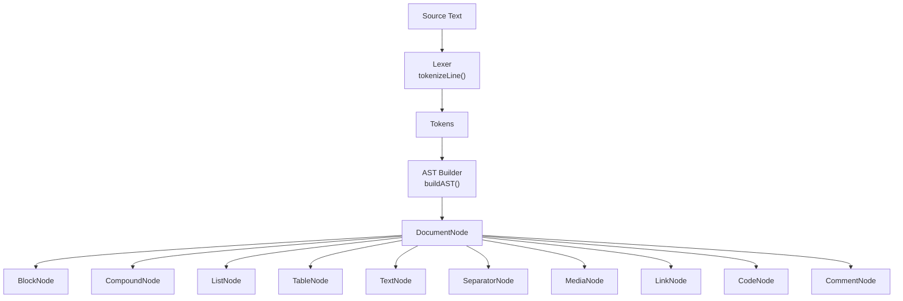
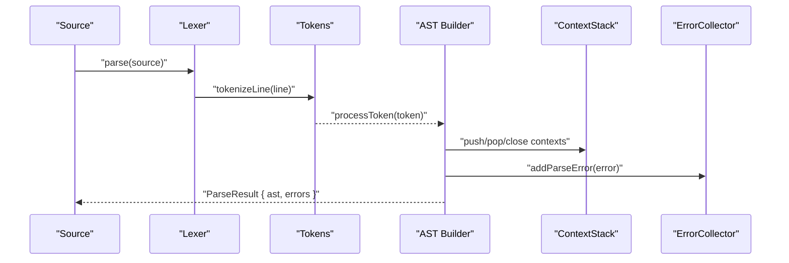
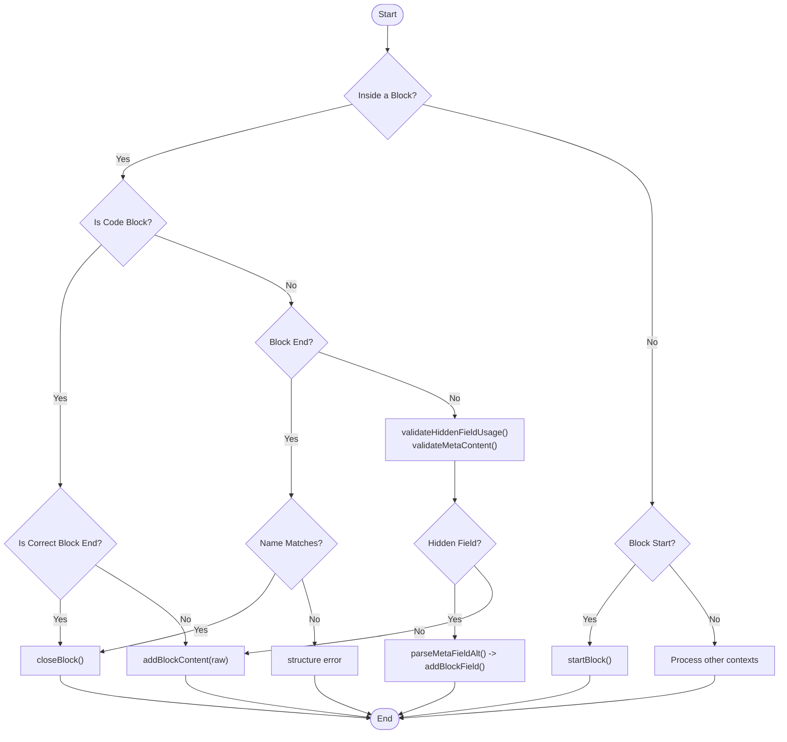
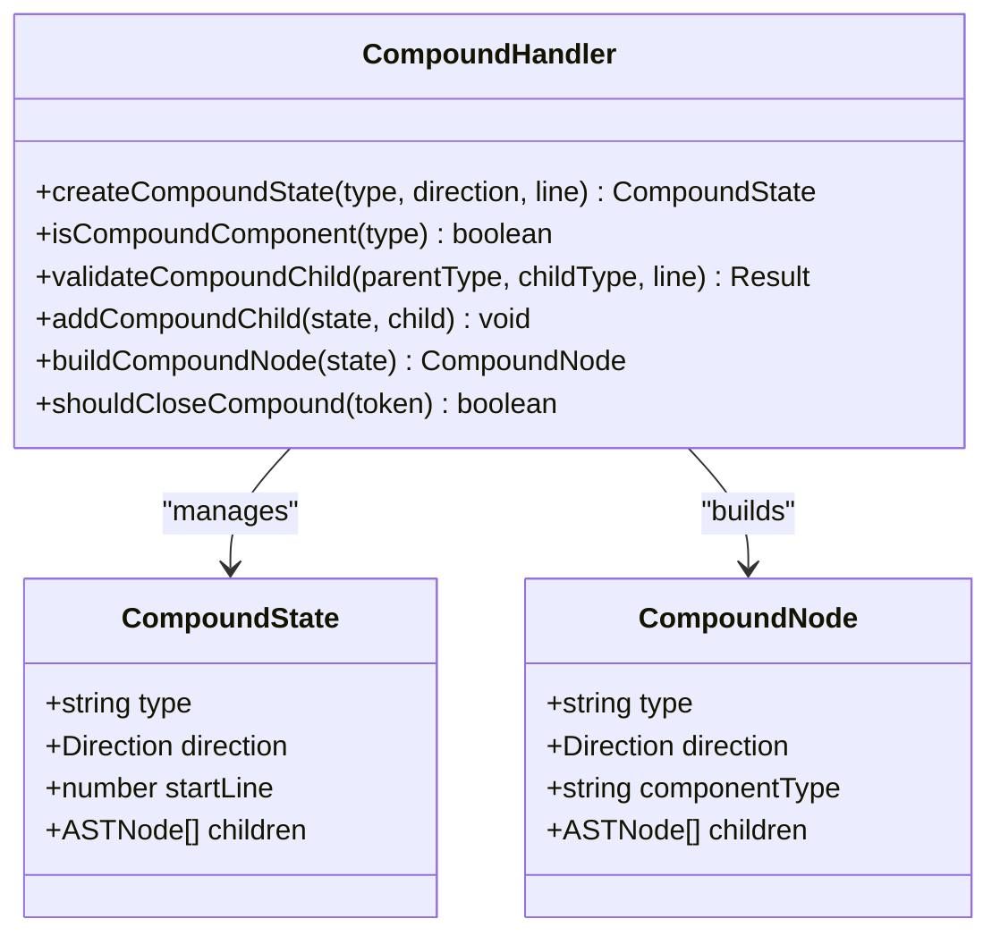
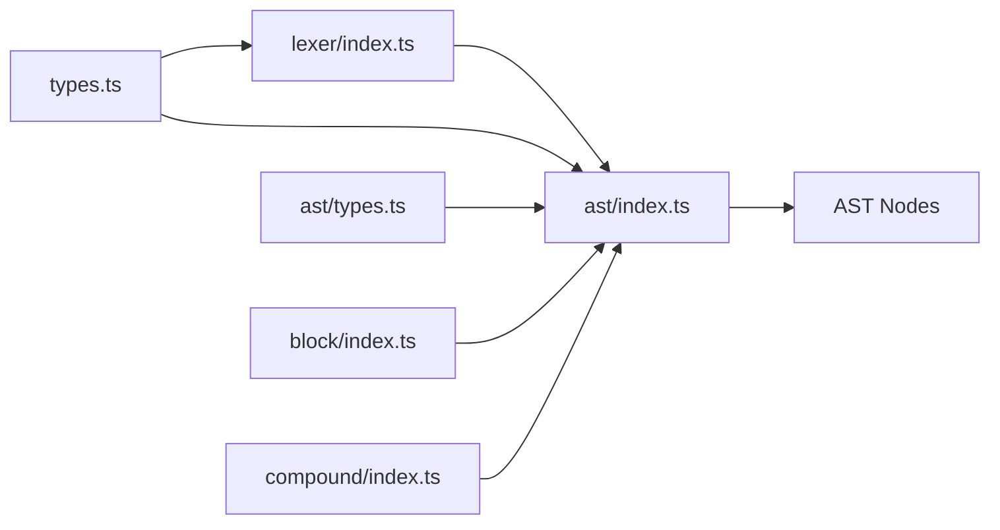

# Block Parsing

<cite>
**Referenced Files in This Document**
- [index.ts](file://artoon-parser/src/index.ts)
- [lexer/index.ts](file://artoon-parser/src/lexer/index.ts)
- [ast/index.ts](file://artoon-parser/src/ast/index.ts)
- [ast/types.ts](file://artoon-parser/src/ast/types.ts)
- [block/index.ts](file://artoon-parser/src/block/index.ts)
- [compound/index.ts](file://artoon-parser/src/compound/index.ts)
- [types.ts](file://artoon-parser/src/types.ts)
- [07-BLOCKS.md](file://Core Invariants/07-BLOCKS.md)
- [08-RESERVED-BLOCKS.md](file://Core Invariants/08-RESERVED-BLOCKS.md)
- [01-meta-block.artoon](file://artoon-examples/test-blocks/01-meta-block.artoon)
- [02-code-block.artoon](file://artoon-examples/test-blocks/02-code-block.artoon)
- [12-section-block.artoon](file://artoon-examples/test-blocks/12-section-block.artoon)
</cite>

## Table of Contents
1. [Introduction](#introduction)
2. [Project Structure](#project-structure)
3. [Core Components](#core-components)
4. [Architecture Overview](#architecture-overview)
5. [Detailed Component Analysis](#detailed-component-analysis)
6. [Dependency Analysis](#dependency-analysis)
7. [Performance Considerations](#performance-considerations)
8. [Troubleshooting Guide](#troubleshooting-guide)
9. [Conclusion](#conclusion)

## Introduction
This document explains ARTOON’s block-level parsing system that recognizes and constructs content units such as paragraphs, headings, lists, tables, and compound components. It covers block detection algorithms, parsing strategies, block type identification, supported block types, syntax patterns, parsing rules, nesting semantics, validation requirements, error handling, and performance considerations for large documents.

## Project Structure
The block parsing pipeline is implemented in the parser module and integrates with core invariants and examples:
- Parser entry and exports: [index.ts](file://artoon-parser/src/index.ts)
- Lexical analysis (line tokenization): [lexer/index.ts](file://artoon-parser/src/lexer/index.ts)
- AST construction and block handling: [ast/index.ts](file://artoon-parser/src/ast/index.ts)
- AST and token types: [ast/types.ts](file://artoon-parser/src/ast/types.ts)
- Block-level handlers and validations: [block/index.ts](file://artoon-parser/src/block/index.ts)
- Compound component handling: [compound/index.ts](file://artoon-parser/src/compound/index.ts)
- Component and modifier type definitions: [types.ts](file://artoon-parser/src/types.ts)
- Core invariants and syntax rules: [07-BLOCKS.md](file://Core Invariants/07-BLOCKS.md), [08-RESERVED-BLOCKS.md](file://Core Invariants/08-RESERVED-BLOCKS.md)
- Example blocks: [01-meta-block.artoon](file://artoon-examples/test-blocks/01-meta-block.artoon), [02-code-block.artoon](file://artoon-examples/test-blocks/02-code-block.artoon), [12-section-block.artoon](file://artoon-examples/test-blocks/12-section-block.artoon)

**Diagram sources**
- [lexer/index.ts:10-77](file://artoon-parser/src/lexer/index.ts#L10-L77)
- [ast/index.ts:70-84](file://artoon-parser/src/ast/index.ts#L70-L84)
- [ast/types.ts:109-116](file://artoon-parser/src/ast/types.ts#L109-L116)

**Section sources**
- [index.ts:56-59](file://artoon-parser/src/index.ts#L56-L59)
- [lexer/index.ts:400-403](file://artoon-parser/src/lexer/index.ts#L400-L403)
- [ast/index.ts:70-84](file://artoon-parser/src/ast/index.ts#L70-L84)

## Core Components
- Lexer: Converts each input line into a structured Token with directional, component, and block metadata.
- AST Builder: Consumes tokens to construct a typed AST, managing block, compound, list, table, and inline content contexts.
- Block Handler: Manages reserved and custom blocks, including meta and code blocks, with strict validation rules.
- Compound Handler: Validates and builds compound components (figure, details) with allowed children and closing semantics.
- Types: Defines component categories, modifiers, and AST node shapes.

Key responsibilities:
- Detect block boundaries and language hints.
- Enforce reserved block semantics (meta and code).
- Validate hidden fields and child element usage.
- Support nested lists, tables, and compounds.
- Produce a canonical AST for downstream rendering.

**Section sources**
- [lexer/index.ts:10-77](file://artoon-parser/src/lexer/index.ts#L10-L77)
- [ast/index.ts:70-256](file://artoon-parser/src/ast/index.ts#L70-L256)
- [block/index.ts:38-193](file://artoon-parser/src/block/index.ts#L38-L193)
- [compound/index.ts:23-104](file://artoon-parser/src/compound/index.ts#L23-L104)
- [types.ts:58-122](file://artoon-parser/src/types.ts#L58-L122)

## Architecture Overview
The block parsing pipeline proceeds in two stages:
1. Lexing: Each line is tokenized into a Token carrying direction, component type, depth, and block markers.
2. AST Building: Tokens are processed sequentially, maintaining stacks for block, table, compound, and list contexts. Block content is captured according to reserved semantics.

**Diagram sources**
- [index.ts:56-59](file://artoon-parser/src/index.ts#L56-L59)
- [lexer/index.ts:10-77](file://artoon-parser/src/lexer/index.ts#L10-L77)
- [ast/index.ts:70-84](file://artoon-parser/src/ast/index.ts#L70-L84)
- [ast/types.ts:243-257](file://artoon-parser/src/ast/types.ts#L243-L257)

## Detailed Component Analysis

### Block Detection and Reserved Blocks
- Reserved blocks:
  - code: Captures raw content without ARTOON parsing; supports optional language hint.
  - meta: Accepts only hidden fields (>.-:field: value) and is hidden in HTML output.
- Custom blocks: Any other block name is treated as a custom block with normal ARTOON parsing and child element support.

Detection logic:
- Block start: Lines starting with "<name>." or "<name:lang>." where name is validated.
- Block end: Lines starting with ".<name>" matching the current block.
- Validation ensures block end names match the start name and that hidden fields are only used inside meta.

Supported block types:
- Reserved: code, meta
- Custom: arbitrary names (e.g., section, header, card, alert, etc.)

Syntax patterns:
- Start: "<blockname>." or "<blockname:lang>."
- End: ".<blockname>"
- Hidden fields (meta only): ">.-:fieldname: value"
- Child elements (all blocks): ">.-child:: content"

Validation and error handling:
- Mismatched block end yields a structure error with a suggested correction.
- Hidden fields outside meta produce constraint errors.
- META blocks must not contain visible child elements or regular content.

Examples:
- Meta block: [01-meta-block.artoon](file://artoon-examples/test-blocks/01-meta-block.artoon)
- Code block: [02-code-block.artoon](file://artoon-examples/test-blocks/02-code-block.artoon)
- Custom section block: [12-section-block.artoon](file://artoon-examples/test-blocks/12-section-block.artoon)

**Section sources**
- [block/index.ts:12-134](file://artoon-parser/src/block/index.ts#L12-L134)
- [block/index.ts:198-216](file://artoon-parser/src/block/index.ts#L198-L216)
- [block/index.ts:260-316](file://artoon-parser/src/block/index.ts#L260-L316)
- [lexer/index.ts:282-344](file://artoon-parser/src/lexer/index.ts#L282-L344)
- [07-BLOCKS.md:26-54](file://Core Invariants/07-BLOCKS.md#L26-L54)
- [08-RESERVED-BLOCKS.md:32-106](file://Core Invariants/08-RESERVED-BLOCKS.md#L32-L106)

### Lexer: Line Tokenization
The lexer identifies:
- Block start/end markers
- Direction markers and depth indicators
- Component declarations and child elements
- Comments and separator-only lines
- Combined separators (e.g., "br;hr;br")

Key behaviors:
- Validates block names via a simple pattern.
- Distinguishes child elements (>.-...) from component declarations.
- Supports hidden fields for meta blocks during tokenization.

**Section sources**
- [lexer/index.ts:10-77](file://artoon-parser/src/lexer/index.ts#L10-L77)
- [lexer/index.ts:82-277](file://artoon-parser/src/lexer/index.ts#L82-L277)
- [lexer/index.ts:282-344](file://artoon-parser/src/lexer/index.ts#L282-L344)
- [lexer/index.ts:400-483](file://artoon-parser/src/lexer/index.ts#L400-L483)

### AST Builder: Block Processing
The AST builder maintains:
- ContextStack for block/table/compound/list scopes
- Current block/table/compound/list state
- Error collection

Processing logic:
- When inside a block:
  - For code blocks: capture raw lines until the matching end marker.
  - For other blocks: validate hidden field usage and meta content rules, parse hidden fields, and store raw content for later inline parsing.
- On encountering block end tokens, close the current block and attach to the document or meta slot.
- After processing, finalize state by closing any unclosed contexts and reporting warnings/errors.

**Diagram sources**
- [ast/index.ts:316-394](file://artoon-parser/src/ast/index.ts#L316-L394)
- [block/index.ts:346-375](file://artoon-parser/src/block/index.ts#L346-L375)

**Section sources**
- [ast/index.ts:70-256](file://artoon-parser/src/ast/index.ts#L70-L256)
- [ast/index.ts:316-394](file://artoon-parser/src/ast/index.ts#L316-L394)
- [block/index.ts:113-154](file://artoon-parser/src/block/index.ts#L113-L154)
- [block/index.ts:346-375](file://artoon-parser/src/block/index.ts#L346-L375)

### Compound Components
Compound components (figure, details) are handled with:
- Allowed children per component type
- Closing semantics when a non-child component or block boundary occurs
- Validation of child types and completeness checks (e.g., details requires summary)

**Diagram sources**
- [compound/index.ts:23-104](file://artoon-parser/src/compound/index.ts#L23-L104)
- [ast/types.ts:100-104](file://artoon-parser/src/ast/types.ts#L100-L104)

**Section sources**
- [compound/index.ts:15-170](file://artoon-parser/src/compound/index.ts#L15-L170)
- [ast/index.ts:448-539](file://artoon-parser/src/ast/index.ts#L448-L539)

### Supported Block Types and Parsing Rules
- Paragraphs and headings: p, t1–t6, q, pre
- Links and media: a, img, video, audio, file
- Separators: br, hr, wbr
- Lists: ul, ol, dl, li, dt, dd
- Tables: table, th, tr
- Compound: figure, details
- Code: c (inline code)
- Reserved blocks: code, meta
- Custom blocks: arbitrary names

Parsing rules:
- Component types are categorized by capability (modifiers, separators, compound children).
- Depth and direction are preserved per token and inherited by children where applicable.
- Lists support implicit and explicit nesting; tables require header and row syntax; compounds enforce child type constraints.

**Section sources**
- [types.ts:13-122](file://artoon-parser/src/types.ts#L13-L122)
- [ast/types.ts:65-164](file://artoon-parser/src/ast/types.ts#L65-L164)
- [07-BLOCKS.md:235-296](file://Core Invariants/07-BLOCKS.md#L235-L296)

### Examples of Block Types and Parsing Behavior
- Meta block: Hidden fields parsed into BlockNode fields; content restricted to hidden fields.
  - Example: [01-meta-block.artoon](file://artoon-examples/test-blocks/01-meta-block.artoon)
- Code block: Raw content stored; language hint supported; ARTOON parsing disabled.
  - Example: [02-code-block.artoon](file://artoon-examples/test-blocks/02-code-block.artoon)
- Custom section block: Normal ARTOON parsing; supports nested lists, tables, and child elements.
  - Example: [12-section-block.artoon](file://artoon-examples/test-blocks/12-section-block.artoon)

**Section sources**
- [block/index.ts:166-193](file://artoon-parser/src/block/index.ts#L166-L193)
- [ast/index.ts:380-394](file://artoon-parser/src/ast/index.ts#L380-L394)
- [01-meta-block.artoon:1-11](file://artoon-examples/test-blocks/01-meta-block.artoon#L1-L11)
- [02-code-block.artoon:16-24](file://artoon-examples/test-blocks/02-code-block.artoon#L16-L24)
- [12-section-block.artoon:16-41](file://artoon-examples/test-blocks/12-section-block.artoon#L16-L41)

## Dependency Analysis
The block parsing system depends on:
- Lexer for accurate tokenization
- AST types for node shape definitions
- Context management for nested structures
- Inline parsing for converting textual content into inline nodes
- Compound and table handlers for specialized structures

**Diagram sources**
- [lexer/index.ts:4-5](file://artoon-parser/src/lexer/index.ts#L4-L5)
- [ast/index.ts:5-29](file://artoon-parser/src/ast/index.ts#L5-L29)
- [types.ts:1-123](file://artoon-parser/src/types.ts#L1-L123)
- [ast/types.ts:14-55](file://artoon-parser/src/ast/types.ts#L14-L55)
- [block/index.ts:4-5](file://artoon-parser/src/block/index.ts#L4-L5)
- [compound/index.ts:4-5](file://artoon-parser/src/compound/index.ts#L4-L5)

**Section sources**
- [ast/index.ts:1-32](file://artoon-parser/src/ast/index.ts#L1-L32)
- [lexer/index.ts:4-5](file://artoon-parser/src/lexer/index.ts#L4-L5)

## Performance Considerations
- Linear pass: The pipeline processes tokens in a single linear scan, O(n) with respect to the number of lines.
- Minimal allocations: Tokens are lightweight structures; AST nodes are constructed incrementally.
- Early exits: Reserved block handling short-circuits ARTOON parsing for code content.
- Context stacks: Manage block/table/compound/list scopes with predictable growth proportional to nesting depth.
- Recommendations:
  - Prefer streaming tokenization for very large documents.
  - Avoid excessive nesting to limit stack depth.
  - Use batched processing for multi-document workflows.

[No sources needed since this section provides general guidance]

## Troubleshooting Guide
Common issues and resolutions:
- Unexpected block end: Indicates mismatched block name or missing start. The parser reports a structure error with a suggested correction.
  - Reference: [ast/index.ts:108-115](file://artoon-parser/src/ast/index.ts#L108-L115)
- Hidden field outside meta: Hidden fields are only valid inside meta blocks; the parser reports a constraint error.
  - Reference: [block/index.ts:260-278](file://artoon-parser/src/block/index.ts#L260-L278)
- META block contains visible content: Only hidden fields are allowed; the parser reports a constraint error.
  - Reference: [block/index.ts:283-316](file://artoon-parser/src/block/index.ts#L283-L316)
- Unclosed block at EOF: The parser finalizes state and reports a structure error with a suggestion to add the missing end marker.
  - Reference: [ast/index.ts:768-775](file://artoon-parser/src/ast/index.ts#L768-L775)
- Compound implicitly closed: The parser warns and closes the compound gracefully.
  - Reference: [ast/index.ts:782-789](file://artoon-parser/src/ast/index.ts#L782-L789)

**Section sources**
- [ast/index.ts:108-115](file://artoon-parser/src/ast/index.ts#L108-L115)
- [block/index.ts:260-316](file://artoon-parser/src/block/index.ts#L260-L316)
- [ast/index.ts:768-789](file://artoon-parser/src/ast/index.ts#L768-L789)

## Conclusion
The ARTOON block parsing system provides a robust, extensible foundation for recognizing and constructing block-level content. It enforces strict semantics for reserved blocks, supports flexible custom blocks, and integrates seamlessly with compound components, lists, and tables. The design emphasizes correctness, maintainability, and performance, with clear validation and error reporting to guide authors and tooling.