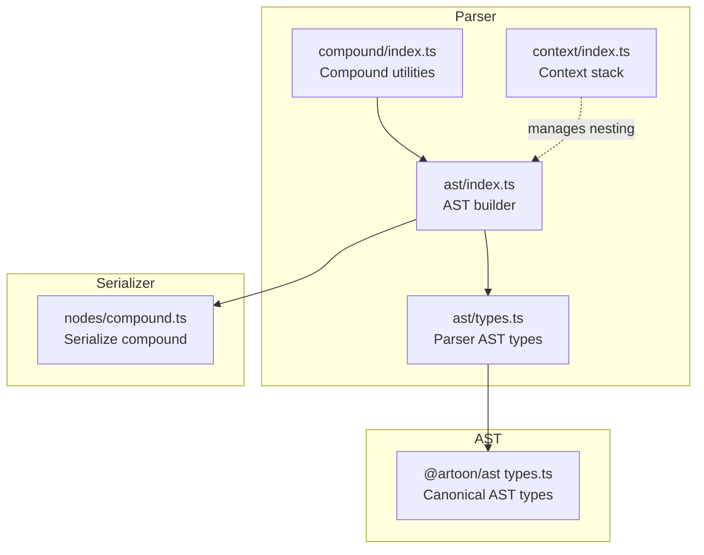
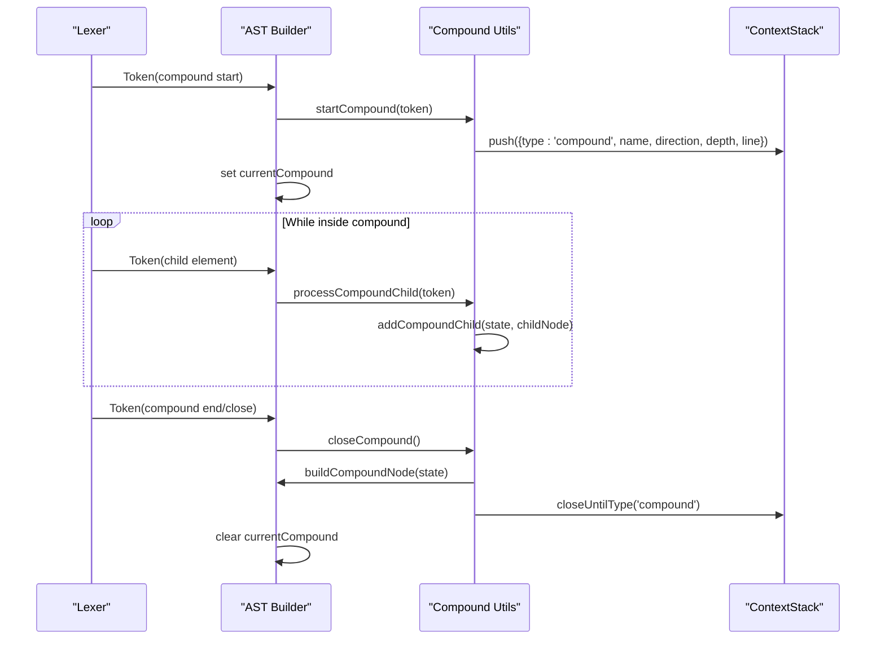
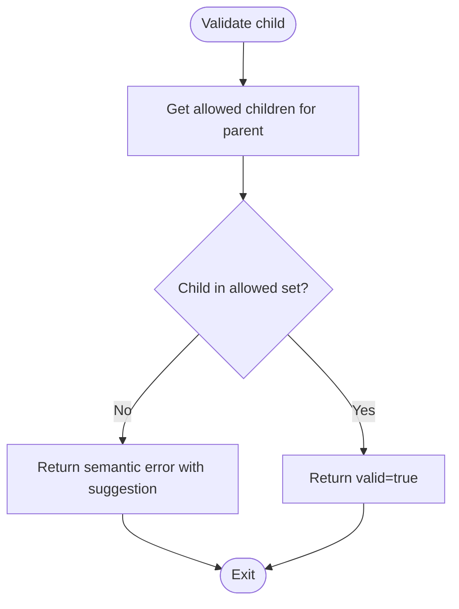
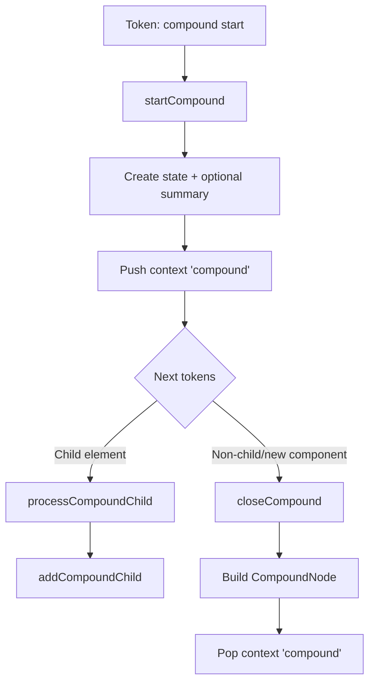
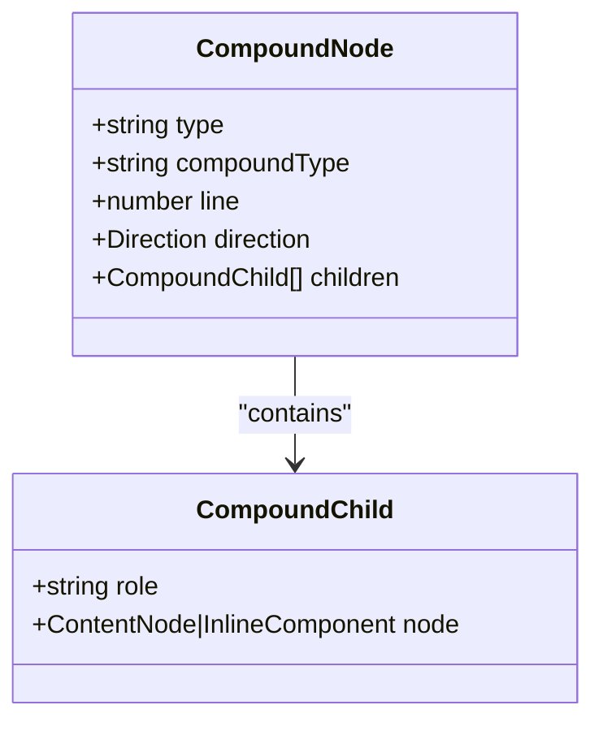
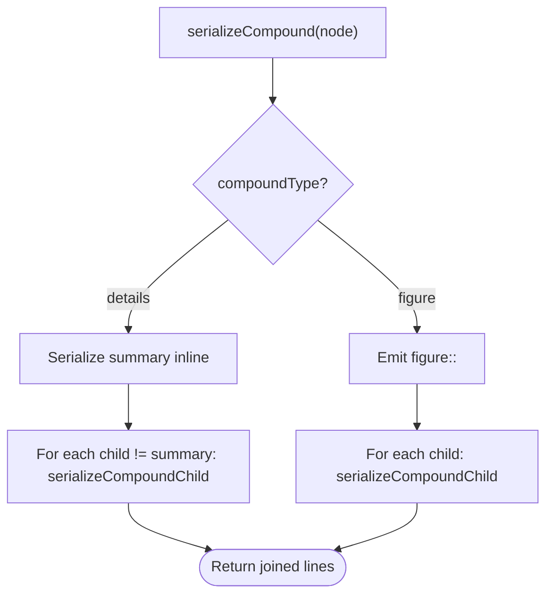
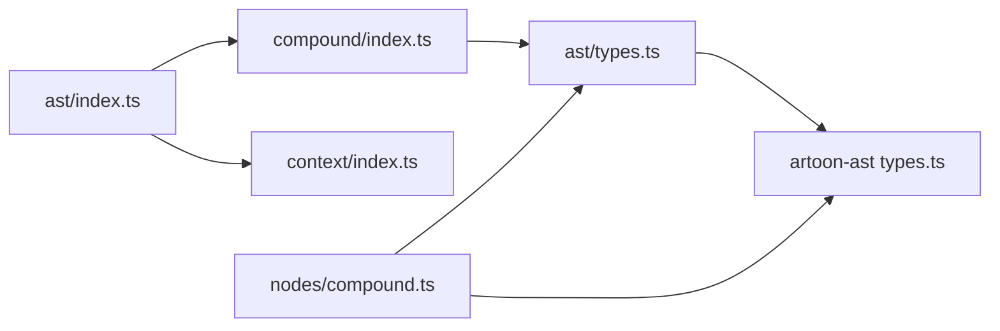

# Compound Parsing

<cite>
**Referenced Files in This Document**
- [index.ts](file://artoon-parser/src/compound/index.ts)
- [index.ts](file://artoon-parser/src/ast/index.ts)
- [types.ts](file://artoon-parser/src/ast/types.ts)
- [index.ts](file://artoon-serializer/src/nodes/compound.ts)
- [compound.test.ts](file://artoon-parser/tests/compound.test.ts)
- [compound.test.ts](file://artoon-serializer/tests/compound.test.ts)
- [test-compound-blocks.artoon](file://artoon-examples/test-compound-blocks.artoon)
- [index.ts](file://artoon-parser/src/context/index.ts)
- [types.ts](file://artoon-ast/src/types.ts)
</cite>

## Table of Contents
1. [Introduction](#introduction)
2. [Project Structure](#project-structure)
3. [Core Components](#core-components)
4. [Architecture Overview](#architecture-overview)
5. [Detailed Component Analysis](#detailed-component-analysis)
6. [Dependency Analysis](#dependency-analysis)
7. [Performance Considerations](#performance-considerations)
8. [Troubleshooting Guide](#troubleshooting-guide)
9. [Conclusion](#conclusion)

## Introduction
This document explains the ARTOON Compound Parsing module, which handles complex nested structures composed of two primary compound components: figure and details. It covers compound component detection, parsing algorithms, hierarchical structure handling, supported syntax, validation and error recovery, and integration with the broader parsing pipeline. Examples demonstrate real-world usage and expected parsed representations.

## Project Structure
The compound parsing system spans three main areas:
- Parser-side compound handler and AST builder integration
- AST types shared across the system
- Serializer for round-trip output of compound nodes

**Diagram sources**
- [index.ts:1-170](file://artoon-parser/src/compound/index.ts#L1-L170)
- [index.ts:446-539](file://artoon-parser/src/ast/index.ts#L446-L539)
- [types.ts:98-104](file://artoon-parser/src/ast/types.ts#L98-L104)
- [index.ts:25-190](file://artoon-parser/src/context/index.ts#L25-L190)
- [types.ts:267-272](file://artoon-ast/src/types.ts#L267-L272)
- [index.ts:20-54](file://artoon-serializer/src/nodes/compound.ts#L20-L54)

**Section sources**
- [index.ts:1-170](file://artoon-parser/src/compound/index.ts#L1-L170)
- [index.ts:446-539](file://artoon-parser/src/ast/index.ts#L446-L539)
- [types.ts:98-104](file://artoon-parser/src/ast/types.ts#L98-L104)
- [index.ts:25-190](file://artoon-parser/src/context/index.ts#L25-L190)
- [types.ts:267-272](file://artoon-ast/src/types.ts#L267-L272)
- [index.ts:20-54](file://artoon-serializer/src/nodes/compound.ts#L20-L54)

## Core Components
- Compound utilities: detection, validation, state management, closing logic, and completeness checks
- AST builder integration: start, process, and close handlers for compound contexts
- AST types: canonical compound node and child roles
- Serializer: round-trip serialization of compound nodes
- Context stack: maintains open compound/list/table contexts during parsing

Key responsibilities:
- Detect compound components and child elements
- Validate allowed children per compound type
- Track compound state and close on context changes
- Build compound nodes with typed children
- Serialize compound nodes back to ARTOON syntax

**Section sources**
- [index.ts:49-170](file://artoon-parser/src/compound/index.ts#L49-L170)
- [index.ts:446-539](file://artoon-parser/src/ast/index.ts#L446-L539)
- [types.ts:256-272](file://artoon-ast/src/types.ts#L256-L272)
- [index.ts:20-92](file://artoon-serializer/src/nodes/compound.ts#L20-L92)
- [index.ts:25-190](file://artoon-parser/src/context/index.ts#L25-L190)

## Architecture Overview
The compound parsing pipeline integrates with the lexer-to-AST builder flow. Tokens representing compound declarations and child elements are processed by dedicated handlers that manage state and context.

**Diagram sources**
- [index.ts:446-484](file://artoon-parser/src/ast/index.ts#L446-L484)
- [index.ts:489-525](file://artoon-parser/src/ast/index.ts#L489-L525)
- [index.ts:530-539](file://artoon-parser/src/ast/index.ts#L530-L539)
- [index.ts:33-104](file://artoon-parser/src/compound/index.ts#L33-L104)
- [index.ts:25-110](file://artoon-parser/src/context/index.ts#L25-L110)

## Detailed Component Analysis

### Compound Utilities
Responsibilities:
- Compound type detection
- Child element detection via token flags
- Child validation against allowed sets
- State creation, mutation, and node construction
- Closing logic based on token classification
- Completeness validation and warnings

Supported compound types and children:
- figure: img, video, audio, caption, figcaption
- details: summary, p, t1–t6, ul, ol, dl, table, c, code

Validation and precedence:
- Child must belong to the parent’s allowed set
- Closing occurs on:
  - New component declaration that is not a child element
  - Block start or end markers
- Required child:
  - details requires a summary child

**Diagram sources**
- [index.ts:63-84](file://artoon-parser/src/compound/index.ts#L63-L84)

**Section sources**
- [index.ts:49-170](file://artoon-parser/src/compound/index.ts#L49-L170)

### AST Builder Integration
Handlers:
- startCompound(token): initializes state and optional summary for details
- processCompoundChild(token): parses inline content and creates media/text nodes
- closeCompound(): builds the compound node and updates context

Behavior:
- On details with inline content, a summary text node is created
- Child elements are parsed into media or text nodes depending on type
- Context stack tracks compound boundaries and ensures proper closure

**Diagram sources**
- [index.ts:446-484](file://artoon-parser/src/ast/index.ts#L446-L484)
- [index.ts:489-525](file://artoon-parser/src/ast/index.ts#L489-L525)
- [index.ts:530-539](file://artoon-parser/src/ast/index.ts#L530-L539)

**Section sources**
- [index.ts:446-539](file://artoon-parser/src/ast/index.ts#L446-L539)

### AST Types
Compound node definition:
- type: compound
- componentType: figure | details
- children: array of CompoundChild with roles (content, caption, summary)

Roles:
- content: primary child content (text or media)
- caption: figure caption
- summary: details summary

**Diagram sources**
- [types.ts:256-272](file://artoon-ast/src/types.ts#L256-L272)

**Section sources**
- [types.ts:256-272](file://artoon-ast/src/types.ts#L256-L272)

### Serializer
Serialization rules:
- figure: emits figure declaration followed by child lines
- details: emits inline summary when present, then content children
- Child serialization:
  - Media nodes: media type with attributes
  - Text nodes: text type with serialized inline content
  - Caption role: special caption serialization

**Diagram sources**
- [index.ts:20-54](file://artoon-serializer/src/nodes/compound.ts#L20-L54)
- [index.ts:59-82](file://artoon-serializer/src/nodes/compound.ts#L59-L82)

**Section sources**
- [index.ts:20-92](file://artoon-serializer/src/nodes/compound.ts#L20-L92)

### Examples and Expected Outputs
Example documents and expected behaviors:
- Multi-type figures with images, videos, audios and captions
- Details with summaries and various content types (paragraphs, lists, tables, code)
- Nested details and mixed compound usage
- Round-trip serialization expectations validated by serializer tests

See:
- [test-compound-blocks.artoon:1-110](file://artoon-examples/test-compound-blocks.artoon#L1-L110)
- [compound.test.ts:7-135](file://artoon-serializer/tests/compound.test.ts#L7-L135)

**Section sources**
- [test-compound-blocks.artoon:1-110](file://artoon-examples/test-compound-blocks.artoon#L1-L110)
- [compound.test.ts:7-135](file://artoon-serializer/tests/compound.test.ts#L7-L135)

## Dependency Analysis
Key dependencies and relationships:
- Compound utilities depend on parser Token and ASTNode types
- AST builder depends on compound utilities and context stack
- Serializer depends on canonical AST types and inline serialization
- Context stack supports compound, list, and table boundaries

**Diagram sources**
- [index.ts:4-5](file://artoon-parser/src/compound/index.ts#L4-L5)
- [index.ts:446-484](file://artoon-parser/src/ast/index.ts#L446-L484)
- [index.ts:25-190](file://artoon-parser/src/context/index.ts#L25-L190)
- [types.ts:98-104](file://artoon-parser/src/ast/types.ts#L98-L104)
- [types.ts:267-272](file://artoon-ast/src/types.ts#L267-L272)
- [index.ts:3-6](file://artoon-serializer/src/nodes/compound.ts#L3-L6)

**Section sources**
- [index.ts:4-5](file://artoon-parser/src/compound/index.ts#L4-L5)
- [index.ts:446-484](file://artoon-parser/src/ast/index.ts#L446-L484)
- [index.ts:25-190](file://artoon-parser/src/context/index.ts#L25-L190)
- [types.ts:98-104](file://artoon-parser/src/ast/types.ts#L98-L104)
- [types.ts:267-272](file://artoon-ast/src/types.ts#L267-L272)
- [index.ts:3-6](file://artoon-serializer/src/nodes/compound.ts#L3-L6)

## Performance Considerations
- Compound parsing is linear in the number of tokens within a compound boundary
- Child validation is O(k) per child where k is the allowed child count (small constant)
- Context stack operations are O(1) amortized for push/pop
- Recommendations:
  - Prefer streaming tokenization and incremental AST building
  - Avoid deep nesting when possible to reduce memory pressure
  - Use early exits in closing logic to minimize unnecessary work

[No sources needed since this section provides general guidance]

## Troubleshooting Guide
Common issues and resolutions:
- Invalid child inside a compound:
  - Symptom: semantic error indicating disallowed child type
  - Resolution: replace with an allowed child or adjust compound type
- Missing required summary in details:
  - Symptom: completeness warning about missing summary
  - Resolution: add a summary child element
- Unexpected closure:
  - Symptom: compound ends earlier than expected
  - Causes: encountering a non-child component or block start/end marker
  - Resolution: ensure child elements remain prefixed as child elements
- Serialization mismatch:
  - Symptom: output differs from expected
  - Resolution: verify child roles and inline content serialization

Validation and tests:
- Parser tests cover child validation, close detection, and state management
- Serializer tests validate round-trip output for figure and details

**Section sources**
- [compound.test.ts:127-212](file://artoon-parser/tests/compound.test.ts#L127-L212)
- [compound.test.ts:7-135](file://artoon-serializer/tests/compound.test.ts#L7-L135)

## Conclusion
The ARTOON Compound Parsing module provides robust handling of figure and details components with strict validation, clear closing semantics, and precise serialization. Its integration with the AST builder and context stack ensures predictable behavior for nested and mixed compound structures. The provided tests and examples serve as reliable references for expected behavior and validation outcomes.