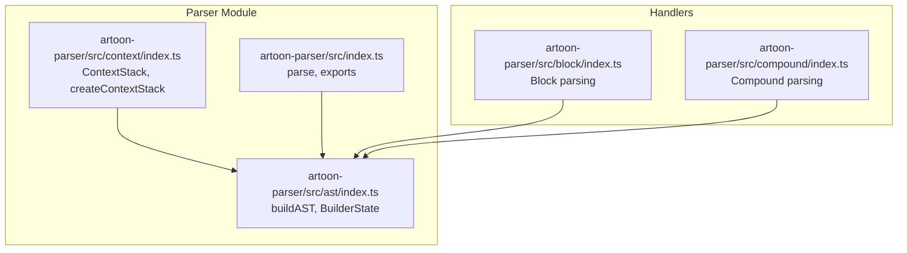
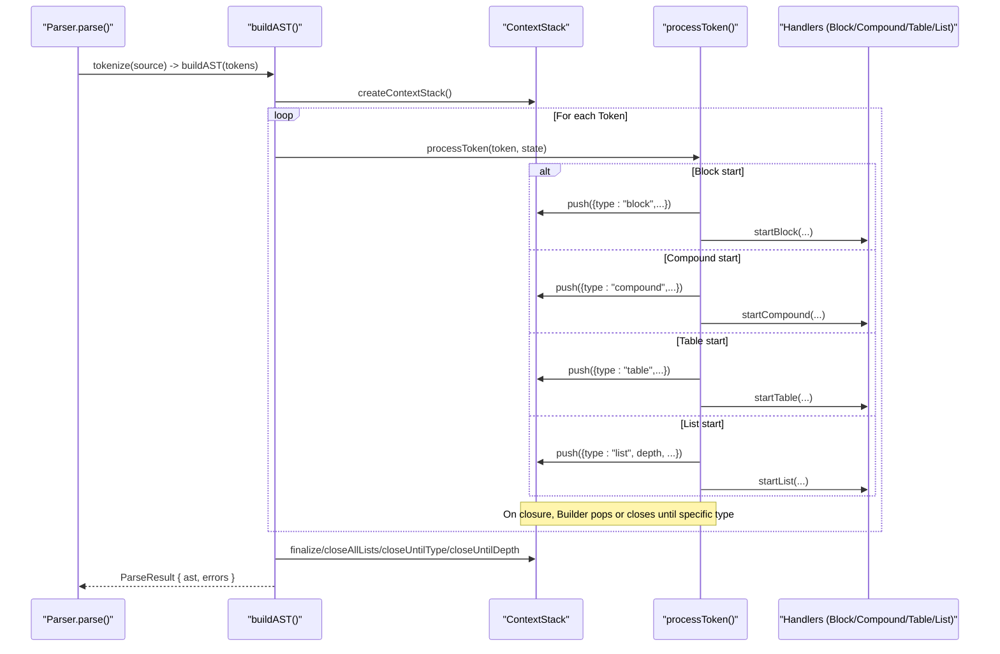
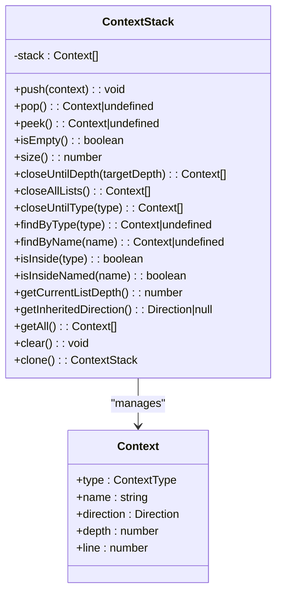
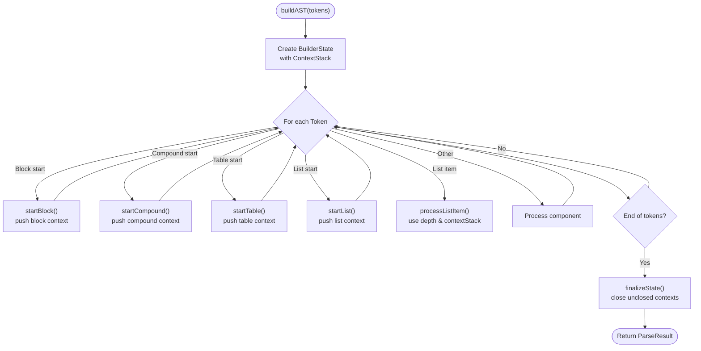
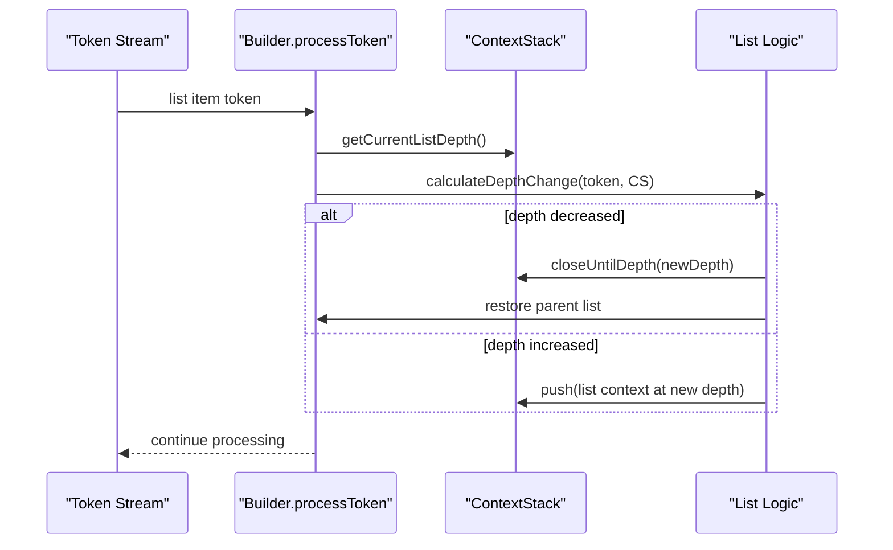
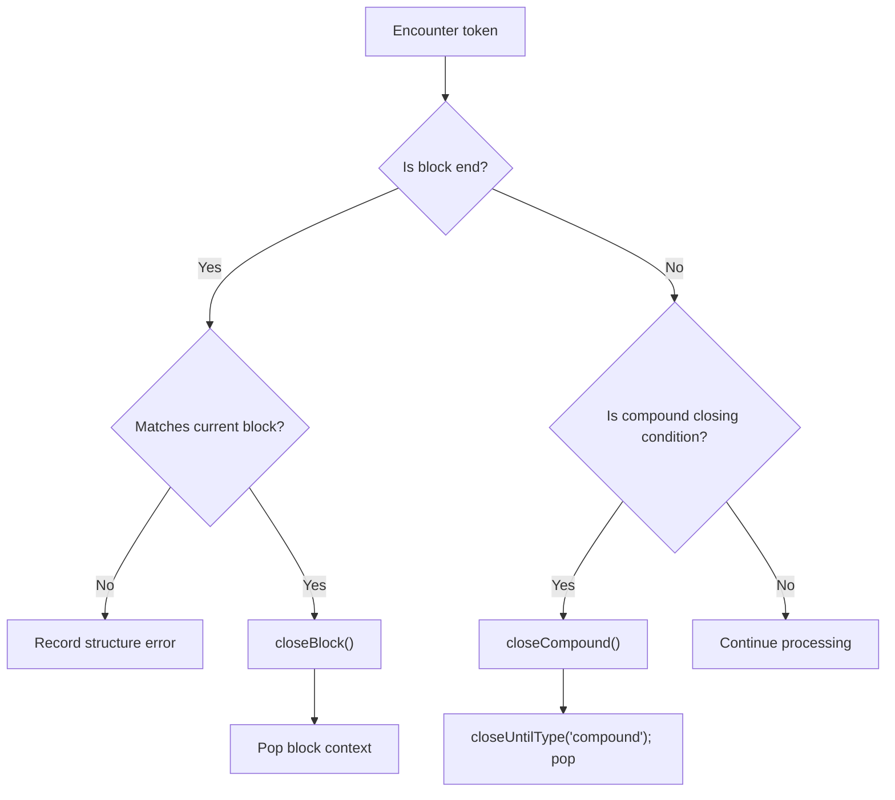
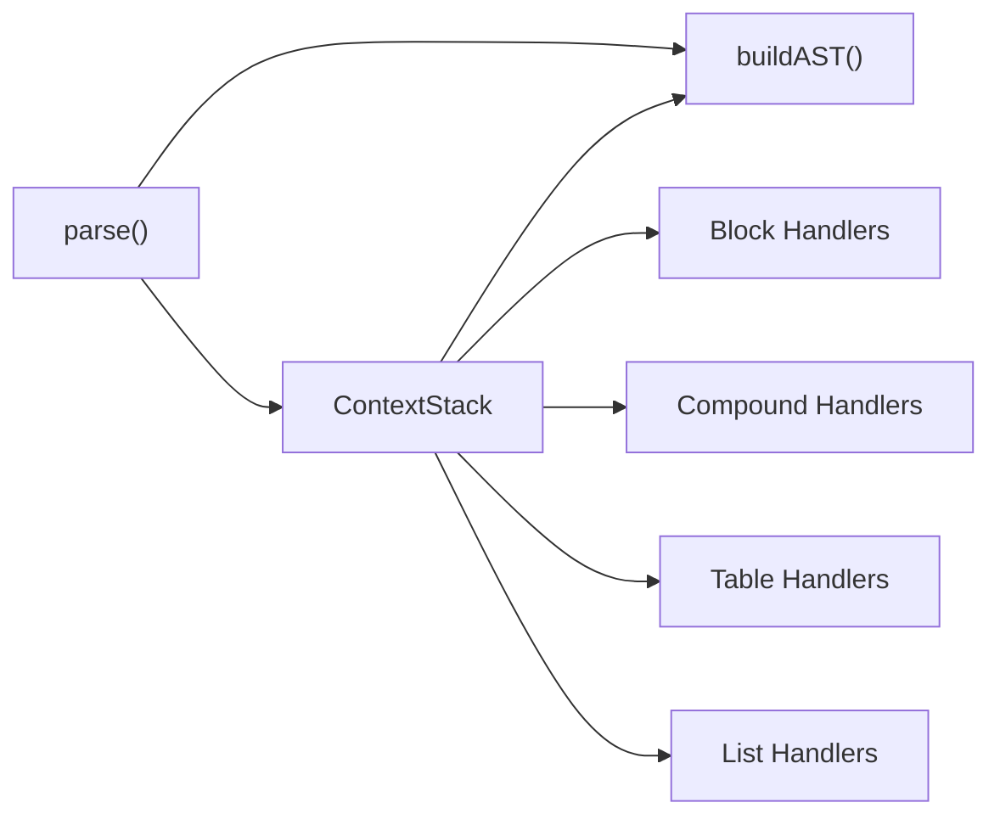

# Context Manager

<cite>
**Referenced Files in This Document**
- [index.ts](file://artoon-parser/src/context/index.ts)
- [index.ts](file://artoon-parser/src/ast/index.ts)
- [index.ts](file://artoon-parser/src/index.ts)
- [context.test.ts](file://artoon-parser/tests/context.test.ts)
- [index.ts](file://artoon-parser/src/types.ts)
- [index.ts](file://artoon-parser/src/block/index.ts)
- [index.ts](file://artoon-parser/src/compound/index.ts)
</cite>

## Table of Contents
1. [Introduction](#introduction)
2. [Project Structure](#project-structure)
3. [Core Components](#core-components)
4. [Architecture Overview](#architecture-overview)
5. [Detailed Component Analysis](#detailed-component-analysis)
6. [Dependency Analysis](#dependency-analysis)
7. [Performance Considerations](#performance-considerations)
8. [Troubleshooting Guide](#troubleshooting-guide)
9. [Conclusion](#conclusion)

## Introduction
This document explains the ARTOON Context Manager module, which tracks parsing state during ARTOON document processing. It focuses on the ContextStack interface, the createContextStack() factory, and the context manipulation methods that enable correct handling of nested structures, compound components, and hierarchical content. The Context Manager integrates deeply with the AST builder to maintain accurate nesting levels, enforce semantic boundaries, and recover gracefully from malformed input.

## Project Structure
The Context Manager resides in the parser module and is consumed by the AST builder and various handlers for blocks, tables, compounds, and lists. The main entry point re-exports the Context Manager for external use.

**Diagram sources**
- [index.ts:1-198](file://artoon-parser/src/context/index.ts#L1-L198)
- [index.ts:1-794](file://artoon-parser/src/ast/index.ts#L1-L794)
- [index.ts:1-119](file://artoon-parser/src/index.ts#L1-L119)
- [index.ts:1-317](file://artoon-parser/src/block/index.ts#L1-L317)
- [index.ts:1-170](file://artoon-parser/src/compound/index.ts#L1-L170)

**Section sources**
- [index.ts:1-198](file://artoon-parser/src/context/index.ts#L1-L198)
- [index.ts:1-794](file://artoon-parser/src/ast/index.ts#L1-L794)
- [index.ts:1-119](file://artoon-parser/src/index.ts#L1-L119)

## Core Components
- ContextStack: A LIFO stack that tracks open contexts (list, block, compound, table). It supports push, pop, peek, size, emptiness checks, and specialized closing operations tailored to ARTOON’s hierarchical constructs.
- Context: A lightweight record describing a context entry with type, name, direction, depth, and start line.
- createContextStack(): Factory function returning a fresh ContextStack instance.

Key responsibilities:
- Track nesting levels for lists and enforce depth-aware behavior.
- Maintain semantic boundaries for blocks, compounds, and tables.
- Provide direction inheritance and list depth queries for downstream processors.
- Enable safe cloning and inspection for debugging and recovery.

**Section sources**
- [index.ts:14-198](file://artoon-parser/src/context/index.ts#L14-L198)

## Architecture Overview
The Context Manager is central to the AST builder’s state machine. The builder maintains a BuilderState that includes the ContextStack alongside other parsing state (current block/table/compound/list). As tokens are processed, the builder pushes contexts on entry and pops them on closure, ensuring proper nesting and error reporting.

**Diagram sources**
- [index.ts:67-84](file://artoon-parser/src/ast/index.ts#L67-L84)
- [index.ts:297-394](file://artoon-parser/src/ast/index.ts#L297-L394)
- [index.ts:399-444](file://artoon-parser/src/ast/index.ts#L399-L444)
- [index.ts:449-539](file://artoon-parser/src/ast/index.ts#L449-L539)
- [index.ts:544-687](file://artoon-parser/src/ast/index.ts#L544-L687)
- [index.ts:25-190](file://artoon-parser/src/context/index.ts#L25-L190)

## Detailed Component Analysis

### ContextStack API and Behavior
ContextStack exposes a minimal, focused API designed for efficient state tracking during parsing:
- push(context): Enter a new context.
- pop(): Exit the most recent context.
- peek(): Inspect the current context without removal.
- isEmpty(), size(): Lightweight state queries.
- closeUntilDepth(targetDepth): Close list contexts deeper than target.
- closeAllLists(): Close all open list contexts.
- closeUntilType(type): Close contexts until a specific type is reached.
- findByType(type), findByName(name): Search upward in the stack.
- isInside(type), isInsideNamed(name): Boolean containment checks.
- getCurrentListDepth(): Get current list nesting level.
- getInheritedDirection(): Get direction from nearest enclosing context.
- getAll(), clear(), clone(): Debugging and recovery utilities.

These methods are used extensively by the AST builder to manage:
- List nesting via depth comparisons and targeted closures.
- Compound and table boundaries via type-based closing.
- Block boundaries via explicit popping.
- Direction inheritance for nodes.

**Diagram sources**
- [index.ts:14-198](file://artoon-parser/src/context/index.ts#L14-L198)

**Section sources**
- [index.ts:25-198](file://artoon-parser/src/context/index.ts#L25-L198)

### Integration with AST Builder
The AST builder composes ContextStack with other state to orchestrate parsing:
- BuilderState includes contextStack, currentBlock, currentTable, currentCompound, currentList, and listStack.
- On entering constructs, the builder pushes a context onto the stack.
- On leaving constructs, it either pops immediately or closes contexts until a boundary type is reached.
- At document end, finalizeState ensures all contexts are closed and reports errors for unclosed constructs.

**Diagram sources**
- [index.ts:37-65](file://artoon-parser/src/ast/index.ts#L37-L65)
- [index.ts:70-84](file://artoon-parser/src/ast/index.ts#L70-L84)
- [index.ts:89-256](file://artoon-parser/src/ast/index.ts#L89-L256)
- [index.ts:766-793](file://artoon-parser/src/ast/index.ts#L766-L793)

**Section sources**
- [index.ts:37-65](file://artoon-parser/src/ast/index.ts#L37-L65)
- [index.ts:70-84](file://artoon-parser/src/ast/index.ts#L70-L84)
- [index.ts:89-256](file://artoon-parser/src/ast/index.ts#L89-L256)
- [index.ts:766-793](file://artoon-parser/src/ast/index.ts#L766-L793)

### Context Usage in Complex Parsing Scenarios
- Nested lists: The builder computes depth changes and uses ContextStack.getCurrentListDepth() and closeUntilDepth() to close nested lists appropriately, restoring the parent list context.
- Compound components: The builder pushes a compound context on start and closes it when encountering non-child elements or block boundaries. It uses closeUntilType('compound') to restore prior state.
- Tables: Similar to compounds, a table context is pushed on start and closed when leaving table scope or encountering non-table components.
- Blocks: A block context is pushed on start and popped on close. Special handling avoids misinterpreting block end markers inside code blocks.

**Diagram sources**
- [index.ts:584-669](file://artoon-parser/src/ast/index.ts#L584-L669)
- [index.ts:619-651](file://artoon-parser/src/ast/index.ts#L619-L651)

**Section sources**
- [index.ts:584-669](file://artoon-parser/src/ast/index.ts#L584-L669)
- [index.ts:619-651](file://artoon-parser/src/ast/index.ts#L619-L651)

### Context Validation, Error Recovery, and Debugging
- Validation: ContextStack provides isInside(), isInsideNamed(), findByType(), findByName() to validate containment and detect misuse (e.g., hidden fields only in meta blocks).
- Error recovery: The AST builder records structure errors for mismatched block ends and unclosed constructs. It also warns about implicitly closed compounds at document end.
- Debugging: getAll() returns a snapshot of open contexts; clone() enables safe inspection without altering state; clear() resets state for isolated tests.

**Diagram sources**
- [index.ts:316-375](file://artoon-parser/src/ast/index.ts#L316-L375)
- [index.ts:530-539](file://artoon-parser/src/ast/index.ts#L530-L539)

**Section sources**
- [index.ts:316-375](file://artoon-parser/src/ast/index.ts#L316-L375)
- [index.ts:530-539](file://artoon-parser/src/ast/index.ts#L530-L539)
- [context.test.ts:135-161](file://artoon-parser/tests/context.test.ts#L135-L161)

## Dependency Analysis
ContextStack is consumed by the AST builder and indirectly by handlers for blocks, compounds, tables, and lists. The main entry point re-exports ContextStack and createContextStack for external consumers.

**Diagram sources**
- [index.ts:12-29](file://artoon-parser/src/ast/index.ts#L12-L29)
- [index.ts:35-36](file://artoon-parser/src/index.ts#L35-L36)

**Section sources**
- [index.ts:12-29](file://artoon-parser/src/ast/index.ts#L12-L29)
- [index.ts:35-36](file://artoon-parser/src/index.ts#L35-L36)

## Performance Considerations
- Stack operations are O(1) amortized; ContextStack uses a simple array, minimizing overhead.
- closeUntilDepth() iterates backward through the stack; typical nesting is shallow, keeping cost low.
- clone() copies the internal array; acceptable for debugging but avoid frequent cloning in hot loops.
- Direction inheritance and list depth queries scan upward; again, shallow nesting keeps costs negligible.
Best practices:
- Prefer peek() and size() for quick checks rather than repeated find operations.
- Use closeUntilType() and closeAllLists() to batch-close contexts efficiently.
- Keep context entries minimal; avoid storing redundant metadata beyond what the builder needs.

[No sources needed since this section provides general guidance]

## Troubleshooting Guide
Common issues and remedies:
- Unclosed constructs: finalizeState() reports unclosed blocks, tables, compounds, and lists. Ensure all constructs are properly terminated.
- Mismatched block ends: The builder records structure errors when a block end does not match the current block name.
- Hidden field misuse: validateHiddenFieldUsage() enforces that hidden fields (>.-:field:) appear only inside meta blocks.
- Compound child validation: validateCompoundChild() ensures children are permitted for the given compound type.
- Debugging tips:
  - Use getAll() to inspect open contexts at any point.
  - Clone the ContextStack to compare state before and after problematic operations.
  - Clear the stack for isolated tests to avoid cross-contamination.

**Section sources**
- [index.ts:766-793](file://artoon-parser/src/ast/index.ts#L766-L793)
- [index.ts:332-343](file://artoon-parser/src/ast/index.ts#L332-L343)
- [index.ts:260-278](file://artoon-parser/src/block/index.ts#L260-L278)
- [index.ts:63-84](file://artoon-parser/src/compound/index.ts#L63-L84)
- [context.test.ts:163-200](file://artoon-parser/tests/context.test.ts#L163-L200)

## Conclusion
The Context Manager is a lean yet powerful mechanism that enables ARTOON’s parser to track nesting, enforce semantic boundaries, and recover gracefully from malformed input. Its tight integration with the AST builder and specialized handlers ensures robust parsing of nested structures, compound components, and hierarchical content. By leveraging ContextStack’s targeted operations—such as closeUntilDepth(), closeAllLists(), and closeUntilType()—the parser maintains correctness and clarity across complex documents.