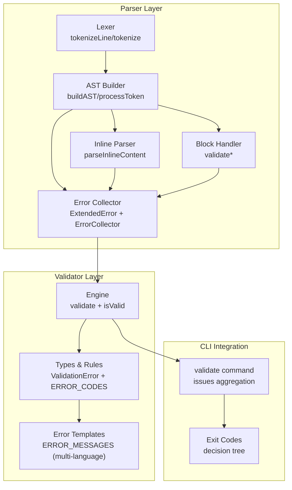
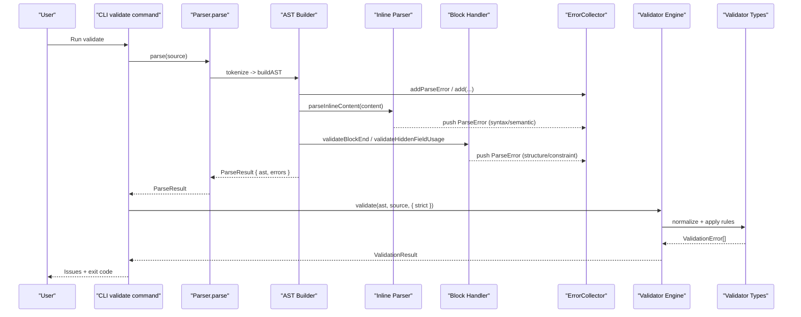
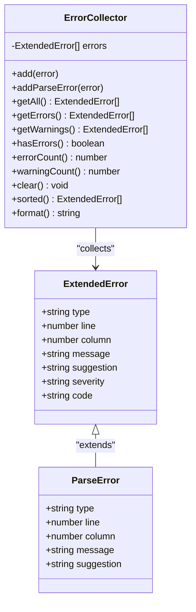
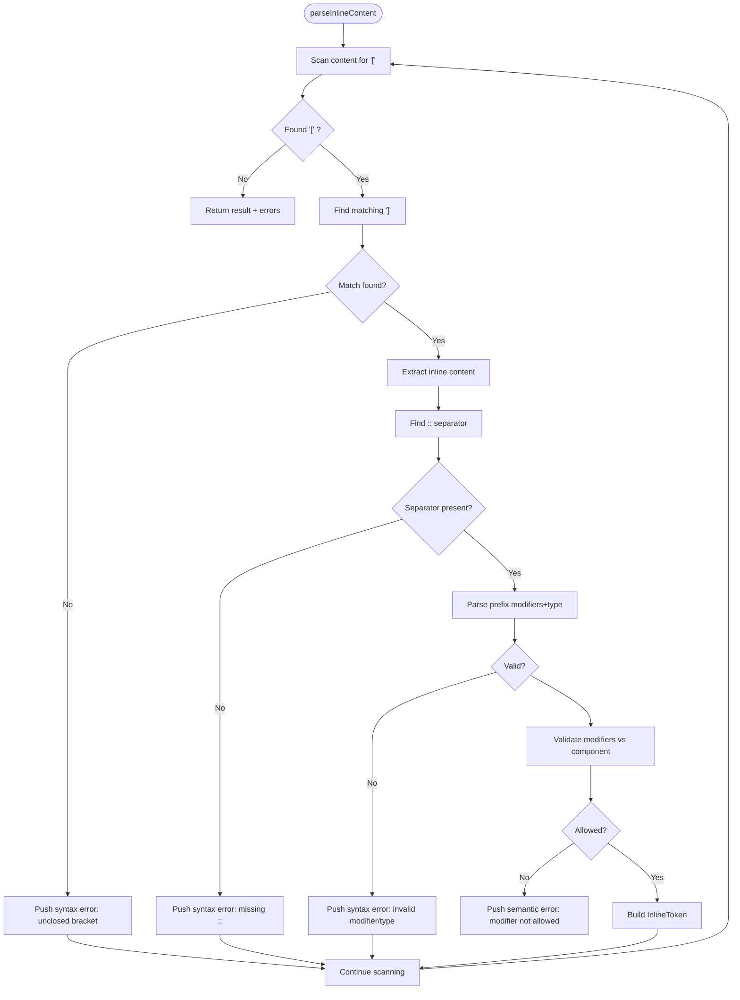
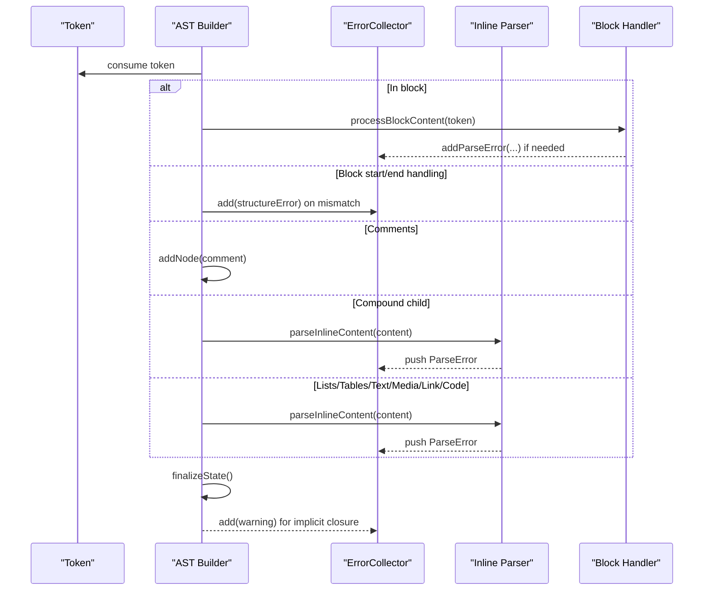
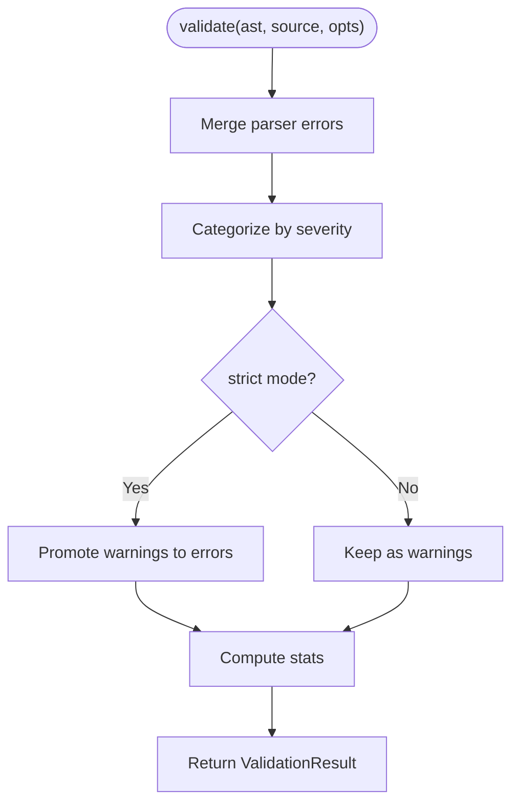
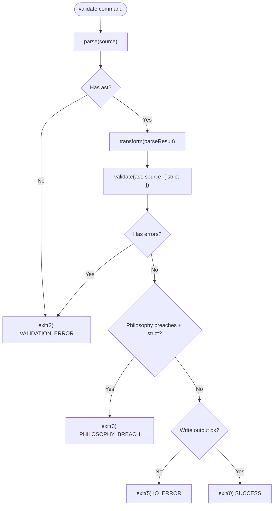
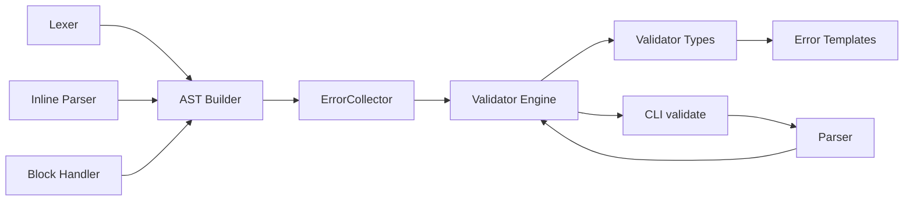

# Error Handling

<cite>
**Referenced Files in This Document**
- [artoon-parser/src/errors/index.ts](file://artoon-parser/src/errors/index.ts)
- [artoon-parser/src/ast/types.ts](file://artoon-parser/src/ast/types.ts)
- [artoon-parser/src/inline/index.ts](file://artoon-parser/src/inline/index.ts)
- [artoon-parser/src/block/index.ts](file://artoon-parser/src/block/index.ts)
- [artoon-parser/src/ast/index.ts](file://artoon-parser/src/ast/index.ts)
- [artoon-parser/src/index.ts](file://artoon-parser/src/index.ts)
- [artoon-validator/src/errors/index.ts](file://artoon-validator/src/errors/index.ts)
- [artoon-validator/src/types.ts](file://artoon-validator/src/types.ts)
- [artoon-validator/src/engine/index.ts](file://artoon-validator/src/engine/index.ts)
- [artoon-cli/src/commands/validate.ts](file://artoon-cli/src/commands/validate.ts)
- [artoon-cli/inventory_artoon_cli/05-EXIT-CODES.md](file://artoon-cli/inventory_artoon_cli/05-EXIT-CODES.md)
</cite>

## Table of Contents
1. [Introduction](#introduction)
2. [Project Structure](#project-structure)
3. [Core Components](#core-components)
4. [Architecture Overview](#architecture-overview)
5. [Detailed Component Analysis](#detailed-component-analysis)
6. [Dependency Analysis](#dependency-analysis)
7. [Performance Considerations](#performance-considerations)
8. [Troubleshooting Guide](#troubleshooting-guide)
9. [Conclusion](#conclusion)

## Introduction
This document explains the ARTOON Parser Error Handling system. It covers how parsing errors and validation failures are captured, categorized, and reported, along with recovery strategies, partial parsing, and integration with higher-level validation. It also documents the ParseError interface, error types, severity levels, location tracking, and practical guidance for localization and best practices.

## Project Structure
The error handling spans three layers:
- Parser-level error generation and collection
- Inline parser error reporting
- Validator-level categorization and severity normalization



**Diagram sources**
- [artoon-parser/src/lexer/index.ts:10-403](file://artoon-parser/src/lexer/index.ts#L10-L403)
- [artoon-parser/src/ast/index.ts:70-794](file://artoon-parser/src/ast/index.ts#L70-L794)
- [artoon-parser/src/inline/index.ts:10-197](file://artoon-parser/src/inline/index.ts#L10-L197)
- [artoon-parser/src/block/index.ts:198-317](file://artoon-parser/src/block/index.ts#L198-L317)
- [artoon-parser/src/errors/index.ts:19-265](file://artoon-parser/src/errors/index.ts#L19-L265)
- [artoon-validator/src/engine/index.ts:58-100](file://artoon-validator/src/engine/index.ts#L58-L100)
- [artoon-validator/src/types.ts:18-106](file://artoon-validator/src/types.ts#L18-L106)
- [artoon-validator/src/errors/index.ts:8-80](file://artoon-validator/src/errors/index.ts#L8-L80)
- [artoon-cli/src/commands/validate.ts:49-92](file://artoon-cli/src/commands/validate.ts#L49-L92)
- [artoon-cli/inventory_artoon_cli/05-EXIT-CODES.md:79-134](file://artoon-cli/inventory_artoon_cli/05-EXIT-CODES.md#L79-L134)

**Section sources**
- [artoon-parser/src/errors/index.ts:1-265](file://artoon-parser/src/errors/index.ts#L1-L265)
- [artoon-parser/src/ast/types.ts:240-258](file://artoon-parser/src/ast/types.ts#L240-L258)
- [artoon-parser/src/inline/index.ts:10-197](file://artoon-parser/src/inline/index.ts#L10-L197)
- [artoon-parser/src/block/index.ts:198-317](file://artoon-parser/src/block/index.ts#L198-L317)
- [artoon-parser/src/ast/index.ts:70-794](file://artoon-parser/src/ast/index.ts#L70-L794)
- [artoon-parser/src/index.ts:56-100](file://artoon-parser/src/index.ts#L56-L100)
- [artoon-validator/src/errors/index.ts:1-80](file://artoon-validator/src/errors/index.ts#L1-L80)
- [artoon-validator/src/types.ts:18-106](file://artoon-validator/src/types.ts#L18-L106)
- [artoon-validator/src/engine/index.ts:58-100](file://artoon-validator/src/engine/index.ts#L58-L100)
- [artoon-cli/src/commands/validate.ts:49-92](file://artoon-cli/src/commands/validate.ts#L49-L92)
- [artoon-cli/inventory_artoon_cli/05-EXIT-CODES.md:79-134](file://artoon-cli/inventory_artoon_cli/05-EXIT-CODES.md#L79-L134)

## Core Components
- ParseError interface: Defines the shape of parser-generated errors with type, line, column, message, and optional suggestion.
- ExtendedError: Adds severity and optional code to ParseError for richer reporting.
- Error types: syntax, structure, semantic, constraint.
- Severity levels: error, warning, info (in parser), plus philosophy in validator.
- ErrorCollector: Aggregates, filters, sorts, counts, and formats errors.
- Inline parser: Detects unclosed brackets, missing separators, invalid modifiers, and returns ParseError for downstream collection.
- Block handler: Validates block end matching, hidden field usage, and META content constraints.
- AST builder: Orchestrates token processing, collects errors, and finalizes state by closing unclosed constructs.
- Validator engine: Normalizes parser errors, applies rules, and produces structured validation results with stats.
- CLI validate command: Transforms parse result to AST, runs validator, aggregates issues, and sets exit codes.

**Section sources**
- [artoon-parser/src/ast/types.ts:240-258](file://artoon-parser/src/ast/types.ts#L240-L258)
- [artoon-parser/src/errors/index.ts:9-265](file://artoon-parser/src/errors/index.ts#L9-L265)
- [artoon-parser/src/inline/index.ts:26-145](file://artoon-parser/src/inline/index.ts#L26-L145)
- [artoon-parser/src/block/index.ts:198-317](file://artoon-parser/src/block/index.ts#L198-L317)
- [artoon-parser/src/ast/index.ts:89-794](file://artoon-parser/src/ast/index.ts#L89-L794)
- [artoon-validator/src/engine/index.ts:58-100](file://artoon-validator/src/engine/index.ts#L58-L100)
- [artoon-cli/src/commands/validate.ts:49-92](file://artoon-cli/src/commands/validate.ts#L49-L92)

## Architecture Overview
The system separates concerns across parser, validator, and CLI layers. Parser errors originate from lexical, inline, and structural checks. The validator normalizes and enriches them, optionally treating warnings as errors in strict mode. The CLI integrates both and maps outcomes to exit codes.



**Diagram sources**
- [artoon-parser/src/index.ts:56-100](file://artoon-parser/src/index.ts#L56-L100)
- [artoon-parser/src/ast/index.ts:70-794](file://artoon-parser/src/ast/index.ts#L70-L794)
- [artoon-parser/src/inline/index.ts:10-197](file://artoon-parser/src/inline/index.ts#L10-L197)
- [artoon-parser/src/block/index.ts:198-317](file://artoon-parser/src/block/index.ts#L198-L317)
- [artoon-parser/src/errors/index.ts:156-240](file://artoon-parser/src/errors/index.ts#L156-L240)
- [artoon-validator/src/engine/index.ts:58-100](file://artoon-validator/src/engine/index.ts#L58-L100)
- [artoon-validator/src/types.ts:18-106](file://artoon-validator/src/types.ts#L18-L106)
- [artoon-cli/src/commands/validate.ts:49-92](file://artoon-cli/src/commands/validate.ts#L49-L92)

## Detailed Component Analysis

### ParseError and ExtendedError
- ParseError: Standardized error shape used across parser internals and returned to consumers.
- ExtendedError: Parser-side extension adding severity and optional code for richer reporting.
- Error types: syntax, structure, semantic, constraint.
- Severity: error, warning, info (parser), philosophy (validator).
- ErrorCollector: Provides add/addParseError/getAll/getErrors/getWarnings/hasErrors/errorCount/warningCount/clear/sorted/format.



**Diagram sources**
- [artoon-parser/src/ast/types.ts:240-258](file://artoon-parser/src/ast/types.ts#L240-L258)
- [artoon-parser/src/errors/index.ts:19-240](file://artoon-parser/src/errors/index.ts#L19-L240)

**Section sources**
- [artoon-parser/src/ast/types.ts:240-258](file://artoon-parser/src/ast/types.ts#L240-L258)
- [artoon-parser/src/errors/index.ts:9-265](file://artoon-parser/src/errors/index.ts#L9-L265)

### Inline Parser Error Reporting
- Detects unclosed inline brackets and records ParseError with line/column.
- Enforces presence of :: separator and reports syntax errors.
- Validates modifiers against component types and reports semantic errors.
- Returns both parsed content and collected ParseError entries.



**Diagram sources**
- [artoon-parser/src/inline/index.ts:10-197](file://artoon-parser/src/inline/index.ts#L10-L197)

**Section sources**
- [artoon-parser/src/inline/index.ts:26-145](file://artoon-parser/src/inline/index.ts#L26-L145)

### Block Handler Error Reporting
- Validates mismatched block end names and suggests the correct end token.
- Enforces hidden field usage only inside meta blocks.
- Ensures meta blocks contain only hidden fields and no visible child elements.

```mermaid
flowchart TD
StartB(["processBlockContent"]) --> CheckCode{"Is code block?"}
CheckCode --> |Yes| CheckEndCode["Check exact block end"]
CheckEndCode --> EndCodeOK{"End matches?"}
EndCodeOK --> |Yes| CloseCode["Close block"]
EndCodeOK --> |No| ErrMismatch["Push structure error: wrong end"]
CheckCode --> |No| CheckEnd["Check block end"]
CheckEnd --> EndOK{"End matches?"}
EndOK --> |Yes| Close["Close block"]
EndOK --> |No| ErrEnd["Push structure error: expected X but got Y"]
CheckEnd --> ValidateHF["Validate hidden field usage"]
ValidateHF --> HFErr{"Error?"}
HFErr --> |Yes| PushHF["Push constraint error"] + Continue
HFErr --> |No| ValidateMeta["Validate meta content"]
ValidateMeta --> MetaErr{"Error?"}
MetaErr --> |Yes| PushMeta["Push constraint error"] + Continue
MetaErr --> |No| StoreRaw["Store raw content"]
```

**Diagram sources**
- [artoon-parser/src/block/index.ts:198-317](file://artoon-parser/src/block/index.ts#L198-L317)

**Section sources**
- [artoon-parser/src/block/index.ts:198-317](file://artoon-parser/src/block/index.ts#L198-L317)

### AST Builder Orchestration and Finalization
- Processes tokens sequentially, invoking specialized handlers.
- Collects errors from inline parsing, block validation, and structural mismatches.
- On completion, finalizes state by closing unclosed constructs and emitting warnings for implicit closures.



**Diagram sources**
- [artoon-parser/src/ast/index.ts:89-794](file://artoon-parser/src/ast/index.ts#L89-L794)
- [artoon-parser/src/inline/index.ts:10-197](file://artoon-parser/src/inline/index.ts#L10-L197)
- [artoon-parser/src/block/index.ts:198-317](file://artoon-parser/src/block/index.ts#L198-L317)

**Section sources**
- [artoon-parser/src/ast/index.ts:89-794](file://artoon-parser/src/ast/index.ts#L89-L794)

### Validator Integration and Normalization
- The validator engine merges parser errors into its own ValidationError format, categorizing by severity and computing stats.
- In strict mode, warnings are promoted to errors.
- The engine also includes philosophy breaches (presentation/behavior leaks) and supports quick validation and throwing modes.



**Diagram sources**
- [artoon-validator/src/engine/index.ts:58-100](file://artoon-validator/src/engine/index.ts#L58-L100)
- [artoon-validator/src/types.ts:18-106](file://artoon-validator/src/types.ts#L18-L106)

**Section sources**
- [artoon-validator/src/engine/index.ts:58-100](file://artoon-validator/src/engine/index.ts#L58-L100)
- [artoon-validator/src/types.ts:18-106](file://artoon-validator/src/types.ts#L18-L106)

### CLI Integration and Exit Codes
- The CLI validate command transforms parse results to AST, runs the validator, aggregates issues, and sets exit codes according to a decision tree.



**Diagram sources**
- [artoon-cli/src/commands/validate.ts:49-92](file://artoon-cli/src/commands/validate.ts#L49-L92)
- [artoon-cli/inventory_artoon_cli/05-EXIT-CODES.md:79-134](file://artoon-cli/inventory_artoon_cli/05-EXIT-CODES.md#L79-L134)

**Section sources**
- [artoon-cli/src/commands/validate.ts:49-92](file://artoon-cli/src/commands/validate.ts#L49-L92)
- [artoon-cli/inventory_artoon_cli/05-EXIT-CODES.md:79-134](file://artoon-cli/inventory_artoon_cli/05-EXIT-CODES.md#L79-L134)

## Dependency Analysis
- Parser depends on:
  - Lexer for tokenization
  - Inline parser for content tokens
  - Block handler for block semantics
  - ErrorCollector for aggregating errors
- Validator depends on:
  - Parser errors (when present in AST)
  - Rule definitions and categories
  - Error templates for localized messages
- CLI depends on:
  - Parser for AST
  - Validator for validation results
  - Exit code decision tree for program termination



**Diagram sources**
- [artoon-parser/src/lexer/index.ts:10-403](file://artoon-parser/src/lexer/index.ts#L10-L403)
- [artoon-parser/src/ast/index.ts:70-794](file://artoon-parser/src/ast/index.ts#L70-L794)
- [artoon-parser/src/inline/index.ts:10-197](file://artoon-parser/src/inline/index.ts#L10-L197)
- [artoon-parser/src/block/index.ts:198-317](file://artoon-parser/src/block/index.ts#L198-L317)
- [artoon-parser/src/errors/index.ts:156-240](file://artoon-parser/src/errors/index.ts#L156-L240)
- [artoon-validator/src/engine/index.ts:58-100](file://artoon-validator/src/engine/index.ts#L58-L100)
- [artoon-validator/src/types.ts:18-106](file://artoon-validator/src/types.ts#L18-L106)
- [artoon-validator/src/errors/index.ts:33-79](file://artoon-validator/src/errors/index.ts#L33-L79)
- [artoon-cli/src/commands/validate.ts:49-92](file://artoon-cli/src/commands/validate.ts#L49-L92)

**Section sources**
- [artoon-parser/src/ast/index.ts:70-794](file://artoon-parser/src/ast/index.ts#L70-L794)
- [artoon-validator/src/engine/index.ts:58-100](file://artoon-validator/src/engine/index.ts#L58-L100)
- [artoon-cli/src/commands/validate.ts:49-92](file://artoon-cli/src/commands/validate.ts#L49-L92)

## Performance Considerations
- Error collection is O(n) with respect to tokens and inline segments; avoid unnecessary allocations by reusing collectors.
- Inline parsing uses a single pass with bracket depth tracking; complexity is linear in content length.
- Finalization closes contexts at end-of-document; ensure minimal overhead by deferring non-critical checks until necessary.

## Troubleshooting Guide
Common error scenarios and typical messages:
- Syntax errors
  - Unclosed inline bracket: Detected by inline parser; suggests adding a closing bracket.
  - Missing :: separator in inline token: Indicates malformed inline syntax.
- Structure errors
  - Unexpected block end or mismatched block end name: Suggests correcting the closing tag to match the opening.
  - Block not closed at end of document: Warning indicating implicit closure.
- Semantic errors
  - Modifiers not allowed on certain components: Indicates unsupported modifier usage.
- Constraint errors
  - Hidden field syntax used outside meta blocks: Restricts hidden fields to meta blocks.
  - Meta blocks containing non-hidden content: Enforces meta block purity.

Recovery strategies:
- Partial parsing: Parser continues after capturing errors; consumers can still use AST for rendering or fallback UI.
- Strict mode: CLI can promote warnings to errors via strict option.
- Localization: Validator error templates provide localized what/why/suggestion messages keyed by error codes.

Debugging utilities:
- ErrorCollector.format(): Produces a sorted, human-readable summary of errors by line.
- CLI validate command: Aggregates parser and validator issues, prints them, and exits with appropriate code.

**Section sources**
- [artoon-parser/src/inline/index.ts:26-145](file://artoon-parser/src/inline/index.ts#L26-L145)
- [artoon-parser/src/block/index.ts:198-317](file://artoon-parser/src/block/index.ts#L198-L317)
- [artoon-parser/src/ast/index.ts:766-794](file://artoon-parser/src/ast/index.ts#L766-L794)
- [artoon-parser/src/errors/index.ts:235-239](file://artoon-parser/src/errors/index.ts#L235-L239)
- [artoon-validator/src/errors/index.ts:33-79](file://artoon-validator/src/errors/index.ts#L33-L79)
- [artoon-cli/src/commands/validate.ts:49-92](file://artoon-cli/src/commands/validate.ts#L49-L92)

## Conclusion
The ARTOON error handling system provides robust, layered feedback across parsing, inline validation, and semantic validation. It captures precise locations, categorizes issues, and offers recovery-friendly partial parsing. The validator normalizes and enriches errors, supports strict enforcement, and integrates cleanly with the CLI’s exit code strategy. Localization is supported through template-driven messages, enabling consistent, actionable diagnostics across environments.