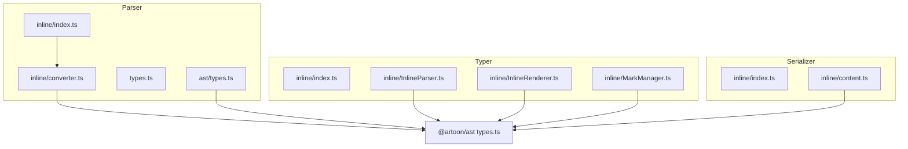
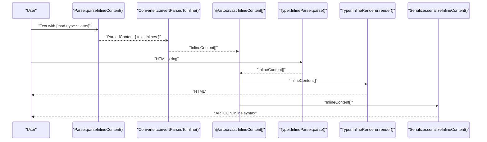
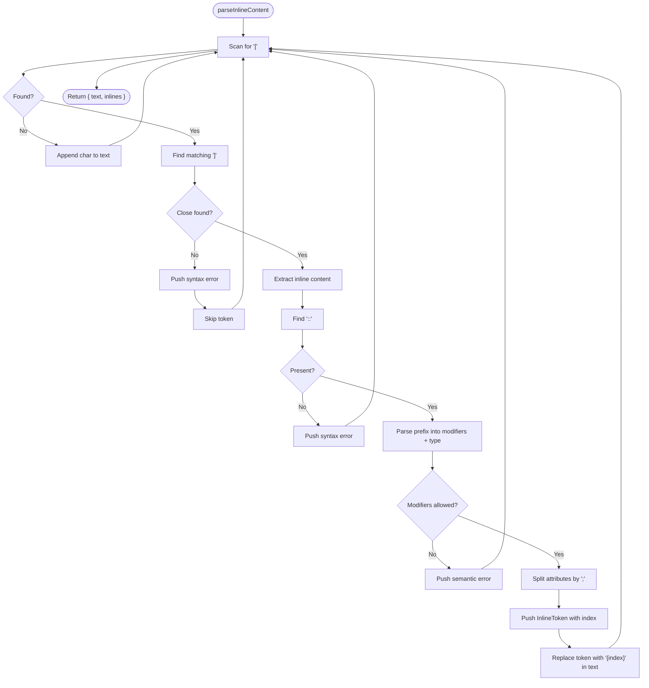
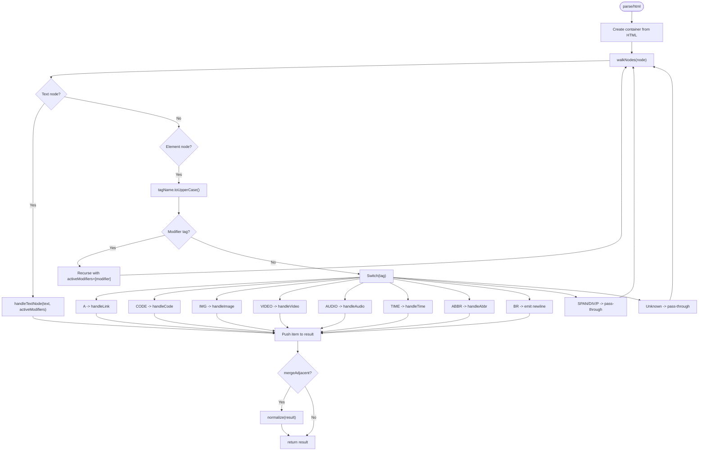
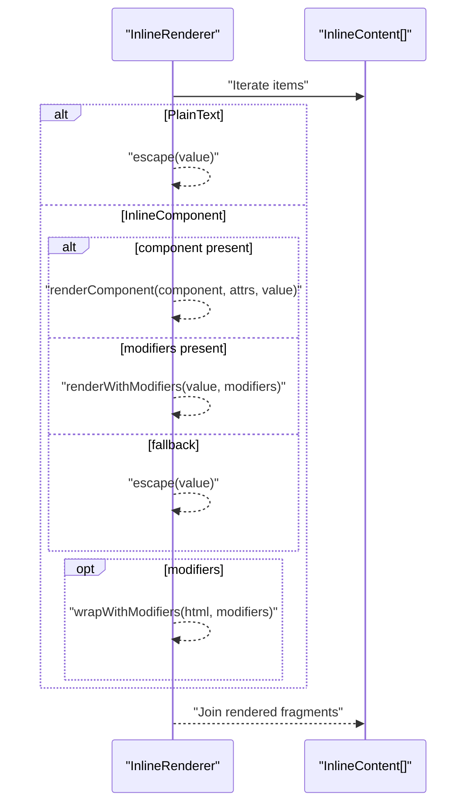
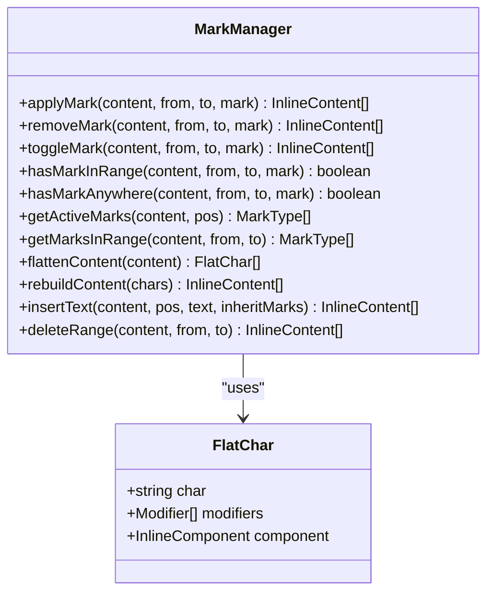
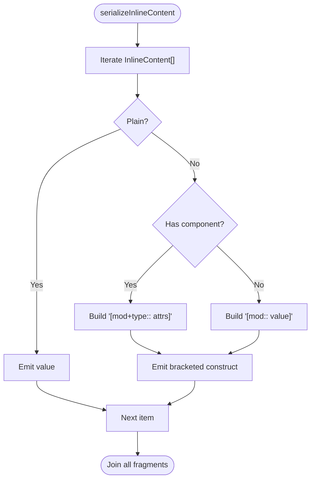
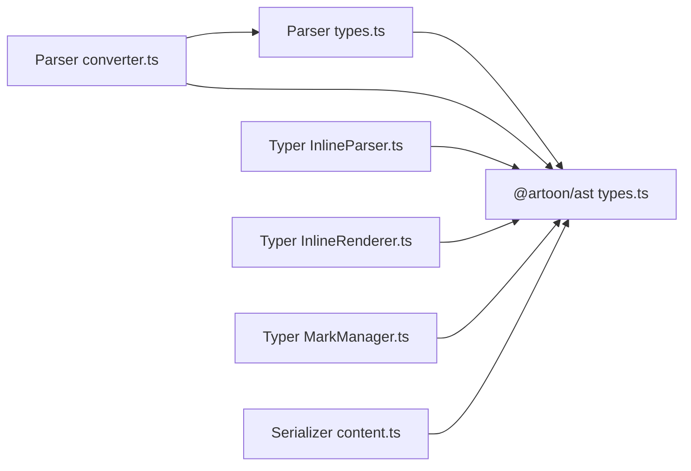

# Inline Parser

<cite>
**Referenced Files in This Document**
- [InlineParser.ts](file://artoon-typer/src/inline/InlineParser.ts)
- [InlineRenderer.ts](file://artoon-typer/src/inline/InlineRenderer.ts)
- [MarkManager.ts](file://artoon-typer/src/inline/MarkManager.ts)
- [index.ts](file://artoon-typer/src/inline/index.ts)
- [index.ts](file://artoon-typer/src/inline/InlineParser.ts)
- [index.ts](file://artoon-typer/src/inline/InlineRenderer.ts)
- [index.ts](file://artoon-typer/src/inline/MarkManager.ts)
- [index.ts](file://artoon-typer/src/inline/index.ts)
- [index.ts](file://artoon-parser/src/inline/index.ts)
- [converter.ts](file://artoon-parser/src/inline/converter.ts)
- [types.ts](file://artoon-parser/src/types.ts)
- [types.ts](file://artoon-parser/src/ast/types.ts)
- [types.ts](file://artoon-ast/src/types.ts)
- [content.ts](file://artoon-serializer/src/inline/content.ts)
- [index.ts](file://artoon-serializer/src/inline/index.ts)
- [inline.test.ts](file://artoon-parser/tests/inline.test.ts)
- [InlineParser.test.ts](file://artoon-typer/tests/inline/InlineParser.test.ts)
- [InlineRenderer.test.ts](file://artoon-typer/tests/inline/InlineRenderer.test.ts)
</cite>

## Table of Contents
1. [Introduction](#introduction)
2. [Project Structure](#project-structure)
3. [Core Components](#core-components)
4. [Architecture Overview](#architecture-overview)
5. [Detailed Component Analysis](#detailed-component-analysis)
6. [Dependency Analysis](#dependency-analysis)
7. [Performance Considerations](#performance-considerations)
8. [Troubleshooting Guide](#troubleshooting-guide)
9. [Conclusion](#conclusion)
10. [Appendices](#appendices)

## Introduction
This document describes the ARTOON Inline Parser module, which powers inline content parsing and rendering within blocks. It covers:
- The inline tokenizer that parses ARTOON’s bracketed inline syntax into structured tokens
- The converter that transforms internal tokens into the AST’s InlineContent[] format
- The DOM-based InlineParser that converts HTML back into InlineContent[]
- The InlineRenderer that renders InlineContent[] to HTML for the editor
- Utility functions for conversion and inspection
- Supported inline formatting (bold, italic, underline, strikethrough, highlight, subscript, superscript), inline components (links, code, images, media, abbreviations, time), and precedence rules
- Examples of complex inline content and their parsed representations
- Performance optimization strategies and integration with block-level parsing

## Project Structure
The inline parsing system spans three packages:
- Parser: tokenizes ARTOON inline syntax and converts to AST InlineContent[]
- Typer: parses HTML to InlineContent[] and renders InlineContent[] to HTML
- Serializer: serializes InlineContent[] back to ARTOON inline syntax

**Diagram sources**
- [index.ts:1-197](file://artoon-parser/src/inline/index.ts#L1-L197)
- [converter.ts:1-314](file://artoon-parser/src/inline/converter.ts#L1-L314)
- [types.ts:1-123](file://artoon-parser/src/types.ts#L1-L123)
- [types.ts:1-258](file://artoon-parser/src/ast/types.ts#L1-L258)
- [index.ts:1-30](file://artoon-typer/src/inline/index.ts#L1-L30)
- [InlineParser.ts:1-468](file://artoon-typer/src/inline/InlineParser.ts#L1-L468)
- [InlineRenderer.ts:1-295](file://artoon-typer/src/inline/InlineRenderer.ts#L1-L295)
- [MarkManager.ts:1-384](file://artoon-typer/src/inline/MarkManager.ts#L1-L384)
- [index.ts:1-4](file://artoon-serializer/src/inline/index.ts#L1-L4)
- [content.ts:1-115](file://artoon-serializer/src/inline/content.ts#L1-L115)
- [types.ts:1-539](file://artoon-ast/src/types.ts#L1-L539)

**Section sources**
- [index.ts:1-197](file://artoon-parser/src/inline/index.ts#L1-L197)
- [converter.ts:1-314](file://artoon-parser/src/inline/converter.ts#L1-L314)
- [types.ts:1-123](file://artoon-parser/src/types.ts#L1-L123)
- [types.ts:1-258](file://artoon-parser/src/ast/types.ts#L1-L258)
- [index.ts:1-30](file://artoon-typer/src/inline/index.ts#L1-L30)
- [InlineParser.ts:1-468](file://artoon-typer/src/inline/InlineParser.ts#L1-L468)
- [InlineRenderer.ts:1-295](file://artoon-typer/src/inline/InlineRenderer.ts#L1-L295)
- [MarkManager.ts:1-384](file://artoon-typer/src/inline/MarkManager.ts#L1-L384)
- [index.ts:1-4](file://artoon-serializer/src/inline/index.ts#L1-L4)
- [content.ts:1-115](file://artoon-serializer/src/inline/content.ts#L1-L115)
- [types.ts:1-539](file://artoon-ast/src/types.ts#L1-L539)

## Core Components
- Inline tokenizer and converter (Parser):
  - parseInlineContent(content, lineNumber): scans text for bracketed inline constructs and extracts tokens
  - hasInlineTokens(content): fast check for presence of inline brackets
  - convertParsedToInline(parsed): converts internal ParsedContent to AST InlineContent[]
  - convertInlineToParsed(content): serializes InlineContent[] back to internal ParsedContent
- DOM-based InlineParser (Typer):
  - parse(html): converts HTML to InlineContent[]
  - parseElement(element): converts a DOM element to InlineContent[]
  - normalize(): merges adjacent plain or same-formatted inline items
- InlineRenderer (Typer):
  - render(content): renders InlineContent[] to HTML with optional escaping and data attributes
- Serializer:
  - serializeInlineContent(content): serializes InlineContent[] to ARTOON inline syntax
- MarkManager (Typer):
  - applyMark/removeMark/toggleMark: applies/removes/modifies text modifiers on InlineContent[]
  - flattenContent/rebuildContent: low-level character-level manipulation for precise formatting

Supported inline formatting and components:
- Modifiers: bold (s), italic (e), underline (u), strikethrough (d), highlight (mark), subscript (sub), superscript (sup)
- Components: links (a), inline code (c), images (img), videos (video), audio (audio), files (file), abbreviations (abbr), time (time)

**Section sources**
- [index.ts:1-197](file://artoon-parser/src/inline/index.ts#L1-L197)
- [converter.ts:1-314](file://artoon-parser/src/inline/converter.ts#L1-L314)
- [InlineParser.ts:1-468](file://artoon-typer/src/inline/InlineParser.ts#L1-L468)
- [InlineRenderer.ts:1-295](file://artoon-typer/src/inline/InlineRenderer.ts#L1-L295)
- [MarkManager.ts:1-384](file://artoon-typer/src/inline/MarkManager.ts#L1-L384)
- [content.ts:1-115](file://artoon-serializer/src/inline/content.ts#L1-L115)
- [types.ts:1-123](file://artoon-parser/src/types.ts#L1-L123)
- [types.ts:1-539](file://artoon-ast/src/types.ts#L1-L539)

## Architecture Overview
The inline pipeline integrates with block-level parsing and rendering:

**Diagram sources**
- [index.ts:1-197](file://artoon-parser/src/inline/index.ts#L1-L197)
- [converter.ts:1-314](file://artoon-parser/src/inline/converter.ts#L1-L314)
- [InlineParser.ts:1-468](file://artoon-typer/src/inline/InlineParser.ts#L1-L468)
- [InlineRenderer.ts:1-295](file://artoon-typer/src/inline/InlineRenderer.ts#L1-L295)
- [content.ts:1-115](file://artoon-serializer/src/inline/content.ts#L1-L115)
- [types.ts:1-539](file://artoon-ast/src/types.ts#L1-L539)

## Detailed Component Analysis

### Parser Inline Tokenizer and Converter
- parseInlineContent(content, lineNumber):
  - Scans for balanced [ ... ] constructs, validates presence of :: separator, parses prefix into modifiers and component type, splits attributes by ;, records errors for malformed tokens, and produces ParsedContent with placeholders for tokens embedded in plain text.
- hasInlineTokens(content):
  - Quick boolean check for presence of [ and ].
- convertParsedToInline(parsed):
  - Reconstructs InlineContent[] by splitting the text at placeholders and inserting InlineComponent or PlainText nodes, mapping attributes per component type, and preserving modifiers.
- convertInlineToParsed(content):
  - Serializes InlineContent[] back to internal ParsedContent by emitting placeholders and collecting InlineToken entries with attributes extracted from InlineComponent.

**Diagram sources**
- [index.ts:1-197](file://artoon-parser/src/inline/index.ts#L1-L197)
- [converter.ts:1-314](file://artoon-parser/src/inline/converter.ts#L1-L314)

**Section sources**
- [index.ts:1-197](file://artoon-parser/src/inline/index.ts#L1-L197)
- [converter.ts:1-314](file://artoon-parser/src/inline/converter.ts#L1-L314)
- [types.ts:1-123](file://artoon-parser/src/types.ts#L1-L123)

### DOM-Based InlineParser (HTML to InlineContent[])
- parse(html)/parseElement(element):
  - Creates a container, walks DOM nodes, collects PlainText and InlineComponent items, normalizes whitespace if enabled, and merges adjacent items when configured.
- Tag-to-modifier mapping:
  - STRONG/B → s; EM/I → e; U → u; DEL/S/STRIKE → d; MARK → mark; SUB → sub; SUP → sup.
- Component handlers:
  - A: attributes.url, attributes.text, attributes.title; preserves active modifiers
  - CODE: attributes.code, attributes.lang extracted from class="language-..."
  - IMG: attributes.src, attributes.alt, attributes.title, attributes.width, attributes.height
  - VIDEO/AUDIO: attributes.src, width/height when provided
  - TIME: attributes.datetime, attributes.display
  - ABBR: attributes.short, attributes.full
  - BR: emits newline PlainText
  - SPAN/DIV/P: pass-through containers

**Diagram sources**
- [InlineParser.ts:1-468](file://artoon-typer/src/inline/InlineParser.ts#L1-L468)

**Section sources**
- [InlineParser.ts:1-468](file://artoon-typer/src/inline/InlineParser.ts#L1-L468)

### InlineRenderer (InlineContent[] to HTML)
- render(content):
  - Iterates InlineContent[], renders PlainText with optional escaping, renders components via dedicated handlers, and wraps text with modifiers from inside out.
- Rendering precedence:
  - Modifiers are applied in reverse order of appearance to ensure correct nesting semantics.
- Options:
  - escapeHtml: escape HTML entities
  - addDataAttributes: attach class names like artoon-s for editor integration
  - classPrefix: customize class name prefix

**Diagram sources**
- [InlineRenderer.ts:1-295](file://artoon-typer/src/inline/InlineRenderer.ts#L1-L295)

**Section sources**
- [InlineRenderer.ts:1-295](file://artoon-typer/src/inline/InlineRenderer.ts#L1-L295)

### MarkManager (Text Modifier Operations)
- applyMark/removeMark/toggleMark:
  - Flattens InlineContent[] into character-level FlatChar with modifier sets, applies or removes modifiers in a range, and rebuilds InlineContent[].
- flattenContent/rebuildContent:
  - Exposes low-level APIs to manipulate text with precise modifier boundaries.
- getActiveMarks/getMarksInRange:
  - Inspects current formatting state at a cursor or over a selection.

**Diagram sources**
- [MarkManager.ts:1-384](file://artoon-typer/src/inline/MarkManager.ts#L1-L384)

**Section sources**
- [MarkManager.ts:1-384](file://artoon-typer/src/inline/MarkManager.ts#L1-L384)

### Serializer (InlineContent[] to ARTOON Syntax)
- serializeInlineContent(content):
  - Emits plain text and bracketed inline constructs [mod+type:: attrs], preserving attribute ordering and semantics per component.

**Diagram sources**
- [content.ts:1-115](file://artoon-serializer/src/inline/content.ts#L1-L115)

**Section sources**
- [content.ts:1-115](file://artoon-serializer/src/inline/content.ts#L1-L115)

## Dependency Analysis
- Parser types unify with @artoon/ast:
  - InlineComponentType, Modifier, InlineContent, PlainText, InlineComponent are shared across packages.
- Parser converter depends on:
  - Parser internal types (InlineToken, ParsedContent)
  - AST InlineContent types
- Typer InlineParser/Renderer/MarkManager depend on:
  - AST InlineContent types
  - Parser modifier/component restrictions (NO_MODIFIER_COMPONENTS)
- Serializer depends on:
  - AST InlineContent types

**Diagram sources**
- [types.ts:1-123](file://artoon-parser/src/types.ts#L1-L123)
- [types.ts:1-258](file://artoon-parser/src/ast/types.ts#L1-L258)
- [converter.ts:1-314](file://artoon-parser/src/inline/converter.ts#L1-L314)
- [InlineParser.ts:1-468](file://artoon-typer/src/inline/InlineParser.ts#L1-L468)
- [InlineRenderer.ts:1-295](file://artoon-typer/src/inline/InlineRenderer.ts#L1-L295)
- [MarkManager.ts:1-384](file://artoon-typer/src/inline/MarkManager.ts#L1-L384)
- [content.ts:1-115](file://artoon-serializer/src/inline/content.ts#L1-L115)
- [types.ts:1-539](file://artoon-ast/src/types.ts#L1-L539)

**Section sources**
- [types.ts:1-123](file://artoon-parser/src/types.ts#L1-L123)
- [types.ts:1-258](file://artoon-parser/src/ast/types.ts#L1-L258)
- [converter.ts:1-314](file://artoon-parser/src/inline/converter.ts#L1-L314)
- [InlineParser.ts:1-468](file://artoon-typer/src/inline/InlineParser.ts#L1-L468)
- [InlineRenderer.ts:1-295](file://artoon-typer/src/inline/InlineRenderer.ts#L1-L295)
- [MarkManager.ts:1-384](file://artoon-typer/src/inline/MarkManager.ts#L1-L384)
- [content.ts:1-115](file://artoon-serializer/src/inline/content.ts#L1-L115)
- [types.ts:1-539](file://artoon-ast/src/types.ts#L1-L539)

## Performance Considerations
- Inline normalization:
  - The InlineParser merges adjacent plain or same-formatted inline items to reduce downstream rendering overhead. Disable merging via options when preserving exact structure is required.
- Whitespace normalization:
  - Enabling normalizeWhitespace reduces memory footprint for long runs of spaces/newlines.
- Attribute extraction:
  - Converter.parseAttributes uses targeted switches per component type to avoid unnecessary parsing overhead.
- Renderer escaping:
  - Escape only when needed; disabling escapeHtml can improve throughput for trusted content.
- Large inline content:
  - Prefer streaming-like processing by splitting content into chunks when integrating with block-level parsers. Use MarkManager’s flatten/rebuild APIs for incremental edits to minimize reflows.

[No sources needed since this section provides general guidance]

## Troubleshooting Guide
Common issues and resolutions:
- Unclosed brackets:
  - Symptom: Syntax error reported for unclosed [.
  - Resolution: Ensure every [ has a matching ].
- Missing :: separator:
  - Symptom: Syntax error indicating missing ::.
  - Resolution: Use the [type:: content] or [modifier+type:: content] format.
- Modifiers on disallowed components:
  - Symptom: Semantic error stating modifiers not allowed on component.
  - Resolution: Remove modifiers from img, audio, video, file, c.
- Empty or whitespace-only content:
  - Symptom: InlineParser filters out empty items.
  - Resolution: Provide meaningful text or components.
- Unknown HTML tags:
  - Symptom: Unknown elements pass through as plain text.
  - Resolution: Use supported tags or wrap in allowed containers.

**Section sources**
- [index.ts:1-197](file://artoon-parser/src/inline/index.ts#L1-L197)
- [InlineParser.ts:1-468](file://artoon-typer/src/inline/InlineParser.ts#L1-L468)
- [InlineRenderer.ts:1-295](file://artoon-typer/src/inline/InlineRenderer.ts#L1-L295)

## Conclusion
The ARTOON Inline Parser module provides a robust, extensible pipeline for parsing, converting, rendering, and serializing inline content. It supports rich inline formatting and components, enforces semantic rules, and integrates cleanly with block-level parsing. By leveraging normalization, careful attribute mapping, and precise modifier handling, it ensures correctness and performance across diverse content scenarios.

[No sources needed since this section summarizes without analyzing specific files]

## Appendices

### Supported Inline Formatting and Components
- Modifiers: s (bold), e (italic), u (underline), d (strikethrough), mark (highlight), sub (subscript), sup (superscript)
- Components: a (link), c (inline code), img (image), video (video), audio (audio), file (downloadable file), abbr (abbreviation), time (date/time)
- Precedence:
  - Modifiers are applied from inside out during rendering.
  - Modifiers are not allowed on media/code components; parser enforces this.

**Section sources**
- [types.ts:1-123](file://artoon-parser/src/types.ts#L1-L123)
- [InlineRenderer.ts:1-295](file://artoon-typer/src/inline/InlineRenderer.ts#L1-L295)
- [converter.ts:1-314](file://artoon-parser/src/inline/converter.ts#L1-L314)

### Examples of Complex Inline Content
- Mixed plain and formatted text:
  - Input: “Hello <strong>bold</strong> world”
  - Output: [plain: Hello ], [inline: modifiers=['s'], value='bold'], [plain: world]
- Link with text and title:
  - Input: <a href="https://example.com" title="Example">visit</a>
  - Output: [inline: component='a', attributes={url:'https://example.com', text:'visit', title:'Example'}]
- Inline code with language:
  - Input: <code class="language-js">console.log()</code>
  - Output: [inline: component='c', attributes={code:'console.log()', lang:'js'}]
- Nested modifiers:
  - Input: <strong>bold <em>and italic</em> only bold</strong>
  - Output: Single inline item with modifiers ['s','e'] wrapping the inner text
- Abbreviation and time:
  - Input: <abbr title="HyperText Markup Language">HTML</abbr> on <time datetime="2026-01-06">6 Jan 2026</time>
  - Output: Two inline components with attributes short/full and datetime/display respectively

**Section sources**
- [InlineParser.test.ts:1-361](file://artoon-typer/tests/inline/InlineParser.test.ts#L1-L361)
- [InlineRenderer.test.ts:1-395](file://artoon-typer/tests/inline/InlineRenderer.test.ts#L1-L395)
- [inline.test.ts:1-167](file://artoon-parser/tests/inline.test.ts#L1-L167)

### Integration with Block-Level Parsing
- Parser converts bracketed inline syntax to InlineContent[] for TextNode.content.
- Typer converts HTML from block editors back to InlineContent[] for seamless round-tripping.
- Serializer emits ARTOON syntax for persistence and export.

**Section sources**
- [types.ts:1-258](file://artoon-parser/src/ast/types.ts#L1-L258)
- [converter.ts:1-314](file://artoon-parser/src/inline/converter.ts#L1-L314)
- [InlineParser.ts:1-468](file://artoon-typer/src/inline/InlineParser.ts#L1-L468)
- [content.ts:1-115](file://artoon-serializer/src/inline/content.ts#L1-L115)