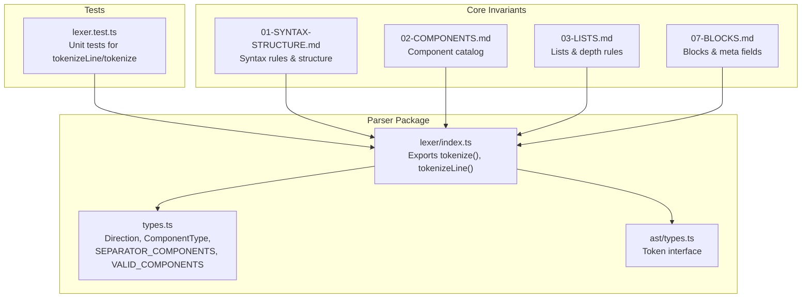
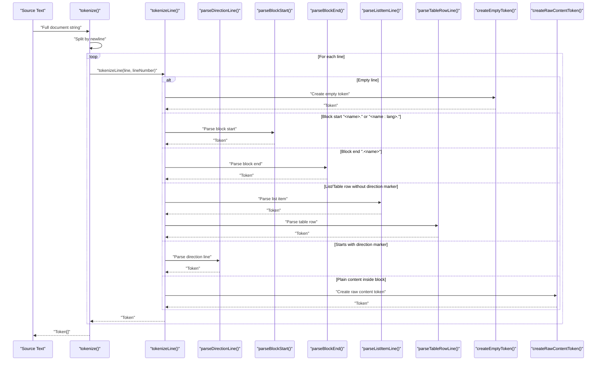
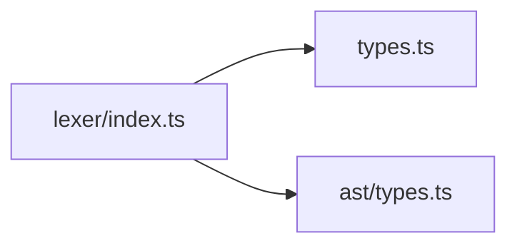

# Lexer Module

<cite>
**Referenced Files in This Document**
- [index.ts](file://artoon-parser/src/lexer/index.ts)
- [types.ts](file://artoon-parser/src/types.ts)
- [ast/types.ts](file://artoon-parser/src/ast/types.ts)
- [lexer.test.ts](file://artoon-parser/tests/lexer.test.ts)
- [01-SYNTAX-STRUCTURE.md](file://Core Invariants/01-SYNTAX-STRUCTURE.md)
- [02-COMPONENTS.md](file://Core Invariants/02-COMPONENTS.md)
- [03-LISTS.md](file://Core Invariants/03-LISTS.md)
- [07-BLOCKS.md](file://Core Invariants/07-BLOCKS.md)
</cite>

## Table of Contents
1. [Introduction](#introduction)
2. [Project Structure](#project-structure)
3. [Core Components](#core-components)
4. [Architecture Overview](#architecture-overview)
5. [Detailed Component Analysis](#detailed-component-analysis)
6. [Dependency Analysis](#dependency-analysis)
7. [Performance Considerations](#performance-considerations)
8. [Troubleshooting Guide](#troubleshooting-guide)
9. [Conclusion](#conclusion)
10. [Appendices](#appendices)

## Introduction
This document describes the ARTOON Lexer module responsible for converting ARTOON source text into structured tokens. It explains the tokenization process, token types, pattern matching, and state management. It documents the public APIs tokenize() and tokenizeLine(), their parameters and return values, and demonstrates how various ARTOON syntax patterns are recognized and tokenized. Edge cases, whitespace handling, and special character processing are covered, along with performance considerations and troubleshooting guidance.

## Project Structure
The Lexer resides in the parser package and works with shared type definitions and AST token types. Core syntax and component references are documented in the Core Invariants.

**Diagram sources**
- [index.ts:1-483](file://artoon-parser/src/lexer/index.ts#L1-L483)
- [types.ts:1-123](file://artoon-parser/src/types.ts#L1-L123)
- [ast/types.ts:185-204](file://artoon-parser/src/ast/types.ts#L185-L204)
- [lexer.test.ts:1-160](file://artoon-parser/tests/lexer.test.ts#L1-L160)
- [01-SYNTAX-STRUCTURE.md:1-214](file://Core Invariants/01-SYNTAX-STRUCTURE.md#L1-L214)
- [02-COMPONENTS.md:1-315](file://Core Invariants/02-COMPONENTS.md#L1-L315)
- [03-LISTS.md:1-249](file://Core Invariants/03-LISTS.md#L1-L249)
- [07-BLOCKS.md:1-302](file://Core Invariants/07-BLOCKS.md#L1-L302)

**Section sources**
- [index.ts:1-483](file://artoon-parser/src/lexer/index.ts#L1-L483)
- [types.ts:1-123](file://artoon-parser/src/types.ts#L1-L123)
- [ast/types.ts:185-204](file://artoon-parser/src/ast/types.ts#L185-L204)
- [lexer.test.ts:1-160](file://artoon-parser/tests/lexer.test.ts#L1-L160)
- [01-SYNTAX-STRUCTURE.md:1-214](file://Core Invariants/01-SYNTAX-STRUCTURE.md#L1-L214)
- [02-COMPONENTS.md:1-315](file://Core Invariants/02-COMPONENTS.md#L1-L315)
- [03-LISTS.md:1-249](file://Core Invariants/03-LISTS.md#L1-L249)
- [07-BLOCKS.md:1-302](file://Core Invariants/07-BLOCKS.md#L1-L302)

## Core Components
- Token: The fundamental unit produced by the lexer. It carries line metadata, direction, component presence, component type, child-element flag, nesting depth, separator presence, content, block start/end markers, block name/language, and comment flag.
- Direction: Either RTL ('rtl') or LTR ('ltr'), derived from the leading directional marker on a line.
- ComponentType: A union of all valid semantic component names (text, media, separators, lists, tables, compounds, code, etc.).
- Separator components: A predefined set of components that do not require a content separator ('::').
- Valid components: A comprehensive list of all supported component identifiers.

Key exports:
- tokenize(source: string): Token[] — splits input into lines and tokenizes each line with an increasing line number.
- tokenizeLine(line: string, lineNumber: number): Token — parses a single line into a Token according to ARTOON syntax rules.

**Section sources**
- [ast/types.ts:185-204](file://artoon-parser/src/ast/types.ts#L185-L204)
- [types.ts:1-123](file://artoon-parser/src/types.ts#L1-L123)
- [index.ts:10-11](file://artoon-parser/src/lexer/index.ts#L10-L11)
- [index.ts:400-403](file://artoon-parser/src/lexer/index.ts#L400-L403)

## Architecture Overview
The lexer implements a deterministic, line-by-line tokenizer. It applies a series of precedence checks to classify each line into one of several categories: empty, block start/end, list/table row, direction-prefixed content, or raw content. It also handles child elements, comments, and combined separators.

**Diagram sources**
- [index.ts:10-77](file://artoon-parser/src/lexer/index.ts#L10-L77)
- [index.ts:82-277](file://artoon-parser/src/lexer/index.ts#L82-L277)
- [index.ts:282-344](file://artoon-parser/src/lexer/index.ts#L282-L344)
- [index.ts:400-403](file://artoon-parser/src/lexer/index.ts#L400-L403)
- [index.ts:422-448](file://artoon-parser/src/lexer/index.ts#L422-L448)
- [index.ts:461-482](file://artoon-parser/src/lexer/index.ts#L461-L482)
- [index.ts:349-388](file://artoon-parser/src/lexer/index.ts#L349-L388)

## Detailed Component Analysis

### Tokenize API
- tokenize(source: string): Token[]
  - Splits the input by platform-appropriate newlines.
  - Maps each line to tokenizeLine(line, index + 1).
  - Returns an array of tokens preserving line order.

- tokenizeLine(line: string, lineNumber: number): Token
  - Trims the input line.
  - Applies precedence checks:
    - Empty line → empty token.
    - Block end '.<name>' → block end token.
    - Block start '<name>.' or '<name:lang>.' → block start token.
    - List/Table row without direction marker → list/table token.
    - Must start with direction marker → parseDirectionLine().
    - Otherwise → raw content token.

Behavioral highlights:
- Whitespace handling: Leading/trailing whitespace is preserved in raw content; internal spaces are significant for separators and content parsing.
- Depth calculation: For child elements and list items, depth is computed from leading dashes.
- Comments: Lines starting with '>.:::' or '<.:::' are treated as comments.
- Combined separators: A single component line may contain multiple separator components separated by ';'.

**Section sources**
- [index.ts:10-77](file://artoon-parser/src/lexer/index.ts#L10-L77)
- [index.ts:400-403](file://artoon-parser/src/lexer/index.ts#L400-L403)
- [lexer.test.ts:142-159](file://artoon-parser/tests/lexer.test.ts#L142-L159)

### Direction-Prefixed Parsing
parseDirectionLine(trimmed: string, lineNumber: number, raw: string): Token
- Determines direction from the first character ('>' for RTL, '<' for LTR).
- Supports child elements: '>.-type:: ...' or '<.-type:: ...'.
  - Counts leading dashes after '.-' to compute depth.
  - Parses optional 'field' meta format using ':field: value'.
- Handles component declarations: '.type' followed by ':: content'.
- Supports comments: '>.::: ...' sets isComment flag.
- Handles separator components and combined separators (e.g., 'br;hr;br').
- Falls back to plain content when no separator is present.

Edge cases:
- Mixed-direction content is governed by the line’s direction marker; inherited semantics apply later in the parser stage.
- '::' requires a mandatory space after it; otherwise, the lexer treats the line differently.

**Section sources**
- [index.ts:82-277](file://artoon-parser/src/lexer/index.ts#L82-L277)
- [lexer.test.ts:14-28](file://artoon-parser/tests/lexer.test.ts#L14-L28)
- [lexer.test.ts:39-69](file://artoon-parser/tests/lexer.test.ts#L39-L69)

### Block Start/End Parsing
- parseBlockStart(trimmed: string, lineNumber: number, raw: string): Token
  - Recognizes '<name>.' or '<name:lang>.'.
  - Extracts block name and optional language.
  - Marks as block start with direction LTR.

- parseBlockEnd(trimmed: string, lineNumber: number, raw: string): Token
  - Recognizes '.<name>'.
  - Marks as block end with direction LTR.

Validation:
- isValidBlockName(name: string): boolean ensures block names match the allowed pattern.

**Section sources**
- [index.ts:282-344](file://artoon-parser/src/lexer/index.ts#L282-L344)
- [index.ts:393-395](file://artoon-parser/src/lexer/index.ts#L393-L395)
- [lexer.test.ts:89-111](file://artoon-parser/tests/lexer.test.ts#L89-L111)

### List and Table Row Parsing
- isListItemLine(trimmed: string): boolean
  - Detects lines starting with optional leading dashes followed by 'li::', 'dt::', or 'dd::'.

- parseListItemLine(trimmed: string, lineNumber: number, raw: string): Token
  - Computes depth from leading dashes.
  - Extracts component type and content after '::'.

- isTableRowLine(trimmed: string): boolean
  - Detects lines starting with 'th::' or 'tr::'.

- parseTableRowLine(trimmed: string, lineNumber: number, raw: string): Token
  - Extracts component type and content after '::'.

Notes:
- List items inherit direction from their parent list container.
- Table rows inherit direction from their parent table container.

**Section sources**
- [index.ts:410-417](file://artoon-parser/src/lexer/index.ts#L410-L417)
- [index.ts:422-448](file://artoon-parser/src/lexer/index.ts#L422-L448)
- [index.ts:454-456](file://artoon-parser/src/lexer/index.ts#L454-L456)
- [index.ts:461-482](file://artoon-parser/src/lexer/index.ts#L461-L482)
- [lexer.test.ts:123-140](file://artoon-parser/tests/lexer.test.ts#L123-L140)

### Token Model and Types
Token interface fields:
- line: number
- raw: string
- direction: 'rtl' | 'ltr'
- hasComponent: boolean
- componentType: string | null
- isChildElement: boolean
- depth: number
- separator: '::' | null
- content: string
- isBlockStart: boolean
- isBlockEnd: boolean
- blockName: string | null
- blockLang: string | null
- isComment: boolean

Direction and component type definitions:
- Direction: 'rtl' | 'ltr'
- ComponentType: union of text, semantic, media, separator, list, table, compound, code, and others
- SEPARATOR_COMPONENTS: 'br', 'hr', 'wbr'
- VALID_COMPONENTS: comprehensive list of supported component identifiers

**Section sources**
- [ast/types.ts:185-204](file://artoon-parser/src/ast/types.ts#L185-L204)
- [types.ts:1-123](file://artoon-parser/src/types.ts#L1-L123)

### Tokenization Examples
Below are representative examples mapped to expected token outputs. These illustrate how the lexer interprets ARTOON syntax patterns.

- Empty line
  - Input: ""
  - Output: Token with hasComponent=false, content="", depth=0
  - Reference: [lexer.test.ts:7-12](file://artoon-parser/tests/lexer.test.ts#L7-L12)

- RTL direction marker with component and content
  - Input: ">.p:: نص"
  - Output: direction='rtl', hasComponent=true, componentType='p', content='نص'
  - Reference: [lexer.test.ts:14-20](file://artoon-parser/tests/lexer.test.ts#L14-L20)

- LTR direction marker with component and content
  - Input: "<.p:: text"
  - Output: direction='ltr', hasComponent=true, componentType='p', content='text'
  - Reference: [lexer.test.ts:22-28](file://artoon-parser/tests/lexer.test.ts#L22-L28)

- Heading components t1–t6
  - Input: ">.t1:: عنوان", ">.t2:: عنوان", ..., ">.t6:: عنوان"
  - Output: componentType='t1'..'t6'
  - Reference: [lexer.test.ts:30-35](file://artoon-parser/tests/lexer.test.ts#L30-L35)

- Separator components (no '::')
  - Input: ">.br"
  - Output: componentType='br', separator=null, content=''
  - Reference: [lexer.test.ts:47-52](file://artoon-parser/tests/lexer.test.ts#L47-L52)

- Combined separators
  - Input: ">.br;hr;br"
  - Output: componentType='br;hr;br'
  - Reference: [lexer.test.ts:54-57](file://artoon-parser/tests/lexer.test.ts#L54-L57)

- Depth with dashes
  - Input: "li:: item", "-li:: item", "--li:: item", "---li:: item"
  - Output: depth=0,1,2,3 respectively
  - Reference: [lexer.test.ts:59-67](file://artoon-parser/tests/lexer.test.ts#L59-L67)

- Child elements
  - Input: ">.-img:: photo.jpg", "<.-caption:: description"
  - Output: isChildElement=true, componentType='img'/'caption'
  - Reference: [lexer.test.ts:73-86](file://artoon-parser/tests/lexer.test.ts#L73-L86)

- Block start and end
  - Input: "<meta>.", "<code:js>.", ".<meta>"
  - Output: isBlockStart=true/false, blockName='meta'/'code', blockLang=null/'js'
  - Reference: [lexer.test.ts:91-111](file://artoon-parser/tests/lexer.test.ts#L91-L111)

- Comments
  - Input: ">.::: هذا تعليق"
  - Output: isComment=true, content='هذا تعليق'
  - Reference: [lexer.test.ts:115-119](file://artoon-parser/tests/lexer.test.ts#L115-L119)

- List containers
  - Input: ">.ul::", ">.ol::", ">.dl::"
  - Output: componentType='ul'/'ol'/'dl'
  - Reference: [lexer.test.ts:125-139](file://artoon-parser/tests/lexer.test.ts#L125-L139)

- Full document tokenization
  - Input: Multi-line ARTOON document
  - Output: Array of Tokens with expected lengths and directions/components
  - Reference: [lexer.test.ts:144-159](file://artoon-parser/tests/lexer.test.ts#L144-L159)

**Section sources**
- [lexer.test.ts:7-159](file://artoon-parser/tests/lexer.test.ts#L7-L159)

### Pattern Matching and State Management
Pattern matching logic:
- Precedence order:
  1) Empty line
  2) Block end '.<name>'
  3) Block start '<name>.' or '<name:lang>.'
  4) List/Table rows without direction marker
  5) Direction marker required; otherwise raw content
  6) Direction-prefixed parsing

State management:
- Depth: computed from leading dashes for child elements and list items.
- Direction: inherited per line via the leading marker; comments and raw content preserve direction semantics.
- Component presence: tracked via hasComponent and componentType.
- Separator presence: separator='::' or null depending on presence of '::'.

Whitespace handling:
- Leading/trailing whitespace is trimmed for classification but raw content preserves original spacing.
- '::' requires a mandatory space immediately after the separator.

Special characters:
- '.' introduces component declarations or block markers.
- '-' indicates nesting depth for child elements and list items.
- ';' separates multiple values for combined separators.
- ':' introduces language in block start and field names in child elements.

**Section sources**
- [index.ts:10-77](file://artoon-parser/src/lexer/index.ts#L10-L77)
- [index.ts:82-277](file://artoon-parser/src/lexer/index.ts#L82-L277)
- [index.ts:282-344](file://artoon-parser/src/lexer/index.ts#L282-L344)
- [index.ts:422-482](file://artoon-parser/src/lexer/index.ts#L422-L482)
- [01-SYNTAX-STRUCTURE.md:14-35](file://Core Invariants/01-SYNTAX-STRUCTURE.md#L14-L35)

## Dependency Analysis
The lexer depends on:
- Shared type definitions for Direction, ComponentType, SEPARATOR_COMPONENTS, and VALID_COMPONENTS.
- AST Token interface for the output shape.
- Core Invariants documentation for syntax rules and component catalogs.

**Diagram sources**
- [index.ts:4-5](file://artoon-parser/src/lexer/index.ts#L4-L5)
- [types.ts:1-123](file://artoon-parser/src/types.ts#L1-L123)
- [ast/types.ts:185-204](file://artoon-parser/src/ast/types.ts#L185-L204)

**Section sources**
- [index.ts:4-5](file://artoon-parser/src/lexer/index.ts#L4-L5)
- [types.ts:1-123](file://artoon-parser/src/types.ts#L1-L123)
- [ast/types.ts:185-204](file://artoon-parser/src/ast/types.ts#L185-L204)

## Performance Considerations
- Time complexity: O(n) over the number of lines; each line is processed once with constant-time checks and substring operations.
- Space complexity: O(n) for the output array of tokens; auxiliary memory is linear in the number of lines plus the total length of content strings.
- Optimizations:
  - Prefer trimming once per line.
  - Use early exits for empty lines and block markers to minimize branching.
  - Avoid unnecessary allocations by reusing constants (e.g., SEPARATOR_COMPONENTS).
  - Consider streaming tokenization for very large documents to reduce peak memory usage.

[No sources needed since this section provides general guidance]

## Troubleshooting Guide
Common issues and resolutions:
- Missing space after '::'
  - Symptom: Unexpected parsing behavior or missing content.
  - Cause: '::' must be followed by a space.
  - Fix: Ensure exactly one space after '::'.
  - Reference: [01-SYNTAX-STRUCTURE.md:27-35](file://Core Invariants/01-SYNTAX-STRUCTURE.md#L27-L35)

- Incorrect block naming
  - Symptom: Block start/end not recognized.
  - Cause: Block names must match the allowed pattern.
  - Fix: Use only lowercase letters and digits (not starting with digit), and avoid spaces/special characters.
  - Reference: [07-BLOCKS.md:237-248](file://Core Invariants/07-BLOCKS.md#L237-L248)

- Misplaced direction marker
  - Symptom: Wrong direction or parsing failure.
  - Cause: Every line must start with '>' or '<'.
  - Fix: Ensure each line begins with the appropriate direction marker.
  - Reference: [01-SYNTAX-STRUCTURE.md:38-46](file://Core Invariants/01-SYNTAX-STRUCTURE.md#L38-L46)

- Confusion between inline code and code block
  - Symptom: Unexpected tokenization for code-like content.
  - Cause: Inline code uses '.c:: ...' within content; code block uses '<code:lang>.' ... .<code>.
  - Fix: Use the correct construct for inline vs block code.
  - Reference: [02-COMPONENTS.md:220-288](file://Core Invariants/02-COMPONENTS.md#L220-L288)

- Depth interpretation
  - Symptom: Unexpected nesting level.
  - Cause: Depth equals the number of leading dashes.
  - Fix: Count leading dashes accurately for child elements and list items.
  - Reference: [03-LISTS.md:71-82](file://Core Invariants/03-LISTS.md#L71-L82)

- Combined separators
  - Symptom: Separator not recognized.
  - Cause: Must be a single component line containing only allowed separator components joined by ';'.
  - Fix: Use 'br;hr;br' format on a single line without '::'.
  - Reference: [02-COMPONENTS.md:193-217](file://Core Invariants/02-COMPONENTS.md#L193-L217)

Debugging techniques:
- Unit tests: Use existing tests as references for expected outputs.
  - Reference: [lexer.test.ts:1-160](file://artoon-parser/tests/lexer.test.ts#L1-L160)
- Incremental verification: Test small fragments of ARTOON syntax to isolate failures.
- Compare raw vs trimmed lines: Confirm whether whitespace differences cause misclassification.

**Section sources**
- [01-SYNTAX-STRUCTURE.md:27-46](file://Core Invariants/01-SYNTAX-STRUCTURE.md#L27-L46)
- [02-COMPONENTS.md:193-288](file://Core Invariants/02-COMPONENTS.md#L193-L288)
- [03-LISTS.md:71-82](file://Core Invariants/03-LISTS.md#L71-L82)
- [07-BLOCKS.md:237-248](file://Core Invariants/07-BLOCKS.md#L237-L248)
- [lexer.test.ts:1-160](file://artoon-parser/tests/lexer.test.ts#L1-L160)

## Conclusion
The ARTOON Lexer provides a robust, line-oriented tokenizer that transforms ARTOON source text into structured tokens. Its design emphasizes clarity, determinism, and adherence to ARTOON syntax rules. By leveraging direction markers, component declarations, and strict separator semantics, it enables accurate downstream parsing. The provided APIs tokenize entire documents or individual lines, supporting incremental development and testing.

[No sources needed since this section summarizes without analyzing specific files]

## Appendices

### API Reference
- tokenize(source: string): Token[]
  - Parameters: source — ARTOON document string.
  - Returns: Array of Token objects representing each line.
  - Notes: Uses platform-appropriate newline splitting.

- tokenizeLine(line: string, lineNumber: number): Token
  - Parameters: line — a single line of ARTOON text; lineNumber — 1-based index.
  - Returns: Token object with direction, component presence, depth, separator, content, and block markers.

**Section sources**
- [index.ts:10-11](file://artoon-parser/src/lexer/index.ts#L10-L11)
- [index.ts:400-403](file://artoon-parser/src/lexer/index.ts#L400-L403)

### Token Fields Reference
- line: number — source line index.
- raw: string — original line content.
- direction: 'rtl' | 'ltr' — direction inferred from the line.
- hasComponent: boolean — whether a component type is declared.
- componentType: string | null — component identifier or null.
- isChildElement: boolean — whether the line declares a child element.
- depth: number — nesting depth for child elements or list items.
- separator: '::' | null — separator presence indicator.
- content: string — parsed content after separator.
- isBlockStart: boolean — whether the line starts a block.
- isBlockEnd: boolean — whether the line ends a block.
- blockName: string | null — block identifier or null.
- blockLang: string | null — optional language for code blocks.
- isComment: boolean — whether the line is a comment.

**Section sources**
- [ast/types.ts:185-204](file://artoon-parser/src/ast/types.ts#L185-L204)