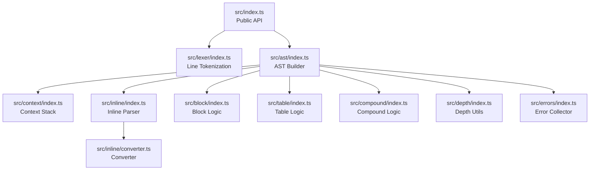
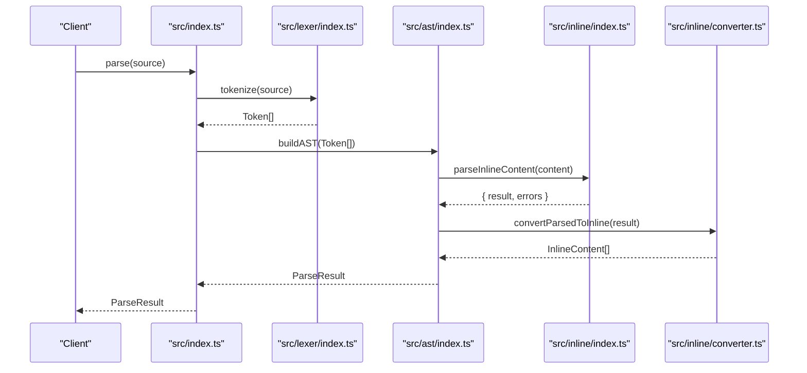
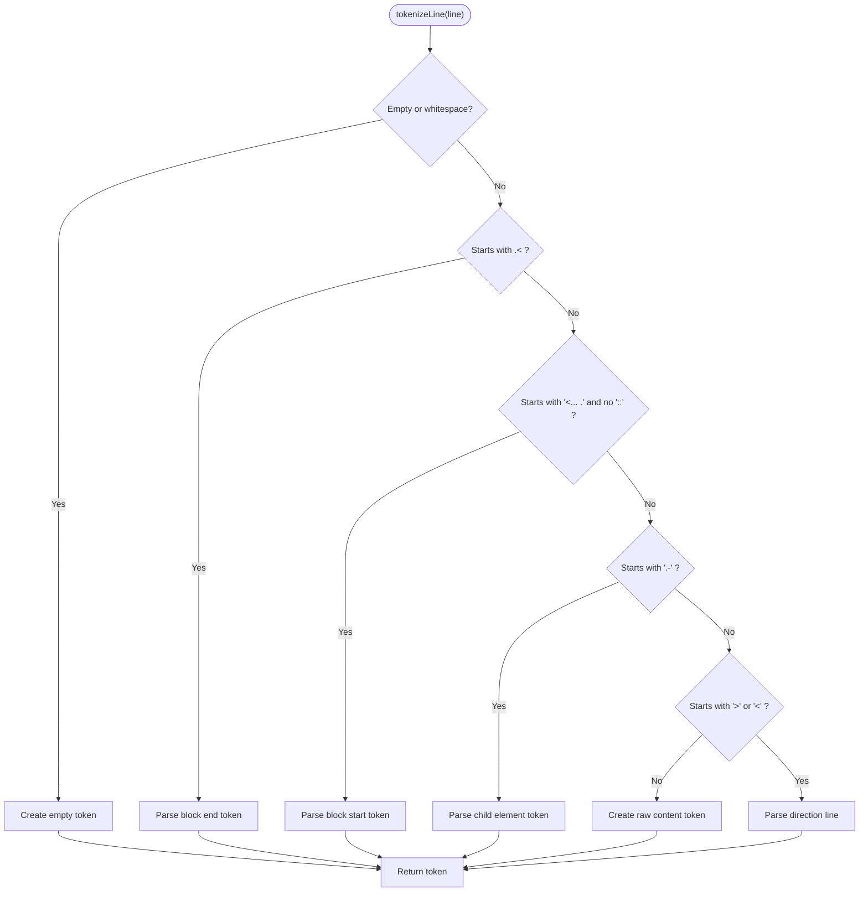
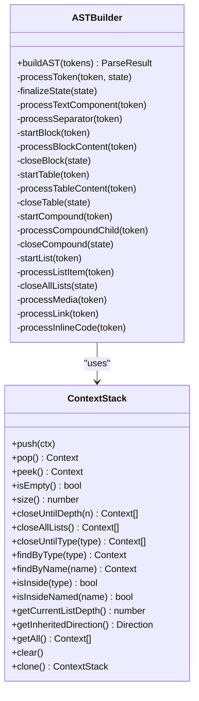
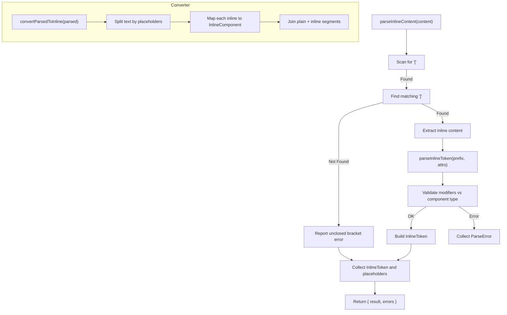
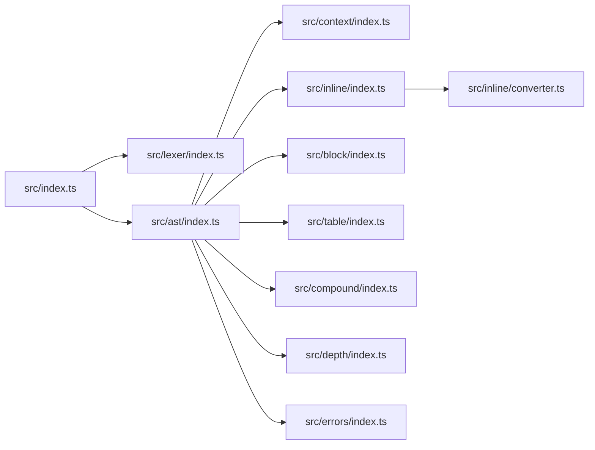

# Parser Overview

<cite>
**Referenced Files in This Document**
- [package.json](file://artoon-parser/package.json)
- [README.md](file://artoon-parser/README.md)
- [src/index.ts](file://artoon-parser/src/index.ts)
- [src/types.ts](file://artoon-parser/src/types.ts)
- [src/lexer/index.ts](file://artoon-parser/src/lexer/index.ts)
- [src/ast/index.ts](file://artoon-parser/src/ast/index.ts)
- [src/ast/types.ts](file://artoon-parser/src/ast/types.ts)
- [src/context/index.ts](file://artoon-parser/src/context/index.ts)
- [src/inline/index.ts](file://artoon-parser/src/inline/index.ts)
- [src/inline/converter.ts](file://artoon-parser/src/inline/converter.ts)
</cite>

## Table of Contents
1. [Introduction](#introduction)
2. [Project Structure](#project-structure)
3. [Core Components](#core-components)
4. [Architecture Overview](#architecture-overview)
5. [Detailed Component Analysis](#detailed-component-analysis)
6. [Dependency Analysis](#dependency-analysis)
7. [Performance Considerations](#performance-considerations)
8. [Troubleshooting Guide](#troubleshooting-guide)
9. [Conclusion](#conclusion)
10. [Appendices](#appendices)

## Introduction
The ARTOON Parser package is the central entry point for transforming ARTOON text into a structured Abstract Syntax Tree (AST). It orchestrates the pipeline from raw text to a typed AST with InlineContent arrays, enabling downstream consumers (renderers, validators, serializers) to operate on a unified model. The package exposes high-level APIs for parsing, strict parsing, validation, and validity checks, while also re-exporting core types and utilities for direction handling, component classification, and inline parsing.

Key characteristics:
- Outputs InlineContent[] directly for seamless integration with @artoon/ast.
- Enforces structural and semantic rules (e.g., reserved blocks, hidden field restrictions).
- Provides robust error collection with line/column precision.
- Supports bidirectional content via RTL/LTR direction markers.

**Section sources**
- [README.md:1-225](file://artoon-parser/README.md#L1-L225)
- [src/index.ts:1-119](file://artoon-parser/src/index.ts#L1-L119)

## Project Structure
The parser package is organized around a clear separation of concerns:
- Entry point and public API
- Lexical analysis (line tokenization)
- AST construction and context management
- Inline parsing and conversion
- Supporting modules for blocks, tables, compounds, depth tracking, and errors

**Diagram sources**
- [src/index.ts:1-119](file://artoon-parser/src/index.ts#L1-L119)
- [src/lexer/index.ts:1-483](file://artoon-parser/src/lexer/index.ts#L1-L483)
- [src/ast/index.ts:1-794](file://artoon-parser/src/ast/index.ts#L1-L794)
- [src/context/index.ts:1-198](file://artoon-parser/src/context/index.ts#L1-L198)
- [src/inline/index.ts:1-197](file://artoon-parser/src/inline/index.ts#L1-L197)
- [src/inline/converter.ts:1-314](file://artoon-parser/src/inline/converter.ts#L1-L314)

**Section sources**
- [README.md:118-133](file://artoon-parser/README.md#L118-L133)
- [src/index.ts:1-119](file://artoon-parser/src/index.ts#L1-L119)

## Core Components
- Public API surface: parse, parseStrict, validate, isValid, tokenize, buildAST, VERSION, default export.
- Core types: Direction, ComponentType families, modifier sets, and validation constants.
- Lexer: tokenizeLine and tokenize for line-level tokenization with direction, depth, and component detection.
- AST builder: buildAST orchestrating context-aware construction of AST nodes.
- Inline parser: parseInlineContent and hasInlineTokens for bracket-based inline components.
- Converter: convertParsedToInline and convertInlineToParsed for format unification.

Exports and versioning:
- Package version is declared in package.json.
- Default export includes all primary functions and utilities.
- Types are re-exported for consumer convenience.

**Section sources**
- [src/index.ts:10-37](file://artoon-parser/src/index.ts#L10-L37)
- [src/index.ts:56-105](file://artoon-parser/src/index.ts#L56-L105)
- [src/types.ts:1-123](file://artoon-parser/src/types.ts#L1-L123)
- [package.json:1-23](file://artoon-parser/package.json#L1-L23)

## Architecture Overview
The parser’s architecture follows a pipeline:
1. Input text is split into lines and tokenized into Tokens by the lexer.
2. The AST builder consumes Tokens, manages context (blocks, lists, compounds, tables), and constructs typed AST nodes.
3. Inline content within text is parsed into ParsedContent and converted to InlineContent[] for uniformity.
4. Errors are collected and returned alongside the AST.

**Diagram sources**
- [src/index.ts:56-89](file://artoon-parser/src/index.ts#L56-L89)
- [src/lexer/index.ts:400-403](file://artoon-parser/src/lexer/index.ts#L400-L403)
- [src/ast/index.ts:70-84](file://artoon-parser/src/ast/index.ts#L70-L84)
- [src/inline/index.ts:10-64](file://artoon-parser/src/inline/index.ts#L10-L64)
- [src/inline/converter.ts:37-84](file://artoon-parser/src/inline/converter.ts#L37-L84)

## Detailed Component Analysis

### Public API Surface
- parse(source): Returns ParseResult with ast and errors.
- parseStrict(source): Returns DocumentNode or throws on errors.
- validate(source): Returns ParseError[] without building AST.
- isValid(source): Boolean check for validity.
- tokenize(source): Low-level tokenizer for testing or advanced usage.
- buildAST(tokens): AST builder for testing or custom pipelines.
- VERSION and default export for ergonomic consumption.

Integration patterns:
- Use parse for general workflows; inspect errors and AST.
- Use parseStrict when you require a clean AST or fail fast.
- Use validate for linting or CI checks without constructing AST.
- Use isValid for quick checks.

**Section sources**
- [src/index.ts:56-105](file://artoon-parser/src/index.ts#L56-L105)
- [README.md:25-48](file://artoon-parser/README.md#L25-L48)

### Lexer (Line Tokenization)
Responsibilities:
- Detect direction markers (> RTL, < LTR).
- Identify block starts (<name>.) and ends (.name>).
- Recognize list items and table rows without direction markers.
- Parse child elements with depth markers (.-).
- Handle comments, combined separators, and raw content.

Key behaviors:
- tokenizeLine handles per-line logic and returns a Token with direction, depth, componentType, and content.
- tokenize aggregates tokens across lines.

**Diagram sources**
- [src/lexer/index.ts:10-77](file://artoon-parser/src/lexer/index.ts#L10-L77)
- [src/lexer/index.ts:282-344](file://artoon-parser/src/lexer/index.ts#L282-L344)
- [src/lexer/index.ts:82-277](file://artoon-parser/src/lexer/index.ts#L82-L277)

**Section sources**
- [src/lexer/index.ts:10-403](file://artoon-parser/src/lexer/index.ts#L10-L403)

### AST Builder and Context Management
Responsibilities:
- Build DocumentNode with children and optional meta block.
- Manage ContextStack for blocks, lists, compounds, and tables.
- Convert ParsedContent to InlineContent[] during text processing.
- Validate structural rules (e.g., block end mismatches, unclosed contexts).

Highlights:
- processToken routes tokens to specialized handlers (lists, tables, compounds, blocks, media, links, code).
- finalizeState ensures all contexts are closed and reports warnings/errors for unclosed constructs.
- Inline conversion occurs via convertParsedToInline to produce InlineContent[].

**Diagram sources**
- [src/ast/index.ts:31-794](file://artoon-parser/src/ast/index.ts#L31-L794)
- [src/context/index.ts:25-198](file://artoon-parser/src/context/index.ts#L25-L198)

**Section sources**
- [src/ast/index.ts:70-794](file://artoon-parser/src/ast/index.ts#L70-L794)
- [src/context/index.ts:25-198](file://artoon-parser/src/context/index.ts#L25-L198)

### Inline Parser and Converter
Responsibilities:
- parseInlineContent scans content for bracketed inline tokens and extracts modifiers and attributes.
- convertParsedToInline converts internal ParsedContent to InlineContent[] for AST compatibility.
- convertInlineToParsed supports serialization back to ARTOON text.

Processing logic:
- Bracket scanning with balanced matching and error reporting.
- Prefix parsing supporting chained modifiers and optional component types.
- Attribute mapping tailored to component types (links, images, media, abbr, time, code).

**Diagram sources**
- [src/inline/index.ts:10-64](file://artoon-parser/src/inline/index.ts#L10-L64)
- [src/inline/index.ts:85-145](file://artoon-parser/src/inline/index.ts#L85-L145)
- [src/inline/converter.ts:37-84](file://artoon-parser/src/inline/converter.ts#L37-L84)

**Section sources**
- [src/inline/index.ts:10-197](file://artoon-parser/src/inline/index.ts#L10-L197)
- [src/inline/converter.ts:37-314](file://artoon-parser/src/inline/converter.ts#L37-L314)

### Core Type System
Defines directions, component categories, and modifier sets used across the parser. These types inform validation and parsing decisions (e.g., which components accept modifiers, which are separators, etc.).

Examples of responsibilities:
- Direction classification (rtl/ltr).
- Component categorization (text, semantic, media, separators, lists, tables, compounds, code).
- Modifier sets and validation rules.

**Section sources**
- [src/types.ts:1-123](file://artoon-parser/src/types.ts#L1-L123)

## Dependency Analysis
The parser composes several internal modules with clear boundaries:
- src/index.ts depends on lexer, ast, inline, context, and types.
- src/ast/index.ts depends on context, inline, table, compound, block, depth, and error modules.
- Inline parsing and conversion are cohesive and self-contained.

**Diagram sources**
- [src/index.ts:4-37](file://artoon-parser/src/index.ts#L4-L37)
- [src/ast/index.ts:12-29](file://artoon-parser/src/ast/index.ts#L12-L29)

**Section sources**
- [src/index.ts:4-37](file://artoon-parser/src/index.ts#L4-L37)
- [src/ast/index.ts:12-29](file://artoon-parser/src/ast/index.ts#L12-L29)

## Performance Considerations
- Tokenization is linear in the number of lines and character scanning is bounded by line length.
- AST building iterates tokens once and uses constant-time context operations (stack).
- Inline parsing performs a single pass with bracket matching; complexity is proportional to content length.
- Error collection is incremental and does not allocate extra structures beyond reported errors.

Recommendations:
- Prefer validate for bulk validation tasks to avoid AST construction overhead.
- Use parseStrict in environments requiring deterministic ASTs.
- For very large documents, consider streaming or chunked processing at the application level.

[No sources needed since this section provides general guidance]

## Troubleshooting Guide
Common scenarios and handling patterns:
- Unexpected block end: The AST builder reports a structure error and continues parsing.
- Unclosed block: finalizeState adds a warning/error and closes the block.
- Unclosed brackets in inline content: parseInlineContent reports syntax errors with suggestions.
- Invalid modifiers on components: parseInlineToken validates against NO_MODIFIER_COMPONENTS and suggests corrections.

Error model:
- ParseError includes type, line, column, message, and suggestion for actionable feedback.

**Section sources**
- [src/ast/index.ts:108-115](file://artoon-parser/src/ast/index.ts#L108-L115)
- [src/ast/index.ts:769-774](file://artoon-parser/src/ast/index.ts#L769-L774)
- [src/inline/index.ts:26-36](file://artoon-parser/src/inline/index.ts#L26-L36)
- [src/inline/index.ts:119-130](file://artoon-parser/src/inline/index.ts#L119-L130)
- [src/ast/types.ts:242-249](file://artoon-parser/src/ast/types.ts#L242-L249)

## Conclusion
The ARTOON Parser package provides a robust, type-safe pipeline from ARTOON text to a unified AST with InlineContent[]. Its modular design enables clear separation of concerns, strong error reporting, and seamless integration with downstream packages. The public API offers flexible usage patterns for parsing, validation, and strict mode enforcement, while the internal architecture supports extensibility and maintainability.

[No sources needed since this section summarizes without analyzing specific files]

## Appendices

### Usage Examples
Basic parsing workflow:
- Use parse to obtain both AST and errors.
- Use parseStrict to enforce error-free parsing.
- Use validate or isValid for validation-only workflows.

META block parsing and validation:
- META blocks are reserved and must contain only hidden fields.
- Access META fields via document.meta in the resulting AST.

**Section sources**
- [README.md:25-82](file://artoon-parser/README.md#L25-L82)
- [README.md:84-116](file://artoon-parser/README.md#L84-L116)

### Version Information
- Package version: 2.0.0.
- Parser version (default export): 1.0.0.

**Section sources**
- [package.json:2-4](file://artoon-parser/package.json#L2-L4)
- [src/index.ts:105](file://artoon-parser/src/index.ts#L105)