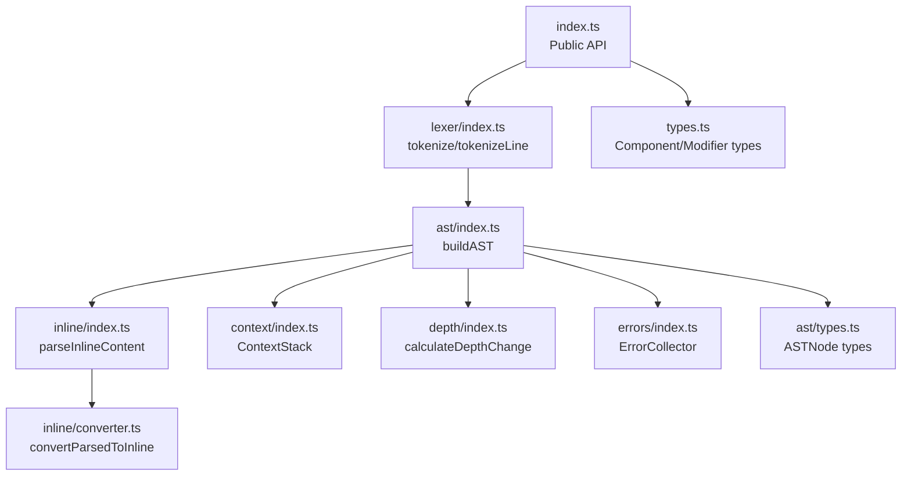
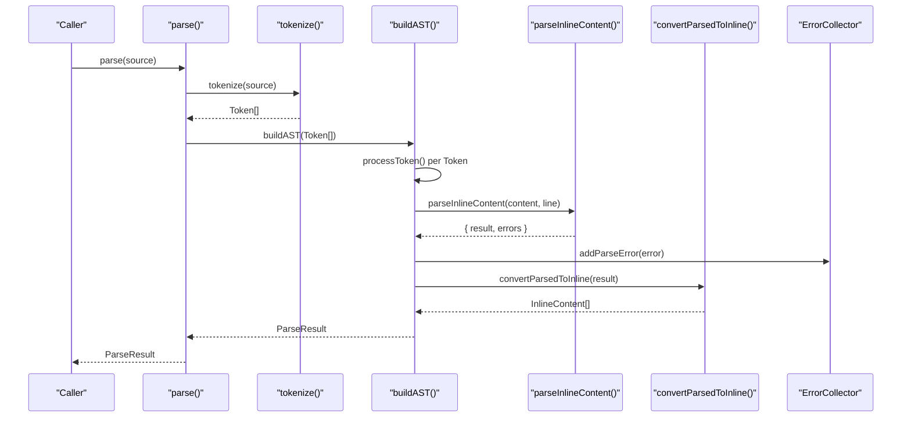
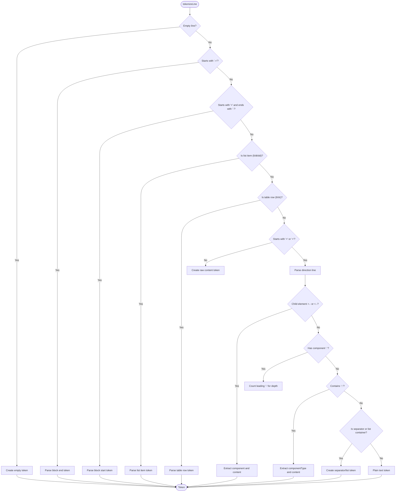
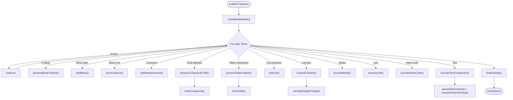
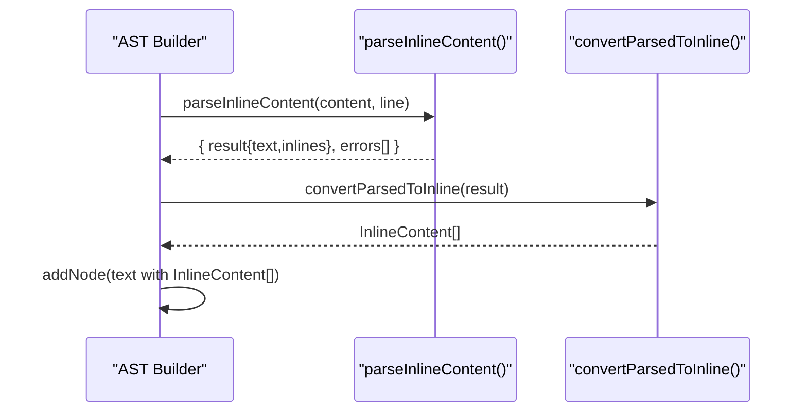
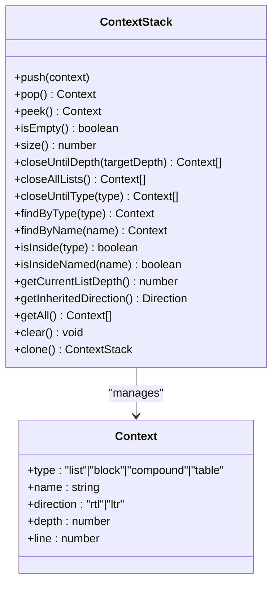
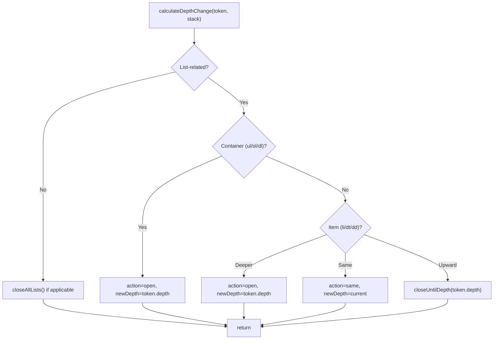
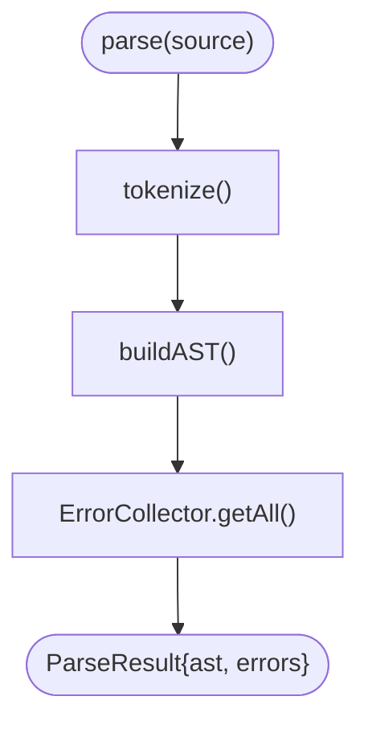
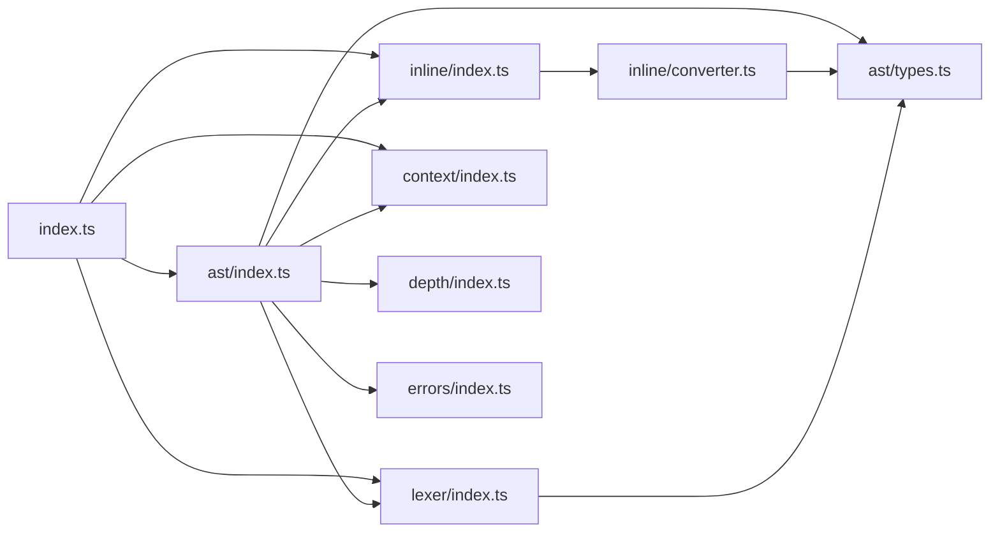

# Parser Package

<cite>
**Referenced Files in This Document**
- [index.ts](file://artoon-parser/src/index.ts)
- [lexer/index.ts](file://artoon-parser/src/lexer/index.ts)
- [ast/index.ts](file://artoon-parser/src/ast/index.ts)
- [ast/types.ts](file://artoon-parser/src/ast/types.ts)
- [inline/index.ts](file://artoon-parser/src/inline/index.ts)
- [inline/converter.ts](file://artoon-parser/src/inline/converter.ts)
- [context/index.ts](file://artoon-parser/src/context/index.ts)
- [depth/index.ts](file://artoon-parser/src/depth/index.ts)
- [errors/index.ts](file://artoon-parser/src/errors/index.ts)
- [types.ts](file://artoon-parser/src/types.ts)
- [package.json](file://artoon-parser/package.json)
- [integration.test.ts](file://artoon-parser/tests/integration.test.ts)
- [lexer.test.ts](file://artoon-parser/tests/lexer.test.ts)
- [inline.test.ts](file://artoon-parser/tests/inline.test.ts)
- [context.test.ts](file://artoon-parser/tests/context.test.ts)
</cite>

## Table of Contents
1. [Introduction](#introduction)
2. [Project Structure](#project-structure)
3. [Core Components](#core-components)
4. [Architecture Overview](#architecture-overview)
5. [Detailed Component Analysis](#detailed-component-analysis)
6. [Dependency Analysis](#dependency-analysis)
7. [Performance Considerations](#performance-considerations)
8. [Troubleshooting Guide](#troubleshooting-guide)
9. [Conclusion](#conclusion)
10. [Appendices](#appendices)

## Introduction
The ARTOON Parser package converts ARTOON text into a canonical Abstract Syntax Tree (AST) composed of typed nodes. It provides:
- Tokenization of ARTOON lines into structured tokens
- AST construction from tokens with context-aware nesting
- Inline content parsing and conversion to a normalized InlineContent[] format
- Validation and error reporting with categorized ParseError entries
- Public API functions: parse(), parseStrict(), validate(), and isValid()

The package emphasizes bidirectional support (RTL/LTR), robustness against malformed input, and extensibility via the unified AST types.

## Project Structure
The parser is organized around a clear pipeline:
- Entry point exports public API and re-exports types
- Lexer transforms each line into a Token
- AST builder consumes Tokens, manages context, and produces typed AST nodes
- Inline tokenizer handles inlined formatting within text
- Converter bridges internal ParsedContent to AST’s InlineContent[]
- Context stack tracks nesting levels and component hierarchies
- Errors module centralizes error creation and collection
- Types define component and modifier sets

**Diagram sources**
- [index.ts:1-119](file://artoon-parser/src/index.ts#L1-L119)
- [lexer/index.ts:1-483](file://artoon-parser/src/lexer/index.ts#L1-L483)
- [ast/index.ts:1-794](file://artoon-parser/src/ast/index.ts#L1-L794)
- [inline/index.ts:1-197](file://artoon-parser/src/inline/index.ts#L1-L197)
- [inline/converter.ts:1-314](file://artoon-parser/src/inline/converter.ts#L1-L314)
- [context/index.ts:1-198](file://artoon-parser/src/context/index.ts#L1-L198)
- [depth/index.ts:1-163](file://artoon-parser/src/depth/index.ts#L1-L163)
- [errors/index.ts:1-265](file://artoon-parser/src/errors/index.ts#L1-L265)
- [ast/types.ts:1-258](file://artoon-parser/src/ast/types.ts#L1-L258)
- [types.ts:1-123](file://artoon-parser/src/types.ts#L1-L123)

**Section sources**
- [index.ts:1-119](file://artoon-parser/src/index.ts#L1-L119)
- [package.json:1-23](file://artoon-parser/package.json#L1-L23)

## Core Components
- Public API
  - parse(source): returns ParseResult with ast and errors
  - parseStrict(source): returns DocumentNode or throws on errors
  - validate(source): returns ParseError[]
  - isValid(source): returns boolean
  - Additional re-exports: tokenize, tokenizeLine, parseInlineContent, hasInlineTokens, ContextStack, createContextStack, buildAST, convertParsedToInline, convertInlineToParsed
- Tokenization
  - tokenize(source): splits by newline and tokenizes each line
  - tokenizeLine(line, lineNumber): parses direction markers, components, separators, comments, block delimiters, and list/table indicators
- AST Construction
  - buildAST(tokens): orchestrates processing, manages context, validates structure, and finalizes unclosed constructs
- Inline Parsing
  - parseInlineContent(content, lineNumber): extracts [...] tokens, validates syntax, and collects errors
  - convertParsedToInline(parsed): converts internal ParsedContent to InlineContent[]
- Context Management
  - ContextStack: push/pop/peek, closeUntilDepth/closeAllLists/closeUntilType, find, direction inheritance, and depth tracking
- Error Handling
  - ErrorCollector: add/addParseError/getAll/getErrors/getWarnings/hasErrors/sorted/format
  - Error types: syntax, structure, semantic, constraint

**Section sources**
- [index.ts:39-119](file://artoon-parser/src/index.ts#L39-L119)
- [lexer/index.ts:10-483](file://artoon-parser/src/lexer/index.ts#L10-L483)
- [ast/index.ts:70-794](file://artoon-parser/src/ast/index.ts#L70-L794)
- [inline/index.ts:10-197](file://artoon-parser/src/inline/index.ts#L10-L197)
- [inline/converter.ts:37-314](file://artoon-parser/src/inline/converter.ts#L37-L314)
- [context/index.ts:25-198](file://artoon-parser/src/context/index.ts#L25-L198)
- [errors/index.ts:156-247](file://artoon-parser/src/errors/index.ts#L156-L247)

## Architecture Overview
The parser follows a linear pipeline:
1. Lexical analysis: tokenize each line into a Token
2. AST building: process tokens sequentially, maintaining context and nesting
3. Inline parsing: extract and normalize inline formatting into InlineContent[]
4. Error collection: accumulate categorized ParseError entries
5. Output: produce DocumentNode and aggregated errors

**Diagram sources**
- [index.ts:56-59](file://artoon-parser/src/index.ts#L56-L59)
- [lexer/index.ts:400-403](file://artoon-parser/src/lexer/index.ts#L400-L403)
- [ast/index.ts:70-84](file://artoon-parser/src/ast/index.ts#L70-L84)
- [inline/index.ts:10-64](file://artoon-parser/src/inline/index.ts#L10-L64)
- [inline/converter.ts:37-84](file://artoon-parser/src/inline/converter.ts#L37-L84)
- [errors/index.ts:169-174](file://artoon-parser/src/errors/index.ts#L169-L174)

## Detailed Component Analysis

### Lexer: tokenizeLine and tokenize
- Recognizes empty lines, block starts/end, comments, list/table lines, and direction-prefixed lines
- Supports child elements with depth markers and meta-field syntax
- Produces Token with direction, componentType, depth, separator presence, and content
- Handles combined separators (e.g., br;hr;br) and validates component validity

**Diagram sources**
- [lexer/index.ts:10-277](file://artoon-parser/src/lexer/index.ts#L10-L277)
- [lexer/index.ts:282-344](file://artoon-parser/src/lexer/index.ts#L282-L344)
- [lexer/index.ts:400-483](file://artoon-parser/src/lexer/index.ts#L400-L483)

**Section sources**
- [lexer/index.ts:10-483](file://artoon-parser/src/lexer/index.ts#L10-L483)
- [lexer.test.ts:1-160](file://artoon-parser/tests/lexer.test.ts#L1-L160)

### AST Builder: buildAST and processing logic
- Maintains BuilderState with document, contextStack, errors, and current constructs (block, table, compound, list)
- Processes tokens in order, handling:
  - Block content (including code blocks with raw content)
  - Comments
  - Compound child elements and closing logic
  - Table headers/rows
  - Lists with depth changes and nested items
  - Media, links, inline code, and text components
- Converts inline content to InlineContent[] via parseInlineContent and convertParsedToInline
- Finalizes state by closing unclosed constructs and reporting warnings/errors

**Diagram sources**
- [ast/index.ts:70-794](file://artoon-parser/src/ast/index.ts#L70-L794)
- [inline/index.ts:10-64](file://artoon-parser/src/inline/index.ts#L10-L64)
- [inline/converter.ts:37-84](file://artoon-parser/src/inline/converter.ts#L37-L84)
- [depth/index.ts:21-90](file://artoon-parser/src/depth/index.ts#L21-L90)

**Section sources**
- [ast/index.ts:70-794](file://artoon-parser/src/ast/index.ts#L70-L794)
- [integration.test.ts:1-364](file://artoon-parser/tests/integration.test.ts#L1-L364)

### Inline Parser: parseInlineContent and converter
- Scans content for balanced [...] pairs, records unmatched brackets as syntax errors
- Parses prefixes supporting modifiers and optional component types
- Validates modifier restrictions (e.g., modifiers not allowed on media/code/file)
- Converts internal ParsedContent to InlineContent[] with placeholders resolved and attributes mapped per component type

**Diagram sources**
- [inline/index.ts:10-197](file://artoon-parser/src/inline/index.ts#L10-L197)
- [inline/converter.ts:37-314](file://artoon-parser/src/inline/converter.ts#L37-L314)

**Section sources**
- [inline/index.ts:10-197](file://artoon-parser/src/inline/index.ts#L10-L197)
- [inline/converter.ts:37-314](file://artoon-parser/src/inline/converter.ts#L37-L314)
- [inline.test.ts:1-167](file://artoon-parser/tests/inline.test.ts#L1-L167)

### Context Management: ContextStack
- Tracks open contexts (list, block, compound, table)
- Provides depth-based closing, type-based closing, and direction inheritance
- Offers utilities for finding contexts, checking containment, and cloning/clearing

**Diagram sources**
- [context/index.ts:25-198](file://artoon-parser/src/context/index.ts#L25-L198)

**Section sources**
- [context/index.ts:25-198](file://artoon-parser/src/context/index.ts#L25-L198)
- [context.test.ts:1-201](file://artoon-parser/tests/context.test.ts#L1-L201)

### Depth Engine: calculateDepthChange
- Computes depth transitions for list items and containers
- Closes contexts when moving upward in nesting
- Resets list contexts when encountering non-list components

**Diagram sources**
- [depth/index.ts:21-90](file://artoon-parser/src/depth/index.ts#L21-L90)

**Section sources**
- [depth/index.ts:21-163](file://artoon-parser/src/depth/index.ts#L21-L163)

### Error Handling and Validation
- ErrorCollector aggregates ExtendedError entries with severity and optional codes
- Error types: syntax, structure, semantic, constraint
- parseStrict() throws if any errors are present
- validate() and isValid() provide quick checks without building full AST

**Diagram sources**
- [index.ts:56-100](file://artoon-parser/src/index.ts#L56-L100)
- [errors/index.ts:156-247](file://artoon-parser/src/errors/index.ts#L156-L247)

**Section sources**
- [errors/index.ts:1-265](file://artoon-parser/src/errors/index.ts#L1-L265)
- [index.ts:56-100](file://artoon-parser/src/index.ts#L56-L100)

## Dependency Analysis
- Internal dependencies
  - index.ts re-exports lexer, ast, inline, context, and types
  - ast/index.ts imports types, context, inline, depth, table, compound, block, and errors
  - inline/converter.ts imports AST types and internal ParsedContent
- External dependencies
  - Imports unified AST types from @artoon/ast for node contracts
- Cohesion and coupling
  - High cohesion within each module (lexer, ast, inline, context, depth, errors)
  - Low coupling via explicit imports and re-exports
  - Centralized error handling reduces cross-module duplication

**Diagram sources**
- [index.ts:3-37](file://artoon-parser/src/index.ts#L3-L37)
- [ast/index.ts:5-29](file://artoon-parser/src/ast/index.ts#L5-L29)
- [inline/converter.ts:14-21](file://artoon-parser/src/inline/converter.ts#L14-L21)

**Section sources**
- [index.ts:3-37](file://artoon-parser/src/index.ts#L3-L37)
- [ast/index.ts:5-29](file://artoon-parser/src/ast/index.ts#L5-L29)

## Performance Considerations
- Linear pass over tokens: O(n) where n is number of lines
- Inline parsing scans content once per text component; complexity proportional to content length
- Context operations (push/pop/peek/closeUntil*) are O(k) where k is current stack depth
- Combined separators expand into multiple nodes; consider batching conversions if needed
- Error collection is append-only; sorting/formatting occurs only when needed

## Troubleshooting Guide
Common issues and resolutions:
- Unclosed inline bracket [...]: Detected during inline parsing; ensure balanced brackets
- Missing space after ::: Ensure whitespace after the separator
- Modifiers on restricted components (img/audio/video/file/c): Enforced by inline parser; remove modifiers or adjust component
- Unexpected block end or mismatched block end: Reported by AST builder; ensure matching block names and proper closure
- Orphan child elements: Child elements require a parent compound; nest properly under figure/details
- Inline list nesting: Lists cannot be inline; move list items outside inline contexts

Diagnostic tips:
- Use validate() to inspect errors without throwing
- Use parseStrict() in environments where strict correctness is required
- Inspect ParseResult.errors for line/column positions and suggestions

**Section sources**
- [errors/index.ts:27-48](file://artoon-parser/src/errors/index.ts#L27-L48)
- [inline.test.ts:140-154](file://artoon-parser/tests/inline.test.ts#L140-L154)
- [integration.test.ts:116-125](file://artoon-parser/tests/integration.test.ts#L116-L125)

## Conclusion
The ARTOON Parser provides a robust, extensible pipeline from ARTOON text to a canonical AST. Its modular design, strong typing via @artoon/ast, and comprehensive error handling make it suitable for editors, renderers, and integrations requiring precise ARTOON semantics. The public API offers flexible parsing modes, and the context and depth engines ensure accurate nesting and structure.

## Appendices

### Public API Reference
- parse(source: string): ParseResult
- parseStrict(source: string): DocumentNode
- validate(source: string): ParseError[]
- isValid(source: string): boolean
- tokenize(source: string): Token[]
- tokenizeLine(line: string, lineNumber: number): Token
- parseInlineContent(content: string, lineNumber: number): { result: ParsedContent, errors: ParseError[] }
- hasInlineTokens(content: string): boolean
- ContextStack, createContextStack()
- buildAST(tokens: Token[]): ParseResult
- convertParsedToInline(parsed: ParsedContent): InlineContent[]
- convertInlineToParsed(content: InlineContent[]): ParsedContent

**Section sources**
- [index.ts:39-119](file://artoon-parser/src/index.ts#L39-L119)

### Example Patterns and Scenarios
- Simple paragraph: parse('>.p:: Hello')
- Mixed directions: parse('>.p:: Arabic\n<.p:: English')
- Lists: parse('>.ul::\nli:: Item\n-li:: Nested')
- Tables: parse('>.table::\nth:: H1; H2\ntr:: R1C1; R1C2')
- Code block: parse(`<code:js>.\nconsole.log();\n.<code>`)
- Inline formatting: parse('>.p:: [s:: Important] notice')
- Comments: parse('>.p:: Content\n>.::: Hidden\n>.p:: More')
- Validation: validate('>.p:: Content') returns [] on success

**Section sources**
- [integration.test.ts:5-364](file://artoon-parser/tests/integration.test.ts#L5-L364)
- [lexer.test.ts:142-159](file://artoon-parser/tests/lexer.test.ts#L142-L159)
- [inline.test.ts:140-154](file://artoon-parser/tests/inline.test.ts#L140-L154)

### Extensibility and Integration Notes
- Unified AST types from @artoon/ast enable seamless integration with renderer and editor packages
- Inline conversion ensures consumers receive InlineContent[] directly
- ContextStack and depth engine can be extended to support new compound components or nesting rules
- ErrorCollector can be adapted for richer diagnostics and suggestions

**Section sources**
- [ast/types.ts:14-55](file://artoon-parser/src/ast/types.ts#L14-L55)
- [inline/converter.ts:23-129](file://artoon-parser/src/inline/converter.ts#L23-L129)
- [context/index.ts:25-198](file://artoon-parser/src/context/index.ts#L25-L198)
- [depth/index.ts:21-163](file://artoon-parser/src/depth/index.ts#L21-L163)