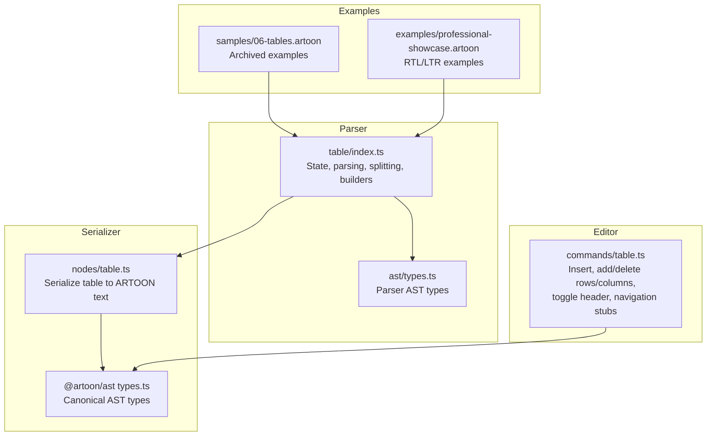
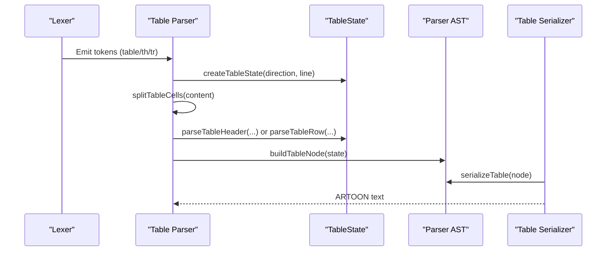
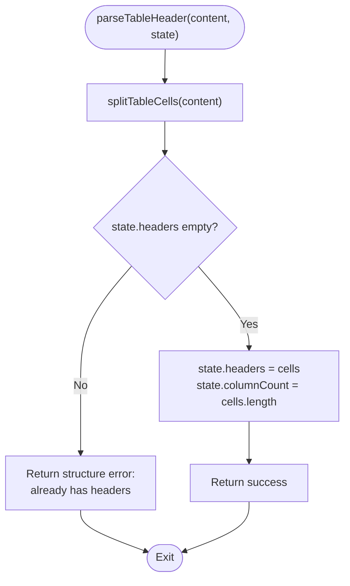
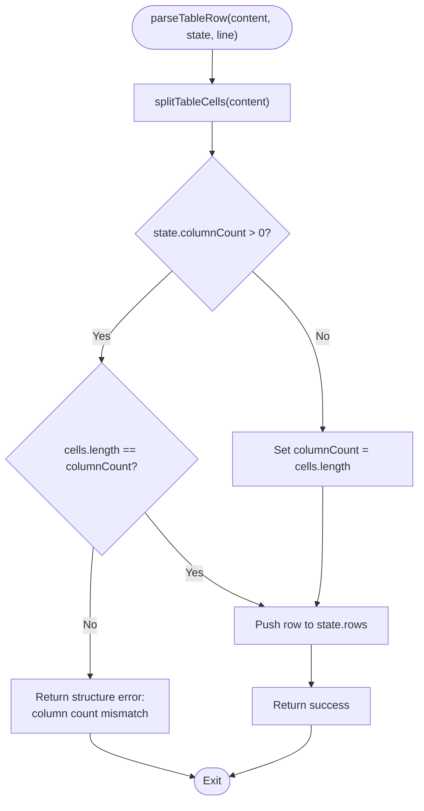
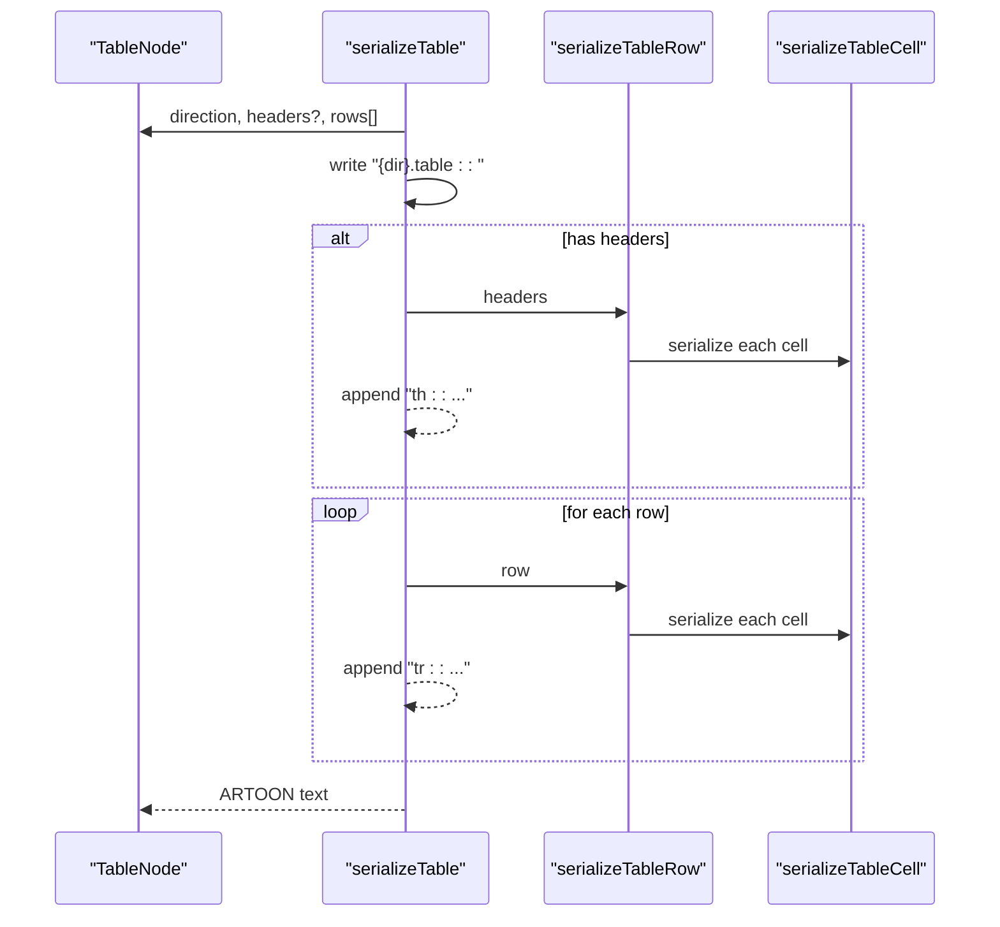
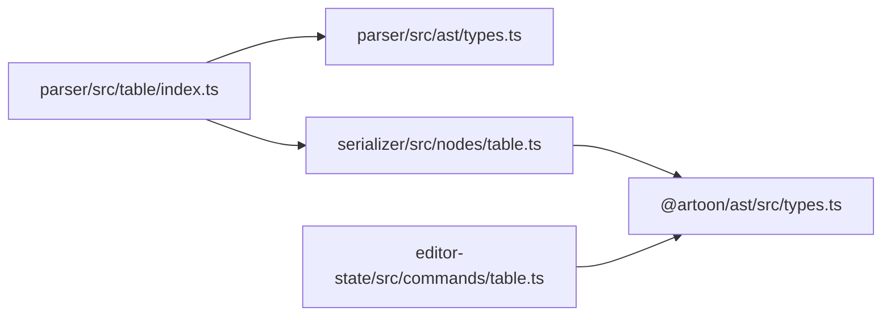

# Table Parsing

<cite>
**Referenced Files in This Document**
- [Core Invariants 05-TABLES.md](file://Core Invariants/05-TABLES.md)
- [table/index.ts](file://artoon-parser/src/table/index.ts)
- [table.test.ts](file://artoon-parser/tests/table.test.ts)
- [nodes/table.ts](file://artoon-serializer/src/nodes/table.ts)
- [table.test.ts](file://artoon-serializer/tests/table.test.ts)
- [types.ts (parser AST)](file://artoon-parser/src/ast/types.ts)
- [types.ts (canonical AST)](file://artoon-ast/src/types.ts)
- [table.ts (editor commands)](file://artoon-editor-state/src/commands/table.ts)
- [06-tables.artoon (archived sample)](file://_ARCHIVE/samples-archive/samples/06-tables.artoon)
- [professional-showcase.artoon](file://artoon-examples/professional-showcase.artoon)
</cite>

## Table of Contents
1. [Introduction](#introduction)
2. [Project Structure](#project-structure)
3. [Core Components](#core-components)
4. [Architecture Overview](#architecture-overview)
5. [Detailed Component Analysis](#detailed-component-analysis)
6. [Dependency Analysis](#dependency-analysis)
7. [Performance Considerations](#performance-considerations)
8. [Troubleshooting Guide](#troubleshooting-guide)
9. [Conclusion](#conclusion)
10. [Appendices](#appendices)

## Introduction
This document describes the ARTOON Table Parsing module, focusing on how tabular data is recognized, parsed, validated, and serialized. It explains the table syntax, cell delimiters, header detection, row processing, and column alignment rules. It also documents supported formats, direction-aware behavior, and integration points across the parsing pipeline. Examples demonstrate simple and complex tables, including inline content inside cells and direction markers.

## Project Structure
The table parsing system spans three primary areas:
- Parser: recognizes table tokens, splits cells respecting inline constructs, validates structure, and builds a table node.
- Serializer: converts a canonical table node back into ARTOON text form with direction markers and row types.
- Editor Commands: provide table creation and manipulation commands for the editor runtime.



**Diagram sources**
- [table/index.ts:1-169](file://artoon-parser/src/table/index.ts#L1-L169)
- [types.ts (parser AST):88-96](file://artoon-parser/src/ast/types.ts#L88-L96)
- [nodes/table.ts:1-56](file://artoon-serializer/src/nodes/table.ts#L1-L56)
- [types.ts (canonical AST):238-245](file://artoon-ast/src/types.ts#L238-L245)
- [table.ts (editor commands):1-379](file://artoon-editor-state/src/commands/table.ts#L1-L379)
- [06-tables.artoon:1-61](file://_ARCHIVE/samples-archive/samples/06-tables.artoon#L1-L61)
- [professional-showcase.artoon:126-146](file://artoon-examples/professional-showcase.artoon#L126-L146)

**Section sources**
- [table/index.ts:1-169](file://artoon-parser/src/table/index.ts#L1-L169)
- [nodes/table.ts:1-56](file://artoon-serializer/src/nodes/table.ts#L1-L56)
- [table.ts (editor commands):1-379](file://artoon-editor-state/src/commands/table.ts#L1-L379)
- [06-tables.artoon:1-61](file://_ARCHIVE/samples-archive/samples/06-tables.artoon#L1-L61)
- [professional-showcase.artoon:126-146](file://artoon-examples/professional-showcase.artoon#L126-L146)

## Core Components
- Table parsing state: tracks direction, start line, headers, rows, and computed column count.
- Cell splitting: splits on semicolon delimiter while respecting inline construct brackets.
- Header and row parsing: enforces single header, consistent column counts, and builds rows.
- Node building: produces a parser table node with direction and content arrays.
- Serialization: writes direction marker, optional header row, and subsequent data rows.
- Editor commands: insert a table, add/delete rows/columns, toggle header, and navigation placeholders.

**Section sources**
- [table/index.ts:10-29](file://artoon-parser/src/table/index.ts#L10-L29)
- [table/index.ts:34-57](file://artoon-parser/src/table/index.ts#L34-L57)
- [table/index.ts:62-94](file://artoon-parser/src/table/index.ts#L62-L94)
- [table/index.ts:100-127](file://artoon-parser/src/table/index.ts#L100-L127)
- [table/index.ts:132-140](file://artoon-parser/src/table/index.ts#L132-L140)
- [nodes/table.ts:16-38](file://artoon-serializer/src/nodes/table.ts#L16-L38)
- [table.ts (editor commands):15-57](file://artoon-editor-state/src/commands/table.ts#L15-L57)

## Architecture Overview
The table parsing pipeline follows a deterministic flow: the lexer emits table-related tokens; the parser accumulates state, validates structure, and constructs a parser node; the serializer transforms the node back to text; the editor commands operate on the canonical AST shape.



**Diagram sources**
- [table/index.ts:21-29](file://artoon-parser/src/table/index.ts#L21-L29)
- [table/index.ts:100-127](file://artoon-parser/src/table/index.ts#L100-L127)
- [table/index.ts:34-57](file://artoon-parser/src/table/index.ts#L34-L57)
- [table/index.ts:62-94](file://artoon-parser/src/table/index.ts#L62-L94)
- [table/index.ts:132-140](file://artoon-parser/src/table/index.ts#L132-L140)
- [nodes/table.ts:16-38](file://artoon-serializer/src/nodes/table.ts#L16-L38)

## Detailed Component Analysis

### Table Syntax and Semantics
- Container: table block identified by a table component token.
- Rows: header row (th) and data rows (tr).
- Cells: separated by semicolons; inline constructs are supported inside cells.
- Direction: direction marker precedes the container; inherited by table content.
- Closure: implicit closure occurs when a new block component appears or at end-of-file.

**Section sources**
- [Core Invariants 05-TABLES.md:20-112](file://Core Invariants/05-TABLES.md#L20-L112)

### Cell Delimiter and Bracket-Aware Splitting
The splitter respects inline constructs by tracking bracket depth. It splits only at semicolons outside bracket pairs and trims cell content.

```mermaid
flowchart TD
Start(["splitTableCells(content)"]) --> Init["Initialize empty cells[], current='', bracketDepth=0"]
Init --> Loop{"For each character"}
Loop --> |'['| IncDepth["bracketDepth++<br/>append char"]
Loop --> |']'| DecDepth["bracketDepth--<br/>append char"]
Loop --> |';' and depth==0| PushCell["Trim current<br/>push to cells<br/>reset current"]
Loop --> |other| Append["append char to current"]
Append --> Loop
DecDepth --> Loop
IncDepth --> Loop
PushCell --> Loop
Loop --> Done{"End of content?"}
Done --> |No| Loop
Done --> |Yes| Finalize["If current trimmed, push to cells"]
Finalize --> Return["Return cells[]"]
```

**Diagram sources**
- [table/index.ts:100-127](file://artoon-parser/src/table/index.ts#L100-L127)

**Section sources**
- [table/index.ts:100-127](file://artoon-parser/src/table/index.ts#L100-L127)
- [table.test.ts:15-39](file://artoon-parser/tests/table.test.ts#L15-L39)

### Header Detection and Validation
- Single header allowed; attempting to set a second header yields a structure error.
- Column count is captured from the header row and enforced for subsequent rows.



**Diagram sources**
- [table/index.ts:34-57](file://artoon-parser/src/table/index.ts#L34-L57)

**Section sources**
- [table/index.ts:34-57](file://artoon-parser/src/table/index.ts#L34-L57)
- [table.test.ts:41-62](file://artoon-parser/tests/table.test.ts#L41-L62)

### Row Processing and Column Alignment
- Rows are validated against the established column count.
- If no header exists, the first row determines the column count.
- Rows are appended to the state’s rows array.



**Diagram sources**
- [table/index.ts:62-94](file://artoon-parser/src/table/index.ts#L62-L94)

**Section sources**
- [table/index.ts:62-94](file://artoon-parser/src/table/index.ts#L62-L94)
- [table.test.ts:64-97](file://artoon-parser/tests/table.test.ts#L64-L97)

### Building the Parser Table Node
- Converts accumulated state into a parser table node with type, line, direction, headers, and rows.

**Section sources**
- [table/index.ts:132-140](file://artoon-parser/src/table/index.ts#L132-L140)
- [table.test.ts:99-116](file://artoon-parser/tests/table.test.ts#L99-L116)

### Serialization to ARTOON Text
- Writes direction marker, optional header row, and subsequent data rows.
- Uses inline serialization for cell content.



**Diagram sources**
- [nodes/table.ts:16-38](file://artoon-serializer/src/nodes/table.ts#L16-L38)
- [nodes/table.ts:43-48](file://artoon-serializer/src/nodes/table.ts#L43-L48)
- [nodes/table.ts:53-55](file://artoon-serializer/src/nodes/table.ts#L53-L55)

**Section sources**
- [nodes/table.ts:16-38](file://artoon-serializer/src/nodes/table.ts#L16-L38)
- [table.test.ts:6-106](file://artoon-serializer/tests/table.test.ts#L6-L106)

### Editor Commands for Table Manipulation
- Insert a table with specified rows/columns and direction.
- Add/remove rows/columns; toggle header row.
- Navigation commands are placeholders awaiting cell-level selection tracking.

**Section sources**
- [table.ts (editor commands):15-57](file://artoon-editor-state/src/commands/table.ts#L15-L57)
- [table.ts (editor commands):62-89](file://artoon-editor-state/src/commands/table.ts#L62-L89)
- [table.ts (editor commands):126-160](file://artoon-editor-state/src/commands/table.ts#L126-L160)
- [table.ts (editor commands):299-337](file://artoon-editor-state/src/commands/table.ts#L299-L337)

### Supported Formats and Direction Behavior
- Direction markers: left-to-right and right-to-left containers.
- Inline content inside cells: links, abbreviations, and other inline components are preserved during parsing and serialization.
- Examples include RTL Arabic headers and LTR English rows.

**Section sources**
- [Core Invariants 05-TABLES.md:20-112](file://Core Invariants/05-TABLES.md#L20-L112)
- [06-tables.artoon:22-36](file://_ARCHIVE/samples-archive/samples/06-tables.artoon#L22-L36)
- [professional-showcase.artoon:128-146](file://artoon-examples/professional-showcase.artoon#L128-L146)
- [table.test.ts:71-106](file://artoon-serializer/tests/table.test.ts#L71-L106)

## Dependency Analysis
The table parsing module depends on:
- Parser AST types for the parser’s internal representation.
- Canonical AST types for the serializer’s output shape.
- Editor commands depend on canonical AST shapes for table manipulation.



**Diagram sources**
- [table/index.ts:1-6](file://artoon-parser/src/table/index.ts#L1-L6)
- [types.ts (parser AST):88-96](file://artoon-parser/src/ast/types.ts#L88-L96)
- [nodes/table.ts:3-6](file://artoon-serializer/src/nodes/table.ts#L3-L6)
- [types.ts (canonical AST):238-245](file://artoon-ast/src/types.ts#L238-L245)
- [table.ts (editor commands):5-10](file://artoon-editor-state/src/commands/table.ts#L5-L10)

**Section sources**
- [table/index.ts:1-6](file://artoon-parser/src/table/index.ts#L1-L6)
- [types.ts (parser AST):88-96](file://artoon-parser/src/ast/types.ts#L88-L96)
- [nodes/table.ts:3-6](file://artoon-serializer/src/nodes/table.ts#L3-L6)
- [types.ts (canonical AST):238-245](file://artoon-ast/src/types.ts#L238-L245)
- [table.ts (editor commands):5-10](file://artoon-editor-state/src/commands/table.ts#L5-L10)

## Performance Considerations
- Cell splitting is linear in content length and bracket-aware, avoiding unnecessary passes.
- Column count enforcement prevents ragged tables and simplifies downstream rendering.
- For very large tables, consider streaming or chunked processing at the lexer/parser boundary to reduce memory pressure.
- Serialization is O(N×M) where N is rows and M is average cells per row; batching writes can help.

[No sources needed since this section provides general guidance]

## Troubleshooting Guide
Common issues and resolutions:
- Duplicate headers: Attempting to set a second header triggers a structure error. Use a data row instead.
- Column count mismatch: Rows must match the header count or the first row’s count. Fix by adjusting semicolons or adding/removing cells.
- Empty cells: Empty segments between semicolons are supported and produce empty cell values.
- Inline constructs inside cells: Bracket-aware splitting preserves inline components; ensure balanced brackets.

Validation rules and suggestions are surfaced via structured parse errors with line and column information.

**Section sources**
- [table/index.ts:40-51](file://artoon-parser/src/table/index.ts#L40-L51)
- [table/index.ts:72-84](file://artoon-parser/src/table/index.ts#L72-L84)
- [table/index.ts:100-127](file://artoon-parser/src/table/index.ts#L100-L127)
- [table.test.ts:52-60](file://artoon-parser/tests/table.test.ts#L52-L60)
- [table.test.ts:77-86](file://artoon-parser/tests/table.test.ts#L77-L86)

## Conclusion
The ARTOON Table Parsing module provides a robust, bracket-aware mechanism for recognizing and validating tabular content, enforcing consistent column counts, and serializing tables back to ARTOON text. Its design cleanly separates parsing, validation, and serialization concerns while integrating with the broader AST and editor command systems.

[No sources needed since this section summarizes without analyzing specific files]

## Appendices

### Example Index
- Simple table without header: [06-tables.artoon:15-18](file://_ARCHIVE/samples-archive/samples/06-tables.artoon#L15-L18)
- Table with header (Arabic): [06-tables.artoon:24-28](file://_ARCHIVE/samples-archive/samples/06-tables.artoon#L24-L28)
- Table with header (English): [06-tables.artoon:32-36](file://_ARCHIVE/samples-archive/samples/06-tables.artoon#L32-L36)
- Mixed inline content in cells: [06-tables.artoon:55-59](file://_ARCHIVE/samples-archive/samples/06-tables.artoon#L55-L59)
- Professional showcase (RTL): [professional-showcase.artoon:128-146](file://artoon-examples/professional-showcase.artoon#L128-L146)

**Section sources**
- [06-tables.artoon:15-59](file://_ARCHIVE/samples-archive/samples/06-tables.artoon#L15-L59)
- [professional-showcase.artoon:128-146](file://artoon-examples/professional-showcase.artoon#L128-L146)