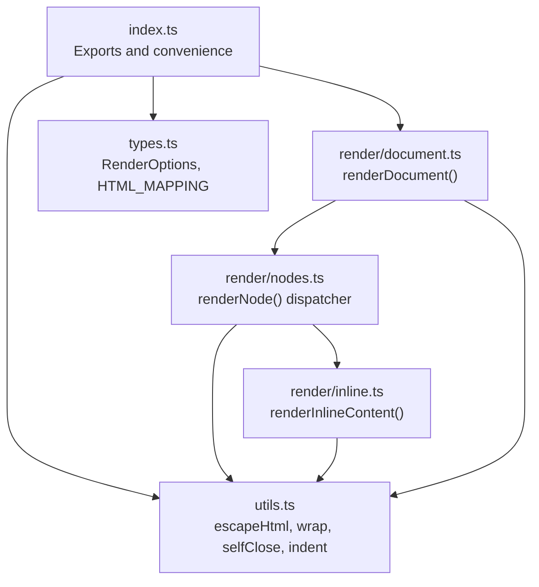
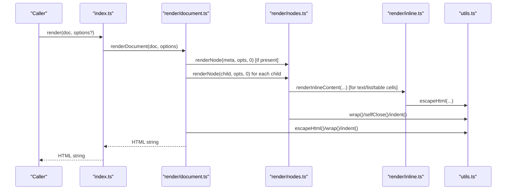
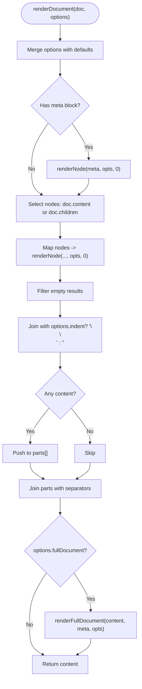
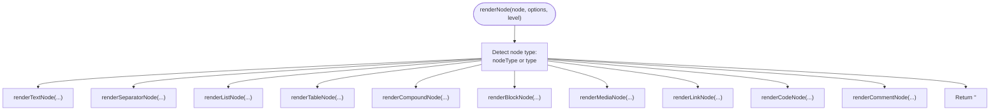
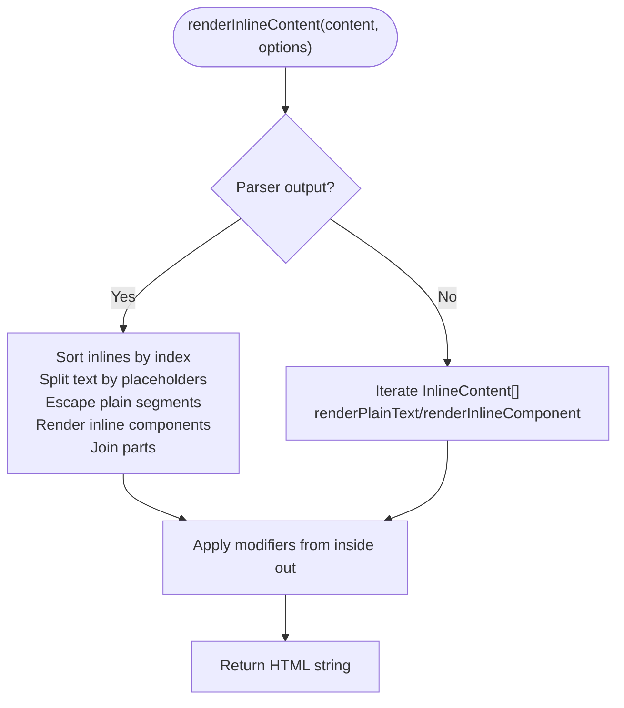
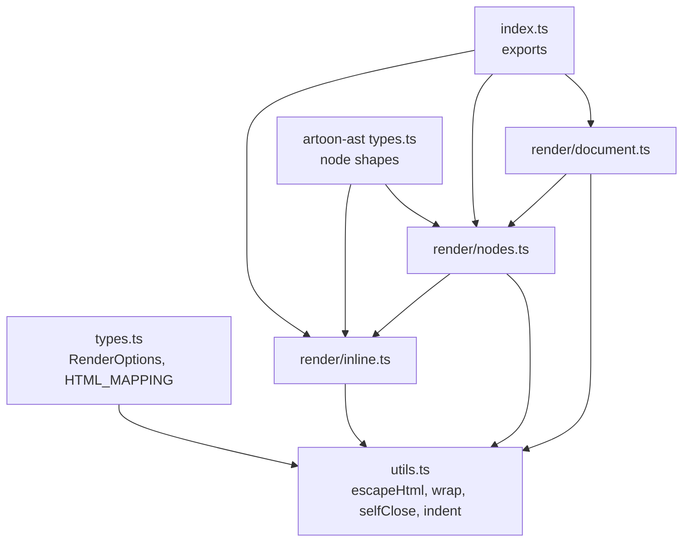

# HTML Rendering Pipeline

<cite>
**Referenced Files in This Document**
- [document.ts](file://artoon-renderer-html/src/render/document.ts)
- [nodes.ts](file://artoon-renderer-html/src/render/nodes.ts)
- [inline.ts](file://artoon-renderer-html/src/render/inline.ts)
- [index.ts](file://artoon-renderer-html/src/index.ts)
- [types.ts](file://artoon-renderer-html/src/types.ts)
- [utils.ts](file://artoon-renderer-html/src/utils.ts)
- [custom-blocks.test.ts](file://artoon-renderer-html/tests/custom-blocks.test.ts)
- [meta-rendering.test.ts](file://artoon-renderer-html/tests/meta-rendering.test.ts)
- [test-render.ts](file://artoon-renderer-html/test-render.ts)
- [types.ts](file://artoon-ast/src/types.ts)
</cite>

## Table of Contents
1. [Introduction](#introduction)
2. [Project Structure](#project-structure)
3. [Core Components](#core-components)
4. [Architecture Overview](#architecture-overview)
5. [Detailed Component Analysis](#detailed-component-analysis)
6. [Dependency Analysis](#dependency-analysis)
7. [Performance Considerations](#performance-considerations)
8. [Troubleshooting Guide](#troubleshooting-guide)
9. [Conclusion](#conclusion)

## Introduction
This document explains the HTML rendering pipeline that transforms ARTOON AST nodes into HTML markup. It focuses on the document-level rendering process, the node-by-node transformation logic, and inline content processing. It documents the renderDocument function, the renderNode dispatcher, and the renderInlineContent handlers. It also details how different node types (blocks, inline elements, compound components) are converted to HTML elements, provides examples of the rendering flow, describes custom node handlers, and outlines performance optimization techniques. Finally, it clarifies the relationship between AST structure and HTML output generation.

## Project Structure
The HTML renderer is implemented in the artoon-renderer-html package. The key modules are:
- Entry point exports and convenience functions
- Document-level rendering
- Node dispatchers and handlers for each node type
- Inline content processing
- Shared utilities and type definitions

**Diagram sources**
- [index.ts:1-57](file://artoon-renderer-html/src/index.ts#L1-L57)
- [document.ts:1-132](file://artoon-renderer-html/src/render/document.ts#L1-L132)
- [nodes.ts:1-755](file://artoon-renderer-html/src/render/nodes.ts#L1-L755)
- [inline.ts:1-324](file://artoon-renderer-html/src/render/inline.ts#L1-L324)
- [types.ts:1-187](file://artoon-renderer-html/src/types.ts#L1-L187)
- [utils.ts:1-80](file://artoon-renderer-html/src/utils.ts#L1-L80)

**Section sources**
- [index.ts:1-57](file://artoon-renderer-html/src/index.ts#L1-L57)
- [document.ts:1-132](file://artoon-renderer-html/src/render/document.ts#L1-L132)
- [nodes.ts:1-755](file://artoon-renderer-html/src/render/nodes.ts#L1-L755)
- [inline.ts:1-324](file://artoon-renderer-html/src/render/inline.ts#L1-L324)
- [types.ts:1-187](file://artoon-renderer-html/src/types.ts#L1-L187)
- [utils.ts:1-80](file://artoon-renderer-html/src/utils.ts#L1-L80)

## Core Components
- renderDocument: Orchestrates document-level rendering, handles optional META blocks, selects content nodes, and optionally wraps the output as a full HTML document.
- renderNode: Dispatches to specialized handlers based on node type, supporting both AST v2 canonical properties and legacy parser output compatibility.
- renderInlineContent: Processes inline content arrays or parser output formats, replacing placeholders with rendered inline components and applying modifiers.
- Utilities: Provide escaping, tag wrapping, self-closing tags, and indentation helpers.
- Types: Define rendering options, default behaviors, and HTML element mappings.

**Section sources**
- [document.ts:11-52](file://artoon-renderer-html/src/render/document.ts#L11-L52)
- [nodes.ts:37-57](file://artoon-renderer-html/src/render/nodes.ts#L37-L57)
- [inline.ts:18-71](file://artoon-renderer-html/src/render/inline.ts#L18-L71)
- [utils.ts:6-80](file://artoon-renderer-html/src/utils.ts#L6-L80)
- [types.ts:37-187](file://artoon-renderer-html/src/types.ts#L37-L187)

## Architecture Overview
The rendering pipeline follows a layered approach:
- Entry point exposes render(), renderFull(), and createRenderer().
- renderDocument builds the content and optionally wraps it in a full HTML document.
- renderNode acts as a dispatcher to specialized handlers per node category.
- renderInlineContent handles inline semantics and modifiers.
- Utilities encapsulate HTML-safe operations and formatting.

**Diagram sources**
- [index.ts:19-34](file://artoon-renderer-html/src/index.ts#L19-L34)
- [document.ts:11-52](file://artoon-renderer-html/src/render/document.ts#L11-L52)
- [nodes.ts:37-57](file://artoon-renderer-html/src/render/nodes.ts#L37-L57)
- [inline.ts:18-71](file://artoon-renderer-html/src/render/inline.ts#L18-L71)
- [utils.ts:6-80](file://artoon-renderer-html/src/utils.ts#L6-L80)

## Detailed Component Analysis

### Document-Level Rendering: renderDocument
Responsibilities:
- Merge META block (if present) and content nodes into a single HTML string.
- Support both AST v2 canonical properties and legacy parser output (children/content).
- Optionally produce a full HTML document with head/body and default styles.
- Respect indentation and separator preferences via options.

Key behaviors:
- META block detection and rendering via renderNode.
- Content iteration with filtering of empty results.
- Full document composition using renderHead/renderBody when enabled.

**Diagram sources**
- [document.ts:11-52](file://artoon-renderer-html/src/render/document.ts#L11-L52)

**Section sources**
- [document.ts:11-52](file://artoon-renderer-html/src/render/document.ts#L11-L52)

### Node Dispatcher: renderNode
Responsibilities:
- Dispatch to specialized handlers based on node type.
- Support both AST v2 canonical properties and legacy parser output compatibility.
- Centralized handler for all node categories.

Supported node types:
- text, separator, list, table, compound, block, media, link, code, comment.

**Diagram sources**
- [nodes.ts:37-57](file://artoon-renderer-html/src/render/nodes.ts#L37-L57)

**Section sources**
- [nodes.ts:37-57](file://artoon-renderer-html/src/render/nodes.ts#L37-L57)

### Inline Content Processing: renderInlineContent
Responsibilities:
- Handle parser output format with placeholders and inlines.
- Handle AST v2 inline content arrays.
- Replace placeholders with rendered inline components.
- Apply modifiers from inside out.

Processing modes:
- Parser output: { text, inlines } with placeholders like {0}, {1}.
- AST v2: array of InlineContent items.

**Diagram sources**
- [inline.ts:18-71](file://artoon-renderer-html/src/render/inline.ts#L18-L71)

**Section sources**
- [inline.ts:18-71](file://artoon-renderer-html/src/render/inline.ts#L18-L71)

### Text Nodes: renderTextNode
Responsibilities:
- Map textType to HTML tags using HTML_MAPPING.
- Render inline content for the text node.
- Handle special cases: time and abbr line components with custom parsing.
- Apply direction attributes when configured.

Key points:
- Uses renderInlineContent for content.
- Special handling for time and abbr with semicolon-separated values.

**Section sources**
- [nodes.ts:63-113](file://artoon-renderer-html/src/render/nodes.ts#L63-L113)
- [inline.ts:18-71](file://artoon-renderer-html/src/render/inline.ts#L18-L71)

### Lists: renderListNode and renderListItem
Responsibilities:
- Support mixed-type lists by grouping consecutive items of the same type.
- Render nested lists when present in list items.
- Apply direction attributes and optional indentation.

Key points:
- Mixed-type support: detect child items with different listType and group accordingly.
- Nested list rendering: create a virtual list node and render recursively.

**Section sources**
- [nodes.ts:153-258](file://artoon-renderer-html/src/render/nodes.ts#L153-L258)

### Tables: renderTableNode and renderTableRow
Responsibilities:
- Support both parser output (headers as string[], rows as string[][]) and AST v2 format.
- Render thead/tbody structure and apply direction attributes.

Key points:
- Parser format: convert string arrays to th/td cells.
- AST v2 format: iterate TableRow nodes and cells.

**Section sources**
- [nodes.ts:264-345](file://artoon-renderer-html/src/render/nodes.ts#L264-L345)

### Compound Components: renderCompoundNode
Responsibilities:
- Render figure and details with caption/summary handling.
- Support both AST v2 { role, node } and parser direct child formats.

Key points:
- For figure: render figcaption when role/caption detected.
- For details: render summary when role/summary detected.

**Section sources**
- [nodes.ts:351-417](file://artoon-renderer-html/src/render/nodes.ts#L351-L417)

### Block Nodes: renderBlockNode and Specialized Handlers
Responsibilities:
- Code blocks: render with pre/code and language class.
- Meta blocks: configurable handling modes (hide/tags/comment).
- Figure and details blocks: dedicated rendering with caption/summary.
- Custom blocks: flexible mapping with custom tag/class/attributes and hidden fields.

Key points:
- Reserved blocks (code, meta, figure, details) bypass custom mappings.
- Hidden fields are rendered as hidden elements with data-field attributes.

**Section sources**
- [nodes.ts:422-615](file://artoon-renderer-html/src/render/nodes.ts#L422-L615)
- [custom-blocks.test.ts:18-742](file://artoon-renderer-html/tests/custom-blocks.test.ts#L18-L742)

### Media and Links: renderMediaNode and renderLinkNode
Responsibilities:
- Media: img, audio, video, file with appropriate attributes.
- Links: anchor tags with URL and optional title, applying modifiers.

Key points:
- Media attributes include src, alt/title/dir.
- Link attributes include href/title/dir and modifier wrapping.

**Section sources**
- [nodes.ts:621-690](file://artoon-renderer-html/src/render/nodes.ts#L621-L690)

### Comments: renderCommentNode
Responsibilities:
- Conditional inclusion based on includeComments.
- Multiple display modes: hidden (HTML comment), editor-only, visible, collapsible.

**Section sources**
- [nodes.ts:712-739](file://artoon-renderer-html/src/render/nodes.ts#L712-L739)

### Inline Components: renderInlineComponent and Helpers
Responsibilities:
- Render inline components (a/img/audio/video/abbr/time/c) with attributes and modifiers.
- Handle both AST v2 inline components and parser output.

Key points:
- Modifiers applied from inside out.
- Code component supports language class.

**Section sources**
- [inline.ts:165-230](file://artoon-renderer-html/src/render/inline.ts#L165-L230)
- [inline.ts:235-324](file://artoon-renderer-html/src/render/inline.ts#L235-L324)

### Direction and Attributes: getDirectionAttrs
Responsibilities:
- Add dir attribute only when direction differs from default and includeDirection is enabled.

**Section sources**
- [nodes.ts:744-754](file://artoon-renderer-html/src/render/nodes.ts#L744-L754)

## Dependency Analysis
The renderer depends on:
- AST types for node shapes and content.
- Internal types for rendering options and HTML mappings.
- Utility functions for safe HTML generation and formatting.

**Diagram sources**
- [types.ts:37-187](file://artoon-renderer-html/src/types.ts#L37-L187)
- [utils.ts:6-80](file://artoon-renderer-html/src/utils.ts#L6-L80)
- [document.ts:1-132](file://artoon-renderer-html/src/render/document.ts#L1-L132)
- [nodes.ts:1-755](file://artoon-renderer-html/src/render/nodes.ts#L1-L755)
- [inline.ts:1-324](file://artoon-renderer-html/src/render/inline.ts#L1-L324)
- [index.ts:1-57](file://artoon-renderer-html/src/index.ts#L1-L57)
- [types.ts:1-200](file://artoon-ast/src/types.ts#L1-L200)

**Section sources**
- [types.ts:37-187](file://artoon-renderer-html/src/types.ts#L37-L187)
- [utils.ts:6-80](file://artoon-renderer-html/src/utils.ts#L6-L80)
- [document.ts:1-132](file://artoon-renderer-html/src/render/document.ts#L1-L132)
- [nodes.ts:1-755](file://artoon-renderer-html/src/render/nodes.ts#L1-L755)
- [inline.ts:1-324](file://artoon-renderer-html/src/render/inline.ts#L1-L324)
- [index.ts:1-57](file://artoon-renderer-html/src/index.ts#L1-L57)
- [types.ts:1-200](file://artoon-ast/src/types.ts#L1-L200)

## Performance Considerations
- Minimize string concatenations by using arrays and join with a single separator.
- Avoid unnecessary HTML escapes by checking content formats early (e.g., when parser output has no inlines).
- Use indentation only when needed to reduce memory overhead for large documents.
- Leverage filtering to skip empty node results before joining.
- Prefer batch operations (map/filter/join) over iterative string building.

[No sources needed since this section provides general guidance]

## Troubleshooting Guide
Common issues and resolutions:
- META block visibility: Configure metaHandling to hide/tags/comment depending on desired behavior.
- Custom block rendering: Ensure customBlocks mapping matches blockName and use defaultCustomBlockTag for fallback.
- Direction attributes: Enable includeDirection and set defaultDirection appropriately; getDirectionAttrs adds dir only when needed.
- Comments: Control includeComments and commentDisplay to manage visibility and format.
- Mixed-type lists: renderListNode groups consecutive items of the same type; verify listType values on items.
- Parser vs AST format: renderNode and renderInlineContent support both formats; ensure node properties align with the expected shape.

Validation references:
- Custom blocks behavior and edge cases.
- META block rendering modes and escaping.
- Example rendering flow with mixed list types.

**Section sources**
- [custom-blocks.test.ts:18-742](file://artoon-renderer-html/tests/custom-blocks.test.ts#L18-L742)
- [meta-rendering.test.ts:7-321](file://artoon-renderer-html/tests/meta-rendering.test.ts#L7-L321)
- [test-render.ts:1-34](file://artoon-renderer-html/test-render.ts#L1-L34)

## Conclusion
The ARTOON HTML rendering pipeline provides a robust, extensible system for converting ARTOON AST nodes into HTML. It supports both AST v2 canonical shapes and legacy parser output, offers flexible customization for custom blocks and inline components, and ensures safe HTML generation through utility functions. By understanding the roles of renderDocument, renderNode, and renderInlineContent—and by leveraging the provided options—the pipeline can be tailored to diverse output needs while maintaining performance and correctness.