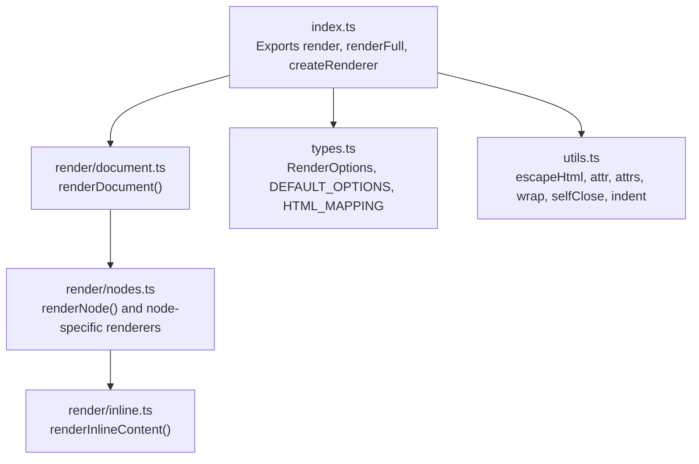
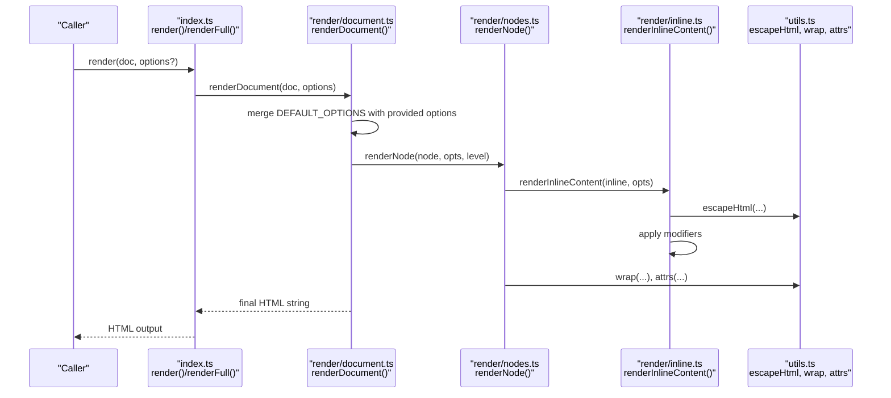
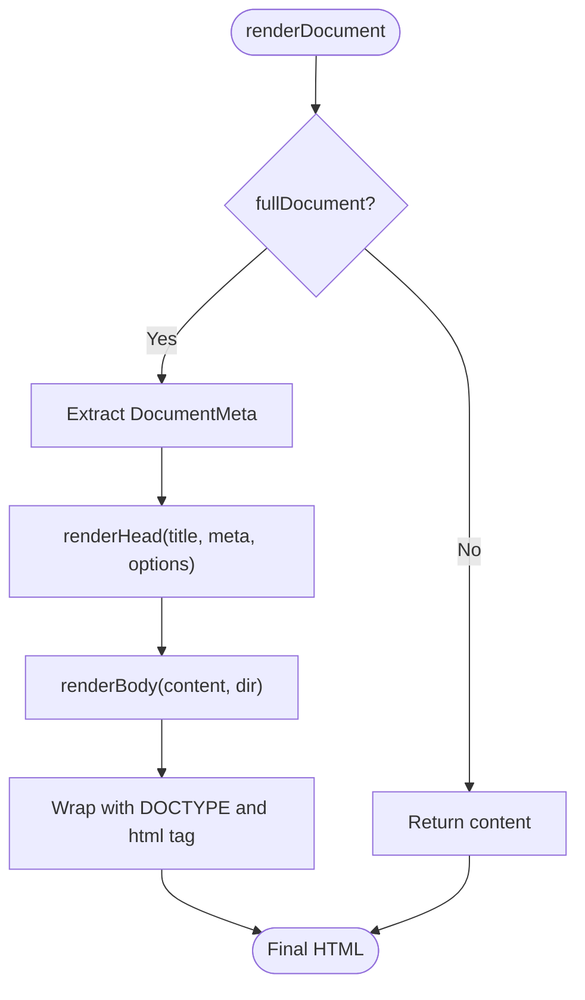
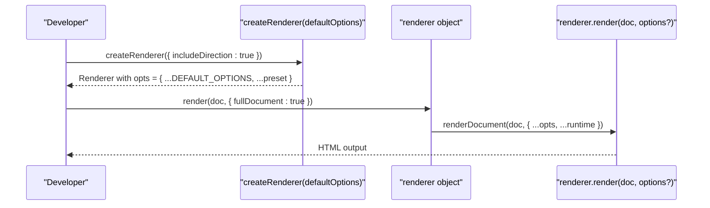
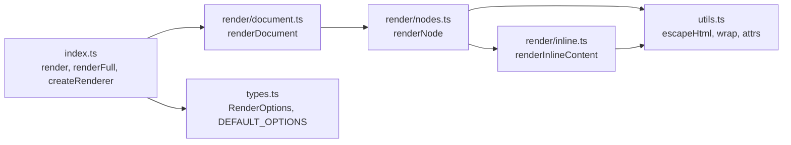

# Render Options and Configuration

<cite>
**Referenced Files in This Document**
- [types.ts](file://artoon-renderer-html/src/types.ts)
- [index.ts](file://artoon-renderer-html/src/index.ts)
- [document.ts](file://artoon-renderer-html/src/render/document.ts)
- [nodes.ts](file://artoon-renderer-html/src/render/nodes.ts)
- [inline.ts](file://artoon-renderer-html/src/render/inline.ts)
- [utils.ts](file://artoon-renderer-html/src/utils.ts)
- [README.md](file://artoon-renderer-html/README.md)
- [meta-rendering.test.ts](file://artoon-renderer-html/tests/meta-rendering.test.ts)
- [custom-blocks.test.ts](file://artoon-renderer-html/tests/custom-blocks.test.ts)
- [comment-display.test.ts](file://artoon-renderer-html/tests/comment-display.test.ts)
</cite>

## Table of Contents
1. [Introduction](#introduction)
2. [Project Structure](#project-structure)
3. [Core Components](#core-components)
4. [Architecture Overview](#architecture-overview)
5. [Detailed Component Analysis](#detailed-component-analysis)
6. [Dependency Analysis](#dependency-analysis)
7. [Performance Considerations](#performance-considerations)
8. [Troubleshooting Guide](#troubleshooting-guide)
9. [Conclusion](#conclusion)
10. [Appendices](#appendices)

## Introduction
This document explains the HTML renderer configuration options and render settings for the ARTOON HTML renderer. It covers the RenderOptions interface, DEFAULT_OPTIONS, and all available configuration parameters. You will learn how to control full document generation, theme-like styling via CSS prefixes and semantic classes, attribute handling, and output formatting. Practical examples demonstrate custom renderer instances, option inheritance, and runtime configuration. We also address option validation, default value behavior, and migration considerations for option changes.

## Project Structure
The HTML renderer is implemented in the artoon-renderer-html package. Key areas:
- Types and defaults: RenderOptions, DEFAULT_OPTIONS, and HTML mapping
- Entry points: render(), renderFull(), createRenderer()
- Rendering pipeline: document rendering, node rendering, inline content rendering
- Utilities: HTML escaping, attribute building, indentation

**Diagram sources**
- [index.ts:16-57](file://artoon-renderer-html/src/index.ts#L16-L57)
- [document.ts:11-52](file://artoon-renderer-html/src/render/document.ts#L11-L52)
- [nodes.ts:37-57](file://artoon-renderer-html/src/render/nodes.ts#L37-L57)
- [inline.ts:18-71](file://artoon-renderer-html/src/render/inline.ts#L18-L71)
- [types.ts:37-117](file://artoon-renderer-html/src/types.ts#L37-L117)
- [utils.ts:6-80](file://artoon-renderer-html/src/utils.ts#L6-L80)

**Section sources**
- [index.ts:16-57](file://artoon-renderer-html/src/index.ts#L16-L57)
- [types.ts:37-117](file://artoon-renderer-html/src/types.ts#L37-L117)

## Core Components
- RenderOptions: The configuration interface controlling rendering behavior
- DEFAULT_OPTIONS: The baseline configuration used when no options are provided
- HTML_MAPPING: Static mapping from ARTOON node types to HTML tags

Key responsibilities:
- Control whether to emit a full HTML document wrapper
- Manage direction attributes and default direction
- Control indentation and spacing
- Decide how comments are emitted and which tag to use
- Choose how META blocks are handled
- Configure custom block mappings and default tag/class/attributes
- Adjust CSS class prefix and semantic classes

**Section sources**
- [types.ts:37-98](file://artoon-renderer-html/src/types.ts#L37-L98)
- [types.ts:103-117](file://artoon-renderer-html/src/types.ts#L103-L117)
- [types.ts:122-186](file://artoon-renderer-html/src/types.ts#L122-L186)

## Architecture Overview
The renderer composes a document from nodes and inline content, applying options at each stage. The flow below maps to actual source files.

**Diagram sources**
- [index.ts:19-34](file://artoon-renderer-html/src/index.ts#L19-L34)
- [document.ts:11-52](file://artoon-renderer-html/src/render/document.ts#L11-L52)
- [nodes.ts:37-57](file://artoon-renderer-html/src/render/nodes.ts#L37-L57)
- [inline.ts:18-71](file://artoon-renderer-html/src/render/inline.ts#L18-L71)
- [utils.ts:6-31](file://artoon-renderer-html/src/utils.ts#L6-L31)

## Detailed Component Analysis

### RenderOptions Interface and Defaults
RenderOptions defines all configuration knobs. DEFAULT_OPTIONS provides safe defaults for production-ready output.

- fullDocument: Whether to wrap output in html/head/body
- title: Document title used when fullDocument is enabled
- includeDirection: Whether to emit dir attributes
- defaultDirection: Default direction used to decide when to emit dir
- indent: Whether to format output with newlines and indentation
- indentSize: Number of spaces per indentation level
- includeComments: Whether to include comment nodes in output
- commentDisplay: How to render comments (hidden, editor-only, visible, collapsible)
- commentTag: HTML tag to use for visible/editor-only comments
- metaHandling: How to render META blocks (hide, tags, comment)
- customBlocks: Array of custom block mappings
- defaultCustomBlockTag: Fallback tag for unmapped custom blocks
- classPrefix: Prefix for generated CSS classes
- addSemanticClasses: Whether to add semantic classes

DEFAULT_OPTIONS sets conservative defaults suitable for most use cases:
- fullDocument: false
- includeDirection: true
- defaultDirection: 'rtl'
- indent: true
- indentSize: 2
- includeComments: false
- commentDisplay: 'hidden'
- commentTag: 'div'
- metaHandling: 'hide'
- customBlocks: []
- defaultCustomBlockTag: 'div'
- classPrefix: 'artoon-'
- addSemanticClasses: false

Validation and behavior:
- Options are shallow merged with DEFAULT_OPTIONS during renderDocument
- Direction attributes are only emitted when includeDirection is true and differs from defaultDirection
- Comments are omitted unless includeComments is true
- META blocks are hidden by default; metaHandling controls behavior
- Custom block mappings are matched by blockName and support custom tag/class/attributes

**Section sources**
- [types.ts:37-98](file://artoon-renderer-html/src/types.ts#L37-L98)
- [types.ts:103-117](file://artoon-renderer-html/src/types.ts#L103-L117)
- [document.ts:15](file://artoon-renderer-html/src/render/document.ts#L15)
- [nodes.ts:744-754](file://artoon-renderer-html/src/render/nodes.ts#L744-L754)

### Full Document Generation
When fullDocument is true, the renderer emits a complete HTML document with head and body. The head includes:
- charset meta
- viewport meta
- title (from options.title or DocumentMeta.title)
- description, author, tags meta (from DocumentMeta)
- default CSS for RTL/LTR alignment, code blocks, tables, quotes, figures

The body wraps the rendered content with dir attribute derived from DocumentMeta.dir or defaultDirection.

**Diagram sources**
- [document.ts:43-74](file://artoon-renderer-html/src/render/document.ts#L43-L74)
- [document.ts:79-122](file://artoon-renderer-html/src/render/document.ts#L79-L122)
- [document.ts:127-131](file://artoon-renderer-html/src/render/document.ts#L127-L131)

**Section sources**
- [document.ts:43-74](file://artoon-renderer-html/src/render/document.ts#L43-L74)
- [document.ts:79-122](file://artoon-renderer-html/src/render/document.ts#L79-L122)
- [document.ts:127-131](file://artoon-renderer-html/src/render/document.ts#L127-L131)

### Theme Selection and Output Formatting
Theme-like styling is controlled via:
- classPrefix: Adds a consistent prefix to generated classes
- addSemanticClasses: Enables semantic class names for better styling hooks
- defaultCustomBlockTag and customBlocks: Allow mapping custom blocks to semantic HTML tags

Formatting is controlled by:
- indent and indentSize: Controls whitespace and indentation
- includeDirection and defaultDirection: Emit dir attributes conditionally

These options influence:
- Browser compatibility: dir attributes improve RTL/LTR handling
- Styling flexibility: classPrefix and semantic classes enable consistent CSS
- Output readability: indent improves human readability

**Section sources**
- [types.ts:93-98](file://artoon-renderer-html/src/types.ts#L93-L98)
- [nodes.ts:462-476](file://artoon-renderer-html/src/render/nodes.ts#L462-L476)
- [nodes.ts:744-754](file://artoon-renderer-html/src/render/nodes.ts#L744-L754)

### Attribute Handling
Attributes are built safely:
- attr() and attrs() escape values and skip undefined or empty values
- wrap() and selfClose() construct tags with attributes
- getDirectionAttrs() adds dir only when needed

This ensures:
- Security: HTML escaping prevents XSS
- Consistency: Attributes are omitted when undefined
- Minimal markup: Only necessary attributes are emitted

**Section sources**
- [utils.ts:18-31](file://artoon-renderer-html/src/utils.ts#L18-L31)
- [utils.ts:55-71](file://artoon-renderer-html/src/utils.ts#L55-L71)
- [nodes.ts:744-754](file://artoon-renderer-html/src/render/nodes.ts#L744-L754)

### Output Formatting
Indentation is applied selectively:
- Lists, tables, and compound nodes receive indentation when options.indent is true
- Indentation size is configurable via indentSize
- Newlines separate top-level parts when not indenting

This balances readability and compactness depending on consumer needs.

**Section sources**
- [nodes.ts:172-175](file://artoon-renderer-html/src/render/nodes.ts#L172-L175)
- [nodes.ts:294-297](file://artoon-renderer-html/src/render/nodes.ts#L294-L297)
- [nodes.ts:344](file://artoon-renderer-html/src/render/nodes.ts#L344)
- [nodes.ts:257](file://artoon-renderer-html/src/render/nodes.ts#L257)

### Custom Renderer Instances and Option Inheritance
The createRenderer factory builds a renderer with preset options. Runtime options override the preset.

**Diagram sources**
- [index.ts:39-51](file://artoon-renderer-html/src/index.ts#L39-L51)
- [document.ts:15](file://artoon-renderer-html/src/render/document.ts#L15)

**Section sources**
- [index.ts:39-51](file://artoon-renderer-html/src/index.ts#L39-L51)
- [document.ts:15](file://artoon-renderer-html/src/render/document.ts#L15)

### Runtime Configuration Examples
- Enable full document with a custom title
- Switch META handling to tags or comments
- Map custom blocks to semantic tags and classes
- Change comment display mode and tag
- Toggle direction attributes and default direction

Examples are validated by tests covering:
- META block rendering modes
- Custom block mapping and hidden fields
- Comment display modes and tags

**Section sources**
- [README.md:34-51](file://artoon-renderer-html/README.md#L34-L51)
- [README.md:140-150](file://artoon-renderer-html/README.md#L140-L150)
- [meta-rendering.test.ts:8-85](file://artoon-renderer-html/tests/meta-rendering.test.ts#L8-L85)
- [custom-blocks.test.ts:80-167](file://artoon-renderer-html/tests/custom-blocks.test.ts#L80-L167)
- [comment-display.test.ts:18-42](file://artoon-renderer-html/tests/comment-display.test.ts#L18-L42)

### Impact on Rendering Performance, Output Format, and Browser Compatibility
- Performance: Enabling indent increases string concatenation and newline processing. For large documents, disabling indent reduces memory overhead.
- Output format: fullDocument produces a complete HTML page; without it, consumers embed the output in existing pages.
- Browser compatibility: dir attributes improve RTL/LTR handling. Default CSS in fullDocument helps align content across browsers.

**Section sources**
- [document.ts:105-117](file://artoon-renderer-html/src/render/document.ts#L105-L117)
- [nodes.ts:744-754](file://artoon-renderer-html/src/render/nodes.ts#L744-L754)

### Option Validation, Default Value Behavior, and Migration Considerations
- Validation: Options are shallow merged with DEFAULT_OPTIONS; invalid keys are ignored. Direction and comment options are validated by their respective renderers.
- Default value behavior: Defaults are conservative (no full document, comments hidden, indent enabled). Changing defaults affects all subsequent renders unless overridden.
- Migration considerations:
  - If migrating from older versions, review customBlocks and commentDisplay defaults. The new defaults hide comments and META by default.
  - When enabling fullDocument, ensure DocumentMeta is populated to control title and metadata.
  - When changing defaultDirection, verify that your CSS handles both directions consistently.

**Section sources**
- [document.ts:15](file://artoon-renderer-html/src/render/document.ts#L15)
- [nodes.ts:744-754](file://artoon-renderer-html/src/render/nodes.ts#L744-L754)
- [README.md:53-139](file://artoon-renderer-html/README.md#L53-L139)

## Dependency Analysis
The renderer’s configuration is consumed across modules. The diagram below shows how options flow from the entry point to rendering logic.

**Diagram sources**
- [index.ts:19-34](file://artoon-renderer-html/src/index.ts#L19-L34)
- [document.ts:11-52](file://artoon-renderer-html/src/render/document.ts#L11-L52)
- [nodes.ts:37-57](file://artoon-renderer-html/src/render/nodes.ts#L37-L57)
- [inline.ts:18-71](file://artoon-renderer-html/src/render/inline.ts#L18-L71)
- [types.ts:37-117](file://artoon-renderer-html/src/types.ts#L37-L117)
- [utils.ts:6-31](file://artoon-renderer-html/src/utils.ts#L6-L31)

**Section sources**
- [index.ts:19-34](file://artoon-renderer-html/src/index.ts#L19-L34)
- [document.ts:11-52](file://artoon-renderer-html/src/render/document.ts#L11-L52)
- [nodes.ts:37-57](file://artoon-renderer-html/src/render/nodes.ts#L37-L57)
- [inline.ts:18-71](file://artoon-renderer-html/src/render/inline.ts#L18-L71)
- [types.ts:37-117](file://artoon-renderer-html/src/types.ts#L37-L117)
- [utils.ts:6-31](file://artoon-renderer-html/src/utils.ts#L6-L31)

## Performance Considerations
- Disable indent for large outputs to reduce memory and CPU usage.
- Prefer defaultCustomBlockTag and minimal customBlocks to avoid complex mapping logic.
- Avoid excessive nesting in custom blocks to keep rendering linear.

## Troubleshooting Guide
Common issues and resolutions:
- META blocks not appearing: Ensure metaHandling is not 'hide'. Use 'tags' or 'comment' to surface metadata.
- Comments missing: Set includeComments to true and choose a commentDisplay mode.
- Unexpected dir attributes: Verify includeDirection and defaultDirection. dir is only emitted when it differs from defaultDirection.
- Custom block classes not applied: Confirm customBlocks mapping includes the block name and desired className.

Validation references:
- META rendering modes and escaping
- Custom block mapping and hidden fields
- Comment display modes and tags

**Section sources**
- [meta-rendering.test.ts:8-85](file://artoon-renderer-html/tests/meta-rendering.test.ts#L8-L85)
- [custom-blocks.test.ts:80-167](file://artoon-renderer-html/tests/custom-blocks.test.ts#L80-L167)
- [comment-display.test.ts:18-42](file://artoon-renderer-html/tests/comment-display.test.ts#L18-L42)

## Conclusion
The ARTOON HTML renderer exposes a comprehensive configuration surface through RenderOptions and DEFAULT_OPTIONS. By combining full document generation, direction handling, comment and META policies, and custom block mapping, you can tailor output for diverse environments. Use createRenderer to establish presets and override at runtime. Follow the validation and migration guidance to ensure smooth upgrades and secure output.

## Appendices

### RenderOptions Reference
- fullDocument: boolean
- title: string
- includeDirection: boolean
- defaultDirection: 'rtl' | 'ltr'
- indent: boolean
- indentSize: number
- includeComments: boolean
- commentDisplay: 'hidden' | 'editor-only' | 'visible' | 'collapsible'
- commentTag: 'div' | 'aside' | 'span' | 'section'
- metaHandling: 'hide' | 'tags' | 'comment'
- customBlocks: Array of CustomBlockMapping
- defaultCustomBlockTag: string
- classPrefix: string
- addSemanticClasses: boolean

**Section sources**
- [types.ts:37-98](file://artoon-renderer-html/src/types.ts#L37-L98)

### Example Workflows
- Full document with metadata: Use renderFull with title and DocumentMeta.
- Custom block semantics: Define customBlocks to map to semantic tags and classes.
- Comment visibility: Choose includeComments and commentDisplay to match your workflow.
- Direction-aware output: Set includeDirection and defaultDirection to control dir attributes.

**Section sources**
- [README.md:34-51](file://artoon-renderer-html/README.md#L34-L51)
- [README.md:140-150](file://artoon-renderer-html/README.md#L140-L150)
- [document.ts:43-74](file://artoon-renderer-html/src/render/document.ts#L43-L74)