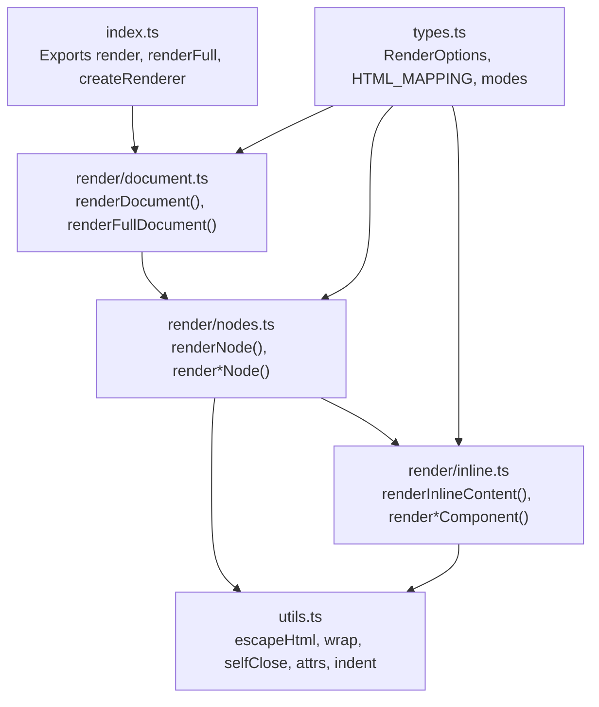
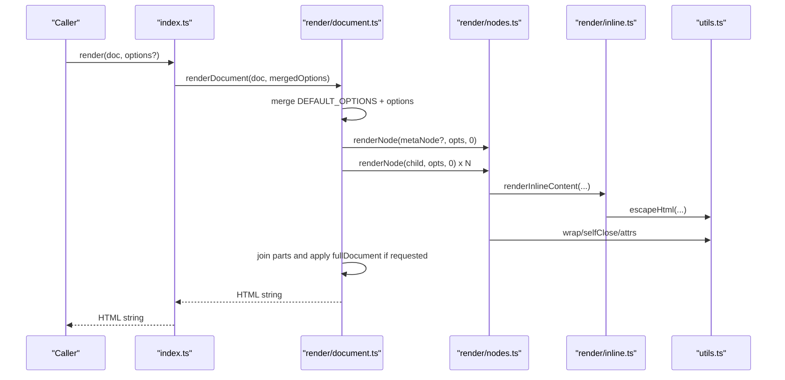
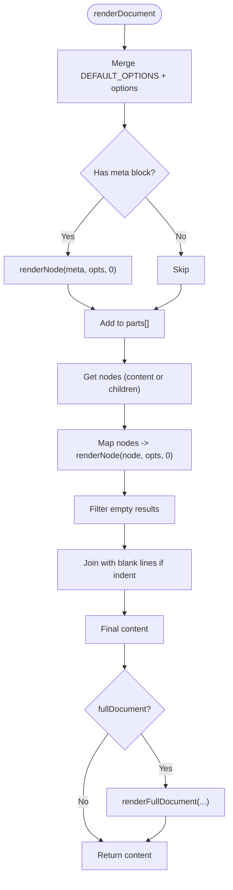
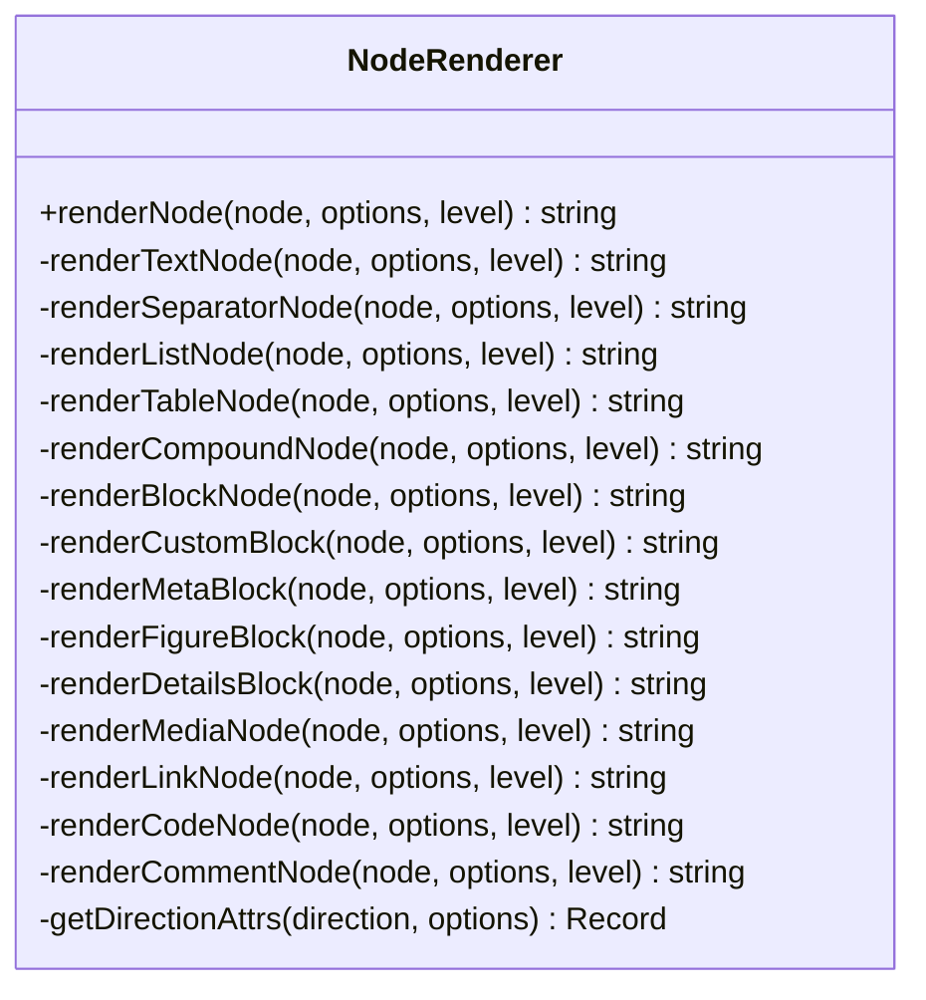
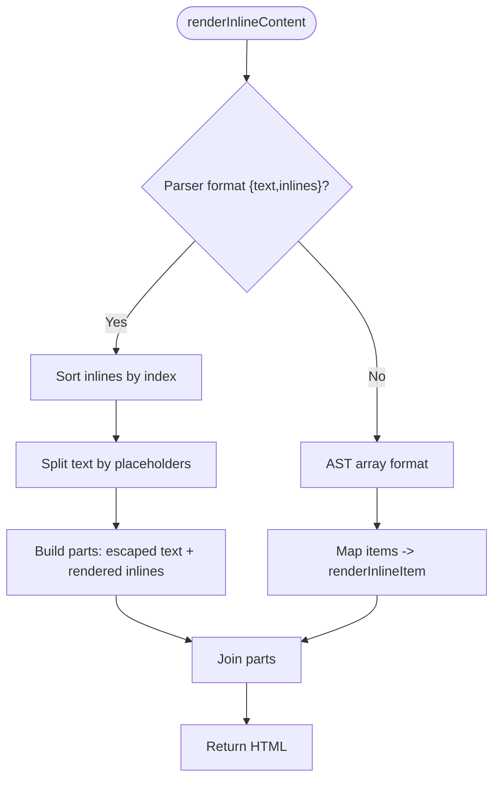
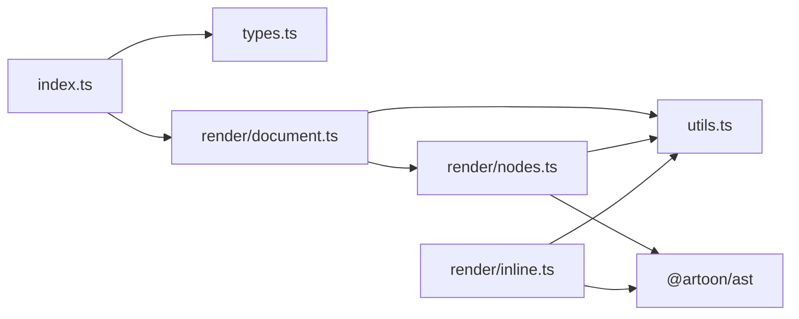

# Renderer-HTML Package

<cite>
**Referenced Files in This Document**
- [index.ts](file://artoon-renderer-html/src/index.ts)
- [document.ts](file://artoon-renderer-html/src/render/document.ts)
- [nodes.ts](file://artoon-renderer-html/src/render/nodes.ts)
- [inline.ts](file://artoon-renderer-html/src/render/inline.ts)
- [types.ts](file://artoon-renderer-html/src/types.ts)
- [utils.ts](file://artoon-renderer-html/src/utils.ts)
- [package.json](file://artoon-renderer-html/package.json)
- [README.md](file://artoon-renderer-html/README.md)
- [test-render.ts](file://artoon-renderer-html/test-render.ts)
</cite>

## Table of Contents
1. [Introduction](#introduction)
2. [Project Structure](#project-structure)
3. [Core Components](#core-components)
4. [Architecture Overview](#architecture-overview)
5. [Detailed Component Analysis](#detailed-component-analysis)
6. [Dependency Analysis](#dependency-analysis)
7. [Performance Considerations](#performance-considerations)
8. [Security Considerations](#security-considerations)
9. [Accessibility Features](#accessibility-features)
10. [Theme System and Styling](#theme-system-and-styling)
11. [Utility Functions](#utility-functions)
12. [Examples and Integration](#examples-and-integration)
13. [Troubleshooting Guide](#troubleshooting-guide)
14. [Conclusion](#conclusion)

## Introduction
The ARTOON HTML Renderer package transforms ARTOON documents into HTML markup. It supports both AST and parser output formats, handles document-level wrappers, inline content rendering, and a wide range of component types including text, lists, tables, media, links, code, comments, and compound blocks. It also provides options for direction handling, indentation, META block processing, and custom block mapping.

## Project Structure
The package exposes a small, focused API surface with clear separation of concerns:
- Entry point exports rendering functions and utilities
- Document renderer handles top-level document assembly and optional full HTML document wrapping
- Node renderer dispatches to specialized handlers for each node type
- Inline renderer processes inline content arrays and parser-produced inline structures
- Types define rendering options, mappings, and modes
- Utilities provide HTML escaping, attribute construction, and formatting helpers

**Diagram sources**
- [index.ts:1-57](file://artoon-renderer-html/src/index.ts#L1-L57)
- [document.ts:1-132](file://artoon-renderer-html/src/render/document.ts#L1-L132)
- [nodes.ts:1-755](file://artoon-renderer-html/src/render/nodes.ts#L1-L755)
- [inline.ts:1-324](file://artoon-renderer-html/src/render/inline.ts#L1-L324)
- [types.ts:1-187](file://artoon-renderer-html/src/types.ts#L1-L187)
- [utils.ts:1-80](file://artoon-renderer-html/src/utils.ts#L1-L80)

**Section sources**
- [index.ts:1-57](file://artoon-renderer-html/src/index.ts#L1-L57)
- [document.ts:1-132](file://artoon-renderer-html/src/render/document.ts#L1-L132)
- [nodes.ts:1-755](file://artoon-renderer-html/src/render/nodes.ts#L1-L755)
- [inline.ts:1-324](file://artoon-renderer-html/src/render/inline.ts#L1-L324)
- [types.ts:1-187](file://artoon-renderer-html/src/types.ts#L1-L187)
- [utils.ts:1-80](file://artoon-renderer-html/src/utils.ts#L1-L80)

## Core Components
- render(): Top-level function delegating to renderDocument
- renderFull(): Wrapper around renderDocument enabling full HTML document output
- createRenderer(): Factory returning a renderer instance with preset options
- renderDocument(): Orchestrates document-level rendering, handles META blocks, content iteration, and optional full document wrapper
- renderNode(): Dispatches to specialized node renderers based on node type
- renderInlineContent(): Processes inline content arrays and parser-produced inline structures
- Utilities: escapeHtml, wrap, selfClose, attrs, indent

Key options include:
- fullDocument, title, includeDirection, defaultDirection, indent, indentSize, includeComments, commentDisplay, commentTag, metaHandling, customBlocks, defaultCustomBlockTag, classPrefix, addSemanticClasses

**Section sources**
- [index.ts:16-57](file://artoon-renderer-html/src/index.ts#L16-L57)
- [document.ts:11-52](file://artoon-renderer-html/src/render/document.ts#L11-L52)
- [nodes.ts:37-57](file://artoon-renderer-html/src/render/nodes.ts#L37-L57)
- [inline.ts:18-71](file://artoon-renderer-html/src/render/inline.ts#L18-L71)
- [types.ts:37-98](file://artoon-renderer-html/src/types.ts#L37-L98)

## Architecture Overview
The rendering pipeline follows a layered approach:
- Entry point validates and merges options
- Document renderer prepares parts, renders META if present, iterates content nodes, and optionally wraps into a full HTML document
- Node renderer selects handler by node type, supporting both AST and parser output formats
- Inline renderer resolves placeholders and applies modifiers
- Utilities provide safe HTML emission and formatting

**Diagram sources**
- [index.ts:19-34](file://artoon-renderer-html/src/index.ts#L19-L34)
- [document.ts:11-52](file://artoon-renderer-html/src/render/document.ts#L11-L52)
- [nodes.ts:37-57](file://artoon-renderer-html/src/render/nodes.ts#L37-L57)
- [inline.ts:18-71](file://artoon-renderer-html/src/render/inline.ts#L18-L71)
- [utils.ts:6-13](file://artoon-renderer-html/src/utils.ts#L6-L13)

## Detailed Component Analysis

### Document Rendering
- Handles META block detection and rendering when present
- Supports both AST content and parser children arrays
- Joins rendered nodes with optional blank-line separation
- Full document mode builds head/body with default styles and direction attributes

**Diagram sources**
- [document.ts:11-52](file://artoon-renderer-html/src/render/document.ts#L11-L52)

**Section sources**
- [document.ts:11-132](file://artoon-renderer-html/src/render/document.ts#L11-L132)

### Node Renderers
- renderNode(): Dispatches to render*Node() based on nodeType/componentType
- renderTextNode(): Maps textType to HTML tags, renders inline content, applies direction attributes, special-cases time and abbr
- renderSeparatorNode(): Handles separatorType, separators array, and componentType
- renderListNode(): Supports mixed-type items by grouping consecutive same-type items
- renderTableNode(): Supports both parser (headers as strings, rows as strings) and AST (TableRow[]) formats
- renderCompoundNode(): Renders figure/details with caption/summary handling
- renderBlockNode(): Delegates to code/meta/figure/details/custom renderers
- renderCustomBlock(): Applies custom block mapping with fallbacks and hidden fields
- renderMetaBlock(): Implements hide/tags/comment modes
- renderFigureBlock(): Renders figure with optional figcaption
- renderDetailsBlock(): Renders details with summary
- renderMediaNode(): Renders img/audio/video/file
- renderLinkNode(): Builds anchor with modifiers applied
- renderCodeNode(): Renders inline code with optional language class
- renderCommentNode(): Implements comment display modes with includeComments guard

**Diagram sources**
- [nodes.ts:37-755](file://artoon-renderer-html/src/render/nodes.ts#L37-L755)

**Section sources**
- [nodes.ts:37-755](file://artoon-renderer-html/src/render/nodes.ts#L37-L755)

### Inline Content Rendering
- renderInlineContent(): Supports both AST arrays and parser { text, inlines } format
- renderParserInline(): Processes placeholders, renders components (a/img/c/time/abbr), applies modifiers
- renderInlineItem(): Dispatches to plain text or inline component
- wrapWithModifiers(): Applies modifiers from inside out

**Diagram sources**
- [inline.ts:18-135](file://artoon-renderer-html/src/render/inline.ts#L18-L135)

**Section sources**
- [inline.ts:18-324](file://artoon-renderer-html/src/render/inline.ts#L18-L324)

### Direction Handling
- getDirectionAttrs(): Adds dir attribute only when direction differs from default and includeDirection is enabled
- Applied across text, lists, tables, compound blocks, and media nodes

**Section sources**
- [nodes.ts:744-754](file://artoon-renderer-html/src/render/nodes.ts#L744-L754)
- [document.ts:79-122](file://artoon-renderer-html/src/render/document.ts#L79-L122)

## Dependency Analysis
- Internal dependencies:
  - index.ts depends on render/document.ts and types.ts
  - render/document.ts depends on utils.ts and render/nodes.ts
  - render/nodes.ts depends on @artoon/ast types and utils.ts
  - render/inline.ts depends on @artoon/ast types and utils.ts
  - types.ts defines HTML_MAPPING and RenderOptions
  - utils.ts provides shared helpers
- External dependency:
  - @artoon/ast (AST types)

**Diagram sources**
- [index.ts:3-5](file://artoon-renderer-html/src/index.ts#L3-L5)
- [document.ts:3-6](file://artoon-renderer-html/src/render/document.ts#L3-L6)
- [nodes.ts:3-31](file://artoon-renderer-html/src/render/nodes.ts#L3-L31)
- [inline.ts:3-12](file://artoon-renderer-html/src/render/inline.ts#L3-L12)
- [types.ts:1-187](file://artoon-renderer-html/src/types.ts#L1-L187)
- [utils.ts:1-80](file://artoon-renderer-html/src/utils.ts#L1-L80)

**Section sources**
- [package.json:15-25](file://artoon-renderer-html/package.json#L15-L25)

## Performance Considerations
- Minimal allocations: Uses string arrays and join for concatenation
- Conditional rendering: Skips empty results and unused branches
- Indentation: Optional with configurable size to balance readability vs. payload
- Mixed-type lists: Grouping avoids redundant container tags
- Inline processing: Single-pass placeholder replacement with sorted indices

[No sources needed since this section provides general guidance]

## Security Considerations
- All user-provided content is HTML-escaped via escapeHtml
- Attributes are sanitized via attr and attrs helpers
- Inline content preserves already-rendered HTML segments while escaping text parts
- META blocks can be hidden or emitted as comments to avoid unintended exposure

**Section sources**
- [utils.ts:6-13](file://artoon-renderer-html/src/utils.ts#L6-L13)
- [inline.ts:48-62](file://artoon-renderer-html/src/render/inline.ts#L48-L62)
- [nodes.ts:530-554](file://artoon-renderer-html/src/render/nodes.ts#L530-L554)

## Accessibility Features
- Direction handling via dir attributes improves reading order for RTL/LTR contexts
- Semantic HTML tags derived from ARTOON mappings (h1–h6, blockquote, pre, table, code, abbr, time)
- Caption and summary roles for figure and details enhance comprehension
- Default styles include readable typography and table formatting

**Section sources**
- [document.ts:104-117](file://artoon-renderer-html/src/render/document.ts#L104-L117)
- [nodes.ts:351-417](file://artoon-renderer-html/src/render/nodes.ts#L351-L417)

## Theme System and Styling
- The renderer itself focuses on structural HTML emission and does not ship CSS. Default styles are embedded in full document mode for basic readability.
- Direction handling integrates with CSS directionality via dir attributes.
- Custom block mapping allows associating block names with semantic tags and classes, enabling downstream CSS theming.
- Comments and META blocks can be hidden or emitted as comments to keep presentation clean.

**Section sources**
- [document.ts:104-117](file://artoon-renderer-html/src/render/document.ts#L104-L117)
- [nodes.ts:457-514](file://artoon-renderer-html/src/render/nodes.ts#L457-L514)
- [nodes.ts:519-554](file://artoon-renderer-html/src/render/nodes.ts#L519-L554)

## Utility Functions
- escapeHtml: Safe HTML entity encoding
- wrap/openTag/closeTag/selfClose: Tag construction helpers
- attrs/attr: Attribute serialization
- indent: Multi-line indentation

These utilities are used pervasively across renderers to ensure correctness and consistency.

**Section sources**
- [utils.ts:6-80](file://artoon-renderer-html/src/utils.ts#L6-L80)

## Examples and Integration
- Basic usage with parser and AST transformation
- Full document rendering with title and direction
- Custom renderer instances with preset options
- Mixed-type list rendering
- META block handling modes (hide/tags/comment)
- Direction-aware rendering

See the README examples and the included test file for practical usage patterns.

**Section sources**
- [README.md:11-32](file://artoon-renderer-html/README.md#L11-L32)
- [README.md:140-150](file://artoon-renderer-html/README.md#L140-L150)
- [README.md:53-138](file://artoon-renderer-html/README.md#L53-L138)
- [test-render.ts:1-34](file://artoon-renderer-html/test-render.ts#L1-L34)

## Troubleshooting Guide
- Empty output: Verify that content is provided under either content or children and that nodes are not filtered out by options (e.g., includeComments false hides comments)
- Incorrect direction: Ensure includeDirection is true and defaultDirection matches your expectation
- META blocks missing: Confirm metaHandling mode and that META blocks are present in the AST
- Inline placeholders not resolved: Ensure parser format includes proper placeholders and indices
- Custom blocks not styled: Provide customBlocks mapping with appropriate tag/class

**Section sources**
- [document.ts:19-51](file://artoon-renderer-html/src/render/document.ts#L19-L51)
- [nodes.ts:717-739](file://artoon-renderer-html/src/render/nodes.ts#L717-L739)
- [inline.ts:22-71](file://artoon-renderer-html/src/render/inline.ts#L22-L71)
- [types.ts:37-98](file://artoon-renderer-html/src/types.ts#L37-L98)

## Conclusion
The ARTOON HTML Renderer provides a robust, extensible pipeline for converting ARTOON documents into HTML. Its design emphasizes compatibility with both AST and parser outputs, safety via escaping, configurability through options, and maintainability through modular renderers and utilities. With direction handling, inline processing, and custom block mapping, it supports diverse authoring and publishing needs while keeping output clean and accessible.